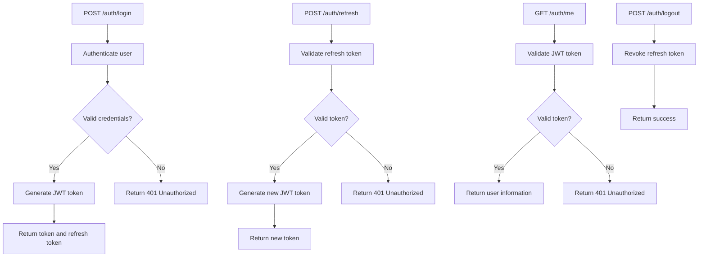
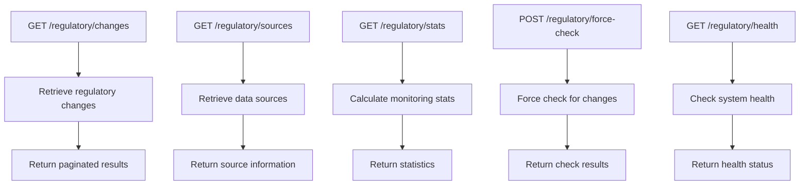
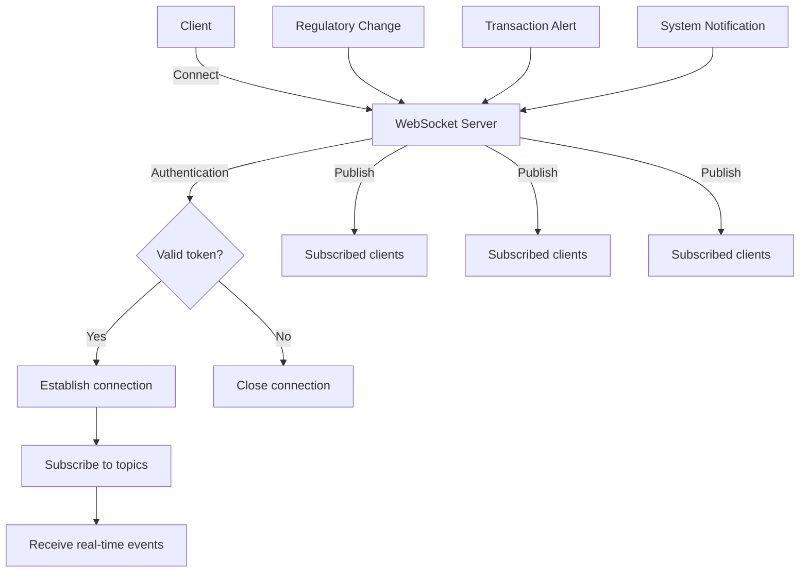
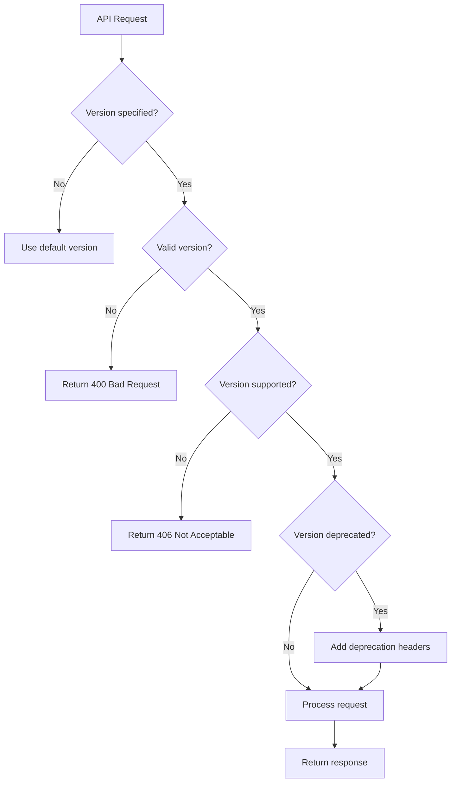

# API Reference

<cite>
**Referenced Files in This Document**   
- [api_endpoints_config.json](file://shared/api_config/api_endpoints_config.json)
- [api_versioning_config.json](file://shared/api_config/api_versioning_config.json)
- [auth_api_handlers.hpp](file://shared/auth/auth_api_handlers.hpp)
- [knowledge_api_handlers.hpp](file://shared/knowledge_base/knowledge_api_handlers.hpp)
- [advanced_rule_engine_api_handlers.hpp](file://shared/rules/advanced_rule_engine_api_handlers.hpp)
- [regulatory_monitor/rest_api_server.hpp](file://regulatory_monitor/rest_api_server.hpp)
- [websocket_server.hpp](file://shared/websocket/websocket_server.hpp)
- [api_versioning_service.hpp](file://shared/api_config/api_versioning_service.hpp)
- [openapi_generator.hpp](file://shared/api_docs/openapi_generator.hpp)
- [api.ts](file://frontend/src/services/api.ts)
</cite>

## Table of Contents
1. [Introduction](#introduction)
2. [Authentication](#authentication)
3. [Agent Management](#agent-management)
4. [Decision Engine](#decision-engine)
5. [Regulatory Monitor](#regulatory-monitor)
6. [Rule Engine](#rule-engine)
7. [Knowledge Base](#knowledge-base)
8. [WebSocket APIs](#websocket-apis)
9. [API Versioning and Migration](#api-versioning-and-migration)
10. [Security Considerations](#security-considerations)
11. [Client Implementation Guidelines](#client-implementation-guidelines)

## Introduction
The Regulens API provides comprehensive access to an agentic AI compliance system with endpoints for agent management, decision making, regulatory monitoring, rule enforcement, and knowledge management. The API follows RESTful principles with JWT-based authentication and supports real-time communication through WebSocket connections. All endpoints are versioned and documented according to OpenAPI 3.0 specifications.

The API is organized into logical categories that correspond to the system's core components. Each endpoint requires proper authentication and authorization, with detailed error handling and comprehensive request validation. The system supports API versioning with backward compatibility and provides migration guides for version transitions.

**Section sources**
- [api_endpoints_config.json](file://shared/api_config/api_endpoints_config.json)
- [api_versioning_config.json](file://shared/api_config/api_versioning_config.json)

## Authentication
The authentication system implements JWT-based token management with secure token generation, refresh mechanisms, and role-based access control.

### Authentication Endpoints


**Diagram sources**
- [auth_api_handlers.hpp](file://shared/auth/auth_api_handlers.hpp)

#### POST /auth/login
Authenticate a user and generate JWT tokens.

**Request Parameters**
- **Body**: JSON object with username and password

**Request Schema**
```json
{
  "username": "string",
  "password": "string"
}
```

**Response Schema (200)**
```json
{
  "token": "string",
  "refresh_token": "string",
  "user": {
    "id": "string",
    "username": "string",
    "roles": ["string"]
  }
}
```

**Error Codes**
- 400: Invalid request format
- 401: Invalid credentials
- 500: Internal server error

**Example Request**
```bash
curl -X POST https://api.regulens.com/auth/login \
  -H "Content-Type: application/json" \
  -d '{"username": "user", "password": "pass"}'
```

#### POST /auth/refresh
Refresh an expired JWT access token using a refresh token.

**Request Parameters**
- **Body**: JSON object with refresh token

**Request Schema**
```json
{
  "refresh_token": "string"
}
```

**Response Schema (200)**
```json
{
  "token": "string"
}
```

**Error Codes**
- 400: Invalid request format
- 401: Invalid or expired refresh token
- 500: Internal server error

#### GET /auth/me
Get information about the currently authenticated user.

**Response Schema (200)**
```json
{
  "id": "string",
  "username": "string",
  "email": "string",
  "roles": ["string"],
  "permissions": ["string"]
}
```

**Error Codes**
- 401: Unauthorized (invalid or missing token)
- 500: Internal server error

#### POST /auth/logout
Revoke the refresh token and log out the user.

**Error Codes**
- 401: Unauthorized (invalid or missing token)
- 500: Internal server error

**Section sources**
- [auth_api_handlers.hpp](file://shared/auth/auth_api_handlers.hpp)
- [api_endpoints_config.json](file://shared/api_config/api_endpoints_config.json)

## Agent Management
The agent management API provides endpoints for creating, retrieving, updating, and deleting compliance agents.

### Agent Management Endpoints
```mermaid
flowchart TD
A[GET /agents] --> B[Retrieve agent list]
B --> C[Return paginated results]
D[GET /agents/{id}] --> E[Retrieve agent details]
E --> F[Return agent information]
G[POST /agents] --> H[Create new agent]
H --> I{Valid input?}
I --> |Yes| J[Save agent configuration]
J --> K[Return created agent]
I --> |No| L[Return 400 Bad Request]
M[PUT /agents/{id}] --> N[Update agent]
N --> O{Valid input?}
O --> |Yes| P[Update agent configuration]
P --> Q[Return updated agent]
O --> |No| R[Return 400 Bad Request]
S[DELETE /agents/{id}] --> T[Delete agent]
T --> U[Return 204 No Content]
```

**Diagram sources**
- [api_endpoints_config.json](file://shared/api_config/api_endpoints_config.json)

#### GET /agents
Retrieve a list of all agents with filtering and pagination.

**Query Parameters**
- **page**: Page number (default: 1)
- **page_size**: Number of items per page (default: 20)
- **status**: Filter by agent status (active, inactive, error)
- **type**: Filter by agent type (audit_intelligence, regulatory_assessor, transaction_guardian)

**Response Schema (200)**
```json
{
  "items": [
    {
      "id": "string",
      "name": "string",
      "type": "string",
      "status": "string",
      "created_at": "string",
      "last_heartbeat": "string",
      "configuration": {}
    }
  ],
  "total": "integer",
  "page": "integer",
  "page_size": "integer"
}
```

**Error Codes**
- 400: Invalid query parameters
- 401: Unauthorized
- 500: Internal server error

#### GET /agents/{id}
Retrieve detailed information about a specific agent.

**Path Parameters**
- **id**: Agent identifier

**Response Schema (200)**
```json
{
  "id": "string",
  "name": "string",
  "type": "string",
  "status": "string",
  "status_message": "string",
  "created_at": "string",
  "updated_at": "string",
  "last_heartbeat": "string",
  "configuration": {},
  "metrics": {
    "requests_processed": "integer",
    "errors": "integer",
    "uptime_percentage": "number"
  },
  "capabilities": ["string"]
}
```

**Error Codes**
- 400: Invalid agent ID format
- 401: Unauthorized
- 404: Agent not found
- 500: Internal server error

#### POST /agents
Create a new agent with the specified configuration.

**Request Body**
- **name**: Agent name
- **type**: Agent type
- **configuration**: Agent-specific configuration

**Request Schema**
```json
{
  "name": "string",
  "type": "string",
  "configuration": {}
}
```

**Response Schema (201)**
```json
{
  "id": "string",
  "name": "string",
  "type": "string",
  "status": "pending",
  "created_at": "string",
  "configuration": {}
}
```

**Error Codes**
- 400: Invalid request body
- 401: Unauthorized
- 403: Insufficient permissions
- 500: Internal server error

#### PUT /agents/{id}
Update an existing agent's configuration.

**Path Parameters**
- **id**: Agent identifier

**Request Schema**
```json
{
  "name": "string",
  "configuration": {}
}
```

**Response Schema (200)**
```json
{
  "id": "string",
  "name": "string",
  "type": "string",
  "status": "string",
  "updated_at": "string",
  "configuration": {}
}
```

**Error Codes**
- 400: Invalid request body
- 401: Unauthorized
- 403: Insufficient permissions
- 404: Agent not found
- 500: Internal server error

#### DELETE /agents/{id}
Delete an agent.

**Path Parameters**
- **id**: Agent identifier

**Error Codes**
- 400: Invalid agent ID format
- 401: Unauthorized
- 403: Insufficient permissions
- 404: Agent not found
- 500: Internal server error

**Section sources**
- [api_endpoints_config.json](file://shared/api_config/api_endpoints_config.json)

## Decision Engine
The decision engine API provides endpoints for creating, retrieving, and analyzing decisions made by the system.

### Decision Engine Endpoints
```mermaid
flowchart TD
A[GET /decisions] --> B[Retrieve decisions]
B --> C[Return paginated results]
D[GET /decisions/{id}] --> E[Retrieve decision details]
E --> F[Return decision information]
G[POST /decisions] --> H[Create decision]
H --> I{Valid input?}
I --> |Yes| J[Process decision]
J --> K[Return decision result]
I --> |No| L[Return 400 Bad Request]
M[GET /decisions/stats] --> N[Calculate statistics]
N --> O[Return decision metrics]
P[GET /decisions/timeline] --> Q[Generate timeline]
Q --> R[Return timeline data]
```

**Diagram sources**
- [decision_api_handlers_complete.hpp](file://shared/decisions/decision_api_handlers_complete.hpp)

#### GET /decisions
Retrieve a list of decisions with filtering and pagination.

**Query Parameters**
- **page**: Page number (default: 1)
- **page_size**: Number of items per page (default: 20)
- **status**: Filter by decision status (approved, rejected, pending)
- **agent_id**: Filter by agent ID
- **start_date**: Filter by start date
- **end_date**: Filter by end date
- **risk_level**: Filter by risk level (low, medium, high, critical)

**Response Schema (200)**
```json
{
  "items": [
    {
      "id": "string",
      "agent_id": "string",
      "status": "string",
      "risk_level": "string",
      "confidence_score": "number",
      "created_at": "string",
      "decision_data": {}
    }
  ],
  "total": "integer",
  "page": "integer",
  "page_size": "integer"
}
```

**Error Codes**
- 400: Invalid query parameters
- 401: Unauthorized
- 500: Internal server error

#### GET /decisions/{id}
Retrieve detailed information about a specific decision.

**Path Parameters**
- **id**: Decision identifier

**Response Schema (200)**
```json
{
  "id": "string",
  "agent_id": "string",
  "status": "string",
  "risk_level": "string",
  "confidence_score": "number",
  "explanation": "string",
  "decision_tree": {},
  "evidence": [],
  "created_at": "string",
  "updated_at": "string",
  "decision_data": {},
  "audit_trail": []
}
```

**Error Codes**
- 400: Invalid decision ID format
- 401: Unauthorized
- 404: Decision not found
- 500: Internal server error

#### POST /decisions
Create a new decision request.

**Request Schema**
```json
{
  "agent_id": "string",
  "input_data": {},
  "context": {}
}
```

**Response Schema (201)**
```json
{
  "id": "string",
  "agent_id": "string",
  "status": "string",
  "risk_level": "string",
  "confidence_score": "number",
  "explanation": "string",
  "created_at": "string",
  "decision_data": {}
}
```

**Error Codes**
- 400: Invalid request body
- 401: Unauthorized
- 403: Insufficient permissions
- 500: Internal server error

#### GET /decisions/stats
Retrieve decision statistics.

**Query Parameters**
- **start_date**: Start date for statistics
- **end_date**: End date for statistics
- **group_by**: Field to group by (agent_id, status, risk_level)

**Response Schema (200)**
```json
{
  "total_decisions": "integer",
  "by_status": {
    "approved": "integer",
    "rejected": "integer",
    "pending": "integer"
  },
  "by_risk_level": {
    "low": "integer",
    "medium": "integer",
    "high": "integer",
    "critical": "integer"
  },
  "average_confidence": "number",
  "trends": []
}
```

**Error Codes**
- 400: Invalid query parameters
- 401: Unauthorized
- 500: Internal server error

**Section sources**
- [decision_api_handlers_complete.hpp](file://shared/decisions/decision_api_handlers_complete.hpp)
- [api_endpoints_config.json](file://shared/api_config/api_endpoints_config.json)

## Regulatory Monitor
The regulatory monitor API provides endpoints for tracking regulatory changes and monitoring compliance.

### Regulatory Monitor Endpoints


**Diagram sources**
- [regulatory_monitor/rest_api_server.hpp](file://regulatory_monitor/rest_api_server.hpp)

#### GET /regulatory/changes
Retrieve a list of regulatory changes with filtering and pagination.

**Query Parameters**
- **page**: Page number (default: 1)
- **page_size**: Number of items per page (default: 20)
- **status**: Filter by change status (new, updated, archived)
- **jurisdiction**: Filter by jurisdiction
- **category**: Filter by category (financial, privacy, environmental)
- **start_date**: Filter by publication date
- **end_date**: Filter by publication date

**Response Schema (200)**
```json
{
  "items": [
    {
      "id": "string",
      "title": "string",
      "summary": "string",
      "jurisdiction": "string",
      "category": "string",
      "status": "string",
      "publication_date": "string",
      "effective_date": "string",
      "source_url": "string",
      "confidence_score": "number"
    }
  ],
  "total": "integer",
  "page": "integer",
  "page_size": "integer"
}
```

**Error Codes**
- 400: Invalid query parameters
- 401: Unauthorized
- 500: Internal server error

#### GET /regulatory/sources
Retrieve information about regulatory data sources.

**Response Schema (200)**
```json
[
  {
    "id": "string",
    "name": "string",
    "url": "string",
    "jurisdiction": "string",
    "categories": ["string"],
    "update_frequency": "string",
    "last_checked": "string",
    "status": "string"
  }
]
```

**Error Codes**
- 401: Unauthorized
- 500: Internal server error

#### GET /regulatory/stats
Retrieve regulatory monitoring statistics.

**Response Schema (200)**
```json
{
  "total_sources": "integer",
  "active_sources": "integer",
  "changes_detected_today": "integer",
  "changes_detected_week": "integer",
  "average_detection_time": "number",
  "by_category": {
    "financial": "integer",
    "privacy": "integer",
    "environmental": "integer"
  }
}
```

**Error Codes**
- 401: Unauthorized
- 500: Internal server error

#### POST /regulatory/force-check
Force an immediate check for regulatory changes.

**Response Schema (200)**
```json
{
  "sources_checked": "integer",
  "changes_detected": "integer",
  "detection_time": "number",
  "timestamp": "string"
}
```

**Error Codes**
- 401: Unauthorized
- 403: Insufficient permissions
- 500: Internal server error

#### GET /regulatory/health
Check the health of the regulatory monitoring system.

**Response Schema (200)**
```json
{
  "status": "string",
  "timestamp": "string",
  "components": {
    "data_ingestion": "string",
    "change_detection": "string",
    "notification_service": "string"
  },
  "metrics": {
    "ingestion_rate": "number",
    "detection_latency": "number",
    "error_rate": "number"
  }
}
```

**Error Codes**
- 500: Internal server error

**Section sources**
- [regulatory_monitor/rest_api_server.hpp](file://regulatory_monitor/rest_api_server.hpp)
- [api_endpoints_config.json](file://shared/api_config/api_endpoints_config.json)

## Rule Engine
The rule engine API provides endpoints for managing fraud detection rules and executing rule-based analysis.

### Rule Engine Endpoints
```mermaid
flowchart TD
A[GET /fraud/rules] --> B[Retrieve rules]
B --> C[Return rule list]
D[GET /fraud/rules/{id}] --> E[Retrieve rule details]
E --> F[Return rule information]
G[POST /fraud/rules] --> H[Create rule]
H --> I{Valid rule?}
I --> |Yes| J[Save rule]
J --> K[Return created rule]
I --> |No| L[Return 400 Bad Request]
M[PUT /fraud/rules/{id}] --> N[Update rule]
N --> O{Valid rule?}
O --> |Yes| P[Update rule]
P --> Q[Return updated rule]
O --> |No| R[Return 400 Bad Request]
S[DELETE /fraud/rules/{id}] --> T[Delete rule]
T --> U[Return 204 No Content]
V[POST /fraud/rules/{id}/test] --> W[Test rule]
W --> X[Return test results]
```

**Diagram sources**
- [advanced_rule_engine_api_handlers.hpp](file://shared/rules/advanced_rule_engine_api_handlers.hpp)

#### GET /fraud/rules
Retrieve a list of fraud detection rules.

**Query Parameters**
- **page**: Page number (default: 1)
- **page_size**: Number of items per page (default: 20)
- **status**: Filter by rule status (active, inactive, testing)
- **priority**: Filter by priority (low, medium, high, critical)
- **category**: Filter by category (transaction, identity, behavioral)

**Response Schema (200)**
```json
{
  "items": [
    {
      "id": "string",
      "name": "string",
      "description": "string",
      "priority": "string",
      "status": "string",
      "category": "string",
      "created_at": "string",
      "updated_at": "string",
      "rule_definition": {}
    }
  ],
  "total": "integer",
  "page": "integer",
  "page_size": "integer"
}
```

**Error Codes**
- 400: Invalid query parameters
- 401: Unauthorized
- 500: Internal server error

#### GET /fraud/rules/{id}
Retrieve detailed information about a specific rule.

**Path Parameters**
- **id**: Rule identifier

**Response Schema (200)**
```json
{
  "id": "string",
  "name": "string",
  "description": "string",
  "priority": "string",
  "status": "string",
  "category": "string",
  "created_at": "string",
  "updated_at": "string",
  "created_by": "string",
  "last_modified_by": "string",
  "rule_definition": {},
  "metrics": {
    "execution_count": "integer",
    "trigger_count": "integer",
    "true_positive_rate": "number",
    "false_positive_rate": "number"
  }
}
```

**Error Codes**
- 400: Invalid rule ID format
- 401: Unauthorized
- 404: Rule not found
- 500: Internal server error

#### POST /fraud/rules
Create a new fraud detection rule.

**Request Schema**
```json
{
  "name": "string",
  "description": "string",
  "priority": "string",
  "category": "string",
  "rule_definition": {}
}
```

**Response Schema (201)**
```json
{
  "id": "string",
  "name": "string",
  "description": "string",
  "priority": "string",
  "status": "testing",
  "category": "string",
  "created_at": "string",
  "rule_definition": {}
}
```

**Error Codes**
- 400: Invalid rule definition
- 401: Unauthorized
- 403: Insufficient permissions
- 500: Internal server error

#### PUT /fraud/rules/{id}
Update an existing rule.

**Path Parameters**
- **id**: Rule identifier

**Request Schema**
```json
{
  "name": "string",
  "description": "string",
  "priority": "string",
  "status": "string",
  "rule_definition": {}
}
```

**Response Schema (200)**
```json
{
  "id": "string",
  "name": "string",
  "description": "string",
  "priority": "string",
  "status": "string",
  "category": "string",
  "updated_at": "string",
  "rule_definition": {}
}
```

**Error Codes**
- 400: Invalid rule definition
- 401: Unauthorized
- 403: Insufficient permissions
- 404: Rule not found
- 500: Internal server error

#### DELETE /fraud/rules/{id}
Delete a rule.

**Path Parameters**
- **id**: Rule identifier

**Error Codes**
- 400: Invalid rule ID format
- 401: Unauthorized
- 403: Insufficient permissions
- 404: Rule not found
- 500: Internal server error

#### POST /fraud/rules/{id}/test
Test a rule against sample data.

**Path Parameters**
- **id**: Rule identifier

**Request Schema**
```json
{
  "test_data": {}
}
```

**Response Schema (200)**
```json
{
  "rule_id": "string",
  "test_data": {},
  "result": "boolean",
  "triggered_conditions": ["string"],
  "execution_time": "number",
  "timestamp": "string"
}
```

**Error Codes**
- 400: Invalid test data
- 401: Unauthorized
- 404: Rule not found
- 500: Internal server error

**Section sources**
- [advanced_rule_engine_api_handlers.hpp](file://shared/rules/advanced_rule_engine_api_handlers.hpp)
- [api_endpoints_config.json](file://shared/api_config/api_endpoints_config.json)

## Knowledge Base
The knowledge base API provides endpoints for managing regulatory knowledge and performing semantic searches.

### Knowledge Base Endpoints
```mermaid
flowchart TD
A[POST /knowledge/entries] --> B[Create knowledge entry]
B --> C[Generate embeddings]
C --> D[Save entry]
D --> E[Return created entry]
F[GET /knowledge/entries] --> G[Retrieve entries]
G --> H[Return paginated results]
I[GET /knowledge/entries/{id}] --> J[Retrieve entry]
J --> K[Return entry information]
L[PUT /knowledge/entries/{id}] --> M[Update entry]
M --> N[Update embeddings]
N --> O[Return updated entry]
P[DELETE /knowledge/entries/{id}] --> Q[Delete entry]
Q --> R[Return 204 No Content]
S[POST /knowledge/search] --> T[Semantic search]
T --> U[Return search results]
V[POST /knowledge/ask] --> W[Question answering]
W --> X[Return answer with citations]
```

**Diagram sources**
- [knowledge_api_handlers.hpp](file://shared/knowledge_base/knowledge_api_handlers.hpp)

#### POST /knowledge/entries
Create a new knowledge base entry.

**Request Schema**
```json
{
  "title": "string",
  "content": "string",
  "source_url": "string",
  "jurisdiction": "string",
  "category": "string",
  "tags": ["string"]
}
```

**Response Schema (201)**
```json
{
  "id": "string",
  "title": "string",
  "content": "string",
  "source_url": "string",
  "jurisdiction": "string",
  "category": "string",
  "tags": ["string"],
  "created_at": "string",
  "updated_at": "string",
  "embedding_generated": "boolean"
}
```

**Error Codes**
- 400: Invalid request body
- 401: Unauthorized
- 403: Insufficient permissions
- 500: Internal server error

#### GET /knowledge/entries
Retrieve a list of knowledge base entries.

**Query Parameters**
- **page**: Page number (default: 1)
- **page_size**: Number of items per page (default: 20)
- **query**: Search query for full-text search
- **category**: Filter by category
- **jurisdiction**: Filter by jurisdiction
- **tags**: Filter by tags (comma-separated)

**Response Schema (200)**
```json
{
  "items": [
    {
      "id": "string",
      "title": "string",
      "excerpt": "string",
      "category": "string",
      "jurisdiction": "string",
      "tags": ["string"],
      "created_at": "string",
      "updated_at": "string"
    }
  ],
  "total": "integer",
  "page": "integer",
  "page_size": "integer"
}
```

**Error Codes**
- 400: Invalid query parameters
- 401: Unauthorized
- 500: Internal server error

#### GET /knowledge/entries/{id}
Retrieve a specific knowledge base entry.

**Path Parameters**
- **id**: Entry identifier

**Response Schema (200)**
```json
{
  "id": "string",
  "title": "string",
  "content": "string",
  "source_url": "string",
  "jurisdiction": "string",
  "category": "string",
  "tags": ["string"],
  "created_at": "string",
  "updated_at": "string",
  "related_entries": [
    {
      "id": "string",
      "title": "string",
      "similarity_score": "number"
    }
  ]
}
```

**Error Codes**
- 400: Invalid entry ID format
- 401: Unauthorized
- 404: Entry not found
- 500: Internal server error

#### PUT /knowledge/entries/{id}
Update a knowledge base entry.

**Path Parameters**
- **id**: Entry identifier

**Request Schema**
```json
{
  "title": "string",
  "content": "string",
  "source_url": "string",
  "category": "string",
  "tags": ["string"]
}
```

**Response Schema (200)**
```json
{
  "id": "string",
  "title": "string",
  "content": "string",
  "source_url": "string",
  "jurisdiction": "string",
  "category": "string",
  "tags": ["string"],
  "updated_at": "string"
}
```

**Error Codes**
- 400: Invalid request body
- 401: Unauthorized
- 403: Insufficient permissions
- 404: Entry not found
- 500: Internal server error

#### DELETE /knowledge/entries/{id}
Delete a knowledge base entry.

**Path Parameters**
- **id**: Entry identifier

**Error Codes**
- 400: Invalid entry ID format
- 401: Unauthorized
- 403: Insufficient permissions
- 404: Entry not found
- 500: Internal server error

#### POST /knowledge/search
Perform a semantic search across the knowledge base.

**Request Schema**
```json
{
  "query": "string",
  "top_k": "integer",
  "filters": {}
}
```

**Response Schema (200)**
```json
{
  "query": "string",
  "results": [
    {
      "id": "string",
      "title": "string",
      "content": "string",
      "source_url": "string",
      "similarity_score": "number",
      "rank": "integer"
    }
  ],
  "execution_time": "number"
}
```

**Error Codes**
- 400: Invalid request body
- 401: Unauthorized
- 500: Internal server error

#### POST /knowledge/ask
Ask a question and get an answer with citations from the knowledge base.

**Request Schema**
```json
{
  "question": "string",
  "context": {}
}
```

**Response Schema (200)**
```json
{
  "question": "string",
  "answer": "string",
  "citations": [
    {
      "id": "string",
      "title": "string",
      "excerpt": "string",
      "similarity_score": "number"
    }
  ],
  "confidence_score": "number",
  "execution_time": "number"
}
```

**Error Codes**
- 400: Invalid request body
- 401: Unauthorized
- 500: Internal server error

**Section sources**
- [knowledge_api_handlers.hpp](file://shared/knowledge_base/knowledge_api_handlers.hpp)
- [api_endpoints_config.json](file://shared/api_config/api_endpoints_config.json)

## WebSocket APIs
The WebSocket API provides real-time updates and event streaming for various system events.

### WebSocket Connection
Connect to the WebSocket server at `wss://api.regulens.com/ws`.

**Authentication**
Include the JWT token in the query parameter: `wss://api.regulens.com/ws?token=YOUR_JWT_TOKEN`

### WebSocket Events


**Diagram sources**
- [websocket_server.hpp](file://shared/websocket/websocket_server.hpp)

#### Subscribing to Topics
After connecting, clients can subscribe to specific topics using the following message format:
```json
{
  "type": "subscribe",
  "topic": "regulatory.changes"
}
```

Available topics:
- **regulatory.changes**: Regulatory change notifications
- **transactions.alerts**: Transaction fraud alerts
- **agents.status**: Agent status updates
- **system.notifications**: System notifications
- **decisions.created**: New decision notifications

#### Event Messages
The server sends event messages in the following format:
```json
{
  "type": "event",
  "topic": "string",
  "data": {},
  "timestamp": "string"
}
```

**Regulatory Change Event**
```json
{
  "type": "event",
  "topic": "regulatory.changes",
  "data": {
    "id": "string",
    "title": "string",
    "summary": "string",
    "jurisdiction": "string",
    "category": "string",
    "publication_date": "string",
    "source_url": "string"
  },
  "timestamp": "string"
}
```

**Transaction Alert Event**
```json
{
  "type": "event",
  "topic": "transactions.alerts",
  "data": {
    "transaction_id": "string",
    "risk_level": "string",
    "confidence_score": "number",
    "triggered_rules": ["string"],
    "created_at": "string"
  },
  "timestamp": "string"
}
```

**Agent Status Event**
```json
{
  "type": "event",
  "topic": "agents.status",
  "data": {
    "agent_id": "string",
    "status": "string",
    "status_message": "string",
    "last_heartbeat": "string"
  },
  "timestamp": "string"
}
```

#### Heartbeat
The server sends a heartbeat message every 30 seconds:
```json
{
  "type": "heartbeat",
  "timestamp": "string"
}
```

Clients should respond with a pong message to maintain the connection.

#### Error Messages
If an error occurs, the server sends an error message:
```json
{
  "type": "error",
  "code": "integer",
  "message": "string"
}
```

**Section sources**
- [websocket_server.hpp](file://shared/websocket/websocket_server.hpp)

## API Versioning and Migration
The Regulens API implements a comprehensive versioning strategy to ensure backward compatibility and smooth migrations.

### Versioning Strategy


**Diagram sources**
- [api_versioning_service.hpp](file://shared/api_config/api_versioning_service.hpp)

#### Versioning Methods
The API supports multiple versioning methods:

1. **URL Path (Primary)**: `/api/v1/resource`
2. **Accept Header**: `Accept: application/vnd.regulens.v1+json`
3. **Query Parameter**: `/api/resource?v=1`
4. **Custom Header**: `X-API-Version: v1`

Currently, URL path versioning is the primary method.

#### Current Versions
- **v1**: Current stable version (released 2024-01-15)
- No deprecated versions

#### Migration Guide
When migrating between versions:

1. Update all API endpoints to use the new version path
2. Review breaking changes in the release notes
3. Update client code to handle new response formats
4. Test thoroughly in a staging environment
5. Monitor for deprecation warnings

For v1 to v2 migration (when available):
- All v1 endpoints will remain available for 180 days
- Use the version negotiation headers to identify deprecated endpoints
- Refer to the detailed migration guide at `/docs/migration/v2`

**Backward Compatibility**
- Within a major version, all changes are backward compatible
- New features are opt-in
- Deprecated endpoints continue to function with warnings
- Breaking changes require a major version increment

**Section sources**
- [api_versioning_service.hpp](file://shared/api_config/api_versioning_service.hpp)
- [api_versioning_config.json](file://shared/api_config/api_versioning_config.json)

## Security Considerations
The Regulens API implements multiple security measures to protect data and prevent abuse.

### Authentication and Authorization
- **JWT-based authentication** with 24-hour expiration
- **Refresh tokens** for seamless token renewal
- **Role-based access control** with granular permissions
- **Rate limiting** at 100 requests per minute per client
- **CORS protection** with configurable allowed origins

### Input Validation
All API endpoints perform comprehensive input validation:

- **Schema validation** using JSON Schema
- **Parameter validation** for type, format, and range
- **Sanitization** of user input to prevent injection attacks
- **Size limits** on request bodies (1MB maximum)

### Error Handling
The API provides consistent error responses:

```json
{
  "error": "string",
  "error_code": "string",
  "details": {},
  "timestamp": "string"
}
```

Common error codes:
- **400**: Invalid request
- **401**: Unauthorized
- **403**: Forbidden
- **404**: Not found
- **429**: Rate limit exceeded
- **500**: Internal server error

### Security Headers
The API includes the following security headers:
- **Content-Security-Policy**: Prevents XSS attacks
- **X-Content-Type-Options**: Prevents MIME type sniffing
- **X-Frame-Options**: Prevents clickjacking
- **Strict-Transport-Security**: Enforces HTTPS
- **X-API-Version**: Indicates the API version used

### Data Protection
- **Encryption at rest** for all sensitive data
- **TLS 1.3** for all communications
- **Audit logging** of all API access
- **Data minimization** principles applied

**Section sources**
- [auth_api_handlers.hpp](file://shared/auth/auth_api_handlers.hpp)
- [api_endpoints_config.json](file://shared/api_config/api_endpoints_config.json)
- [api_versioning_config.json](file://shared/api_config/api_versioning_config.json)

## Client Implementation Guidelines
This section provides guidelines for implementing Regulens API clients in various programming languages.

### JavaScript/TypeScript
```typescript
// Import axios
import axios from 'axios';

// Create API client
const apiClient = axios.create({
  baseURL: 'https://api.regulens.com',
  timeout: 30000,
  headers: {
    'Content-Type': 'application/json',
  },
});

// Add request interceptor for authentication
apiClient.interceptors.request.use(
  (config) => {
    const token = localStorage.getItem('token');
    if (token) {
      config.headers.Authorization = `Bearer ${token}`;
    }
    return config;
  },
  (error) => Promise.reject(error)
);

// Add response interceptor for token refresh
apiClient.interceptors.response.use(
  (response) => response,
  async (error) => {
    const originalRequest = error.config;
    if (error.response?.status === 401 && !originalRequest._retry) {
      originalRequest._retry = true;
      try {
        const response = await apiClient.post('/auth/refresh', {});
        const { token } = response.data;
        localStorage.setItem('token', token);
        apiClient.defaults.headers.common['Authorization'] = `Bearer ${token}`;
        originalRequest.headers.Authorization = `Bearer ${token}`;
        return apiClient(originalRequest);
      } catch (refreshError) {
        // Handle refresh failure
        localStorage.removeItem('token');
        window.location.href = '/login';
        return Promise.reject(refreshError);
      }
    }
    return Promise.reject(error);
  }
);
```

### Python
```python
import requests
import json
from typing import Dict, Any, Optional

class RegulensClient:
    def __init__(self, base_url: str = "https://api.regulens.com", token: Optional[str] = None):
        self.base_url = base_url.rstrip("/")
        self.token = token
        self.session = requests.Session()
        self.session.headers.update({"Content-Type": "application/json"})
        
    def _add_auth(self):
        if self.token:
            self.session.headers["Authorization"] = f"Bearer {self.token}"
    
    def login(self, username: str, password: str) -> Dict[str, Any]:
        self._add_auth()
        response = self.session.post(
            f"{self.base_url}/auth/login",
            json={"username": username, "password": password}
        )
        response.raise_for_status()
        data = response.json()
        self.token = data["token"]
        self.session.headers["Authorization"] = f"Bearer {self.token}"
        return data
    
    def get(self, endpoint: str, params: Optional[Dict[str, Any]] = None) -> Dict[str, Any]:
        self._add_auth()
        response = self.session.get(f"{self.base_url}{endpoint}", params=params)
        response.raise_for_status()
        return response.json()
    
    def post(self, endpoint: str, data: Dict[str, Any]) -> Dict[str, Any]:
        self._add_auth()
        response = self.session.post(f"{self.base_url}{endpoint}", json=data)
        response.raise_for_status()
        return response.json()
    
    def put(self, endpoint: str, data: Dict[str, Any]) -> Dict[str, Any]:
        self._add_auth()
        response = self.session.put(f"{self.base_url}{endpoint}", json=data)
        response.raise_for_status()
        return response.json()
    
    def delete(self, endpoint: str) -> None:
        self._add_auth()
        response = self.session.delete(f"{self.base_url}{endpoint}")
        response.raise_for_status()
```

### Java
```java
import java.io.IOException;
import java.net.URI;
import java.net.http.HttpClient;
import java.net.http.HttpRequest;
import java.net.http.HttpResponse;
import java.time.Duration;
import java.util.concurrent.CompletableFuture;

import com.fasterxml.jackson.databind.JsonNode;
import com.fasterxml.jackson.databind.ObjectMapper;

public class RegulensClient {
    private final HttpClient client;
    private final ObjectMapper mapper;
    private final String baseUrl;
    private String token;

    public RegulensClient(String baseUrl) {
        this.baseUrl = baseUrl.endsWith("/") ? baseUrl : baseUrl + "/";
        this.client = HttpClient.newBuilder()
            .connectTimeout(Duration.ofSeconds(10))
            .build();
        this.mapper = new ObjectMapper();
    }

    public CompletableFuture<JsonNode> login(String username, String password) {
        try {
            String json = mapper.writeValueAsString(
                Map.of("username", username, "password", password)
            );
            
            HttpRequest request = HttpRequest.newBuilder()
                .uri(URI.create(baseUrl + "auth/login"))
                .header("Content-Type", "application/json")
                .POST(HttpRequest.BodyPublishers.ofString(json))
                .build();

            return client.sendAsync(request, HttpResponse.BodyHandlers.ofString())
                .thenApply(response -> {
                    if (response.statusCode() == 200) {
                        try {
                            JsonNode node = mapper.readTree(response.body());
                            this.token = node.get("token").asText();
                            return node;
                        } catch (Exception e) {
                            throw new RuntimeException(e);
                        }
                    } else {
                        throw new RuntimeException("Login failed: " + response.statusCode());
                    }
                });
        } catch (Exception e) {
            return CompletableFuture.failedFuture(e);
        }
    }

    private HttpRequest.Builder createRequest(String method, String endpoint) {
        HttpRequest.Builder builder = HttpRequest.newBuilder()
            .uri(URI.create(baseUrl + endpoint))
            .timeout(Duration.ofSeconds(30))
            .header("Content-Type", "application/json");
            
        if (token != null) {
            builder.header("Authorization", "Bearer " + token);
        }
        
        switch (method.toUpperCase()) {
            case "GET":
                return builder.GET();
            case "POST":
                return builder.POST(HttpRequest.BodyPublishers.ofString(""));
            case "PUT":
                return builder.PUT(HttpRequest.BodyPublishers.ofString(""));
            case "DELETE":
                return builder.DELETE();
            default:
                throw new IllegalArgumentException("Unsupported method: " + method);
        }
    }

    public CompletableFuture<JsonNode> get(String endpoint) {
        return client.sendAsync(createRequest("GET", endpoint).build(), 
            HttpResponse.BodyHandlers.ofString())
            .thenApply(this::parseResponse);
    }

    public CompletableFuture<JsonNode> post(String endpoint, Object body) {
        try {
            String json = mapper.writeValueAsString(body);
            return client.sendAsync(
                createRequest("POST", endpoint)
                    .header("Content-Type", "application/json")
                    .POST(HttpRequest.BodyPublishers.ofString(json))
                    .build(),
                HttpResponse.BodyHandlers.ofString())
                .thenApply(this::parseResponse);
        } catch (Exception e) {
            return CompletableFuture.failedFuture(e);
        }
    }

    private JsonNode parseResponse(HttpResponse<String> response) throws IOException {
        if (response.statusCode() >= 200 && response.statusCode() < 300) {
            return mapper.readTree(response.body());
        } else {
            throw new RuntimeException("Request failed: " + response.statusCode() + 
                " " + response.body());
        }
    }
}
```

### Best Practices
1. **Token Management**: Store JWT tokens securely and implement refresh logic
2. **Error Handling**: Implement comprehensive error handling for all API calls
3. **Rate Limiting**: Respect rate limits and implement retry logic with exponential backoff
4. **Versioning**: Specify API version explicitly in requests
5. **Logging**: Log API interactions for debugging and monitoring
6. **Timeouts**: Set appropriate timeouts for API requests
7. **Connection Pooling**: Use connection pooling for improved performance
8. **Validation**: Validate API responses before processing

**Section sources**
- [api.ts](file://frontend/src/services/api.ts)
- [auth_api_handlers.hpp](file://shared/auth/auth_api_handlers.hpp)