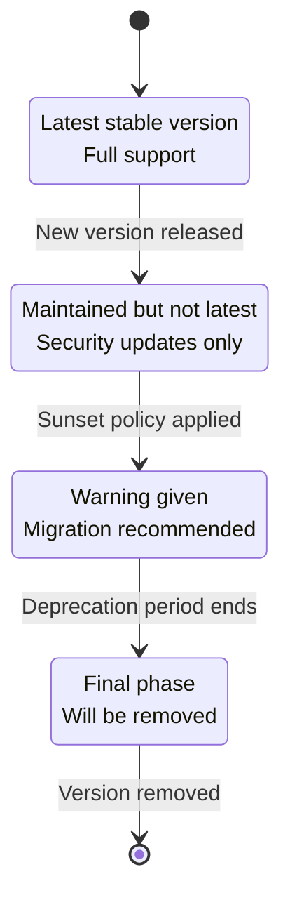
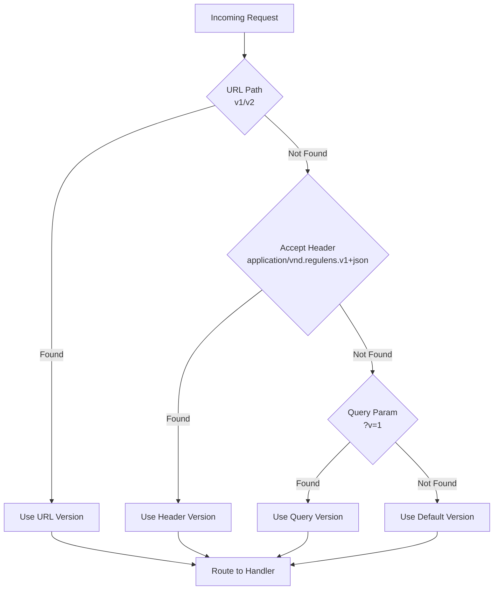
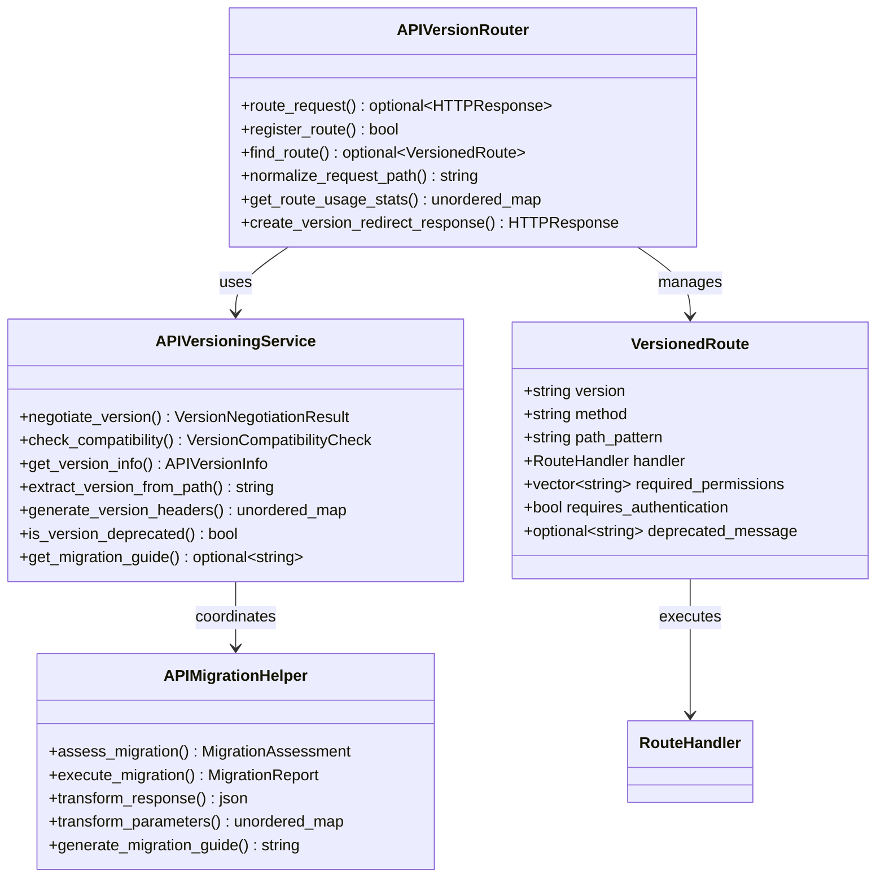
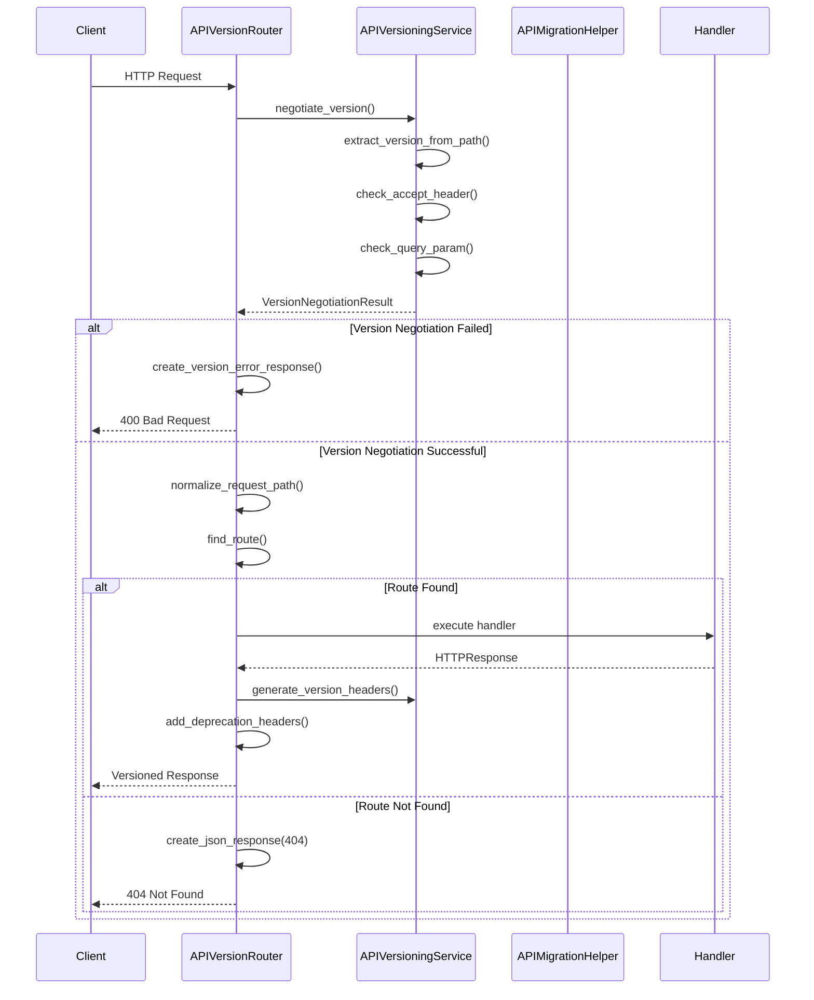
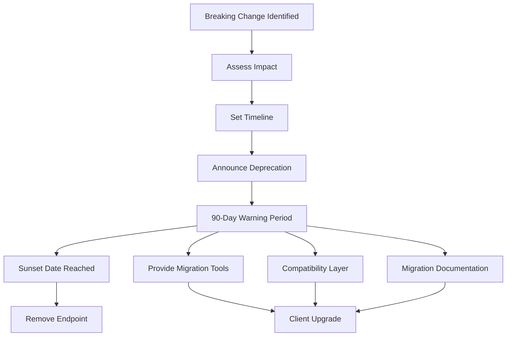
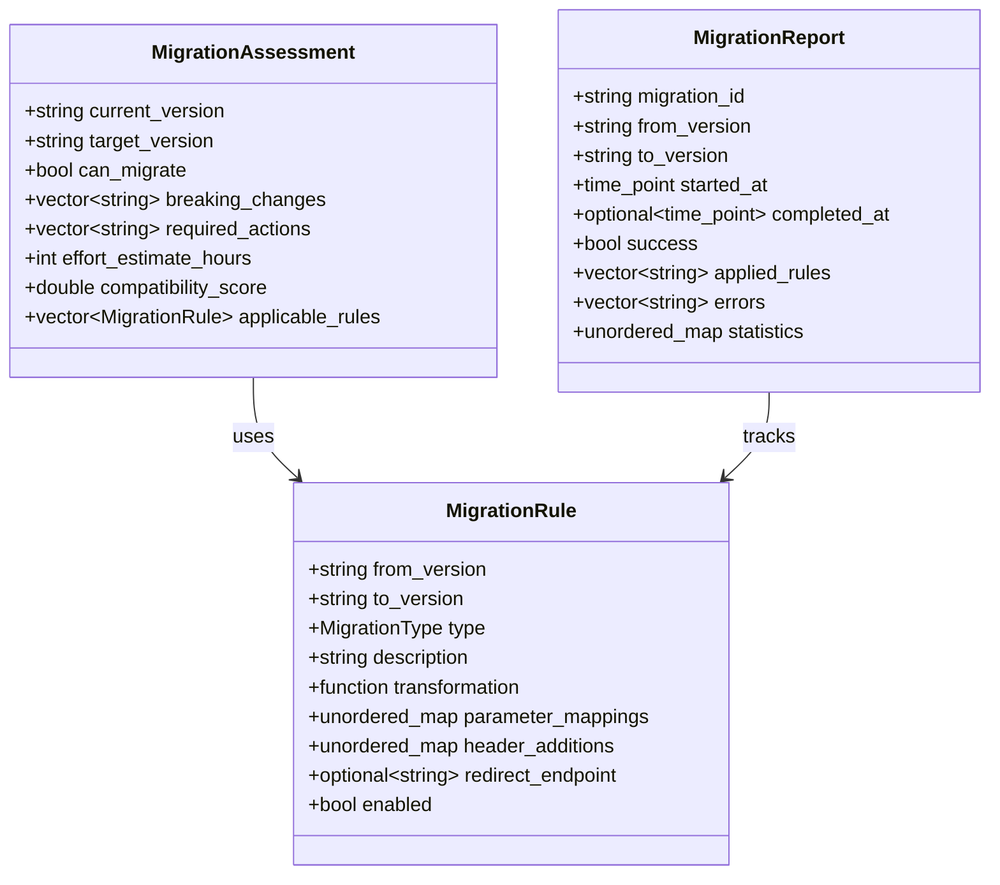

# API Versioning Strategy

<cite>
**Referenced Files in This Document**
- [api_versioning_config.json](file://shared/api_config/api_versioning_config.json) - *Updated with comprehensive versioning strategy*
- [api_migration_strategy.json](file://shared/api_config/api_migration_strategy.json) - *Added detailed migration planning*
- [api_versioning_service.cpp](file://shared/api_config/api_versioning_service.cpp) - *Updated version negotiation and compatibility checks*
- [api_versioning_service.hpp](file://shared/api_config/api_versioning_service.hpp) - *Enhanced versioning service interface*
- [api_version_router.cpp](file://shared/api_config/api_version_router.cpp) - *Updated routing logic with version negotiation*
- [api_version_router.hpp](file://shared/api_config/api_version_router.hpp) - *Enhanced router interface*
- [VersionSelector.tsx](file://frontend/src/components/VersionSelector.tsx) - *Updated version selector component*
- [api.ts](file://frontend/src/services/api.ts) - *Updated API client version management*
- [api_registry.cpp](file://shared/api_registry/api_registry.cpp) - *Updated API registry with version awareness*
</cite>

## Update Summary
**Changes Made**
- Updated semantic versioning scheme with detailed lifecycle states
- Enhanced version negotiation methods with priority order and implementation details
- Expanded version router architecture with comprehensive component interactions
- Added detailed migration strategy with breaking changes management and tools
- Updated configuration management with future version planning
- Enhanced client integration examples with real implementation details
- Added comprehensive monitoring and analytics capabilities
- Updated troubleshooting guide with new debugging tools

## Table of Contents
1. [Introduction](#introduction)
2. [Semantic Versioning Scheme](#semantic-versioning-scheme)
3. [Version Negotiation Methods](#version-negotiation-methods)
4. [Version Router Architecture](#version-router-architecture)
5. [Migration Strategy](#migration-strategy)
6. [Configuration Management](#configuration-management)
7. [Client Integration](#client-integration)
8. [Monitoring and Analytics](#monitoring-and-analytics)
9. [Best Practices](#best-practices)
10. [Troubleshooting Guide](#troubleshooting-guide)

## Introduction

Regulens implements a comprehensive API versioning system designed for production environments requiring robust backward compatibility, graceful migration paths, and extensive monitoring capabilities. The system follows semantic versioning principles (major.minor.patch) while providing multiple negotiation methods to accommodate diverse client requirements.

The API versioning strategy ensures that clients can safely upgrade between versions without breaking existing integrations, while providing clear deprecation timelines and migration assistance. The system is built around a modular architecture that separates version negotiation, routing, and migration concerns.

**Section sources**
- [api_versioning_config.json](file://shared/api_config/api_versioning_config.json#L1-L50)
- [api_versioning_service.cpp](file://shared/api_config/api_versioning_service.cpp#L13-L556)

## Semantic Versioning Scheme

### Version Format and Structure

Regulens uses a strict semantic versioning scheme with the format `v{major}.{minor}.{patch}`:

- **Major Version (v1)**: Initial stable release with core functionality
- **Minor Version**: New features and enhancements (not breaking)
- **Patch Version**: Bug fixes and security updates (fully backward compatible)

### Version Status Lifecycle



**Section sources**
- [api_versioning_config.json](file://shared/api_config/api_versioning_config.json#L1-L50)
- [api_versioning_service.cpp](file://shared/api_config/api_versioning_service.cpp#L285-L334)

## Version Negotiation Methods

### Primary Negotiation Method: URL Path

The default version negotiation method uses URL path segments:

```http
GET /api/v1/transactions
GET /api/v2/transactions
```

**Advantages:**
- Explicit versioning in URLs
- Caching-friendly
- SEO-friendly
- Easy to debug and test

**Implementation:**
```cpp
std::string APIVersioningService::extract_version_from_path(const std::string& path) {
    std::regex version_pattern(R"(^/api/v(\d+))");
    std::smatch matches;
    
    if (std::regex_search(path, matches, version_pattern)) {
        return "v" + matches[1].str();
    }
    
    return "";
}
```

### Secondary Negotiation Methods

#### Accept Header Method

```http
Accept: application/vnd.regulens.v1+json
Accept: application/vnd.regulens.v2+json
```

#### Query Parameter Method

```http
GET /api/transactions?v=1
GET /api/transactions?v=2
```

### Negotiation Priority Order

The system follows a priority order for version negotiation:

1. **URL Path** (Primary) - Highest priority
2. **Accept Header** - Medium priority  
3. **Query Parameter** - Lowest priority
4. **Default Version** - Fallback



**Diagram sources**
- [api_versioning_service.cpp](file://shared/api_config/api_versioning_service.cpp#L285-L334)

**Section sources**
- [api_versioning_service.cpp](file://shared/api_config/api_versioning_service.cpp#L285-L334)
- [api_versioning_config.json](file://shared/api_config/api_versioning_config.json#L30-L60)

## Version Router Architecture

### Core Components

The version router system consists of several interconnected components:



**Diagram sources**
- [api_versioning_service.hpp](file://shared/api_config/api_versioning_service.hpp#L47-L90)
- [api_version_router.hpp](file://shared/api_config/api_version_router.hpp#L25-L35)
- [api_migration_helper.hpp](file://shared/api_config/api_migration_helper.hpp#L25-L50)

### Request Routing Process



**Diagram sources**
- [api_version_router.cpp](file://shared/api_config/api_version_router.cpp#L51-L120)
- [api_versioning_service.cpp](file://shared/api_config/api_versioning_service.cpp#L285-L334)

### Route Registration and Storage

Routes are stored in multiple indexed structures for efficient lookup:

```cpp
// Version-based storage
std::unordered_map<std::string, std::vector<VersionedRoute>> routes_by_version_;

// Method+Version-based storage for fast lookup
std::unordered_map<std::string, std::unordered_map<std::string, std::vector<VersionedRoute>>> routes_by_method_version_;
```

**Section sources**
- [api_version_router.cpp](file://shared/api_config/api_version_router.cpp#L25-L89)
- [api_version_router.hpp](file://shared/api_config/api_version_router.hpp#L40-L60)

## Migration Strategy

### Breaking Changes Management

Regulens implements a comprehensive breaking changes strategy with clear timelines and migration paths:



### V1 to V2 Migration Example

The planned V1 to V2 migration demonstrates the comprehensive approach:

**Breaking Changes:**
1. **Response Format**: Unified JSON structure with `data` and `meta` fields
2. **Pagination**: Parameter renaming (`page`→`offset`, `per_page`→`limit`)
3. **Error Handling**: Enhanced error response format with detailed codes
4. **Removed Endpoints**: Some deprecated endpoints removed

**Migration Steps:**
```typescript
// Before (V1)
GET /api/transactions?page=2&per_page=50
// Returns: { id: 1, amount: 100 }

// After (V2)  
GET /api/v2/transactions?offset=50&limit=50
// Returns: { data: [{ id: 1, amount: 100 }], meta: {...} }
```

### Migration Assessment and Tools



**Diagram sources**
- [api_migration_helper.hpp](file://shared/api_config/api_migration_helper.hpp#L30-L50)

**Section sources**
- [api_migration_strategy.json](file://shared/api_config/api_migration_strategy.json#L1-L100)
- [api_migration_helper.cpp](file://shared/api_config/api_migration_helper.cpp#L100-L177)

## Configuration Management

### Versioning Configuration Structure

The API versioning system uses JSON configuration files for centralized management:

```json
{
  "versioning_strategy": {
    "current_version": "v1",
    "supported_versions": ["v1"],
    "default_version": "v1",
    "versioning_method": "url_path",
    "sunset_policy": {
      "deprecation_notice_period_days": 90,
      "shutdown_grace_period_days": 30,
      "maintenance_period_days": 180
    }
  }
}
```

### Endpoint Versioning Configuration

Individual endpoints can be configured with specific version constraints:

```json
{
  "endpoint_versioning": {
    "v1_endpoints": {
      "transactions": {
        "list": {"version": "v1", "status": "current", "changes": []},
        "get": {"version": "v1", "status": "current", "changes": []},
        "approve": {"version": "v1", "status": "current", "changes": []}
      }
    }
  }
}
```

### Migration Strategy Configuration

```json
{
  "migration_strategies": {
    "breaking_changes_policy": {
      "major_version_bump": "Breaking changes require major version increment",
      "deprecation_warnings": "90 days advance notice for breaking changes",
      "backward_compatibility": "Maintain backward compatibility within major version"
    }
  }
}
```

**Section sources**
- [api_versioning_config.json](file://shared/api_config/api_versioning_config.json#L1-L227)
- [api_migration_strategy.json](file://shared/api_config/api_migration_strategy.json#L1-L50)

## Client Integration

### Frontend Integration Example

The frontend version selector demonstrates client-side version management:

```typescript
// Version selection with status display
const VersionSelector: React.FC = () => {
  const [selectedVersion, setSelectedVersion] = useState(apiVersion.current);
  const [versions] = useState<APIVersion[]>(mockVersions);
  
  const handleVersionChange = async (newVersion: string) => {
    setIsChanging(true);
    try {
      // Validate compatibility and test version
      await new Promise(resolve => setTimeout(resolve, 1000));
      
      apiVersion.set(newVersion);
      setSelectedVersion(newVersion);
      
    } catch (error) {
      setChangeError(`Failed to switch to version ${newVersion}`);
    } finally {
      setIsChanging(false);
    }
  };
};
```

### API Client Version Management

```typescript
class APIClient {
  private currentVersion: string = 'v1';
  
  // Build versioned endpoint
  private buildVersionedEndpoint(endpoint: string, version?: string): string {
    const apiVersion = version || this.currentVersion;
    
    // If endpoint already starts with /api/v{version}, return as-is
    if (endpoint.startsWith(`/api/${apiVersion}/`)) {
      return endpoint;
    }
    
    // Insert version after /api/
    if (endpoint.startsWith('/api/')) {
      return `/api/${apiVersion}${endpoint.substring(4)}`;
    }
    
    // For relative endpoints
    return `/${apiVersion}${endpoint}`;
  }
}
```

### Version-Aware Request Headers

```typescript
// Request interceptor adds version information
this.client.interceptors.request.use((config) => {
  // Handle API versioning
  if (config.url) {
    config.url = this.buildVersionedEndpoint(config.url, this.currentVersion);
  }
  
  // Add version headers for tracking
  config.headers['X-API-Version'] = this.currentVersion;
  
  return config;
});
```

**Section sources**
- [VersionSelector.tsx](file://frontend/src/components/VersionSelector.tsx#L1-L100)
- [api.ts](file://frontend/src/services/api.ts#L30-L80)

## Monitoring and Analytics

### Version Usage Tracking

The system provides comprehensive monitoring of version usage:

```cpp
// Version usage statistics
std::unordered_map<std::string, int> get_version_usage_stats() {
    std::lock_guard<std::mutex> lock(stats_mutex_);
    return version_usage_counts_;
}

// Route usage statistics
std::unordered_map<std::string, int> get_route_usage_stats() {
    std::lock_guard<std::mutex> lock(stats_mutex_);
    return route_usage_stats_;
}
```

### Delegation and Sunset Headers

```cpp
// Generate version headers for responses
std::unordered_map<std::string, std::string> generate_version_headers(
    const std::string& negotiated_version,
    const VersionNegotiationResult& negotiation_result
) {
    std::unordered_map<std::string, std::string> headers;
    
    headers["X-API-Version"] = negotiated_version;
    
    if (negotiation_result.deprecation_notice) {
        headers["X-API-Deprecation-Warning"] = *negotiation_result.deprecation_notice;
    }
    
    if (negotiation_result.sunset_date) {
        headers["X-API-Sunset-Date"] = *negotiation_result.sunset_date;
    }
    
    return headers;
}
```

### Health Check Endpoints

```json
{
  "version_health_checks": {
    "enabled": true,
    "endpoints_to_monitor": [
      "/api/v1/health",
      "/api/v1/status", 
      "/api/v1/version"
    ]
  }
}
```

**Section sources**
- [api_versioning_service.cpp](file://shared/api_config/api_versioning_service.cpp#L453-L488)
- [api_versioning_config.json](file://shared/api_config/api_versioning_config.json#L180-L200)

## Best Practices

### Versioning Guidelines

1. **Semantic Versioning**: Follow semantic versioning principles strictly
2. **Backward Compatibility**: Maintain backward compatibility within major versions
3. **Graceful Degradation**: Provide fallback mechanisms for unsupported versions
4. **Clear Communication**: Provide ample notice for breaking changes
5. **Comprehensive Testing**: Test all migration paths thoroughly

### Migration Planning

1. **Timeline Planning**: Establish clear timelines for deprecation and sunset
2. **Client Notification**: Notify clients well in advance of changes
3. **Migration Tools**: Provide automated migration tools and documentation
4. **Testing Support**: Offer testing environments for migration validation
5. **Rollback Capability**: Maintain ability to rollback problematic changes

### Security Considerations

1. **Authentication**: Maintain consistent authentication across versions
2. **Authorization**: Ensure permission systems work across versions
3. **Rate Limiting**: Apply consistent rate limiting across versions
4. **Audit Logging**: Maintain comprehensive audit trails for all versions

## Troubleshooting Guide

### Common Issues and Solutions

#### Version Negotiation Failures

**Problem**: API version negotiation fails with 400 Bad Request
**Solution**: 
- Verify version format (must be v1, v2, etc.)
- Check if version is supported in configuration
- Ensure proper header formatting for Accept header method

#### Route Not Found Errors

**Problem**: 404 Not Found for valid endpoints
**Solution**:
- Verify endpoint registration in configuration
- Check version-specific route definitions
- Ensure proper path pattern matching

#### Migration Compatibility Issues

**Problem**: Breaking changes cause client failures
**Solution**:
- Review breaking changes in migration documentation
- Use compatibility layers where available
- Update client code according to migration guide

### Debugging Tools

#### Version Information Retrieval

```cpp
// Get current version information
auto version_info = APIVersioningService::get_instance().get_version_info("v1");
if (version_info) {
    std::cout << "Version: " << version_info->version << std::endl;
    std::cout << "Status: " << static_cast<int>(version_info->status) << std::endl;
}
```

#### Usage Statistics Analysis

```cpp
// Monitor version usage
auto usage_stats = APIVersioningService::get_instance().get_version_usage_stats();
for (const auto& [version, count] : usage_stats) {
    std::cout << "Version " << version << ": " << count << " requests" << std::endl;
}
```

#### Route Discovery

```cpp
// Find routes for specific version
auto routes = APIVersionRouter::get_instance().get_routes_for_version("v1");
for (const auto& route : routes) {
    std::cout << route.method << " " << route.path_pattern << std::endl;
}
```

**Section sources**
- [api_versioning_service.cpp](file://shared/api_config/api_versioning_service.cpp#L333-L382)
- [api_version_router.cpp](file://shared/api_config/api_version_router.cpp#L202-L231)