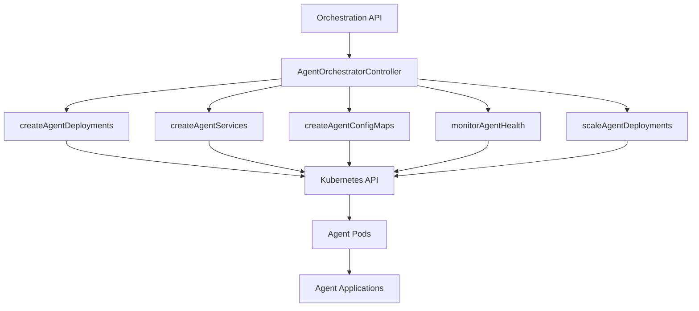

# Agent Management API

<cite>
**Referenced Files in This Document**   
- [inter_agent_api_handlers.cpp](file://shared/agentic_brain/inter_agent_api_handlers.cpp) - *Updated in recent commit*
- [openapi_generator.cpp](file://shared/api_docs/openapi_generator.cpp) - *Updated in recent commit*
- [agent_orchestrator_controller.cpp](file://infrastructure/k8s/operator/agent_orchestrator_controller.cpp) - *Updated in recent commit*
- [web_ui_handlers.cpp](file://shared/web_ui/web_ui_handlers.cpp) - *Updated in recent commit*
</cite>

## Update Summary
**Changes Made**   
- Updated Agent Lifecycle Management section to include new agent control endpoints (start, stop, restart)
- Added Agent Statistics endpoint to retrieve performance metrics
- Added Control Agent endpoint for administrative commands
- Updated Request Schemas to reflect new agent control capabilities
- Enhanced Error Handling section with new error scenarios
- Updated section sources to reflect code changes

## Table of Contents
1. [Introduction](#introduction)
2. [Agent Lifecycle Management](#agent-lifecycle-management)
3. [Agent Communication Endpoints](#agent-communication-endpoints)
4. [Agent Orchestration Endpoints](#agent-orchestration-endpoints)
5. [Request Schemas](#request-schemas)
6. [Error Handling](#error-handling)

## Introduction
The Agent Management API provides comprehensive functionality for managing autonomous agents within the Regulens system. This API enables the creation, configuration, monitoring, and coordination of specialized agents for regulatory compliance, audit intelligence, and transaction monitoring. The API supports both individual agent management and group orchestration, allowing for scalable deployment and control of agent fleets.

The system implements a RESTful architecture with JWT-based authentication for secure access. All endpoints require authentication unless explicitly noted as public. The API follows standard HTTP status codes and returns JSON-formatted responses for all operations.

**Section sources**
- [openapi_generator.cpp](file://shared/api_docs/openapi_generator.cpp#L500-L600)

## Agent Lifecycle Management
The Agent Lifecycle Management endpoints provide CRUD operations for agent instances, enabling the complete management of agent states from creation to deletion.

### List Agents (GET /api/agents)
Retrieves a list of all registered agents with their current status and metadata.

**Request**
```
GET /api/agents
Authorization: Bearer <token>
```

**Response (200)**
```json
[
  {
    "id": "agent-001",
    "name": "Compliance Monitor",
    "type": "regulatory",
    "status": "running",
    "capabilities": ["monitoring", "alerting"],
    "created_at": "2023-01-01T00:00:00Z",
    "updated_at": "2023-01-01T00:00:00Z"
  }
]
```

### Get Agent Details (GET /agents/{id})
Retrieves detailed information about a specific agent by ID.

**Request**
```
GET /agents/{id}
Authorization: Bearer <token>
```

**Path Parameters**
- `id`: Unique agent identifier

**Response (200)**
```json
{
  "id": "agent-001",
  "name": "Compliance Monitor",
  "type": "regulatory",
  "status": "running",
  "description": "Monitors regulatory changes and compliance requirements",
  "capabilities": ["monitoring", "alerting", "reporting"],
  "created_at": "2023-01-01T00:00:00Z",
  "updated_at": "2023-01-01T00:00:00Z"
}
```

### Create Agent (POST /agents)
Creates and registers a new agent with the system.

**Request**
```
POST /agents
Authorization: Bearer <token>
Content-Type: application/json
```

**Request Body**
```json
{
  "name": "New Compliance Agent",
  "type": "regulatory",
  "description": "Agent for monitoring new regulatory requirements",
  "capabilities": ["monitoring", "alerting"]
}
```

**Response (201)**
```json
{
  "id": "agent-002",
  "name": "New Compliance Agent",
  "type": "regulatory",
  "status": "stopped",
  "description": "Agent for monitoring new regulatory requirements",
  "capabilities": ["monitoring", "alerting"],
  "created_at": "2023-01-02T00:00:00Z",
  "updated_at": "2023-01-02T00:00:00Z"
}
```

### Update Agent Configuration (PUT /agents/{id})
Updates the configuration of an existing agent.

**Request**
```
PUT /agents/{id}
Authorization: Bearer <token>
Content-Type: application/json
```

**Path Parameters**
- `id`: Unique agent identifier

**Request Body**
```json
{
  "name": "Updated Compliance Agent",
  "description": "Updated description for compliance monitoring",
  "capabilities": ["monitoring", "alerting", "reporting", "analysis"]
}
```

**Response (200)**
```json
{
  "id": "agent-001",
  "name": "Updated Compliance Agent",
  "type": "regulatory",
  "status": "running",
  "description": "Updated description for compliance monitoring",
  "capabilities": ["monitoring", "alerting", "reporting", "analysis"],
  "created_at": "2023-01-01T00:00:00Z",
  "updated_at": "2023-01-03T00:00:00Z"
}
```

### Delete Agent (DELETE /agents/{id})
Deletes an agent from the system.

**Request**
```
DELETE /agents/{id}
Authorization: Bearer <token>
```

**Path Parameters**
- `id`: Unique agent identifier

**Response (200)**
```json
{
  "success": true,
  "message": "Agent deleted successfully"
}
```

### Start Agent (POST /agents/{id}/start)
Starts a specific agent by ID.

**Request**
```
POST /agents/{id}/start
Authorization: Bearer <token>
```

**Path Parameters**
- `id`: Unique agent identifier

**Response (200)**
```json
{
  "success": true,
  "message": "Agent started"
}
```

### Stop Agent (POST /agents/{id}/stop)
Stops a specific agent by ID.

**Request**
```
POST /agents/{id}/stop
Authorization: Bearer <token>
```

**Path Parameters**
- `id`: Unique agent identifier

**Response (200)**
```json
{
  "success": true,
  "message": "Agent stopped"
}
```

### Restart Agent (POST /agents/{id}/restart)
Restarts a specific agent by ID.

**Request**
```
POST /agents/{id}/restart
Authorization: Bearer <token>
```

**Path Parameters**
- `id`: Unique agent identifier

**Response (200)**
```json
{
  "success": true,
  "message": "Agent restarted"
}
```

### Get Agent Statistics (GET /agents/{id}/stats)
Retrieves performance metrics and statistics for a specific agent.

**Request**
```
GET /agents/{id}/stats
Authorization: Bearer <token>
```

**Path Parameters**
- `id`: Unique agent identifier

**Response (200)**
```json
{
  "tasks_completed": 150,
  "success_rate": 0.98,
  "avg_response_time_ms": 250,
  "uptime_seconds": 86400,
  "cpu_usage": 0.45,
  "memory_usage": 0.65
}
```

### Control Agent (POST /agents/{id}/control)
Sends a control command to a specific agent (advanced administrative function).

**Request**
```
POST /agents/{id}/control
Authorization: Bearer <token>
Content-Type: application/json
```

**Path Parameters**
- `id`: Unique agent identifier

**Request Body**
```json
{
  "command": "reconfigure",
  "parameters": {
    "polling_interval": 300,
    "log_level": "debug"
  }
}
```

**Response (200)**
```json
{
  "success": true,
  "result": "Command executed"
}
```

**Section sources**
- [openapi_generator.cpp](file://shared/api_docs/openapi_generator.cpp#L678-L797)
- [web_ui_handlers.cpp](file://shared/web_ui/web_ui_handlers.cpp#L95-L118)

## Agent Communication Endpoints
The Agent Communication Endpoints facilitate message exchange between agents and provide access to communication history and event streams.

### Send Message (POST /agents/{id}/message)
Sends a message to a specific agent.

**Request**
```
POST /agents/{id}/message
Authorization: Bearer <token>
Content-Type: application/json
```

**Path Parameters**
- `id`: Target agent identifier

**Request Body**
```json
{
  "from_agent": "agent-001",
  "message_type": "command",
  "content": {
    "action": "process_regulatory_update",
    "regulation_id": "REG-2023-001"
  },
  "priority": 5,
  "correlation_id": "corr-123"
}
```

**Response (200)**
```json
{
  "success": true,
  "message_id": "msg-001",
  "status": "sent"
}
```

### Get Message History (GET /agents/{id}/messages)
Retrieves message history for a specific agent.

**Request**
```
GET /agents/{id}/messages?limit=10&message_type=command
Authorization: Bearer <token>
```

**Path Parameters**
- `id`: Agent identifier

**Query Parameters**
- `limit`: Maximum number of messages to return (default: 10, max: 100)
- `message_type`: Filter by message type

**Response (200)**
```json
[
  {
    "message_id": "msg-001",
    "from_agent": "agent-001",
    "to_agent": "agent-002",
    "message_type": "command",
    "content": {
      "action": "process_regulatory_update",
      "regulation_id": "REG-2023-001"
    },
    "priority": 5,
    "timestamp": "2023-01-01T00:00:00Z",
    "status": "delivered"
  }
]
```

### Subscribe to Agent Events (GET /agents/{id}/events)
Establishes a streaming connection to receive real-time events from an agent.

**Request**
```
GET /agents/{id}/events
Authorization: Bearer <token>
Accept: text/event-stream
```

**Path Parameters**
- `id`: Agent identifier

**Response (200)**
```
event: status_update
data: {"agent_id": "agent-001", "status": "processing", "progress": 0.75, "timestamp": "2023-01-01T00:00:00Z"}

event: task_completed
data: {"agent_id": "agent-001", "task_id": "task-001", "result": "success", "timestamp": "2023-01-01T00:01:00Z"}
```

**Section sources**
- [inter_agent_api_handlers.cpp](file://shared/agentic_brain/inter_agent_api_handlers.cpp#L69-L183)

## Agent Orchestration Endpoints
The Agent Orchestration Endpoints provide functionality for managing groups of agents, enabling coordinated operations across multiple agent instances.

### Start Agent Group (POST /agents/orchestrate/start)
Starts all agents in a specified orchestrator group.

**Request**
```
POST /agents/orchestrate/start
Authorization: Bearer <token>
Content-Type: application/json
```

**Request Body**
```json
{
  "orchestrator_name": "compliance-orchestrator",
  "namespace": "production"
}
```

**Response (200)**
```json
{
  "success": true,
  "message": "Agent group started successfully",
  "started_agents": 5,
  "failed_agents": 0
}
```

### Stop Agent Group (POST /agents/orchestrate/stop)
Stops all agents in a specified orchestrator group.

**Request**
```
POST /agents/orchestrate/stop
Authorization: Bearer <token>
Content-Type: application/json
```

**Request Body**
```json
{
  "orchestrator_name": "compliance-orchestrator",
  "namespace": "production"
}
```

**Response (200)**
```json
{
  "success": true,
  "message": "Agent group stopped successfully",
  "stopped_agents": 5,
  "failed_agents": 0
}
```

### Orchestration Architecture
The agent orchestration system is built on Kubernetes Custom Resource Definitions (CRDs) and controllers that manage agent deployments, services, and configurations.



**Diagram sources**
- [agent_orchestrator_controller.hpp](file://infrastructure/k8s/operator/agent_orchestrator_controller.hpp#L90-L155)
- [agent_orchestrator_controller.cpp](file://infrastructure/k8s/operator/agent_orchestrator_controller.cpp#L261-L408)

**Section sources**
- [agent_orchestrator_controller.hpp](file://infrastructure/k8s/operator/agent_orchestrator_controller.hpp#L90-L155)
- [web_ui_handlers.cpp](file://shared/web_ui/web_ui_handlers.cpp#L4115-L4145)

## Request Schemas
This section defines the request schemas for agent creation and configuration, including type, capabilities, and configuration parameters.

### Agent Creation Schema
The agent creation request requires specific fields to properly configure a new agent instance.

**Request Schema**
```json
{
  "type": "object",
  "required": ["name", "type"],
  "properties": {
    "name": {
      "type": "string",
      "description": "Unique name for the agent",
      "example": "compliance-monitor-01"
    },
    "type": {
      "type": "string",
      "description": "Agent type determining functionality and behavior",
      "enum": ["regulatory", "audit", "transaction", "compliance"],
      "example": "regulatory"
    },
    "description": {
      "type": "string",
      "description": "Human-readable description of the agent's purpose",
      "example": "Monitors regulatory changes in financial services"
    },
    "capabilities": {
      "type": "array",
      "items": {
        "type": "string"
      },
      "description": "List of capabilities the agent possesses",
      "example": ["monitoring", "alerting", "reporting"]
    },
    "configuration": {
      "type": "object",
      "description": "Type-specific configuration parameters",
      "properties": {
        "polling_interval": {
          "type": "integer",
          "description": "Interval in seconds between polling operations",
          "example": 300
        },
        "severity_threshold": {
          "type": "string",
          "enum": ["low", "medium", "high", "critical"],
          "description": "Minimum severity level to trigger alerts",
          "example": "medium"
        }
      }
    },
    "resources": {
      "type": "object",
      "description": "Resource requirements for the agent",
      "properties": {
        "requests": {
          "type": "object",
          "properties": {
            "cpu": {
              "type": "string",
              "example": "500m"
            },
            "memory": {
              "type": "string",
              "example": "512Mi"
            }
          }
        },
        "limits": {
          "type": "object",
          "properties": {
            "cpu": {
              "type": "string",
              "example": "1000m"
            },
            "memory": {
              "type": "string",
              "example": "1Gi"
            }
          }
        }
      }
    }
  }
}
```

### Agent Configuration Parameters
Different agent types support specific configuration parameters that control their behavior and operation.

**Regulatory Assessor Agent Configuration**
```json
{
  "jurisdictions": ["US", "EU", "UK"],
  "regulation_types": ["AML", "KYC", "GDPR"],
  "update_frequency": "hourly",
  "confidence_threshold": 0.8,
  "notification_channels": ["email", "slack"]
}
```

**Audit Intelligence Agent Configuration**
```json
{
  "audit_frequency": "daily",
  "risk_tolerance": "medium",
  "evidence_sources": ["transaction_logs", "user_activity", "system_metrics"],
  "report_format": "PDF",
  "retention_period_days": 365
}
```

**Transaction Guardian Agent Configuration**
```json
{
  "transaction_volume_threshold": 1000000,
  "velocity_threshold": 100,
  "geographic_restrictions": ["high_risk_countries"],
  "real_time_monitoring": true,
  "alert_suppression_rules": []
}
```

**Section sources**
- [openapi_generator.cpp](file://shared/api_docs/openapi_generator.cpp#L550-L582)
- [agent_orchestrator_controller.cpp](file://infrastructure/k8s/operator/agent_orchestrator_controller.cpp#L224-L262)

## Error Handling
The API implements comprehensive error handling with standardized error responses across all endpoints.

### Error Response Schema
All error responses follow a consistent format with error type, message, and optional code.

**Error Response**
```json
{
  "error": "Error type identifier",
  "message": "Human-readable error description",
  "code": 400
}
```

### Common Error Codes
The following table lists common HTTP status codes and their meanings in the context of the Agent Management API.

| Status Code | Error Type | Description |
|-------------|------------|-------------|
| 400 | BadRequest | The request was invalid or malformed |
| 401 | Unauthorized | Authentication is required or has failed |
| 403 | Forbidden | The request is understood but refused |
| 404 | NotFound | The requested resource could not be found |
| 409 | Conflict | The request conflicts with current resource state |
| 429 | TooManyRequests | Rate limit exceeded |
| 500 | InternalServerError | An internal server error occurred |
| 503 | ServiceUnavailable | The service is currently unavailable |

### Specific Error Scenarios
Certain endpoints return specific error responses based on operational conditions.

**Agent Start Errors**
- `404 Not Found`: Agent ID does not exist
- `409 Conflict`: Agent is already running
- `422 Unprocessable Entity`: Agent configuration is invalid

**Agent Communication Errors**
- `400 Bad Request`: Missing required message fields
- `403 Forbidden`: Unauthorized to send messages for the specified agent
- `500 Internal Server Error`: Failed to deliver message

**Orchestration Errors**
- `400 Bad Request`: Invalid orchestrator specification
- `404 Not Found`: Orchestrator group does not exist
- `500 Internal Server Error`: Failed to create Kubernetes resources

**Control Agent Errors**
- `400 Bad Request`: Invalid control command
- `403 Forbidden`: Insufficient permissions for control operation
- `404 Not Found`: Agent not found for control operation

**Section sources**
- [openapi_generator.cpp](file://shared/api_docs/openapi_generator.cpp#L500-L550)