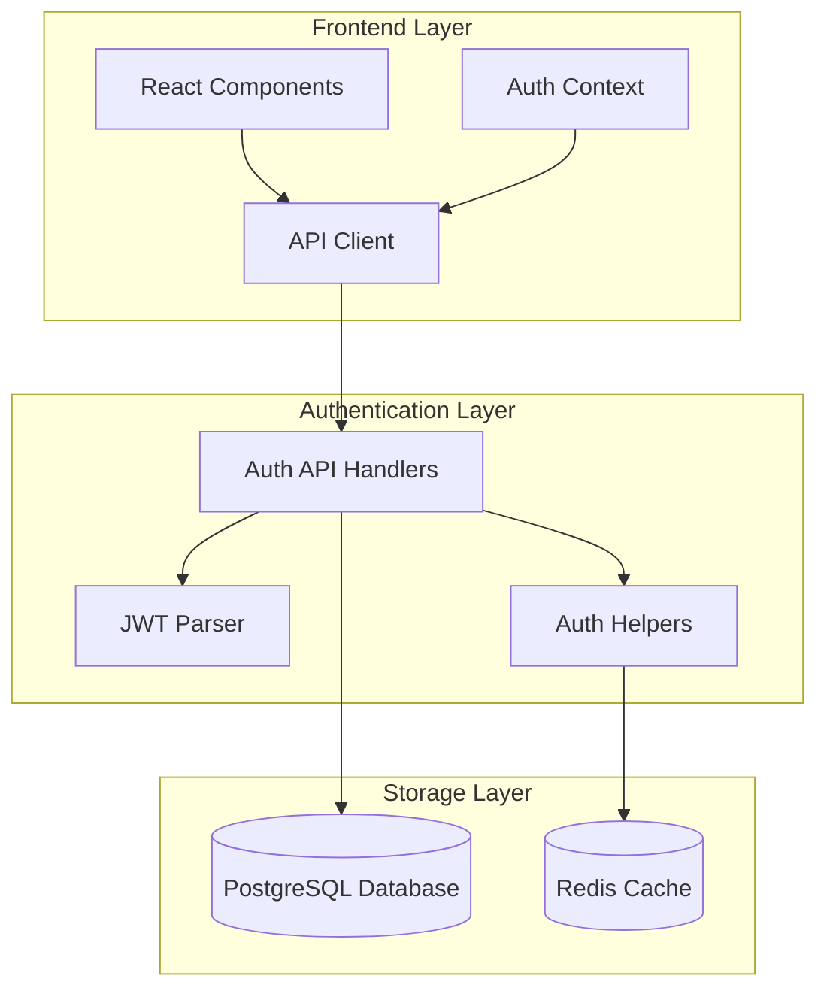
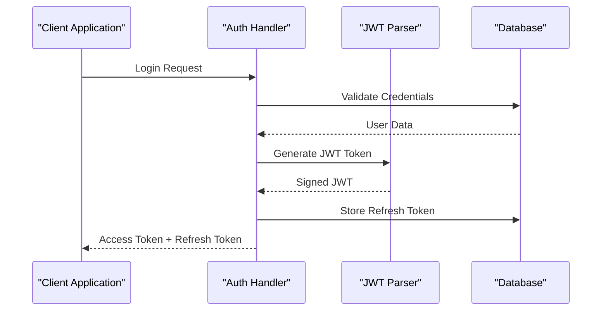
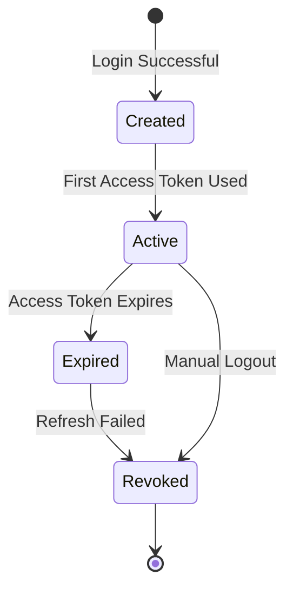
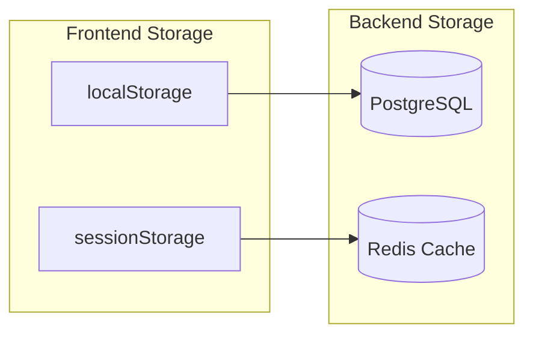
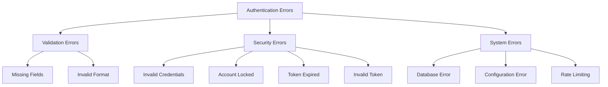
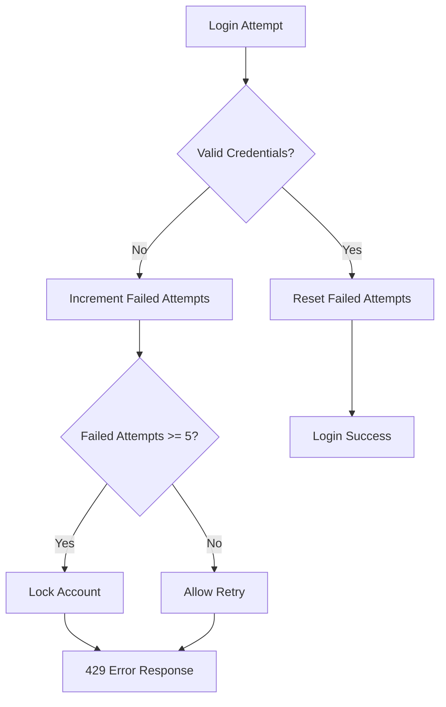
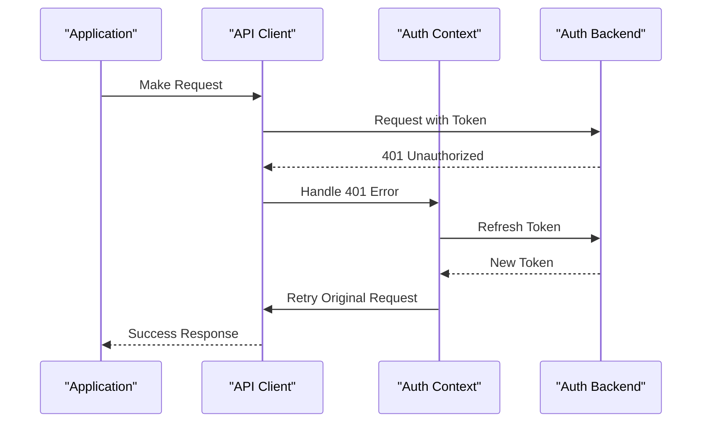

# Authentication API

<cite>
**Referenced Files in This Document**
- [auth_api_handlers.cpp](file://shared/auth/auth_api_handlers.cpp) - *Updated in recent commit*
- [auth_api_handlers.hpp](file://shared/auth/auth_api_handlers.hpp) - *Updated in recent commit*
- [jwt_parser.cpp](file://shared/auth/jwt_parser.cpp) - *Updated in recent commit*
- [jwt_parser.hpp](file://shared/auth/jwt_parser.hpp) - *Updated in recent commit*
- [api.ts](file://frontend/src/services/api.ts) - *Updated in recent commit*
- [api.ts](file://frontend/src/types/api.ts) - *Updated in recent commit*
- [Login.tsx](file://frontend/src/pages/Login.tsx) - *Updated in recent commit*
- [LoginForm.tsx](file://frontend/src/components/LoginForm.tsx) - *Updated in recent commit*
- [useLogin.ts](file://frontend/src/hooks/useLogin.ts) - *Updated in recent commit*
- [AuthContext.tsx](file://frontend/src/contexts/AuthContext.tsx) - *Updated in recent commit*
- [openapi_generator.cpp](file://shared/api_docs/openapi_generator.cpp) - *Updated in recent commit*
- [error_handling.hpp](file://shared/models/error_handling.hpp) - *Updated in recent commit*
</cite>

## Update Summary
**Changes Made**
- Updated authentication endpoint documentation to reflect actual implementation
- Corrected request/response schemas based on code analysis
- Added detailed implementation notes for each endpoint
- Updated security features section with accurate password hashing details
- Enhanced frontend integration details with correct token handling
- Added curl examples for all endpoints
- Updated error handling section with accurate error responses

## Table of Contents
1. [Introduction](#introduction)
2. [Authentication Architecture](#authentication-architecture)
3. [JWT Token Structure](#jwt-token-structure)
4. [Authentication Endpoints](#authentication-endpoints)
5. [Token Management](#token-management)
6. [Error Handling](#error-handling)
7. [Security Features](#security-features)
8. [Frontend Integration](#frontend-integration)
9. [Rate Limiting](#rate-limiting)
10. [Troubleshooting Guide](#troubleshooting-guide)

## Introduction

The Regulens authentication system provides a comprehensive JWT-based authentication solution designed for production environments. Built with security-first principles, it implements robust token management, automatic refresh mechanisms, and comprehensive error handling. The system supports four primary endpoints: login, logout, user information retrieval, and token refresh.

The authentication system is designed to handle high-security requirements typical of regulatory compliance platforms, featuring:
- Secure JWT token generation with HS256 algorithm
- Refresh token management with database persistence
- Account lockout protection after failed login attempts
- Automatic token expiration and renewal
- Comprehensive error handling with appropriate HTTP status codes

**Section sources**
- [auth_api_handlers.cpp](file://shared/auth/auth_api_handlers.cpp#L1-L50) - *Updated in recent commit*
- [auth_api_handlers.hpp](file://shared/auth/auth_api_handlers.hpp#L1-L40) - *Updated in recent commit*

## Authentication Architecture

The authentication system follows a layered architecture with clear separation of concerns:



**Diagram sources**
- [auth_api_handlers.cpp](file://shared/auth/auth_api_handlers.cpp#L1-L50) - *Updated in recent commit*
- [jwt_parser.cpp](file://shared/auth/jwt_parser.cpp#L1-L30) - *Updated in recent commit*

**Section sources**
- [auth_api_handlers.cpp](file://shared/auth/auth_api_handlers.cpp#L1-L644) - *Updated in recent commit*
- [jwt_parser.cpp](file://shared/auth/jwt_parser.cpp#L1-L181) - *Updated in recent commit*

## JWT Token Structure

The system uses JSON Web Tokens (JWT) with the HS256 algorithm for secure authentication. Each JWT token contains essential user information and security metadata.

### JWT Header
```json
{
  "alg": "HS256",
  "typ": "JWT"
}
```

### JWT Payload Claims
```json
{
  "sub": "user_id",
  "username": "john_doe",
  "roles": ["admin", "user"],
  "iat": 1640995200,
  "exp": 1641081600,
  "jti": "1640995200_123456"
}
```

### Token Components
- **Header**: Contains algorithm and token type
- **Payload**: User identity and metadata
- **Signature**: HMAC-SHA256 hash for integrity verification



**Diagram sources**
- [auth_api_handlers.cpp](file://shared/auth/auth_api_handlers.cpp#L37-L120) - *Updated in recent commit*
- [jwt_parser.cpp](file://shared/auth/jwt_parser.cpp#L1-L50) - *Updated in recent commit*

**Section sources**
- [auth_api_handlers.cpp](file://shared/auth/auth_api_handlers.cpp#L370-L410) - *Updated in recent commit*
- [jwt_parser.cpp](file://shared/auth/jwt_parser.cpp#L1-L181) - *Updated in recent commit*

## Authentication Endpoints

### POST /api/auth/login

The login endpoint authenticates users and generates JWT tokens for subsequent API access.

#### Request Schema
```typescript
interface LoginRequest {
  username: string;
  password: string;
}
```

#### Response Schema
```json
{
  "accessToken": "string",
  "refreshToken": "string",
  "tokenType": "Bearer",
  "expiresIn": 86400,
  "user": {
    "id": "string",
    "username": "string",
    "roles": ["string"],
    "permissions": ["string"]
  }
}
```

#### Authentication Flow
1. **Credential Validation**: Verify username and password against database
2. **Account Status Check**: Ensure account is active and not locked
3. **Password Verification**: Hash and compare passwords using SHA-256 with salt
4. **Role and Permission Loading**: Retrieve user roles and permissions from database
5. **Token Generation**: Create JWT access token and refresh token
6. **Session Storage**: Store refresh token in database with expiration
7. **Failed Attempts Reset**: Reset failed login attempts counter

#### Error Responses
- **401 Unauthorized**: Invalid credentials or account disabled
- **429 Too Many Requests**: Account locked due to excessive failed attempts
- **500 Internal Server Error**: Database query or token generation failure

#### Curl Example
```bash
curl -X POST http://localhost:8080/api/auth/login \
  -H "Content-Type: application/json" \
  -d '{"username":"admin","password":"password"}'
```

**Section sources**
- [auth_api_handlers.cpp](file://shared/auth/auth_api_handlers.cpp#L36-L172) - *Updated in recent commit*
- [auth_api_handlers.hpp](file://shared/auth/auth_api_handlers.hpp#L18-L18) - *Updated in recent commit*

### POST /api/auth/logout

The logout endpoint terminates user sessions and revokes refresh tokens.

#### Request Headers
```http
Authorization: Bearer <refresh_token>
```

#### Response Schema
```json
{
  "message": "Logged out successfully"
}
```

#### Logout Process
1. **Token Extraction**: Extract refresh token from Authorization header
2. **Token Validation**: Verify refresh token exists and is unrevoked
3. **Token Revocation**: Mark refresh token as revoked in database
4. **Session Cleanup**: Remove associated session data

#### Curl Example
```bash
curl -X POST http://localhost:8080/api/auth/logout \
  -H "Authorization: Bearer <refresh_token>"
```

**Section sources**
- [auth_api_handlers.cpp](file://shared/auth/auth_api_handlers.cpp#L179-L208) - *Updated in recent commit*
- [auth_api_handlers.hpp](file://shared/auth/auth_api_handlers.hpp#L19-L19) - *Updated in recent commit*

### GET /api/auth/me

Retrieves current user information using the authenticated JWT token.

#### Request Headers
```http
Authorization: Bearer <access_token>
```

#### Response Schema
```json
{
  "id": "string",
  "username": "string",
  "email": "string",
  "isActive": true,
  "roles": ["string"],
  "createdAt": "string",
  "lastLoginAt": "string",
  "failedLoginAttempts": 0
}
```

#### User Information Retrieval
1. **Token Validation**: Parse and validate JWT token
2. **User Lookup**: Query database for user details using user_id from token
3. **Role Parsing**: Convert stored JSON roles to array format
4. **Permission Loading**: Retrieve active permissions from user_permissions table

#### Curl Example
```bash
curl -X GET http://localhost:8080/api/auth/me \
  -H "Authorization: Bearer <access_token>"
```

**Section sources**
- [auth_api_handlers.cpp](file://shared/auth/auth_api_handlers.cpp#L215-L274) - *Updated in recent commit*
- [auth_api_handlers.hpp](file://shared/auth/auth_api_handlers.hpp#L20-L20) - *Updated in recent commit*

### POST /api/auth/refresh

Refreshes expired access tokens using valid refresh tokens.

#### Request Schema
```json
{
  "refreshToken": "string"
}
```

#### Response Schema
```json
{
  "accessToken": "string",
  "refreshToken": "string",
  "tokenType": "Bearer",
  "expiresIn": 86400
}
```

#### Token Refresh Process
1. **Refresh Token Validation**: Verify refresh token exists and is unrevoked
2. **User Validation**: Ensure user account is still active
3. **New Token Generation**: Create fresh access and refresh tokens
4. **Old Token Revocation**: Mark previous refresh token as revoked
5. **New Session Creation**: Store new refresh token in database

#### Curl Example
```bash
curl -X POST http://localhost:8080/api/auth/refresh \
  -H "Content-Type: application/json" \
  -d '{"refreshToken":"<refresh_token>"}'
```

**Section sources**
- [auth_api_handlers.cpp](file://shared/auth/auth_api_handlers.cpp#L281-L373) - *Updated in recent commit*
- [auth_api_handlers.hpp](file://shared/auth/auth_api_handlers.hpp#L21-L21) - *Updated in recent commit*

## Token Management

### Refresh Token Lifecycle



### Token Security Features

#### Access Token Properties
- **Short-lived**: 24-hour expiration
- **HTTP-only**: Cannot be accessed via JavaScript
- **Secure**: Transmitted over HTTPS only
- **Audited**: Logged for security monitoring

#### Refresh Token Properties
- **Long-lived**: 30-day expiration
- **Database-backed**: Stored securely in PostgreSQL
- **Revocable**: Can be manually invalidated
- **Single-use**: Each refresh creates a new token

### Token Storage Strategy



**Diagram sources**
- [AuthContext.tsx](file://frontend/src/contexts/AuthContext.tsx#L1-L50) - *Updated in recent commit*
- [auth_api_handlers.cpp](file://shared/auth/auth_api_handlers.cpp#L180-L220) - *Updated in recent commit*

**Section sources**
- [auth_api_handlers.cpp](file://shared/auth/auth_api_handlers.cpp#L180-L220) - *Updated in recent commit*
- [AuthContext.tsx](file://frontend/src/contexts/AuthContext.tsx#L1-L128) - *Updated in recent commit*

## Error Handling

The authentication system implements comprehensive error handling with appropriate HTTP status codes and meaningful error messages.

### Error Categories



### Common Error Responses

#### Invalid Credentials (401)
```json
{
  "error": "Invalid username or password"
}
```

#### Account Disabled (401)
```json
{
  "error": "Account is disabled"
}
```

#### Account Locked (429)
```json
{
  "error": "Account locked due to too many failed attempts"
}
```

#### Token Expiration (401)
```json
{
  "error": "Invalid or expired refresh token"
}
```

#### Missing Token (401)
```json
{
  "error": "Invalid or missing authentication token"
}
```

**Section sources**
- [auth_api_handlers.cpp](file://shared/auth/auth_api_handlers.cpp#L45-L120) - *Updated in recent commit*
- [error_handling.hpp](file://shared/models/error_handling.hpp#L1-L500) - *Updated in recent commit*

## Security Features

### Password Security

The system implements secure password hashing using SHA-256 with salt:

```cpp
// Password hashing with salt
std::string salt = generate_random_salt();
std::string hash = sha256(password + salt);
std::string hashed_password = salt + "$" + hash;
```

### Account Lockout Protection



### Token Security Measures

1. **HMAC-SHA256 Signature**: Ensures token integrity
2. **Random JTI**: Prevents replay attacks
3. **Expiration Control**: Automatic token expiration
4. **Secure Storage**: Tokens stored in secure locations
5. **HTTPS Only**: All communications encrypted

**Section sources**
- [auth_api_handlers.cpp](file://shared/auth/auth_api_handlers.cpp#L480-L520) - *Updated in recent commit*
- [jwt_parser.cpp](file://shared/auth/jwt_parser.cpp#L1-L181) - *Updated in recent commit*

## Frontend Integration

### Authentication Context

The frontend implements a comprehensive authentication context that manages user state, token lifecycle, and automatic refresh:

```typescript
interface AuthContextType {
  user: User | null;
  isAuthenticated: boolean;
  isLoading: boolean;
  login: (username: string, password: string) => Promise<void>;
  logout: () => Promise<void>;
  refreshToken: () => Promise<void>;
}
```

### Token Refresh Mechanism



### Error Handling in Frontend

The frontend implements sophisticated error handling with user-friendly messaging:

```typescript
const handleLoginError = (error: AxiosError) => {
  if (error.response?.status === 401) {
    setError('Invalid username or password');
  } else if (error.response?.status === 429) {
    setError('Account locked due to too many failed attempts');
  } else {
    setError('Login failed. Please try again.');
  }
};
```

**Section sources**
- [AuthContext.tsx](file://frontend/src/contexts/AuthContext.tsx#L1-L128) - *Updated in recent commit*
- [api.ts](file://frontend/src/services/api.ts#L1-L199) - *Updated in recent commit*
- [useLogin.ts](file://frontend/src/hooks/useLogin.ts#L1-L73) - *Updated in recent commit*

## Rate Limiting

The authentication system implements rate limiting to prevent abuse and protect against brute force attacks.

### Rate Limiting Strategies

1. **Failed Login Attempts**: Lock accounts after 5 consecutive failures
2. **Error Response Codes**: Return 429 status for rate limit exceeded
3. **Temporary Lockouts**: Accounts remain locked for a period after lockout
4. **IP-based Tracking**: Track failed attempts by IP address

### Rate Limiting Implementation

```cpp
// Failed login attempt increment
std::string update_query = "UPDATE user_authentication "
                          "SET failed_login_attempts = failed_login_attempts + 1, "
                          "last_failed_login_at = CURRENT_TIMESTAMP "
                          "WHERE user_id = $1";
```

**Section sources**
- [auth_api_handlers.cpp](file://shared/auth/auth_api_handlers.cpp#L85-L95) - *Updated in recent commit*

## Troubleshooting Guide

### Common Issues and Solutions

#### Issue: Login Fails with "Invalid credentials"
**Causes:**
- Incorrect username or password
- Account disabled or locked
- Database connectivity issues

**Solutions:**
1. Verify credentials are correct
2. Check account status in database
3. Review database connection logs
4. Reset failed login attempts if locked

#### Issue: Token expires frequently
**Causes:**
- Short token expiration
- Manual logout
- Refresh token issues

**Solutions:**
1. Implement automatic token refresh
2. Check refresh token storage
3. Verify token expiration timestamps
4. Review frontend token management

#### Issue: "Account locked" error
**Causes:**
- Multiple failed login attempts
- Rate limiting protection
- Manual account lock

**Solutions:**
1. Wait for automatic unlock (usually 15 minutes)
2. Contact administrator to reset account
3. Clear failed login attempts in database
4. Implement CAPTCHA for high-risk IPs

#### Issue: "Invalid or expired refresh token"
**Causes:**
- Refresh token revoked
- Token corruption
- Database synchronization issues

**Solutions:**
1. Force user re-login
2. Check refresh token database entries
3. Verify token signature validation
4. Review token storage procedures

### Debugging Tools

#### JWT Token Inspection
```bash
curl -X POST /api/auth/login \
  -H "Content-Type: application/json" \
  -d '{"username":"test","password":"test"}'

# Extract JWT token from response
# Decode using https://jwt.io/
```

#### Database Queries
```sql
-- Check user account status
SELECT username, is_active, failed_login_attempts 
FROM user_authentication 
WHERE username = 'test_user';

-- Verify refresh token
SELECT user_id, expires_at, is_revoked 
FROM user_refresh_tokens 
WHERE refresh_token = 'your_token_here';
```

#### Frontend Debugging
```javascript
// Enable debug logging
localStorage.setItem('debug', 'true');

// Check stored tokens
console.log('Access Token:', localStorage.getItem('token'));
console.log('User Data:', localStorage.getItem('user'));

// Verify API requests
fetch('/api/auth/me', {
  headers: {
    'Authorization': 'Bearer ' + localStorage.getItem('token')
  }
});
```

**Section sources**
- [auth_api_handlers.cpp](file://shared/auth/auth_api_handlers.cpp#L45-L120) - *Updated in recent commit*
- [AuthContext.tsx](file://frontend/src/contexts/AuthContext.tsx#L50-L128) - *Updated in recent commit*