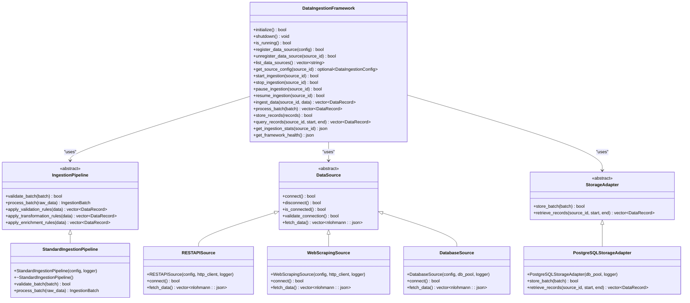

# Data Ingestion API

<cite>
**Referenced Files in This Document**   
- [ingestion_api_handlers.cpp](file://shared/data_ingestion/ingestion_api_handlers.cpp)
- [ingestion_api_handlers.hpp](file://shared/data_ingestion/ingestion_api_handlers.hpp)
- [data_ingestion_framework.cpp](file://shared/data_ingestion/data_ingestion_framework.cpp)
- [data_ingestion_framework.hpp](file://shared/data_ingestion/data_ingestion_framework.hpp)
- [standard_ingestion_pipeline.hpp](file://shared/data_ingestion/pipelines/standard_ingestion_pipeline.hpp)
- [useDataIngestion.ts](file://frontend/src/hooks/useDataIngestion.ts)
- [api.ts](file://frontend/src/services/api.ts)
- [DataIngestion.tsx](file://frontend/src/pages/DataIngestion.tsx)
- [DataQualityMonitor.tsx](file://frontend/src/pages/DataQualityMonitor.tsx)
</cite>

## Table of Contents
1. [Introduction](#introduction)
2. [Pipeline Management Endpoints](#pipeline-management-endpoints)
3. [Data Source Configuration Endpoints](#data-source-configuration-endpoints)
4. [Data Validation and Metrics Endpoints](#data-validation-and-metrics-endpoints)
5. [Request and Response Schemas](#request-and-response-schemas)
6. [Error Handling](#error-handling)
7. [Implementation Details](#implementation-details)

## Introduction
The Data Ingestion API provides a comprehensive interface for managing data ingestion pipelines, configuring data sources, and monitoring ingestion metrics. The API enables the creation, retrieval, updating, and deletion of ingestion pipelines, as well as configuration of various data sources including databases, REST APIs, and web scraping. It also provides endpoints for data validation and monitoring ingestion metrics.

The API is implemented in C++ with PostgreSQL as the backend database, and follows RESTful principles with JSON payloads. The implementation is production-grade with real database operations for pipeline monitoring and quality checks.

**Section sources**
- [ingestion_api_handlers.cpp](file://shared/data_ingestion/ingestion_api_handlers.cpp)
- [data_ingestion_framework.cpp](file://shared/data_ingestion/data_ingestion_framework.cpp)

## Pipeline Management Endpoints
The API provides CRUD operations for managing ingestion pipelines through the `/api/ingestion/pipelines` endpoint.

### List Pipelines (GET /api/ingestion/pipelines)
Retrieves a list of all ingestion pipelines.

**Request**
```
GET /api/ingestion/pipelines HTTP/1.1
Authorization: Bearer <token>
```

**Response**
```json
[
  {
    "id": "pipeline-1",
    "name": "Regulatory Monitoring Pipeline",
    "type": "web-scraping",
    "status": "active",
    "source": "regulatory-monitoring-source",
    "destination": "postgresql",
    "recordsProcessed": 1500,
    "recordsFailed": 5,
    "lastRun": "2023-06-15T10:30:00Z",
    "nextRun": "2023-06-15T11:30:00Z"
  }
]
```

### Get Pipeline (GET /ingestion/pipelines/{id})
Retrieves a specific ingestion pipeline by ID.

**Request**
```
GET /ingestion/pipelines/pipeline-1 HTTP/1.1
Authorization: Bearer <token>
```

**Response**
```json
{
  "id": "pipeline-1",
  "name": "Regulatory Monitoring Pipeline",
  "type": "web-scraping",
  "status": "active",
  "source": "regulatory-monitoring-source",
  "destination": "postgresql",
  "recordsProcessed": 1500,
  "recordsFailed": 5,
  "lastRun": "2023-06-15T10:30:00Z",
  "nextRun": "2023-06-15T11:30:00Z",
  "config": {
    "scheduling": {
      "interval": "hourly",
      "startTime": "00:00",
      "endTime": "23:59"
    },
    "errorHandling": {
      "retryAttempts": 3,
      "retryInterval": 300,
      "errorThreshold": 10
    },
    "transformationRules": [
      {
        "ruleName": "normalize_dates",
        "type": "date_format",
        "targetFormat": "ISO8601"
      }
    ]
  }
}
```

### Create Pipeline (POST /ingestion/pipelines)
Creates a new ingestion pipeline.

**Request**
```
POST /ingestion/pipelines HTTP/1.1
Authorization: Bearer <token>
Content-Type: application/json
```

```json
{
  "name": "New Database Pipeline",
  "type": "database",
  "source": "database-source-1",
  "destination": "postgresql",
  "config": {
    "scheduling": {
      "interval": "daily",
      "startTime": "02:00",
      "endTime": "03:00"
    },
    "errorHandling": {
      "retryAttempts": 3,
      "retryInterval": 300,
      "errorThreshold": 10
    },
    "transformationRules": [
      {
        "ruleName": "normalize_dates",
        "type": "date_format",
        "targetFormat": "ISO8601"
      }
    ]
  }
}
```

**Response**
```json
{
  "id": "pipeline-2",
  "name": "New Database Pipeline",
  "type": "database",
  "status": "active",
  "source": "database-source-1",
  "destination": "postgresql",
  "recordsProcessed": 0,
  "recordsFailed": 0,
  "lastRun": null,
  "nextRun": "2023-06-16T02:00:00Z"
}
```

### Update Pipeline (PUT /ingestion/pipelines/{id})
Updates an existing ingestion pipeline.

**Request**
```
PUT /ingestion/pipelines/pipeline-1 HTTP/1.1
Authorization: Bearer <token>
Content-Type: application/json
```

```json
{
  "name": "Updated Regulatory Monitoring Pipeline",
  "config": {
    "scheduling": {
      "interval": "hourly",
      "startTime": "00:00",
      "endTime": "23:59"
    },
    "errorHandling": {
      "retryAttempts": 5,
      "retryInterval": 600,
      "errorThreshold": 20
    },
    "transformationRules": [
      {
        "ruleName": "normalize_dates",
        "type": "date_format",
        "targetFormat": "ISO8601"
      },
      {
        "ruleName": "validate_emails",
        "type": "pattern_match",
        "pattern": "^[^@]+@[^@]+\\.[^@]+$"
      }
    ]
  }
}
```

**Response**
```json
{
  "id": "pipeline-1",
  "name": "Updated Regulatory Monitoring Pipeline",
  "type": "web-scraping",
  "status": "active",
  "source": "regulatory-monitoring-source",
  "destination": "postgresql",
  "recordsProcessed": 1500,
  "recordsFailed": 5,
  "lastRun": "2023-06-15T10:30:00Z",
  "nextRun": "2023-06-15T11:30:00Z"
}
```

### Delete Pipeline (DELETE /ingestion/pipelines/{id})
Deletes an ingestion pipeline.

**Request**
```
DELETE /ingestion/pipelines/pipeline-1 HTTP/1.1
Authorization: Bearer <token>
```

**Response**
```json
{
  "message": "Pipeline deleted successfully"
}
```

**Section sources**
- [useDataIngestion.ts](file://frontend/src/hooks/useDataIngestion.ts)
- [DataIngestion.tsx](file://frontend/src/pages/DataIngestion.tsx)

## Data Source Configuration Endpoints
The API provides endpoints for configuring different types of data sources.

### Database Source (POST /ingestion/sources/database)
Configures a database source for data ingestion.

**Request**
```
POST /ingestion/sources/database HTTP/1.1
Authorization: Bearer <token>
Content-Type: application/json
```

```json
{
  "sourceId": "database-source-1",
  "name": "Customer Database",
  "connection": {
    "host": "db.example.com",
    "port": 5432,
    "database": "customers",
    "username": "user",
    "password": "password",
    "ssl": true
  },
  "query": "SELECT * FROM transactions WHERE created_at > NOW() - INTERVAL '1 hour'",
  "pollInterval": 3600
}
```

**Response**
```json
{
  "sourceId": "database-source-1",
  "status": "configured",
  "message": "Database source configured successfully"
}
```

### REST API Source (POST /ingestion/sources/rest)
Configures a REST API source for data ingestion.

**Request**
```
POST /ingestion/sources/rest HTTP/1.1
Authorization: Bearer <token>
Content-Type: application/json
```

```json
{
  "sourceId": "api-source-1",
  "name": "External API",
  "url": "https://api.example.com/data",
  "method": "GET",
  "headers": {
    "Authorization": "Bearer api-key",
    "Content-Type": "application/json"
  },
  "pollInterval": 1800,
  "pagination": {
    "type": "offset",
    "limitParam": "limit",
    "offsetParam": "offset",
    "limit": 100
  }
}
```

**Response**
```json
{
  "sourceId": "api-source-1",
  "status": "configured",
  "message": "REST API source configured successfully"
}
```

### Web Scraping Source (POST /ingestion/sources/web-scraping)
Configures a web scraping source for data ingestion.

**Request**
```
POST /ingestion/sources/web-scraping HTTP/1.1
Authorization: Bearer <token>
Content-Type: application/json
```

```json
{
  "sourceId": "web-source-1",
  "name": "Web Scraping Source",
  "url": "https://example.com/news",
  "selectors": {
    "title": "h1.article-title",
    "content": "div.article-content",
    "publishedDate": "time.published"
  },
  "pollInterval": 7200,
  "rateLimit": {
    "requests": 10,
    "perSeconds": 60
  },
  "userAgent": "Regulens-Scraper/1.0"
}
```

**Response**
```json
{
  "sourceId": "web-source-1",
  "status": "configured",
  "message": "Web scraping source configured successfully"
}
```

**Section sources**
- [data_ingestion_framework.cpp](file://shared/data_ingestion/data_ingestion_framework.cpp)
- [data_ingestion_framework.hpp](file://shared/data_ingestion/data_ingestion_framework.hpp)

## Data Validation and Metrics Endpoints
The API provides endpoints for data validation and monitoring ingestion metrics.

### Data Validation (POST /ingestion/validate)
Validates data against defined rules before ingestion.

**Request**
```
POST /ingestion/validate HTTP/1.1
Authorization: Bearer <token>
Content-Type: application/json
```

```json
{
  "sourceId": "database-source-1",
  "data": [
    {
      "id": 1,
      "name": "John Doe",
      "email": "john.doe@example.com",
      "amount": 1000.50
    }
  ],
  "rules": [
    {
      "field": "email",
      "type": "pattern",
      "pattern": "^[^@]+@[^@]+\\.[^@]+$"
    },
    {
      "field": "amount",
      "type": "range",
      "min": 0,
      "max": 1000000
    }
  ]
}
```

**Response**
```json
{
  "valid": true,
  "errors": [],
  "warnings": [
    {
      "recordId": 1,
      "field": "amount",
      "message": "Amount is close to maximum allowed value"
    }
  ],
  "statistics": {
    "totalRecords": 1,
    "validRecords": 1,
    "invalidRecords": 0,
    "warningRecords": 1
  }
}
```

### Ingestion Metrics (GET /ingestion/metrics)
Retrieves ingestion metrics for monitoring pipeline performance.

**Request**
```
GET /ingestion/metrics?source=regulatory-monitoring-source&time_range=24h&limit=100 HTTP/1.1
Authorization: Bearer <token>
```

**Response**
```json
{
  "metrics": [
    {
      "id": "metric-1",
      "sourceName": "regulatory-monitoring-source",
      "sourceType": "web-scraping",
      "pipelineName": "regulatory-monitoring-pipeline",
      "timestamp": "2023-06-15T10:30:00Z",
      "recordsIngested": 100,
      "recordsFailed": 0,
      "recordsSkipped": 5,
      "recordsUpdated": 10,
      "recordsDeleted": 0,
      "bytesProcessed": 153600,
      "durationMs": 2500,
      "throughputRecordsPerSec": 40,
      "throughputMbPerSec": 0.06,
      "errorCount": 0,
      "errorMessages": [],
      "warningCount": 2,
      "status": "success",
      "lagSeconds": 30,
      "batchId": "batch-123",
      "executionHost": "ingestion-worker-1",
      "memoryUsedMb": 256,
      "cpuUsagePercent": 45.5
    }
  ],
  "summary": {
    "totalRuns": 24,
    "totalRecords": 2400,
    "totalFailed": 12,
    "totalBytes": 3686400,
    "avgDurationMs": 2800,
    "avgThroughput": 42.5,
    "successfulRuns": 22,
    "failedRuns": 2,
    "avgLagSeconds": 45,
    "successRate": 0.9167
  },
  "sources": [
    {
      "name": "regulatory-monitoring-source",
      "type": "web-scraping",
      "runCount": 24,
      "totalRecords": 2400,
      "avgThroughput": 42.5,
      "lastRun": "2023-06-15T10:30:00Z"
    }
  ],
  "timeRange": "24h",
  "count": 1
}
```

**Section sources**
- [ingestion_api_handlers.cpp](file://shared/data_ingestion/ingestion_api_handlers.cpp)
- [DataQualityMonitor.tsx](file://frontend/src/pages/DataQualityMonitor.tsx)

## Request and Response Schemas
This section defines the schemas for request and response payloads used in the Data Ingestion API.

### Pipeline Configuration Schema
The pipeline configuration includes scheduling, error handling, and transformation rules.

```json
{
  "scheduling": {
    "interval": "string",
    "startTime": "string",
    "endTime": "string"
  },
  "errorHandling": {
    "retryAttempts": "integer",
    "retryInterval": "integer",
    "errorThreshold": "integer"
  },
  "transformationRules": [
    {
      "ruleName": "string",
      "type": "string",
      "parameters": {}
    }
  ]
}
```

### Pipeline Status Values
The possible status values for ingestion pipelines are:
- `active`: Pipeline is running and processing data
- `paused`: Pipeline is temporarily stopped
- `error`: Pipeline encountered an error
- `stopped`: Pipeline has been stopped

### Source Configuration Schemas
Different source types have specific configuration requirements:

**Database Source**
```json
{
  "sourceId": "string",
  "name": "string",
  "connection": {
    "host": "string",
    "port": "integer",
    "database": "string",
    "username": "string",
    "password": "string",
    "ssl": "boolean"
  },
  "query": "string",
  "pollInterval": "integer"
}
```

**REST API Source**
```json
{
  "sourceId": "string",
  "name": "string",
  "url": "string",
  "method": "string",
  "headers": {},
  "pollInterval": "integer",
  "pagination": {
    "type": "string",
    "limitParam": "string",
    "offsetParam": "string",
    "limit": "integer"
  }
}
```

**Web Scraping Source**
```json
{
  "sourceId": "string",
  "name": "string",
  "url": "string",
  "selectors": {},
  "pollInterval": "integer",
  "rateLimit": {
    "requests": "integer",
    "perSeconds": "integer"
  },
  "userAgent": "string"
}
```

**Section sources**
- [standard_ingestion_pipeline.hpp](file://shared/data_ingestion/pipelines/standard_ingestion_pipeline.hpp)
- [api.ts](file://frontend/src/types/api.ts)

## Error Handling
The API follows standard HTTP status codes for error handling:

- `200 OK`: Successful GET requests
- `201 Created`: Successful POST requests
- `204 No Content`: Successful DELETE requests
- `400 Bad Request`: Invalid request parameters or body
- `401 Unauthorized`: Missing or invalid authentication token
- `403 Forbidden`: Insufficient permissions
- `404 Not Found`: Resource not found
- `500 Internal Server Error`: Server-side error

Error responses follow the standard error format:

```json
{
  "error": "string",
  "message": "string",
  "code": "string",
  "timestamp": "string"
}
```

**Section sources**
- [api.ts](file://frontend/src/services/api.ts)
- [ingestion_api_handlers.cpp](file://shared/data_ingestion/ingestion_api_handlers.cpp)

## Implementation Details
The Data Ingestion API is implemented in C++ with a modular architecture that separates concerns between data source management, pipeline processing, and storage. The implementation uses PostgreSQL as the backend database for storing ingestion metrics and pipeline configurations.

The core implementation is in the `DataIngestionFramework` class, which manages the lifecycle of ingestion pipelines and coordinates between data sources, processing pipelines, and storage adapters. The framework supports multiple worker threads for parallel processing of ingestion batches.

The API handlers are implemented in the `ingestion_api_handlers.cpp` file, which provides the HTTP interface for the ingestion system. These handlers use the data ingestion framework to perform operations and return JSON responses.

The pipeline configuration is defined in the `PipelineConfig` struct, which includes settings for validation rules, transformations, enrichment rules, duplicate detection, compliance checking, batch size, processing timeout, and error recovery.



**Diagram sources **
- [data_ingestion_framework.cpp](file://shared/data_ingestion/data_ingestion_framework.cpp)
- [data_ingestion_framework.hpp](file://shared/data_ingestion/data_ingestion_framework.hpp)
- [standard_ingestion_pipeline.hpp](file://shared/data_ingestion/pipelines/standard_ingestion_pipeline.hpp)

**Section sources**
- [data_ingestion_framework.cpp](file://shared/data_ingestion/data_ingestion_framework.cpp)
- [ingestion_api_handlers.cpp](file://shared/data_ingestion/ingestion_api_handlers.cpp)