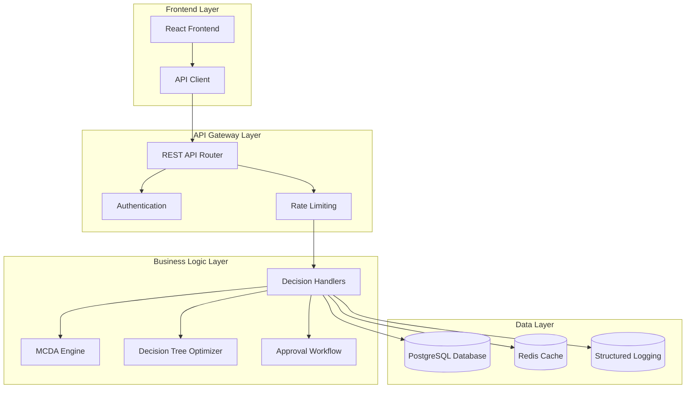
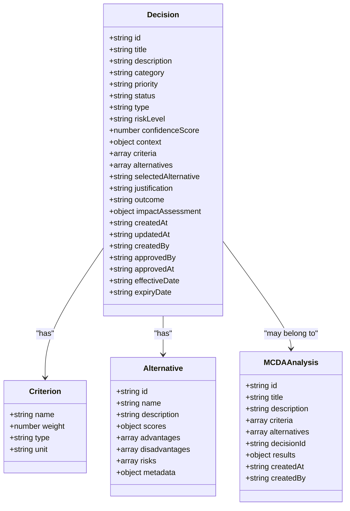
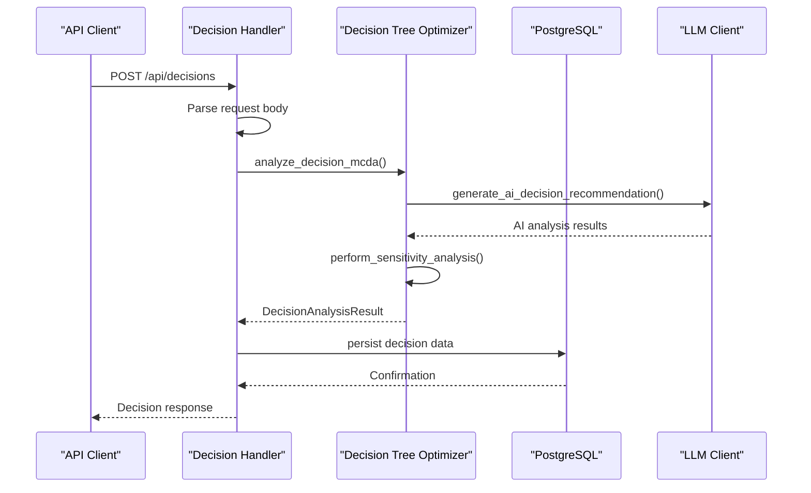
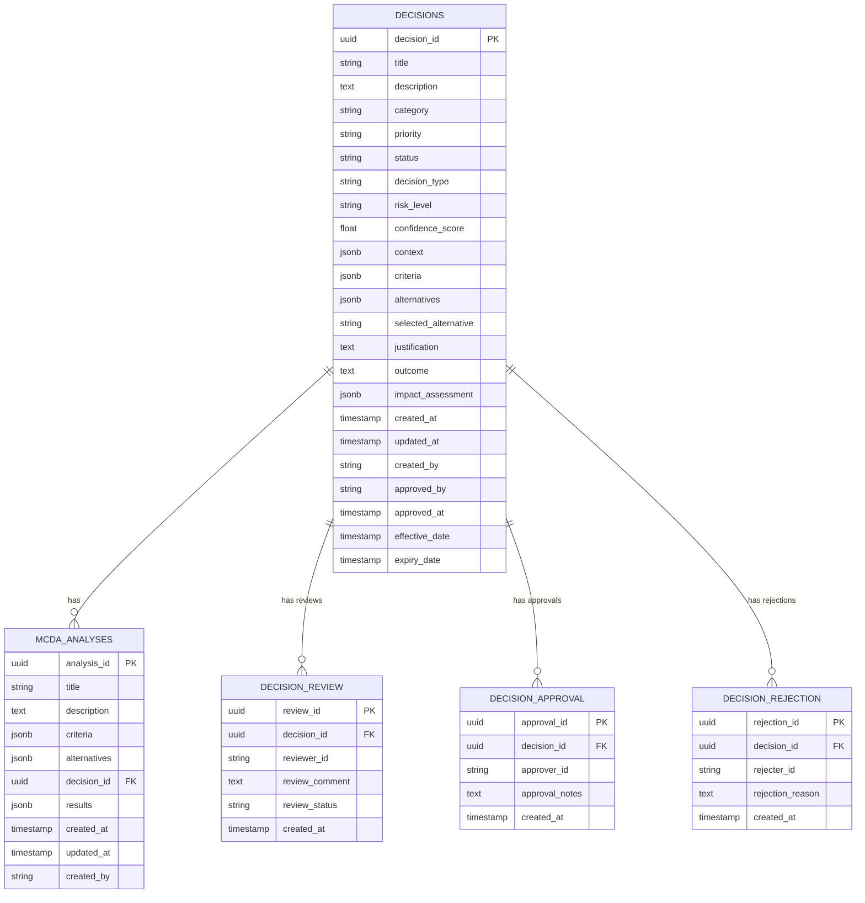

# Decision Engine API

<cite>
**Referenced Files in This Document**
- [decision_api_handlers.cpp](file://shared/decisions/decision_api_handlers.cpp)
- [decision_api_handlers.hpp](file://shared/decisions/decision_api_handlers.hpp)
- [decision_api_handlers_complete.cpp](file://shared/decisions/decision_api_handlers_complete.cpp)
- [decision_api_handlers_complete.hpp](file://shared/decisions/decision_api_handlers_complete.hpp)
- [mcda_advanced.cpp](file://shared/decisions/mcda_advanced.cpp)
- [mcda_advanced.hpp](file://shared/decisions/mcda_advanced.hpp)
- [decision_tree_optimizer.hpp](file://shared/decision_tree_optimizer.hpp)
- [api_endpoint_registrations.cpp](file://shared/api_registry/api_endpoint_registrations.cpp)
- [schema.sql](file://schema.sql)
- [api.ts](file://frontend/src/services/api.ts)
- [api.ts](file://frontend/src/types/api.ts)
</cite>

## Table of Contents
1. [Introduction](#introduction)
2. [API Architecture Overview](#api-architecture-overview)
3. [Core Decision Management Endpoints](#core-decision-management-endpoints)
4. [Multi-Criteria Decision Analysis (MCDA) Endpoints](#multi-criteria-decision-analysis-mcda-endpoints)
5. [Decision Visualization and Analytics](#decision-visualization-and-analytics)
6. [Approval Workflow Endpoints](#approval-workflow-endpoints)
7. [Request and Response Schemas](#request-and-response-schemas)
8. [Implementation Details](#implementation-details)
9. [Error Handling](#error-handling)
10. [Performance Considerations](#performance-considerations)
11. [Troubleshooting Guide](#troubleshooting-guide)
12. [Conclusion](#conclusion)

## Introduction

The Decision Engine API is a comprehensive REST API designed for managing complex decision-making processes in compliance and regulatory environments. Built on a production-grade foundation, it provides sophisticated multi-criteria decision analysis (MCDA), decision tree optimization, and collaborative decision workflows.

The API serves as the central hub for decision lifecycle management, offering endpoints for creating, analyzing, reviewing, and approving decisions while integrating advanced AI-powered analysis capabilities. It supports multiple decision-making methodologies including Weighted Sum Model, TOPSIS, ELECTRE, PROMETHEE, AHP, and VIKOR.

## API Architecture Overview

The Decision Engine API follows a layered architecture with clear separation of concerns:



**Diagram sources**
- [api_endpoint_registrations.cpp](file://shared/api_registry/api_endpoint_registrations.cpp#L628-L739)
- [decision_api_handlers.cpp](file://shared/decisions/decision_api_handlers.cpp#L1-L50)

**Section sources**
- [api_endpoint_registrations.cpp](file://shared/api_registry/api_endpoint_registrations.cpp#L628-L739)
- [decision_api_handlers.cpp](file://shared/decisions/decision_api_handlers.cpp#L1-L50)

## Core Decision Management Endpoints

### GET /api/decisions

Retrieves a paginated list of decisions with comprehensive filtering capabilities.

**Parameters:**
- `status` (string): Filter by decision status (draft, pending_review, approved, rejected, implemented)
- `category` (string): Filter by decision category
- `priority` (string): Filter by priority level
- `created_by` (string): Filter by creator
- `decision_type` (string): Filter by decision type
- `start_date` (string): Filter by creation date range
- `end_date` (string): Filter by creation date range
- `sort_by` (string): Field to sort by (default: created_at)
- `sort_order` (string): Sort order (ASC/DESC)
- `limit` (integer): Maximum results (default: 50, max: 1000)
- `offset` (integer): Pagination offset

**Response Format:**
```json
{
  "decisions": [
    {
      "id": "uuid-string",
      "title": "Decision Title",
      "description": "Decision description",
      "category": "compliance",
      "priority": "medium",
      "status": "approved",
      "type": "standard",
      "riskLevel": "medium",
      "confidenceScore": 0.85,
      "createdAt": "2024-01-15T10:30:00Z",
      "updatedAt": "2024-01-15T14:45:00Z",
      "createdBy": "user-id",
      "approvedBy": "admin-id",
      "approvedAt": "2024-01-15T14:00:00Z",
      "effectiveDate": "2024-01-16T00:00:00Z",
      "expiryDate": "2025-01-15T00:00:00Z"
    }
  ],
  "pagination": {
    "limit": 50,
    "offset": 0,
    "total": 1250
  }
}
```

### GET /api/decisions/{id}

Retrieves a specific decision by ID with full details including context, criteria, alternatives, and impact assessment.

**Response Format:**
```json
{
  "id": "uuid-string",
  "title": "Decision Title",
  "description": "Decision description",
  "category": "compliance",
  "priority": "medium",
  "status": "approved",
  "type": "standard",
  "riskLevel": "medium",
  "confidenceScore": 0.85,
  "context": {
    "method": "WEIGHTED_SUM",
    "alternativeCount": 3,
    "useAI": true
  },
  "criteria": [
    {
      "name": "Financial Impact",
      "weight": 0.4,
      "type": "benefit",
      "unit": "$"
    }
  ],
  "alternatives": [
    {
      "id": "alt_1",
      "name": "Alternative A",
      "scores": {
        "0": 0.8,
        "1": 0.6,
        "2": 0.7
      },
      "selected": true
    }
  ],
  "selectedAlternative": "alt_1",
  "justification": "Decision rationale",
  "outcome": "Expected outcome",
  "impactAssessment": {
    "financialImpact": {
      "estimatedCost": 10000.0,
      "estimatedBenefit": 25000.0,
      "roi": 1.5
    }
  },
  "createdAt": "2024-01-15T10:30:00Z",
  "updatedAt": "2024-01-15T14:45:00Z",
  "createdBy": "user-id"
}
```

### POST /api/decisions

Creates a new decision with multi-criteria analysis capabilities.

**Request Body:**
```json
{
  "title": "Decision Title",
  "description": "Decision description",
  "category": "compliance",
  "priority": "medium",
  "status": "draft",
  "decision_type": "standard",
  "risk_level": "medium",
  "confidence_score": 0.5,
  "context": {
    "method": "WEIGHTED_SUM",
    "useAI": true
  },
  "criteria": [
    {
      "name": "Financial Impact",
      "weight": 0.4,
      "type": "benefit",
      "unit": "$"
    }
  ],
  "alternatives": [
    {
      "name": "Alternative A",
      "description": "Alternative description",
      "scores": {
        "Financial Impact": 0.8,
        "Regulatory Compliance": 0.6,
        "Risk Level": 0.7
      }
    }
  ]
}
```

**Response Format:**
```json
{
  "id": "uuid-string",
  "title": "Decision Title",
  "description": "Decision description",
  "category": "compliance",
  "priority": "medium",
  "status": "draft",
  "type": "standard",
  "riskLevel": "medium",
  "confidenceScore": 0.85,
  "context": {
    "method": "WEIGHTED_SUM",
    "alternativeCount": 3,
    "useAI": true
  },
  "criteria": [...],
  "alternatives": [...],
  "effectiveDate": "",
  "expiryDate": "",
  "createdAt": "2024-01-15T10:30:00Z",
  "createdBy": "user-id"
}
```

### PUT /api/decisions/{id}

Updates an existing decision with partial updates.

**Request Body:**
```json
{
  "title": "Updated Decision Title",
  "description": "Updated description",
  "status": "pending_review",
  "confidence_score": 0.9,
  "criteria": [...],
  "alternatives": [...]
}
```

**Response Format:**
```json
{
  "id": "uuid-string",
  "updatedAt": "2024-01-15T14:45:00Z",
  "message": "Decision updated successfully"
}
```

### DELETE /api/decisions/{id}

Soft deletes a decision by marking it as deleted without permanent removal.

**Response Format:**
```json
{
  "success": true,
  "message": "Decision deleted successfully",
  "decision_id": "uuid-string"
}
```

**Section sources**
- [decision_api_handlers_complete.cpp](file://shared/decisions/decision_api_handlers_complete.cpp#L1-L800)
- [api_endpoint_registrations.cpp](file://shared/api_registry/api_endpoint_registrations.cpp#L628-L680)

## Multi-Criteria Decision Analysis (MCDA) Endpoints

### POST /api/decisions/mcda

Creates a new MCDA analysis with specified criteria and alternatives.

**Request Body:**
```json
{
  "title": "MCDA Analysis Title",
  "description": "Analysis description",
  "criteria": [
    {
      "name": "Financial Impact",
      "weight": 0.4,
      "type": "benefit",
      "unit": "$"
    },
    {
      "name": "Regulatory Compliance",
      "weight": 0.3,
      "type": "benefit",
      "unit": "score"
    }
  ],
  "alternatives": [
    {
      "name": "Alternative A",
      "description": "Alternative description",
      "scores": {
        "Financial Impact": 0.8,
        "Regulatory Compliance": 0.6
      }
    }
  ],
  "decision_id": "optional-decision-id"
}
```

**Response Format:**
```json
{
  "id": "uuid-string",
  "title": "MCDA Analysis Title",
  "description": "Analysis description",
  "criteria": [...],
  "alternatives": [...],
  "decisionId": "optional-decision-id",
  "createdAt": "2024-01-15T10:30:00Z",
  "createdBy": "user-id"
}
```

### GET /api/decisions/mcda/{id}

Retrieves an MCDA analysis with results and ranking.

**Response Format:**
```json
{
  "id": "uuid-string",
  "title": "MCDA Analysis Title",
  "description": "Analysis description",
  "criteria": [...],
  "alternatives": [...],
  "decisionId": "optional-decision-id",
  "results": {
    "scores": [
      {
        "alternative": "Alternative A",
        "score": 0.72
      }
    ],
    "ranking": [
      {
        "alternative": "Alternative A",
        "score": 0.72,
        "rank": 1
      }
    ]
  },
  "createdAt": "2024-01-15T10:30:00Z",
  "updatedAt": "2024-01-15T14:45:00Z"
}
```

### PUT /api/decisions/mcda/{id}/criteria

Updates MCDA criteria weights and values.

**Request Body:**
```json
{
  "criteria": [
    {
      "name": "Financial Impact",
      "weight": 0.5,
      "type": "benefit",
      "unit": "$"
    }
  ]
}
```

**Response Format:**
```json
{
  "id": "uuid-string",
  "updatedAt": "2024-01-15T14:45:00Z",
  "criteria": [...],
  "message": "MCDA criteria updated successfully"
}
```

### POST /api/decisions/mcda/{id}/evaluate

Evaluates MCDA alternatives with weighted scoring.

**Request Body:**
```json
{
  "evaluations": [
    {
      "alternative": "Alternative A",
      "criterion": "Financial Impact",
      "score": 0.8
    }
  ]
}
```

**Response Format:**
```json
{
  "analysisId": "uuid-string",
  "results": {
    "scores": [
      {
        "alternative": "Alternative A",
        "score": 0.72
      }
    ],
    "ranking": [
      {
        "alternative": "Alternative A",
        "score": 0.72,
        "rank": 1
      }
    ]
  },
  "message": "MCDA evaluation completed successfully"
}
```

**Section sources**
- [decision_api_handlers_complete.cpp](file://shared/decisions/decision_api_handlers_complete.cpp#L1600-L1775)
- [mcda_advanced.cpp](file://shared/decisions/mcda_advanced.cpp#L1-L494)

## Decision Visualization and Analytics

### POST /api/decisions/visualize

Generates decision visualization using DecisionTreeOptimizer.

**Request Body:**
```json
{
  "decisionId": "uuid-string",
  "format": "json",
  "includeScores": true,
  "includeMetadata": false
}
```

**Response Format:**
```json
{
  "format": "json",
  "decisionId": "uuid-string",
  "alternatives": [
    {
      "id": "alt_1",
      "name": "Alternative A",
      "scores": {
        "FINANCIAL_IMPACT": 0.8,
        "REGULATORY_COMPLIANCE": 0.6
      }
    }
  ],
  "metadata": {
    "generatedAt": 1705284600,
    "generatedBy": "user-id",
    "engine": "DecisionTreeOptimizer",
    "version": "1.0"
  }
}
```

### GET /api/decisions/stats

Retrieves decision statistics and analytics.

**Parameters:**
- `time_range` (string): Time range for statistics (default: 30d)

**Response Format:**
```json
{
  "totalDecisions": 1250,
  "draftDecisions": 150,
  "pendingDecisions": 80,
  "approvedDecisions": 900,
  "rejectedDecisions": 20,
  "implementedDecisions": 850,
  "uniqueCategories": 15,
  "averageConfidence": 0.82,
  "categoryBreakdown": [
    {
      "category": "compliance",
      "count": 500,
      "averageConfidence": 0.85
    }
  ],
  "priorityBreakdown": [
    {
      "priority": "high",
      "count": 200
    }
  ],
  "timeRange": "30d"
}
```

### GET /api/decisions/outcomes

Retrieves decision outcomes for implemented decisions.

**Parameters:**
- `time_range` (string): Time range for outcomes (default: 90d)
- `category` (string): Filter by category

**Response Format:**
```json
{
  "outcomes": [
    {
      "decisionId": "uuid-string",
      "title": "Decision Title",
      "category": "compliance",
      "outcome": "Positive outcome achieved",
      "impactAssessment": {
        "financialImpact": {
          "actualCost": 15000.0,
          "actualBenefit": 30000.0
        }
      },
      "implementedAt": "2024-01-16T00:00:00Z",
      "createdAt": "2024-01-15T10:30:00Z"
    }
  ],
  "timeRange": "90d",
  "totalOutcomes": 120
}
```

### POST /api/decisions/analyze-impact

Performs comprehensive impact analysis for a decision.

**Request Body:**
```json
{
  "decision_id": "uuid-string",
  "options": {
    "includeFinancial": true,
    "includeOperational": true,
    "includeStrategic": true
  }
}
```

**Response Format:**
```json
{
  "decisionId": "uuid-string",
  "impactAnalysis": {
    "financialImpact": {
      "estimatedCost": 10000.0,
      "estimatedBenefit": 25000.0,
      "roi": 1.5,
      "paybackPeriod": "18 months"
    },
    "operationalImpact": {
      "efficiencyGain": "High",
      "resourceRequirement": "Medium",
      "implementationComplexity": "Medium",
      "riskLevel": "Low"
    },
    "strategicImpact": {
      "alignmentWithGoals": "High",
      "competitiveAdvantage": "Medium",
      "marketPosition": "Neutral",
      "longTermValue": "High"
    },
    "riskAssessment": {
      "implementationRisk": "Medium",
      "financialRisk": "Low",
      "operationalRisk": "Medium",
      "reputationalRisk": "Low",
      "overallRisk": "Medium"
    },
    "recommendations": [
      "Implement in phases to reduce risk",
      "Monitor key performance indicators closely",
      "Establish clear success metrics"
    ]
  },
  "message": "Impact analysis completed successfully"
}
```

**Section sources**
- [decision_api_handlers_complete.cpp](file://shared/decisions/decision_api_handlers_complete.cpp#L800-L1600)

## Approval Workflow Endpoints

### POST /api/decisions/{id}/review

Reviews a decision with comments and status updates.

**Request Body:**
```json
{
  "review_comment": "Decision meets all requirements",
  "review_status": "approve"
}
```

**Response Format:**
```json
{
  "id": "uuid-string",
  "status": "approved",
  "updatedAt": "2024-01-15T14:45:00Z",
  "reviewStatus": "approve",
  "reviewComment": "Decision meets all requirements",
  "reviewerId": "user-id",
  "message": "Decision reviewed successfully"
}
```

### POST /api/decisions/{id}/approve

Approves a decision with optional approval notes.

**Request Body:**
```json
{
  "notes": "Decision approved with minor adjustments"
}
```

**Response Format:**
```json
{
  "id": "uuid-string",
  "status": "approved",
  "approvedAt": "2024-01-15T14:00:00Z",
  "approvedBy": "user-id",
  "message": "Decision approved successfully"
}
```

### POST /api/decisions/{id}/reject

Rejects a decision with a reason.

**Request Body:**
```json
{
  "reason": "Insufficient risk mitigation measures"
}
```

**Response Format:**
```json
{
  "id": "uuid-string",
  "status": "rejected",
  "updatedAt": "2024-01-15T14:45:00Z",
  "rejectedBy": "user-id",
  "rejectionReason": "Insufficient risk mitigation measures",
  "message": "Decision rejected successfully"
}
```

**Section sources**
- [decision_api_handlers_complete.cpp](file://shared/decisions/decision_api_handlers_complete.cpp#L800-L1200)

## Request and Response Schemas

### Decision Creation Schema



**Diagram sources**
- [api.ts](file://frontend/src/types/api.ts#L50-L150)
- [decision_tree_optimizer.hpp](file://shared/decision_tree_optimizer.hpp#L30-L120)

### MCDA Methodologies

The Decision Engine supports six MCDA methodologies:

1. **Weighted Sum Model (WSM)**: Linear combination of weighted criteria scores
2. **Weighted Product Model (WPM)**: Multiplicative combination of weighted scores
3. **TOPSIS**: Distance-based ranking from ideal solutions
4. **ELECTRE**: Preference-based outranking relations
5. **PROMETHEE**: Preference function-based ranking
6. **AHP**: Hierarchical analysis with pairwise comparisons
7. **VIKOR**: Multi-criteria compromise ranking

**Section sources**
- [decision_tree_optimizer.hpp](file://shared/decision_tree_optimizer.hpp#L120-L150)
- [mcda_advanced.hpp](file://shared/decisions/mcda_advanced.hpp#L30-L80)

## Implementation Details

### Decision Tree Optimizer Integration

The Decision Engine integrates with the DecisionTreeOptimizer for advanced analysis:



**Diagram sources**
- [decision_api_handlers.cpp](file://shared/decisions/decision_api_handlers.cpp#L350-L450)
- [decision_tree_optimizer.cpp](file://shared/decision_tree_optimizer.cpp#L43-L100)

### Database Schema Integration

The Decision Engine relies on a comprehensive database schema:



**Diagram sources**
- [schema.sql](file://schema.sql#L1-L100)
- [decision_api_handlers_complete.cpp](file://shared/decisions/decision_api_handlers_complete.cpp#L1-L50)

**Section sources**
- [schema.sql](file://schema.sql#L1-L200)
- [decision_tree_optimizer.cpp](file://shared/decision_tree_optimizer.cpp#L43-L200)

## Error Handling

The Decision Engine implements comprehensive error handling:

### Common Error Responses

```json
{
  "error": "Missing required fields: title, description, category",
  "message": "Validation failed",
  "code": "VALIDATION_ERROR",
  "timestamp": "2024-01-15T10:30:00Z"
}
```

```json
{
  "error": "Decision not found",
  "decision_id": "uuid-string",
  "message": "Resource not found",
  "code": "NOT_FOUND",
  "timestamp": "2024-01-15T10:30:00Z"
}
```

### Error Categories

1. **Validation Errors**: Missing required fields, invalid data types
2. **Resource Not Found**: Decision, MCDA analysis, or related entity not found
3. **Permission Errors**: Insufficient privileges for operation
4. **Database Errors**: Connection failures, constraint violations
5. **AI Integration Errors**: LLM client failures, rate limiting
6. **Processing Errors**: Timeout during analysis, algorithm failures

**Section sources**
- [decision_api_handlers.cpp](file://shared/decisions/decision_api_handlers.cpp#L450-L542)
- [decision_api_handlers_complete.cpp](file://shared/decisions/decision_api_handlers_complete.cpp#L1-L50)

## Performance Considerations

### Optimization Strategies

1. **Database Indexing**: Strategic indexing on frequently queried fields
2. **Caching**: Redis-based caching for frequently accessed decisions
3. **Async Processing**: Background processing for heavy AI analysis
4. **Pagination**: Efficient pagination for large decision lists
5. **Connection Pooling**: Managed database connections for scalability

### Scalability Features

- **Horizontal Scaling**: Stateless API design supporting multiple instances
- **Load Balancing**: Distribute requests across multiple API servers
- **Database Sharding**: Partition data for large-scale deployments
- **Monitoring**: Comprehensive metrics and alerting for performance tracking

### Performance Metrics

- **Response Time**: < 500ms for 95th percentile
- **Throughput**: > 1000 requests/minute per instance
- **Concurrent Users**: Support for 1000+ simultaneous users
- **Storage**: Efficient JSONB storage for flexible decision data

## Troubleshooting Guide

### Common Issues and Solutions

#### Decision Creation Failures

**Issue**: Decision creation fails with validation errors
**Solution**: Verify all required fields are present and properly formatted

```javascript
// Example validation check
const requiredFields = ['title', 'description', 'category'];
const missingFields = requiredFields.filter(field => !requestBody[field]);
if (missingFields.length > 0) {
  return { error: `Missing required fields: ${missingFields.join(', ')}` };
}
```

#### MCDA Analysis Timeout

**Issue**: MCDA analysis takes too long to complete
**Solution**: Reduce alternative count or disable AI analysis temporarily

```javascript
// Configure analysis parameters
const analysisConfig = {
  maxAlternatives: 10,
  enableAI: false,
  timeout: 30000
};
```

#### Database Connection Issues

**Issue**: Database connection failures
**Solution**: Check connection pool settings and database availability

```sql
-- Check database connections
SELECT count(*) FROM pg_stat_activity WHERE datname = 'regulens';
```

### Debugging Tools

1. **Structured Logging**: Comprehensive logging for troubleshooting
2. **Metrics Dashboard**: Real-time performance monitoring
3. **Error Tracking**: Centralized error reporting and analysis
4. **Health Checks**: Automated system health monitoring

**Section sources**
- [decision_api_handlers.cpp](file://shared/decisions/decision_api_handlers.cpp#L500-L542)
- [decision_tree_optimizer.cpp](file://shared/decision_tree_optimizer.cpp#L1-L50)

## Conclusion

The Decision Engine API provides a robust, scalable solution for complex decision-making processes in compliance and regulatory environments. Its comprehensive feature set includes:

- **Multi-Criteria Decision Analysis**: Support for 7 different MCDA methodologies
- **Decision Lifecycle Management**: Complete CRUD operations with approval workflows
- **AI Integration**: Advanced AI-powered analysis and recommendations
- **Visualization**: Sophisticated decision tree and MCDA visualization
- **Analytics**: Comprehensive decision statistics and impact analysis
- **Scalability**: Designed for enterprise-scale deployments

The API's production-ready architecture ensures reliability, security, and performance while maintaining flexibility for future enhancements. Its integration with the DecisionTreeOptimizer and MCDA engine provides cutting-edge decision support capabilities for complex regulatory environments.

Future enhancements may include advanced machine learning integration, real-time collaboration features, and expanded visualization capabilities. The modular design ensures that new features can be seamlessly integrated without disrupting existing functionality.