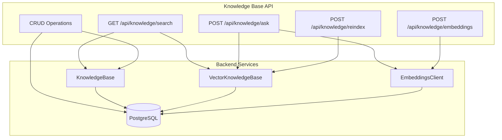
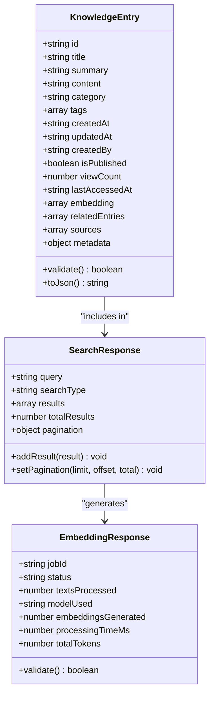
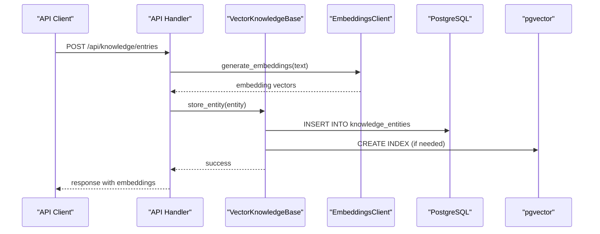

# Knowledge Base API

<cite>
**Referenced Files in This Document**
- [api_endpoint_registrations.cpp](file://shared/api_registry/api_endpoint_registrations.cpp)
- [knowledge_api_handlers.cpp](file://shared/knowledge_base/knowledge_api_handlers.cpp)
- [knowledge_api_handlers.hpp](file://shared/knowledge_base/knowledge_api_handlers.hpp)
- [knowledge_api_handlers_complete.cpp](file://shared/knowledge_base/knowledge_api_handlers_complete.cpp)
- [semantic_search_api_handlers.cpp](file://shared/knowledge_base/semantic_search_api_handlers.cpp)
- [vector_knowledge_base.cpp](file://shared/knowledge_base/vector_knowledge_base.cpp)
- [embeddings_client.cpp](file://shared/llm/embeddings_client.cpp)
- [schema.sql](file://schema.sql)
- [knowledge_base.cpp](file://shared/knowledge_base.cpp)
</cite>

## Table of Contents
1. [Introduction](#introduction)
2. [API Overview](#api-overview)
3. [Search Endpoints](#search-endpoints)
4. [CRUD Operations](#crud-operations)
5. [Semantic Search](#semantic-search)
6. [Embeddings Generation](#embeddings-generation)
7. [Reindexing](#reindexing)
8. [Response Schemas](#response-schemas)
9. [Error Handling](#error-handling)
10. [Implementation Details](#implementation-details)

## Introduction

The Knowledge Base API provides comprehensive endpoints for managing and searching knowledge content within the Regulens system. Built on PostgreSQL with pgvector support, it offers both traditional keyword-based search and modern semantic search capabilities using vector embeddings. The API supports full CRUD operations for knowledge entries, advanced semantic search with RAG (Retrieval-Augmented Generation), and sophisticated embedding generation for natural language processing tasks.

## API Overview

The Knowledge Base API consists of several categories of endpoints:

- **Search Endpoints**: `/api/knowledge/search` for hybrid semantic and keyword search
- **CRUD Operations**: Create, read, update, delete knowledge entries
- **Semantic Search**: `/api/knowledge/ask` for RAG-based question answering
- **Embeddings**: `/api/knowledge/embeddings` for generating vector representations
- **Reindexing**: `/api/knowledge/reindex` for optimizing search performance



**Diagram sources**
- [api_endpoint_registrations.cpp](file://shared/api_registry/api_endpoint_registrations.cpp#L484-L626)
- [knowledge_api_handlers.cpp](file://shared/knowledge_base/knowledge_api_handlers.cpp#L1-L723)

## Search Endpoints

### GET /api/knowledge/search

Performs hybrid semantic and keyword search across the knowledge base.

**Query Parameters:**
- `q` (required): Search query text
- `type`: Search type ("semantic", "keyword", "hybrid", default: "hybrid")
- `top_k`: Maximum number of results (default: 10)
- `category`: Filter by knowledge category
- `similarity_threshold`: Minimum similarity score (0.0-1.0, default: 0.7)

**Request Example:**
```bash
curl -X GET "https://api.regulens.com/api/knowledge/search?q=compliance+requirements&type=hybrid&top_k=10" \
-H "Authorization: Bearer <token>"
```

**Response Schema:**
```json
{
  "query": "compliance requirements",
  "searchType": "hybrid",
  "results": [
    {
      "id": "kb-123",
      "title": "Financial Compliance Guidelines",
      "content": "Detailed guidelines for financial compliance...",
      "category": "REGULATORY_COMPLIANCE",
      "tags": ["compliance", "financial"],
      "createdAt": "2024-01-15T10:30:00Z",
      "updatedAt": "2024-01-15T10:30:00Z",
      "relevanceScore": 0.85,
      "searchType": "semantic"
    }
  ],
  "totalResults": 5
}
```

**Section sources**
- [knowledge_api_handlers_complete.cpp](file://shared/knowledge_base/knowledge_api_handlers_complete.cpp#L30-L150)

## CRUD Operations

### GET /knowledge/entries

Retrieve knowledge entries with filtering and pagination.

**Query Parameters:**
- `category`: Filter by category
- `created_by`: Filter by creator
- `is_published`: Filter by publication status
- `tag`: Filter by tag
- `sort_by`: Sort column (default: "created_at")
- `sort_order`: Sort order ("ASC" or "DESC", default: "DESC")
- `limit`: Results per page (default: 50, max: 1000)
- `offset`: Pagination offset (default: 0)

**Response Schema:**
```json
{
  "entries": [
    {
      "id": "kb-123",
      "title": "Financial Compliance Guidelines",
      "summary": "Overview of financial compliance requirements",
      "content": "Detailed compliance guidelines...",
      "category": "REGULATORY_COMPLIANCE",
      "tags": ["compliance", "financial"],
      "createdAt": "2024-01-15T10:30:00Z",
      "updatedAt": "2024-01-15T10:30:00Z",
      "createdBy": "user-456",
      "isPublished": true,
      "viewCount": 15,
      "lastAccessedAt": "2024-01-16T09:00:00Z"
    }
  ],
  "pagination": {
    "limit": 50,
    "offset": 0,
    "total": 125
  }
}
```

### GET /knowledge/entries/{id}

Retrieve a specific knowledge entry by ID.

**Path Parameters:**
- `id` (required): Knowledge entry identifier

**Response Schema:**
```json
{
  "id": "kb-123",
  "title": "Financial Compliance Guidelines",
  "summary": "Overview of financial compliance requirements",
  "content": "Detailed compliance guidelines...",
  "category": "REGULATORY_COMPLIANCE",
  "tags": ["compliance", "financial"],
  "createdAt": "2024-01-15T10:30:00Z",
  "updatedAt": "2024-01-15T10:30:00Z",
  "createdBy": "user-456",
  "isPublished": true,
  "viewCount": 15,
  "lastAccessedAt": "2024-01-16T09:00:00Z",
  "embedding": [0.123, 0.456, ...],
  "relatedEntries": [],
  "sources": [],
  "metadata": {
    "confidence": 0.95,
    "author": "John Doe",
    "version": "1.0"
  }
}
```

### POST /knowledge/entries

Create a new knowledge entry with automatic embedding generation.

**Request Body:**
```json
{
  "title": "New Compliance Regulation",
  "content": "Detailed description of the new regulation...",
  "summary": "Summary of the regulation",
  "category": "REGULATORY_COMPLIANCE",
  "tags": ["new", "regulation", "compliance"],
  "is_published": true,
  "sources": ["source-url-1", "source-url-2"],
  "metadata": {
    "effective_date": "2024-01-01",
    "jurisdiction": "US"
  }
}
```

**Response Schema:**
```json
{
  "id": "kb-456",
  "title": "New Compliance Regulation",
  "summary": "Summary of the regulation",
  "content": "Detailed description of the new regulation...",
  "category": "REGULATORY_COMPLIANCE",
  "tags": ["new", "regulation", "compliance"],
  "isPublished": true,
  "sources": ["source-url-1", "source-url-2"],
  "metadata": {
    "effective_date": "2024-01-01",
    "jurisdiction": "US"
  },
  "createdAt": "2024-01-16T14:20:00Z",
  "createdBy": "user-456",
  "embeddingsGenerated": true
}
```

### PUT /knowledge/entries/{id}

Update an existing knowledge entry with optional embedding regeneration.

**Path Parameters:**
- `id` (required): Knowledge entry identifier

**Request Body:**
```json
{
  "title": "Updated Compliance Regulation",
  "content": "Updated detailed description...",
  "summary": "Updated summary",
  "category": "REGULATORY_COMPLIANCE",
  "tags": ["updated", "regulation", "compliance"],
  "is_published": true
}
```

**Response Schema:**
```json
{
  "id": "kb-456",
  "updatedAt": "2024-01-16T15:30:00Z",
  "message": "Knowledge entry updated successfully",
  "embeddingsRegenerated": true
}
```

### DELETE /knowledge/entries/{id}

Soft delete a knowledge entry by setting `is_published` to false.

**Path Parameters:**
- `id` (required): Knowledge entry identifier

**Response Schema:**
```json
{
  "success": true,
  "message": "Knowledge entry deleted successfully",
  "entryId": "kb-456"
}
```

**Section sources**
- [knowledge_api_handlers.cpp](file://shared/knowledge_base/knowledge_api_handlers.cpp#L60-L723)
- [knowledge_api_handlers_complete.cpp](file://shared/knowledge_base/knowledge_api_handlers_complete.cpp#L152-L700)

## Semantic Search

### POST /knowledge/ask

RAG-based question answering using semantic search and LLM integration.

**Request Body:**
```json
{
  "question": "What are the compliance requirements for financial institutions?",
  "maxSources": 5,
  "context": "Additional context for the question..."
}
```

**Response Schema:**
```json
{
  "sessionId": "qa-session-789",
  "question": "What are the compliance requirements for financial institutions?",
  "answer": "Based on the knowledge base, financial institutions must comply with...",
  "confidence": 0.85,
  "sources": [
    {
      "entryId": "kb-123",
      "title": "Financial Compliance Guidelines",
      "content": "Detailed compliance guidelines..."
    }
  ],
  "sourcesUsed": 3,
  "confidence": 0.85
}
```

**Section sources**
- [knowledge_api_handlers.cpp](file://shared/knowledge_base/knowledge_api_handlers.cpp#L600-L723)

## Embeddings Generation

### POST /knowledge/embeddings

Generate vector embeddings for text content using the embeddings client.

**Request Body:**
```json
{
  "texts": [
    "First piece of text content",
    "Second piece of text content",
    "Third piece of text content"
  ],
  "model": "sentence-transformers/all-MiniLM-L6-v2"
}
```

**Response Schema:**
```json
{
  "jobId": "embedding-job-123",
  "status": "completed",
  "textsProcessed": 3,
  "modelUsed": "sentence-transformers/all-MiniLM-L6-v2",
  "embeddingsGenerated": 3,
  "processingTimeMs": 150,
  "totalTokens": 125
}
```

**Section sources**
- [knowledge_api_handlers.cpp](file://shared/knowledge_base/knowledge_api_handlers.cpp#L680-L723)

## Reindexing

### POST /knowledge/reindex

Rebuild vector indices for improved search performance.

**Request Body:**
```json
{
  "forceFullReindex": false,
  "batchSize": 1000,
  "domains": ["REGULATORY_COMPLIANCE", "TRANSACTION_MONITORING"]
}
```

**Response Schema:**
```json
{
  "jobId": "reindex-job-456",
  "status": "accepted",
  "message": "Reindexing job started",
  "estimatedCompletionTime": "2024-01-17T00:00:00Z",
  "domainsToReindex": ["REGULATORY_COMPLIANCE", "TRANSACTION_MONITORING"]
}
```

**Section sources**
- [api_endpoint_registrations.cpp](file://shared/api_registry/api_endpoint_registrations.cpp#L612-L626)

## Response Schemas

### Knowledge Entry Structure



**Diagram sources**
- [knowledge_api_handlers_complete.cpp](file://shared/knowledge_base/knowledge_api_handlers_complete.cpp#L152-L300)

### Confidence Scores and Metadata

The knowledge base uses multiple confidence scoring mechanisms:

1. **Content Confidence**: Based on source reliability and content quality
2. **Similarity Score**: Vector similarity for semantic search results
3. **Relevance Score**: Keyword matching relevance for hybrid search
4. **Trust Score**: Based on author reputation and content validation

**Section sources**
- [knowledge_api_handlers_complete.cpp](file://shared/knowledge_base/knowledge_api_handlers_complete.cpp#L30-L150)

## Error Handling

The API implements comprehensive error handling with standardized error responses:

```json
{
  "error": "Missing required field: title",
  "errorCode": "VALIDATION_ERROR",
  "details": {
    "field": "title",
    "expected": "string",
    "provided": null
  }
}
```

**Common Error Codes:**
- `VALIDATION_ERROR`: Request validation failures
- `DATABASE_ERROR`: Database operation failures
- `AUTHENTICATION_ERROR`: Authentication/authorization issues
- `EMBEDDING_ERROR`: Embeddings generation failures
- `SEARCH_ERROR`: Semantic search operation failures

**Section sources**
- [knowledge_api_handlers.cpp](file://shared/knowledge_base/knowledge_api_handlers.cpp#L60-L723)

## Implementation Details

### Vector Knowledge Base Architecture



**Diagram sources**
- [vector_knowledge_base.cpp](file://shared/knowledge_base/vector_knowledge_base.cpp#L1-L200)
- [embeddings_client.cpp](file://shared/llm/embeddings_client.cpp#L1-L200)

### Embeddings Client Configuration

The embeddings client supports multiple models and configurations:

**Supported Models:**
- `sentence-transformers/all-MiniLM-L6-v2` (default)
- `sentence-transformers/all-MiniLM-L12-v2`
- `sentence-transformers/all-mpnet-base-v2`
- `BAAI/bge-base-en`
- `BAAI/bge-large-en`

**Configuration Options:**
- `EMBEDDINGS_MODEL_NAME`: Model selection
- `EMBEDDINGS_MAX_SEQ_LENGTH`: Maximum sequence length
- `EMBEDDINGS_BATCH_SIZE`: Processing batch size
- `EMBEDDINGS_NORMALIZE`: Enable normalization
- `EMBEDDINGS_CACHE_ENABLED`: Enable caching

**Section sources**
- [embeddings_client.cpp](file://shared/llm/embeddings_client.cpp#L1-L200)

### Database Schema Integration

The knowledge base integrates with PostgreSQL using:

1. **Primary Knowledge Storage**: `knowledge_base` table for basic content
2. **Vector Storage**: `knowledge_embeddings` table for vector representations
3. **Relationship Tracking**: `knowledge_entry_relationships` for semantic connections
4. **QA Sessions**: `knowledge_qa_sessions` for RAG interactions
5. **Embedding Jobs**: `knowledge_embedding_jobs` for batch operations

**Section sources**
- [schema.sql](file://schema.sql#L68-L750)