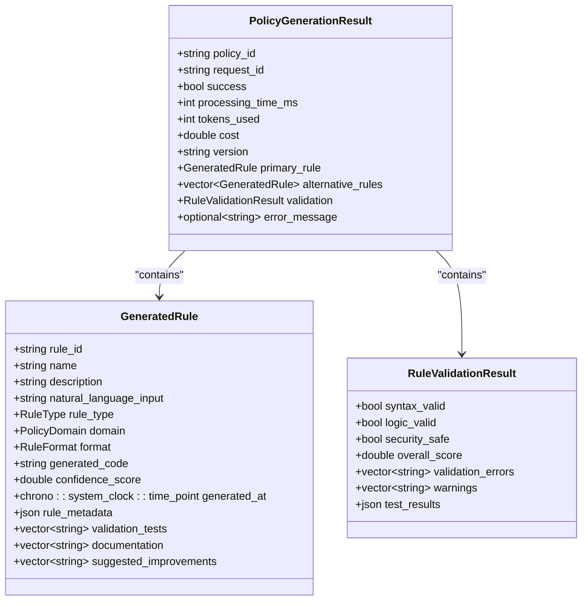
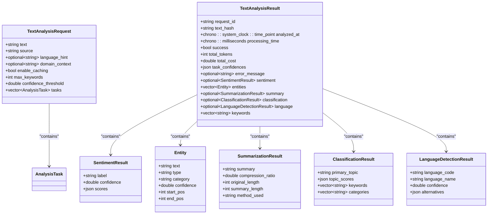
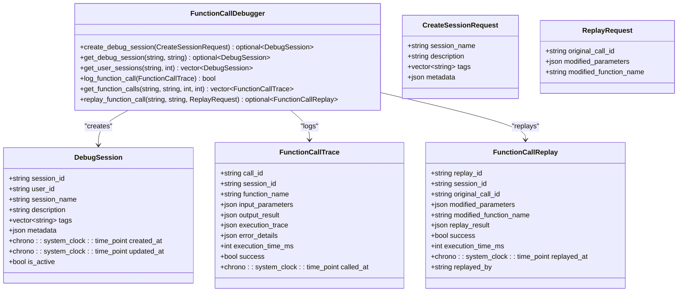
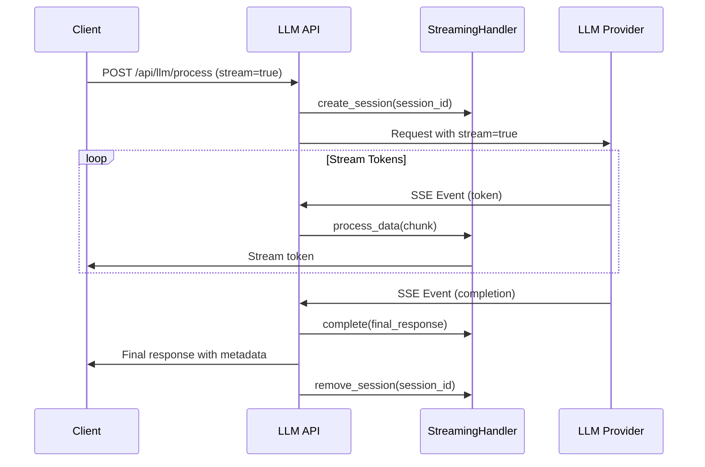

# LLM Integration API

<cite>
**Referenced Files in This Document**   
- [llm_api_handlers.cpp](file://shared/llm/llm_api_handlers.cpp)
- [policy_generation_api_handlers.cpp](file://shared/llm/policy_generation_api_handlers.cpp)
- [text_analysis_api_handlers.cpp](file://shared/llm/text_analysis_api_handlers.cpp)
- [function_call_debugger.cpp](file://shared/llm/function_call_debugger.cpp)
- [streaming_handler.cpp](file://shared/llm/streaming_handler.cpp)
- [openai_client.cpp](file://shared/llm/openai_client.cpp)
- [anthropic_client.cpp](file://shared/llm/anthropic_client.cpp)
</cite>

## Table of Contents
1. [Introduction](#introduction)
2. [Core LLM Processing Endpoint](#core-llm-processing-endpoint)
3. [Policy Generation Endpoints](#policy-generation-endpoints)
4. [Text Analysis Endpoints](#text-analysis-endpoints)
5. [Function Calling Debugger Endpoint](#function-calling-debugger-endpoint)
6. [Response Formats](#response-formats)
7. [LLM Orchestration and Streaming](#llm-orchestration-and-streaming)

## Introduction
The LLM Integration API provides a comprehensive set of endpoints for integrating large language models into regulatory compliance applications. The API supports natural language processing, policy generation, text analysis, and debugging of LLM function calls. Built with production-grade reliability, the system integrates with both OpenAI and Anthropic models, providing response streaming, caching, rate limiting, and comprehensive error handling.

**Section sources**
- [llm_api_handlers.cpp](file://shared/llm/llm_api_handlers.cpp#L1-L100)

## Core LLM Processing Endpoint

The core LLM processing endpoint handles natural language requests through the `/api/llm/process` route. This endpoint accepts prompts and processes them using either OpenAI or Anthropic models, with configurable parameters for temperature, max tokens, and model selection.

### Request Parameters
- **prompt** (string, required): The natural language prompt to process
- **model** (string, optional): The LLM model to use (default: "gpt-4-turbo-preview")
- **provider** (string, optional): The LLM provider ("openai" or "anthropic", default: "openai")
- **temperature** (number, optional): Controls randomness in output (0.0-1.0, default: 0.7)
- **max_tokens** (integer, optional): Maximum tokens in response (default: 4096)
- **stream** (boolean, optional): Whether to stream the response (default: false)

### Example Request
```json
{
  "prompt": "Analyze the regulatory compliance implications of this transaction",
  "model": "gpt-4-turbo-preview",
  "provider": "openai",
  "temperature": 0.5,
  "max_tokens": 2048
}
```

**Section sources**
- [llm_api_handlers.cpp](file://shared/llm/llm_api_handlers.cpp#L123-L161)
- [openai_client.cpp](file://shared/llm/openai_client.cpp#L200-L300)
- [anthropic_client.cpp](file://shared/llm/anthropic_client.cpp#L150-L250)

## Policy Generation Endpoints

The policy generation endpoints enable the creation of regulatory policies from natural language descriptions. The primary endpoint `/llm/policy-generation` generates policies based on regulatory domains, jurisdictions, and risk tolerance levels.

### POST /llm/policy-generation
Generates a compliance policy based on natural language input.

#### Request Parameters
- **description** (string, required): Natural language description of the policy requirements
- **domain** (string, optional): Regulatory domain (financial_compliance, data_privacy, etc.)
- **jurisdiction** (string, optional): Geographic jurisdiction (e.g., "US", "EU", "UK")
- **risk_tolerance** (string, optional): Risk tolerance level (low, medium, high)
- **rule_type** (string, optional): Type of rule to generate (compliance_rule, validation_rule, etc.)
- **output_format** (string, optional): Format for generated policy (json, yaml, dsl)

#### Example Request
```json
{
  "description": "Create a policy for handling customer data in financial transactions",
  "domain": "data_privacy",
  "jurisdiction": "EU",
  "risk_tolerance": "high",
  "rule_type": "compliance_rule",
  "output_format": "json"
}
```

#### Response Structure
The response includes the generated policy, confidence scores, and metadata about the generation process.



**Diagram sources**
- [policy_generation_api_handlers.cpp](file://shared/llm/policy_generation_api_handlers.cpp#L200-L400)
- [policy_generation_service.cpp](file://shared/llm/policy_generation_service.cpp#L100-L300)

**Section sources**
- [policy_generation_api_handlers.cpp](file://shared/llm/policy_generation_api_handlers.cpp#L1-L682)

## Text Analysis Endpoints

The text analysis endpoints provide LLM-powered analysis of regulatory documents, including entity extraction, sentiment analysis, and other NLP capabilities.

### POST /llm/text-analysis
Analyzes regulatory text using LLM-powered natural language processing.

#### Request Parameters
- **text** (string, required): The text to analyze (maximum 10,000 characters)
- **tasks** (array or string, optional): Analysis tasks to perform
- **source** (string, optional): Source of the text
- **language_hint** (string, optional): Language of the text
- **domain_context** (string, optional): Regulatory domain context
- **enable_caching** (boolean, optional): Whether to use response caching
- **max_keywords** (integer, optional): Maximum keywords to extract
- **confidence_threshold** (number, optional): Minimum confidence for results

#### Supported Analysis Tasks
- sentiment_analysis: Detect sentiment and emotional tone
- entity_extraction: Extract regulatory entities and concepts
- text_summarization: Generate concise summaries
- topic_classification: Classify text by regulatory topic
- language_detection: Detect the language of the text
- keyword_extraction: Extract important keywords and phrases

#### Example Request
```json
{
  "text": "The financial institution must comply with all applicable regulations regarding customer data protection and privacy. This includes maintaining secure systems and reporting any data breaches within 72 hours.",
  "tasks": ["entity_extraction", "sentiment_analysis", "keyword_extraction"],
  "domain_context": "financial_compliance",
  "confidence_threshold": 0.7
}
```



**Diagram sources**
- [text_analysis_api_handlers.cpp](file://shared/llm/text_analysis_api_handlers.cpp#L1-L715)
- [text_analysis_service.cpp](file://shared/llm/text_analysis_service.cpp#L1-L500)

**Section sources**
- [text_analysis_api_handlers.cpp](file://shared/llm/text_analysis_api_handlers.cpp#L1-L715)

## Function Calling Debugger Endpoint

The function calling debugger endpoint provides tools for troubleshooting LLM tool interactions and function calls.

### POST /llm/function-calling/debug
Creates a debug session for analyzing LLM function calls.

#### Request Parameters
- **session_name** (string, required): Name of the debug session
- **description** (string, optional): Description of the debug session
- **tags** (array, optional): Tags for categorizing the session
- **metadata** (object, optional): Additional metadata for the session

#### Response Structure
The response includes a debug session ID and details about the created session.



**Diagram sources**
- [function_call_debugger.cpp](file://shared/llm/function_call_debugger.cpp#L1-L396)
- [function_call_debugger.hpp](file://shared/llm/function_call_debugger.hpp#L1-L150)

**Section sources**
- [function_call_debugger.cpp](file://shared/llm/function_call_debugger.cpp#L1-L396)

## Response Formats

The LLM integration API returns standardized response formats across all endpoints, ensuring consistency in client implementations.

### Success Response Format
All successful responses follow this structure:

```json
{
  "success": true,
  "status_code": 200,
  "message": "Operation completed successfully",
  "data": {
    // Endpoint-specific response data
  }
}
```

### Error Response Format
All error responses follow this structure:

```json
{
  "success": false,
  "status_code": 400,
  "error": "Descriptive error message"
}
```

### Common Response Fields
- **success** (boolean): Indicates whether the request was successful
- **status_code** (integer): HTTP status code
- **message** (string): Human-readable success message (success responses only)
- **error** (string): Human-readable error description (error responses only)
- **data** (object): Endpoint-specific response data (success responses only)

### Generated Content Structure
Generated content from LLM endpoints includes confidence scores and citation references:

```json
{
  "content": "Generated policy text or analysis results",
  "confidence_score": 0.95,
  "citations": [
    {
      "source": "regulation_reference",
      "section": "section_number",
      "confidence": 0.98
    }
  ],
  "metadata": {
    "model_used": "gpt-4-turbo-preview",
    "tokens_used": 1567,
    "processing_time_ms": 2345,
    "timestamp": "2023-12-07T10:30:00Z"
  }
}
```

**Section sources**
- [policy_generation_api_handlers.cpp](file://shared/llm/policy_generation_api_handlers.cpp#L500-L600)
- [text_analysis_api_handlers.cpp](file://shared/llm/text_analysis_api_handlers.cpp#L500-L600)
- [llm_api_handlers.cpp](file://shared/llm/llm_api_handlers.cpp#L500-L600)

## LLM Orchestration and Streaming

The LLM orchestration system handles the integration with LLM providers and provides response streaming capabilities.

### Streaming Handler
The streaming handler manages real-time LLM responses using Server-Sent Events (SSE), allowing clients to receive tokens as they are generated.



### Response Streaming Parameters
When streaming is enabled, the API returns responses in text/event-stream format with the following event types:
- **token**: Contains a token of the generated response
- **completion**: Indicates the completion of the response
- **error**: Indicates an error in the streaming process

Clients should handle these events to provide real-time feedback to users.

**Diagram sources**
- [streaming_handler.cpp](file://shared/llm/streaming_handler.cpp#L1-L448)
- [llm_api_handlers.cpp](file://shared/llm/llm_api_handlers.cpp#L200-L300)

**Section sources**
- [streaming_handler.cpp](file://shared/llm/streaming_handler.cpp#L1-L448)
- [llm_api_handlers.cpp](file://shared/llm/llm_api_handlers.cpp#L1-L990)