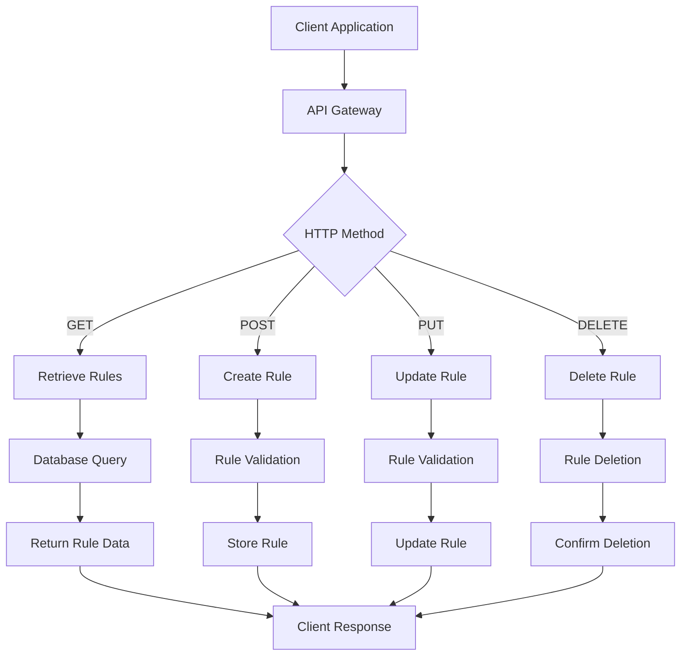
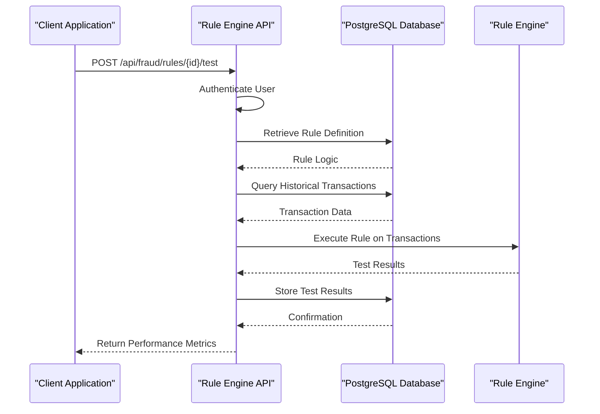
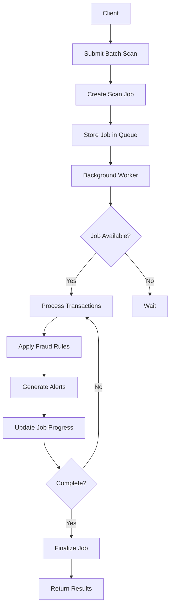
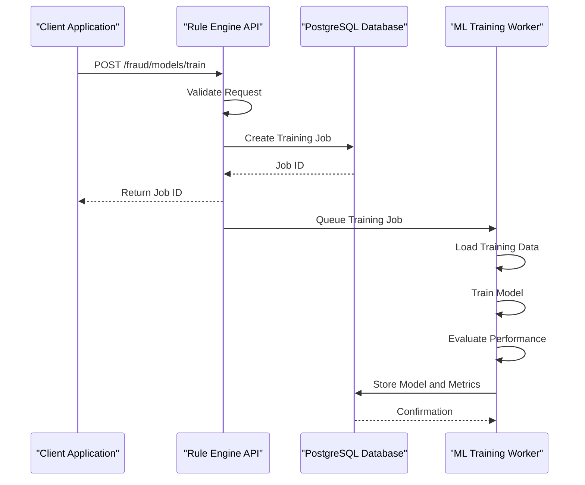
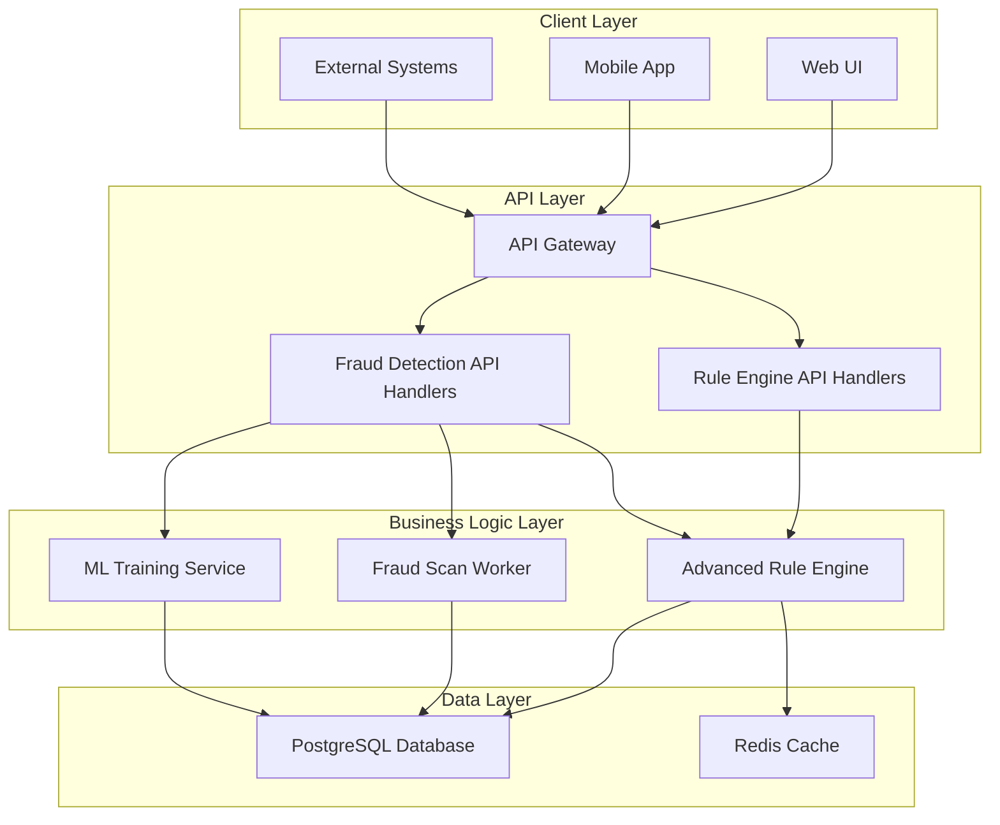

# Rule Engine API

<cite>
**Referenced Files in This Document**   
- [advanced_rule_engine_api_handlers.cpp](file://shared/rules/advanced_rule_engine_api_handlers.cpp)
- [advanced_rule_engine_api_handlers.hpp](file://shared/rules/advanced_rule_engine_api_handlers.hpp)
- [advanced_rule_engine.cpp](file://shared/rules/advanced_rule_engine.cpp)
- [advanced_rule_engine.hpp](file://shared/rules/advanced_rule_engine.hpp)
- [fraud_api_handlers.cpp](file://shared/fraud_detection/fraud_api_handlers.cpp)
- [fraud_scan_worker.cpp](file://shared/fraud_detection/fraud_scan_worker.cpp)
- [fraud_ml_api_handlers.cpp](file://shared/fraud_detection/fraud_ml_api_handlers.cpp)
</cite>

## Table of Contents
1. [Introduction](#introduction)
2. [Rule Management Endpoints](#rule-management-endpoints)
3. [Rule Testing and Validation](#rule-testing-and-validation)
4. [Batch Fraud Scan Endpoint](#batch-fraud-scan-endpoint)
5. [Model Training Endpoint](#model-training-endpoint)
6. [Request and Response Schemas](#request-and-response-schemas)
7. [Architecture Overview](#architecture-overview)
8. [Error Handling](#error-handling)
9. [Security and Access Control](#security-and-access-control)

## Introduction
The Rule Engine API provides a comprehensive REST interface for managing fraud detection rules and executing rule-based evaluations. This API enables administrators to create, retrieve, update, delete, and test fraud detection rules through well-defined endpoints. The system supports various rule types including validation, scoring, pattern matching, and machine learning-based rules.

The API is implemented in C++ with PostgreSQL as the backend database, providing production-grade reliability and performance. The rule engine evaluates transactions against registered rules and returns detailed results including fraud scores, risk levels, and recommendations. The system also supports batch processing for large-scale fraud scanning and model training for machine learning-based fraud detection.

The API follows REST principles with predictable resource URLs and standard HTTP response codes. All requests and responses are JSON-formatted, making integration with various client applications straightforward. The system includes comprehensive error handling, access control, and performance monitoring capabilities.

**Section sources**
- [advanced_rule_engine_api_handlers.cpp](file://shared/rules/advanced_rule_engine_api_handlers.cpp#L0-L41)
- [advanced_rule_engine_api_handlers.hpp](file://shared/rules/advanced_rule_engine_api_handlers.hpp#L0-L118)

## Rule Management Endpoints
The Rule Engine API provides a complete set of CRUD operations for managing fraud detection rules. These endpoints allow administrators to maintain a dynamic rule set that can be updated in real-time without service interruption.

The primary rule management endpoints include:
- **GET /api/fraud/rules**: Retrieves a list of all active fraud detection rules with optional filtering by rule type, priority, and status. The response includes pagination information and can be limited to a specific number of records.
- **GET /api/fraud/rules/{id}**: Retrieves a specific rule by its unique identifier, returning the complete rule definition including conditions, actions, and metadata.
- **POST /api/fraud/rules**: Creates a new fraud detection rule. The request body must contain the rule definition including name, description, priority, rule logic, and other configuration parameters.
- **PUT /api/fraud/rules/{id}**: Updates an existing rule with new configuration. The entire rule definition is replaced with the provided data.
- **DELETE /api/fraud/rules/{id}**: Removes a rule from the system. This operation is permanent and cannot be undone.

All rule management operations require administrative privileges and are logged for audit purposes. The system validates rule definitions before storing them to ensure they follow the required schema and contain valid logic expressions.



**Diagram sources**
- [advanced_rule_engine_api_handlers.cpp](file://shared/rules/advanced_rule_engine_api_handlers.cpp#L207-L245)
- [advanced_rule_engine_api_handlers.hpp](file://shared/rules/advanced_rule_engine_api_handlers.hpp#L33-L50)

**Section sources**
- [advanced_rule_engine_api_handlers.cpp](file://shared/rules/advanced_rule_engine_api_handlers.cpp#L207-L245)
- [advanced_rule_engine_api_handlers.hpp](file://shared/rules/advanced_rule_engine_api_handlers.hpp#L33-L50)

## Rule Testing and Validation
The Rule Engine API provides comprehensive functionality for testing and validating rules before deployment. This ensures that rules perform as expected and helps prevent false positives or negatives in production.

The **POST /api/fraud/rules/{id}/test** endpoint allows users to validate a specific rule against historical transaction data. The request includes a time range parameter (e.g., "7d", "30d") that specifies the period of historical data to use for testing. The system evaluates the rule against transactions from the specified period and returns detailed performance metrics.

The testing process includes:
- **Match Count**: The number of transactions that triggered the rule
- **False Positives**: Transactions flagged by the rule but not confirmed as fraudulent
- **Accuracy, Precision, Recall, and F1 Score**: Standard machine learning metrics that quantify the rule's performance
- **Performance History**: Historical test results for tracking rule effectiveness over time

The system also provides a **POST /api/fraud/rules/validate** endpoint that checks the syntax and logic of a rule definition without executing it against data. This helps catch configuration errors before rule registration.



**Diagram sources**
- [advanced_rule_engine_api_handlers.cpp](file://shared/rules/advanced_rule_engine_api_handlers.cpp#L78-L110)
- [advanced_rule_engine.cpp](file://shared/rules/advanced_rule_engine.cpp#L100-L150)

**Section sources**
- [advanced_rule_engine_api_handlers.cpp](file://shared/rules/advanced_rule_engine_api_handlers.cpp#L78-L110)
- [advanced_rule_engine.cpp](file://shared/rules/advanced_rule_engine.cpp#L100-L150)

## Batch Fraud Scan Endpoint
The **POST /fraud/scan/batch** endpoint enables large-scale fraud detection by scanning historical transactions against the current rule set. This is particularly useful for periodic compliance checks, post-incident investigations, or validating rule changes against historical data.

The batch scan process works as follows:
1. The client submits a scan request with optional filters (date range, transaction types, amount ranges)
2. The system creates a scan job and returns a job ID for tracking progress
3. Background workers process the job by retrieving transactions that match the criteria
4. Each transaction is evaluated against all active rules
5. Results are stored in the database, and alerts are generated for flagged transactions

The endpoint returns a job ID that can be used to monitor scan progress through a separate status endpoint. The response includes estimated completion time based on the number of transactions to scan.



**Diagram sources**
- [fraud_api_handlers.cpp](file://shared/fraud_detection/fraud_api_handlers.cpp#L1000-L1208)
- [fraud_scan_worker.cpp](file://shared/fraud_detection/fraud_scan_worker.cpp#L0-L350)

**Section sources**
- [fraud_api_handlers.cpp](file://shared/fraud_detection/fraud_api_handlers.cpp#L1000-L1208)
- [fraud_scan_worker.cpp](file://shared/fraud_detection/fraud_scan_worker.cpp#L0-L350)

## Model Training Endpoint
The **POST /fraud/models/train** endpoint initiates the training of machine learning models for fraud detection. This endpoint creates a training job that can be monitored for progress and results.

The training process includes:
- **Model Configuration**: Specifying the model type (e.g., neural network, gradient boosting), hyperparameters, and training dataset
- **Job Creation**: Storing the training configuration in the database with a "training" status
- **Background Processing**: Queuing the job for execution by ML training workers
- **Performance Evaluation**: Testing the trained model against validation data and calculating metrics

The endpoint returns a job ID that can be used to track training progress and retrieve performance metrics once training is complete. The response includes estimated completion time based on the specified number of training epochs.



**Diagram sources**
- [fraud_ml_api_handlers.cpp](file://shared/fraud_detection/fraud_ml_api_handlers.cpp#L500-L631)
- [advanced_rule_engine.cpp](file://shared/rules/advanced_rule_engine.cpp#L500-L600)

**Section sources**
- [fraud_ml_api_handlers.cpp](file://shared/fraud_detection/fraud_ml_api_handlers.cpp#L500-L631)
- [advanced_rule_engine.cpp](file://shared/rules/advanced_rule_engine.cpp#L500-L600)

## Request and Response Schemas
The Rule Engine API uses standardized JSON schemas for requests and responses to ensure consistency and ease of integration.

### Rule Creation Request Schema
```json
{
  "name": "High Value Transaction Rule",
  "description": "Detects transactions over $10,000",
  "priority": "HIGH",
  "rule_type": "VALIDATION",
  "rule_logic": {
    "conditions": [
      {
        "field": "transaction.amount",
        "operator": "greater_than",
        "value": 10000,
        "description": "Transaction amount exceeds threshold"
      }
    ]
  },
  "parameters": {
    "threshold": 10000,
    "currency": "USD"
  },
  "input_fields": ["transaction.amount", "transaction.currency"],
  "output_fields": ["fraud_score", "risk_level"],
  "is_active": true
}
```

### Rule Response Schema
```json
{
  "success": true,
  "status_code": 200,
  "data": {
    "rule_id": "rule_12345",
    "name": "High Value Transaction Rule",
    "description": "Detects transactions over $10,000",
    "priority": "HIGH",
    "rule_type": "VALIDATION",
    "rule_logic": { /* rule logic */ },
    "parameters": { /* parameters */ },
    "input_fields": ["transaction.amount", "transaction.currency"],
    "output_fields": ["fraud_score", "risk_level"],
    "is_active": true,
    "created_by": "admin_user",
    "created_at": 1640995200,
    "updated_at": 1640995200
  }
}
```

### Rule Testing Response Schema
```json
{
  "matchCount": 25,
  "falsePositives": 3,
  "accuracy": 0.92,
  "precision": 0.88,
  "recall": 0.95,
  "f1Score": 0.91,
  "transactionsTested": 1000,
  "truePositives": 22,
  "matchedTransactions": ["txn_1", "txn_2", "..."],
  "timeRange": "30d"
}
```

### Batch Scan Response Schema
```json
{
  "jobId": "scan_abc123",
  "scanType": "transaction_range",
  "status": "queued",
  "transactionsToScan": 5000,
  "message": "Batch fraud scan queued for processing",
  "createdAt": "2023-01-01T00:00:00Z",
  "estimatedCompletionMinutes": 50
}
```

**Section sources**
- [advanced_rule_engine_api_handlers.cpp](file://shared/rules/advanced_rule_engine_api_handlers.cpp#L393-L428)
- [advanced_rule_engine.hpp](file://shared/rules/advanced_rule_engine.hpp#L0-L255)

## Architecture Overview
The Rule Engine API follows a modular architecture with clear separation of concerns between components. The system is designed for high availability, scalability, and maintainability.



The architecture consists of four main layers:
1. **Client Layer**: Various client applications that consume the API
2. **API Layer**: REST endpoints that handle HTTP requests and responses
3. **Business Logic Layer**: Core processing components that implement rule evaluation, batch scanning, and model training
4. **Data Layer**: Persistent storage and caching systems

The Advanced Rule Engine component is central to the architecture, responsible for rule management, execution, and performance monitoring. It interacts with the database for persistent storage and uses Redis for caching frequently accessed rules to improve performance.

**Diagram sources**
- [advanced_rule_engine_api_handlers.cpp](file://shared/rules/advanced_rule_engine_api_handlers.cpp#L0-L41)
- [advanced_rule_engine.cpp](file://shared/rules/advanced_rule_engine.cpp#L0-L100)

**Section sources**
- [advanced_rule_engine_api_handlers.cpp](file://shared/rules/advanced_rule_engine_api_handlers.cpp#L0-L41)
- [advanced_rule_engine.cpp](file://shared/rules/advanced_rule_engine.cpp#L0-L100)

## Error Handling
The Rule Engine API implements comprehensive error handling to provide meaningful feedback to clients and maintain system stability.

Standard error response format:
```json
{
  "success": false,
  "status_code": 400,
  "error": "Descriptive error message"
}
```

Common error scenarios and responses:
- **400 Bad Request**: Invalid request format or missing required fields
- **403 Forbidden**: Insufficient permissions to perform the operation
- **404 Not Found**: Requested resource (rule, job, etc.) does not exist
- **422 Unprocessable Entity**: Valid request format but invalid business logic
- **500 Internal Server Error**: Unexpected server error during processing

The system logs all errors with detailed context for troubleshooting while returning generic error messages to clients to avoid exposing sensitive information.

**Section sources**
- [advanced_rule_engine_api_handlers.cpp](file://shared/rules/advanced_rule_engine_api_handlers.cpp#L78-L110)
- [advanced_rule_engine_api_handlers.hpp](file://shared/rules/advanced_rule_engine_api_handlers.hpp#L52-L72)

## Security and Access Control
The Rule Engine API implements robust security measures to protect sensitive fraud detection rules and data.

Access control is enforced through:
- **Role-Based Permissions**: Different user roles have specific permissions for rule management operations
- **Administrative Privileges**: Only admin users can create, update, or delete rules
- **Resource-Level Access**: Users can only access resources they have permission to view or modify
- **Audit Logging**: All rule management operations are logged with user ID, timestamp, and operation details

The system validates user access by querying the database for permissions before executing any sensitive operation. This ensures that only authorized users can modify the rule set, maintaining the integrity of the fraud detection system.

**Section sources**
- [advanced_rule_engine_api_handlers.cpp](file://shared/rules/advanced_rule_engine_api_handlers.cpp#L207-L245)
- [advanced_rule_engine_api_handlers.hpp](file://shared/rules/advanced_rule_engine_api_handlers.hpp#L52-L72)