# Simulation API

<cite>
**Referenced Files in This Document**   
- [simulator_api_handlers.cpp](file://shared/simulator/simulator_api_handlers.cpp)
- [simulator_api_handlers.hpp](file://shared/simulator/simulator_api_handlers.hpp)
- [regulatory_simulator.hpp](file://shared/simulator/regulatory_simulator.hpp)
- [regulatory_simulator.cpp](file://shared/simulator/regulatory_simulator.cpp)
- [api_endpoint_registrations.cpp](file://shared/api_registry/api_endpoint_registrations.cpp)
- [useSimulator.ts](file://frontend/src/hooks/useSimulator.ts)
- [RegulatorySimulator.tsx](file://frontend/src/pages/RegulatorySimulator.tsx)
- [schema.sql](file://schema.sql)
</cite>

## Table of Contents
1. [Introduction](#introduction)
2. [Scenario Management Endpoints](#scenario-management-endpoints)
3. [Simulation Execution Endpoints](#simulation-execution-endpoints)
4. [Template-Based Scenario Creation](#template-based-scenario-creation)
5. [Analytics Endpoints](#analytics-endpoints)
6. [Request Schemas](#request-schemas)
7. [Architecture Overview](#architecture-overview)
8. [Error Handling](#error-handling)
9. [Security and Access Control](#security-and-access-control)

## Introduction
The Simulation API provides a comprehensive interface for regulatory impact simulation, enabling users to create, manage, and execute simulation scenarios to assess the potential effects of regulatory changes. The API supports scenario management, simulation execution, result retrieval, and analytics, with a focus on regulatory compliance and risk assessment.

The system is built around a RESTful architecture with endpoints for scenario creation, modification, and deletion, as well as simulation orchestration and result processing. The implementation leverages PostgreSQL for data persistence and provides comprehensive error handling, rate limiting, and access control mechanisms.

**Section sources**
- [simulator_api_handlers.cpp](file://shared/simulator/simulator_api_handlers.cpp#L1-L1260)
- [regulatory_simulator.hpp](file://shared/simulator/regulatory_simulator.hpp#L1-L226)

## Scenario Management Endpoints

### List Scenarios (GET /simulator/scenarios)
Retrieves a paginated list of simulation scenarios for the authenticated user. Supports filtering by scenario type, status, and search terms.

**Request Parameters**
- `limit` (optional): Number of scenarios to return (default: 50, max: 100)
- `offset` (optional): Number of scenarios to skip for pagination
- `scenario_type` (optional): Filter by scenario type (regulatory_change, market_change, operational_change)
- `status` (optional): Filter by status (active, inactive)
- `search` (optional): Text search on scenario name and description
- `tag` (optional): Filter by tag

**Response**
Returns a JSON object containing:
- `scenarios`: Array of scenario objects
- `count`: Total number of scenarios returned
- `limit`: Requested limit
- `offset`: Requested offset

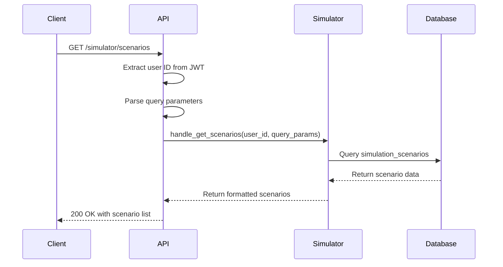

**Diagram sources**
- [simulator_api_handlers.cpp](file://shared/simulator/simulator_api_handlers.cpp#L344-L382)
- [api_endpoint_registrations.cpp](file://shared/api_registry/api_endpoint_registrations.cpp#L2500-L2525)

**Section sources**
- [simulator_api_handlers.cpp](file://shared/simulator/simulator_api_handlers.cpp#L344-L382)
- [api_endpoint_registrations.cpp](file://shared/api_registry/api_endpoint_registrations.cpp#L2500-L2525)

### Get Scenario (GET /simulator/scenarios/{id})
Retrieves detailed information about a specific simulation scenario by ID.

**Response**
Returns a JSON object with the complete scenario details including:
- Scenario metadata (name, description, type)
- Regulatory changes and impact parameters
- Creation and update timestamps
- Tags and metadata
- Usage statistics

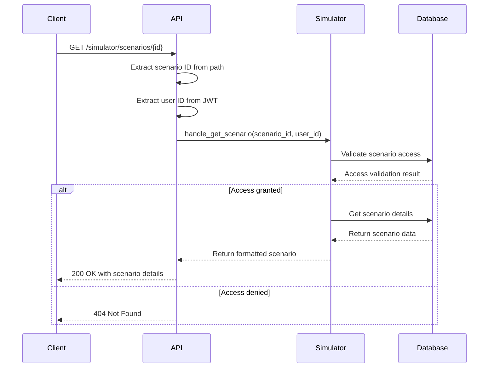

**Diagram sources**
- [simulator_api_handlers.cpp](file://shared/simulator/simulator_api_handlers.cpp#L311-L344)
- [api_endpoint_registrations.cpp](file://shared/api_registry/api_endpoint_registrations.cpp#L2546-L2561)

**Section sources**
- [simulator_api_handlers.cpp](file://shared/simulator/simulator_api_handlers.cpp#L311-L344)
- [api_endpoint_registrations.cpp](file://shared/api_registry/api_endpoint_registrations.cpp#L2546-L2561)

### Create Scenario (POST /simulator/scenarios)
Creates a new simulation scenario with the specified parameters.

**Request Body**
See [Request Schemas](#request-schemas) section for detailed structure.

**Response**
Returns a JSON object with:
- `scenario_id`: Unique identifier for the created scenario
- Complete scenario details
- Success message

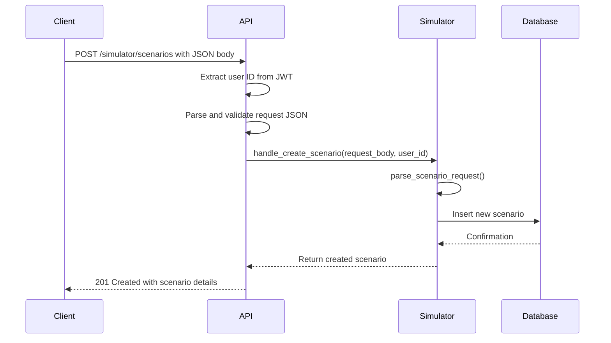

**Diagram sources**
- [simulator_api_handlers.cpp](file://shared/simulator/simulator_api_handlers.cpp#L122-L150)
- [api_endpoint_registrations.cpp](file://shared/api_registry/api_endpoint_registrations.cpp#L2472-L2499)

**Section sources**
- [simulator_api_handlers.cpp](file://shared/simulator/simulator_api_handlers.cpp#L122-L150)
- [api_endpoint_registrations.cpp](file://shared/api_registry/api_endpoint_registrations.cpp#L2472-L2499)

### Update Scenario (PUT /simulator/scenarios/{id})
Updates an existing simulation scenario with new parameters.

**Request Body**
Partial scenario object with fields to update.

**Response**
Returns updated scenario details with success message.

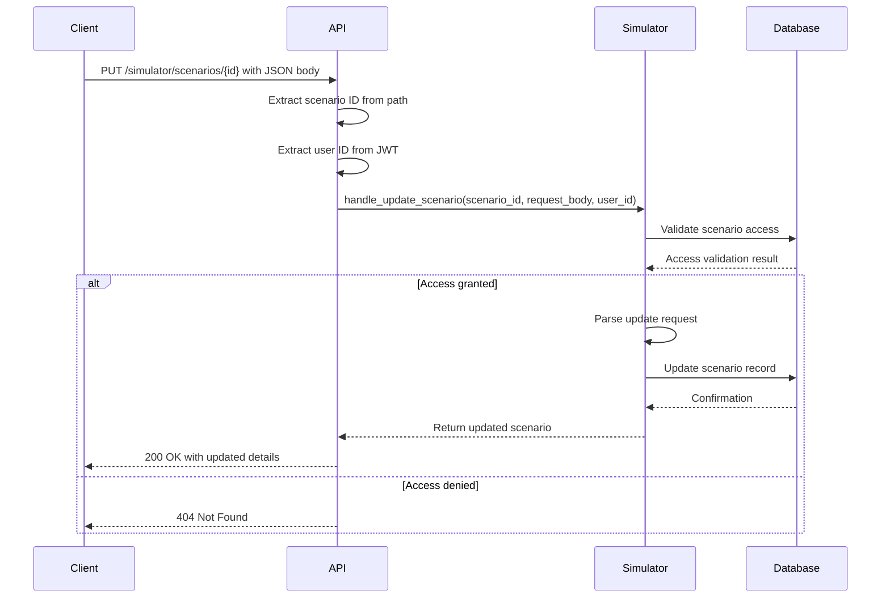

**Diagram sources**
- [simulator_api_handlers.cpp](file://shared/simulator/simulator_api_handlers.cpp#L152-L180)
- [api_endpoint_registrations.cpp](file://shared/api_registry/api_endpoint_registrations.cpp#L2579-L2594)

**Section sources**
- [simulator_api_handlers.cpp](file://shared/simulator/simulator_api_handlers.cpp#L152-L180)
- [api_endpoint_registrations.cpp](file://shared/api_registry/api_endpoint_registrations.cpp#L2579-L2594)

### Delete Scenario (DELETE /simulator/scenarios/{id})
Removes a simulation scenario from the system.

**Response**
Returns 204 No Content on success, or appropriate error code.

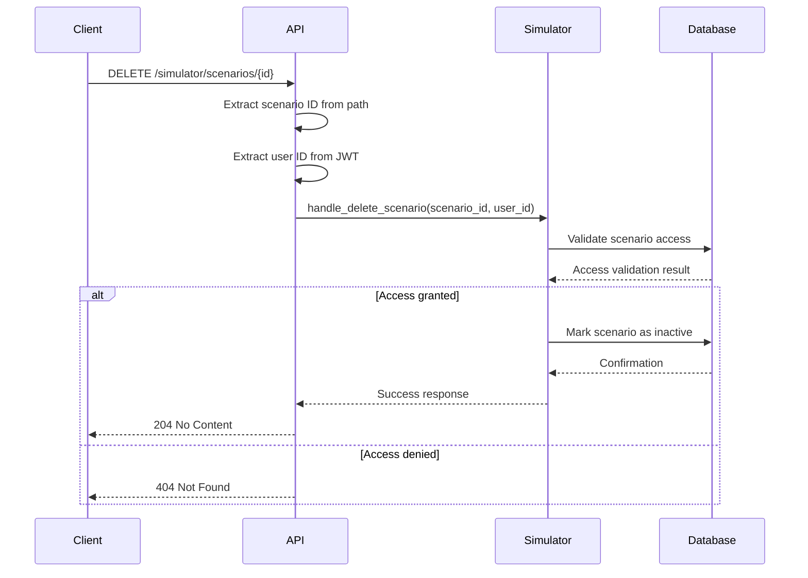

**Diagram sources**
- [simulator_api_handlers.cpp](file://shared/simulator/simulator_api_handlers.cpp#L208-L238)
- [api_endpoint_registrations.cpp](file://shared/api_registry/api_endpoint_registrations.cpp#L2612-L2627)

**Section sources**
- [simulator_api_handlers.cpp](file://shared/simulator/simulator_api_handlers.cpp#L208-L238)
- [api_endpoint_registrations.cpp](file://shared/api_registry/api_endpoint_registrations.cpp#L2612-L2627)

## Simulation Execution Endpoints

### Run Simulation (POST /simulator/run)
Initiates a simulation execution for a specified scenario.

**Request Body**
```json
{
  "scenario_id": "string",
  "async_execution": boolean,
  "priority": integer,
  "custom_parameters": object,
  "test_data_override": object
}
```

**Response**
Returns execution details:
- `execution_id`: Unique identifier for the simulation execution
- `status`: Current status (running)
- `message`: Execution mode information

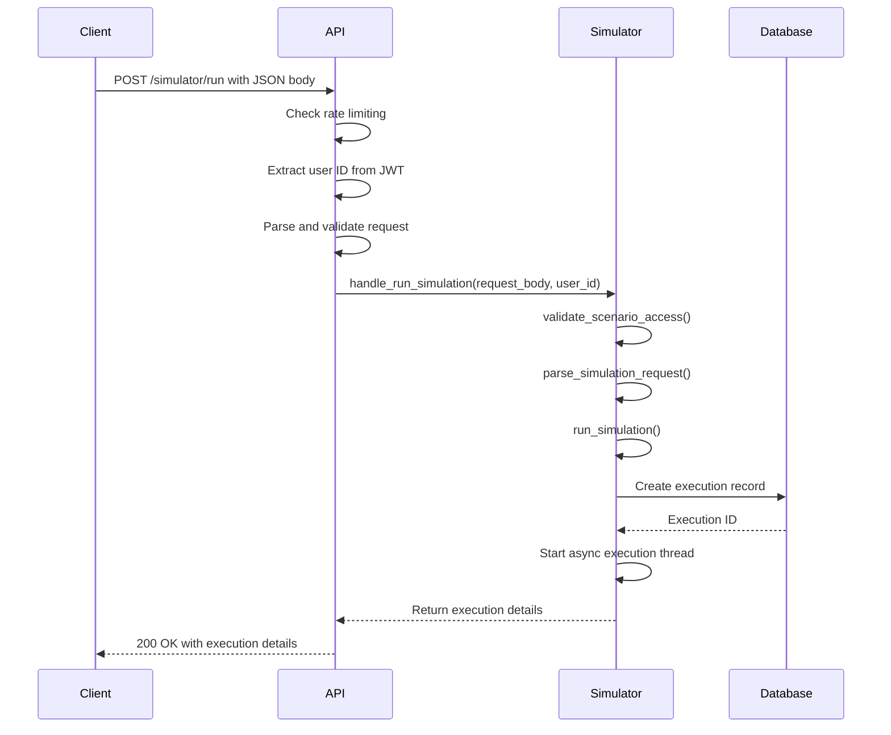

**Diagram sources**
- [simulator_api_handlers.cpp](file://shared/simulator/simulator_api_handlers.cpp#L181-L210)
- [api_endpoint_registrations.cpp](file://shared/api_registry/api_endpoint_registrations.cpp#L2648-L2670)

**Section sources**
- [simulator_api_handlers.cpp](file://shared/simulator/simulator_api_handlers.cpp#L181-L210)
- [api_endpoint_registrations.cpp](file://shared/api_registry/api_endpoint_registrations.cpp#L2648-L2670)

### Get Execution Status (GET /simulator/executions/{id})
Retrieves the current status of a simulation execution.

**Response**
Returns execution details including:
- Execution status (pending, running, completed, failed, cancelled)
- Progress percentage
- Timestamps (created, started, completed, cancelled)
- Error message (if applicable)

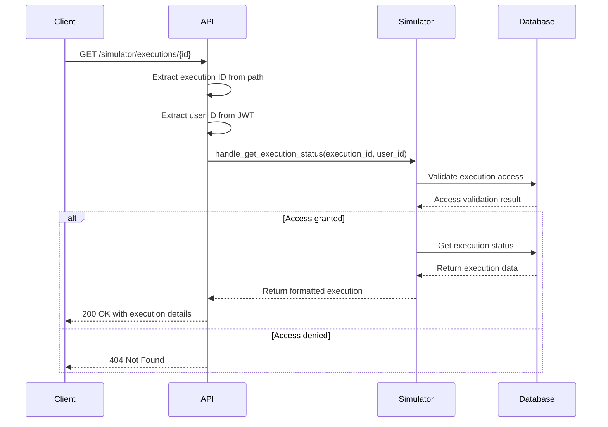

**Diagram sources**
- [simulator_api_handlers.cpp](file://shared/simulator/simulator_api_handlers.cpp#L210-L242)
- [api_endpoint_registrations.cpp](file://shared/api_registry/api_endpoint_registrations.cpp#L2725-L2747)

**Section sources**
- [simulator_api_handlers.cpp](file://shared/simulator/simulator_api_handlers.cpp#L210-L242)
- [api_endpoint_registrations.cpp](file://shared/api_registry/api_endpoint_registrations.cpp#L2725-L2747)

### Cancel Execution (DELETE /simulator/executions/{id})
Terminates a running simulation execution.

**Response**
Returns execution details with updated status.

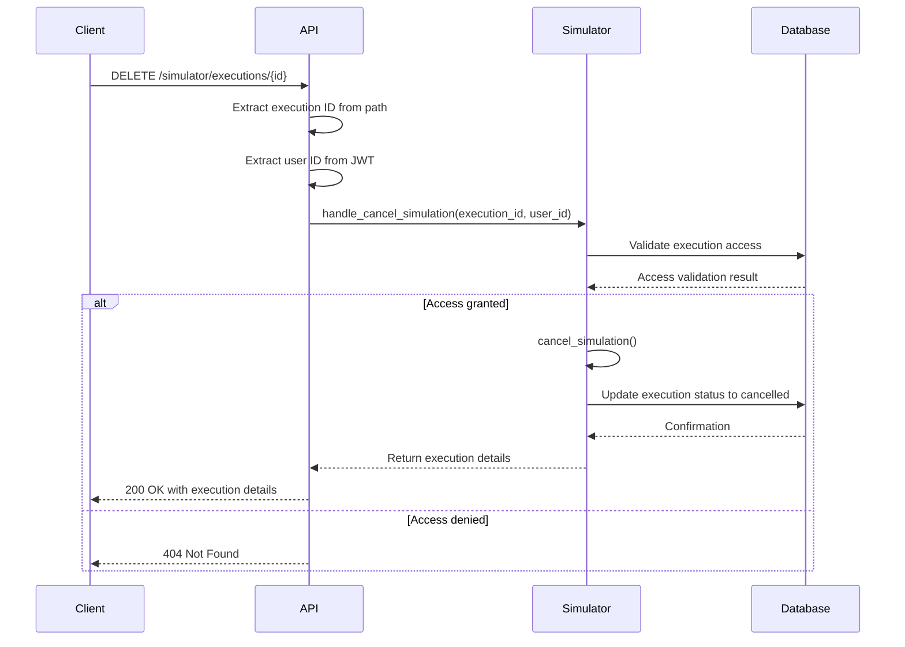

**Diagram sources**
- [simulator_api_handlers.cpp](file://shared/simulator/simulator_api_handlers.cpp#L271-L299)
- [api_endpoint_registrations.cpp](file://shared/api_registry/api_endpoint_registrations.cpp#L2792-L2807)

**Section sources**
- [simulator_api_handlers.cpp](file://shared/simulator/simulator_api_handlers.cpp#L271-L299)
- [api_endpoint_registrations.cpp](file://shared/api_registry/api_endpoint_registrations.cpp#L2792-L2807)

### Retrieve Results (GET /simulator/results/{id})
Gets the complete results of a completed simulation execution.

**Response**
Returns detailed simulation results including:
- Impact analysis and summary
- Affected entities
- Recommendations
- Risk, cost, and compliance impacts
- Operational impact assessment

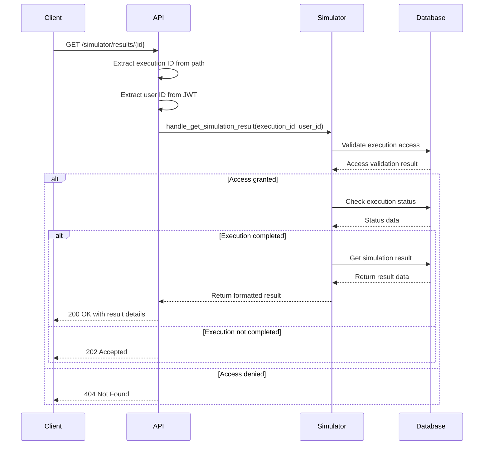

**Diagram sources**
- [simulator_api_handlers.cpp](file://shared/simulator/simulator_api_handlers.cpp#L244-L271)
- [api_endpoint_registrations.cpp](file://shared/api_registry/api_endpoint_registrations.cpp#L2808-L2830)

**Section sources**
- [simulator_api_handlers.cpp](file://shared/simulator/simulator_api_handlers.cpp#L244-L271)
- [api_endpoint_registrations.cpp](file://shared/api_registry/api_endpoint_registrations.cpp#L2808-L2830)

## Template-Based Scenario Creation

### Create Scenario from Template (POST /simulator/templates/{id}/create-scenario)
Creates a new simulation scenario based on a predefined template.

**Response**
Returns the newly created scenario with template-derived parameters.

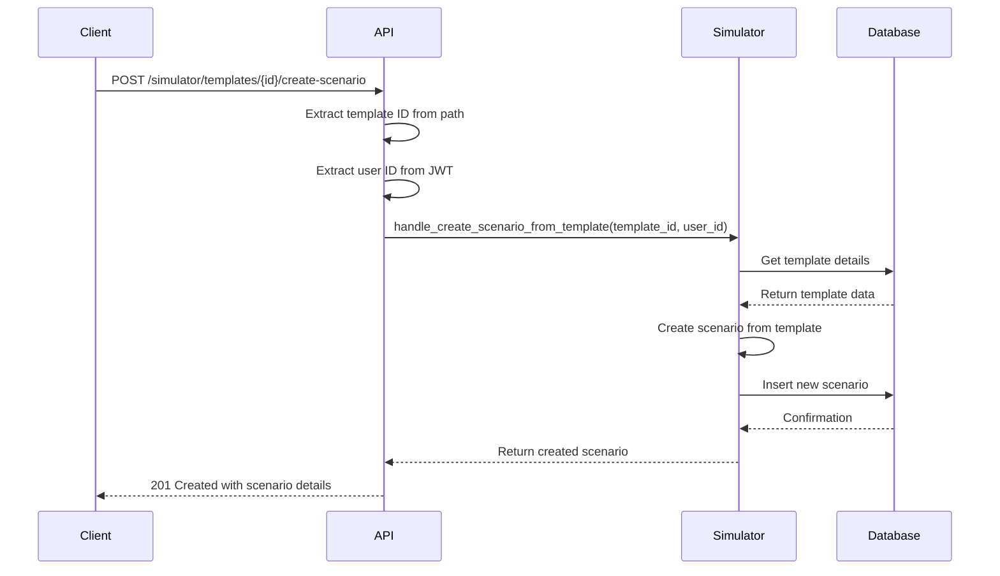

**Diagram sources**
- [simulator_api_handlers.cpp](file://shared/simulator/simulator_api_handlers.cpp#L400-L428)
- [api_endpoint_registrations.cpp](file://shared/api_registry/api_endpoint_registrations.cpp#L2700-L2716)

**Section sources**
- [simulator_api_handlers.cpp](file://shared/simulator/simulator_api_handlers.cpp#L400-L428)
- [api_endpoint_registrations.cpp](file://shared/api_registry/api_endpoint_registrations.cpp#L2700-L2716)

## Analytics Endpoints

### Get Analytics (GET /simulator/analytics)
Retrieves simulation analytics with caching for performance.

**Query Parameters**
- `time_range` (optional): Time period for analytics (e.g., "7d", "30d", "90d")

**Response**
Returns comprehensive analytics including:
- Total scenarios and executions
- Success rate
- Average duration
- Popular scenarios
- Execution trends

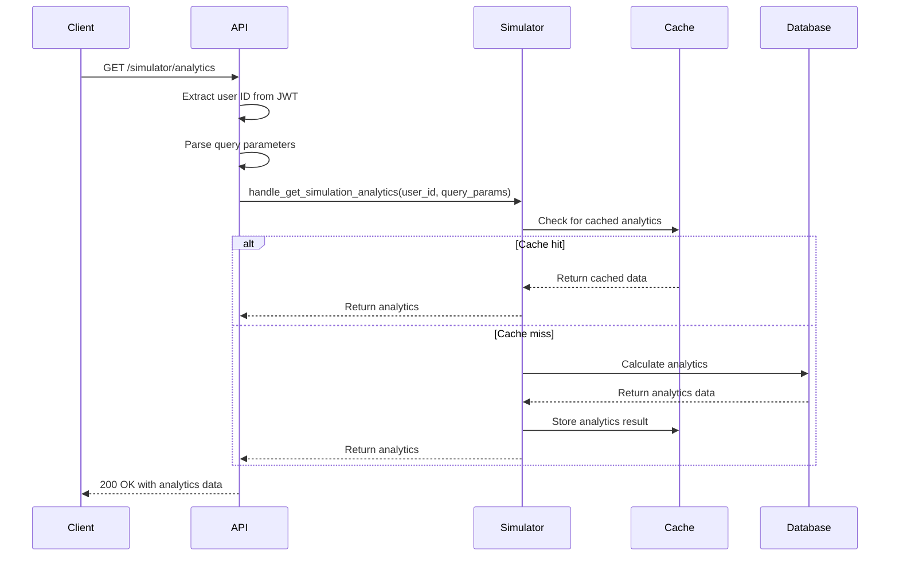

**Diagram sources**
- [simulator_api_handlers.cpp](file://shared/simulator/simulator_api_handlers.cpp#L428-L456)
- [api_endpoint_registrations.cpp](file://shared/api_registry/api_endpoint_registrations.cpp#L2881-L2898)

**Section sources**
- [simulator_api_handlers.cpp](file://shared/simulator/simulator_api_handlers.cpp#L428-L456)
- [api_endpoint_registrations.cpp](file://shared/api_registry/api_endpoint_registrations.cpp#L2881-L2898)

## Request Schemas

### Scenario Creation Request
The request body for creating a new simulation scenario includes regulatory change parameters, business rules, and time horizons.

```json
{
  "scenario_name": "string",
  "description": "string",
  "scenario_type": "regulatory_change",
  "regulatory_changes": {
    "jurisdiction": "string",
    "regulatory_body": "string",
    "effective_date": "string",
    "changes": [
      {
        "rule_id": "string",
        "change_type": "new|amended|removed",
        "old_value": "string",
        "new_value": "string"
      }
    ]
  },
  "impact_parameters": {
    "time_horizon": "short|medium|long",
    "confidence_level": 0.0-1.0,
    "risk_tolerance": "conservative|moderate|aggressive"
  },
  "baseline_data": {
    "data_source": "string",
    "time_period": "string",
    "filters": {}
  },
  "test_data": {
    "data_source": "string",
    "time_period": "string",
    "filters": {}
  },
  "tags": ["string"],
  "metadata": {},
  "estimated_runtime_seconds": 300,
  "max_concurrent_simulations": 1,
  "is_template": false
}
```

**Section sources**
- [regulatory_simulator.hpp](file://shared/simulator/regulatory_simulator.hpp#L30-L80)
- [simulator_api_handlers.cpp](file://shared/simulator/simulator_api_handlers.cpp#L449-L486)

## Architecture Overview

### System Architecture
The Simulation API follows a layered architecture with clear separation of concerns between API handlers, business logic, and data access.

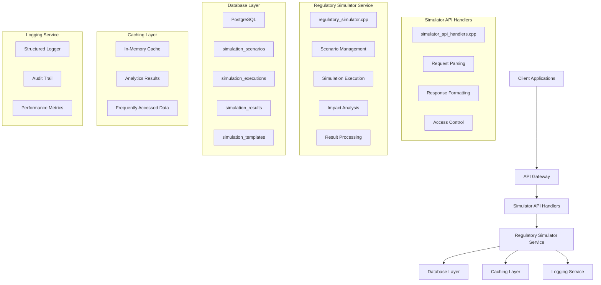

**Diagram sources**
- [simulator_api_handlers.cpp](file://shared/simulator/simulator_api_handlers.cpp#L1-L1260)
- [regulatory_simulator.cpp](file://shared/simulator/regulatory_simulator.cpp#L1-L935)
- [schema.sql](file://schema.sql#L7308-L7416)

**Section sources**
- [simulator_api_handlers.cpp](file://shared/simulator/simulator_api_handlers.cpp#L1-L1260)
- [regulatory_simulator.cpp](file://shared/simulator/regulatory_simulator.cpp#L1-L935)

## Error Handling

### Error Response Structure
All API endpoints return standardized error responses with consistent structure.

```json
{
  "success": false,
  "error": "string",
  "status_code": 400,
  "timestamp": 1234567890
}
```

### Common Error Codes
- **400 Bad Request**: Invalid request format or missing required fields
- **401 Unauthorized**: Authentication required or invalid credentials
- **403 Forbidden**: Insufficient permissions for requested operation
- **404 Not Found**: Requested resource not found or access denied
- **429 Too Many Requests**: Rate limit exceeded
- **500 Internal Server Error**: Unexpected server error

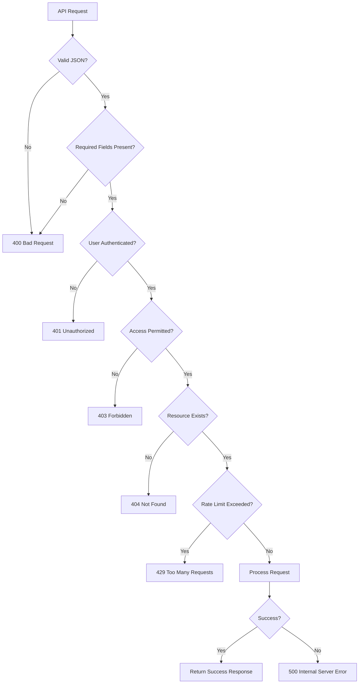

**Diagram sources**
- [simulator_api_handlers.cpp](file://shared/simulator/simulator_api_handlers.cpp#L1168-L1196)
- [simulator_api_handlers.cpp](file://shared/simulator/simulator_api_handlers.cpp#L1196-L1225)

**Section sources**
- [simulator_api_handlers.cpp](file://shared/simulator/simulator_api_handlers.cpp#L1168-L1258)

## Security and Access Control

### Access Validation
The system implements role-based access control with validation at multiple levels.

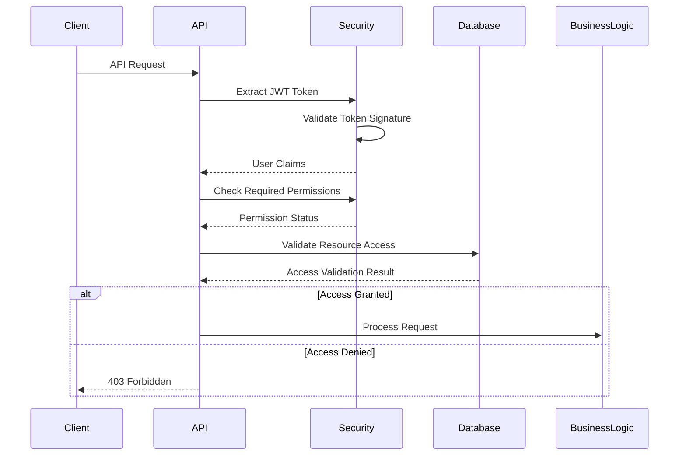

### Security Features
- JWT-based authentication and authorization
- Role-based access control (RBAC)
- Rate limiting to prevent abuse
- Input validation and sanitization
- Secure database queries with parameterized statements
- Comprehensive audit logging

**Section sources**
- [simulator_api_handlers.cpp](file://shared/simulator/simulator_api_handlers.cpp#L580-L613)
- [regulatory_simulator.hpp](file://shared/simulator/regulatory_simulator.hpp#L130-L152)