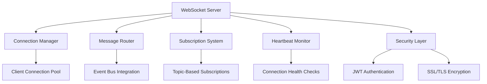
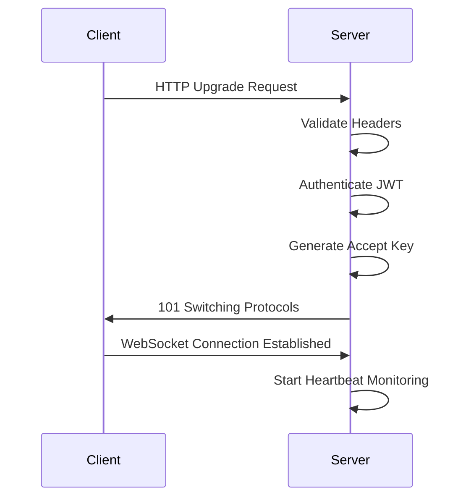
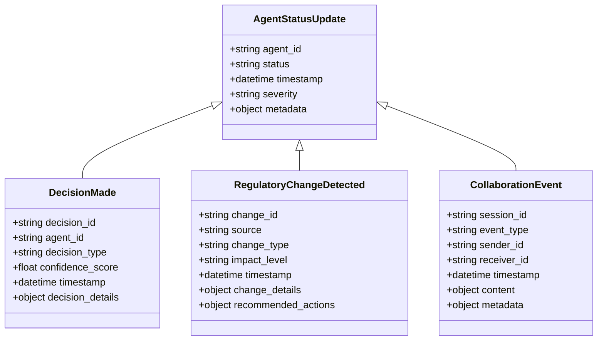
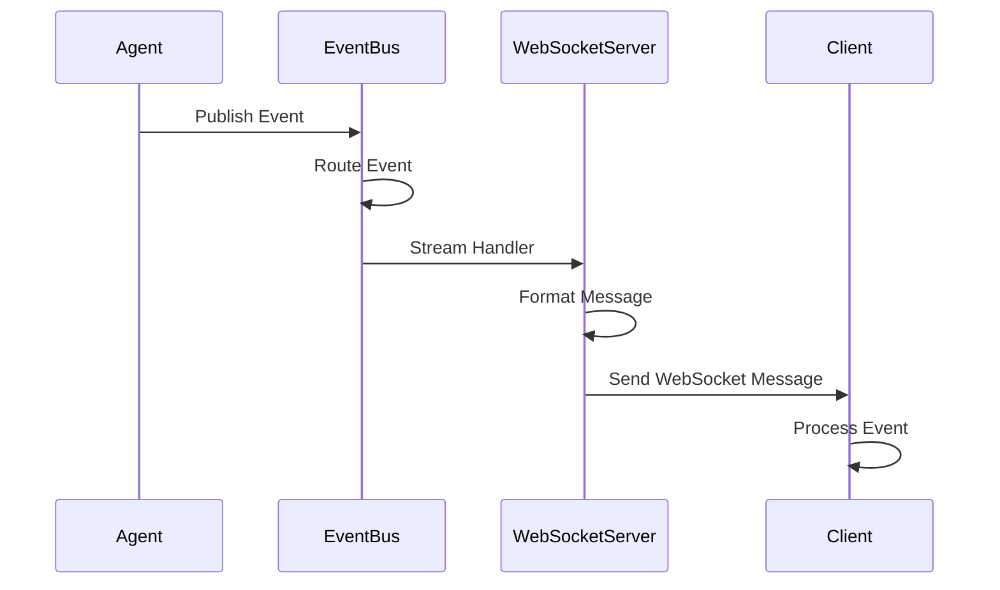
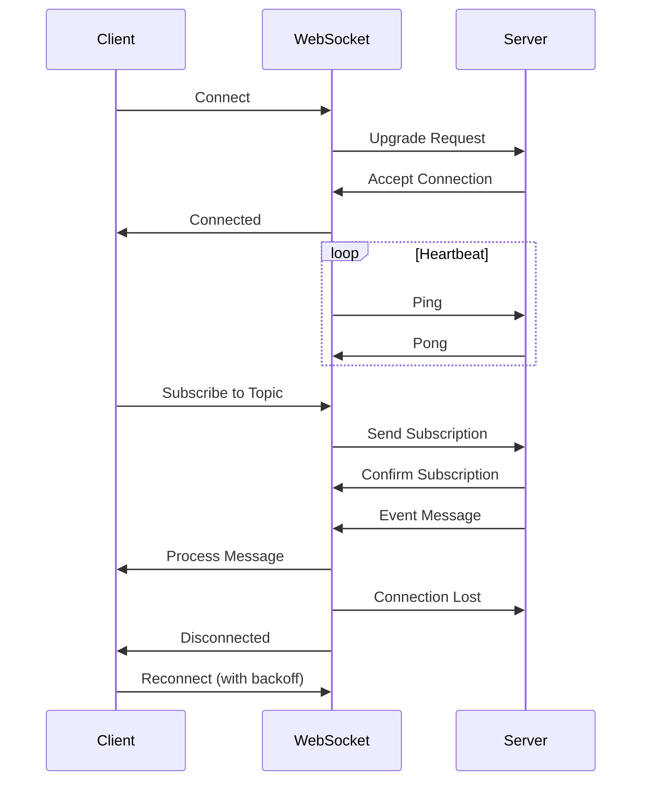
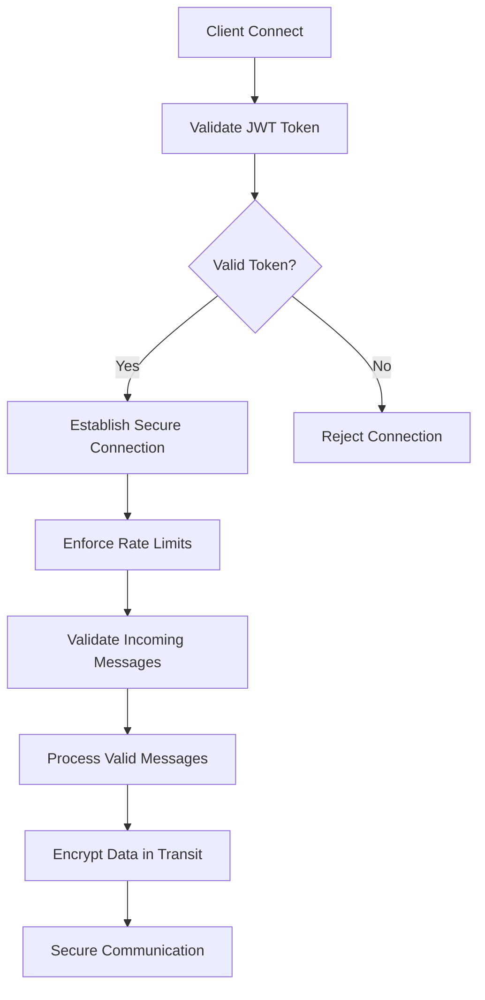
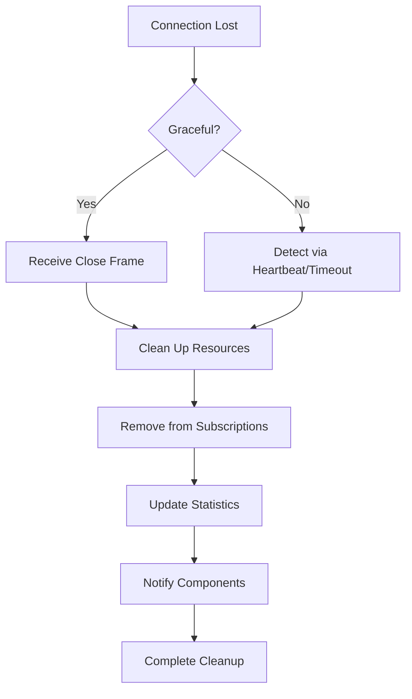
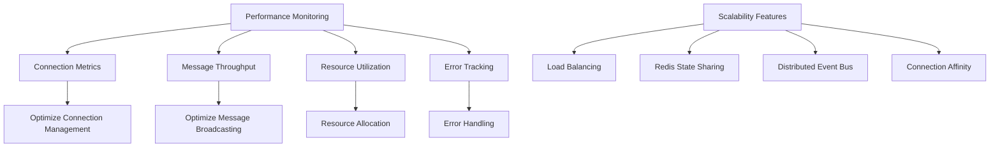

# WebSocket API Reference

<cite>
**Referenced Files in This Document**   
- [websocket_server.hpp](file://shared/websocket/websocket_server.hpp)
- [agent_activity_feed.cpp](file://shared/agent_activity_feed.cpp)
- [api_routes.cpp](file://shared/web_ui/api_routes.cpp)
- [web_ui_handlers.cpp](file://shared/web_ui/web_ui_handlers.cpp)
- [useActivityFeed.ts](file://frontend/src/hooks/useActivityFeed.ts)
- [event_bus.hpp](file://shared/event_system/event_bus.hpp)
- [event_bus.cpp](file://shared/event_system/event_bus.cpp)
</cite>

## Table of Contents
1. [Introduction](#introduction)
2. [WebSocket Server Architecture](#websocket-server-architecture)
3. [Connection Establishment](#connection-establishment)
4. [Message Framing and Protocol](#message-framing-and-protocol)
5. [Event Types and Payload Structures](#event-types-and-payload-structures)
6. [Integration with Event Bus](#integration-with-event-bus)
7. [Message Formats for Streaming](#message-formats-for-streaming)
8. [Client-Side Implementation](#client-side-implementation)
9. [Security Considerations](#security-considerations)
10. [Disconnection Handling](#disconnection-handling)
11. [Performance and Scalability](#performance-and-scalability)

## Introduction

The WebSocket API in Regulens provides real-time communication capabilities for streaming agent activities, decision updates, and system alerts. This API enables bidirectional communication between the server and clients, allowing immediate push notifications of events as they occur in the system. The WebSocket server is designed for production use with features including connection management, heartbeat monitoring, topic-based subscriptions, and integration with the event bus system.

The WebSocket infrastructure supports real-time updates for various components including agent status monitoring, decision tracking, regulatory change detection, and collaboration events. It serves as the backbone for the activity feed, audit trail, and other real-time features in the Regulens platform.

**Section sources**
- [websocket_server.hpp](file://shared/websocket/websocket_server.hpp#L1-L100)
- [agent_activity_feed.cpp](file://shared/agent_activity_feed.cpp#L1-L50)

## WebSocket Server Architecture

The WebSocket server architecture in Regulens is built around a production-grade implementation that supports real-time push notifications, topic-based subscriptions, and broadcast messaging. The server is implemented as a standalone component that can be integrated with various backend services to stream events to connected clients.

The core architecture consists of several key components:
- WebSocket server with connection management
- Topic-based subscription system
- Integration with the event bus for real-time event distribution
- Heartbeat and ping-pong mechanism for connection health monitoring
- Message queueing and compression support
- SSL/TLS security layer

The server supports multiple concurrent connections and efficiently manages client state, including connection tracking, subscription management, and message routing. It is designed to handle high-volume real-time data streaming with minimal latency.



**Diagram sources **
- [websocket_server.hpp](file://shared/websocket/websocket_server.hpp#L64-L121)
- [event_bus.hpp](file://shared/event_system/event_bus.hpp#L98-L141)

**Section sources**
- [websocket_server.hpp](file://shared/websocket/websocket_server.hpp#L64-L121)
- [event_bus.hpp](file://shared/event_system/event_bus.hpp#L98-L141)

## Connection Establishment

WebSocket connection establishment in Regulens follows the standard RFC 6455 protocol with additional security measures for authentication and authorization. The connection process begins with an HTTP upgrade request that is validated and upgraded to a WebSocket connection upon successful authentication.

The connection establishment process includes the following steps:
1. Client sends an HTTP upgrade request to the WebSocket endpoint
2. Server validates the request headers and authentication token
3. Server performs JWT authentication during the handshake
4. Server generates the appropriate WebSocket accept key
5. Server sends the 101 Switching Protocols response
6. Connection is upgraded to WebSocket protocol

The WebSocket server supports configurable heartbeat intervals to maintain connection health and detect inactive clients. The default heartbeat interval is configurable through the server settings, allowing for optimization based on network conditions and client requirements.



**Diagram sources **
- [websocket_server.hpp](file://shared/websocket/websocket_server.hpp#L278-L343)
- [websocket_server.hpp](file://shared/websocket/websocket_server.hpp#L340-L366)

**Section sources**
- [websocket_server.hpp](file://shared/websocket/websocket_server.hpp#L278-L343)
- [websocket_server.hpp](file://shared/websocket/websocket_server.hpp#L340-L366)

## Message Framing and Protocol

The WebSocket message framing in Regulens follows the standard WebSocket protocol (RFC 6455) with additional application-level framing for message validation and routing. Messages are encoded as JSON objects with a standardized structure that includes metadata for routing, authentication, and error handling.

Each WebSocket message contains the following components:
- Message type indicator
- Channel or topic identifier
- Unique message ID
- Timestamp of message creation
- Payload data
- Optional headers and metadata

The server supports both text and binary message types, with text messages being the primary format for JSON-based communication. Message compression is supported to reduce bandwidth usage for high-volume data streams. The server also implements proper message queuing to handle bursts of activity and prevent message loss during peak loads.

```mermaid
flowchart TD
A[Message Creation] --> B[Add Metadata]
B --> C[JSON Serialization]
C --> D[WebSocket Frame Encoding]
D --> E[Masking (if required)]
E --> F[Network Transmission]
F --> G[Frame Reception]
G --> H[Frame Decoding]
H --> I[Payload Extraction]
I --> J[Message Processing]
```

**Diagram sources **
- [websocket_server.hpp](file://shared/websocket/websocket_server.hpp#L340-L366)
- [websocket_server.hpp](file://shared/websocket/websocket_server.hpp#L225-L284)

**Section sources**
- [websocket_server.hpp](file://shared/websocket/websocket_server.hpp#L340-L366)
- [websocket_server.hpp](file://shared/websocket/websocket_server.hpp#L225-L284)

## Event Types and Payload Structures

Regulens supports several event types for real-time communication, each with a specific payload structure designed for its use case. The primary event types include agent status updates, decision notifications, regulatory change detection, and collaboration events.

### Agent Status Update
This event type is triggered when an agent's status changes, such as when it becomes active, inactive, or encounters an error. The payload includes the agent ID, status, timestamp, and optional metadata about the status change.

### Decision Made
This event is published when a decision is made by the decision engine. The payload contains the decision ID, agent ID, decision details, confidence score, and timestamp. This event is used to update the decision dashboard and notify relevant stakeholders.

### Regulatory Change Detected
This event is triggered when the regulatory monitor detects a change in regulatory requirements. The payload includes the regulatory source, change details, impact assessment, and recommended actions. This event enables proactive compliance management.

### Collaboration Events
These events are generated during human-AI collaboration sessions. They include message exchanges, intervention requests, and feedback submissions. The payload structure supports rich content including text, files, and structured data.



**Diagram sources **
- [agent_activity_feed.cpp](file://shared/agent_activity_feed.cpp#L1-L100)
- [agent_activity_feed.cpp](file://shared/agent_activity_feed.cpp#L3600-L3650)

**Section sources**
- [agent_activity_feed.cpp](file://shared/agent_activity_feed.cpp#L1-L100)
- [agent_activity_feed.cpp](file://shared/agent_activity_feed.cpp#L3600-L3650)

## Integration with Event Bus

The WebSocket server in Regulens integrates tightly with the event bus system to stream agent activities, decision updates, and system alerts. This integration enables real-time distribution of events to all interested clients without requiring direct coupling between event producers and consumers.

The integration works as follows:
1. Components publish events to the event bus using the publish() method
2. The event bus routes events to registered stream handlers
3. WebSocket server acts as a stream handler for specific event categories
4. Events are formatted as WebSocket messages and sent to subscribed clients
5. Clients receive events in real-time as they are published

This architecture provides several benefits:
- Decoupling of event producers and consumers
- Support for multiple subscribers to the same event stream
- Flexible filtering of events based on type, source, or other criteria
- Reliable delivery with connection recovery mechanisms
- Scalability through efficient message routing

The event bus also supports batch publishing of events, which is useful for sending multiple related events in a single transaction. This reduces network overhead and ensures atomic delivery of related events.



**Diagram sources **
- [event_bus.hpp](file://shared/event_system/event_bus.hpp#L98-L141)
- [event_bus.cpp](file://shared/event_system/event_bus.cpp#L456-L490)

**Section sources**
- [event_bus.hpp](file://shared/event_system/event_bus.hpp#L98-L141)
- [event_bus.cpp](file://shared/event_system/event_bus.cpp#L456-L490)

## Message Formats for Streaming

The message formats for streaming in Regulens are designed to support various use cases including simulation results, audit trail entries, and collaboration events. Each message format follows a consistent structure while including specific fields relevant to its purpose.

### Simulation Results Streaming
Simulation results are streamed as a series of events that represent the progress and outcomes of regulatory simulations. Each message includes:
- Simulation ID
- Current status (running, completed, failed)
- Progress percentage
- Intermediate results
- Final outcomes
- Timestamp

### Audit Trail Entries
Audit trail entries are streamed in real-time as they are generated by the system. Each entry includes:
- Event ID
- Agent ID
- Activity type
- Severity level
- Title and description
- Timestamp
- Metadata (context-specific information)

### Collaboration Events
Collaboration events are streamed during human-AI collaboration sessions. These messages include:
- Session ID
- Participant IDs
- Message content
- Message type (text, file, command)
- Timestamp
- Status (sent, delivered, read)

The streaming format supports both individual messages and batched messages for improved efficiency. Batched messages are used when multiple related events occur in quick succession, reducing the overhead of individual message transmission.

```mermaid
flowchart TD
A[Event Generation] --> B[Format as JSON]
B --> C[Add Message Metadata]
C --> D[Validate Message Structure]
D --> E[Compress (if enabled)]
E --> F[Send via WebSocket]
F --> G[Receive by Client]
G --> H[Decompress (if needed)]
H --> I[Parse JSON]
I --> J[Process Message]
```

**Diagram sources **
- [agent_activity_feed.cpp](file://shared/agent_activity_feed.cpp#L1-L100)
- [web_ui_handlers.cpp](file://shared/web_ui/web_ui_handlers.cpp#L1220-L1419)

**Section sources**
- [agent_activity_feed.cpp](file://shared/agent_activity_feed.cpp#L1-L100)
- [web_ui_handlers.cpp](file://shared/web_ui/web_ui_handlers.cpp#L1220-L1419)

## Client-Side Implementation

The client-side implementation of the WebSocket API in Regulens includes reconnection logic, message parsing, and subscription management. The implementation is designed to handle network interruptions gracefully and maintain a reliable connection to the server.

### Reconnection Logic
The client implements exponential backoff for reconnection attempts, with a maximum retry interval to prevent overwhelming the server. When a connection is lost, the client:
1. Attempts immediate reconnection
2. If unsuccessful, waits for a short interval before retrying
3. Doubles the wait time after each failed attempt
4. Caps the maximum wait time to prevent excessive delays
5. Resets the interval when a successful connection is established

### Message Parsing
Incoming messages are parsed according to their type, with different handling for various event types. The client validates the message structure before processing and handles malformed messages gracefully by logging errors without crashing.

### Subscription Management
Clients can subscribe to specific topics or event types, allowing them to receive only the events they are interested in. The subscription system supports:
- Dynamic subscription and unsubscription
- Filter-based event selection
- Multiple simultaneous subscriptions
- Subscription persistence across reconnections



**Diagram sources **
- [useActivityFeed.ts](file://frontend/src/hooks/useActivityFeed.ts#L77-L111)
- [useActivityFeed.ts](file://frontend/src/hooks/useActivityFeed.ts#L31-L79)

**Section sources**
- [useActivityFeed.ts](file://frontend/src/hooks/useActivityFeed.ts#L77-L111)
- [useActivityFeed.ts](file://frontend/src/hooks/useActivityFeed.ts#L31-L79)

## Security Considerations

The WebSocket implementation in Regulens incorporates several security measures to protect against unauthorized access and denial-of-service attacks. These measures ensure the confidentiality, integrity, and availability of the real-time communication system.

### Authentication
Authentication is performed during the WebSocket handshake using JWT tokens. Clients must include a valid JWT token in the upgrade request, which is validated by the server before establishing the connection. The token contains user identification, permissions, and expiration information.

### Message Validation
All incoming messages are validated for proper structure and content before processing. This prevents injection attacks and ensures that only properly formatted messages are processed by the system. Message size limits are enforced to prevent memory exhaustion attacks.

### Denial-of-Service Protection
The system implements rate limiting and connection limits to protect against denial-of-service attacks. Each client is subject to limits on:
- Connection frequency
- Message sending rate
- Concurrent connections
- Message size

These limits are configurable based on client role and requirements, allowing for fine-grained control over resource usage.

### Encryption
All WebSocket connections are encrypted using SSL/TLS to protect data in transit. The server supports modern cipher suites and enforces secure connection practices, including certificate validation and secure renegotiation.



**Diagram sources **
- [websocket_server.hpp](file://shared/websocket/websocket_server.hpp#L64-L121)
- [websocket_server.hpp](file://shared/websocket/websocket_server.hpp#L225-L284)

**Section sources**
- [websocket_server.hpp](file://shared/websocket/websocket_server.hpp#L64-L121)
- [websocket_server.hpp](file://shared/websocket/websocket_server.hpp#L225-L284)

## Disconnection Handling

Disconnection handling in the Regulens WebSocket system is designed to manage both graceful and abrupt connection terminations. The system detects disconnected clients and cleans up associated resources to prevent memory leaks and maintain system stability.

### Graceful Disconnection
When a client disconnects gracefully, it sends a close frame to the server. The server:
1. Receives the close frame
2. Notifies the disconnection handler
3. Cleans up client resources
4. Removes the client from subscription lists
5. Updates connection statistics

### Abrupt Disconnection
When a client disconnects abruptly (network failure, client crash), the server detects the disconnection through:
- Failed heartbeat responses
- Socket errors
- Timeout detection

The server then performs the same cleanup operations as for graceful disconnections.

### Cleanup Process
The cleanup process includes:
- Removing the client from the active connections list
- Unsubscribing the client from all topics
- Freeing allocated memory and resources
- Updating connection statistics
- Notifying other system components of the disconnection

The system also includes a periodic cleanup process that removes inactive clients that may have been missed by the real-time detection mechanisms.



**Diagram sources **
- [websocket_server.hpp](file://shared/websocket/websocket_server.hpp#L278-L343)
- [websocket_server.hpp](file://shared/websocket/websocket_server.hpp#L340-L366)

**Section sources**
- [websocket_server.hpp](file://shared/websocket/websocket_server.hpp#L278-L343)
- [websocket_server.hpp](file://shared/websocket/websocket_server.hpp#L340-L366)

## Performance and Scalability

The WebSocket implementation in Regulens is designed for high performance and scalability, capable of handling thousands of concurrent connections with low latency. The system employs several optimization techniques to ensure efficient resource utilization and responsive real-time communication.

### Connection Management
The server uses an efficient connection management system that minimizes memory overhead per connection. Client state is stored in optimized data structures that allow for fast lookup and modification operations.

### Message Broadcasting
For broadcasting messages to multiple clients, the system uses optimized algorithms that minimize CPU and memory usage. Messages are serialized once and then sent to multiple recipients, reducing processing overhead.

### Resource Monitoring
The server includes comprehensive monitoring capabilities that track:
- Active connection count
- Message throughput
- Memory usage
- CPU utilization
- Error rates

These metrics are available through a statistics endpoint and can be integrated with monitoring systems for proactive performance management.

### Scalability Features
The WebSocket server supports horizontal scaling through:
- Load balancing across multiple server instances
- Shared subscription state using Redis
- Distributed event bus integration
- Connection affinity when required

These features allow the system to scale to meet the demands of large deployments with thousands of concurrent users.



**Diagram sources **
- [websocket_server.hpp](file://shared/websocket/websocket_server.hpp#L225-L284)
- [websocket_server.hpp](file://shared/websocket/websocket_server.hpp#L64-L121)

**Section sources**
- [websocket_server.hpp](file://shared/websocket/websocket_server.hpp#L225-L284)
- [websocket_server.hpp](file://shared/websocket/websocket_server.hpp#L64-L121)