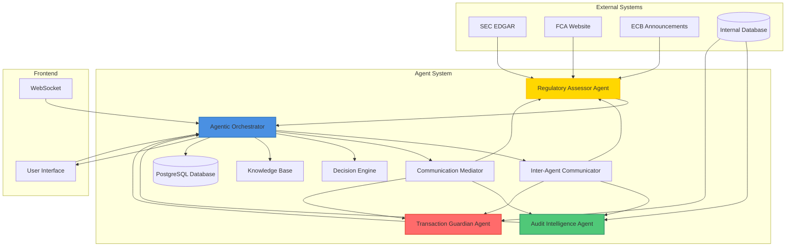
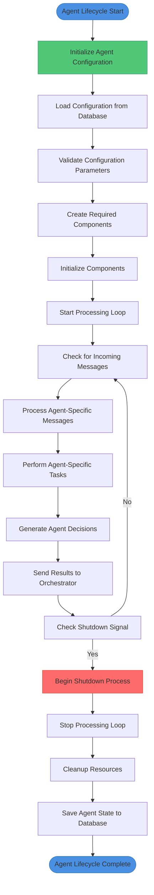
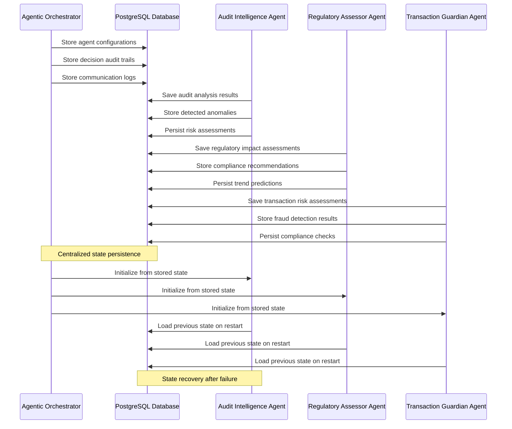
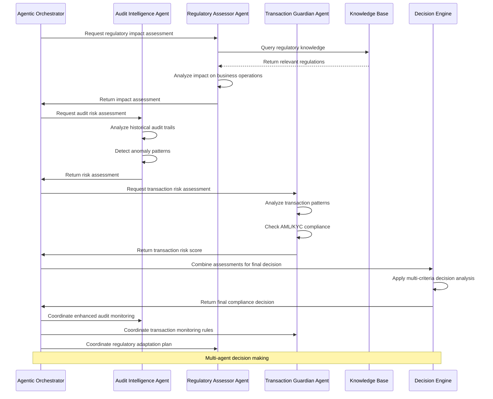
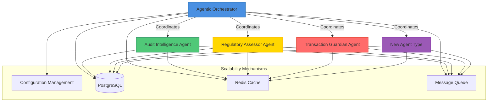
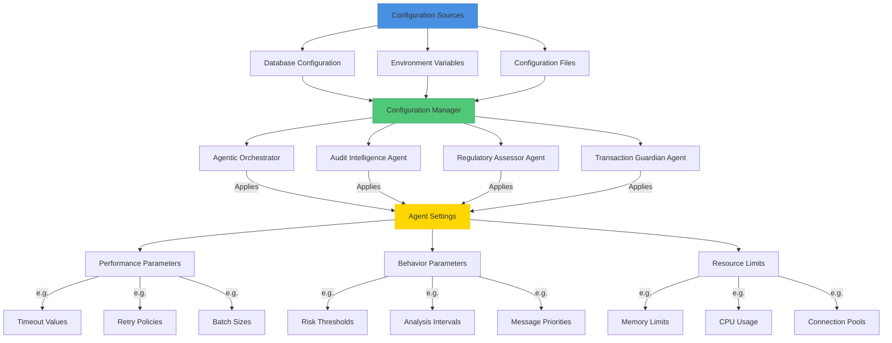

# Agent System

<cite>
**Referenced Files in This Document**   
- [agentic_orchestrator.hpp](file://shared/agentic_brain/agentic_orchestrator.hpp)
- [inter_agent_communicator.hpp](file://shared/agentic_brain/inter_agent_communicator.hpp)
- [communication_mediator.hpp](file://shared/agentic_brain/communication_mediator.hpp)
- [consensus_engine.hpp](file://shared/agentic_brain/consensus_engine.hpp)
- [message_translator.hpp](file://shared/agentic_brain/message_translator.hpp)
- [audit_intelligence_agent.hpp](file://agents/audit_intelligence/audit_intelligence_agent.hpp)
- [regulatory_assessor_agent.hpp](file://agents/regulatory_assessor/regulatory_assessor_agent.hpp)
- [transaction_guardian_agent.hpp](file://agents/transaction_guardian/transaction_guardian_agent.hpp)
- [AgentCollaboration.tsx](file://frontend/src/pages/AgentCollaboration.tsx)
- [useCollaboration.ts](file://frontend/src/hooks/useCollaboration.ts)
- [api.ts](file://frontend/src/services/api.ts)
- [api.ts](file://frontend/src/types/api.ts)
</cite>

## Table of Contents
1. [Introduction](#introduction)
2. [System Context](#system-context)
3. [Core Agent Types](#core-agent-types)
4. [Agentic Orchestrator](#agentic-orchestrator)
5. [Inter-Agent Communication System](#inter-agent-communication-system)
6. [Communication Mediator](#communication-mediator)
7. [Agent Lifecycle Management](#agent-lifecycle-management)
8. [State Persistence and Failure Recovery](#state-persistence-and-failure-recovery)
9. [Agent Collaboration Scenarios](#agent-collaboration-scenarios)
10. [Scalability Considerations](#scalability-considerations)
11. [Technology Stack](#technology-stack)
12. [Configuration and Performance Tuning](#configuration-and-performance-tuning)

## Introduction

The Agent System is a sophisticated agent-oriented architecture designed for regulatory compliance, risk assessment, and transaction monitoring in financial institutions. The system employs specialized autonomous agents that collaborate through a centralized orchestrator to analyze regulatory changes, monitor transactions, and ensure compliance with evolving regulations.

The architecture follows a multi-agent system pattern where specialized agents with distinct capabilities coordinate their activities through a central Agentic Orchestrator. The system enables real-time collaboration between agents through a robust communication infrastructure that includes message passing, conflict resolution, and consensus mechanisms.

This documentation provides a comprehensive overview of the agent-oriented architecture, detailing the specialized agents (Audit Intelligence, Regulatory Assessor, Transaction Guardian), their coordination mechanisms, communication protocols, lifecycle management, and integration with external systems.

**Section sources**
- [agentic_orchestrator.hpp](file://shared/agentic_brain/agentic_orchestrator.hpp)
- [inter_agent_communicator.hpp](file://shared/agentic_brain/inter_agent_communicator.hpp)
- [communication_mediator.hpp](file://shared/agentic_brain/communication_mediator.hpp)

## System Context

The Agent System operates within a comprehensive ecosystem that includes decision engines, knowledge bases, and various external systems. The architecture is designed to process regulatory information, analyze transactions, and generate compliance recommendations through coordinated agent collaboration.



**Diagram sources**
- [agentic_orchestrator.hpp](file://shared/agentic_brain/agentic_orchestrator.hpp)
- [audit_intelligence_agent.hpp](file://agents/audit_intelligence/audit_intelligence_agent.hpp)
- [regulatory_assessor_agent.hpp](file://agents/regulatory_assessor/regulatory_assessor_agent.hpp)
- [transaction_guardian_agent.hpp](file://agents/transaction_guardian/transaction_guardian_agent.hpp)

## Core Agent Types

The Agent System comprises three specialized agent types, each designed for specific compliance and monitoring functions. These agents operate autonomously while collaborating through the Agentic Orchestrator to achieve comprehensive regulatory coverage.

### Audit Intelligence Agent

The Audit Intelligence Agent specializes in compliance auditing and anomaly detection. It analyzes audit trails, detects potential fraud patterns, and performs sophisticated pattern recognition to identify compliance issues.

Key capabilities include:
- Audit trail analysis for anomalies and compliance issues
- Real-time compliance monitoring of events
- Fraud pattern detection using AI analysis
- Decision pattern analysis for bias and compliance
- Advanced risk scoring using machine learning

The agent integrates with the LLM system to generate compliance insights and uses PostgreSQL for persistent storage of audit data.

**Section sources**
- [audit_intelligence_agent.hpp](file://agents/audit_intelligence/audit_intelligence_agent.hpp)

### Regulatory Assessor Agent

The Regulatory Assessor Agent focuses on regulatory change impact analysis. It evaluates new regulations, assesses their impact on business operations, and provides intelligent recommendations for compliance adaptation.

Key capabilities include:
- Impact assessment of regulatory changes on business operations
- Generation of compliance adaptation recommendations
- AI-powered analysis of regulatory implications
- Prediction of future regulatory trends
- Compliance gap analysis between current state and new requirements

The agent connects to external regulatory sources (SEC, FCA, ECB) to fetch real regulatory updates and uses the knowledge base to contextualize regulatory changes.

**Section sources**
- [regulatory_assessor_agent.hpp](file://agents/regulatory_assessor/regulatory_assessor_agent.hpp)

### Transaction Guardian Agent

The Transaction Guardian Agent monitors financial transactions in real-time for compliance and risk. It assesses transaction risks, detects suspicious activities, and ensures regulatory compliance for all transactions.

Key capabilities include:
- Real-time transaction monitoring and risk assessment
- Fraud detection on transactions
- Regulatory compliance checking (AML/KYC)
- Transaction velocity and pattern monitoring
- Suspicious transaction escalation

The agent implements circuit breakers for resilience and uses Redis for caching customer risk profiles to optimize performance.

**Section sources**
- [transaction_guardian_agent.hpp](file://agents/transaction_guardian/transaction_guardian_agent.hpp)

## Agentic Orchestrator

The Agentic Orchestrator serves as the central intelligence hub that coordinates all agent operations. It manages agent lifecycle, facilitates decision-making, and enables learning and adaptation across the agent ecosystem.

```mermaid
classDiagram
class AgenticOrchestrator {
+initialize() bool
+shutdown() void
+make_decision(AgentType, json) optional~AgentDecision~
+incorporate_feedback(LearningFeedback) bool
+update_agent_knowledge(AgentType, json) bool
+get_agent_insights(AgentType) json
+check_for_proactive_actions() vector~AgentDecision~
+get_system_health() json
+get_agent_performance_metrics() json
+process_human_decision(string, bool, string) bool
+execute_autonomous_tool_workflow(AgentType, json, vector~string~) bool
}
class AgentType {
<<enumeration>>
TRANSACTION_GUARDIAN
REGULATORY_ASSESSOR
AUDIT_INTELLIGENCE
}
class DecisionUrgency {
<<enumeration>>
LOW
MEDIUM
HIGH
CRITICAL
}
class OrchestratorConfig {
+init_strategy ComponentInitStrategy
+validate_dependencies bool
+enable_llm_interface bool
+enable_learning_engine bool
+enable_decision_engine bool
+require_event_bus bool
+require_tool_registry bool
+initialization_timeout_seconds int
+fail_fast bool
}
class ComponentInitStrategy {
<<enumeration>>
LAZY
EAGER
CUSTOM
}
class AgentDecision {
+agent_id string
+agent_type AgentType
+decision_id string
+input_context json
+decision_output json
+urgency DecisionUrgency
+confidence_score double
+reasoning string
+recommended_actions vector~string~
+timestamp time_point
+requires_human_review bool
}
AgenticOrchestrator --> AgentType : "uses"
AgenticOrchestrator --> DecisionUrgency : "uses"
AgenticOrchestrator --> OrchestratorConfig : "uses"
AgenticOrchestrator --> ComponentInitStrategy : "uses"
AgenticOrchestrator --> AgentDecision : "produces"
AgenticOrchestrator --> "LLMInterface" : "depends on"
AgenticOrchestrator --> "LearningEngine" : "depends on"
AgenticOrchestrator --> "DecisionEngine" : "depends on"
AgenticOrchestrator --> "ToolRegistry" : "depends on"
AgenticOrchestrator --> "EventBus" : "depends on"
```

**Diagram sources**
- [agentic_orchestrator.hpp](file://shared/agentic_brain/agentic_orchestrator.hpp)

The orchestrator provides several key functions:

**Agent Management**: The orchestrator initializes and manages the lifecycle of specialized agents based on configuration. It supports different initialization strategies (LAZY, EAGER, CUSTOM) to accommodate various deployment scenarios.

**Decision Making**: The orchestrator coordinates decision-making processes across agents, aggregating inputs and generating comprehensive decisions. It supports both automated decisions and those requiring human review.

**Learning and Adaptation**: The system incorporates feedback to improve agent performance over time. The orchestrator manages the learning engine that updates agent knowledge and refines decision-making models.

**Proactive Monitoring**: The orchestrator enables proactive risk detection by continuously monitoring for patterns that may indicate emerging risks or compliance issues.

**Human-AI Collaboration**: The system facilitates collaboration between human experts and AI agents, allowing human review of critical decisions and incorporation of human feedback into the learning process.

**Tool Integration**: The orchestrator manages autonomous tool usage, enabling agents to discover, acquire, and execute tools to accomplish complex tasks.

**Section sources**
- [agentic_orchestrator.hpp](file://shared/agentic_brain/agentic_orchestrator.hpp)

## Inter-Agent Communication System

The Inter-Agent Communication System enables reliable message passing between agents through the Inter-Agent Communicator component. This system ensures that agents can exchange information, coordinate activities, and respond to events in a timely manner.

```mermaid
classDiagram
class InterAgentCommunicator {
+send_message(from, to, type, content) optional~string~
+send_message_async(from, to, type, content) optional~string~
+broadcast_message(from, type, content) optional~string~
+receive_messages(agent_id) vector~AgentMessage~
+get_pending_messages(agent_id) vector~AgentMessage~
+acknowledge_message(message_id, agent_id) bool
+mark_message_read(message_id, agent_id) bool
+start_conversation(topic, participants) optional~string~
+add_message_to_conversation(message_id, conversation_id) bool
+get_conversation_messages(conversation_id) vector~AgentMessage~
+update_conversation_activity(conversation_id) bool
+update_message_status(message_id, status) bool
+retry_failed_message(message_id) bool
+get_expired_messages() vector~AgentMessage~
+cleanup_expired_messages() bool
+save_message_template(name, type, content) bool
+get_message_template(name) optional~json~
+list_message_templates() vector~string~
+validate_message_type(type) bool
+get_message_type_schema(type) optional~json~
+get_supported_message_types() vector~string~
+get_communication_stats() CommunicationStats
+start_message_processor() void
+stop_message_processor() void
+is_processor_running() bool
+set_max_retries(max_retries) void
+set_retry_delay(delay) void
+set_batch_size(size) void
}
class AgentMessage {
+message_id string
+from_agent_id string
+to_agent_id optional~string~
+message_type string
+content json
+priority int
+status string
+created_at time_point
+delivered_at optional~time_point~
+acknowledged_at optional~time_point~
+retry_count int
+max_retries int
+expires_at optional~time_point~
+error_message optional~string~
+correlation_id optional~string~
+parent_message_id optional~string~
+conversation_id optional~string~
}
class MessageDeliveryResult {
+success bool
+message_id string
+error_message string
+retry_count int
+will_retry bool
+next_retry_at time_point
}
class CommunicationStats {
+total_messages_sent int
+total_messages_delivered int
+total_messages_failed int
+pending_messages int
+active_conversations int
+average_delivery_time_ms double
+delivery_success_rate double
}
InterAgentCommunicator --> AgentMessage : "sends/receives"
InterAgentCommunicator --> MessageDeliveryResult : "returns"
InterAgentCommunicator --> CommunicationStats : "provides"
InterAgentCommunicator --> "PostgreSQLConnection" : "uses"
```

**Diagram sources**
- [inter_agent_communicator.hpp](file://shared/agentic_brain/inter_agent_communicator.hpp)

The communication system provides the following capabilities:

**Reliable Messaging**: The system ensures message delivery through acknowledgment mechanisms, retry logic, and expiration policies. Messages are persisted in PostgreSQL to prevent data loss during system failures.

**Asynchronous Processing**: The communicator supports both synchronous and asynchronous message sending, allowing agents to continue processing while messages are delivered.

**Conversation Management**: The system supports structured conversations between agents, enabling multi-message interactions with conversation state tracking.

**Message Templates**: Predefined message templates can be stored and retrieved to standardize communication patterns between agents.

**Broadcast Capabilities**: Agents can broadcast messages to multiple recipients, with options to exclude specific agents from receiving the message.

**Message Prioritization**: Messages can be assigned priority levels (1=urgent, 5=low) to ensure critical communications are processed promptly.

**Statistics and Monitoring**: The system collects comprehensive communication statistics, including delivery success rates and average delivery times.

**Section sources**
- [inter_agent_communicator.hpp](file://shared/agentic_brain/inter_agent_communicator.hpp)

## Communication Mediator

The Communication Mediator handles complex conversation orchestration and conflict resolution between agents. It manages multi-agent discussions, detects conflicts, and applies resolution strategies to reach consensus.

```mermaid
classDiagram
class CommunicationMediator {
+initiate_conversation(topic, objective, participants) string
+get_conversation_state(conversation_id) ConversationState
+get_conversation_context(conversation_id) ConversationContext
+end_conversation(conversation_id, reason) bool
+send_message(message) bool
+broadcast_message(conversation_id, sender_id, content) bool
+get_pending_messages(agent_id) vector~ConversationMessage~
+acknowledge_message(message_id, agent_id) bool
+add_participant(conversation_id, agent_id) bool
+remove_participant(conversation_id, agent_id) bool
+get_participants(conversation_id) vector~ConversationParticipant~
+detect_conflicts(conversation_id) vector~ConflictResolution~
+resolve_conflict(conversation_id, conflict_id) MediationResult
+mediate_conversation(conversation_id) MediationResult
+orchestrate_turn_taking(conversation_id) bool
+facilitate_discussion(conversation_id, discussion_topic) bool
+coordinate_task_execution(conversation_id, task_spec) bool
+apply_majority_voting(conversation_id, conflicting_messages) MediationResult
+apply_weighted_consensus(conversation_id, conflicting_messages) MediationResult
+apply_expert_arbitration(conversation_id, expert_agent_id, conflicting_messages) MediationResult
+negotiate_compromise(conversation_id, positions) MediationResult
+get_conversation_stats() map~string, int~
+get_agent_participation_metrics() vector~pair~string, double~~
+get_conflict_resolution_stats() vector~pair~string, int~~
+calculate_conversation_effectiveness(conversation_id) double
+set_default_timeout(timeout) void
+set_max_participants(max_participants) void
+set_conflict_detection_enabled(enabled) void
+set_automatic_mediation_enabled(enabled) void
+set_consensus_required_for_resolution(required) void
}
class ConversationState {
<<enumeration>>
INITIALIZING
ACTIVE
WAITING_FOR_RESPONSE
CONFLICT_DETECTED
RESOLVING_CONFLICT
CONSENSUS_REACHED
DEADLOCK
COMPLETED
TIMEOUT
CANCELLED
}
class ConflictType {
<<enumeration>>
CONTRADICTORY_RESPONSES
RESOURCE_CONFLICT
PRIORITY_CONFLICT
TIMING_CONFLICT
PROTOCOL_MISMATCH
CONSENSUS_FAILURE
EXTERNAL_CONSTRAINT
}
class ResolutionStrategy {
<<enumeration>>
MAJORITY_VOTE
WEIGHTED_VOTE
EXPERT_ARBITRATION
COMPROMISE_NEGOTIATION
ESCALATION
EXTERNAL_MEDIATION
TIMEOUT_ABORT
MANUAL_OVERRIDE
}
class ConversationParticipant {
+agent_id string
+role string
+expertise_weight double
+domain_specialty string
+is_active bool
+joined_at time_point
+last_active time_point
+messages_sent int
+responses_received int
}
class ConversationMessage {
+message_id string
+conversation_id string
+sender_agent_id string
+recipient_agent_id string
+message_type string
+content json
+sent_at time_point
+delivered_at time_point
+acknowledged bool
+metadata map~string, string~
}
class ConflictResolution {
+conflict_id string
+conversation_id string
+conflict_type ConflictType
+description string
+involved_agents vector~string~
+strategy_used ResolutionStrategy
+conflict_details json
+resolution_result json
+detected_at time_point
+resolved_at time_point
+resolved_successfully bool
+resolution_summary string
}
class ConversationContext {
+conversation_id string
+topic string
+objective string
+state ConversationState
+participants vector~ConversationParticipant~
+message_history vector~ConversationMessage~
+conflicts vector~ConflictResolution~
+started_at time_point
+last_activity time_point
+timeout_duration minutes
+conversation_metadata json
+agent_contexts map~string, json~
}
class MediationResult {
+success bool
+resolution string
+new_state ConversationState
+mediation_messages vector~ConversationMessage~
+processing_time milliseconds
+mediation_details json
}
CommunicationMediator --> ConversationState : "uses"
CommunicationMediator --> ConflictType : "uses"
CommunicationMediator --> ResolutionStrategy : "uses"
CommunicationMediator --> ConversationParticipant : "manages"
CommunicationMediator --> ConversationMessage : "handles"
CommunicationMediator --> ConflictResolution : "resolves"
CommunicationMediator --> ConversationContext : "maintains"
CommunicationMediator --> MediationResult : "returns"
CommunicationMediator --> "ConsensusEngine" : "uses"
CommunicationMediator --> "MessageTranslator" : "uses"
CommunicationMediator --> "PostgreSQLConnection" : "uses"
```

**Diagram sources**
- [communication_mediator.hpp](file://shared/agentic_brain/communication_mediator.hpp)

The mediator provides advanced capabilities for managing complex agent interactions:

**Conflict Detection**: The system automatically detects various types of conflicts between agents, including contradictory responses, resource conflicts, and priority conflicts.

**Resolution Strategies**: Multiple conflict resolution strategies are available, including majority voting, weighted consensus based on expertise, expert arbitration, and compromise negotiation.

**Conversation Orchestration**: The mediator can orchestrate turn-taking in conversations, facilitate structured discussions, and coordinate task execution among multiple agents.

**Analytics and Monitoring**: Comprehensive metrics are collected on conversation effectiveness, agent participation, and conflict resolution success rates.

**Configuration Options**: The mediator can be configured with different timeout values, participant limits, and conflict detection sensitivity.

**Section sources**
- [communication_mediator.hpp](file://shared/agentic_brain/communication_mediator.hpp)

## Agent Lifecycle Management

The Agent System implements comprehensive lifecycle management for all agents, ensuring proper initialization, operation, and shutdown. The Agentic Orchestrator manages the agent lifecycle through a well-defined process.



**Diagram sources**
- [agentic_orchestrator.hpp](file://shared/agentic_brain/agentic_orchestrator.hpp)
- [audit_intelligence_agent.hpp](file://agents/audit_intelligence/audit_intelligence_agent.hpp)
- [regulatory_assessor_agent.hpp](file://agents/regulatory_assessor/regulatory_assessor_agent.hpp)
- [transaction_guardian_agent.hpp](file://agents/transaction_guardian/transaction_guardian_agent.hpp)

The agent lifecycle consists of the following phases:

**Initialization**: During initialization, agents load their configuration from the database, validate parameters, and create necessary components. The Agentic Orchestrator manages this process and can use different initialization strategies (LAZY, EAGER, CUSTOM).

**Processing**: Once initialized, agents enter a continuous processing loop where they check for incoming messages, perform their specialized tasks, generate decisions, and communicate results to the orchestrator.

**Shutdown**: When a shutdown signal is received, agents stop their processing loops, clean up resources, and save their state to the database before terminating.

Each specialized agent implements its own processing logic while adhering to the common lifecycle pattern. For example, the Audit Intelligence Agent processes audit trails, the Regulatory Assessor Agent analyzes regulatory changes, and the Transaction Guardian Agent monitors transactions.

**Section sources**
- [agentic_orchestrator.hpp](file://shared/agentic_brain/agentic_orchestrator.hpp)
- [audit_intelligence_agent.hpp](file://agents/audit_intelligence/audit_intelligence_agent.hpp)
- [regulatory_assessor_agent.hpp](file://agents/regulatory_assessor/regulatory_assessor_agent.hpp)
- [transaction_guardian_agent.hpp](file://agents/transaction_guardian/transaction_guardian_agent.hpp)

## State Persistence and Failure Recovery

The Agent System implements robust state persistence and failure recovery mechanisms to ensure reliability and data integrity. These mechanisms protect against data loss and enable agents to resume operations after failures.



**Diagram sources**
- [agentic_orchestrator.hpp](file://shared/agentic_brain/agentic_orchestrator.hpp)
- [audit_intelligence_agent.hpp](file://agents/audit_intelligence/audit_intelligence_agent.hpp)
- [regulatory_assessor_agent.hpp](file://agents/regulatory_assessor/regulatory_assessor_agent.hpp)
- [transaction_guardian_agent.hpp](file://agents/transaction_guardian/transaction_guardian_agent.hpp)

The system employs the following persistence and recovery mechanisms:

**Database Persistence**: All critical state information is stored in PostgreSQL, including agent configurations, decision audit trails, communication logs, and analysis results. This ensures data durability and enables recovery after system failures.

**Regular State Saving**: Agents periodically save their state to the database, capturing their current configuration, processing progress, and recent decisions.

**Initialization from Stored State**: When agents start, they initialize from their previously stored state, allowing them to resume operations from where they left off.

**Transaction Safety**: Database operations are performed within transactions to ensure atomicity and consistency of state changes.

**Error Handling**: Comprehensive error handling ensures that transient failures do not result in data loss. Operations are retried with exponential backoff when appropriate.

**Circuit Breakers**: The system implements circuit breakers to prevent cascading failures when external dependencies are unavailable.

**Section sources**
- [agentic_orchestrator.hpp](file://shared/agentic_brain/agentic_orchestrator.hpp)
- [audit_intelligence_agent.hpp](file://agents/audit_intelligence/audit_intelligence_agent.hpp)
- [regulatory_assessor_agent.hpp](file://agents/regulatory_assessor/regulatory_assessor_agent.hpp)
- [transaction_guardian_agent.hpp](file://agents/transaction_guardian/transaction_guardian_agent.hpp)

## Agent Collaboration Scenarios

The Agent System supports complex collaboration scenarios where multiple agents work together to solve regulatory compliance challenges. These collaborations are coordinated through the Agentic Orchestrator and facilitated by the Communication Mediator.



**Diagram sources**
- [agentic_orchestrator.hpp](file://shared/agentic_brain/agentic_orchestrator.hpp)
- [audit_intelligence_agent.hpp](file://agents/audit_intelligence/audit_intelligence_agent.hpp)
- [regulatory_assessor_agent.hpp](file://agents/regulatory_assessor/regulatory_assessor_agent.hpp)
- [transaction_guardian_agent.hpp](file://agents/transaction_guardian/transaction_guardian_agent.hpp)

Key collaboration scenarios include:

**Regulatory Change Response**: When a new regulatory change is detected, the Regulatory Assessor Agent analyzes its impact, the Audit Intelligence Agent assesses audit implications, and the Transaction Guardian Agent evaluates transaction monitoring requirements. The Agentic Orchestrator combines these assessments to generate a comprehensive response.

**Fraud Investigation**: In response to a potential fraud alert, the Transaction Guardian Agent provides transaction details, the Audit Intelligence Agent analyzes related audit trails, and the Regulatory Assessor Agent checks relevant regulations. The combined analysis enables a thorough investigation.

**Compliance Audit**: During a compliance audit, the Audit Intelligence Agent leads the analysis, requesting relevant information from the Regulatory Assessor Agent (regulatory requirements) and the Transaction Guardian Agent (transaction compliance). The results are synthesized into a comprehensive audit report.

**Risk Assessment**: For enterprise-wide risk assessment, all three agents contribute their specialized analyses, which are combined by the Decision Engine to produce a holistic risk profile.

These collaboration scenarios demonstrate how the specialized agents complement each other's capabilities to provide comprehensive regulatory compliance coverage.

**Section sources**
- [agentic_orchestrator.hpp](file://shared/agentic_brain/agentic_orchestrator.hpp)
- [audit_intelligence_agent.hpp](file://agents/audit_intelligence/audit_intelligence_agent.hpp)
- [regulatory_assessor_agent.hpp](file://agents/regulatory_assessor/regulatory_assessor_agent.hpp)
- [transaction_guardian_agent.hpp](file://agents/transaction_guardian/transaction_guardian_agent.hpp)

## Scalability Considerations

The Agent System is designed with scalability in mind, allowing for the addition of new agent types and the expansion of existing capabilities. The architecture supports horizontal scaling of agent instances and flexible configuration of agent behaviors.



**Diagram sources**
- [agentic_orchestrator.hpp](file://shared/agentic_brain/agentic_orchestrator.hpp)
- [config/configuration_manager.hpp](file://shared/config/configuration_manager.hpp)
- [database/postgresql_connection.hpp](file://shared/database/postgresql_connection.hpp)
- [cache/redis_client.hpp](file://shared/cache/redis_client.hpp)

The system supports scalability through the following mechanisms:

**Modular Agent Design**: New agent types can be added by implementing the agent interface and registering with the Agentic Orchestrator. The orchestrator's component initialization strategy supports both lazy and eager initialization of new agents.

**Configuration-Driven Behavior**: Agent behavior is controlled through configuration parameters stored in the database, allowing for runtime adjustments without code changes.

**Distributed Processing**: Agents can be deployed across multiple nodes, with the Inter-Agent Communicator ensuring reliable message delivery between distributed components.

**Caching**: Redis is used to cache frequently accessed data, reducing database load and improving response times.

**Message Queuing**: Asynchronous message processing allows agents to handle high message volumes without blocking.

**Database Optimization**: PostgreSQL is used for persistent storage with optimized schemas and indexing for high-performance queries.

**Section sources**
- [agentic_orchestrator.hpp](file://shared/agentic_brain/agentic_orchestrator.hpp)
- [config/configuration_manager.hpp](file://shared/config/configuration_manager.hpp)

## Technology Stack

The Agent System is built on a robust technology stack that combines C++ for performance-critical components with modern web technologies for the user interface.

**Backend Technologies**:
- **C++17**: Core agent logic and orchestrator components
- **PostgreSQL**: Primary database for persistent storage
- **Redis**: Caching and session management
- **nlohmann/json**: JSON handling for configuration and messaging
- **spdlog**: High-performance logging
- **libpq**: PostgreSQL client library
- **WebSocket++**: WebSocket communication
- **OpenSSL**: Cryptographic operations and TLS

**Frontend Technologies**:
- **React**: User interface framework
- **TypeScript**: Frontend type safety
- **Tailwind CSS**: Styling framework
- **Vite**: Build tool
- **React Query**: Data fetching and state management
- **Lucide Icons**: UI icons
- **D3.js**: Data visualization

**Infrastructure**:
- **Docker**: Containerization
- **Kubernetes**: Orchestration (via CRDs in infrastructure/k8s)
- **Prometheus**: Monitoring and metrics collection
- **Grafana**: Visualization of monitoring data
- **Nginx**: Reverse proxy and static file serving

**Development and Testing**:
- **CMake**: Build system
- **Playwright**: End-to-end testing
- **Jest**: Frontend testing
- **Google Test**: C++ testing framework

The technology stack is designed to provide high performance, reliability, and maintainability while supporting the complex requirements of regulatory compliance in financial institutions.

**Section sources**
- [CMakeLists.txt](file://CMakeLists.txt)
- [package.json](file://package.json)
- [docker-compose.yml](file://docker-compose.yml)
- [infrastructure/k8s/crds](file://infrastructure/k8s/crds)
- [infrastructure/monitoring](file://infrastructure/monitoring)

## Configuration and Performance Tuning

The Agent System provides extensive configuration options for tuning agent behavior and optimizing performance. These configurations are managed through the Configuration Manager and can be adjusted at runtime.



**Diagram sources**
- [config/configuration_manager.hpp](file://shared/config/configuration_manager.hpp)
- [agentic_orchestrator.hpp](file://shared/agentic_brain/agentic_orchestrator.hpp)
- [audit_intelligence_agent.hpp](file://agents/audit_intelligence/audit_intelligence_agent.hpp)
- [regulatory_assessor_agent.hpp](file://agents/regulatory_assessor/regulatory_assessor_agent.hpp)
- [transaction_guardian_agent.hpp](file://agents/transaction_guardian/transaction_guardian_agent.hpp)

Key configuration and performance tuning options include:

**Agent-Specific Parameters**: Each agent type has configurable parameters that control its behavior, such as risk thresholds, analysis intervals, and message priorities.

**Performance Optimization**: Parameters for timeout values, retry policies, and batch sizes can be tuned to optimize system performance under different load conditions.

**Resource Management**: Configuration options for memory limits, CPU usage, and connection pools help manage system resources efficiently.

**Dynamic Configuration**: The Configuration Manager supports dynamic configuration updates without requiring system restarts.

**Environment-Based Configuration**: Different configuration profiles can be defined for development, testing, and production environments.

**Runtime Adjustments**: Many parameters can be adjusted at runtime through API endpoints, allowing for fine-tuning based on system performance and operational requirements.

These configuration options provide flexibility in adapting the Agent System to different regulatory environments, performance requirements, and operational constraints.

**Section sources**
- [config/configuration_manager.hpp](file://shared/config/configuration_manager.hpp)
- [agentic_orchestrator.hpp](file://shared/agentic_brain/agentic_orchestrator.hpp)
- [audit_intelligence_agent.hpp](file://agents/audit_intelligence/audit_intelligence_agent.hpp)
- [regulatory_assessor_agent.hpp](file://agents/regulatory_assessor/regulatory_assessor_agent.hpp)
- [transaction_guardian_agent.hpp](file://agents/transaction_guardian/transaction_guardian_agent.hpp)