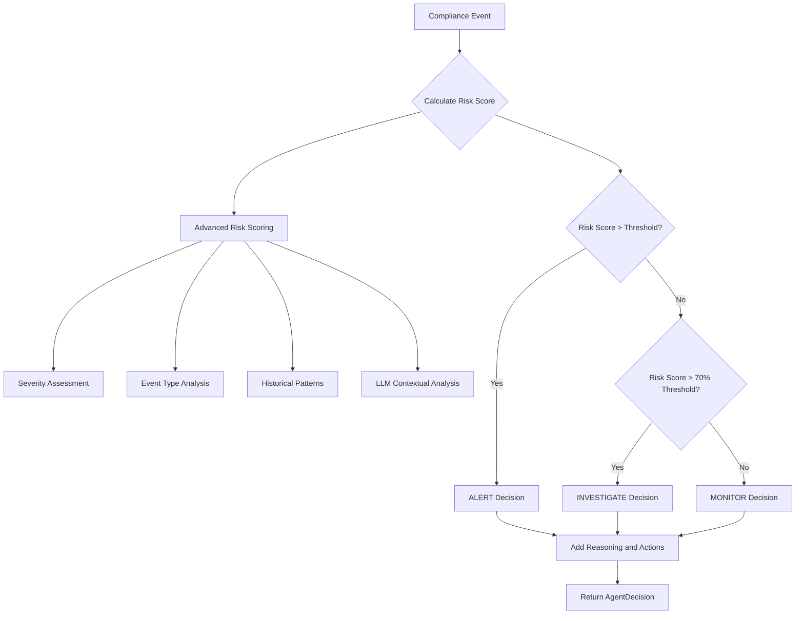
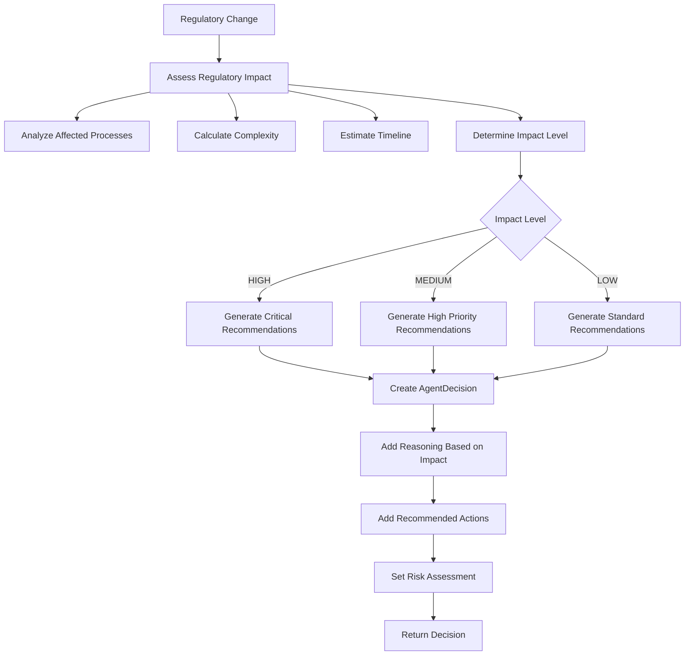
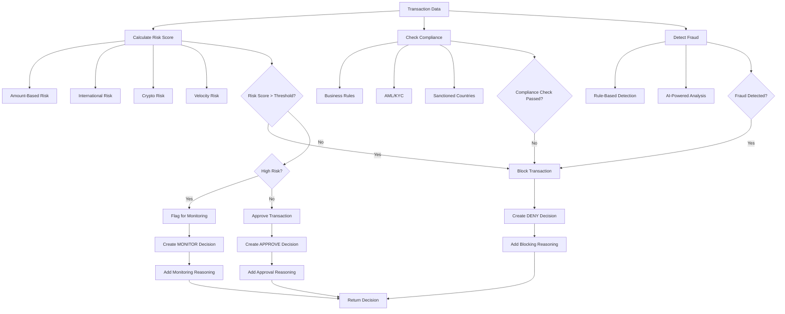
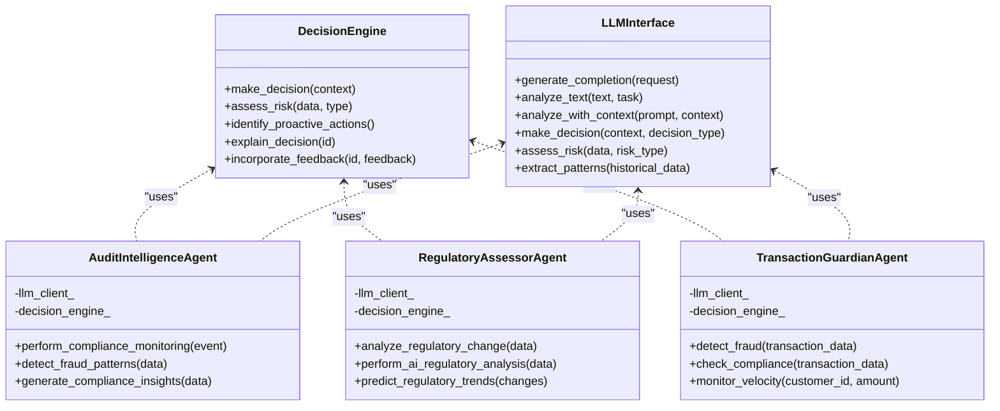
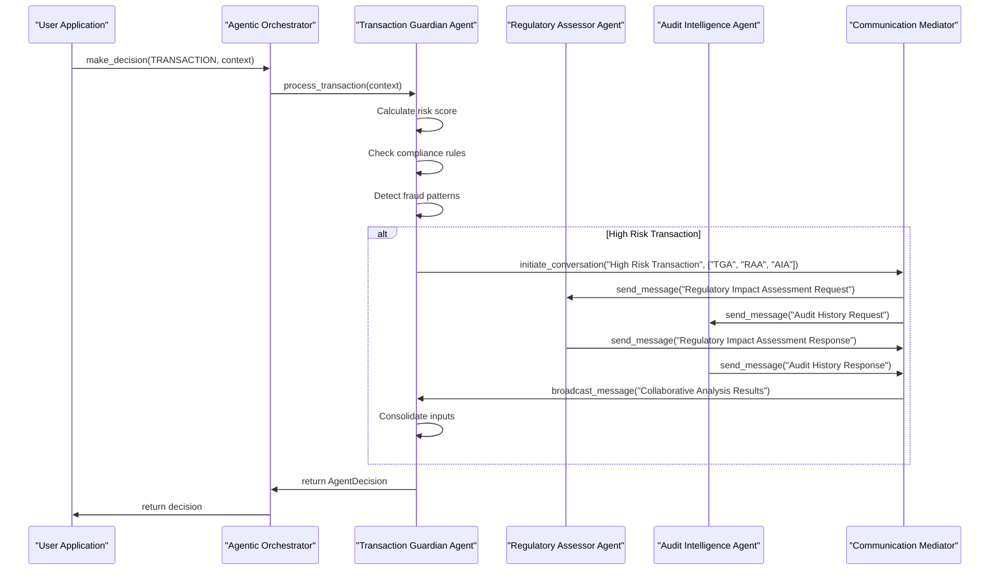
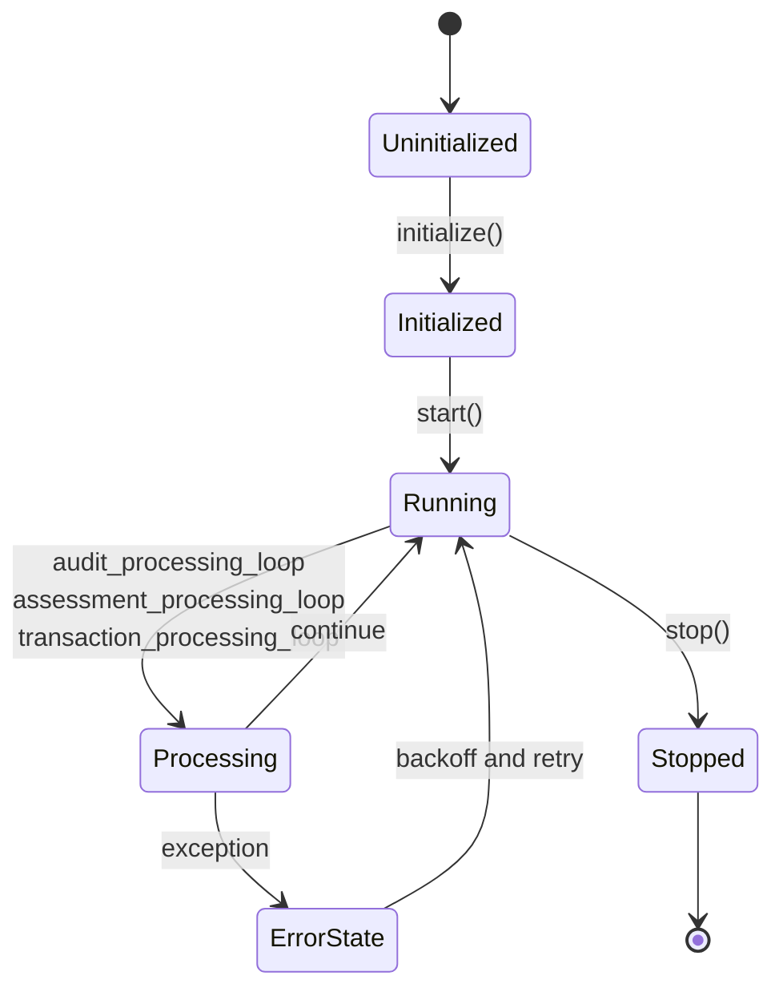
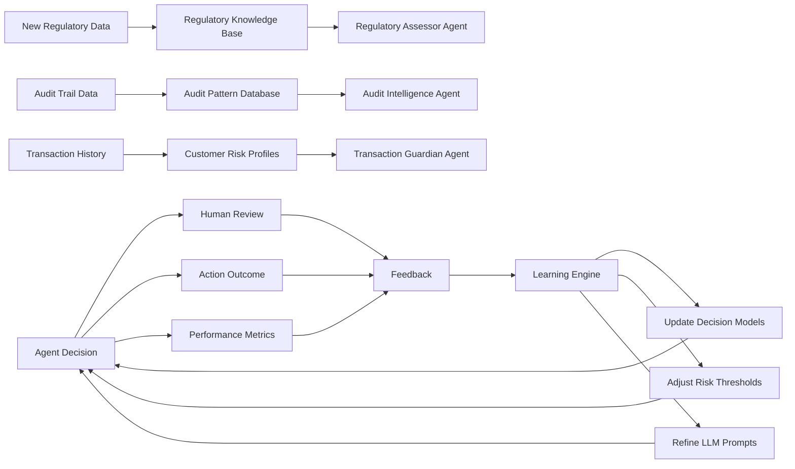

# Agent Types

<cite>
**Referenced Files in This Document**   
- [audit_intelligence_agent.cpp](file://agents/audit_intelligence/audit_intelligence_agent.cpp)
- [audit_intelligence_agent.hpp](file://agents/audit_intelligence/audit_intelligence_agent.hpp)
- [regulatory_assessor_agent.cpp](file://agents/regulatory_assessor/regulatory_assessor_agent.cpp)
- [regulatory_assessor_agent.hpp](file://agents/regulatory_assessor/regulatory_assessor_agent.hpp)
- [transaction_guardian_agent.cpp](file://agents/transaction_guardian/transaction_guardian_agent.cpp)
- [transaction_guardian_agent.hpp](file://agents/transaction_guardian/transaction_guardian_agent.hpp)
- [agentic_orchestrator.hpp](file://shared/agentic_brain/agentic_orchestrator.hpp)
- [decision_engine.hpp](file://shared/agentic_brain/decision_engine.hpp)
- [llm_interface.hpp](file://shared/agentic_brain/llm_interface.hpp)
- [communication_mediator.hpp](file://shared/agentic_brain/communication_mediator.hpp)
</cite>

## Table of Contents
1. [Introduction](#introduction)
2. [Core Agent Types](#core-agent-types)
3. [Audit Intelligence Agent](#audit-intelligence-agent)
4. [Regulatory Assessor Agent](#regulatory-assessor-agent)
5. [Transaction Guardian Agent](#transaction-guardian-agent)
6. [Integration with Decision Engine and LLM Interface](#integration-with-decision-engine-and-llm-interface)
7. [Agentic Orchestrator and Agent Coordination](#agentic-orchestrator-and-agent-coordination)
8. [Configuration and Initialization](#configuration-and-initialization)
9. [Lifecycle and Processing Loops](#lifecycle-and-processing-loops)
10. [Feedback Loops and Knowledge Updates](#feedback-loops-and-knowledge-updates)
11. [Common Issues and Troubleshooting](#common-issues-and-troubleshooting)
12. [Usage Examples](#usage-examples)

## Introduction

The Regulens system features a sophisticated multi-agent architecture designed for comprehensive regulatory compliance and risk management. This document details the three specialized agent types: Audit Intelligence Agent, Regulatory Assessor Agent, and Transaction Guardian Agent. Each agent is purpose-built for specific compliance domains, leveraging advanced machine learning, pattern recognition, and LLM-powered analysis to provide intelligent decision-making capabilities. These agents operate within a coordinated ecosystem managed by the Agentic Orchestrator, integrating with the Decision Engine and LLM Interface to deliver explainable, auditable, and adaptive compliance solutions.

## Core Agent Types

The Regulens system implements three specialized agent types, each designed for a specific compliance domain:

- **Audit Intelligence Agent**: Focuses on compliance auditing and anomaly detection through sophisticated audit trail analysis, pattern recognition, and intelligent monitoring.
- **Regulatory Assessor Agent**: Specializes in regulatory impact evaluation, analyzing regulatory changes and assessing their implications on business operations.
- **Transaction Guardian Agent**: Provides real-time transaction monitoring, assessing compliance risks and detecting suspicious activities in financial transactions.

These agents share a common architecture and integration patterns while implementing domain-specific logic and decision-making processes. They are coordinated by the Agentic Orchestrator and communicate through the Communication Mediator system, ensuring cohesive operation across the compliance landscape.

**Section sources**
- [agentic_orchestrator.hpp](file://shared/agentic_brain/agentic_orchestrator.hpp)

## Audit Intelligence Agent

The Audit Intelligence Agent performs advanced compliance auditing and anomaly detection by analyzing audit trails, identifying patterns, and detecting potential fraud. This agent leverages machine learning and pattern recognition to provide intelligent compliance monitoring.

### Responsibilities and Domain Logic

The Audit Intelligence Agent is responsible for:
- Analyzing audit trails for anomalies and compliance issues
- Performing real-time compliance monitoring of events
- Generating comprehensive audit intelligence reports
- Detecting fraud patterns using AI analysis
- Analyzing decision patterns for bias and compliance

The agent implements sophisticated anomaly detection methods including temporal anomaly detection, behavioral anomaly detection across agents, and risk correlation analysis. It uses a multi-factor risk scoring system that combines severity-based assessment, event type analysis, historical pattern analysis, and contextual risk assessment using LLMs.

### Decision-Making Process

The agent's decision-making process begins with the `perform_compliance_monitoring` method, which evaluates compliance events. It calculates a risk score using the `calculate_advanced_risk_score` method, which considers multiple factors:

1. Severity-based risk assessment
2. Event type risk analysis using pattern matching
3. Historical pattern analysis using statistical ML models
4. Contextual risk assessment using LLM analysis

Based on the calculated risk score relative to the configurable `anomaly_threshold_`, the agent determines the appropriate decision type (ALERT, INVESTIGATE, or MONITOR) and confidence level. The decision includes detailed reasoning, recommended actions, and a comprehensive risk assessment.



**Diagram sources **
- [audit_intelligence_agent.cpp](file://agents/audit_intelligence/audit_intelligence_agent.cpp#L450-L550)
- [audit_intelligence_agent.hpp](file://agents/audit_intelligence/audit_intelligence_agent.hpp#L100-L150)

### Integration with Decision Engine and LLM Interface

The Audit Intelligence Agent integrates with the Decision Engine through the `analyze_audit_trails` and `perform_compliance_monitoring` methods, which generate decisions that are processed by the central Decision Engine. The agent uses the LLM Interface (via AnthropicClient) for advanced analysis tasks such as generating compliance insights, assessing contextual risk, and detecting fraud patterns.

The agent's `generate_compliance_insights` method uses LLM analysis to provide AI-powered insights on audit data, while the `detect_fraud_patterns` method employs complex reasoning tasks to identify potential fraud indicators. These LLM interactions are governed by configurable parameters and include fallback mechanisms when LLM analysis is unavailable.

**Section sources**
- [audit_intelligence_agent.cpp](file://agents/audit_intelligence/audit_intelligence_agent.cpp#L700-L800)
- [audit_intelligence_agent.hpp](file://agents/audit_intelligence/audit_intelligence_agent.hpp#L200-L250)

## Regulatory Assessor Agent

The Regulatory Assessor Agent specializes in evaluating the impact of regulatory changes on business operations, providing intelligent recommendations for compliance adaptation.

### Responsibilities and Domain Logic

The Regulatory Assessor Agent is responsible for:
- Assessing the impact of regulatory changes on business operations
- Generating compliance adaptation recommendations
- Analyzing regulatory changes using AI-powered analysis
- Predicting future regulatory trends
- Assessing compliance gaps between current state and new requirements

The agent implements a comprehensive impact assessment process that analyzes affected business processes, calculates implementation complexity, estimates compliance timelines, and determines overall impact levels. It uses AI-powered analysis to interpret regulatory text and identify affected business processes through NLP techniques.

### Decision-Making Process

The agent's primary decision-making method is `analyze_regulatory_change`, which orchestrates a comprehensive regulatory impact assessment:

1. First, it calls `assess_regulatory_impact` to evaluate the change's business implications
2. Then, it generates adaptation recommendations based on the impact assessment
3. Finally, it creates a structured AgentDecision with appropriate type, confidence, reasoning, and actions

The impact level is determined by a combination of implementation complexity and timeline pressure. High impact is assigned when complexity exceeds the `high_impact_threshold_` or when the estimated timeline is less than 30 days. The agent generates specific recommendations based on the impact level, including establishing emergency task forces for high-impact changes and planning system changes for complex implementations.



**Diagram sources **
- [regulatory_assessor_agent.cpp](file://agents/regulatory_assessor/regulatory_assessor_agent.cpp#L300-L400)
- [regulatory_assessor_agent.hpp](file://agents/regulatory_assessor/regulatory_assessor_agent.hpp#L100-L150)

### Integration with Decision Engine and LLM Interface

The Regulatory Assessor Agent integrates with the Decision Engine by creating structured AgentDecision objects that are processed by the central decision-making system. The agent uses the LLM Interface for several critical functions:

- `perform_ai_regulatory_analysis`: Uses complex reasoning tasks to analyze regulatory text and extract business implications
- `analyze_affected_processes`: Employs NLP analysis to identify which business processes are affected by regulatory changes
- `predict_regulatory_trends`: Analyzes patterns in regulatory changes to forecast future regulatory directions

The agent's LLM interactions are designed with fallback mechanisms, using keyword-based analysis when AI analysis fails, ensuring robust operation even when external LLM services are unavailable.

**Section sources**
- [regulatory_assessor_agent.cpp](file://agents/regulatory_assessor/regulatory_assessor_agent.cpp#L500-L600)
- [regulatory_assessor_agent.hpp](file://agents/regulatory_assessor/regulatory_assessor_agent.hpp#L200-L250)

## Transaction Guardian Agent

The Transaction Guardian Agent provides real-time monitoring of financial transactions, assessing compliance risks and detecting suspicious activities to ensure regulatory compliance.

### Responsibilities and Domain Logic

The Transaction Guardian Agent is responsible for:
- Processing transactions for compliance and risk assessment
- Performing real-time fraud detection
- Checking transactions against regulatory compliance rules
- Monitoring transaction velocity and patterns
- Generating transaction compliance reports

The agent implements a comprehensive risk assessment framework that evaluates multiple risk factors including transaction amount, destination country, customer risk profile, and velocity patterns. It uses a hybrid approach combining rule-based checks with AI-powered analysis to detect fraud and compliance violations.

### Decision-Making Process

The agent's decision-making process begins with the `process_transaction` method, which orchestrates a multi-layered risk assessment:

1. First, it calculates a transaction risk score using `calculate_transaction_risk_score`
2. Then, it performs compliance checks with `check_compliance`
3. Next, it conducts fraud detection with `detect_fraud`
4. Finally, it determines the overall decision based on these assessments

The risk score calculation considers multiple factors including transaction amount, international status, cryptocurrency involvement, and velocity patterns. The agent uses statistical analysis to detect velocity anomalies by calculating z-scores and velocity ratios compared to customer history.



**Diagram sources **
- [transaction_guardian_agent.cpp](file://agents/transaction_guardian/transaction_guardian_agent.cpp#L300-L500)
- [transaction_guardian_agent.hpp](file://agents/transaction_guardian/transaction_guardian_agent.hpp#L100-L150)

### Integration with Decision Engine and LLM Interface

The Transaction Guardian Agent integrates with the Decision Engine by creating structured AgentDecision objects that represent transaction approval, denial, or monitoring decisions. The agent uses the LLM Interface for advanced fraud detection through the `detect_fraud` method, which employs complex reasoning tasks to analyze transaction patterns and identify potential fraud indicators.

The agent implements a circuit breaker pattern for LLM interactions, falling back to rule-based analysis when the LLM service is unavailable. This ensures continuous operation even during external service outages. The agent also uses the LLM Interface to analyze unusual transaction patterns and provide contextual risk assessment.

**Section sources**
- [transaction_guardian_agent.cpp](file://agents/transaction_guardian/transaction_guardian_agent.cpp#L600-L800)
- [transaction_guardian_agent.hpp](file://agents/transaction_guardian/transaction_guardian_agent.hpp#L200-L250)

## Integration with Decision Engine and LLM Interface

All three agent types integrate with the central Decision Engine and LLM Interface to provide consistent, explainable decision-making across the system.

### Decision Engine Integration

The agents integrate with the Decision Engine through a common pattern of creating structured AgentDecision objects that contain:

- Decision type and confidence level
- Detailed reasoning with weighted factors
- Recommended actions with priorities and deadlines
- Comprehensive risk assessments
- Input context and metadata

The Decision Engine processes these decisions, applying additional validation, consistency checks, and performance monitoring. It also provides feedback to the agents through the learning system, enabling continuous improvement of decision quality.

The integration follows the pattern defined in the `DecisionEngine` class, which supports various decision types including transaction approval, risk flagging, regulatory impact assessment, and audit anomaly detection. Each agent maps its domain-specific decisions to these standard types, ensuring consistency across the system.

### LLM Interface Integration

All agents use the LLM Interface (via AnthropicClient) for advanced analysis tasks that require natural language understanding, pattern recognition, and complex reasoning. The integration follows a consistent pattern:

1. Each agent has a reference to the LLM client
2. When advanced analysis is needed, the agent calls appropriate methods on the LLM client
3. The agent processes the LLM response, extracting relevant information
4. The agent applies domain-specific logic to interpret and act on the LLM analysis
5. Fallback mechanisms are implemented for when LLM analysis fails

The agents use different LLM capabilities based on their domain:
- Audit Intelligence Agent: Uses LLM for compliance insights and anomaly interpretation
- Regulatory Assessor Agent: Uses LLM for regulatory text analysis and impact assessment
- Transaction Guardian Agent: Uses LLM for fraud pattern detection and transaction analysis

The integration includes configurable parameters for temperature, max tokens, and model selection, allowing fine-tuning of LLM behavior for each agent's specific needs.



**Diagram sources **
- [decision_engine.hpp](file://shared/agentic_brain/decision_engine.hpp)
- [llm_interface.hpp](file://shared/agentic_brain/llm_interface.hpp)
- [audit_intelligence_agent.hpp](file://agents/audit_intelligence/audit_intelligence_agent.hpp)
- [regulatory_assessor_agent.hpp](file://agents/regulatory_assessor/regulatory_assessor_agent.hpp)
- [transaction_guardian_agent.hpp](file://agents/transaction_guardian/transaction_guardian_agent.hpp)

**Section sources**
- [decision_engine.hpp](file://shared/agentic_brain/decision_engine.hpp)
- [llm_interface.hpp](file://shared/agentic_brain/llm_interface.hpp)

## Agentic Orchestrator and Agent Coordination

The Agentic Orchestrator serves as the central coordination point for all agents, managing their lifecycle, facilitating communication, and ensuring cohesive operation.

### Agent Orchestration

The Agentic Orchestrator manages the three specialized agents through the `make_decision` method, which routes decision requests to the appropriate agent based on the AgentType. The orchestrator follows a factory pattern, initializing agents during startup and maintaining references to them for the duration of the system's operation.

The orchestrator provides a unified interface for decision-making while allowing each agent to maintain its domain-specific expertise. It handles the complexity of agent discovery, initialization, and configuration, presenting a simplified interface to the rest of the system.

### Inter-Agent Communication

Agents communicate with each other through the Communication Mediator system, which provides advanced conversation orchestration and conflict resolution capabilities. The mediator supports:

- Initiation and management of multi-agent conversations
- Message broadcasting and targeted messaging
- Conflict detection and resolution
- Conversation state tracking and persistence
- Performance monitoring and analytics

The communication system enables collaborative decision-making, where multiple agents can contribute their expertise to complex compliance scenarios. For example, when a high-risk transaction is detected, the Transaction Guardian Agent can initiate a conversation with the Audit Intelligence Agent and Regulatory Assessor Agent to gather additional insights before making a final decision.



**Diagram sources **
- [agentic_orchestrator.hpp](file://shared/agentic_brain/agentic_orchestrator.hpp)
- [communication_mediator.hpp](file://shared/agentic_brain/communication_mediator.hpp)
- [transaction_guardian_agent.hpp](file://agents/transaction_guardian/transaction_guardian_agent.hpp)

**Section sources**
- [agentic_orchestrator.hpp](file://shared/agentic_brain/agentic_orchestrator.hpp)
- [communication_mediator.hpp](file://shared/agentic_brain/communication_mediator.hpp)

## Configuration and Initialization

Each agent type follows a consistent configuration and initialization pattern, with both system-level and database-driven configuration options.

### Configuration Parameters

All agents support a comprehensive set of configuration parameters that control their behavior:

**Audit Intelligence Agent:**
- `anomaly_threshold_`: Threshold for anomaly detection (default: 0.85)
- `analysis_interval_`: Interval between audit analyses (default: 15 minutes)
- Risk severity thresholds for critical, high, medium, and low levels

**Regulatory Assessor Agent:**
- `high_impact_threshold_`: Threshold for high impact regulatory changes
- `assessment_interval_`: Interval between regulatory assessments
- `regulatory_sources_`: List of regulatory sources to monitor

**Transaction Guardian Agent:**
- `fraud_threshold_`: Threshold for fraud detection
- `velocity_threshold_`: Threshold for velocity-based risk
- `high_risk_threshold_`: Threshold for high risk transactions
- `analysis_window_`: Time window for velocity analysis
- `sanctioned_countries_`: List of sanctioned countries

### Initialization Patterns

All agents follow a two-phase initialization pattern:

1. **System-level initialization**: During object construction, agents receive references to shared services (configuration manager, logger, database pool, LLM client, and domain-specific services).
2. **Database-driven configuration**: The `load_configuration_from_database` method loads agent-specific configuration from the database, allowing runtime parameter adjustment without code changes.

The initialization process includes validation of all required dependencies and graceful handling of configuration errors. Agents can operate with default values if database configuration is unavailable, ensuring system resilience.

```mermaid
flowchart TD
A[Agent Construction] --> B[Inject Dependencies]
B --> C[Set Default Configuration]
C --> D[Call initialize()]
D --> E[Load System Configuration]
E --> F{Configuration Valid?}
F --> |Yes| G[Call load_configuration_from_database]
F --> |No| H[Return False]
G --> I[Load Database Configuration]
I --> J{Database Config Loaded?}
J --> |Yes| K[Apply Database Overrides]
J --> |No| L[Use System Defaults]
K --> M[Start Processing Loop]
L --> M
M --> N[Agent Ready]
```

**Section sources**
- [audit_intelligence_agent.cpp](file://agents/audit_intelligence/audit_intelligence_agent.cpp#L50-L150)
- [regulatory_assessor_agent.cpp](file://agents/regulatory_assessor/regulatory_assessor_agent.cpp#L50-L150)
- [transaction_guardian_agent.cpp](file://agents/transaction_guardian/transaction_guardian_agent.cpp#L50-L150)

## Lifecycle and Processing Loops

Each agent implements a consistent lifecycle management pattern with dedicated processing loops for continuous operation.

### Lifecycle Management

All agents follow the same lifecycle pattern:

- **Initialization**: The `initialize` method sets up the agent with configuration and validates dependencies.
- **Startup**: The `start` method begins the agent's processing loop in a separate thread.
- **Processing**: The agent runs its main processing loop, performing its domain-specific tasks.
- **Shutdown**: The `stop` method terminates the processing loop and cleans up resources.

The lifecycle is managed through atomic flags and thread synchronization to ensure clean startup and shutdown. Each agent uses a dedicated thread for its processing loop, preventing blocking of other system components.

### Processing Loops

Each agent implements a domain-specific processing loop:

**Audit Intelligence Agent:**
- Runs `audit_processing_loop` which periodically analyzes audit trails (default: every 15 minutes)
- Performs continuous anomaly detection on incoming compliance events
- Generates audit reports on demand

**Regulatory Assessor Agent:**
- Runs `assessment_processing_loop` which periodically checks for new regulatory changes
- Assesses the impact of detected changes
- Updates compliance recommendations

**Transaction Guardian Agent:**
- Runs `transaction_processing_loop` which processes transactions from a queue
- Performs real-time risk assessment and compliance checks
- Escalates suspicious transactions as needed

The processing loops include error handling and backoff mechanisms to ensure resilience during transient failures.



**Section sources**
- [audit_intelligence_agent.cpp](file://agents/audit_intelligence/audit_intelligence_agent.cpp#L200-L250)
- [regulatory_assessor_agent.cpp](file://agents/regulatory_assessor/regulatory_assessor_agent.cpp#L200-L250)
- [transaction_guardian_agent.cpp](file://agents/transaction_guardian/transaction_guardian_agent.cpp#L200-L250)

## Feedback Loops and Knowledge Updates

The agent system implements sophisticated feedback loops that enable continuous learning and adaptation.

### Feedback Incorporation

The system uses the `incorporate_decision_feedback` method in the Decision Engine to process feedback on agent decisions. This feedback can come from:

- Human review of agent decisions
- Outcomes of recommended actions
- Performance metrics and accuracy measurements
- External validation sources

The feedback is used to:
- Adjust decision thresholds and risk models
- Improve pattern recognition capabilities
- Refine LLM prompts and analysis methods
- Update agent knowledge bases

### Knowledge Updates

Agent-specific knowledge is updated through several mechanisms:

1. **Regulatory Knowledge Base**: The Regulatory Assessor Agent updates its knowledge base with new regulatory changes and interpretations.
2. **Audit Pattern Database**: The Audit Intelligence Agent stores detected patterns and anomalies for future reference.
3. **Transaction Risk Profiles**: The Transaction Guardian Agent updates customer risk profiles based on transaction history.

The learning engine analyzes feedback and historical data to identify improvement areas and update decision models. This creates a continuous improvement cycle where agents become more accurate and effective over time.



**Section sources**
- [decision_engine.hpp](file://shared/agentic_brain/decision_engine.hpp#L150-L200)
- [learning_engine.hpp](file://shared/agentic_brain/learning_engine.hpp)

## Common Issues and Troubleshooting

This section addresses common issues that may arise with the agent system and provides troubleshooting guidance.

### Handling Conflicting Regulatory Interpretations

When agents encounter conflicting regulatory interpretations, the system employs several strategies:

1. **Consensus Engine**: The Communication Mediator can facilitate discussions between agents to reach consensus.
2. **Hierarchical Resolution**: Regulatory Assessor Agent has authority on regulatory interpretation matters.
3. **Human Escalation**: Conflicts that cannot be resolved automatically are escalated to human reviewers.
4. **Confidence-Based Weighting**: Decisions are weighted by confidence scores, with higher confidence interpretations taking precedence.

To troubleshoot conflicting interpretations:
- Check the regulatory knowledge base for the most recent updates
- Verify that all agents are using the same regulatory data sources
- Review the confidence scores of conflicting decisions
- Examine the reasoning provided for each interpretation
- Consider temporal factors (newer regulations typically override older ones)

### Handling High-Risk Transaction Patterns

When the Transaction Guardian Agent detects high-risk transaction patterns, it follows a tiered response approach:

1. **Immediate Blocking**: Transactions exceeding critical thresholds are blocked immediately.
2. **Enhanced Monitoring**: High-risk transactions are flagged for additional monitoring.
3. **Multi-Agent Consultation**: The agent consults with other agents for additional insights.
4. **Human Review Escalation**: Suspicious transactions are queued for human review.

To troubleshoot issues with high-risk transaction handling:
- Verify that velocity thresholds are appropriately calibrated to customer behavior
- Check that sanctioned countries list is up to date
- Ensure that customer risk profiles are being updated correctly
- Validate that the LLM fraud detection is functioning properly
- Review false positive rates and adjust thresholds if necessary

### General Troubleshooting

For general agent system issues, follow these steps:

1. **Check Agent Status**: Verify that all agents are running and responsive.
2. **Review Logs**: Examine structured logs for error messages and warnings.
3. **Validate Configuration**: Ensure that all configuration parameters are correctly set.
4. **Test Dependencies**: Verify connectivity to database, LLM services, and other dependencies.
5. **Monitor Performance**: Check processing times and resource utilization.
6. **Review Feedback Loop**: Ensure that decision feedback is being processed correctly.

The system provides comprehensive monitoring endpoints through the Communication Mediator API handlers, allowing administrators to assess agent performance, conversation effectiveness, and conflict resolution statistics.

**Section sources**
- [communication_mediator.hpp](file://shared/agentic_brain/communication_mediator.hpp)
- [communication_mediator_api_handlers.hpp](file://shared/agentic_brain/communication_mediator_api_handlers.hpp)
- [decision_engine.hpp](file://shared/agentic_brain/decision_engine.hpp)

## Usage Examples

This section provides concrete examples of how each agent processes input context and generates decisions.

### Audit Intelligence Agent Example

When processing a compliance event, the Audit Intelligence Agent follows this flow:

```cpp
// Example input context
nlohmann::json event_data = {
    {"event_type", "AUDIT_LOG_ENTRY"},
    {"severity", "CRITICAL"},
    {"description", "Unusual access pattern detected"},
    {"source", {
        {"agent_name", "data_processor"},
        {"component", "database_access"}
    }},
    {"metadata", {
        {"user_id", "user_123"},
        {"access_time", "2023-12-01T02:30:00Z"},
        {"data_volume", 1000000}
    }}
};

// Agent processes the event
ComplianceEvent event = create_event_from_json(event_data);
AgentDecision decision = audit_agent.perform_compliance_monitoring(event);

// The decision contains:
// - Decision type: ALERT (due to critical severity)
// - Confidence: HIGH
// - Reasoning: Risk-based compliance monitoring with weight ~0.9
// - Recommended actions: Immediate investigation and access restriction
// - Risk assessment: HIGH risk level with detailed risk factors
```

### Regulatory Assessor Agent Example

When analyzing a regulatory change, the agent follows this process:

```cpp
// Example regulatory change data
nlohmann::json regulatory_change = {
    {"id", "REG-2023-001"},
    {"title", "Enhanced Customer Due Diligence Requirements"},
    {"description", "New regulations requiring enhanced verification for high-risk customers"},
    {"source", "FINRA"},
    {"effective_date", "2024-06-01"},
    {"category", "KYC"}
};

// Agent analyzes the change
AgentDecision decision = assessor_agent.analyze_regulatory_change(regulatory_change);

// The decision contains:
// - Decision type: ESCALATE (high impact change)
// - Confidence: HIGH
// - Reasoning: Critical regulatory impact with high complexity
// - Recommended actions: Establish task force, conduct gap analysis, plan system changes
// - Risk assessment: HIGH impact level with implementation complexity ~0.8
```

### Transaction Guardian Agent Example

When processing a transaction, the agent executes this workflow:

```cpp
// Example transaction data
nlohmann::json transaction_data = {
    {"transaction_id", "TX-2023-001"},
    {"customer_id", "cust_456"},
    {"amount", 75000.0},
    {"currency", "USD"},
    {"type", "international_wire"},
    {"destination_country", "AE"},
    {"timestamp", "2023-12-01T14:30:00Z"}
};

// Agent processes the transaction
AgentDecision decision = guardian_agent.process_transaction(transaction_data);

// The decision contains:
// - Decision type: MONITOR (high amount but not exceeding fraud threshold)
// - Confidence: MEDIUM (due to high amount)
// - Reasoning: Transaction approved with risk level HIGH
// - Recommended actions: Flag for monitoring, initiate investigation
// - Risk assessment: HIGH risk level with velocity and amount risk factors
```

These examples demonstrate how each agent transforms input context into structured decisions with comprehensive reasoning and actionable recommendations.

**Section sources**
- [audit_intelligence_agent.cpp](file://agents/audit_intelligence/audit_intelligence_agent.cpp#L450-L550)
- [regulatory_assessor_agent.cpp](file://agents/regulatory_assessor/regulatory_assessor_agent.cpp#L300-L400)
- [transaction_guardian_agent.cpp](file://agents/transaction_guardian/transaction_guardian_agent.cpp#L300-L500)