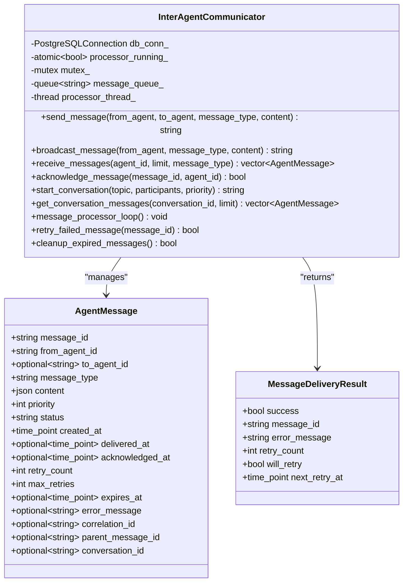

# Communication Protocol

<cite>
**Referenced Files in This Document**
- [inter_agent_communicator.cpp](file://shared/agentic_brain/inter_agent_communicator.cpp)
- [inter_agent_communicator.hpp](file://shared/agentic_brain/inter_agent_communicator.hpp)
- [communication_mediator.cpp](file://shared/agentic_brain/communication_mediator.cpp)
- [communication_mediator.hpp](file://shared/agentic_brain/communication_mediator.hpp)
- [consensus_engine.cpp](file://shared/agentic_brain/consensus_engine.cpp)
- [consensus_engine.hpp](file://shared/agentic_brain/consensus_engine.hpp)
- [message_translator.cpp](file://shared/agentic_brain/message_translator.cpp)
- [message_translator.hpp](file://shared/agentic_brain/message_translator.hpp)
- [inter_agent_api_handlers.cpp](file://shared/agentic_brain/inter_agent_api_handlers.cpp)
- [communication_mediator_api_handlers.cpp](file://shared/agentic_brain/communication_mediator_api_handlers.cpp)
- [consensus_engine_api_handlers.cpp](file://shared/agentic_brain/consensus_engine_api_handlers.cpp)
- [message_translator_api_handlers.cpp](file://shared/agentic_brain/message_translator_api_handlers.cpp)
- [schema.sql](file://schema.sql)
</cite>

## Table of Contents
1. [Introduction](#introduction)
2. [System Architecture](#system-architecture)
3. [Inter-Agent Communicator](#inter-agent-communicator)
4. [Communication Mediator](#communication-mediator)
5. [Consensus Engine](#consensus-engine)
6. [Message Translator](#message-translator)
7. [Message Types and Schemas](#message-types-and-schemas)
8. [Reliability and Delivery](#reliability-and-delivery)
9. [Performance Considerations](#performance-considerations)
10. [API Reference](#api-reference)
11. [Troubleshooting Guide](#troubleshooting-guide)
12. [Best Practices](#best-practices)

## Introduction

The Regulens Communication Protocol is a sophisticated inter-agent messaging and coordination system designed for compliance and regulatory AI applications. Built on PostgreSQL as the message broker, it provides reliable, scalable, and fault-tolerant communication between autonomous agents in a distributed system.

The system consists of four core components:
- **Inter-Agent Communicator**: Message queuing and delivery system
- **Communication Mediator**: Conversation orchestration and conflict resolution
- **Consensus Engine**: Multi-agent decision-making and voting
- **Message Translator**: Protocol conversion between different messaging standards

## System Architecture

The communication protocol follows a layered architecture with PostgreSQL serving as the central message broker. All components communicate asynchronously through database tables, ensuring durability and reliability.


**Diagram sources**
- [inter_agent_communicator.cpp](file://shared/agentic_brain/inter_agent_communicator.cpp#L166-L205)
- [communication_mediator.cpp](file://shared/agentic_brain/communication_mediator.cpp#L130-L180)
- [schema.sql](file://schema.sql#L4980-L5100)

**Section sources**
- [inter_agent_communicator.cpp](file://shared/agentic_brain/inter_agent_communicator.cpp#L166-L205)
- [communication_mediator.cpp](file://shared/agentic_brain/communication_mediator.cpp#L130-L180)
- [schema.sql](file://schema.sql#L4980-L5100)

## Inter-Agent Communicator

The Inter-Agent Communicator serves as the primary message queuing and delivery system, managing asynchronous communication between agents through PostgreSQL as the message broker.

### Core Features

The communicator provides comprehensive message management capabilities:



**Diagram sources**
- [inter_agent_communicator.hpp](file://shared/agentic_brain/inter_agent_communicator.hpp#L18-L78)
- [inter_agent_communicator.cpp](file://shared/agentic_brain/inter_agent_communicator.cpp#L166-L205)

### Message Priority and Expiration

The system implements a sophisticated priority and expiration mechanism:

- **Priority Levels**: 1 (Highest Urgency) to 5 (Lowest Priority)
- **Expiration Policies**: Configurable TTL for messages
- **Retry Logic**: Automatic retry with exponential backoff

### Message Processing Pipeline


**Diagram sources**
- [inter_agent_communicator.cpp](file://shared/agentic_brain/inter_agent_communicator.cpp#L1196-L1288)
- [inter_agent_communicator.cpp](file://shared/agentic_brain/inter_agent_communicator.cpp#L1094-L1164)

**Section sources**
- [inter_agent_communicator.cpp](file://shared/agentic_brain/inter_agent_communicator.cpp#L166-L205)
- [inter_agent_communicator.cpp](file://shared/agentic_brain/inter_agent_communicator.cpp#L1196-L1288)
- [inter_agent_communicator.cpp](file://shared/agentic_brain/inter_agent_communicator.cpp#L1094-L1164)

## Communication Mediator

The Communication Mediator orchestrates complex multi-agent conversations, detects conflicts, and applies resolution strategies to maintain productive collaboration.

### Conversation Management


**Diagram sources**
- [communication_mediator.cpp](file://shared/agentic_brain/communication_mediator.cpp#L130-L180)
- [communication_mediator.cpp](file://shared/agentic_brain/communication_mediator.cpp#L1500-L1600)

### Conflict Detection and Resolution

The mediator implements multiple conflict detection strategies:


**Diagram sources**
- [communication_mediator.cpp](file://shared/agentic_brain/communication_mediator.cpp#L400-L500)
- [communication_mediator.cpp](file://shared/agentic_brain/communication_mediator.cpp#L600-L700)

### Resolution Strategies

The mediator supports multiple resolution strategies:

1. **Majority Vote**: Simple majority decision
2. **Weighted Vote**: Votes weighted by agent expertise
3. **Expert Arbitration**: Decision by most knowledgeable agent
4. **Compromise Negotiation**: Collaborative solution finding

**Section sources**
- [communication_mediator.cpp](file://shared/agentic_brain/communication_mediator.cpp#L130-L180)
- [communication_mediator.cpp](file://shared/agentic_brain/communication_mediator.cpp#L400-L500)
- [communication_mediator.cpp](file://shared/agentic_brain/communication_mediator.cpp#L600-L700)

## Consensus Engine

The Consensus Engine provides sophisticated multi-agent decision-making capabilities with support for various voting algorithms and consensus strategies.

### Voting Algorithms


**Diagram sources**
- [consensus_engine.cpp](file://shared/agentic_brain/consensus_engine.cpp#L100-L200)
- [consensus_engine.cpp](file://shared/agentic_brain/consensus_engine.cpp#L300-L400)

### Voting Algorithm Implementations

The consensus engine supports multiple voting algorithms:


**Diagram sources**
- [consensus_engine.cpp](file://shared/agentic_brain/consensus_engine.cpp#L500-L600)
- [consensus_engine.cpp](file://shared/agentic_brain/consensus_engine.cpp#L700-L800)

**Section sources**
- [consensus_engine.cpp](file://shared/agentic_brain/consensus_engine.cpp#L100-L200)
- [consensus_engine.cpp](file://shared/agentic_brain/consensus_engine.cpp#L500-L600)
- [consensus_engine.cpp](file://shared/agentic_brain/consensus_engine.cpp#L700-L800)

## Message Translator

The Message Translator handles protocol conversion between different messaging standards, enabling seamless communication between agents using different protocols.

### Supported Protocols


**Diagram sources**
- [message_translator.cpp](file://shared/agentic_brain/message_translator.cpp#L100-L200)
- [message_translator.cpp](file://shared/agentic_brain/message_translator.cpp#L300-L400)

### Protocol Conversion Matrix

| Source Protocol | Target Protocol | Conversion Method |
|-----------------|-----------------|-------------------|
| JSON-RPC | REST HTTP | `json_rpc_to_rest()` |
| REST HTTP | JSON-RPC | `rest_to_json_rpc()` |
| JSON-RPC | gRPC | `json_rpc_to_grpc()` |
| gRPC | JSON-RPC | `grpc_to_json_rpc()` |
| REST HTTP | SOAP | `rest_to_soap()` |
| SOAP | REST HTTP | `soap_to_rest()` |
| WebSocket | REST HTTP | `websocket_to_rest()` |
| REST HTTP | WebSocket | `rest_to_websocket()` |

**Section sources**
- [message_translator.cpp](file://shared/agentic_brain/message_translator.cpp#L100-L200)
- [message_translator.cpp](file://shared/agentic_brain/message_translator.cpp#L300-L400)

## Message Types and Schemas

The system defines standardized message types with JSON schemas for validation and consistency.

### Standard Message Types


**Diagram sources**
- [schema.sql](file://schema.sql#L5076-L5090)
- [schema.sql](file://schema.sql#L5063-L5075)

### Message Type Definitions

The system includes predefined message types:

- **TASK_ASSIGNMENT**: Assign tasks between agents
- **STATUS_UPDATE**: Report progress and status
- **DATA_REQUEST**: Request data from other agents
- **DATA_RESPONSE**: Respond with requested data
- **COLLABORATION_INVITE**: Invite to collaborative sessions
- **CONSENSUS_REQUEST**: Request consensus input
- **CONSENSUS_VOTE**: Submit consensus votes
- **ALERT**: Urgent notifications
- **HEARTBEAT**: Health checks
- **ERROR_REPORT**: Error reporting
- **CONFIGURATION_UPDATE**: Notify of configuration changes
- **RESOURCE_REQUEST**: Request system resources

**Section sources**
- [schema.sql](file://schema.sql#L5076-L5090)
- [inter_agent_communicator.cpp](file://shared/agentic_brain/inter_agent_communicator.cpp#L812-L861)

## Reliability and Delivery

The communication protocol implements comprehensive reliability mechanisms to ensure message delivery and system resilience.

### Retry Logic and Exponential Backoff


**Diagram sources**
- [inter_agent_communicator.cpp](file://shared/agentic_brain/inter_agent_communicator.cpp#L681-L726)
- [inter_agent_communicator.cpp](file://shared/agentic_brain/inter_agent_communicator.cpp#L1129-L1164)

### Delivery Status Tracking

The system tracks comprehensive delivery metrics:

- **Pending Messages**: Messages awaiting delivery
- **Delivered Messages**: Successfully delivered messages
- **Acknowledged Messages**: Messages confirmed received
- **Failed Messages**: Messages that couldn't be delivered
- **Expired Messages**: Messages past their expiration time

### Failed Message Handling

Failed messages are handled through several mechanisms:

1. **Automatic Retry**: Up to 3 retries with exponential backoff
2. **Dead Letter Queue**: Failed messages moved to dedicated table
3. **Manual Intervention**: Administrative tools for failed message inspection
4. **Notification**: Alerts for persistent delivery failures

**Section sources**
- [inter_agent_communicator.cpp](file://shared/agentic_brain/inter_agent_communicator.cpp#L681-L726)
- [inter_agent_communicator.cpp](file://shared/agentic_brain/inter_agent_communicator.cpp#L1129-L1164)
- [inter_agent_communicator.cpp](file://shared/agentic_brain/inter_agent_communicator.cpp#L1257-L1288)

## Performance Considerations

### High-Volume Message Throughput

The system is designed to handle high-volume message throughput through several optimization strategies:

1. **Asynchronous Processing**: Message processing occurs in separate threads
2. **Batch Operations**: Multiple messages processed in batches
3. **Connection Pooling**: Efficient database connection management
4. **Index Optimization**: Strategic indexing for query performance
5. **Memory Management**: Efficient memory usage for large message volumes

### Tuning Recommendations

**Batch Size Configuration**:
- **Small Batch**: 10-20 messages (low latency, higher overhead)
- **Medium Batch**: 50-100 messages (balanced performance)
- **Large Batch**: 200+ messages (higher throughput, increased latency)

**Retry Delay Configuration**:
- **Initial Delay**: 1 second
- **Exponential Backoff**: 2x multiplier per retry
- **Maximum Delay**: 30 seconds
- **Total Timeout**: 3 minutes

**Database Optimization**:
- **Connection Pool Size**: 10-20 connections
- **Query Timeout**: 30 seconds
- **Index Maintenance**: Regular vacuum and analyze operations
- **Partitioning**: Consider partitioning for high-volume scenarios

### Monitoring and Metrics

Key performance indicators to monitor:

- **Message Throughput**: Messages per second
- **Delivery Latency**: Time from send to acknowledgment
- **Success Rate**: Percentage of successful deliveries
- **Queue Depth**: Number of pending messages
- **Processor Utilization**: Thread and CPU usage
- **Database Performance**: Query execution times and connection counts

**Section sources**
- [inter_agent_communicator.cpp](file://shared/agentic_brain/inter_agent_communicator.cpp#L936-L941)
- [inter_agent_communicator.cpp](file://shared/agentic_brain/inter_agent_communicator.cpp#L1257-L1288)

## API Reference

### Inter-Agent Communication API

#### Send Message
```json
POST /api/v1/agents/{agentId}/messages
{
  "from_agent": "agent_id",
  "to_agent": "target_agent_id",
  "message_type": "TASK_ASSIGNMENT",
  "content": {
    "task": "review_transaction",
    "transaction_id": "tx_12345"
  },
  "priority": 2,
  "correlation_id": "req_67890",
  "expiry_hours": 24
}
```

#### Receive Messages
```json
GET /api/v1/agents/{agentId}/messages?limit=10&message_type=TASK_ASSIGNMENT
```

#### Acknowledge Message
```json
POST /api/v1/messages/{messageId}/acknowledge
```

#### Broadcast Message
```json
POST /api/v1/agents/{agentId}/broadcast
{
  "message_type": "ALERT",
  "content": {
    "alert_type": "SYSTEM_MAINTENANCE",
    "message": "Scheduled maintenance at 2 AM"
  },
  "priority": 1
}
```

### Communication Mediator API

#### Initiate Conversation
```json
POST /api/v1/conversations
{
  "topic": "Regulatory Compliance Review",
  "objective": "Assess compliance with new regulation",
  "participants": ["audit_agent", "compliance_agent", "risk_agent"],
  "priority": "high"
}
```

#### Send Conversation Message
```json
POST /api/v1/conversations/{conversationId}/messages
{
  "message_type": "discussion",
  "content": {
    "text": "What are the key compliance requirements?",
    "importance": "high"
  }
}
```

#### Detect Conflicts
```json
GET /api/v1/conversations/{conversationId}/conflicts
```

#### Resolve Conflict
```json
POST /api/v1/conversations/{conversationId}/conflicts/{conflictId}/resolve
{
  "strategy": "MAJORITY_VOTE"
}
```

### Consensus Engine API

#### Initiate Consensus
```json
POST /api/v1/consensus
{
  "topic": "Risk Assessment Decision",
  "algorithm": "MAJORITY",
  "participants": [
    {"agent_id": "risk_agent", "weight": 1.0},
    {"agent_id": "compliance_agent", "weight": 0.8},
    {"agent_id": "audit_agent", "weight": 0.9}
  ],
  "consensus_threshold": 0.6
}
```

#### Submit Opinion
```json
POST /api/v1/consensus/{consensusId}/opinions
{
  "decision": "approve",
  "confidence_score": 0.85,
  "reasoning": "Compliant with all requirements"
}
```

#### Calculate Consensus
```json
POST /api/v1/consensus/{consensusId}/calculate
```

### Message Translator API

#### Translate Message
```json
POST /api/v1/translate
{
  "message": "{\"method\":\"getTransaction\",\"params\":{\"id\":\"tx_123\"}}",
  "source_protocol": "JSON_RPC",
  "target_protocol": "REST_HTTP"
}
```

#### Detect Protocol
```json
POST /api/v1/detect-protocol
{
  "message": "{\"jsonrpc\":\"2.0\",\"method\":\"getTransaction\"}"
}
```

**Section sources**
- [inter_agent_api_handlers.cpp](file://shared/agentic_brain/inter_agent_api_handlers.cpp#L20-L100)
- [communication_mediator_api_handlers.cpp](file://shared/agentic_brain/communication_mediator_api_handlers.cpp#L20-L100)
- [consensus_engine_api_handlers.cpp](file://shared/agentic_brain/consensus_engine_api_handlers.cpp#L20-L100)
- [message_translator_api_handlers.cpp](file://shared/agentic_brain/message_translator_api_handlers.cpp#L20-L100)

## Troubleshooting Guide

### Common Issues and Solutions

#### Message Delivery Failures

**Symptoms**: Messages stuck in "pending" status
**Causes**: 
- Target agent offline
- Network connectivity issues
- Database connection problems
- Message validation failures

**Solutions**:
1. Check agent health status
2. Verify database connectivity
3. Review message content against schema
4. Monitor retry attempts in `message_delivery_attempts` table

#### Conversation Deadlocks

**Symptoms**: Conversations stuck in "CONFLICT_DETECTED" state
**Causes**:
- Circular dependencies in agent opinions
- Insufficient consensus threshold
- Expert agent unavailability

**Solutions**:
1. Use compromise negotiation strategy
2. Lower consensus threshold temporarily
3. Manually intervene with expert arbitration
4. Escalate to external mediation

#### High Memory Usage

**Symptoms**: System slowdown, out-of-memory errors
**Causes**:
- Large message queues
- Inefficient query patterns
- Unclosed database connections

**Solutions**:
1. Implement message expiration policies
2. Optimize database queries
3. Increase connection pool size
4. Monitor and clean up expired messages regularly

#### Performance Degradation

**Symptoms**: Slow message delivery, high latency
**Causes**:
- Database bottlenecks
- Inadequate retry delays
- Suboptimal batch sizes

**Solutions**:
1. Tune database indexes
2. Adjust retry delay parameters
3. Optimize batch processing
4. Monitor system metrics continuously

### Diagnostic Commands

**Check Message Queue Status**:
```sql
SELECT status, COUNT(*) as count 
FROM agent_messages 
GROUP BY status;
```

**Monitor Conversation Health**:
```sql
SELECT state, COUNT(*) as count 
FROM conversation_contexts 
GROUP BY state;
```

**Review Failed Messages**:
```sql
SELECT * 
FROM message_delivery_attempts 
WHERE attempt_number >= max_retries;
```

**Section sources**
- [inter_agent_communicator.cpp](file://shared/agentic_brain/inter_agent_communicator.cpp#L681-L726)
- [communication_mediator.cpp](file://shared/agentic_brain/communication_mediator.cpp#L400-L500)
- [inter_agent_communicator.cpp](file://shared/agentic_brain/inter_agent_communicator.cpp#L1257-L1288)

## Best Practices

### Message Design Guidelines

1. **Use Descriptive Message Types**: Choose clear, specific message type names
2. **Implement Proper Validation**: Always validate message content against schemas
3. **Set Appropriate Priorities**: Use priority levels consistently across the system
4. **Include Correlation IDs**: Link related messages for tracing
5. **Handle Expiration Gracefully**: Set reasonable expiration times for time-sensitive messages

### Conversation Management

1. **Define Clear Objectives**: Establish clear goals for each conversation
2. **Limit Participant Numbers**: Keep conversations manageable (recommended: 3-5 participants)
3. **Monitor Timeout Settings**: Set appropriate timeout durations
4. **Use Templates**: Leverage message templates for common patterns
5. **Track Progress**: Monitor conversation metrics and health

### System Configuration

1. **Optimize Retry Settings**: Balance between reliability and performance
2. **Configure Monitoring**: Set up comprehensive monitoring and alerting
3. **Plan Capacity**: Design for expected message volumes
4. **Implement Security**: Secure message content and access controls
5. **Regular Maintenance**: Schedule regular database maintenance tasks

### Development Workflow

1. **Test Thoroughly**: Unit test message handling and edge cases
2. **Mock Dependencies**: Use mocks for external service testing
3. **Version Control**: Track schema changes and migration scripts
4. **Documentation**: Maintain up-to-date API documentation
5. **Continuous Integration**: Automate testing and deployment processes

### Operational Excellence

1. **Monitor SLAs**: Track and report on service level agreements
2. **Capacity Planning**: Plan for growth and peak loads
3. **Disaster Recovery**: Implement backup and recovery procedures
4. **Security Auditing**: Regular security reviews and updates
5. **Performance Tuning**: Continuously optimize system performance