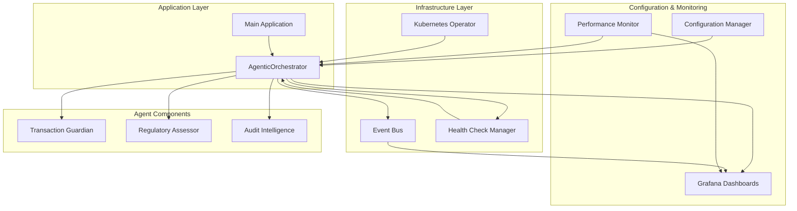
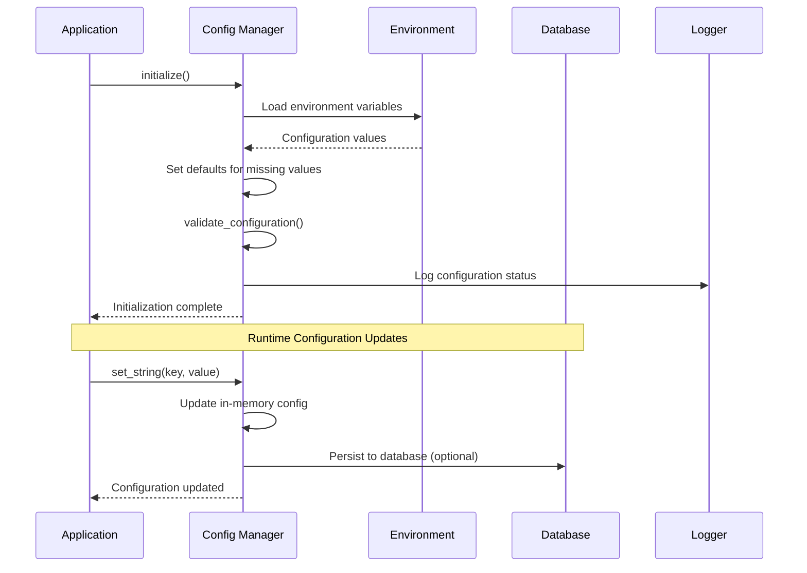
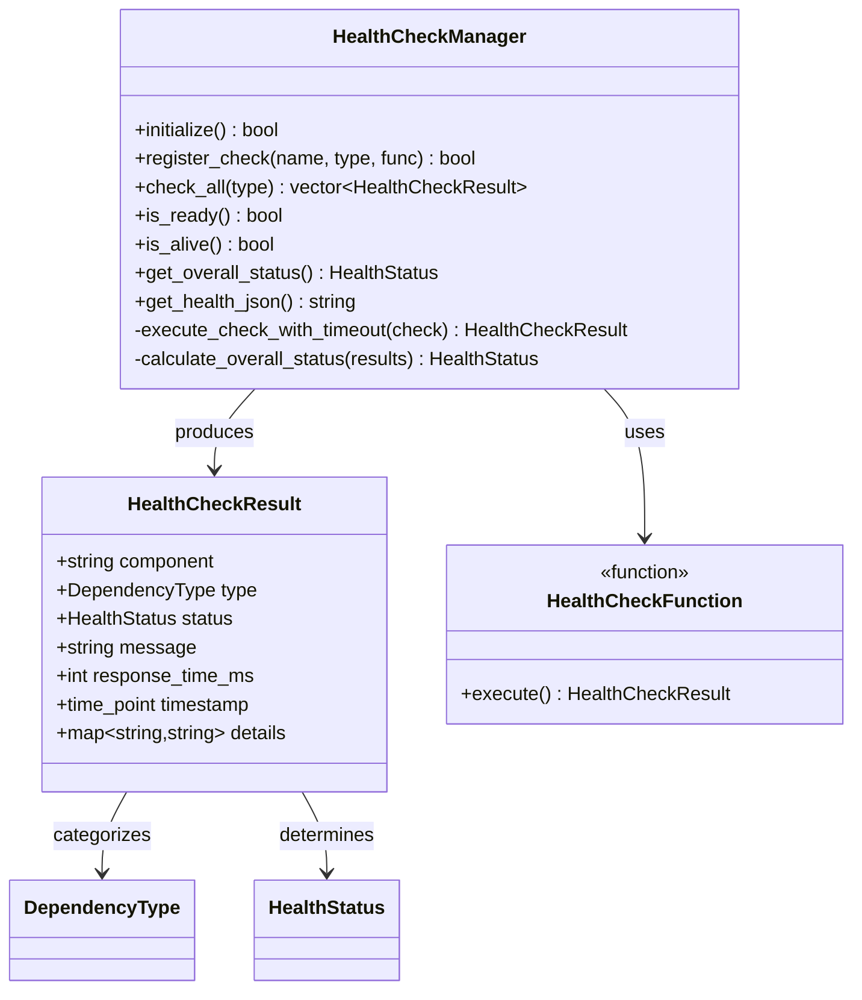
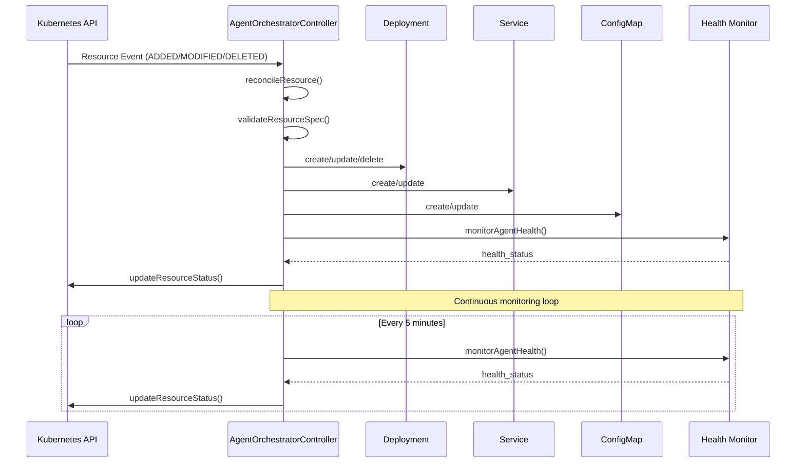
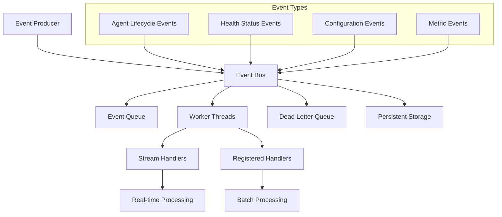
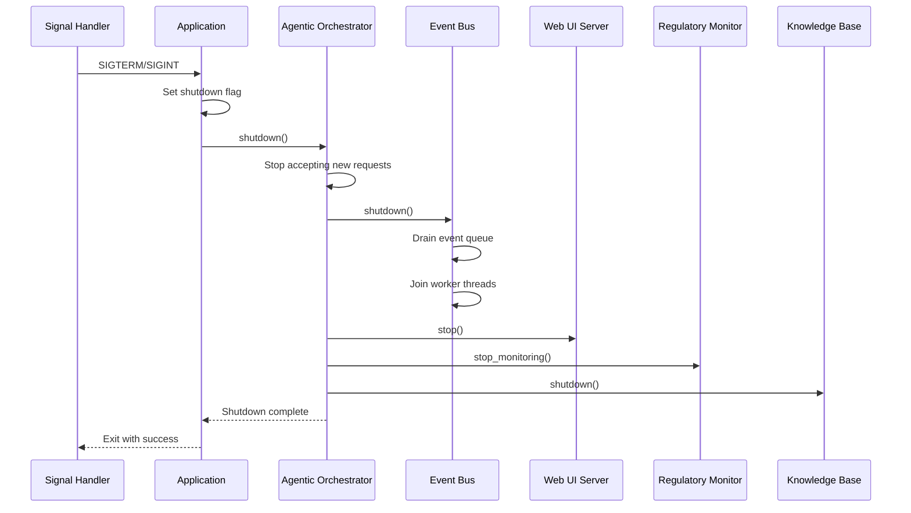
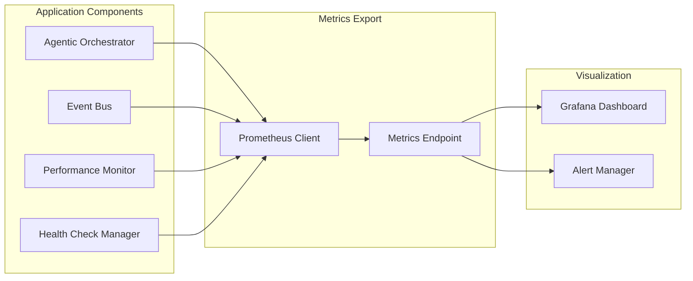

# Lifecycle Management

<cite>
**Referenced Files in This Document**
- [agentic_orchestrator.cpp](file://shared/agentic_brain/agentic_orchestrator.cpp)
- [agentic_orchestrator.hpp](file://shared/agentic_brain/agentic_orchestrator.hpp)
- [agent_orchestrator_controller.cpp](file://infrastructure/k8s/operator/agent_orchestrator_controller.cpp)
- [agent_orchestrator_controller.hpp](file://infrastructure/k8s/operator/agent_orchestrator_controller.hpp)
- [configuration_manager.cpp](file://shared/config/configuration_manager.cpp)
- [health_check_manager.hpp](file://shared/health/health_check_manager.hpp)
- [event_bus.cpp](file://shared/event_system/event_bus.cpp)
- [performance_monitor.hpp](file://shared/monitoring/performance_monitor.hpp)
- [main.cpp](file://main.cpp)
- [config_types.hpp](file://shared/config/config_types.hpp)
- [Dockerfile](file://Dockerfile)
- [system-overview.json](file://infrastructure/monitoring/grafana/dashboards/system-overview.json)
</cite>

## Table of Contents
1. [Introduction](#introduction)
2. [Architecture Overview](#architecture-overview)
3. [Agent Initialization Strategies](#agent-initialization-strategies)
4. [Configuration Management](#configuration-management)
5. [Health Monitoring System](#health-monitoring-system)
6. [Kubernetes Operator Integration](#kubernetes-operator-integration)
7. [Event Bus for Lifecycle Events](#event-bus-for-lifecycle-events)
8. [Graceful Shutdown Procedures](#graceful-shutdown-procedures)
9. [Monitoring and Observability](#monitoring-and-observability)
10. [Troubleshooting Guide](#troubleshooting-guide)
11. [Best Practices](#best-practices)

## Introduction

The Lifecycle Management feature in Regulens provides comprehensive orchestration and management of agent lifecycles within the agentic AI compliance system. This system ensures reliable, scalable, and observable operation of AI agents through sophisticated initialization, monitoring, and shutdown procedures.

The lifecycle management encompasses multiple layers:
- **Agent Initialization**: Configurable strategies for component initialization
- **Health Monitoring**: Real-time health status tracking and alerting
- **Resource Management**: Automatic scaling and resource optimization
- **Event Propagation**: Centralized event bus for lifecycle coordination
- **Graceful Shutdown**: Controlled termination with resource cleanup
- **Observability**: Comprehensive metrics and monitoring integration

## Architecture Overview

The lifecycle management system is built around the `AgenticOrchestrator` as the central coordinator, with support from Kubernetes operators, configuration managers, and monitoring systems.



**Diagram sources**
- [agentic_orchestrator.cpp](file://shared/agentic_brain/agentic_orchestrator.cpp#L1-L50)
- [agent_orchestrator_controller.cpp](file://infrastructure/k8s/operator/agent_orchestrator_controller.cpp#L1-L50)

## Agent Initialization Strategies

The system supports three distinct initialization strategies to accommodate different deployment scenarios and requirements.

### Initialization Strategy Types

```mermaid
flowchart TD
Start([Application Startup]) --> CheckStrategy{Check Init Strategy}
CheckStrategy --> |LAZY| LazyInit[Lazy Initialization<br/>On-Demand Component Creation]
CheckStrategy --> |EAGER| EagerInit[Eager Initialization<br/>Immediate Component Setup]
CheckStrategy --> |CUSTOM| CustomInit[Custom Initialization<br/>Manual Component Injection]
LazyInit --> LazyComponents[Components Created During<br/>initialize() Call]
EagerInit --> EagerComponents[Components Created<br/>in Constructor]
CustomInit --> CustomComponents[Components Provided<br/>by Caller]
LazyComponents --> Validate[Validate Dependencies]
EagerComponents --> Validate
CustomComponents --> Validate
Validate --> ValidationSuccess{Validation<br/>Successful?}
ValidationSuccess --> |Yes| Ready[Ready for Operations]
ValidationSuccess --> |No| FailFast{Fail Fast<br/>Enabled?}
FailFast --> |Yes| Abort[Abort Startup]
FailFast --> |No| Continue[Continue with Partial<br/>Initialization]
Continue --> Ready
Abort --> End([Startup Failed])
Ready --> End([Startup Complete])
```

**Diagram sources**
- [agentic_orchestrator.cpp](file://shared/agentic_brain/agentic_orchestrator.cpp#L100-L150)
- [agentic_orchestrator.hpp](file://shared/agentic_brain/agentic_orchestrator.hpp#L40-L80)

### Lazy Initialization (Default)

Lazy initialization defers component creation until the `initialize()` method is called, allowing for on-demand resource allocation and improved startup performance.

```cpp
// Example of lazy initialization configuration
OrchestratorConfig config;
config.init_strategy = ComponentInitStrategy::LAZY;
config.validate_dependencies = true;
config.initialization_timeout_seconds = 30;

AgenticOrchestrator orchestrator(db_pool, logger, config);
// Components not created until initialize() is called
```

### Eager Initialization

Eager initialization creates and validates all components immediately during construction, ensuring immediate availability but potentially increasing startup time.

```cpp
// Example of eager initialization
OrchestratorConfig config;
config.init_strategy = ComponentInitStrategy::EAGER;
config.fail_fast = true;

AgenticOrchestrator orchestrator(db_pool, logger, config);
// All components created and validated during construction
```

### Custom Initialization

Custom initialization allows external control over component creation and injection, ideal for testing and specialized deployment scenarios.

```cpp
// Example of custom initialization
AgenticOrchestrator orchestrator(
    db_pool,
    llm_interface,
    learning_engine,
    decision_engine,
    tool_registry,
    event_bus,
    logger
);
// All components provided by caller
```

**Section sources**
- [agentic_orchestrator.cpp](file://shared/agentic_brain/agentic_orchestrator.cpp#L100-L200)
- [agentic_orchestrator.hpp](file://shared/agentic_brain/agentic_orchestrator.hpp#L115-L143)

## Configuration Management

The configuration management system provides centralized, environment-variable-driven configuration with fallback defaults and runtime modification capabilities.

### Configuration Loading Process



**Diagram sources**
- [configuration_manager.cpp](file://shared/config/configuration_manager.cpp#L20-L80)

### Environment-Based Configuration

The system loads configuration from environment variables with comprehensive validation and error handling:

```cpp
// Example configuration loading
bool ConfigurationManager::load_from_environment() {
    // Database configuration
    load_env_var(config_keys::DB_HOST);
    load_env_var(config_keys::DB_PORT);
    load_env_var(config_keys::DB_NAME);
    load_env_var(config_keys::DB_USER);
    load_env_var(config_keys::DB_PASSWORD);
    
    // LLM Configuration
    load_env_var(config_keys::LLM_OPENAI_API_KEY);
    load_env_var(config_keys::LLM_ANTHROPIC_API_KEY);
    
    // Agent capabilities
    load_env_var(config_keys::AGENT_ENABLE_WEB_SEARCH);
    load_env_var(config_keys::AGENT_ENABLE_ADVANCED_DISCOVERY);
    
    return true;
}
```

### Agent Capability Configuration

Agent capabilities are controlled through environment variables for fine-grained feature management:

```cpp
struct AgentCapabilityConfig {
    bool enable_web_search = false;
    bool enable_mcp_tools = false;
    bool enable_advanced_discovery = false;
    bool enable_autonomous_integration = false;
    int max_autonomous_tools_per_session = 10;
    std::vector<std::string> allowed_tool_categories;
    std::vector<std::string> blocked_tool_domains;
};
```

**Section sources**
- [configuration_manager.cpp](file://shared/config/configuration_manager.cpp#L100-L200)
- [config_types.hpp](file://shared/config/config_types.hpp#L30-L45)

## Health Monitoring System

The health monitoring system provides comprehensive health checks for all system components, with Kubernetes-compatible endpoints and automatic service degradation detection.

### Health Check Architecture



**Diagram sources**
- [health_check_manager.hpp](file://shared/health/health_check_manager.hpp#L50-L150)

### Health Check Types

The system supports three types of health checks:

1. **Readiness Checks**: Determine if the service is ready to accept traffic
2. **Liveness Checks**: Verify the service is alive and responsive
3. **Startup Checks**: Confirm the service has started successfully

### Health Check Registration

```cpp
// Example health check registration
bool HealthCheckManager::register_check(
    const std::string& name,
    HealthCheckType type,
    HealthCheckFunction check_function,
    int timeout_ms = 5000
) {
    RegisteredCheck check = {
        name, type, check_function, timeout_ms, 0
    };
    registered_checks_[name] = check;
    return true;
}
```

### Kubernetes Integration

The health check system integrates seamlessly with Kubernetes through standardized endpoints:

```yaml
# Kubernetes readiness probe
readinessProbe:
  httpGet:
    path: /health/ready
    port: 8080
  initialDelaySeconds: 5
  periodSeconds: 10

# Kubernetes liveness probe  
livenessProbe:
  httpGet:
    path: /health/live
    port: 8080
  initialDelaySeconds: 30
  periodSeconds: 30
```

**Section sources**
- [health_check_manager.hpp](file://shared/health/health_check_manager.hpp#L80-L150)

## Kubernetes Operator Integration

The Kubernetes operator provides automated lifecycle management for AgentOrchestrator custom resources, including deployment management, scaling, and health monitoring.

### Operator Architecture



**Diagram sources**
- [agent_orchestrator_controller.cpp](file://infrastructure/k8s/operator/agent_orchestrator_controller.cpp#L70-L150)

### Resource Reconciliation

The operator continuously monitors AgentOrchestrator resources and ensures desired state:

```cpp
nlohmann::json AgentOrchestratorController::reconcileResource(const nlohmann::json& resource) {
    std::string orchestrator_name = resource["metadata"]["name"];
    const auto& spec = resource["spec"];
    
    // Validate spec
    auto validation_errors = validateResourceSpec(spec);
    if (!validation_errors.empty()) {
        return updateResourceStatus("failed", validation_errors[0]);
    }
    
    // Check if orchestrator exists
    bool exists = active_orchestrators_.find(orchestrator_name) != active_orchestrators_.end();
    
    if (!exists) {
        // Create new orchestrator
        if (createAgentDeployments(orchestrator_name, spec) &&
            createAgentServices(orchestrator_name, spec) &&
            createAgentConfigMaps(orchestrator_name, spec)) {
            
            active_orchestrators_[orchestrator_name] = resource;
            return updateResourceStatus("running", "Orchestrator created successfully");
        }
    } else {
        // Update existing orchestrator
        if (updateAgentDeployments(orchestrator_name, spec)) {
            return updateResourceStatus("running", "Orchestrator updated successfully");
        }
    }
    
    return resource;
}
```

### Adaptive Scaling

The operator implements intelligent scaling based on load metrics:

```cpp
int AgentOrchestratorController::calculateOptimalReplicas(
    const std::string& agent_type,
    int current_replicas,
    const nlohmann::json& load_metrics
) {
    double cpu_usage = load_metrics.value("cpu_usage", 0.5);
    double memory_usage = load_metrics.value("memory_usage", 0.5);
    int queue_depth = load_metrics.value("queue_depth", 10);
    
    double avg_load = (cpu_usage + memory_usage) / 2.0;
    
    if (avg_load > 0.8 || queue_depth > 50) {
        // Scale up
        return std::min(current_replicas + 1, 10);
    } else if (avg_load < 0.3 && queue_depth < 5 && current_replicas > 1) {
        // Scale down
        return current_replicas - 1;
    }
    
    return current_replicas;
}
```

**Section sources**
- [agent_orchestrator_controller.cpp](file://infrastructure/k8s/operator/agent_orchestrator_controller.cpp#L70-L200)

## Event Bus for Lifecycle Events

The Event Bus serves as the central nervous system for lifecycle event propagation, enabling coordinated state changes and cross-component communication.

### Event Processing Architecture



**Diagram sources**
- [event_bus.cpp](file://shared/event_system/event_bus.cpp#L100-L200)

### Event Publishing and Routing

The Event Bus handles event publishing with automatic routing to appropriate handlers:

```cpp
bool EventBus::publish(std::unique_ptr<Event> event) {
    if (!running_.load()) {
        logger_->log(LogLevel::WARN, "Event Bus is not running, cannot publish event");
        return false;
    }
    
    if (!event) {
        logger_->log(LogLevel::WARN, "Cannot publish null event");
        return false;
    }
    
    // Set event state to published
    event->set_state(EventState::PUBLISHED);
    
    // Add to queue
    {
        std::unique_lock<std::mutex> lock(queue_mutex_);
        
        // Check queue size limit
        if (event_queue_.size() >= max_queue_size_) {
            logger_->log(LogLevel::WARN, "Event queue full, dropping event: " + event->get_event_id());
            events_failed_++;
            return false;
        }
        
        event_queue_.push(std::move(event));
        events_published_++;
    }
    
    // Notify worker threads
    queue_cv_.notify_one();
    
    return true;
}
```

### Event Handler Registration

Components can register to receive specific event types:

```cpp
bool EventBus::subscribe(
    std::shared_ptr<EventHandler> handler,
    std::unique_ptr<EventFilter> filter
) {
    if (!handler) {
        logger_->log(LogLevel::WARN, "Cannot subscribe with null handler");
        return false;
    }
    
    std::string handler_id = handler->get_handler_id();
    
    {
        std::lock_guard<std::mutex> lock(handlers_mutex_);
        
        if (handlers_.find(handler_id) != handlers_.end()) {
            logger_->log(LogLevel::WARN, "Handler already subscribed: " + handler_id);
            return false;
        }
        
        handlers_[handler_id] = std::make_pair(handler, std::move(filter));
    }
    
    logger_->log(LogLevel::INFO, "Subscribed event handler: " + handler_id);
    return true;
}
```

**Section sources**
- [event_bus.cpp](file://shared/event_system/event_bus.cpp#L150-L250)

## Graceful Shutdown Procedures

The system implements comprehensive graceful shutdown procedures to ensure clean termination and resource cleanup.

### Shutdown Sequence



**Diagram sources**
- [main.cpp](file://main.cpp#L30-L50)

### Signal Handling Implementation

```cpp
// Signal handler for graceful shutdown
void signal_handler(int signal) {
    StructuredLogger::get_instance().info("Received shutdown signal: {}", std::to_string(signal));
    g_shutdown_requested = true;
}

// Main application loop with proper error handling
int RegulensApplication::run() {
    try {
        while (!g_shutdown_requested) {
            // Process pending system events and maintenance tasks
            process_pending_events();
            
            // Prevent busy waiting
            std::this_thread::sleep_for(std::chrono::milliseconds(100));
        }
        
        logger_.info("Shutdown requested, terminating gracefully");
        return EXIT_SUCCESS;
        
    } catch (const std::exception& e) {
        logger_.error("Critical error in main application loop: {}", e.what());
        return EXIT_FAILURE;
    }
}
```

### Component Cleanup

Each component implements proper cleanup procedures:

```cpp
void AgenticOrchestrator::shutdown() {
    if (!running_.load()) {
        return;
    }
    
    logger_->log(LogLevel::INFO, "Shutting down Agentic Orchestrator");
    
    running_ = false;
    
    // Clean up active tools
    {
        std::lock_guard<std::mutex> lock(tool_mutex_);
        for (auto& [tool_id, tool] : active_tools_) {
            if (tool) {
                tool->disconnect();
            }
        }
        active_tools_.clear();
    }
    
    // Shutdown components
    if (learning_engine_) {
        learning_engine_->shutdown();
    }
    
    initialized_ = false;
    logger_->log(LogLevel::INFO, "Agentic Orchestrator shutdown complete");
}
```

**Section sources**
- [main.cpp](file://main.cpp#L30-L100)
- [agentic_orchestrator.cpp](file://shared/agentic_brain/agentic_orchestrator.cpp#L180-L220)

## Monitoring and Observability

The system provides comprehensive monitoring and observability through Prometheus metrics, Grafana dashboards, and distributed tracing.

### Prometheus Metrics Collection



### Key Metrics Tracked

The system tracks various metrics for observability:

```cpp
// Example metrics collection
nlohmann::json getMetrics() const {
    auto base_metrics = CustomResourceController::getMetrics();
    
    base_metrics["orchestrator_metrics"] = {
        {"orchestrators_created_total", orchestrators_created_.load()},
        {"orchestrators_updated_total", orchestrators_updated_.load()},
        {"orchestrators_deleted_total", orchestrators_deleted_.load()},
        {"agents_deployed_total", agents_deployed_.load()},
        {"scaling_operations_total", scaling_operations_.load()},
        {"active_orchestrators", active_orchestrators_.size()}
    };
    
    return base_metrics;
}
```

### Grafana Dashboard Integration

The system includes comprehensive Grafana dashboards for monitoring:

- **System Overview**: Overall system health and performance
- **Compliance Operations**: Regulatory compliance monitoring metrics
- **LLM Performance**: Large language model usage and response times
- **Redis Cache Performance**: Cache hit rates and latency
- **Kubernetes Operators**: Operator-specific metrics and health

### Performance Monitoring

The Performance Monitor tracks query performance and API response times:

```cpp
struct PerformanceMetric {
    std::string metric_id;
    MetricType type;
    std::string operation;
    std::chrono::system_clock::time_point timestamp;
    int duration_ms;
    bool success;
    std::string error_message;
    std::map<std::string, std::string> metadata;
    PerformanceLevel level;
};
```

**Section sources**
- [agent_orchestrator_controller.cpp](file://infrastructure/k8s/operator/agent_orchestrator_controller.cpp#L70-L90)
- [system-overview.json](file://infrastructure/monitoring/grafana/dashboards/system-overview.json#L1-L50)

## Troubleshooting Guide

Common issues and their solutions for lifecycle management problems.

### Initialization Failures

**Problem**: Agent initialization fails during startup
**Symptoms**: 
- Application exits with initialization error
- Health check failures
- Component creation exceptions

**Solutions**:
1. Check database connectivity
2. Verify environment variables are set correctly
3. Review component dependencies
4. Enable debug logging for detailed error information

```bash
# Check environment variables
echo $ORCHESTRATOR_INIT_STRATEGY
echo $DB_HOST
echo $OPENAI_API_KEY

# Verify database connection
psql "host=$DB_HOST port=$DB_PORT dbname=$DB_NAME user=$DB_USER password=$DB_PASSWORD"
```

### Unresponsive Agents

**Problem**: Agents become unresponsive or hang
**Symptoms**:
- High CPU/memory usage
- Slow response times
- Event queue backlog
- Health check timeouts

**Solutions**:
1. Check for resource constraints
2. Review event processing bottlenecks
3. Monitor component health
4. Restart problematic components

```bash
# Check resource usage
docker stats regulens-container

# Monitor event queue
kubectl exec -it regulens-pod -- curl http://localhost:8080/api/events/stats

# Check component health
kubectl exec -it regulens-pod -- curl http://localhost:8080/health
```

### Resource Leaks

**Problem**: Memory or connection leaks over time
**Symptoms**:
- Gradual memory increase
- Database connection exhaustion
- Tool registry growth
- Performance degradation

**Solutions**:
1. Implement proper resource cleanup
2. Monitor resource usage trends
3. Set appropriate timeouts
4. Review connection pooling

```cpp
// Proper resource cleanup example
void AgenticOrchestrator::shutdown() {
    // Clean up active tools
    {
        std::lock_guard<std::mutex> lock(tool_mutex_);
        for (auto& [tool_id, tool] : active_tools_) {
            if (tool) {
                tool->disconnect();  // Important: disconnect resources
            }
        }
        active_tools_.clear();
    }
    
    // Clean up connections
    if (db_pool_) {
        db_pool_->cleanup();
    }
}
```

### Configuration Issues

**Problem**: Configuration not loading or applying correctly
**Symptoms**:
- Default values being used
- Environment variable precedence issues
- Runtime configuration updates failing

**Solutions**:
1. Verify environment variable names
2. Check configuration validation
3. Review configuration precedence
4. Test configuration loading manually

```bash
# Test configuration loading
export ORCHESTRATOR_INIT_STRATEGY=EAGER
export ORCHESTRATOR_ENABLE_LLM=true
export OPENAI_API_KEY=your-api-key-here

# Restart application to apply changes
docker restart regulens-container
```

## Best Practices

### Production Deployment Guidelines

1. **Use Eager Initialization**: For production environments, use eager initialization to ensure immediate availability and detect configuration issues early.

```cpp
OrchestratorConfig config;
config.init_strategy = ComponentInitStrategy::EAGER;
config.fail_fast = true;
config.validate_dependencies = true;
```

2. **Enable Health Checks**: Implement comprehensive health checks for all components.

```cpp
// Register health checks
health_manager.register_check("database", HealthCheckType::LIVENESS, 
    []() { return HealthCheckManager::check_database(db_config.connection_string); });
health_manager.register_check("redis", HealthCheckType::LIVENESS,
    []() { return HealthCheckManager::check_redis(redis_host, redis_port); });
```

3. **Configure Monitoring**: Set up comprehensive monitoring and alerting.

```yaml
# Prometheus configuration
scrape_configs:
  - job_name: 'regulens'
    static_configs:
      - targets: ['localhost:8080']
    metrics_path: '/metrics'
    scrape_interval: 30s
```

4. **Implement Graceful Shutdown**: Ensure proper resource cleanup on shutdown.

```cpp
// Signal handler implementation
void signal_handler(int signal) {
    StructuredLogger::get_instance().info("Received shutdown signal: {}", std::to_string(signal));
    g_shutdown_requested = true;
}
```

### Development Best Practices

1. **Use Lazy Initialization**: For development and testing, use lazy initialization to speed up startup.

2. **Enable Debug Logging**: Increase logging verbosity for troubleshooting.

```cpp
// Configuration for development
OrchestratorConfig config;
config.init_strategy = ComponentInitStrategy::LAZY;
config.validate_dependencies = false;  // Skip validation for faster development
```

3. **Test Configuration Changes**: Validate configuration changes before deploying.

```bash
# Test configuration changes
export AGENT_ENABLE_WEB_SEARCH=true
export AGENT_MAX_AUTONOMOUS_TOOLS=20

# Restart with new configuration
docker-compose up -d --no-deps --build regulens
```

4. **Monitor Performance**: Track performance metrics during development.

```cpp
// Performance monitoring
PerformanceMonitor perf_monitor;
perf_monitor.track_query("SELECT * FROM agents", 150, 100, true);
perf_monitor.track_api_request("/api/agents", "GET", 200, 250);
```

### Security Considerations

1. **Environment Variable Protection**: Never log sensitive environment variables.

2. **Resource Limits**: Set appropriate resource limits in Kubernetes.

```yaml
resources:
  limits:
    cpu: 500m
    memory: 1Gi
  requests:
    cpu: 100m
    memory: 256Mi
```

3. **Health Check Security**: Secure health check endpoints.

```cpp
// Secure health check implementation
bool is_healthy() {
    // Check critical components
    if (!db_pool_ || !db_pool_->is_connected()) return false;
    if (!event_bus_ || !event_bus_->is_running()) return false;
    
    return true;
}
```