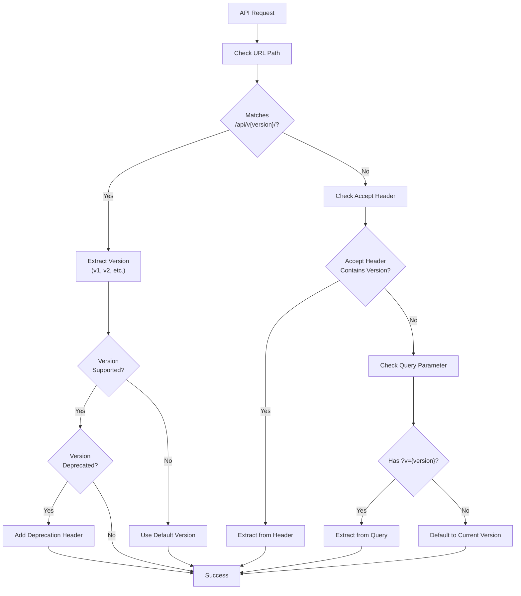
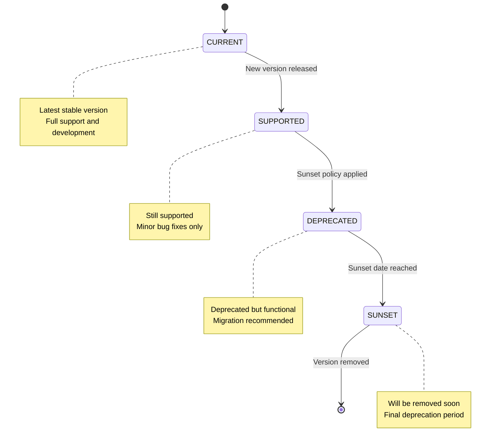
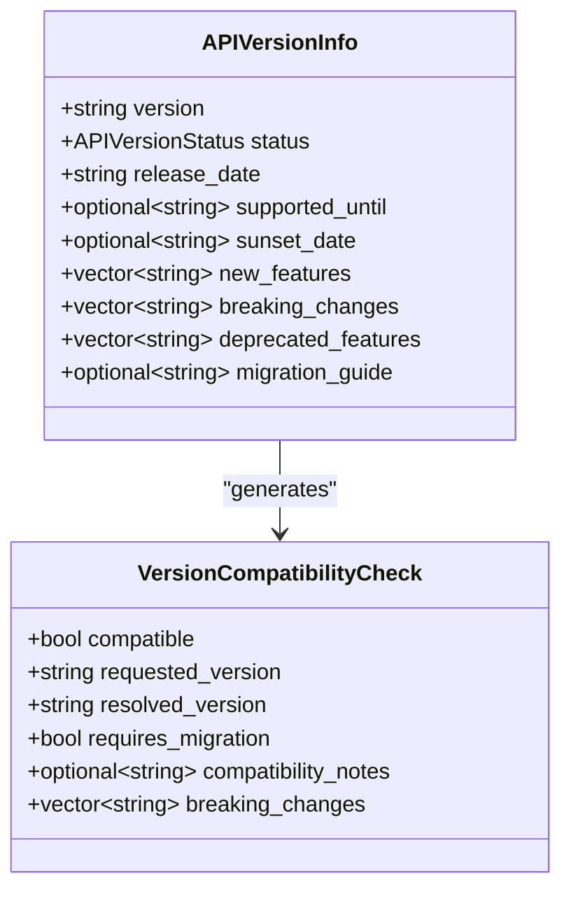
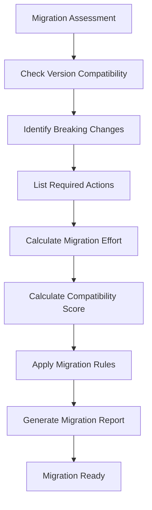
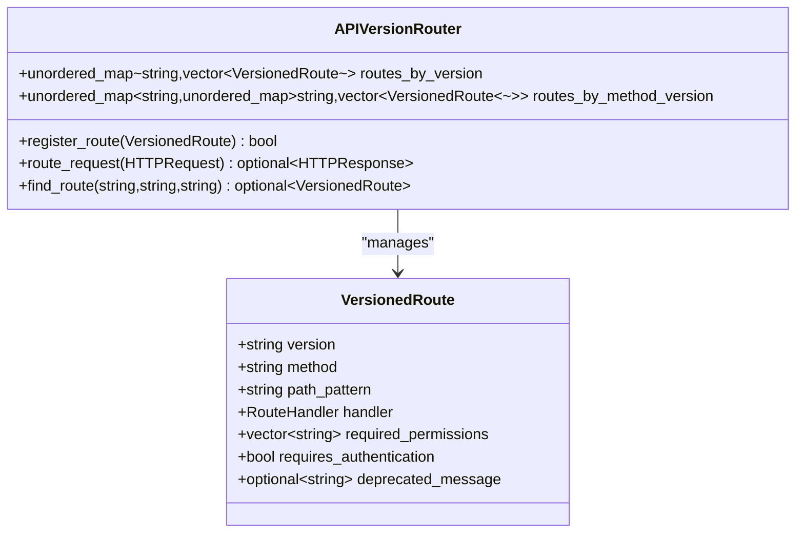
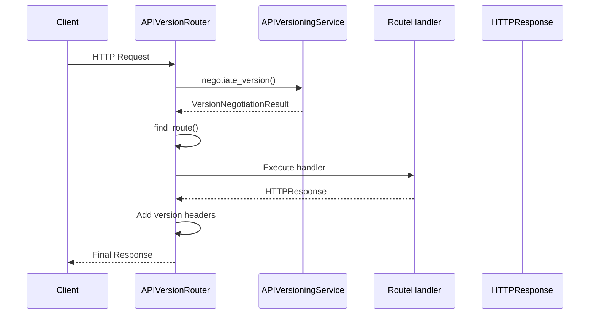
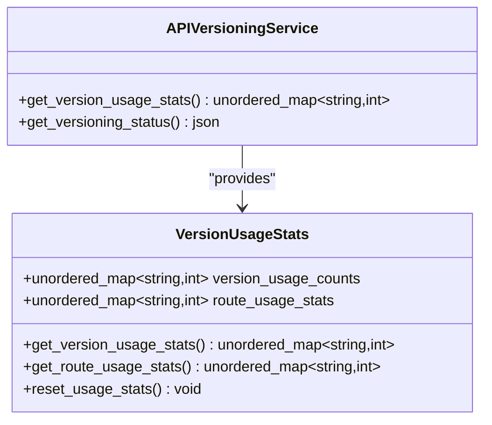

# API Versioning

<cite>
**Referenced Files in This Document**
- [api_versioning_service.cpp](file://shared/api_config/api_versioning_service.cpp)
- [api_versioning_service.hpp](file://shared/api_config/api_versioning_service.hpp)
- [api_version_router.cpp](file://shared/api_config/api_version_router.cpp)
- [api_version_router.hpp](file://shared/api_config/api_version_router.hpp)
- [api_versioning_config.json](file://shared/api_config/api_versioning_config.json)
- [api_migration_helper.cpp](file://shared/api_config/api_migration_helper.cpp)
- [api_migration_strategy.json](file://shared/api_config/api_migration_strategy.json)
- [api_endpoint_config.cpp](file://shared/api_config/api_endpoint_config.cpp)
- [api_registry.cpp](file://shared/api_registry/api_registry.cpp)
- [api_endpoint_registrations.cpp](file://shared/api_registry/api_endpoint_registrations.cpp)
- [http_method_validator.cpp](file://shared/api_config/http_method_validator.cpp)
</cite>

## Table of Contents
1. [Introduction](#introduction)
2. [Version Negotiation Methods](#version-negotiation-methods)
3. [Version Lifecycle Management](#version-lifecycle-management)
4. [Compatibility Matrix](#compatibility-matrix)
5. [Migration Guide System](#migration-guide-system)
6. [Version-Specific Routing](#version-specific-routing)
7. [Monitoring and Analytics](#monitoring-and-analytics)
8. [Best Practices](#best-practices)
9. [Troubleshooting](#troubleshooting)
10. [Conclusion](#conclusion)

## Introduction

The Regulens API Versioning system provides a comprehensive solution for managing API evolution while maintaining backward compatibility and smooth transitions for clients. This system supports three primary version negotiation methods, robust lifecycle management, and automated migration assistance to ensure seamless API upgrades.

The system is designed to handle the complexities of API versioning in a production environment, providing graceful fallback mechanisms, detailed deprecation warnings, and comprehensive monitoring capabilities. It serves as the foundation for the Regulens AI Compliance System's API infrastructure, supporting multiple concurrent versions with automatic compatibility layering.

## Version Negotiation Methods

The API versioning system supports three distinct methods for negotiating API versions, each with specific use cases and advantages:

### URL Path Method

The URL path method is the primary version negotiation strategy, embedding version information directly in the request URL path.



**Diagram sources**
- [api_versioning_service.cpp](file://shared/api_config/api_versioning_service.cpp#L178-L214)

**Section sources**
- [api_versioning_service.cpp](file://shared/api_config/api_versioning_service.cpp#L178-L214)
- [api_versioning_config.json](file://shared/api_config/api_versioning_config.json#L25-L45)

### Accept Header Method

The Accept header method allows clients to specify the desired API version through the HTTP Accept header, following the standard media type format.

```cpp
// Example Accept header patterns
application/vnd.regulens.v1+json
application/vnd.regulens.v2+json
```

The system recognizes the pattern `application/vnd.regulens.{version}+json` and extracts the version number from the header. This method is particularly useful for content negotiation and RESTful API design.

**Section sources**
- [api_versioning_service.cpp](file://shared/api_config/api_versioning_service.cpp#L216-L245)

### Query Parameter Method

The query parameter method provides flexibility by allowing version specification through URL query parameters.

```cpp
// Example query parameter usage
GET /api/transactions?v=1
GET /api/users?page=1&v=2
```

This method is especially valuable for testing and gradual migration scenarios, though it has limitations around caching and SEO optimization.

**Section sources**
- [api_versioning_service.cpp](file://shared/api_config/api_versioning_service.cpp#L247-L270)

## Version Lifecycle Management

The API versioning system implements a comprehensive lifecycle management framework with four distinct status levels:

### Status Definitions



**Diagram sources**
- [api_versioning_service.hpp](file://shared/api_config/api_versioning_service.hpp#L18-L24)

### Version Status Types

**CURRENT**: The latest stable version receiving full support, new features, and ongoing development. This is the default version used when no version is specified.

**SUPPORTED**: Previously current versions that remain functional but receive only critical bug fixes and security updates. These versions maintain backward compatibility but don't receive new features.

**DEPRECATED**: Versions that have been marked for eventual removal. Clients are strongly encouraged to migrate to newer versions, and deprecation warnings are automatically included in responses.

**SUNSET**: Versions approaching final removal. These versions have sunset dates calculated based on deprecation policies and receive minimal support.

**Section sources**
- [api_versioning_service.cpp](file://shared/api_config/api_versioning_service.cpp#L65-L95)
- [api_versioning_config.json](file://shared/api_config/api_versioning_config.json#L10-L30)

## Compatibility Matrix

The compatibility matrix defines relationships between API versions and ensures predictable behavior across version transitions:

### Matrix Structure



**Diagram sources**
- [api_versioning_service.hpp](file://shared/api_config/api_versioning_service.hpp#L30-L45)

### Compatibility Rules

The system enforces strict compatibility rules:

- **Same Version**: Full compatibility (score = 1.0)
- **Minor Version Upgrade**: Backward compatible with migration tools
- **Major Version Upgrade**: May require significant client changes
- **Unsupported Version**: Automatic fallback to default version

**Section sources**
- [api_versioning_service.cpp](file://shared/api_config/api_versioning_service.cpp#L155-L177)

## Migration Guide System

The migration guide system provides comprehensive assistance for transitioning between API versions:

### Migration Assessment



**Diagram sources**
- [api_migration_helper.cpp](file://shared/api_config/api_migration_helper.cpp#L80-L120)

### Migration Tools

The system provides several migration tools:

**Automatic Transformation**: Converts response formats between versions automatically.

**Parameter Mapping**: Maps old parameter names to new ones (e.g., `page` → `offset`, `per_page` → `limit`).

**Compatibility Headers**: Adds deprecation warnings and migration guidance to responses.

**Section sources**
- [api_migration_helper.cpp](file://shared/api_config/api_migration_helper.cpp#L120-L180)

### Breaking Changes Tracking

The system tracks breaking changes comprehensively:

```cpp
// Example breaking changes for v1 to v2 migration
{
    "category": "response_format",
    "description": "Unified JSON response format with consistent structure",
    "impact": "All endpoints return data under 'data' key with metadata",
    "migration_path": "Update client code to access response.data instead of direct response"
}
```

**Section sources**
- [api_migration_strategy.json](file://shared/api_config/api_migration_strategy.json#L15-L50)

## Version-Specific Routing

The version-specific routing system ensures requests are directed to the appropriate version handlers:

### Route Registration



**Diagram sources**
- [api_version_router.hpp](file://shared/api_config/api_version_router.hpp#L20-L30)
- [api_version_router.cpp](file://shared/api_config/api_version_router.cpp#L25-L50)

### Request Processing Flow



**Diagram sources**
- [api_version_router.cpp](file://shared/api_config/api_version_router.cpp#L55-L125)

### Graceful Fallback Mechanism

The system implements intelligent fallback mechanisms:

1. **Primary Method**: URL path negotiation
2. **Secondary Method**: Accept header negotiation  
3. **Tertiary Method**: Query parameter negotiation
4. **Default Method**: Use current version if no negotiation succeeds

**Section sources**
- [api_version_router.cpp](file://shared/api_config/api_version_router.cpp#L55-L125)

## Monitoring and Analytics

The monitoring system tracks version usage and provides insights for API management:

### Usage Statistics



**Diagram sources**
- [api_versioning_service.cpp](file://shared/api_config/api_versioning_service.cpp#L530-L540)

### Delegation Warnings

The system automatically includes deprecation warnings in responses for deprecated versions:

```cpp
// Example deprecation header
X-API-Deprecation-Warning: API version v1 is deprecated. Please migrate to v2.
X-API-Sunset-Date: Wed, 21 Oct 2025 07:28:00 GMT
```

**Section sources**
- [api_versioning_service.cpp](file://shared/api_config/api_versioning_service.cpp#L450-L480)

## Best Practices

### For API Consumers

1. **Specify Version Explicitly**: Always include version information in requests
2. **Monitor Deprecation Warnings**: Pay attention to `X-API-Deprecation-Warning` headers
3. **Plan Migrations Early**: Use migration guides to prepare for version upgrades
4. **Test Thoroughly**: Validate API responses after version changes

### For API Providers

1. **Follow Semantic Versioning**: Use major.minor.patch versioning consistently
2. **Provide Clear Documentation**: Document breaking changes and migration paths
3. **Use Gradual Rollouts**: Deploy new versions gradually to minimize risk
4. **Monitor Usage Patterns**: Track which versions are most commonly used

### Example Usage Patterns

```bash
# URL Path Method (Primary)
curl -H "Authorization: Bearer token" \
     https://api.regulens.com/api/v1/transactions

# Accept Header Method  
curl -H "Accept: application/vnd.regulens.v2+json" \
     -H "Authorization: Bearer token" \
     https://api.regulens.com/api/transactions

# Query Parameter Method  
curl -H "Authorization: Bearer token" \
     "https://api.regulens.com/api/transactions?v=2"
```

## Troubleshooting

### Common Issues

**Version Not Found**: When a requested version isn't supported, the system falls back to the default version with a warning message.

**Deprecation Warnings**: Deprecated versions include helpful migration guidance in response headers.

**Compatibility Issues**: The system provides automatic compatibility transformations for common breaking changes.

### Debugging Tips

1. **Check Response Headers**: Look for `X-API-Version` and deprecation headers
2. **Verify Version Negotiation**: Ensure your request includes proper version information
3. **Review Migration Guides**: Consult migration documentation for breaking changes
4. **Monitor Usage Statistics**: Use monitoring tools to track version adoption

**Section sources**
- [api_version_router.cpp](file://shared/api_config/api_version_router.cpp#L233-L272)

## Conclusion

The Regulens API Versioning system provides a robust, production-ready solution for managing API evolution. With support for multiple negotiation methods, comprehensive lifecycle management, and automated migration assistance, it enables organizations to evolve their APIs safely and efficiently while maintaining backward compatibility and providing excellent developer experience.

The system's design emphasizes reliability, transparency, and ease of use, making it suitable for large-scale deployments with diverse client bases. By following the documented best practices and utilizing the provided tools, teams can successfully manage API versioning throughout their development lifecycle.