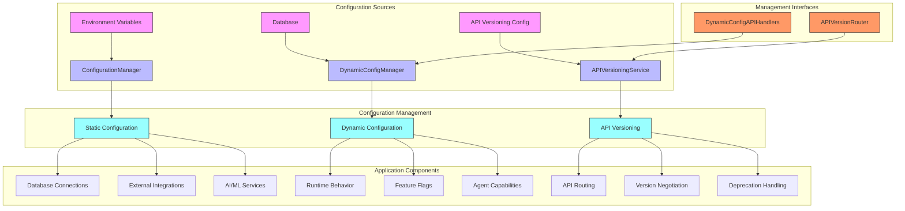
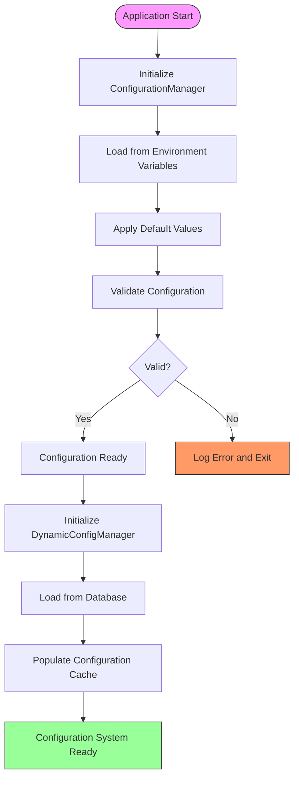
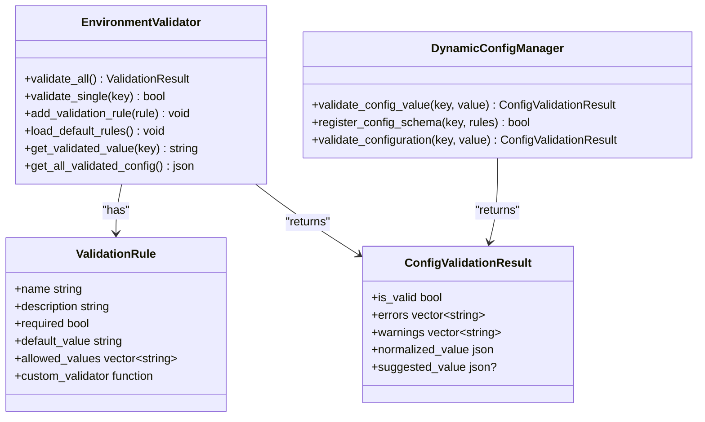
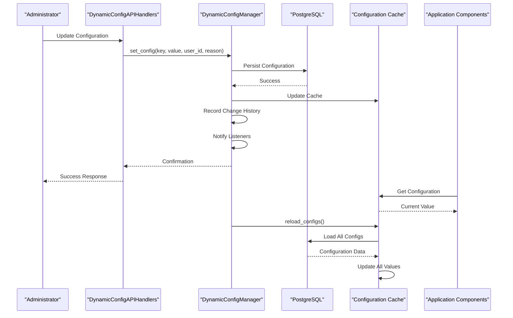
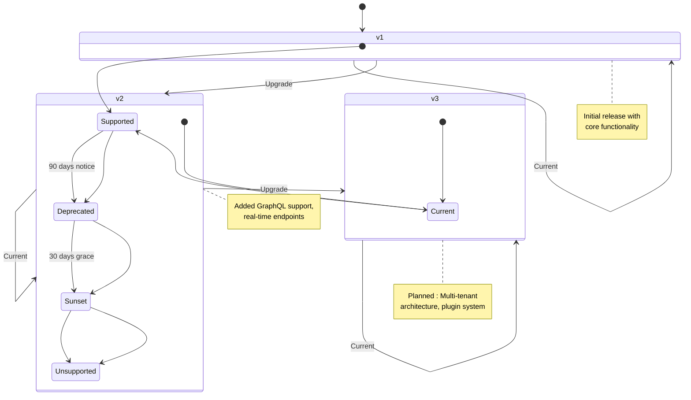
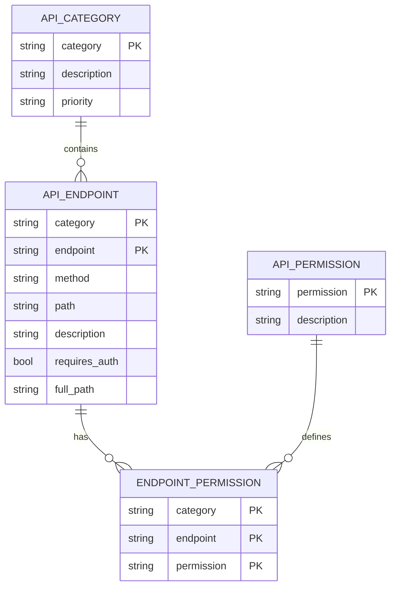
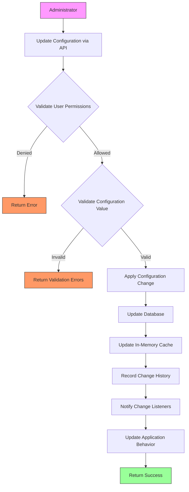
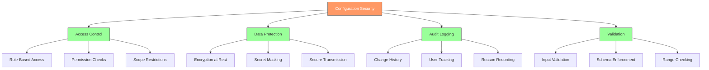
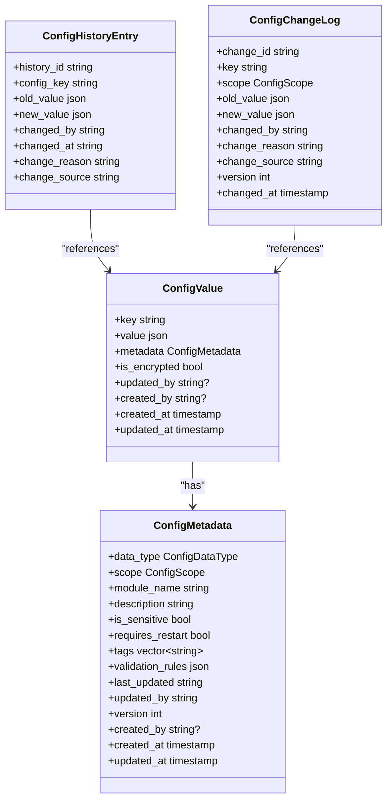

# Configuration Management

<cite>
**Referenced Files in This Document**   
- [configuration_manager.hpp](file://shared/config/configuration_manager.hpp)
- [configuration_manager.cpp](file://shared/config/configuration_manager.cpp)
- [dynamic_config_manager.hpp](file://shared/config/dynamic_config_manager.hpp)
- [dynamic_config_manager.cpp](file://shared/config/dynamic_config_manager.cpp)
- [dynamic_config_api_handlers.hpp](file://shared/config/dynamic_config_api_handlers.hpp)
- [environment_validator.hpp](file://shared/config/environment_validator.hpp)
- [environment_validator.cpp](file://shared/config/environment_validator.cpp)
- [api_versioning_service.hpp](file://shared/api_config/api_versioning_service.hpp)
- [api_versioning_service.cpp](file://shared/api_config/api_versioning_service.cpp)
- [api_version_router.hpp](file://shared/api_config/api_version_router.hpp)
- [api_version_router.cpp](file://shared/api_config/api_version_router.cpp)
- [api_versioning_config.json](file://shared/api_config/api_versioning_config.json)
- [api_endpoints_config.json](file://shared/api_config/api_endpoints_config.json)
- [config_types.hpp](file://shared/config/config_types.hpp)
</cite>

## Table of Contents
1. [Introduction](#introduction)
2. [Configuration System Architecture](#configuration-system-architecture)
3. [Configuration Loading Process](#configuration-loading-process)
4. [Validation Mechanisms](#validation-mechanisms)
5. [Dynamic Configuration and Hot-Reload](#dynamic-configuration-and-hot-reload)
6. [API Versioning Strategy](#api-versioning-strategy)
7. [Endpoint Routing Configuration](#endpoint-routing-configuration)
8. [Runtime Configuration Modification Workflow](#runtime-configuration-modification-workflow)
9. [Security Considerations](#security-considerations)
10. [Change Auditing](#change-auditing)
11. [Best Practices for Environment Management](#best-practices-for-environment-management)
12. [Conclusion](#conclusion)

## Introduction

The Regulens platform features a comprehensive configuration management system designed for cloud-native deployment and operational excellence. This system provides a robust framework for managing application settings across different environments while ensuring security, reliability, and flexibility. The architecture combines static configuration loading with dynamic runtime configuration capabilities, allowing system behavior modification without requiring service restarts.

The configuration system is built around several core principles: environment-specific settings, secure secret management, validation at multiple levels, and comprehensive auditing. It supports both traditional environment variable-based configuration for cloud deployment and a sophisticated database-driven dynamic configuration system for runtime adjustments. The system also integrates with API versioning to ensure backward compatibility and smooth transitions between API versions.

This documentation provides a detailed overview of the configuration management architecture, covering the loading process, validation mechanisms, hot-reload capabilities, API versioning strategy, security considerations, and best practices for managing configuration across different deployment stages.

**Section sources**
- [configuration_manager.hpp](file://shared/config/configuration_manager.hpp)
- [dynamic_config_manager.hpp](file://shared/config/dynamic_config_manager.hpp)
- [api_versioning_service.hpp](file://shared/api_config/api_versioning_service.hpp)

## Configuration System Architecture

The configuration management system in Regulens follows a layered architecture that combines multiple configuration sources and management approaches. The system is designed with separation of concerns, dividing responsibilities between static configuration loading, dynamic configuration management, and API versioning.

**Diagram sources**
- [configuration_manager.hpp](file://shared/config/configuration_manager.hpp)
- [dynamic_config_manager.hpp](file://shared/config/dynamic_config_manager.hpp)
- [api_versioning_service.hpp](file://shared/api_config/api_versioning_service.hpp)

The architecture consists of three main components:

1. **ConfigurationManager**: Handles static configuration loading from environment variables with type-safe access and validation. This component follows the 12-factor app methodology, using environment variables as the primary configuration source for cloud deployment.

2. **DynamicConfigManager**: Provides database-backed dynamic configuration with hot-reload capabilities. This allows runtime modification of system behavior without restarts, with comprehensive change tracking and auditing.

3. **APIVersioningService**: Manages API versioning strategy, including version negotiation, routing, and deprecation handling. This ensures backward compatibility and smooth transitions between API versions.

These components work together to provide a comprehensive configuration management solution that supports both deployment-time configuration and runtime adjustments.

**Section sources**
- [configuration_manager.hpp](file://shared/config/configuration_manager.hpp)
- [dynamic_config_manager.hpp](file://shared/config/dynamic_config_manager.hpp)
- [api_versioning_service.hpp](file://shared/api_config/api_versioning_service.hpp)

## Configuration Loading Process

The configuration loading process in Regulens follows a well-defined sequence that prioritizes environment variables as the primary source of configuration, in accordance with cloud-native best practices. The process begins with the ConfigurationManager, which is implemented as a singleton to ensure consistent access to configuration values throughout the application.

**Diagram sources**
- [configuration_manager.cpp](file://shared/config/configuration_manager.cpp)
- [dynamic_config_manager.cpp](file://shared/config/dynamic_config_manager.cpp)

The loading process follows these steps:

1. **Environment Variable Loading**: The system first loads configuration from environment variables, which are the primary configuration source for cloud deployment. This approach ensures that configuration is separate from code and can be easily modified without rebuilding the application.

2. **Default Value Application**: After loading environment variables, the system applies default values for any missing configuration options. However, critical settings like database host are required and have no defaults to prevent accidental deployment to localhost in production.

3. **Configuration Validation**: The loaded configuration undergoes validation to ensure all required fields are present and values are within acceptable ranges. This prevents the application from starting with invalid configuration.

4. **Dynamic Configuration Loading**: Once static configuration is established, the DynamicConfigManager loads runtime configuration from the database, populating an in-memory cache for fast access.

5. **System Readiness**: After both static and dynamic configuration are loaded, the configuration system is ready for use by other components.

The ConfigurationManager provides type-safe access methods (get_string, get_int, get_bool, get_double) that handle type conversion and return optional values, allowing components to gracefully handle missing configuration.

**Section sources**
- [configuration_manager.cpp](file://shared/config/configuration_manager.cpp)
- [configuration_manager.hpp](file://shared/config/configuration_manager.hpp)

## Validation Mechanisms

The configuration system implements multiple layers of validation to ensure configuration integrity and prevent invalid settings from being applied. These validation mechanisms operate at different levels: environment variable validation, configuration value validation, and dynamic configuration schema validation.

**Diagram sources**
- [environment_validator.hpp](file://shared/config/environment_validator.hpp)
- [dynamic_config_manager.hpp](file://shared/config/dynamic_config_manager.hpp)

The validation system includes the following components:

1. **EnvironmentValidator**: This component validates environment variables at startup, ensuring that all required configuration is present and valid. It supports custom validation rules, including numeric range checks, URL format validation, email format validation, and custom validator functions.

2. **Dynamic Configuration Validation**: The DynamicConfigManager provides runtime validation of configuration values against predefined schemas. This includes:
   - Type validation (string, integer, float, boolean, JSON, secret)
   - Numeric range validation (minimum and maximum values)
   - String length validation
   - Regular expression pattern matching
   - Allowed values lists (for enum-like configurations)

3. **Schema Registration**: Configuration schemas can be registered with the DynamicConfigManager, defining validation rules, data types, and metadata for each configuration key. This ensures consistency across the application and provides documentation for configuration options.

4. **Validation Result Structure**: Validation results include not only a boolean indicating validity but also detailed error messages, warnings, and suggestions for correction. This helps administrators understand and fix configuration issues.

The validation system is designed to be extensible, allowing new validation rules to be added as needed for specific configuration requirements.

**Section sources**
- [environment_validator.hpp](file://shared/config/environment_validator.hpp)
- [environment_validator.cpp](file://shared/config/environment_validator.cpp)
- [dynamic_config_manager.hpp](file://shared/config/dynamic_config_manager.hpp)
- [dynamic_config_manager.cpp](file://shared/config/dynamic_config_manager.cpp)

## Dynamic Configuration and Hot-Reload

The dynamic configuration system in Regulens enables runtime modification of system behavior without requiring service restarts. This capability is implemented through the DynamicConfigManager, which stores configuration in the database and provides hot-reload functionality through an in-memory cache.

**Diagram sources**
- [dynamic_config_manager.hpp](file://shared/config/dynamic_config_manager.hpp)
- [dynamic_config_manager.cpp](file://shared/config/dynamic_config_manager.cpp)
- [dynamic_config_api_handlers.hpp](file://shared/config/dynamic_config_api_handlers.hpp)

The dynamic configuration system provides the following capabilities:

1. **Runtime Updates**: Configuration values can be modified at runtime through API endpoints, with changes immediately available to application components.

2. **Hot-Reload**: The system supports hot-reload of all configuration values, allowing bulk updates without service interruption.

3. **Change History**: All configuration changes are recorded in a history table, including the old value, new value, user who made the change, reason for the change, and timestamp.

4. **Configuration Scopes**: Configuration can be defined at different scopes (GLOBAL, USER, ORGANIZATION, ENVIRONMENT, MODULE), allowing for fine-grained control over configuration visibility.

5. **Event Notification**: The system supports change listeners that are notified when configuration values are updated, allowing components to react to configuration changes.

6. **Rollback Capability**: Previous configuration values can be restored through a rollback mechanism, providing a safety net for configuration changes.

The hot-reload capability is particularly valuable for feature flag management, allowing new features to be enabled or disabled without restarting the application. It also supports A/B testing by enabling different configuration sets for different user groups.

**Section sources**
- [dynamic_config_manager.hpp](file://shared/config/dynamic_config_manager.hpp)
- [dynamic_config_manager.cpp](file://shared/config/dynamic_config_manager.cpp)
- [dynamic_config_api_handlers.hpp](file://shared/config/dynamic_config_api_handlers.hpp)

## API Versioning Strategy

The API versioning strategy in Regulens is designed to ensure backward compatibility, support smooth transitions between API versions, and provide clear deprecation policies. The system uses a combination of URL path versioning and comprehensive version management to handle API evolution.

**Diagram sources**
- [api_versioning_service.hpp](file://shared/api_config/api_versioning_service.hpp)
- [api_versioning_service.cpp](file://shared/api_config/api_versioning_service.cpp)
- [api_versioning_config.json](file://shared/api_config/api_versioning_config.json)

The API versioning strategy includes the following key elements:

1. **Versioning Method**: The system primarily uses URL path versioning (e.g., /api/v1/resource), which is explicit and caching-friendly. Alternative methods like Accept header versioning are available but disabled by default.

2. **Version Status**: Each API version has a status (CURRENT, SUPPORTED, DEPRECATED, SUNSET, UNSUPPORTED) that determines how requests are handled.

3. **Deprecation Policy**: A clear deprecation policy provides 90 days of advance notice before a version is deprecated, followed by a 30-day grace period before it is completely removed.

4. **Version Negotiation**: The APIVersionRouter automatically negotiates the appropriate version based on the request, supporting fallback to default versions when necessary.

5. **Breaking Changes**: Breaking changes require a major version increment, with comprehensive migration guides provided to assist clients in upgrading.

6. **Monitoring**: Version usage is tracked and monitored, providing insights into client adoption of new versions and helping to plan deprecation timelines.

The versioning system is configured through a JSON configuration file that defines supported versions, their status, release dates, new features, breaking changes, and migration guides.

**Section sources**
- [api_versioning_service.hpp](file://shared/api_config/api_versioning_service.hpp)
- [api_versioning_service.cpp](file://shared/api_config/api_versioning_service.cpp)
- [api_versioning_config.json](file://shared/api_config/api_versioning_config.json)

## Endpoint Routing Configuration

The endpoint routing configuration in Regulens provides a centralized and type-safe way to manage API endpoints and their properties. This system ensures consistency across the API surface and enables comprehensive validation of endpoint definitions.

**Diagram sources**
- [api_endpoint_config.hpp](file://shared/api_config/api_endpoint_config.hpp)
- [api_endpoints_config.json](file://shared/api_config/api_endpoints_config.json)

The endpoint routing system includes the following components:

1. **APIEndpointConfig**: This class manages the configuration of all API endpoints, loading definitions from a JSON configuration file. It provides programmatic access to endpoint information, including HTTP method, path, description, authentication requirements, and required permissions.

2. **Centralized Configuration**: All API endpoints are defined in a single JSON configuration file, ensuring consistency and making it easy to audit the entire API surface.

3. **Type-Safe Access**: The system provides type-safe methods to retrieve endpoint information, reducing the risk of errors when constructing API requests.

4. **Validation**: The configuration is validated at startup to ensure all endpoints are properly defined, paths are unique, and naming conventions are followed.

5. **Permission Management**: Each endpoint is associated with one or more permissions, defining the access control requirements for that endpoint.

6. **Category Organization**: Endpoints are organized into categories (e.g., authentication, transactions, fraud_detection), making it easier to manage related functionality.

The routing configuration works in conjunction with the API versioning system, with version information integrated into the endpoint definitions. This ensures that version-specific endpoints are properly routed and that deprecation notices are correctly applied.

**Section sources**
- [api_endpoint_config.hpp](file://shared/api_config/api_endpoint_config.hpp)
- [api_endpoints_config.json](file://shared/api_config/api_endpoints_config.json)

## Runtime Configuration Modification Workflow

The workflow for modifying system behavior without restarts in Regulens is designed to be secure, auditable, and reliable. This process leverages the dynamic configuration system to enable runtime changes while maintaining system stability and security.

**Diagram sources**
- [dynamic_config_api_handlers.hpp](file://shared/config/dynamic_config_api_handlers.hpp)
- [dynamic_config_manager.hpp](file://shared/config/dynamic_config_manager.hpp)

The runtime configuration modification workflow consists of the following steps:

1. **Request Initiation**: An administrator initiates a configuration change through the DynamicConfigAPIHandlers REST API.

2. **Permission Validation**: The system validates that the user has the necessary permissions to modify the requested configuration key.

3. **Value Validation**: The new configuration value is validated against the registered schema for that key, checking data type, range constraints, pattern matching, and other validation rules.

4. **Configuration Update**: If validation passes, the new value is persisted to the database and the in-memory cache is updated.

5. **Change Recording**: The change is recorded in the configuration history table, including the old value, new value, user ID, reason for the change, and timestamp.

6. **Event Notification**: Registered change listeners are notified of the configuration change, allowing components to react appropriately.

7. **Response**: A success response is returned to the administrator.

This workflow enables various use cases, including:

- **Feature Flag Management**: Enabling or disabling features for specific user groups or environments.
- **Parameter Tuning**: Adjusting algorithm parameters or thresholds without restarting the service.
- **Rate Limiting**: Modifying rate limits for API endpoints or external integrations.
- **Agent Capabilities**: Controlling which tools and capabilities are available to AI agents.
- **Integration Settings**: Updating configuration for external systems like ERP, document management, or SIEM systems.

The system supports both individual configuration updates and bulk operations, allowing multiple settings to be modified in a single transaction.

**Section sources**
- [dynamic_config_api_handlers.hpp](file://shared/config/dynamic_config_api_handlers.hpp)
- [dynamic_config_manager.hpp](file://shared/config/dynamic_config_manager.hpp)

## Security Considerations

The configuration management system in Regulens incorporates multiple security measures to protect sensitive configuration data and prevent unauthorized access or modification. These security considerations are integrated throughout the system architecture.

**Diagram sources**
- [dynamic_config_manager.hpp](file://shared/config/dynamic_config_manager.hpp)
- [security/access_control_service.hpp](file://shared/security/access_control_service.hpp)
- [dynamic_config_api_handlers.hpp](file://shared/config/dynamic_config_api_handlers.hpp)

The security measures include:

1. **Access Control**: The system implements role-based access control, ensuring that only authorized users can modify configuration settings. The AccessControlService validates user permissions before allowing configuration changes.

2. **Sensitive Data Protection**: Configuration values marked as sensitive (e.g., passwords, API keys) are encrypted at rest and masked in logs and responses. The system distinguishes between regular configuration and secrets, applying appropriate protection measures.

3. **Audit Logging**: All configuration changes are recorded in an audit trail that includes the user who made the change, the reason for the change, the old and new values, and the timestamp. This provides accountability and enables forensic analysis.

4. **Input Validation**: All configuration values are validated before being accepted, preventing injection attacks and ensuring data integrity. Validation includes type checking, range constraints, pattern matching, and allowed values lists.

5. **Configuration Scopes**: The system supports different configuration scopes (GLOBAL, USER, ORGANIZATION, ENVIRONMENT, MODULE), allowing for fine-grained access control and preventing unauthorized access to configuration settings outside a user's scope.

6. **Secure Transmission**: Configuration data is transmitted over secure channels (HTTPS), and API endpoints require authentication and authorization.

7. **Change Verification**: The system supports configuration rollback, allowing administrators to revert to previous values if a change causes issues.

8. **Environment Isolation**: Configuration for different environments (development, staging, production) is isolated, preventing accidental changes to production settings from development tools.

These security measures ensure that the configuration management system is robust against both external attacks and internal misuse, protecting the integrity and confidentiality of configuration data.

**Section sources**
- [dynamic_config_manager.hpp](file://shared/config/dynamic_config_manager.hpp)
- [dynamic_config_api_handlers.hpp](file://shared/config/dynamic_config_api_handlers.hpp)
- [security/access_control_service.hpp](file://shared/security/access_control_service.hpp)

## Change Auditing

The change auditing system in Regulens provides comprehensive tracking of all configuration modifications, enabling accountability, forensic analysis, and compliance with regulatory requirements. This system records detailed information about each configuration change, creating an immutable audit trail.

**Diagram sources**
- [dynamic_config_manager.hpp](file://shared/config/dynamic_config_manager.hpp)
- [dynamic_config_manager.cpp](file://shared/config/dynamic_config_manager.cpp)

The change auditing system captures the following information for each configuration change:

1. **Identity Information**: The user ID of the person who made the change, providing accountability.

2. **Temporal Information**: The exact timestamp when the change was made, enabling chronological analysis of configuration evolution.

3. **Change Details**: The configuration key that was modified, the old value, and the new value, allowing for precise tracking of what changed.

4. **Context Information**: The reason for the change, which must be provided by the user, explaining why the change was necessary.

5. **Source Information**: The source of the change (e.g., manual API call, automated process), helping to distinguish between different types of modifications.

6. **Version Information**: A version number that increments with each change to the same configuration key, enabling tracking of the complete history of a specific setting.

The auditing system supports several important use cases:

- **Compliance**: Providing evidence of configuration changes for regulatory compliance audits.
- **Forensic Analysis**: Investigating incidents by examining the configuration state at the time of the incident.
- **Change Impact Analysis**: Understanding how configuration changes correlate with system behavior or performance changes.
- **Rollback Planning**: Identifying previous configuration states that can be restored if needed.
- **Operational Review**: Regularly reviewing configuration changes to ensure they align with organizational policies.

The system also provides APIs to query the change history, enabling integration with monitoring and alerting systems that can detect suspicious configuration patterns.

**Section sources**
- [dynamic_config_manager.hpp](file://shared/config/dynamic_config_manager.hpp)
- [dynamic_config_manager.cpp](file://shared/config/dynamic_config_manager.cpp)

## Best Practices for Environment Management

Effective environment management is critical for the successful deployment and operation of the Regulens platform across different stages of the development lifecycle. The following best practices ensure consistency, security, and reliability when managing configuration across environments.

```mermaid
graph TD
A[Environment Management Best Practices] --> B[Configuration Hierarchy]
A --> C[Secret Management]
A --> D[Environment Parity]
A --> E[Configuration Validation]
A --> F[Change Management]
A --> G[Monitoring and Alerting]
B --> B1[Base Configuration]
B --> B2[Environment Overrides]
B --> B3[Local Overrides]
C --> C1[Encryption]
C --> C2[Access Control]
C --> C3[Audit Logging]
D --> D1[Similar Infrastructure]
D --> D2[Similar Data]
D --> D3[Similar Configuration]
E --> E1[Pre-deployment Validation]
E --> E2[Runtime Validation]
E --> E3[Automated Testing]
F --> F1[Change Approval]
F --> F2[Change Window]
F --> F3[Rollback Plan]
G --> G1[Configuration Drift Detection]
G --> G2[Anomaly Detection]
G --> G3[Alerting]
style A fill:#f96,stroke:#333,color:#fff
style B fill:#9f9,stroke:#333
style C fill:#9f9,stroke:#333
style D fill:#9f9,stroke:#333
style E fill:#9f9,stroke:#333
style F fill:#9f9,stroke:#333
style G fill:#9f9,stroke:#333
```

**Diagram sources**
- [configuration_manager.hpp](file://shared/config/configuration_manager.hpp)
- [environment_validator.hpp](file://shared/config/environment_validator.hpp)
- [dynamic_config_manager.hpp](file://shared/config/dynamic_config_manager.hpp)

The recommended best practices include:

1. **Configuration Hierarchy**: Use a hierarchical approach to configuration, with base configuration shared across all environments and environment-specific overrides for settings that must differ (e.g., database endpoints, API keys). This ensures consistency while allowing necessary variations.

2. **Secret Management**: Store sensitive information (passwords, API keys, encryption keys) securely using the dynamic configuration system's encryption capabilities. Never store secrets in version control or configuration files.

3. **Environment Parity**: Maintain as much similarity as possible between development, staging, and production environments to reduce the risk of environment-specific bugs. This includes infrastructure, data, and configuration.

4. **Configuration Validation**: Implement comprehensive validation of configuration at multiple levels:
   - Pre-deployment validation using the EnvironmentValidator
   - Runtime validation of dynamic configuration changes
   - Automated testing of configuration-dependent functionality

5. **Change Management**: Establish a formal process for configuration changes in production:
   - Require approval for changes to critical configuration
   - Schedule changes during maintenance windows
   - Maintain a rollback plan for every change
   - Document the reason for each change

6. **Monitoring and Alerting**: Implement monitoring to detect configuration drift and anomalies:
   - Track configuration changes and alert on unexpected modifications
   - Monitor the health of configuration-dependent services
   - Alert on validation failures or configuration errors

7. **Documentation**: Maintain up-to-date documentation of all configuration options, including:
   - Purpose and function of each setting
   - Valid values and ranges
   - Dependencies between settings
   - Impact of changes

8. **Automated Deployment**: Use automated deployment pipelines to ensure consistent application of configuration across environments and to reduce the risk of human error.

9. **Regular Audits**: Conduct regular audits of configuration settings to ensure they align with security policies and operational requirements.

10. **Disaster Recovery**: Include configuration in disaster recovery planning, ensuring that configuration can be restored quickly in the event of a failure.

Following these best practices helps ensure that the Regulens platform operates reliably and securely across all environments, from development to production.

**Section sources**
- [configuration_manager.hpp](file://shared/config/configuration_manager.hpp)
- [environment_validator.hpp](file://shared/config/environment_validator.hpp)
- [dynamic_config_manager.hpp](file://shared/config/dynamic_config_manager.hpp)

## Conclusion

The configuration management system in Regulens provides a comprehensive solution for managing application settings across different environments and deployment stages. By combining static configuration loading with dynamic runtime configuration capabilities, the system offers both the stability required for production deployment and the flexibility needed for agile development and operations.

The architecture follows cloud-native best practices, using environment variables as the primary configuration source while providing a sophisticated database-driven dynamic configuration system for runtime adjustments. This approach ensures that the application can be easily deployed and configured in different environments while supporting feature flags, parameter tuning, and other runtime modifications without service restarts.

Key strengths of the system include:

1. **Robust Validation**: Multiple layers of validation ensure configuration integrity and prevent invalid settings from being applied.

2. **Comprehensive Security**: Role-based access control, encryption of sensitive data, and comprehensive audit logging protect configuration data and ensure accountability.

3. **API Versioning**: A well-defined versioning strategy with clear deprecation policies ensures backward compatibility and smooth transitions between API versions.

4. **Change Auditing**: Detailed tracking of all configuration changes provides an immutable audit trail for compliance and forensic analysis.

5. **Hot-Reload Capability**: The ability to modify system behavior at runtime without restarts enables agile operations and rapid response to changing requirements.

6. **Environment Management**: Support for environment-specific settings and best practices for environment management ensure consistency across the development lifecycle.

To maximize the benefits of this configuration management system, organizations should establish clear policies and procedures for configuration management, including change control processes, regular audits, and staff training. By following the best practices outlined in this documentation, teams can ensure that their Regulens deployments are secure, reliable, and maintainable.