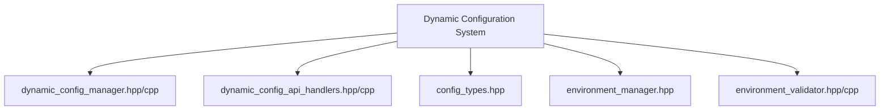
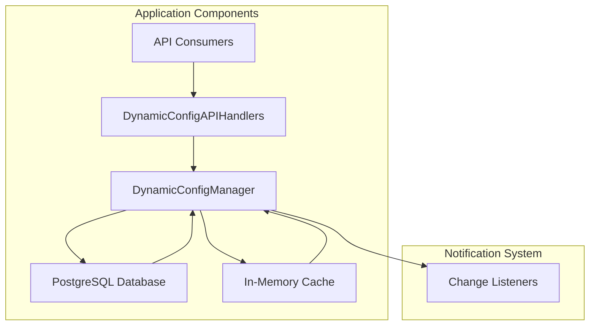
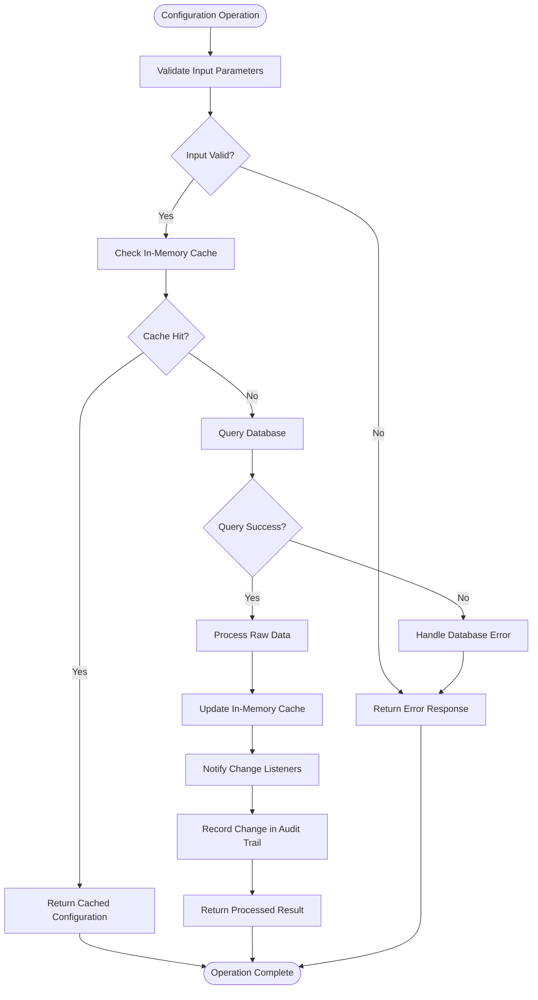
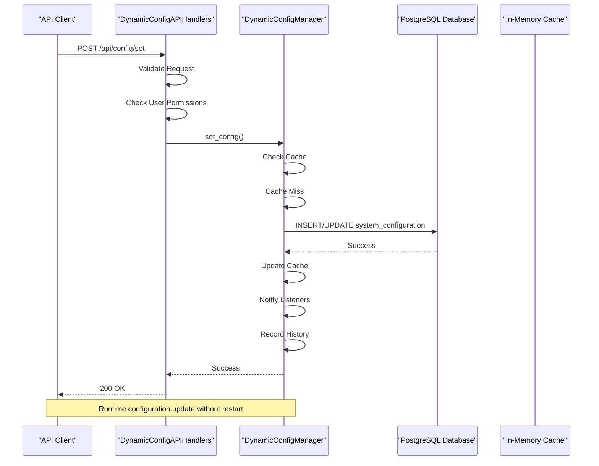
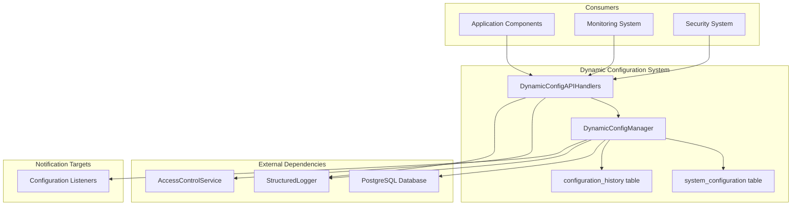

# Dynamic Configuration

<cite>
**Referenced Files in This Document**   
- [dynamic_config_manager.hpp](file://shared/config/dynamic_config_manager.hpp)
- [dynamic_config_manager.cpp](file://shared/config/dynamic_config_manager.cpp)
- [dynamic_config_api_handlers.hpp](file://shared/config/dynamic_config_api_handlers.hpp)
- [dynamic_config_api_handlers.cpp](file://shared/config/dynamic_config_api_handlers.cpp)
- [schema.sql](file://schema.sql)
- [config_types.hpp](file://shared/config/config_types.hpp)
</cite>

## Table of Contents
1. [Introduction](#introduction)
2. [Project Structure](#project-structure)
3. [Core Components](#core-components)
4. [Architecture Overview](#architecture-overview)
5. [Detailed Component Analysis](#detailed-component-analysis)
6. [Dependency Analysis](#dependency-analysis)
7. [Performance Considerations](#performance-considerations)
8. [Troubleshooting Guide](#troubleshooting-guide)
9. [Conclusion](#conclusion)

## Introduction
The Dynamic Configuration system provides a runtime configuration management solution that enables modifications without requiring service restarts. This document details the high-level design, configuration lifecycle, multi-level scope system, database-backed storage, in-memory caching, API workflow, security considerations, and audit trail mechanisms for the system.

## Project Structure
The Dynamic Configuration system is organized within the shared/config directory and consists of several key components:



**Diagram sources**
- [dynamic_config_manager.hpp](file://shared/config/dynamic_config_manager.hpp)
- [dynamic_config_api_handlers.hpp](file://shared/config/dynamic_config_api_handlers.hpp)

**Section sources**
- [dynamic_config_manager.hpp](file://shared/config/dynamic_config_manager.hpp)
- [dynamic_config_api_handlers.hpp](file://shared/config/dynamic_config_api_handlers.hpp)

## Core Components
The Dynamic Configuration system consists of two primary components: the DynamicConfigManager class that handles configuration operations and the DynamicConfigAPIHandlers class that provides REST API endpoints for configuration management.

**Section sources**
- [dynamic_config_manager.hpp](file://shared/config/dynamic_config_manager.hpp)
- [dynamic_config_api_handlers.hpp](file://shared/config/dynamic_config_api_handlers.hpp)

## Architecture Overview
The Dynamic Configuration system follows a layered architecture with a clear separation between the API layer, business logic layer, and data storage layer. The system provides runtime configuration management with change notification capabilities.



**Diagram sources**
- [dynamic_config_manager.hpp](file://shared/config/dynamic_config_manager.hpp)
- [dynamic_config_api_handlers.hpp](file://shared/config/dynamic_config_api_handlers.hpp)

## Detailed Component Analysis

### DynamicConfigManager Analysis
The DynamicConfigManager class is the core component responsible for managing configuration operations, including loading, validation, persistence, and change notification.

#### Class Diagram
```mermaid
classDiagram
class DynamicConfigManager {
+std : : shared_ptr<PostgreSQLConnection> db_conn_
+std : : shared_ptr<StructuredLogger> logger_
+mutable std : : mutex cache_mutex_
+std : : unordered_map<std : : string, ConfigValue> config_cache_
+std : : unordered_map<std : : string, ValidationContext> validation_cache_
+mutable std : : mutex listener_mutex_
+std : : vector<std : : function<void(const ConfigValue&)>> change_listeners_
+DynamicConfigManager(std : : shared_ptr<PostgreSQLConnection>, std : : shared_ptr<StructuredLogger>)
+initialize() bool
+get_config(key, scope) std : : optional<ConfigValue>
+set_config(key, value, scope, module_name, user_id, reason, ...) bool
+delete_config(key, scope, user_id) bool
+get_configs_by_scope(scope) std : : vector<ConfigValue>
+get_configs_by_module(module_name) std : : vector<ConfigValue>
+get_config_history(key, since, limit) std : : vector<ConfigChangeLog>
+register_config_schema(key, data_type, validation_rules, ...) bool
+validate_config_value(key, value, override_type) ConfigValidationResult
+reload_configs() void
+get_config_usage_stats() nlohmann : : json
+get_most_changed_configs(limit) std : : vector<std : : pair<std : : string, int>>
+register_change_listener(listener) void
+update_configuration(request) bool
+get_configuration(key) std : : optional<nlohmann : : json>
+get_all_configurations() std : : unordered_map<std : : string, nlohmann : : json>
+get_configuration_metadata(key) std : : optional<ConfigMetadata>
+validate_configuration(key, value) ConfigValidationResult
+get_configuration_history_legacy(key, limit) std : : vector<ConfigHistoryEntry>
+rollback_configuration(history_id, user_id, reason) bool
+delete_configuration(key, user_id, reason) bool
+has_update_permission(key, user_id) bool
+refresh_cache() bool
+get_restart_required_configs() std : : vector<std : : string>
}
class ConfigValue {
+std : : string key
+nlohmann : : json value
+ConfigMetadata metadata
+bool is_encrypted
+std : : optional<std : : string> updated_by
+std : : optional<std : : string> created_by
+std : : chrono : : system_clock : : time_point created_at
+std : : chrono : : system_clock : : time_point updated_at
}
class ConfigMetadata {
+ConfigDataType data_type
+ConfigScope scope
+std : : string module_name
+std : : string description
+bool is_sensitive
+bool requires_restart
+std : : vector<std : : string> tags
+nlohmann : : json validation_rules
+std : : string last_updated
+std : : string updated_by
+int version
+std : : optional<std : : string> created_by
+std : : chrono : : system_clock : : time_point created_at
+std : : chrono : : system_clock : : time_point updated_at
}
class ConfigUpdateRequest {
+std : : string key
+nlohmann : : json value
+std : : string user_id
+std : : string reason
+std : : string source
+ConfigScope scope
+std : : string module_name
+bool is_encrypted
+bool requires_restart
+std : : string description
+std : : vector<std : : string> tags
+nlohmann : : json validation_rules
+std : : optional<ConfigDataType> data_type_override
}
class ConfigHistoryEntry {
+std : : string history_id
+std : : string config_key
+nlohmann : : json old_value
+nlohmann : : json new_value
+std : : string changed_by
+std : : string changed_at
+std : : string change_reason
+std : : string change_source
}
class ConfigChangeLog {
+std : : string change_id
+std : : string key
+ConfigScope scope
+nlohmann : : json old_value
+nlohmann : : json new_value
+std : : string changed_by
+std : : string change_reason
+std : : string change_source
+int version
+std : : chrono : : system_clock : : time_point changed_at
}
class ConfigValidationResult {
+bool is_valid
+std : : vector<std : : string> errors
+std : : vector<std : : string> warnings
+nlohmann : : json normalized_value
+std : : optional<nlohmann : : json> suggested_value
}
enum ConfigScope {
GLOBAL
USER
ORGANIZATION
ENVIRONMENT
MODULE
}
enum ConfigDataType {
STRING
INTEGER
FLOAT
BOOLEAN
JSON
SECRET
}
DynamicConfigManager --> ConfigValue
DynamicConfigManager --> ConfigMetadata
DynamicConfigManager --> ConfigUpdateRequest
DynamicConfigManager --> ConfigHistoryEntry
DynamicConfigManager --> ConfigChangeLog
DynamicConfigManager --> ConfigValidationResult
DynamicConfigManager --> ConfigScope
DynamicConfigManager --> ConfigDataType
```

**Diagram sources**
- [dynamic_config_manager.hpp](file://shared/config/dynamic_config_manager.hpp)

#### Configuration Lifecycle Flowchart


**Diagram sources**
- [dynamic_config_manager.cpp](file://shared/config/dynamic_config_manager.cpp)

### DynamicConfigAPIHandlers Analysis
The DynamicConfigAPIHandlers class provides REST API endpoints for configuration management operations, serving as the interface between external consumers and the DynamicConfigManager.

#### Sequence Diagram


**Diagram sources**
- [dynamic_config_api_handlers.cpp](file://shared/config/dynamic_config_api_handlers.cpp)

## Dependency Analysis
The Dynamic Configuration system has dependencies on several other components within the architecture, forming a cohesive ecosystem for configuration management.



**Diagram sources**
- [dynamic_config_manager.hpp](file://shared/config/dynamic_config_manager.hpp)
- [dynamic_config_api_handlers.hpp](file://shared/config/dynamic_config_api_handlers.hpp)
- [schema.sql](file://schema.sql)

**Section sources**
- [dynamic_config_manager.hpp](file://shared/config/dynamic_config_manager.hpp)
- [dynamic_config_api_handlers.hpp](file://shared/config/dynamic_config_api_handlers.hpp)
- [schema.sql](file://schema.sql)

## Performance Considerations
The Dynamic Configuration system is designed with performance in mind, utilizing an in-memory cache to minimize database queries and ensure fast access to configuration values. The system employs thread-safe access patterns using mutex locks to protect shared data structures. Configuration values are cached with a composite key that includes both the configuration key and scope, enabling efficient lookups across different scope levels.

The system also implements connection pooling for database operations, reducing the overhead of establishing database connections for each operation. Query optimization is achieved through the use of prepared statements and efficient indexing on the configuration tables.

## Troubleshooting Guide
When troubleshooting issues with the Dynamic Configuration system, consider the following common scenarios:

1. **Configuration not updating**: Verify that the change has been properly persisted to the database and that the in-memory cache has been updated. Check the configuration_history table to confirm the change was recorded.

2. **Permission denied errors**: Ensure the user has appropriate permissions to perform the requested operation. The system uses an access control service to validate user permissions for configuration operations.

3. **Validation failures**: Check the validation rules associated with the configuration key. The system performs validation based on defined rules including data type, allowed values, length constraints, and regular expression patterns.

4. **Cache inconsistencies**: If configuration values appear inconsistent across different components, verify that the cache is being properly updated and that all components are accessing the same cache instance.

5. **Database connectivity issues**: Monitor the database connection status and ensure the PostgreSQL database is accessible. The system includes health checks for database connectivity.

**Section sources**
- [dynamic_config_manager.cpp](file://shared/config/dynamic_config_manager.cpp)
- [dynamic_config_api_handlers.cpp](file://shared/config/dynamic_config_api_handlers.cpp)

## Conclusion
The Dynamic Configuration system provides a robust solution for runtime configuration management in the Regulens platform. By leveraging a multi-level scope system, database-backed storage, in-memory caching, and comprehensive audit trails, the system enables flexible and secure configuration management without requiring service restarts. The well-defined API interface and change notification mechanism allow for seamless integration with various application components, ensuring that configuration changes are propagated efficiently throughout the system.