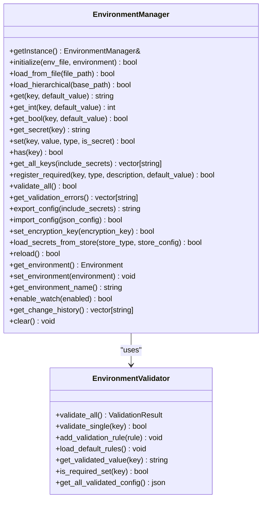
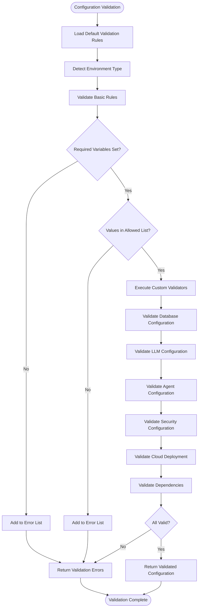
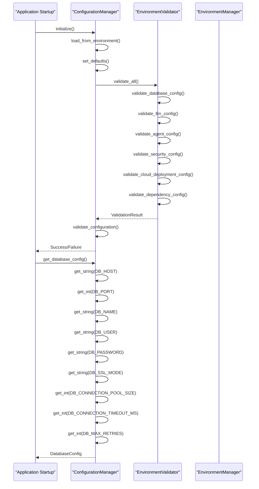
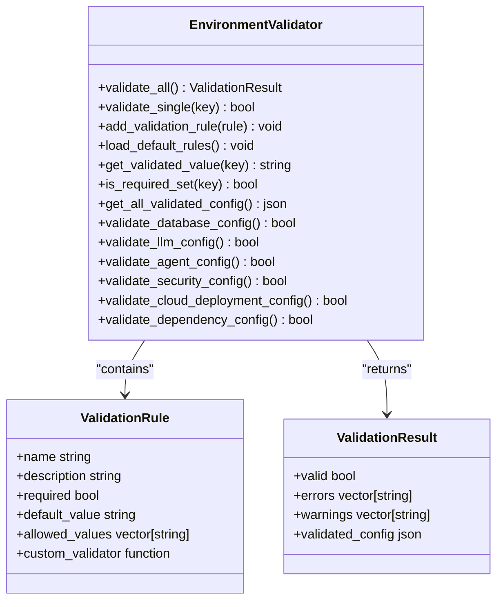
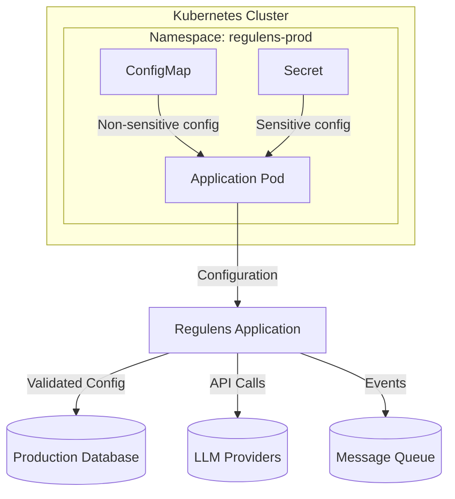

# Environment Management

<cite>
**Referenced Files in This Document**   
- [environment_manager.hpp](file://shared/config/environment_manager.hpp)
- [environment_validator.cpp](file://shared/config/environment_validator.cpp)
- [environment_validator.hpp](file://shared/config/environment_validator.hpp)
- [configuration_manager.cpp](file://shared/config/configuration_manager.cpp)
- [configuration_manager.hpp](file://shared/config/configuration_manager.hpp)
- [config_types.hpp](file://shared/config/config_types.hpp)
</cite>

## Table of Contents
1. [Introduction](#introduction)
2. [Environment Detection and Configuration System](#environment-detection-and-configuration-system)
3. [Environment-Specific Configuration Validation](#environment-specific-configuration-validation)
4. [Configuration Loading and Priority Mechanism](#configuration-loading-and-priority-mechanism)
5. [Security Requirements and Validation Rules](#security-requirements-and-validation-rules)
6. [Practical Examples of Environment-Specific Settings](#practical-examples-of-environment-specific-settings)
7. [Deployment Considerations for Containerized Environments](#deployment-considerations-for-containerized-environments)
8. [Best Practices for Environment Promotion](#best-practices-for-environment-promotion)
9. [Conclusion](#conclusion)

## Introduction
The Regulens platform implements a robust environment management system designed to support different configurations for PRODUCTION, STAGING, and DEVELOPMENT environments. This system ensures secure, compliant, and reliable operation across various deployment scenarios by leveraging environment variables as the primary configuration source with comprehensive validation mechanisms. The architecture prevents insecure defaults, enforces security requirements, and provides safeguards against configuration leaks between environments. This document details the comprehensive environment management framework that supports the platform's cloud-deployable nature while maintaining strict security and compliance standards.

## Environment Detection and Configuration System
The Regulens platform employs a sophisticated environment detection and configuration system that identifies the current operational context and tailors configuration values accordingly. The system is built around the `EnvironmentManager` class, which serves as the central component for managing environment-specific configurations.

The environment detection mechanism is based on the `REGULENS_ENVIRONMENT` environment variable, which must be set to one of four valid values: "development", "staging", "production", or "testing". This variable serves as the foundation for determining the application's operational context and influences all subsequent configuration decisions.

**Diagram sources**
- [environment_manager.hpp](file://shared/config/environment_manager.hpp#L53-L327)
- [environment_validator.hpp](file://shared/config/environment_validator.hpp#L20-L52)

The `EnvironmentManager` class implements a hierarchical configuration loading system that supports multiple configuration sources. It can load configuration from `.env` files, with support for environment-specific overrides through a hierarchical loading pattern: `.env` → `.env.{environment}` → `.env.local`. This allows for base configuration in the main `.env` file, environment-specific overrides in `.env.production` or `.env.staging`, and local development overrides in `.env.local` that are typically excluded from version control.

The system also supports integration with external secret management systems such as HashiCorp Vault, AWS Secrets Manager, Azure Key Vault, and GCP Secret Manager. This integration enables secure storage and retrieval of sensitive configuration values, ensuring that secrets are not exposed in configuration files or environment variables.

**Section sources**
- [environment_manager.hpp](file://shared/config/environment_manager.hpp#L53-L327)

## Environment-Specific Configuration Validation
The Regulens platform implements a comprehensive validation system to ensure that environment-specific configurations meet security and operational requirements. The `EnvironmentValidator` class is responsible for validating all environment variables according to predefined rules that vary based on the current environment.

The validation system employs a rule-based approach where each configuration parameter has associated validation rules. These rules include:
- Required status (whether the parameter must be set)
- Default values (used when the parameter is not set)
- Allowed values (a list of acceptable values)
- Custom validation functions (for complex validation logic)

**Diagram sources**
- [environment_validator.cpp](file://shared/config/environment_validator.cpp#L48-L1327)
- [environment_validator.hpp](file://shared/config/environment_validator.hpp#L20-L52)

The validation process is comprehensive and includes category-specific validations that ensure the integrity of the entire configuration system. For example, database configuration validation checks that all required database parameters are present and that production environments do not use localhost connections. Similarly, LLM configuration validation ensures that at least one LLM provider is configured in production environments.

The system also performs dependency validation, ensuring that if certain features are enabled, their required dependencies are properly configured. For instance, if agent autonomous integration is enabled, the system verifies that an LLM provider is configured, as this capability depends on LLM functionality.

**Section sources**
- [environment_validator.cpp](file://shared/config/environment_validator.cpp#L48-L1327)

## Configuration Loading and Priority Mechanism
The Regulens platform implements a sophisticated configuration loading mechanism that prioritizes environment variables over defaults and prevents accidental configuration leaks between environments. The system follows a strict hierarchy and validation process to ensure configuration integrity.

The configuration loading process begins with the `ConfigurationManager` class, which serves as the primary interface for accessing configuration values throughout the application. This singleton class loads configuration from environment variables during initialization and provides type-safe access methods for retrieving configuration values.

**Diagram sources**
- [configuration_manager.cpp](file://shared/config/configuration_manager.cpp#L0-L529)
- [configuration_manager.hpp](file://shared/config/configuration_manager.hpp#L220-L342)

The configuration system follows a clear priority mechanism:
1. Environment variables take precedence over all other configuration sources
2. Configuration files (when used) provide default values that can be overridden by environment variables
3. Hardcoded defaults are used only as a last resort for non-critical parameters

This priority system ensures that deployment-specific configurations can override default settings without modifying code or configuration files. The system also implements safeguards to prevent configuration leaks between environments by validating that production environments do not contain localhost references or other development-specific values.

The `ConfigurationManager` class provides specialized methods for retrieving configuration values in different data types (string, integer, boolean, double), ensuring type safety and proper error handling when configuration values cannot be converted to the requested type.

**Section sources**
- [configuration_manager.cpp](file://shared/config/configuration_manager.cpp#L0-L529)

## Security Requirements and Validation Rules
The Regulens platform enforces strict security requirements through comprehensive validation rules that vary by environment. The system prevents insecure defaults and ensures that production environments meet stringent security standards.

The security validation rules are implemented in the `EnvironmentValidator` class and include several key components:

### Database Security Requirements
For database connections, the system enforces the following security requirements:
- Production environments must not use localhost or 127.0.0.1 as the database host
- SSL connections are mandatory in production environments (DB_SSL_MODE must not be "disable")
- Database passwords in production must be at least 12 characters long and contain mixed case letters and digits
- Audit database connections must also meet the same security requirements as primary databases

### Encryption and Authentication Security
The system enforces strong encryption and authentication requirements:
- Encryption master keys in production must be at least 32 characters long and contain mixed case letters, digits, and special characters
- Data encryption keys have the same requirements as master keys
- JWT secret keys in production must be at least 64 characters long with mixed case, digits, and special characters
- All encryption keys must be explicitly configured and cannot rely on defaults

### Cloud Deployment Security
The system prevents insecure cloud deployment configurations:
- No localhost references are allowed in production for any service (database, message queue, vector database, etc.)
- Model endpoints must not use localhost in production environments
- Message queue bootstrap servers must not contain localhost references in production
- External system integrations (ERP, document systems, SIEM) must not use localhost hosts in production

**Diagram sources**
- [environment_validator.hpp](file://shared/config/environment_validator.hpp#L20-L52)
- [environment_validator.cpp](file://shared/config/environment_validator.cpp#L48-L1327)

The validation system also includes helper methods for common validation tasks:
- `validate_numeric_range()` ensures numeric values fall within acceptable ranges
- `validate_url_format()` validates that URLs have proper syntax
- `validate_email_format()` ensures email addresses are properly formatted
- `validate_hostname_or_ip()` validates that hostnames or IP addresses are correctly formatted
- Password strength validation methods check for mixed case, digits, and special characters

These validation rules are applied consistently across all environments, with additional restrictions applied in production to ensure the highest level of security.

**Section sources**
- [environment_validator.cpp](file://shared/config/environment_validator.cpp#L48-L1327)

## Practical Examples of Environment-Specific Settings
The Regulens platform provides numerous practical examples of environment-specific settings for database connections, LLM providers, and security policies. These examples demonstrate how the configuration system adapts to different environments while maintaining security and functionality.

### Database Connection Examples
The database configuration system provides different settings for each environment:

**Development Environment:**
- DB_HOST: localhost (allowed only in development)
- DB_PORT: 5432 (default value)
- DB_NAME: regulens_compliance_dev
- DB_USER: regulens_dev_user
- DB_PASSWORD: dev_password123 (minimal complexity requirements)
- DB_SSL_MODE: disable (allowed in development)
- DB_CONNECTION_POOL_SIZE: 5 (reduced for local development)

**Staging Environment:**
- DB_HOST: staging-db.regulens.ai
- DB_PORT: 5432
- DB_NAME: regulens_compliance_staging
- DB_USER: regulens_staging_user
- DB_PASSWORD: (complex password with mixed case and digits)
- DB_SSL_MODE: require
- DB_CONNECTION_POOL_SIZE: 10

**Production Environment:**
- DB_HOST: prod-db.regulens.ai
- DB_PORT: 5432
- DB_NAME: regulens_compliance_prod
- DB_USER: regulens_prod_user
- DB_PASSWORD: (complex password with mixed case, digits, and length >= 12)
- DB_SSL_MODE: require (mandatory)
- DB_CONNECTION_POOL_SIZE: 20 (higher for production load)

### LLM Provider Configuration
The LLM configuration system supports multiple providers with environment-specific settings:

**Development Environment:**
- LLM_OPENAI_API_KEY: (development key or empty)
- LLM_OPENAI_BASE_URL: https://api.openai.com/v1
- LLM_OPENAI_MODEL: gpt-3.5-turbo
- LLM_ANTHROPIC_API_KEY: (development key or empty)
- LLM_ANTHROPIC_BASE_URL: https://api.anthropic.com
- LLM_ANTHROPIC_MODEL: claude-instant-1

**Production Environment:**
- LLM_OPENAI_API_KEY: (production key with proper rotation)
- LLM_OPENAI_BASE_URL: https://api.openai.com/v1
- LLM_OPENAI_MODEL: gpt-4-turbo-preview
- LLM_ANTHROPIC_API_KEY: (production key with proper rotation)
- LLM_ANTHROPIC_BASE_URL: https://api.anthropic.com
- LLM_ANTHROPIC_MODEL: claude-3-sonnet-20240229

The system requires at least one LLM provider to be configured in production environments, ensuring that AI capabilities are available for critical operations.

### Security Policy Examples
Security policies vary significantly between environments:

**Development Security Policies:**
- ENCRYPTION_MASTER_KEY: (16+ character key)
- DATA_ENCRYPTION_KEY: (16+ character key)
- JWT_SECRET_KEY: (32+ character key)
- AGENT_ENABLE_WEB_SEARCH: true (for testing)
- AGENT_ENABLE_MCP_TOOLS: true (for testing)
- AGENT_ENABLE_AUTONOMOUS_INTEGRATION: false (disabled by default)

**Production Security Policies:**
- ENCRYPTION_MASTER_KEY: (32+ character key with mixed case, digits, and special characters)
- DATA_ENCRYPTION_KEY: (32+ character key with mixed case, digits, and special characters)
- JWT_SECRET_KEY: (64+ character key with mixed case, digits, and special characters)
- AGENT_ENABLE_WEB_SEARCH: false (disabled by default)
- AGENT_ENABLE_MCP_TOOLS: false (disabled by default)
- AGENT_ENABLE_AUTONOMOUS_INTEGRATION: false (disabled by default)

The system also configures external integrations differently across environments:
- SMTP_HOST: smtp.gmail.com (development) vs. smtp.enterprise.com (production)
- ERP_SYSTEM_HOST: erp.dev.company.com (development) vs. erp.prod.company.com (production)
- DOCUMENT_SYSTEM_BASE_URL: https://dev.sharepoint.com (development) vs. https://prod.sharepoint.com (production)

These environment-specific settings ensure that the application operates correctly in each environment while maintaining appropriate security levels and resource usage.

**Section sources**
- [environment_validator.cpp](file://shared/config/environment_validator.cpp#L48-L1327)
- [configuration_manager.cpp](file://shared/config/configuration_manager.cpp#L0-L529)

## Deployment Considerations for Containerized Environments
The Regulens platform is designed with containerized deployments in mind, following cloud-native principles for configuration management. The environment management system provides several features specifically tailored for containerized environments.

### Docker and Kubernetes Integration
The platform's configuration system integrates seamlessly with container orchestration platforms like Docker and Kubernetes. Environment variables are the primary mechanism for configuring containerized instances, aligning with the 12-factor app methodology.

In Docker deployments, environment variables can be set through:
- Docker run command with -e flags
- Docker Compose files using the environment section
- Dockerfiles with ENV instructions (for defaults only)

In Kubernetes deployments, environment variables are typically provided through:
- ConfigMaps for non-sensitive configuration
- Secrets for sensitive information like API keys and passwords
- Environment variable references from ConfigMaps and Secrets in pod specifications

**Diagram sources**
- [environment_manager.hpp](file://shared/config/environment_manager.hpp#L53-L327)
- [environment_validator.cpp](file://shared/config/environment_validator.cpp#L48-L1327)

### Secret Management in Containers
The platform supports multiple approaches for managing secrets in containerized environments:
- Kubernetes Secrets for storing sensitive configuration values
- HashiCorp Vault integration for dynamic secret retrieval
- AWS Secrets Manager for AWS-based deployments
- Azure Key Vault for Azure-based deployments
- GCP Secret Manager for Google Cloud deployments

The `EnvironmentManager` class provides methods to load secrets from these external stores, ensuring that sensitive information is not exposed in environment variables or configuration files.

### Configuration Best Practices for Containers
The platform follows several best practices for containerized deployments:
- No sensitive information in Docker images
- Environment variables for configuration, not configuration files
- Immutable containers with configuration injected at runtime
- Health checks that verify configuration validity
- Readiness probes that ensure the application is properly configured before accepting traffic

The system also supports configuration hot-reload through the `enable_watch()` method, allowing containers to automatically reload configuration when external configuration sources change without requiring a restart.

### Environment Variable Management
For containerized deployments, the platform recommends the following practices:
- Use consistent environment variable naming across all environments
- Document all required environment variables in deployment documentation
- Use validation to catch missing or incorrect configuration at startup
- Implement graceful degradation when optional services are not configured
- Provide clear error messages for configuration issues

The hierarchical configuration loading system (`.env` → `.env.{environment}` → `.env.local`) works well with containerized deployments, allowing for base configuration in version control and environment-specific overrides in deployment configurations.

**Section sources**
- [environment_manager.hpp](file://shared/config/environment_manager.hpp#L53-L327)

## Best Practices for Environment Promotion
The Regulens platform implements several best practices for promoting configurations from development to production environments. These practices ensure a smooth and secure transition while maintaining consistency and reliability.

### Configuration Promotion Strategy
The platform follows a structured approach to environment promotion:

1. **Development Environment**: Developers work with local configurations that may include localhost references and development-specific settings. The validation system is less strict in this environment to facilitate rapid development.

2. **Staging Environment**: Before promotion to production, configurations are tested in a staging environment that closely mirrors production. The validation system enforces production-like security requirements to catch potential issues early.

3. **Production Environment**: Final deployment with full security validation and monitoring. The system prevents common mistakes like localhost references or weak passwords.

### Configuration Validation During Promotion
The platform uses several mechanisms to ensure configuration validity during promotion:

- **Pre-deployment Validation**: Before deploying to any environment, the `EnvironmentValidator` runs comprehensive validation checks to ensure all required configuration is present and valid.

- **Environment-Specific Rules**: The validation system applies different rules based on the target environment, catching environment-specific issues before they cause problems.

- **Dependency Validation**: The system verifies that all required dependencies are properly configured, preventing issues like enabling agent features without configuring LLM providers.

### Configuration Management Best Practices
The platform recommends the following best practices for environment promotion:

1. **Version Control for Configuration**: All non-sensitive configuration should be stored in version control, allowing for tracking changes and rollback if needed.

2. **Secrets Management**: Sensitive information should be managed through dedicated secret management systems rather than being included in configuration files.

3. **Configuration Templates**: Use configuration templates with placeholders for environment-specific values, reducing the risk of configuration errors during promotion.

4. **Automated Testing**: Implement automated tests that verify configuration validity and application behavior in each environment.

5. **Gradual Rollout**: For production deployments, use gradual rollout strategies like canary releases or blue-green deployments to minimize risk.

### Environment-Specific Configuration Patterns
The platform supports several patterns for managing environment-specific configurations:

- **Parameterized Configuration**: Use the same configuration structure across environments with different values for parameters like hostnames, ports, and credentials.

- **Feature Flags**: Use configuration-driven feature flags to enable or disable features in different environments without code changes.

- **Resource Scaling**: Adjust resource-related configuration (connection pool sizes, timeouts, retry limits) based on the expected load in each environment.

- **Monitoring and Logging**: Configure different monitoring and logging levels for each environment, with more verbose logging in development and more focused monitoring in production.

### Promotion Checklist
The platform recommends the following checklist for environment promotion:

1. Verify that all required environment variables are set
2. Confirm that no localhost references exist in production configuration
3. Validate that SSL is enabled for all external connections
4. Check that encryption keys meet production strength requirements
5. Verify that LLM providers are properly configured if agent features are enabled
6. Ensure that database connection settings are appropriate for the target environment
7. Confirm that external system integrations use production endpoints
8. Validate that security policies are appropriately strict for the target environment
9. Test all critical functionality with the target configuration
10. Document any configuration changes made during promotion

By following these best practices, organizations can ensure a smooth and secure promotion process from development to production environments.

**Section sources**
- [environment_validator.cpp](file://shared/config/environment_validator.cpp#L48-L1327)
- [environment_manager.hpp](file://shared/config/environment_manager.hpp#L53-L327)

## Conclusion
The Regulens platform's environment management system provides a comprehensive solution for managing configuration across different environments. By leveraging environment variables as the primary configuration source with strict validation, the system ensures secure, compliant, and reliable operation in development, staging, and production environments.

The architecture prevents insecure defaults through comprehensive validation rules that vary by environment, with particularly stringent requirements for production deployments. The system enforces mandatory SSL connections, strong encryption keys, and other security requirements to protect sensitive data and maintain regulatory compliance.

The configuration loading process prioritizes environment variables over defaults, providing flexibility for different deployment scenarios while preventing accidental configuration leaks between environments. The hierarchical loading system supports environment-specific overrides, allowing for base configuration with targeted modifications for specific environments.

Practical examples demonstrate how the system handles database connections, LLM providers, and security policies differently across environments, ensuring appropriate resource usage and security levels. The platform also provides guidance for containerized deployments and best practices for environment promotion, supporting modern cloud-native architectures.

By following the principles and practices outlined in this document, organizations can effectively manage their Regulens deployments across different environments while maintaining security, compliance, and operational excellence.