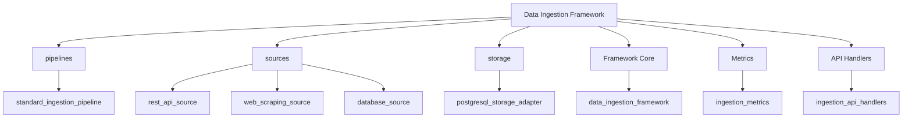
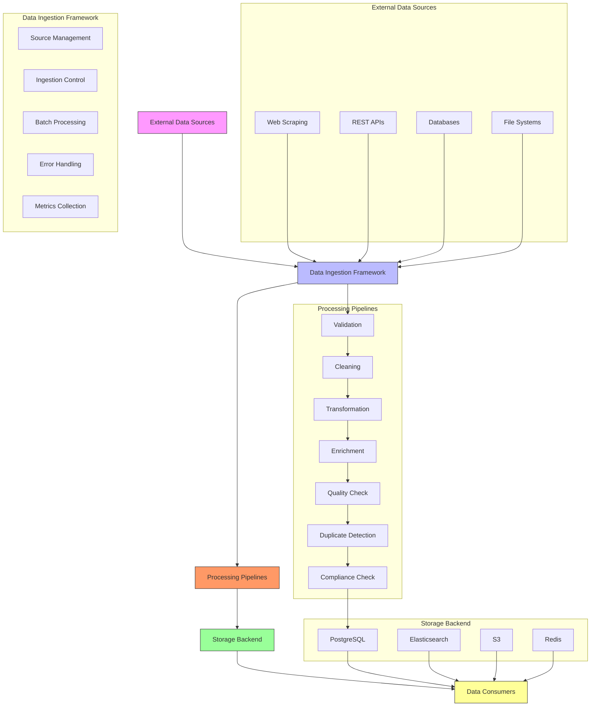
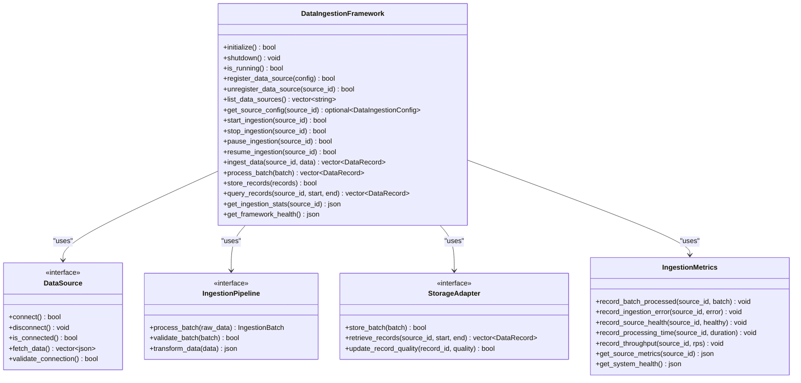
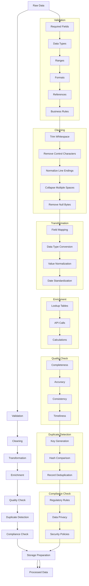
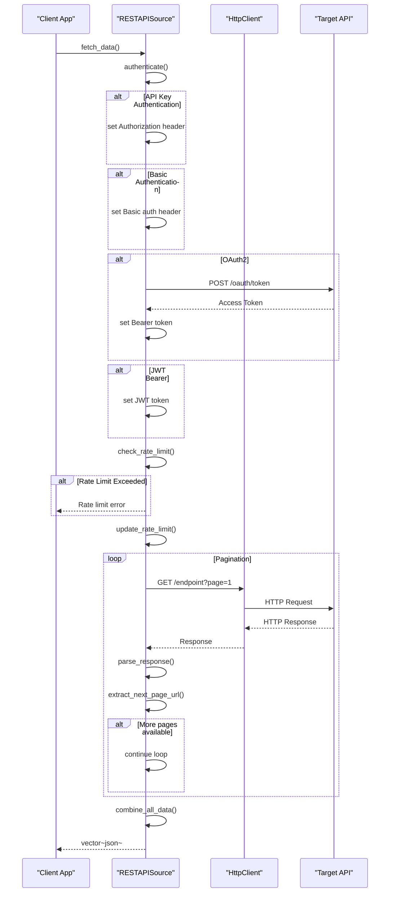
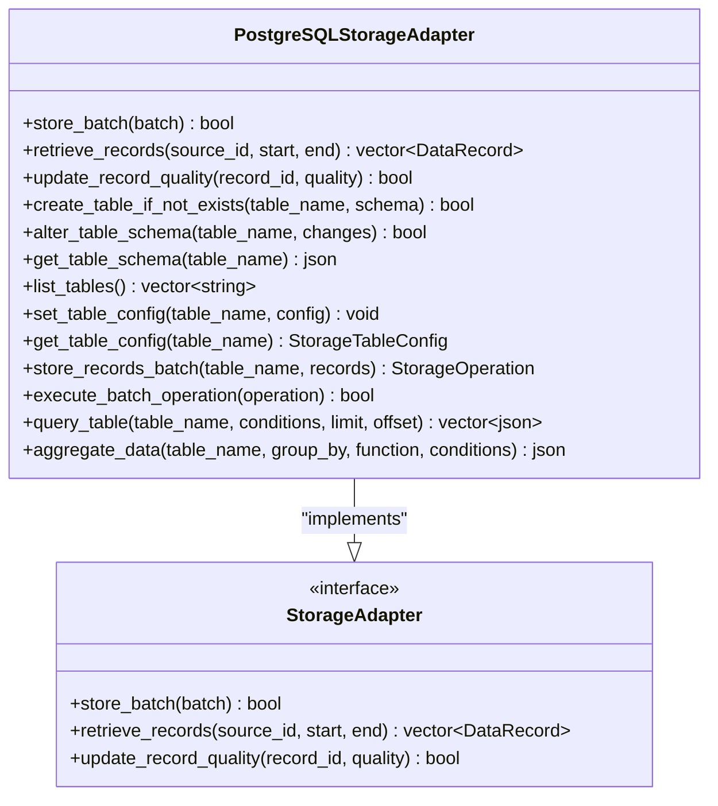
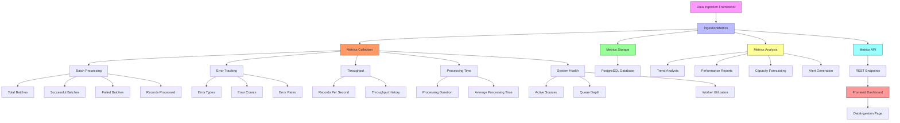
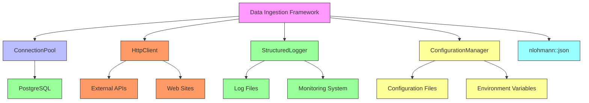

# Data Ingestion Framework

<cite>
**Referenced Files in This Document**   
- [data_ingestion_framework.cpp](file://shared/data_ingestion/data_ingestion_framework.cpp)
- [data_ingestion_framework.hpp](file://shared/data_ingestion/data_ingestion_framework.hpp)
- [standard_ingestion_pipeline.cpp](file://shared/data_ingestion/pipelines/standard_ingestion_pipeline.cpp)
- [standard_ingestion_pipeline.hpp](file://shared/data_ingestion/pipelines/standard_ingestion_pipeline.hpp)
- [rest_api_source.cpp](file://shared/data_ingestion/sources/rest_api_source.cpp)
- [web_scraping_source.cpp](file://shared/data_ingestion/sources/web_scraping_source.cpp)
- [database_source.cpp](file://shared/data_ingestion/sources/database_source.cpp)
- [postgresql_storage_adapter.cpp](file://shared/data_ingestion/storage/postgresql_storage_adapter.cpp)
- [postgresql_storage_adapter.hpp](file://shared/data_ingestion/storage/postgresql_storage_adapter.hpp)
- [ingestion_metrics.cpp](file://shared/data_ingestion/ingestion_metrics.cpp)
- [ingestion_api_handlers.cpp](file://shared/data_ingestion/ingestion_api_handlers.cpp)
- [DataIngestion.tsx](file://frontend/src/pages/DataIngestion.tsx)
- [schema.sql](file://schema.sql)
</cite>

## Table of Contents
1. [Introduction](#introduction)
2. [Project Structure](#project-structure)
3. [Core Components](#core-components)
4. [Architecture Overview](#architecture-overview)
5. [Detailed Component Analysis](#detailed-component-analysis)
6. [Dependency Analysis](#dependency-analysis)
7. [Performance Considerations](#performance-considerations)
8. [Troubleshooting Guide](#troubleshooting-guide)
9. [Conclusion](#conclusion)

## Introduction
The Data Ingestion Framework is a production-grade, extensible system designed for ingesting regulatory data from diverse sources. It provides a unified interface for managing data pipelines with pluggable sources and storage adapters. The framework supports various ingestion modes including batch, streaming, scheduled, and real-time processing. It incorporates comprehensive data transformation capabilities, quality assurance mechanisms, and robust error handling to ensure reliable data processing. The system is designed to handle large volumes of regulatory data with scalability in mind, supporting multiple worker threads and connection pooling. Configuration options allow for customization of ingestion schedules, retry policies, and data validation rules, making it adaptable to various regulatory monitoring requirements.

## Project Structure
The Data Ingestion Framework is organized within the shared/data_ingestion directory and consists of several key components:

**Diagram sources**
- [data_ingestion_framework.cpp](file://shared/data_ingestion/data_ingestion_framework.cpp#L1-L831)
- [data_ingestion_framework.hpp](file://shared/data_ingestion/data_ingestion_framework.hpp#L1-L299)

**Section sources**
- [data_ingestion_framework.cpp](file://shared/data_ingestion/data_ingestion_framework.cpp#L1-L831)
- [data_ingestion_framework.hpp](file://shared/data_ingestion/data_ingestion_framework.hpp#L1-L299)

## Core Components

The Data Ingestion Framework consists of several core components that work together to provide a comprehensive data ingestion solution. The framework orchestrates data sources, processing pipelines, and storage adapters through a unified interface. It supports multiple ingestion modes (batch, streaming, scheduled, real-time) and provides extensibility through pluggable source and storage adapters. The system includes comprehensive metrics and monitoring capabilities for tracking ingestion performance and health. Error handling mechanisms include retry logic with exponential backoff and circuit breaker patterns to ensure resilience in the face of transient failures. Configuration options allow for customization of ingestion schedules, retry policies, and data validation rules.

**Section sources**
- [data_ingestion_framework.cpp](file://shared/data_ingestion/data_ingestion_framework.cpp#L1-L831)
- [data_ingestion_framework.hpp](file://shared/data_ingestion/data_ingestion_framework.hpp#L1-L299)

## Architecture Overview

The Data Ingestion Framework follows a modular architecture with clear separation of concerns. The system is designed around a central framework that coordinates data sources, processing pipelines, and storage adapters. Data flows from various sources through configurable processing pipelines before being stored in the designated backend. The architecture supports both push and pull ingestion models, allowing for flexibility in how data is collected from external systems.

**Diagram sources**
- [data_ingestion_framework.cpp](file://shared/data_ingestion/data_ingestion_framework.cpp#L1-L831)
- [data_ingestion_framework.hpp](file://shared/data_ingestion/data_ingestion_framework.hpp#L1-L299)
- [standard_ingestion_pipeline.cpp](file://shared/data_ingestion/pipelines/standard_ingestion_pipeline.cpp#L1-L2549)
- [postgresql_storage_adapter.cpp](file://shared/data_ingestion/storage/postgresql_storage_adapter.cpp#L1-L1809)

## Detailed Component Analysis

### Data Ingestion Framework Analysis
The Data Ingestion Framework serves as the central orchestrator for all data ingestion activities. It manages the lifecycle of data sources, processing pipelines, and storage adapters. The framework provides a unified API for registering, starting, stopping, and monitoring data ingestion processes. It supports multiple worker threads for parallel processing of data batches, with configurable thread pool sizes. The system includes comprehensive error handling with retry mechanisms and circuit breaker patterns to ensure resilience. Metrics collection is integrated throughout the framework, providing insights into ingestion performance, success rates, and system health.

**Diagram sources**
- [data_ingestion_framework.cpp](file://shared/data_ingestion/data_ingestion_framework.cpp#L1-L831)
- [data_ingestion_framework.hpp](file://shared/data_ingestion/data_ingestion_framework.hpp#L1-L299)

**Section sources**
- [data_ingestion_framework.cpp](file://shared/data_ingestion/data_ingestion_framework.cpp#L1-L831)
- [data_ingestion_framework.hpp](file://shared/data_ingestion/data_ingestion_framework.hpp#L1-L299)

### Standard Ingestion Pipeline Analysis
The Standard Ingestion Pipeline implements a comprehensive data processing workflow with multiple configurable stages. The pipeline supports validation, cleaning, transformation, enrichment, quality checking, duplicate detection, compliance checking, and storage preparation. Each stage can be enabled or disabled based on configuration, allowing for flexible processing workflows. The pipeline applies validation rules to ensure data integrity, performs data cleaning to remove inconsistencies, and transforms data into a standardized format. Enrichment capabilities allow for augmentation of data with additional information from external sources. Quality checks assess data completeness and accuracy, while duplicate detection prevents redundant records from being processed.

**Diagram sources**
- [standard_ingestion_pipeline.cpp](file://shared/data_ingestion/pipelines/standard_ingestion_pipeline.cpp#L1-L2549)
- [standard_ingestion_pipeline.hpp](file://shared/data_ingestion/pipelines/standard_ingestion_pipeline.hpp#L1-L100)

**Section sources**
- [standard_ingestion_pipeline.cpp](file://shared/data_ingestion/pipelines/standard_ingestion_pipeline.cpp#L1-L2549)
- [standard_ingestion_pipeline.hpp](file://shared/data_ingestion/pipelines/standard_ingestion_pipeline.hpp#L1-L100)

### REST API Source Analysis
The REST API Source provides a production-grade implementation for ingesting data from RESTful APIs. It supports various authentication methods including API keys, basic authentication, OAuth2, and JWT bearer tokens. The source handles different pagination patterns such as offset/limit, page-based, cursor-based, and link header pagination. Rate limiting is implemented to prevent overwhelming the target API, with configurable request limits and intervals. The implementation includes retry logic with exponential backoff for handling transient failures. Response caching is supported to reduce redundant API calls and improve performance. The source can handle various response formats and extract data from complex JSON structures using configurable JSON path expressions.

**Diagram sources**
- [rest_api_source.cpp](file://shared/data_ingestion/sources/rest_api_source.cpp#L1-L1046)
- [rest_api_source.hpp](file://shared/data_ingestion/sources/rest_api_source.hpp#L1-L100)

**Section sources**
- [rest_api_source.cpp](file://shared/data_ingestion/sources/rest_api_source.cpp#L1-L1046)
- [rest_api_source.hpp](file://shared/data_ingestion/sources/rest_api_source.hpp#L1-L100)

### Web Scraping Source Analysis
The Web Scraping Source provides capabilities for extracting data from websites through HTML parsing. It uses HTTP client libraries to fetch web pages and HTML parsing libraries to extract structured data from the content. The source supports various authentication methods for accessing protected content, including cookies, headers, and form-based authentication. It handles different content types and encoding formats, with automatic charset detection and conversion. The implementation includes mechanisms for respecting robots.txt rules and managing crawl delays to avoid overloading target websites. Data extraction is configurable through CSS selectors or XPath expressions, allowing for flexible targeting of specific elements within web pages. The source also supports JavaScript rendering through headless browsers for dynamic content.

**Section sources**
- [web_scraping_source.cpp](file://shared/data_ingestion/sources/web_scraping_source.cpp#L1-L100)
- [web_scraping_source.hpp](file://shared/data_ingestion/sources/web_scraping_source.hpp#L1-L100)

### Database Source Analysis
The Database Source enables ingestion of data from various database systems through SQL queries. It supports connection pooling for efficient resource utilization and handles different database types through a unified interface. The source can execute parameterized queries to prevent SQL injection and supports various result set formats. It includes mechanisms for incremental data extraction using timestamp or ID-based tracking to avoid reprocessing existing data. The implementation handles database-specific data types and converts them to a standardized format for downstream processing. Connection resilience features include automatic reconnection and failover to backup servers. The source also supports transaction management for consistent data extraction.

**Section sources**
- [database_source.cpp](file://shared/data_ingestion/sources/database_source.cpp#L1-L100)
- [database_source.hpp](file://shared/data_ingestion/sources/database_source.hpp#L1-L100)

### PostgreSQL Storage Adapter Analysis
The PostgreSQL Storage Adapter provides a production-grade implementation for storing ingested data in PostgreSQL databases. It supports various storage strategies including insert-only, upsert on conflict, merge update, and bulk load operations. The adapter handles schema management with capabilities for creating tables, altering schemas, and managing indexes. It supports partitioning strategies for large datasets and includes data retention policies for automatic cleanup of old records. The implementation uses connection pooling for efficient database access and includes transaction management for data consistency. The adapter also provides query capabilities for retrieving data based on various criteria and supports aggregation operations for analytical queries.

**Diagram sources**
- [postgresql_storage_adapter.cpp](file://shared/data_ingestion/storage/postgresql_storage_adapter.cpp#L1-L1809)
- [postgresql_storage_adapter.hpp](file://shared/data_ingestion/storage/postgresql_storage_adapter.hpp#L1-L100)

**Section sources**
- [postgresql_storage_adapter.cpp](file://shared/data_ingestion/storage/postgresql_storage_adapter.cpp#L1-L1809)
- [postgresql_storage_adapter.hpp](file://shared/data_ingestion/storage/postgresql_storage_adapter.hpp#L1-L100)

### Ingestion Metrics Analysis
The Ingestion Metrics component provides comprehensive monitoring and analytics capabilities for the data ingestion system. It collects various metrics including batch processing statistics, error rates, throughput, processing times, and system health indicators. The metrics are stored in a database for persistence and can be queried for historical analysis. The implementation includes trend analysis to identify performance patterns and predict potential issues. Alerting capabilities are integrated to notify operators of critical conditions such as high error rates or throughput drops. The metrics system also supports capacity forecasting to help plan for future scaling requirements. Dashboard integration allows for real-time visualization of ingestion performance and system health.

**Diagram sources**
- [ingestion_metrics.cpp](file://shared/data_ingestion/ingestion_metrics.cpp#L1-L553)
- [ingestion_metrics.hpp](file://shared/data_ingestion/ingestion_metrics.hpp#L1-L100)

**Section sources**
- [ingestion_metrics.cpp](file://shared/data_ingestion/ingestion_metrics.cpp#L1-L553)
- [ingestion_metrics.hpp](file://shared/data_ingestion/ingestion_metrics.hpp#L1-L100)

## Dependency Analysis

The Data Ingestion Framework has several key dependencies that enable its functionality. The system relies on a database connection pool for efficient database access, which is provided by the shared/database module. HTTP client functionality is used for API and web scraping sources, implemented in the shared/network module. Structured logging is provided by the shared/logging module for consistent log output. Configuration management is handled by the shared/config module, allowing for flexible configuration of ingestion parameters. The framework also depends on JSON parsing and manipulation capabilities through the nlohmann/json library. These dependencies are managed through C++ shared pointers to ensure proper resource management and lifetime control.

**Diagram sources**
- [data_ingestion_framework.cpp](file://shared/data_ingestion/data_ingestion_framework.cpp#L1-L831)
- [data_ingestion_framework.hpp](file://shared/data_ingestion/data_ingestion_framework.hpp#L1-L299)

**Section sources**
- [data_ingestion_framework.cpp](file://shared/data_ingestion/data_ingestion_framework.cpp#L1-L831)
- [data_ingestion_framework.hpp](file://shared/data_ingestion/data_ingestion_framework.hpp#L1-L299)

## Performance Considerations

The Data Ingestion Framework is designed with performance and scalability in mind. The system supports multiple worker threads for parallel processing of data batches, with a configurable thread pool size (default 8 threads). Connection pooling is used for both database and HTTP connections to minimize connection overhead. The framework implements efficient data structures and algorithms to minimize memory usage and processing time. Batch processing is used to reduce the number of I/O operations and improve throughput. The system includes mechanisms for backpressure handling to prevent overwhelming downstream systems. Caching is implemented at multiple levels, including response caching for API calls and query result caching for database operations. The framework also supports data compression for reducing network bandwidth usage when transferring large datasets.

**Section sources**
- [data_ingestion_framework.cpp](file://shared/data_ingestion/data_ingestion_framework.cpp#L1-L831)
- [standard_ingestion_pipeline.cpp](file://shared/data_ingestion/pipelines/standard_ingestion_pipeline.cpp#L1-L2549)
- [postgresql_storage_adapter.cpp](file://shared/data_ingestion/storage/postgresql_storage_adapter.cpp#L1-L1809)

## Troubleshooting Guide

When troubleshooting issues with the Data Ingestion Framework, start by checking the system health through the get_framework_health() method. This will indicate if the framework is running and provide information about active sources and workers. For specific source issues, use the get_source_config() method to verify the configuration is correct. Check the ingestion metrics for error rates and failed batches, which can help identify problematic sources or time periods. Review the logs for detailed error messages and stack traces. For API sources, verify authentication credentials and check rate limits. For database sources, ensure connection parameters are correct and the database is accessible. For web scraping sources, check that the target website structure hasn't changed. If ingestion is slow, examine the processing time metrics and consider adjusting the batch size or worker thread count. For storage issues, verify the database connection and check for schema compatibility.

**Section sources**
- [data_ingestion_framework.cpp](file://shared/data_ingestion/data_ingestion_framework.cpp#L1-L831)
- [ingestion_metrics.cpp](file://shared/data_ingestion/ingestion_metrics.cpp#L1-L553)
- [ingestion_api_handlers.cpp](file://shared/data_ingestion/ingestion_api_handlers.cpp#L1-L423)

## Conclusion

The Data Ingestion Framework provides a comprehensive solution for ingesting regulatory data from diverse sources. Its modular architecture with pluggable sources and storage adapters allows for flexibility in integrating with various data systems. The framework's support for multiple ingestion modes (batch, streaming, scheduled, real-time) makes it suitable for a wide range of use cases. The comprehensive data transformation pipeline ensures data quality and consistency, while robust error handling and retry mechanisms provide resilience. The integrated metrics and monitoring system enables proactive management of ingestion processes. The framework's scalability features, including multi-threaded processing and connection pooling, allow it to handle large volumes of regulatory data efficiently. Overall, the Data Ingestion Framework provides a solid foundation for building reliable and maintainable data ingestion pipelines in regulatory technology applications.