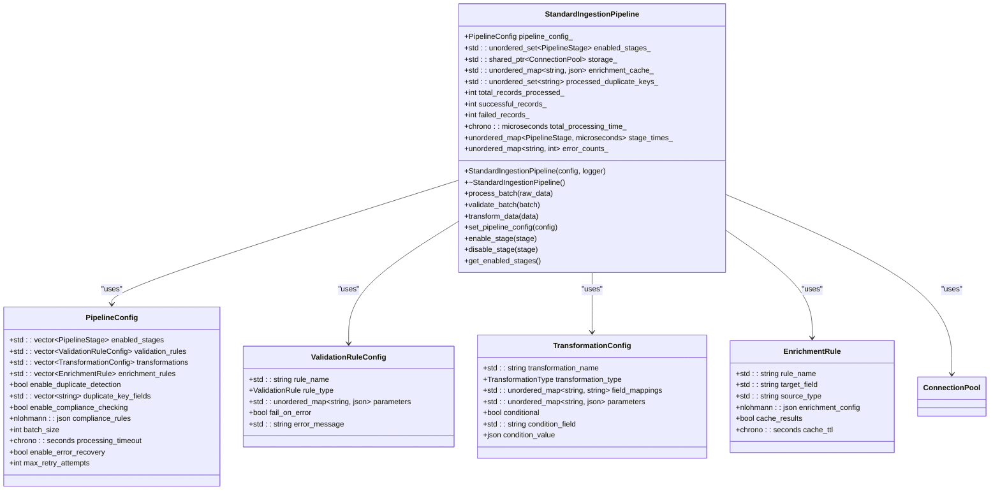
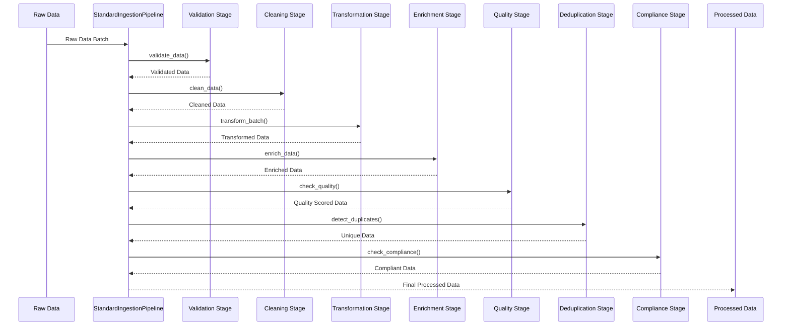
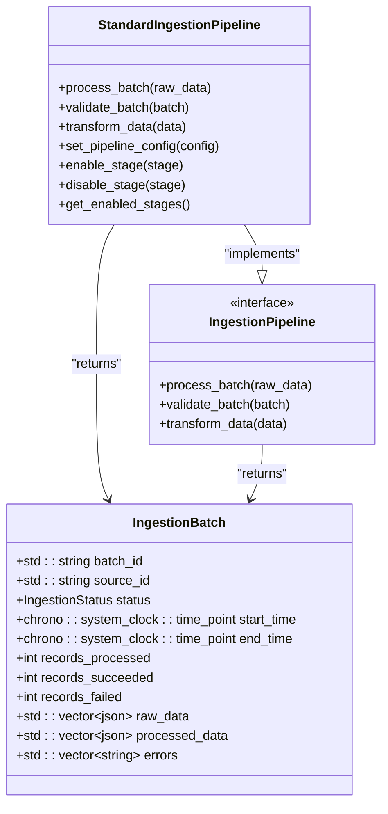
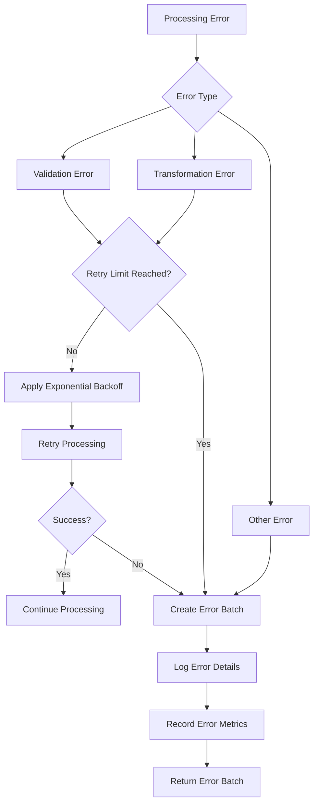
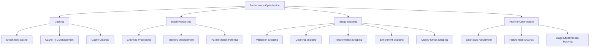
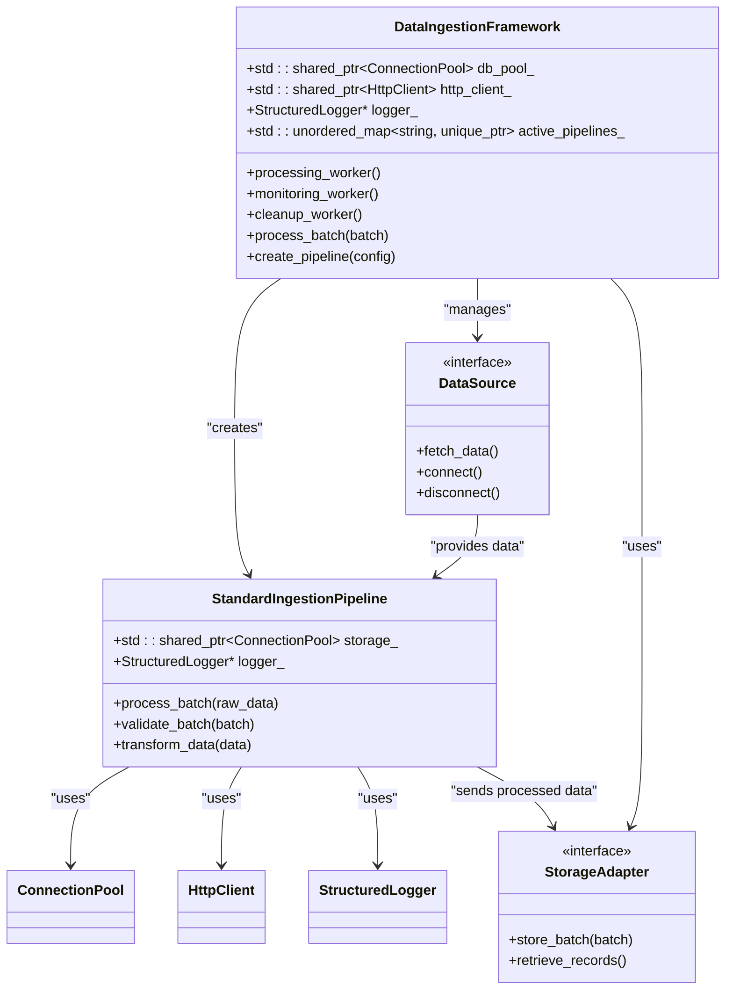

# Pipeline Architecture

<cite>
**Referenced Files in This Document**   
- [standard_ingestion_pipeline.hpp](file://shared/data_ingestion/pipelines/standard_ingestion_pipeline.hpp)
- [standard_ingestion_pipeline.cpp](file://shared/data_ingestion/pipelines/standard_ingestion_pipeline.cpp)
- [data_ingestion_framework.hpp](file://shared/data_ingestion/data_ingestion_framework.hpp)
</cite>

## Table of Contents
1. [Introduction](#introduction)
2. [Core Components](#core-components)
3. [Pipeline Configuration](#pipeline-configuration)
4. [Processing Stages](#processing-stages)
5. [Interface Methods](#interface-methods)
6. [Error Handling and Recovery](#error-handling-and-recovery)
7. [Performance Optimization](#performance-optimization)
8. [Integration with DataIngestionFramework](#integration-with-dataingestionframework)
9. [Extensibility and Customization](#extensibility-and-customization)
10. [Conclusion](#conclusion)

## Introduction
The StandardIngestionPipeline class is a production-grade data processing component within the Regulens system, designed to handle data from diverse sources through a comprehensive multi-stage processing workflow. This pipeline implements a robust architecture for data validation, transformation, enrichment, quality assurance, deduplication, and compliance checking. The pipeline is integrated with the DataIngestionFramework, which provides the overarching infrastructure for managing data sources, processing workflows, and storage operations. The design emphasizes configurability, performance optimization through caching and batch processing, and comprehensive error handling with retry mechanisms.

**Section sources**
- [standard_ingestion_pipeline.hpp](file://shared/data_ingestion/pipelines/standard_ingestion_pipeline.hpp#L1-L217)
- [data_ingestion_framework.hpp](file://shared/data_ingestion/data_ingestion_framework.hpp#L1-L299)

## Core Components
The StandardIngestionPipeline class is the central component of the data processing architecture, implementing the IngestionPipeline interface defined in the DataIngestionFramework. The pipeline processes data through a series of modular stages, each responsible for a specific aspect of data quality and transformation. The pipeline's behavior is controlled by the PipelineConfig structure, which defines which stages are enabled, validation rules, transformation configurations, enrichment rules, and other processing parameters. The pipeline maintains internal state including performance metrics, error counts, and caches for enrichment data and processed duplicate keys. The implementation leverages PostgreSQL for storage operations and external API calls for data enrichment, with comprehensive logging through the StructuredLogger component.

**Diagram sources**
- [standard_ingestion_pipeline.hpp](file://shared/data_ingestion/pipelines/standard_ingestion_pipeline.hpp#L1-L217)

**Section sources**
- [standard_ingestion_pipeline.hpp](file://shared/data_ingestion/pipelines/standard_ingestion_pipeline.hpp#L1-L217)
- [standard_ingestion_pipeline.cpp](file://shared/data_ingestion/pipelines/standard_ingestion_pipeline.cpp#L1-L2549)

## Pipeline Configuration
The pipeline's behavior is highly configurable through the PipelineConfig structure, which allows for fine-grained control over the processing workflow. The configuration includes a list of enabled stages that determine which processing steps are executed, with stages including validation, cleaning, transformation, enrichment, quality checking, duplicate detection, and compliance checking. Validation rules can be defined for required fields, data type checks, range validation, format validation, reference integrity, and business rules. Transformation configurations support field mapping, data type conversion, value normalization, encryption/masking, aggregation, and derived field creation. Enrichment rules can pull data from lookup tables, external APIs, or perform calculations, with options for caching results to improve performance. The configuration also includes parameters for duplicate detection, compliance checking, batch size, processing timeout, and error recovery settings.

```mermaid
flowchart TD
A[Pipeline Configuration] --> B[Enabled Stages]
A --> C[Validation Rules]
A --> D[Transformation Configurations]
A --> E[Enrichment Rules]
A --> F[Duplicate Detection Settings]
A --> G[Compliance Rules]
A --> H[Performance Parameters]
B --> B1[Validation]
B --> B2[Cleaning]
B --> B3[Transformation]
B --> B4[Enrichment]
B --> B5[Quality Check]
B --> B6[Duplicate Detection]
B --> B7[Compliance Check]
C --> C1[Required Fields]
C --> C2[Data Type Check]
C --> C3[Range Validation]
C --> C4[Format Validation]
C --> C5[Reference Integrity]
C --> C6[Business Rules]
D --> D1[Field Mapping]
D --> D2[Data Type Conversion]
D --> D3[Value Normalization]
D --> D4[Encryption/Masking]
D --> D5[Aggregation]
D --> D6[Derived Fields]
E --> E1[Lookup Table]
E --> E2[API Call]
E --> E3[Calculation]
F --> F1[Key Fields]
F --> F2[Fuzzy Matching]
G --> G1[PII Encryption]
G --> G2[Retention Period]
G --> G3[Required Fields]
H --> H1[Batch Size]
H --> H2[Processing Timeout]
H --> H3[Retry Attempts]
```

**Diagram sources**
- [standard_ingestion_pipeline.hpp](file://shared/data_ingestion/pipelines/standard_ingestion_pipeline.hpp#L1-L217)

**Section sources**
- [standard_ingestion_pipeline.hpp](file://shared/data_ingestion/pipelines/standard_ingestion_pipeline.hpp#L1-L217)
- [standard_ingestion_pipeline.cpp](file://shared/data_ingestion/pipelines/standard_ingestion_pipeline.cpp#L1-L2549)

## Processing Stages
The StandardIngestionPipeline processes data through a series of sequential stages, each performing a specific data quality or transformation function. The validation stage checks data against configured rules for required fields, data types, ranges, formats, reference integrity, and business rules. The cleaning stage normalizes data by trimming whitespace, removing control characters, standardizing line endings, and collapsing multiple spaces. The transformation stage applies field mappings, converts data types, normalizes values, performs aggregations, and creates derived fields. The enrichment stage enhances data by retrieving additional information from lookup tables, external APIs, or through calculations. The quality checking stage calculates a comprehensive data quality score based on completeness, validity, consistency, and accuracy metrics. The duplicate detection stage identifies and removes duplicate records using configurable key fields and optional fuzzy matching. Finally, the compliance checking stage verifies that data meets regulatory requirements for PII handling, data retention, and other compliance rules.

**Diagram sources**
- [standard_ingestion_pipeline.cpp](file://shared/data_ingestion/pipelines/standard_ingestion_pipeline.cpp#L1-L2549)

**Section sources**
- [standard_ingestion_pipeline.cpp](file://shared/data_ingestion/pipelines/standard_ingestion_pipeline.cpp#L1-L2549)

## Interface Methods
The StandardIngestionPipeline implements the IngestionPipeline interface with three primary methods: process_batch, validate_batch, and transform_data. The process_batch method is the main entry point for processing a batch of raw data, applying all enabled pipeline stages in sequence and returning an IngestionBatch object containing the processed data and metadata. The validate_batch method performs comprehensive validation of a batch, checking for empty data, missing batch IDs, invalid batch sizes, and timestamp consistency. The transform_data method applies basic transformations to individual data records, such as adding processing timestamps. Additional methods include set_pipeline_config for configuring the pipeline behavior, enable_stage and disable_stage for controlling which processing stages are active, and get_enabled_stages for querying the current pipeline configuration. These interface methods provide a consistent API for interacting with the pipeline, allowing it to be integrated into larger data processing workflows.

**Diagram sources**
- [standard_ingestion_pipeline.hpp](file://shared/data_ingestion/pipelines/standard_ingestion_pipeline.hpp#L1-L217)
- [data_ingestion_framework.hpp](file://shared/data_ingestion/data_ingestion_framework.hpp#L1-L299)

**Section sources**
- [standard_ingestion_pipeline.hpp](file://shared/data_ingestion/pipelines/standard_ingestion_pipeline.hpp#L1-L217)
- [standard_ingestion_pipeline.cpp](file://shared/data_ingestion/pipelines/standard_ingestion_pipeline.cpp#L1-L2549)

## Error Handling and Recovery
The pipeline implements comprehensive error handling strategies to ensure data integrity and processing reliability. For validation and transformation errors, the pipeline supports retry mechanisms with exponential backoff, allowing transient issues to resolve before failing permanently. When errors occur, the pipeline creates error batches containing the failed data and detailed error messages, which can be processed separately for analysis and correction. The handle_validation_error and handle_transformation_error methods determine whether an error is recoverable and whether retry attempts should be made based on the error type and number of previous attempts. The create_error_batch method constructs a specialized IngestionBatch for failed records, preserving the original data and error context for troubleshooting. The pipeline also tracks error metrics by type, helping to identify systemic issues in the data or processing workflow.

**Diagram sources**
- [standard_ingestion_pipeline.cpp](file://shared/data_ingestion/pipelines/standard_ingestion_pipeline.cpp#L1-L2549)

**Section sources**
- [standard_ingestion_pipeline.cpp](file://shared/data_ingestion/pipelines/standard_ingestion_pipeline.cpp#L1-L2549)

## Performance Optimization
The pipeline incorporates several performance optimization techniques to handle large volumes of data efficiently. Caching is used extensively for enrichment operations, with results stored in memory and automatically expired based on TTL settings. The enrichment_cache_ and cache_timestamps_ data structures track cached enrichment data and their creation times, while the cleanup_expired_cache method periodically removes expired entries to prevent memory growth. Batch processing is optimized through the batch_process_stage method, which processes large datasets in smaller chunks to manage memory usage and enable potential parallelization. The pipeline also implements intelligent stage skipping through the should_skip_stage method, which bypasses processing stages when data characteristics indicate they are unnecessary. Pipeline optimization is performed dynamically through the optimize_pipeline_for_source method, which adjusts configuration parameters based on historical processing performance and data patterns.

**Diagram sources**
- [standard_ingestion_pipeline.cpp](file://shared/data_ingestion/pipelines/standard_ingestion_pipeline.cpp#L1-L2549)

**Section sources**
- [standard_ingestion_pipeline.cpp](file://shared/data_ingestion/pipelines/standard_ingestion_pipeline.cpp#L1-L2549)

## Integration with DataIngestionFramework
The StandardIngestionPipeline is integrated into the broader DataIngestionFramework, which provides the infrastructure for managing data sources, processing workflows, and storage operations. The framework creates pipeline instances through the create_pipeline method, passing configuration and dependencies such as database connection pools and HTTP clients. Data flows from source components through the pipeline for processing, with the framework managing batch queuing, worker threads, and monitoring. The framework's process_batch method delegates to the pipeline's process_batch implementation, while also handling metrics collection, error recovery, and storage operations. The integration allows the pipeline to leverage the framework's connection pooling, retry logic, and monitoring capabilities, while providing a standardized interface for different data sources and processing requirements. This architecture enables the system to handle diverse data ingestion scenarios while maintaining consistent data quality and processing standards.

**Diagram sources**
- [data_ingestion_framework.hpp](file://shared/data_ingestion/data_ingestion_framework.hpp#L1-L299)
- [standard_ingestion_pipeline.hpp](file://shared/data_ingestion/pipelines/standard_ingestion_pipeline.hpp#L1-L217)

**Section sources**
- [data_ingestion_framework.hpp](file://shared/data_ingestion/data_ingestion_framework.hpp#L1-L299)
- [standard_ingestion_pipeline.hpp](file://shared/data_ingestion/pipelines/standard_ingestion_pipeline.hpp#L1-L217)

## Extensibility and Customization
The pipeline architecture is designed to be extensible and customizable for different data processing requirements. New processing stages can be added by extending the PipelineStage enum and implementing corresponding processing methods. Custom validation rules can be created by defining new ValidationRule types and implementing validation logic in dedicated methods. Transformation capabilities can be extended by adding new TransformationType values and implementing the corresponding transformation functions. Enrichment sources can be expanded by adding new source_type options and implementing the appropriate enrichment methods. The pipeline configuration system allows for runtime customization of processing behavior without code changes, enabling different configurations for various data sources or processing requirements. The modular design ensures that new functionality can be added with minimal impact on existing code, promoting maintainability and reducing the risk of introducing bugs.

**Section sources**
- [standard_ingestion_pipeline.hpp](file://shared/data_ingestion/pipelines/standard_ingestion_pipeline.hpp#L1-L217)
- [standard_ingestion_pipeline.cpp](file://shared/data_ingestion/pipelines/standard_ingestion_pipeline.cpp#L1-L2549)

## Conclusion
The StandardIngestionPipeline provides a comprehensive, production-grade solution for data processing within the Regulens system. Its modular architecture, extensive configuration options, and robust error handling make it suitable for processing data from diverse sources while ensuring data quality and compliance. The integration with the DataIngestionFramework provides a scalable infrastructure for managing data ingestion workflows, while the performance optimizations ensure efficient processing of large data volumes. The pipeline's design emphasizes flexibility and extensibility, allowing it to adapt to changing data processing requirements. By implementing best practices for data validation, transformation, enrichment, and quality assurance, the pipeline serves as a critical component in maintaining data integrity and reliability throughout the system.