# Source Integration

<cite>
**Referenced Files in This Document**   
- [web_scraping_source.hpp](file://shared/data_ingestion/sources/web_scraping_source.hpp)
- [web_scraping_source.cpp](file://shared/data_ingestion/sources/web_scraping_source.cpp)
- [database_source.hpp](file://shared/data_ingestion/sources/database_source.hpp)
- [database_source.cpp](file://shared/data_ingestion/sources/database_source.cpp)
- [rest_api_source.hpp](file://shared/data_ingestion/sources/rest_api_source.hpp)
- [rest_api_source.cpp](file://shared/data_ingestion/sources/rest_api_source.cpp)
- [data_ingestion_framework.hpp](file://shared/data_ingestion/data_ingestion_framework.hpp)
- [data_ingestion_framework.cpp](file://shared/data_ingestion/data_ingestion_framework.cpp)
- [postgresql_storage_adapter.hpp](file://shared/data_ingestion/storage/postgresql_storage_adapter.hpp)
</cite>

## Table of Contents
1. [Introduction](#introduction)
2. [DataSource Interface](#datasource-interface)
3. [WebScrapingSource Implementation](#webscrapingsource-implementation)
4. [DatabaseSource Implementation](#databasesource-implementation)
5. [RESTAPISource Implementation](#restapisource-implementation)
6. [Ingestion Framework Integration](#ingestion-framework-integration)
7. [Error Handling and Recovery](#error-handling-and-recovery)
8. [Configuration Options](#configuration-options)
9. [Lifecycle Management](#lifecycle-management)
10. [Common Issues and Solutions](#common-issues-and-solutions)

## Introduction
The Source Integration sub-component provides a pluggable architecture for ingesting regulatory data from diverse sources including web scraping, databases, and REST APIs. The system is designed to support continuous monitoring of regulatory changes with robust error handling, change detection, and anti-detection measures. This documentation details the implementation of the DataSource interface and its concrete implementations: WebScrapingSource, DatabaseSource, and RESTAPISource.

**Section sources**
- [data_ingestion_framework.hpp](file://shared/data_ingestion/data_ingestion_framework.hpp#L1-L299)
- [web_scraping_source.hpp](file://shared/data_ingestion/sources/web_scraping_source.hpp#L1-L201)

## DataSource Interface
The DataSource interface defines the contract for all data sources in the system, providing a consistent API for connection management, data retrieval, and validation. All concrete source implementations inherit from this base class and must implement its five core methods.

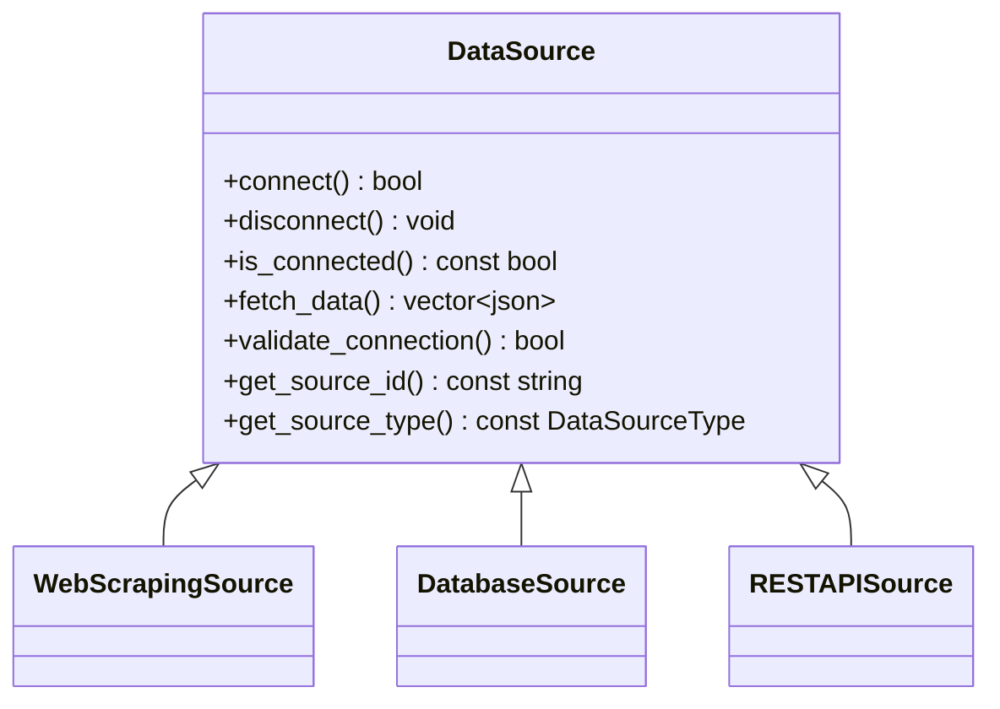
```mermaid
classDiagram
class DataSource {
+connect() bool
+disconnect() void
+is_connected() const bool
+fetch_data() vector~json~
+validate_connection() bool
+get_source_id() const string
+get_source_type() const DataSourceType
}
DataSource <|-- WebScrapingSource
DataSource <|-- DatabaseSource
DataSource <|-- RESTAPISource
```

**Diagram sources**
- [data_ingestion_framework.hpp](file://shared/data_ingestion/data_ingestion_framework.hpp#L245-L263)

### connect
The `connect` method establishes a connection to the data source. It returns a boolean indicating success or failure. For web scraping sources, this typically involves verifying network connectivity and authentication credentials. For database sources, it establishes a database connection through the connection pool.

### disconnect
The `disconnect` method cleanly terminates the connection to the data source, releasing any allocated resources such as network connections or database handles. This method is idempotent and can be safely called multiple times.

### is_connected
The `is_connected` method returns the current connection state of the data source. It provides a quick way to check if the source is ready to fetch data without attempting a full connection test.

### fetch_data
The `fetch_data` method retrieves data from the source and returns it as a vector of JSON objects. This is the primary method for data retrieval and is called by the ingestion framework during scheduled or on-demand data collection.

### validate_connection
The `validate_connection` method performs a comprehensive check of the connection health, going beyond a simple connectivity test to verify that the source is fully operational and ready to provide data.

**Section sources**
- [data_ingestion_framework.hpp](file://shared/data_ingestion/data_ingestion_framework.hpp#L245-L263)

## WebScrapingSource Implementation
The WebScrapingSource implementation provides advanced web scraping capabilities for monitoring regulatory websites and publications. It includes sophisticated change detection, anti-detection measures, and content extraction features.

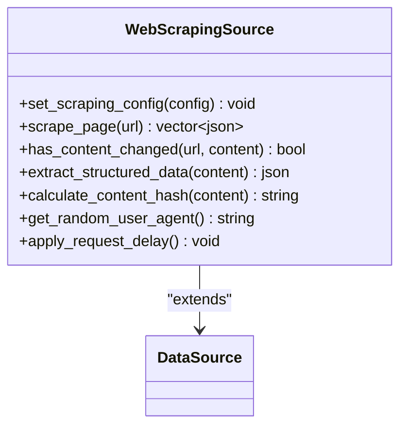
```mermaid
classDiagram
class WebScrapingSource {
+set_scraping_config(config) void
+scrape_page(url) vector~json~
+has_content_changed(url, content) bool
+extract_structured_data(content) json
+calculate_content_hash(content) string
+get_random_user_agent() string
+apply_request_delay() void
}
WebScrapingSource --> DataSource : "extends"
```

**Diagram sources**
- [web_scraping_source.hpp](file://shared/data_ingestion/sources/web_scraping_source.hpp#L1-L201)

### HTTP Request Handling
The WebScrapingSource uses the HttpClient component to make HTTP requests to target URLs. It supports various content types including HTML, XML, JSON, RSS, and Atom feeds. The implementation includes configurable request timeouts, redirect handling, and custom headers.

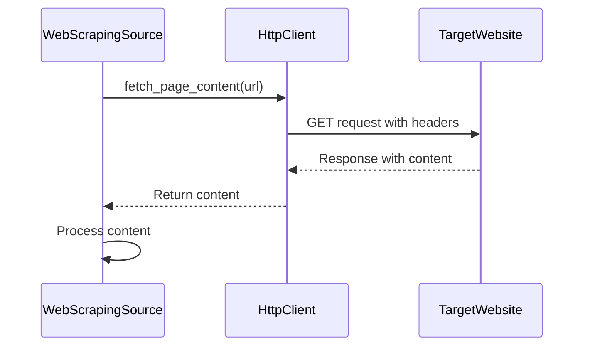
```mermaid
sequenceDiagram
participant WebScrapingSource
participant HttpClient
participant TargetWebsite
WebScrapingSource->>HttpClient : fetch_page_content(url)
HttpClient->>TargetWebsite : GET request with headers
TargetWebsite-->>HttpClient : Response with content
HttpClient-->>WebScrapingSource : Return content
WebScrapingSource->>WebScrapingSource : Process content
```

**Diagram sources**
- [web_scraping_source.cpp](file://shared/data_ingestion/sources/web_scraping_source.cpp#L272-L304)

### Content Extraction
Content extraction is performed using CSS selectors or regular expressions defined in the scraping rules. The implementation supports extracting text content, HTML fragments, attributes, and JSON data from the scraped content.

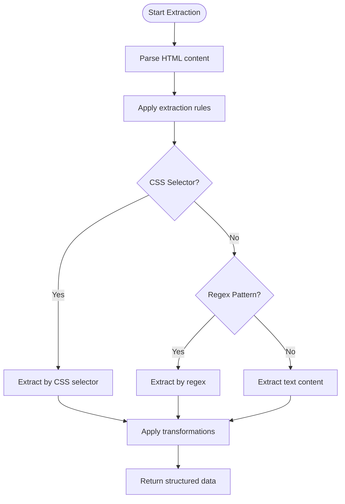
```mermaid
flowchart TD
Start([Start Extraction]) --> ParseHTML["Parse HTML content"]
ParseHTML --> ApplyRules["Apply extraction rules"]
ApplyRules --> CSSSelector{"CSS Selector?"}
CSSSelector --> |Yes| ExtractCSS["Extract by CSS selector"]
CSSSelector --> |No| RegexPattern{"Regex Pattern?"}
RegexPattern --> |Yes| ExtractRegex["Extract by regex"]
RegexPattern --> |No| ExtractText["Extract text content"]
ExtractCSS --> Transform["Apply transformations"]
ExtractRegex --> Transform
ExtractText --> Transform
Transform --> ReturnResult["Return structured data"]
```

**Diagram sources**
- [web_scraping_source.cpp](file://shared/data_ingestion/sources/web_scraping_source.cpp#L498-L539)

### Change Detection
Change detection is implemented using multiple strategies including content hashing, structure comparison, keyword matching, regex patterns, and DOM difference analysis. The default strategy uses content hashing to detect any changes in the scraped content.

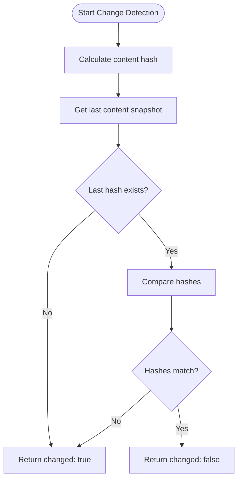
```mermaid
flowchart TD
Start([Start Change Detection]) --> CalculateHash["Calculate content hash"]
CalculateHash --> GetLastSnapshot["Get last content snapshot"]
GetLastSnapshot --> HashExists{"Last hash exists?"}
HashExists --> |No| ReturnChanged["Return changed: true"]
HashExists --> |Yes| CompareHashes["Compare hashes"]
CompareHashes --> HashesMatch{"Hashes match?"}
HashesMatch --> |Yes| ReturnUnchanged["Return changed: false"]
HashesMatch --> |No| ReturnChanged
```

**Diagram sources**
- [web_scraping_source.cpp](file://shared/data_ingestion/sources/web_scraping_source.cpp#L819-L861)

### Anti-Detection Measures
To avoid being blocked by target websites, the WebScrapingSource implements several anti-detection measures including user-agent rotation, request delays, and robots.txt compliance.

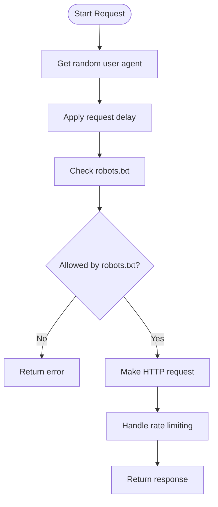
```mermaid
flowchart TD
Start([Start Request]) --> GetUserAgent["Get random user agent"]
GetUserAgent --> ApplyDelay["Apply request delay"]
ApplyDelay --> CheckRobots["Check robots.txt"]
CheckRobots --> RobotsAllow{"Allowed by robots.txt?"}
RobotsAllow --> |No| ReturnError["Return error"]
RobotsAllow --> |Yes| MakeRequest["Make HTTP request"]
MakeRequest --> HandleRateLimit["Handle rate limiting"]
HandleRateLimit --> ReturnResponse["Return response"]
```

**Diagram sources**
- [web_scraping_source.cpp](file://shared/data_ingestion/sources/web_scraping_source.cpp#L907-L948)

**Section sources**
- [web_scraping_source.hpp](file://shared/data_ingestion/sources/web_scraping_source.hpp#L1-L201)
- [web_scraping_source.cpp](file://shared/data_ingestion/sources/web_scraping_source.cpp#L1-L1148)

## DatabaseSource Implementation
The DatabaseSource implementation provides connectivity to various database systems including PostgreSQL, MySQL, SQL Server, Oracle, and others. It supports multiple query types, incremental loading, and change data capture.

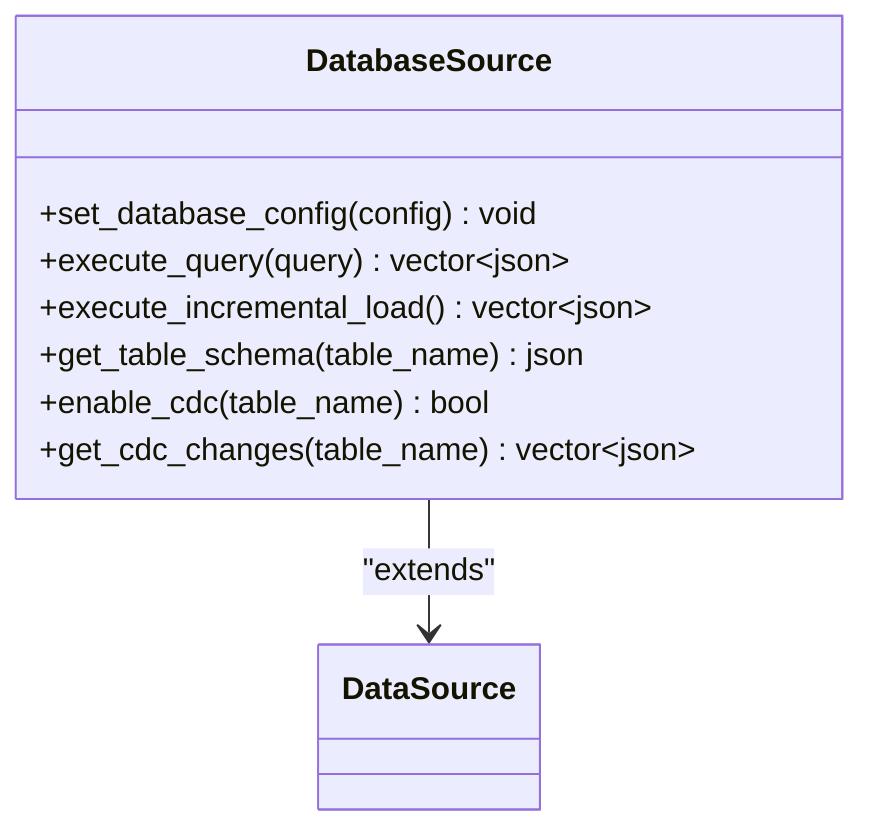
```mermaid
classDiagram
class DatabaseSource {
+set_database_config(config) void
+execute_query(query) vector~json~
+execute_incremental_load() vector~json~
+get_table_schema(table_name) json
+enable_cdc(table_name) bool
+get_cdc_changes(table_name) vector~json~
}
DatabaseSource --> DataSource : "extends"
```

**Diagram sources**
- [database_source.hpp](file://shared/data_ingestion/sources/database_source.hpp#L1-L212)

### Connection Management
The DatabaseSource manages database connections through a connection pool, supporting connection reuse and efficient resource management. It handles connection timeouts, SSL configuration, and additional database-specific parameters.

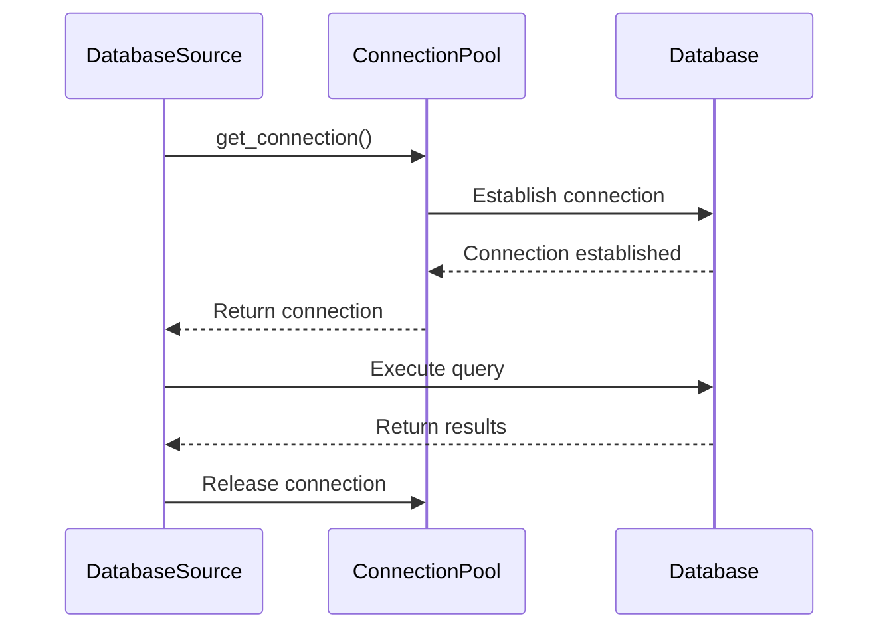
```mermaid
sequenceDiagram
participant DatabaseSource
participant ConnectionPool
participant Database
DatabaseSource->>ConnectionPool : get_connection()
ConnectionPool->>Database : Establish connection
Database-->>ConnectionPool : Connection established
ConnectionPool-->>DatabaseSource : Return connection
DatabaseSource->>Database : Execute query
Database-->>DatabaseSource : Return results
DatabaseSource->>ConnectionPool : Release connection
```

**Diagram sources**
- [database_source.cpp](file://shared/data_ingestion/sources/database_source.cpp#L279-L317)

### Query Execution
Query execution supports multiple types including SELECT queries, stored procedures, and change data capture. The implementation includes query preparation, parameter binding, and result transformation.

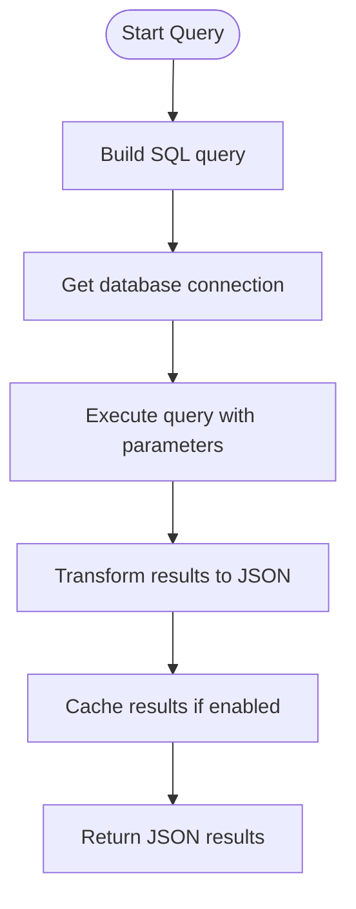
```mermaid
flowchart TD
Start([Start Query]) --> BuildSQL["Build SQL query"]
BuildSQL --> GetConnection["Get database connection"]
GetConnection --> ExecuteQuery["Execute query with parameters"]
ExecuteQuery --> TransformResults["Transform results to JSON"]
TransformResults --> CacheResults["Cache results if enabled"]
CacheResults --> ReturnResults["Return JSON results"]
```

**Diagram sources**
- [database_source.cpp](file://shared/data_ingestion/sources/database_source.cpp#L43-L90)

### Incremental Loading
Incremental loading is supported through multiple strategies including timestamp-based, sequence-based, change tracking, and log-based CDC. This allows efficient retrieval of only new or changed data since the last ingestion.

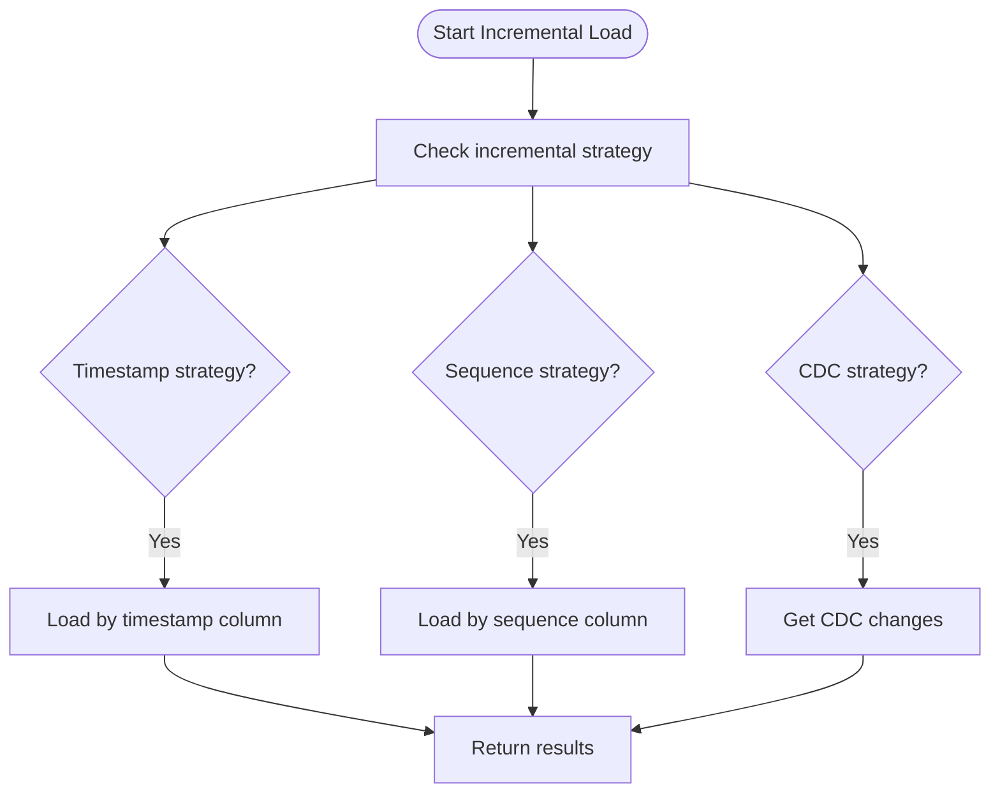
```mermaid
flowchart TD
Start([Start Incremental Load]) --> CheckStrategy["Check incremental strategy"]
CheckStrategy --> Timestamp{"Timestamp strategy?"}
Timestamp --> |Yes| LoadByTimestamp["Load by timestamp column"]
CheckStrategy --> Sequence{"Sequence strategy?"}
Sequence --> |Yes| LoadBySequence["Load by sequence column"]
CheckStrategy --> CDC{"CDC strategy?"}
CDC --> |Yes| GetCDCChanges["Get CDC changes"]
LoadByTimestamp --> ReturnResults["Return results"]
LoadBySequence --> ReturnResults
GetCDCChanges --> ReturnResults
```

**Diagram sources**
- [database_source.cpp](file://shared/data_ingestion/sources/database_source.cpp#L127-L161)

**Section sources**
- [database_source.hpp](file://shared/data_ingestion/sources/database_source.hpp#L1-L212)
- [database_source.cpp](file://shared/data_ingestion/sources/database_source.cpp#L1-L1223)

## RESTAPISource Implementation
The RESTAPISource implementation provides integration with RESTful APIs, supporting various authentication methods, pagination strategies, rate limiting, and response caching.

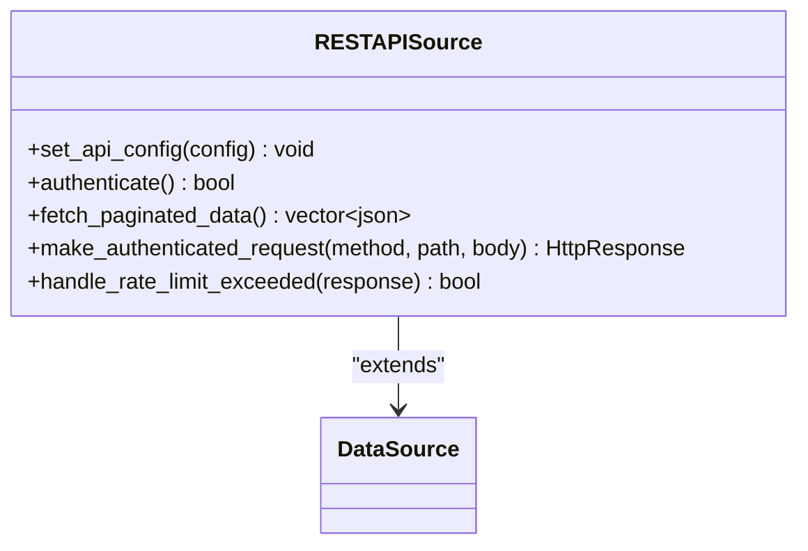
```mermaid
classDiagram
class RESTAPISource {
+set_api_config(config) void
+authenticate() bool
+fetch_paginated_data() vector~json~
+make_authenticated_request(method, path, body) HttpResponse
+handle_rate_limit_exceeded(response) bool
}
RESTAPISource --> DataSource : "extends"
```

**Diagram sources**
- [rest_api_source.hpp](file://shared/data_ingestion/sources/rest_api_source.hpp#L1-L148)

### Authentication
The RESTAPISource supports multiple authentication methods including API keys, basic auth, OAuth2, and JWT bearer tokens. Each authentication method is implemented with security best practices and error handling.

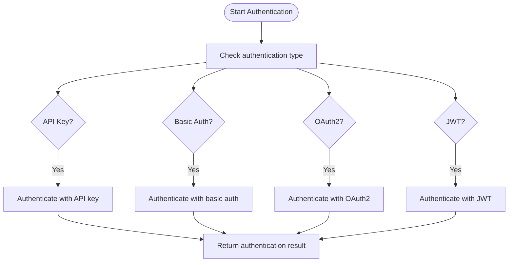
```mermaid
flowchart TD
Start([Start Authentication]) --> CheckAuthType["Check authentication type"]
CheckAuthType --> APIKey{"API Key?"}
APIKey --> |Yes| AuthenticateAPIKey["Authenticate with API key"]
CheckAuthType --> Basic{"Basic Auth?"}
Basic --> |Yes| AuthenticateBasic["Authenticate with basic auth"]
CheckAuthType --> OAuth2{"OAuth2?"}
OAuth2 --> |Yes| AuthenticateOAuth2["Authenticate with OAuth2"]
CheckAuthType --> JWT{"JWT?"}
JWT --> |Yes| AuthenticateJWT["Authenticate with JWT"]
AuthenticateAPIKey --> ReturnResult["Return authentication result"]
AuthenticateBasic --> ReturnResult
AuthenticateOAuth2 --> ReturnResult
AuthenticateJWT --> ReturnResult
```

**Diagram sources**
- [rest_api_source.cpp](file://shared/data_ingestion/sources/rest_api_source.cpp#L200-L233)

### Pagination Handling
Pagination is supported through multiple strategies including offset/limit, page-based, cursor-based, and link header pagination. This allows efficient retrieval of large datasets from APIs that implement pagination.

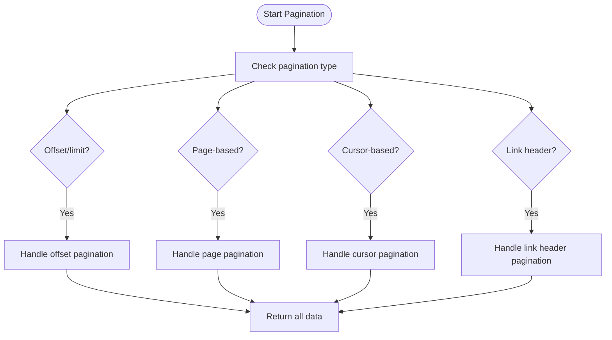
```mermaid
flowchart TD
Start([Start Pagination]) --> CheckPaginationType["Check pagination type"]
CheckPaginationType --> Offset{"Offset/limit?"}
Offset --> |Yes| HandleOffset["Handle offset pagination"]
CheckPaginationType --> Page{"Page-based?"}
Page --> |Yes| HandlePage["Handle page pagination"]
CheckPaginationType --> Cursor{"Cursor-based?"}
Cursor --> |Yes| HandleCursor["Handle cursor pagination"]
CheckPaginationType --> Link{"Link header?"}
Link --> |Yes| HandleLink["Handle link header pagination"]
HandleOffset --> ReturnData["Return all data"]
HandlePage --> ReturnData
HandleCursor --> ReturnData
HandleLink --> ReturnData
```

**Diagram sources**
- [rest_api_source.cpp](file://shared/data_ingestion/sources/rest_api_source.cpp#L308-L347)

### Rate Limiting and Caching
The implementation includes rate limiting protection with automatic handling of rate limit exceeded responses, and response caching to reduce API calls and improve performance.

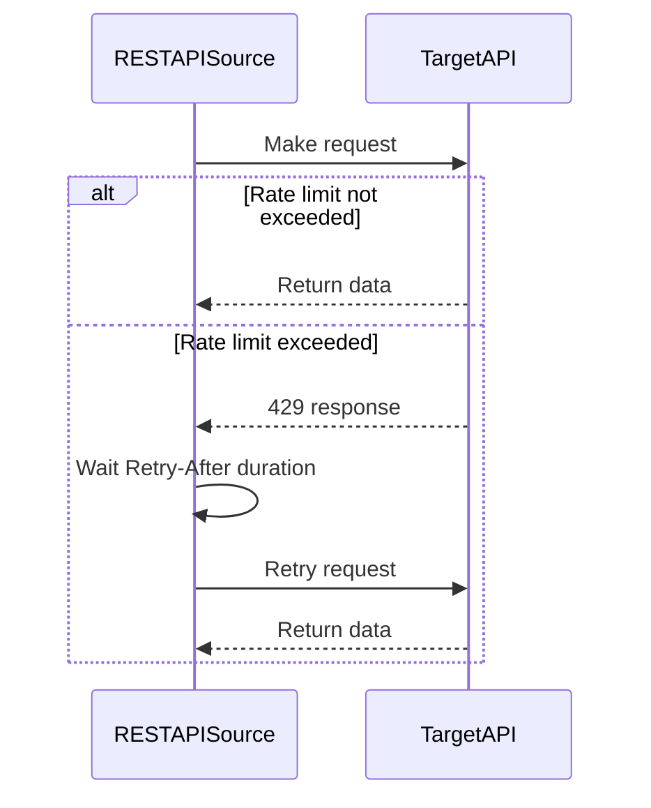
```mermaid
sequenceDiagram
participant RESTAPISource
participant TargetAPI
RESTAPISource->>TargetAPI : Make request
alt Rate limit not exceeded
TargetAPI-->>RESTAPISource : Return data
else Rate limit exceeded
TargetAPI-->>RESTAPISource : 429 response
RESTAPISource->>RESTAPISource : Wait Retry-After duration
RESTAPISource->>TargetAPI : Retry request
TargetAPI-->>RESTAPISource : Return data
end
```

**Diagram sources**
- [rest_api_source.cpp](file://shared/data_ingestion/sources/rest_api_source.cpp#L931-L976)

**Section sources**
- [rest_api_source.hpp](file://shared/data_ingestion/sources/rest_api_source.hpp#L1-L148)
- [rest_api_source.cpp](file://shared/data_ingestion/sources/rest_api_source.cpp#L1-L1046)

## Ingestion Framework Integration
The data sources integrate with the ingestion framework through a standardized interface that enables lifecycle management, error recovery, and monitoring.

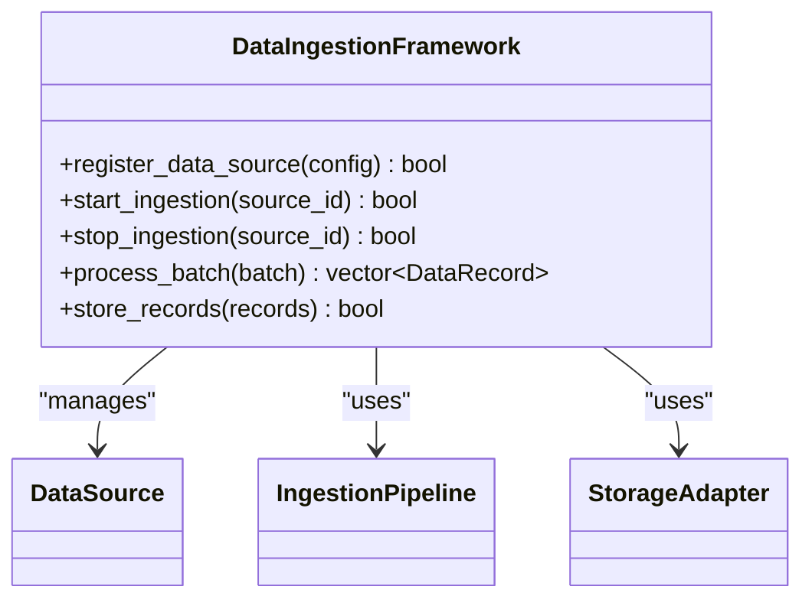
```mermaid
classDiagram
class DataIngestionFramework {
+register_data_source(config) bool
+start_ingestion(source_id) bool
+stop_ingestion(source_id) bool
+process_batch(batch) vector~DataRecord~
+store_records(records) bool
}
DataIngestionFramework --> DataSource : "manages"
DataIngestionFramework --> IngestionPipeline : "uses"
DataIngestionFramework --> StorageAdapter : "uses"
```

**Diagram sources**
- [data_ingestion_framework.hpp](file://shared/data_ingestion/data_ingestion_framework.hpp#L1-L299)

### Lifecycle Management
The ingestion framework manages the lifecycle of data sources, including registration, initialization, starting, stopping, and cleanup. This ensures proper resource management and graceful shutdown.

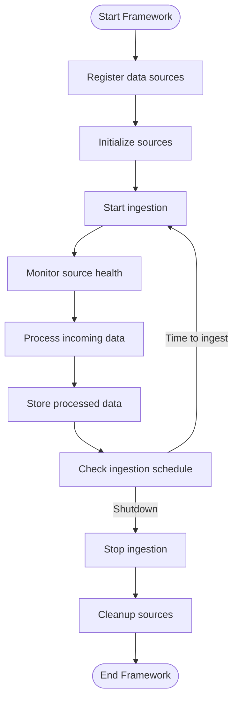
```mermaid
flowchart TD
Start([Start Framework]) --> RegisterSources["Register data sources"]
RegisterSources --> InitializeSources["Initialize sources"]
InitializeSources --> StartIngestion["Start ingestion"]
StartIngestion --> MonitorSources["Monitor source health"]
MonitorSources --> ProcessData["Process incoming data"]
ProcessData --> StoreData["Store processed data"]
StoreData --> CheckSchedule["Check ingestion schedule"]
CheckSchedule --> |Time to ingest| StartIngestion
CheckSchedule --> |Shutdown| StopIngestion["Stop ingestion"]
StopIngestion --> CleanupSources["Cleanup sources"]
CleanupSources --> End([End Framework])
```

**Diagram sources**
- [data_ingestion_framework.cpp](file://shared/data_ingestion/data_ingestion_framework.cpp#L200-L299)

**Section sources**
- [data_ingestion_framework.hpp](file://shared/data_ingestion/data_ingestion_framework.hpp#L1-L299)
- [data_ingestion_framework.cpp](file://shared/data_ingestion/data_ingestion_framework.cpp#L1-L831)

## Error Handling and Recovery
The source integration system implements comprehensive error handling and recovery mechanisms to ensure reliability and data integrity.

### Connection Timeouts
Connection timeouts are handled with configurable timeout values and retry logic. The system distinguishes between different types of connection errors and applies appropriate recovery strategies.

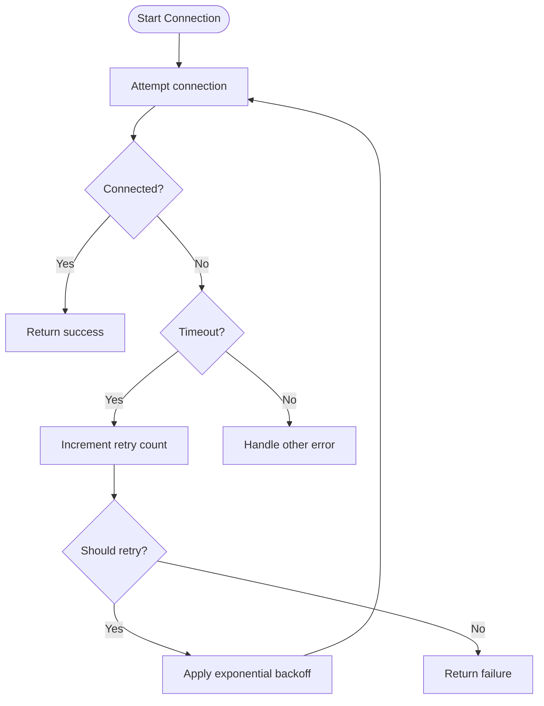
```mermaid
flowchart TD
Start([Start Connection]) --> AttemptConnect["Attempt connection"]
AttemptConnect --> Connected{"Connected?"}
Connected --> |Yes| ReturnSuccess["Return success"]
Connected --> |No| IsTimeout{"Timeout?"}
IsTimeout --> |Yes| IncrementRetry["Increment retry count"]
IsTimeout --> |No| HandleOtherError["Handle other error"]
IncrementRetry --> ShouldRetry{"Should retry?"}
ShouldRetry --> |Yes| ApplyBackoff["Apply exponential backoff"]
ApplyBackoff --> AttemptConnect
ShouldRetry --> |No| ReturnFailure["Return failure"]
```

**Diagram sources**
- [database_source.cpp](file://shared/data_ingestion/sources/database_source.cpp#L915-L948)

### Rate Limiting
Rate limiting is handled by tracking request counts within a sliding window and automatically pausing when the limit is approached. When a rate limit is exceeded, the system respects the Retry-After header and waits before retrying.

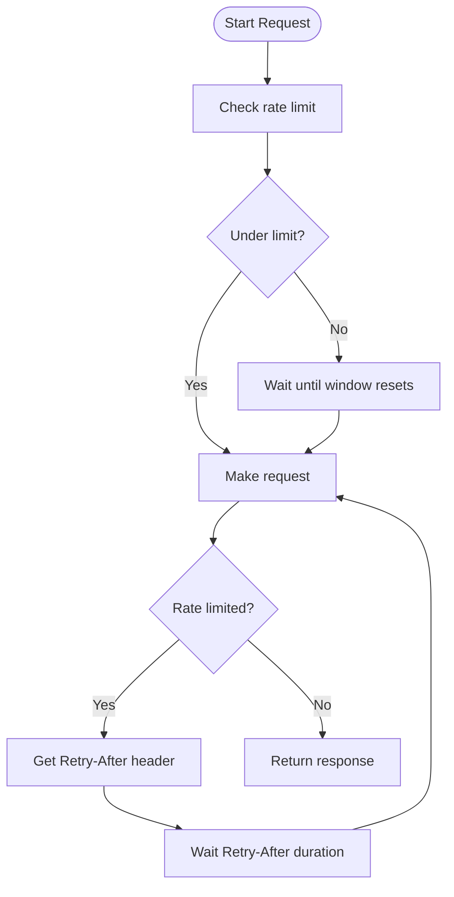
```mermaid
flowchart TD
Start([Start Request]) --> CheckRateLimit["Check rate limit"]
CheckRateLimit --> UnderLimit{"Under limit?"}
UnderLimit --> |Yes| MakeRequest["Make request"]
UnderLimit --> |No| Wait["Wait until window resets"]
Wait --> MakeRequest
MakeRequest --> RateLimited{"Rate limited?"}
RateLimited --> |Yes| GetRetryAfter["Get Retry-After header"]
GetRetryAfter --> WaitRetryAfter["Wait Retry-After duration"]
WaitRetryAfter --> MakeRequest
RateLimited --> |No| ReturnResponse["Return response"]
```

**Diagram sources**
- [rest_api_source.cpp](file://shared/data_ingestion/sources/rest_api_source.cpp#L647-L684)

### Content Parsing Errors
Content parsing errors are handled gracefully by returning partial results when possible and logging detailed error information for debugging. The system attempts to extract as much valid data as possible even when parsing fails.

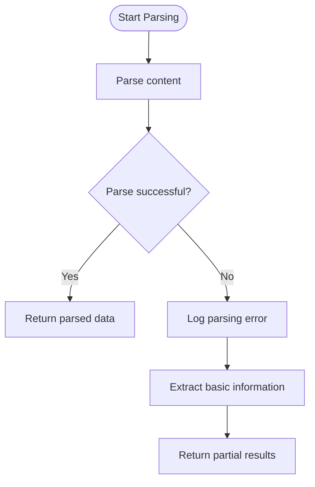
```mermaid
flowchart TD
Start([Start Parsing]) --> ParseContent["Parse content"]
ParseContent --> Success{"Parse successful?"}
Success --> |Yes| ReturnData["Return parsed data"]
Success --> |No| LogError["Log parsing error"]
LogError --> ExtractBasic["Extract basic information"]
ExtractBasic --> ReturnPartial["Return partial results"]
```

**Diagram sources**
- [web_scraping_source.cpp](file://shared/data_ingestion/sources/web_scraping_source.cpp#L53-L95)

**Section sources**
- [web_scraping_source.cpp](file://shared/data_ingestion/sources/web_scraping_source.cpp#L1-L1148)
- [database_source.cpp](file://shared/data_ingestion/sources/database_source.cpp#L1-L1223)
- [rest_api_source.cpp](file://shared/data_ingestion/sources/rest_api_source.cpp#L1-L1046)

## Configuration Options
The source integration system provides extensive configuration options for both scraping and database sources.

### Web Scraping Configuration
The WebScrapingConfig structure defines all configurable parameters for web scraping sources, including target URLs, selectors, and anti-detection measures.

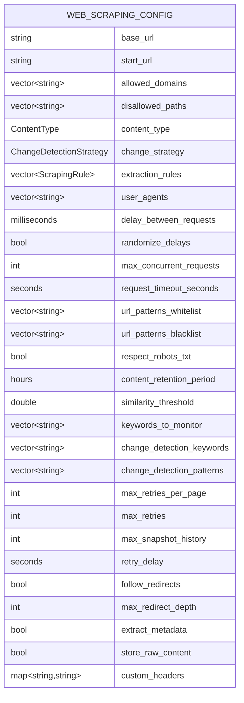
```mermaid
erDiagram
WEB_SCRAPING_CONFIG {
string base_url
string start_url
vector~string~ allowed_domains
vector~string~ disallowed_paths
ContentType content_type
ChangeDetectionStrategy change_strategy
vector~ScrapingRule~ extraction_rules
vector~string~ user_agents
milliseconds delay_between_requests
bool randomize_delays
int max_concurrent_requests
seconds request_timeout_seconds
vector~string~ url_patterns_whitelist
vector~string~ url_patterns_blacklist
bool respect_robots_txt
hours content_retention_period
double similarity_threshold
vector~string~ keywords_to_monitor
vector~string~ change_detection_keywords
vector~string~ change_detection_patterns
int max_retries_per_page
int max_retries
int max_snapshot_history
seconds retry_delay
bool follow_redirects
int max_redirect_depth
bool extract_metadata
bool store_raw_content
map~string,string~ custom_headers
}
```

**Diagram sources**
- [web_scraping_source.hpp](file://shared/data_ingestion/sources/web_scraping_source.hpp#L1-L201)

### Database Configuration
The DatabaseSourceConfig structure defines all configurable parameters for database sources, including connection parameters and query templates.

```mermaid
erDiagram
DATABASE_SOURCE_CONFIG {
DatabaseConnectionConfig connection
vector~DatabaseQuery~ queries
vector~string~ tables
IncrementalLoadConfig incremental_config
bool enable_change_tracking
seconds polling_interval
int max_parallel_queries
bool validate_schema
map~string,string~ table_mappings
}
DATABASE_CONNECTION_CONFIG {
DatabaseType db_type
string host
int port
string database
string username
string password
string connection_string
int max_connections
seconds connection_timeout
bool ssl_enabled
map~string,string~ ssl_params
map~string,string~ additional_params
}
DATABASE_QUERY {
string query_id
string sql_query
string procedure_name
QueryType query_type
map~string,json~ parameters
int batch_size
seconds execution_timeout
bool enable_caching
seconds cache_ttl
}
INCREMENTAL_LOAD_CONFIG {
IncrementalStrategy strategy
string incremental_column
string timestamp_column
string sequence_column
string last_value
int batch_size
bool include_deletes
}
```

**Diagram sources**
- [database_source.hpp](file://shared/data_ingestion/sources/database_source.hpp#L1-L212)

**Section sources**
- [web_scraping_source.hpp](file://shared/data_ingestion/sources/web_scraping_source.hpp#L1-L201)
- [database_source.hpp](file://shared/data_ingestion/sources/database_source.hpp#L1-L212)

## Lifecycle Management
The source integration system provides comprehensive lifecycle management for data sources, enabling controlled startup, shutdown, and error recovery.

```mermaid
stateDiagram-v2
[*] --> Unregistered
Unregistered --> Registered : register_data_source()
Registered --> Initialized : initialize()
Initialized --> Connected : connect()
Connected --> Processing : start_ingestion()
Processing --> Paused : pause_ingestion()
Paused --> Processing : resume_ingestion()
Processing --> Error : error occurred
Error --> Retrying : retry_failed_operation()
Retrying --> Connected : retry successful
Retrying --> Error : retry failed
Processing --> Disconnected : stop_ingestion()
Disconnected --> Connected : connect()
Disconnected --> [*] : shutdown()
```

**Diagram sources**
- [data_ingestion_framework.hpp](file://shared/data_ingestion/data_ingestion_framework.hpp#L1-L299)

**Section sources**
- [data_ingestion_framework.hpp](file://shared/data_ingestion/data_ingestion_framework.hpp#L1-L299)

## Common Issues and Solutions
The source integration system addresses common issues in data ingestion through built-in solutions.

### Connection Timeouts
Connection timeouts are addressed through exponential backoff retry strategies with configurable retry limits and delays. The system automatically retries failed connections with increasing delays between attempts.

### Rate Limiting
Rate limiting is managed through request counting and window-based limiting. When a rate limit is exceeded, the system respects the Retry-After header and waits the specified duration before retrying.

### Content Parsing Errors
Content parsing errors are mitigated through defensive programming and partial result extraction. The system attempts to extract as much valid data as possible even when parsing fails for certain elements.

### Anti-Detection
Anti-detection measures include user-agent rotation, randomized request delays, and robots.txt compliance checking. These measures help prevent IP blocking and ensure sustainable scraping operations.

### Data Consistency
Data consistency is maintained through change detection algorithms and content snapshotting. The system tracks content changes using hashing and similarity algorithms to ensure only new or modified content is processed.

**Section sources**
- [web_scraping_source.cpp](file://shared/data_ingestion/sources/web_scraping_source.cpp#L1-L1148)
- [database_source.cpp](file://shared/data_ingestion/sources/database_source.cpp#L1-L1223)
- [rest_api_source.cpp](file://shared/data_ingestion/sources/rest_api_source.cpp#L1-L1046)