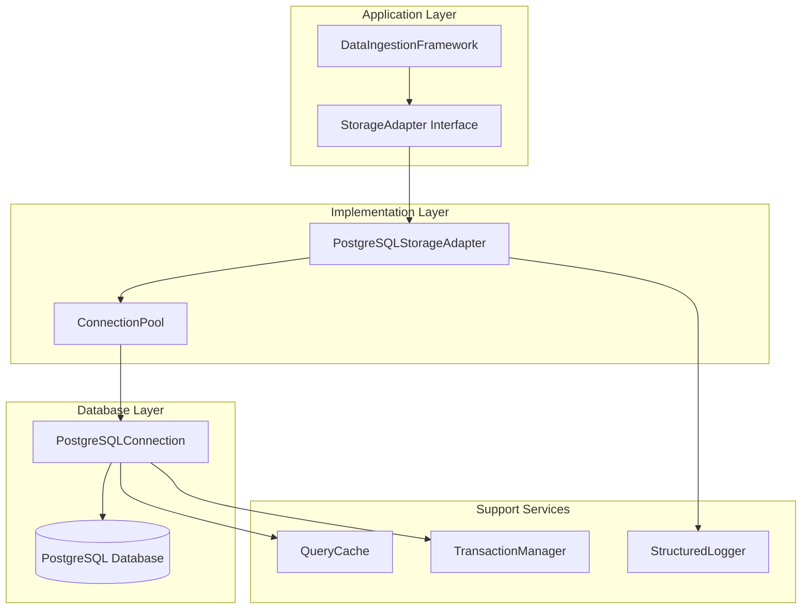
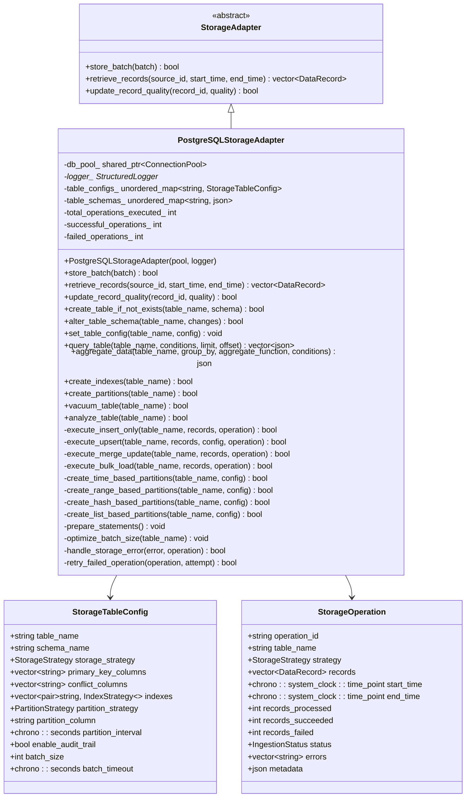
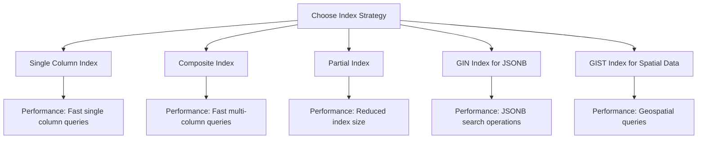
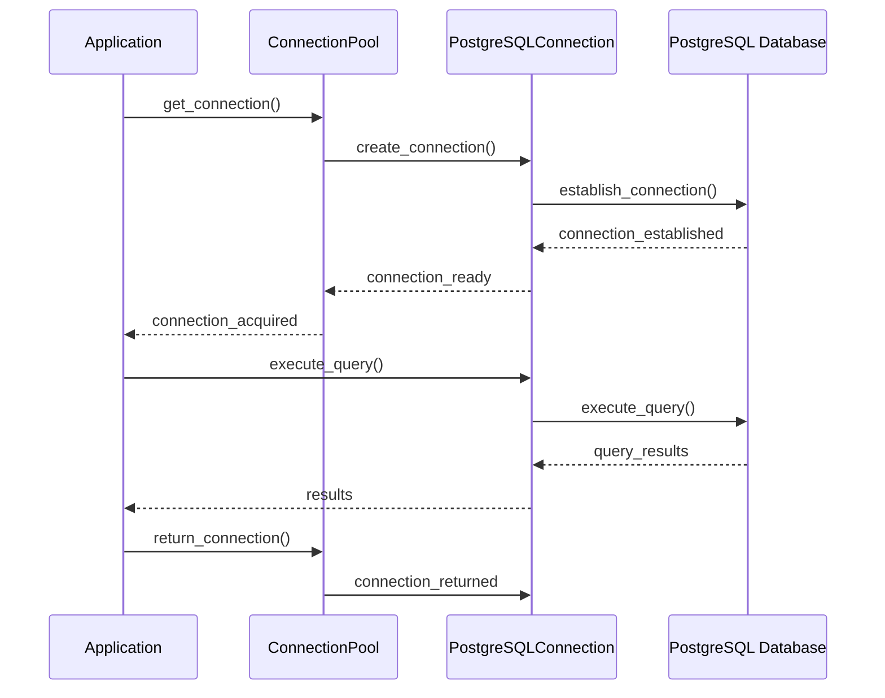
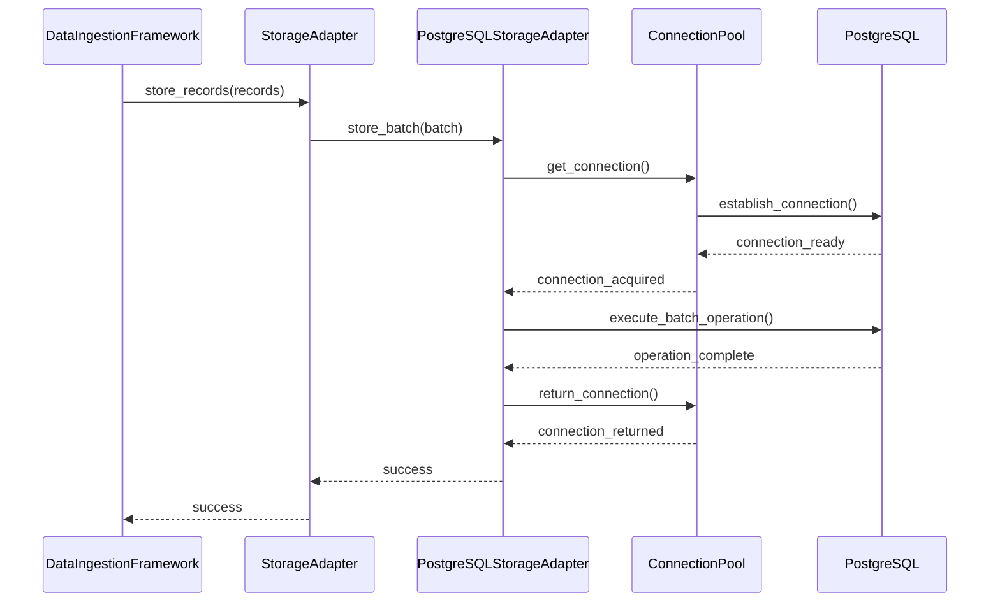
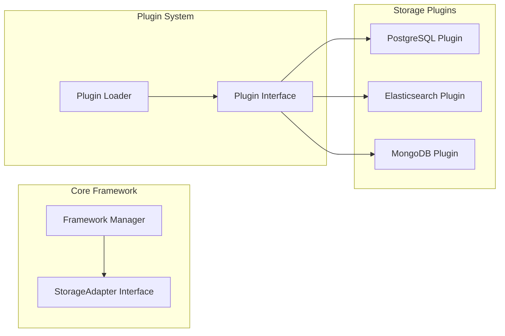

# Storage Adaptation

<cite>
**Referenced Files in This Document**
- [postgresql_storage_adapter.hpp](file://shared/data_ingestion/storage/postgresql_storage_adapter.hpp)
- [postgresql_storage_adapter.cpp](file://shared/data_ingestion/storage/postgresql_storage_adapter.cpp)
- [data_ingestion_framework.hpp](file://shared/data_ingestion/data_ingestion_framework.hpp)
- [data_ingestion_framework.cpp](file://shared/data_ingestion/data_ingestion_framework.cpp)
- [postgresql_connection.hpp](file://shared/database/postgresql_connection.hpp)
- [postgresql_connection.cpp](file://shared/database/postgresql_connection.cpp)
</cite>

## Table of Contents
1. [Introduction](#introduction)
2. [Architecture Overview](#architecture-overview)
3. [PostgreSQLStorageAdapter Implementation](#postgresqlstorageadapter-implementation)
4. [StorageAdapter Interface Methods](#storageadapter-interface-methods)
5. [Advanced Features](#advanced-features)
6. [Configuration Options](#configuration-options)
7. [Performance Optimizations](#performance-optimizations)
8. [Integration with DataIngestionFramework](#integration-with-dataingestionframework)
9. [Common Issues and Solutions](#common-issues-and-solutions)
10. [Extending the System](#extending-the-system)
11. [Conclusion](#conclusion)

## Introduction

The Storage Adaptation sub-component serves as the cornerstone of Regulens' data persistence layer, providing robust, scalable, and production-ready storage capabilities. At its heart lies the PostgreSQLStorageAdapter, a sophisticated implementation that transforms raw regulatory data into structured, queryable records while maintaining high performance and reliability standards.

This component bridges the gap between the DataIngestionFramework and the underlying PostgreSQL database, offering a unified interface for data storage, retrieval, and management. It handles everything from basic CRUD operations to complex partitioning strategies, ensuring optimal data organization and query performance.

## Architecture Overview

The Storage Adaptation system follows a layered architecture that separates concerns and promotes maintainability:



**Diagram sources**
- [postgresql_storage_adapter.hpp](file://shared/data_ingestion/storage/postgresql_storage_adapter.hpp#L87-L108)
- [data_ingestion_framework.hpp](file://shared/data_ingestion/data_ingestion_framework.hpp#L280-L297)

The architecture emphasizes separation of concerns, with each layer having distinct responsibilities:

- **Application Layer**: Manages high-level data ingestion workflows
- **Implementation Layer**: Provides concrete storage implementations
- **Database Layer**: Handles low-level database operations
- **Support Services**: Offers auxiliary functionality like logging and caching

**Section sources**
- [postgresql_storage_adapter.hpp](file://shared/data_ingestion/storage/postgresql_storage_adapter.hpp#L1-L50)
- [data_ingestion_framework.hpp](file://shared/data_ingestion/data_ingestion_framework.hpp#L1-L50)

## PostgreSQLStorageAdapter Implementation

The PostgreSQLStorageAdapter class serves as the primary storage backend, implementing the StorageAdapter interface with PostgreSQL-specific optimizations and features.

### Core Design Principles

The adapter embodies several key design principles:

1. **Production-Grade Reliability**: Comprehensive error handling, retry mechanisms, and connection pooling
2. **Performance Optimization**: Prepared statements, batch operations, and intelligent indexing
3. **Scalability**: Support for partitioning, connection pooling, and horizontal scaling
4. **Flexibility**: Configurable storage strategies and extensible architecture

### Class Structure and Dependencies



**Diagram sources**
- [postgresql_storage_adapter.hpp](file://shared/data_ingestion/storage/postgresql_storage_adapter.hpp#L87-L108)
- [postgresql_storage_adapter.hpp](file://shared/data_ingestion/storage/postgresql_storage_adapter.hpp#L45-L87)

**Section sources**
- [postgresql_storage_adapter.hpp](file://shared/data_ingestion/storage/postgresql_storage_adapter.hpp#L87-L208)
- [postgresql_storage_adapter.cpp](file://shared/data_ingestion/storage/postgresql_storage_adapter.cpp#L1-L50)

## StorageAdapter Interface Methods

The StorageAdapter interface defines three core methods that form the foundation of data persistence operations:

### store_batch Method

The `store_batch` method handles the ingestion of multiple data records in a single operation, optimizing for throughput and consistency:

```cpp
bool store_batch(const IngestionBatch& batch) override;
```

This method performs several critical operations:

1. **Batch Metadata Storage**: Inserts or updates batch metadata in the `ingestion_batches` table
2. **Individual Record Storage**: Processes each data record and stores it in the `data_records` table
3. **Upsert Strategy**: Uses PostgreSQL's `ON CONFLICT` clause to handle duplicates
4. **Transaction Management**: Ensures atomicity across all operations

Example usage:
```cpp
// Store a batch of regulatory data records
IngestionBatch batch;
batch.batch_id = "batch_001";
batch.source_id = "regulatory_source_1";
batch.data_records = records;

bool success = storage_adapter->store_batch(batch);
```

### retrieve_records Method

The `retrieve_records` method enables efficient data retrieval based on source ID and time range:

```cpp
std::vector<DataRecord> retrieve_records(
    const std::string& source_id,
    const std::chrono::system_clock::time_point& start_time,
    const std::chrono::system_clock::time_point& end_time
) override;
```

Key features include:
- **Time Range Filtering**: Efficiently retrieves records within specified time boundaries
- **JSONB Data Parsing**: Automatically parses PostgreSQL JSONB columns into native JSON objects
- **Array Parsing**: Handles PostgreSQL array columns (tags) and converts them to vectors
- **Quality Scoring**: Maintains data quality metrics throughout retrieval

### update_record_quality Method

The `update_record_quality` method provides centralized quality score management:

```cpp
bool update_record_quality(const std::string& record_id, DataQuality quality) override;
```

This method:
- Updates the `quality_score` field in the `data_records` table
- Sets the `last_updated` timestamp to track changes
- Supports atomic updates with transaction guarantees
- Integrates with the broader data quality monitoring system

**Section sources**
- [postgresql_storage_adapter.cpp](file://shared/data_ingestion/storage/postgresql_storage_adapter.cpp#L20-L125)
- [postgresql_storage_adapter.cpp](file://shared/data_ingestion/storage/postgresql_storage_adapter.cpp#L127-L200)
- [postgresql_storage_adapter.cpp](file://shared/data_ingestion/storage/postgresql_storage_adapter.cpp#L202-L250)

## Advanced Features

The PostgreSQLStorageAdapter implements several advanced features that enhance performance, scalability, and maintainability:

### Automatic Table Creation from Schema

The adapter automatically creates tables based on JSON schema definitions:

```cpp
bool create_table_if_not_exists(const std::string& table_name, const nlohmann::json& schema);
```

Features include:
- **Dynamic Schema Generation**: Creates tables based on JSON schema specifications
- **Index Creation**: Automatically generates indexes based on schema configuration
- **Column Type Mapping**: Maps JSON types to appropriate PostgreSQL data types
- **Constraint Handling**: Supports primary keys, unique constraints, and NOT NULL constraints

Example schema:
```json
{
    "columns": [
        {
            "name": "record_id",
            "type": "UUID",
            "primary_key": true
        },
        {
            "name": "data_content",
            "type": "JSONB",
            "nullable": false
        },
        {
            "name": "ingested_at",
            "type": "TIMESTAMP",
            "default": "CURRENT_TIMESTAMP"
        }
    ],
    "indexes": [
        {
            "name": "idx_data_content_gin",
            "type": "GIN",
            "columns": "data_content"
        }
    ]
}
```

### Index Management Strategies

The adapter supports multiple indexing strategies for optimal query performance:



**Diagram sources**
- [postgresql_storage_adapter.hpp](file://shared/data_ingestion/storage/postgresql_storage_adapter.hpp#L25-L35)

Each index type serves specific use cases:
- **Single Column**: Optimal for frequently queried individual fields
- **Composite**: Best for queries involving multiple columns
- **Partial**: Reduces index size for filtered datasets
- **GIN**: Enables efficient JSONB document searching
- **GIST**: Supports geospatial and full-text search operations

### Partitioning Strategies

The adapter implements four partitioning strategies to manage large datasets efficiently:

#### Time-Based Partitioning
```cpp
bool create_time_based_partitions(const std::string& table_name, const StorageTableConfig& config);
```

Creates partitions based on time intervals:
- **Monthly Partitions**: Ideal for temporal data with monthly granularity
- **Daily Partitions**: Suitable for high-frequency data ingestion
- **Custom Intervals**: Configurable partition sizes (hours, days, weeks)

#### Range-Based Partitioning
```cpp
bool create_range_based_partitions(const std::string& table_name, const StorageTableConfig& config);
```

Partitions based on numeric ranges:
- **Integer Ranges**: For numeric identifiers or scores
- **String Ranges**: For alphanumeric identifier ranges
- **Automatic Expansion**: New partitions created as data grows

#### Hash-Based Partitioning
```cpp
bool create_hash_based_partitions(const std::string& table_name, const StorageTableConfig& config);
```

Distributes data evenly across partitions:
- **Modulo Distribution**: Ensures balanced data distribution
- **Fixed Partition Count**: Typically 4-16 partitions
- **High Concurrency**: Excellent for concurrent write operations

#### List-Based Partitioning
```cpp
bool create_list_based_partitions(const std::string& table_name, const StorageTableConfig& config);
```

Partitions based on discrete values:
- **Category Partitioning**: For categorical data (regions, departments)
- **Static Values**: Pre-defined value sets
- **Flexible Cardinality**: Supports any number of partitions

**Section sources**
- [postgresql_storage_adapter.cpp](file://shared/data_ingestion/storage/postgresql_storage_adapter.cpp#L857-L896)
- [postgresql_storage_adapter.cpp](file://shared/data_ingestion/storage/postgresql_storage_adapter.cpp#L1436-L1569)

## Configuration Options

The StorageTableConfig structure provides comprehensive configuration options for customizing storage behavior:

### Storage Strategy Configuration

```cpp
enum class StorageStrategy {
    INSERT_ONLY,           // Basic INSERT operations
    UPSERT_ON_CONFLICT,   // INSERT ... ON CONFLICT
    MERGE_UPDATE,         // UPDATE + INSERT fallback
    BULK_LOAD,            // Optimized bulk loading
    PARTITIONED_STORAGE   // Partition-aware storage
};
```

Each strategy offers different trade-offs:
- **INSERT_ONLY**: Simple, reliable, but may cause conflicts
- **UPSERT_ON_CONFLICT**: Handles duplicates gracefully
- **MERGE_UPDATE**: Updates existing records, inserts new ones
- **BULK_LOAD**: Maximum throughput for large datasets
- **PARTITIONED_STORAGE**: Optimized for partitioned tables

### Index Strategy Configuration

```cpp
enum class IndexStrategy {
    NONE,
    SINGLE_COLUMN,
    COMPOSITE_INDEX,
    PARTIAL_INDEX,
    GIN_INDEX_JSONB,
    GIST_INDEX_SPATIAL
};
```

### Partition Strategy Configuration

```cpp
enum class PartitionStrategy {
    NONE,
    TIME_BASED,
    RANGE_BASED,
    HASH_BASED,
    LIST_BASED
};
```

### Complete Configuration Example

```cpp
StorageTableConfig config = {
    .table_name = "regulatory_records",
    .schema_name = "public",
    .storage_strategy = StorageStrategy::UPSERT_ON_CONFLICT,
    .primary_key_columns = {"record_id"},
    .conflict_columns = {"record_id"},
    .indexes = {
        {"ingested_at", IndexStrategy::SINGLE_COLUMN},
        {"source_id", IndexStrategy::SINGLE_COLUMN},
        {"data_content", IndexStrategy::GIN_INDEX_JSONB}
    },
    .partition_strategy = PartitionStrategy::TIME_BASED,
    .partition_column = "ingested_at",
    .partition_interval = std::chrono::hours(24),
    .enable_audit_trail = true,
    .batch_size = 1000,
    .batch_timeout = std::chrono::seconds(30)
};
```

**Section sources**
- [postgresql_storage_adapter.hpp](file://shared/data_ingestion/storage/postgresql_storage_adapter.hpp#L45-L87)
- [postgresql_storage_adapter.cpp](file://shared/data_ingestion/storage/postgresql_storage_adapter.cpp#L462-L485)

## Performance Optimizations

The PostgreSQLStorageAdapter implements numerous performance optimizations to ensure high-throughput data processing:

### Prepared Statements

Prepared statements reduce parsing overhead and improve query performance:

```cpp
void prepare_statements();
bool use_prepared_statement(const std::string& statement_name, const std::vector<std::string>& params);
```

Benefits include:
- **Reduced Parsing Overhead**: Statement parsing occurs once, execution multiple times
- **Parameter Validation**: Automatic parameter type checking and escaping
- **Connection Pool Efficiency**: Better utilization of connection pool resources

### Batch Size Tuning

Dynamic batch size optimization based on workload characteristics:

```cpp
void optimize_batch_size(const std::string& table_name);
```

Factors considered:
- **Table Size**: Larger tables may benefit from smaller batches
- **Network Latency**: Higher latency networks require larger batches
- **Memory Constraints**: Available memory affects optimal batch size
- **Throughput Targets**: Business requirements drive optimization

### Connection Pooling

Efficient connection management through the ConnectionPool class:



**Diagram sources**
- [postgresql_connection.hpp](file://shared/database/postgresql_connection.hpp#L80-L115)

### Query Performance Analysis

Built-in query performance monitoring and analysis:

```cpp
void analyze_query_performance();
```

Features include:
- **Slow Query Detection**: Identifies queries exceeding performance thresholds
- **Execution Plan Analysis**: Examines query execution plans
- **Index Utilization Tracking**: Monitors index usage effectiveness
- **Performance Trend Analysis**: Tracks performance over time

**Section sources**
- [postgresql_storage_adapter.cpp](file://shared/data_ingestion/storage/postgresql_storage_adapter.cpp#L1654-L1686)
- [postgresql_connection.cpp](file://shared/database/postgresql_connection.cpp#L195-L239)

## Integration with DataIngestionFramework

The Storage Adaptation system integrates seamlessly with the DataIngestionFramework, providing a unified data persistence layer:

### Framework Integration Architecture



**Diagram sources**
- [data_ingestion_framework.cpp](file://shared/data_ingestion/data_ingestion_framework.cpp#L361-L410)

### Data Flow Integration

The integration follows a well-defined data flow pattern:

1. **Record Collection**: DataIngestionFramework collects DataRecord objects
2. **Batch Formation**: Records are grouped into IngestionBatch objects
3. **Storage Request**: Framework requests storage via StorageAdapter interface
4. **Adapter Processing**: PostgreSQLStorageAdapter processes the batch
5. **Database Operation**: Actual database operations are performed
6. **Result Reporting**: Success/failure status is reported back

### Quality Assurance Integration

The system maintains data quality throughout the ingestion process:

```cpp
// Data quality tracking during ingestion
DataRecord record;
record.quality = DataQuality::VALIDATED;
record.data = validated_json;

// Quality score propagation
bool success = storage_adapter->update_record_quality(
    record.record_id, 
    record.quality
);
```

### Metrics and Monitoring

Integrated metrics collection provides visibility into storage operations:

```cpp
// Performance metrics
int total_operations_executed_;
int successful_operations_;
int failed_operations_;
std::chrono::microseconds total_operation_time_;

// Per-table metrics
std::unordered_map<std::string, int> table_operation_counts_;
std::unordered_map<std::string, std::chrono::microseconds> table_operation_times_;
```

**Section sources**
- [data_ingestion_framework.cpp](file://shared/data_ingestion/data_ingestion_framework.cpp#L361-L444)
- [data_ingestion_framework.cpp](file://shared/data_ingestion/data_ingestion_framework.cpp#L637-L667)

## Common Issues and Solutions

The PostgreSQLStorageAdapter addresses several common storage challenges with robust solutions:

### Constraint Violations

**Problem**: Duplicate key violations during upsert operations
**Solution**: Intelligent conflict resolution with configurable strategies

```cpp
// Upsert with conflict handling
std::string upsert_sql = "INSERT INTO " + table_name + 
    " (record_id, source_id, quality_score, data_content) VALUES ($1, $2, $3, $4::jsonb) " +
    generate_upsert_clause(config);
```

### Deadlocks

**Problem**: Concurrent operations causing deadlock situations
**Solution**: Transaction ordering and retry mechanisms

```cpp
bool retry_failed_operation(StorageOperation& operation, int attempt) {
    if (attempt < 3) {
        logger_->log(LogLevel::WARN, 
            "Retrying operation " + operation.operation_id + 
            " (attempt " + std::to_string(attempt + 1) + ")");
        return true;
    }
    return false;
}
```

### Performance Bottlenecks

**Problem**: Slow query performance with large datasets
**Solution**: Multi-layered optimization approach

1. **Index Strategy Selection**: Choose appropriate indexes for query patterns
2. **Partitioning**: Distribute data across manageable chunks
3. **Batch Size Optimization**: Tune batch sizes for optimal throughput
4. **Connection Pooling**: Efficient resource utilization

### Connection Pool Exhaustion

**Problem**: Too many concurrent connections exhausting the pool
**Solution**: Connection lifecycle management and timeout handling

```cpp
// Connection lifecycle management
auto conn = db_pool_->get_connection();
if (!conn) {
    logger_->log(LogLevel::ERROR, "Failed to acquire database connection");
    return false;
}
// ... perform operations ...
db_pool_->return_connection(std::move(conn));
```

### Data Integrity Issues

**Problem**: Data corruption or loss during storage operations
**Solution**: Comprehensive error handling and transaction management

```cpp
try {
    conn->begin_transaction();
    // Perform multiple operations
    conn->commit_transaction();
} catch (const std::exception& e) {
    conn->rollback_transaction();
    logger_->log(LogLevel::ERROR, "Transaction failed: " + std::string(e.what()));
}
```

**Section sources**
- [postgresql_storage_adapter.cpp](file://shared/data_ingestion/storage/postgresql_storage_adapter.cpp#L1620-L1650)
- [postgresql_storage_adapter.cpp](file://shared/data_ingestion/storage/postgresql_storage_adapter.cpp#L1654-L1686)

## Extending the System

The Storage Adaptation system is designed for extensibility, allowing easy addition of new storage backends:

### Adding New Storage Adapters

To add a new storage adapter, implement the StorageAdapter interface:

```cpp
class NewStorageAdapter : public StorageAdapter {
public:
    NewStorageAdapter(std::shared_ptr<ConnectionPool> db_pool, StructuredLogger* logger);
    
    bool store_batch(const IngestionBatch& batch) override;
    std::vector<DataRecord> retrieve_records(const std::string& source_id,
                                           const std::chrono::system_clock::time_point& start_time,
                                           const std::chrono::system_clock::time_point& end_time) override;
    bool update_record_quality(const std::string& record_id, DataQuality quality) override;
    
    // Additional methods specific to the new storage backend
    bool store_raw_data(const std::string& table_name, const nlohmann::json& data);
    nlohmann::json query_raw_data(const std::string& table_name, const nlohmann::json& conditions);
};
```

### Backend-Specific Features

Different storage backends can implement specialized features:

- **Elasticsearch**: Full-text search, analytics, and aggregation
- **Redis**: Caching, session management, and real-time analytics
- **S3**: Object storage for large binary data and backups
- **MongoDB**: Flexible schema, document storage, and geospatial queries

### Configuration-Based Backend Selection

Future enhancements could include configuration-driven backend selection:

```cpp
// Configuration-driven adapter selection
std::unique_ptr<StorageAdapter> create_storage_adapter(
    const std::string& backend_type, 
    const DatabaseConfig& config
) {
    if (backend_type == "postgresql") {
        return std::make_unique<PostgreSQLStorageAdapter>(
            std::make_shared<ConnectionPool>(config), 
            logger
        );
    } else if (backend_type == "elasticsearch") {
        return std::make_unique<ElasticsearchStorageAdapter>(config, logger);
    }
    // ... other backends
}
```

### Plugin Architecture

Consider implementing a plugin architecture for third-party storage adapters:



**Section sources**
- [postgresql_storage_adapter.hpp](file://shared/data_ingestion/storage/postgresql_storage_adapter.hpp#L87-L108)
- [data_ingestion_framework.hpp](file://shared/data_ingestion/data_ingestion_framework.hpp#L280-L297)

## Conclusion

The Storage Adaptation sub-component represents a sophisticated, production-ready solution for data persistence in the Regulens ecosystem. Through its PostgreSQLStorageAdapter implementation, it delivers:

**Key Achievements:**
- **Robust Data Persistence**: Reliable storage with comprehensive error handling and retry mechanisms
- **High Performance**: Optimized for throughput with prepared statements, batch operations, and intelligent indexing
- **Scalability**: Support for partitioning strategies and connection pooling ensures growth capacity
- **Flexibility**: Extensible architecture allows for future backend additions and customization
- **Maintainability**: Clean separation of concerns and comprehensive logging facilitate ongoing maintenance

**Technical Excellence:**
The implementation demonstrates advanced PostgreSQL features including:
- Dynamic table creation and schema management
- Multiple partitioning strategies for optimal data organization
- Comprehensive indexing strategies for query optimization
- Transaction management and concurrency control
- Performance monitoring and optimization

**Future Roadmap:**
The extensible architecture positions the system for future enhancements:
- Additional storage backends (Elasticsearch, Redis, S3)
- Advanced analytics and reporting capabilities
- Real-time data streaming integration
- Enhanced security and encryption features

The Storage Adaptation sub-component stands as a testament to thoughtful engineering, providing a solid foundation for the Regulens platform's data persistence needs while maintaining the flexibility to evolve with changing requirements.