# Database Schema

<cite>
**Referenced Files in This Document**   
- [schema.sql](file://schema.sql)
- [seed_data.sql](file://seed_data.sql)
- [regulatory_change.hpp](file://shared/models/regulatory_change.hpp)
- [agent_decision.hpp](file://shared/models/agent_decision.hpp)
- [compliance_event.hpp](file://shared/models/compliance_event.hpp)
- [agent_activity.hpp](file://shared/models/agent_activity.hpp)
- [risk_assessment_types.hpp](file://shared/models/risk_assessment_types.hpp)
</cite>

## Table of Contents
1. [Introduction](#introduction)
2. [Core Compliance Tables](#core-compliance-tables)
3. [Entity Relationships](#entity-relationships)
4.. [Field Definitions and Data Types](#field-definitions-and-data-types)
5. [Primary and Foreign Keys](#primary-and-foreign-keys)
6. [Indexes and Constraints](#indexes-and-constraints)
7. [Data Validation and Business Rules](#data-validation-and-business-rules)
8. [Data Access Patterns](#data-access-patterns)
9. [Caching Strategies](#caching-strategies)
10. [Performance Considerations](#performance-considerations)
11. [Data Lifecycle and Retention](#data-lifecycle-and-retention)
12. [Data Security and Access Control](#data-security-and-access-control)
13. [Sample Data](#sample-data)
14. [Conclusion](#conclusion)

## Introduction

The Regulens Agentic AI Compliance System database schema is a production-grade PostgreSQL implementation designed to support comprehensive compliance monitoring, regulatory change assessment, and transaction guardian capabilities. The schema is structured to handle three primary proof-of-concept (POC) implementations: Transaction Guardian, Regulatory Assessor, and Audit Intelligence. It incorporates advanced features such as vector embeddings for semantic search, comprehensive audit logging, and real-time collaboration infrastructure.

The database schema supports agentic AI operations by providing persistent storage for compliance events, agent decisions, regulatory changes, knowledge base entries, and user management. It includes specialized tables for machine learning model storage, pattern recognition, multi-criteria decision analysis (MCDA), and function calling debugging. The schema is optimized for high-performance queries with extensive indexing, including GIN indexes for JSONB fields, trigram indexes for text search, and specialized indexes for time-series data.

**Section sources**
- [schema.sql](file://schema.sql#L1-L8473)

## Core Compliance Tables

The Regulens database schema is organized around several core compliance tables that serve as the foundation for the agentic AI system. These tables capture compliance events, agent decisions, regulatory changes, and knowledge base entries, forming the central data model for the compliance monitoring system.

The `compliance_events` table records all events that may trigger agentic AI analysis or action, including transaction events, regulatory events, audit events, and system events. Each event includes metadata about its type, severity, source, and timestamp. The `agent_decisions` table stores decisions made by various agents in the system, including the decision type, confidence level, reasoning, and recommended actions. This table is linked to compliance events through foreign key relationships.

The `regulatory_changes` table tracks regulatory documents and requirements from various regulators, including publication dates, effective dates, and compliance deadlines. The `knowledge_base` table stores regulatory knowledge with vector embeddings for semantic search capabilities, enabling the system to perform advanced natural language queries against regulatory content. Additional core tables include `feedback_events` for capturing feedback on agent decisions, `text_analysis_results` for storing LLM analysis results, and `policy_generation_results` for tracking generated compliance policies.

```mermaid
erDiagram
compliance_events ||--o{ agent_decisions : "triggers"
regulatory_changes ||--o{ regulatory_documents : "contains"
knowledge_base ||--o{ knowledge_entities : "extends"
user_authentication ||--o{ api_keys : "manages"
user_authentication ||--o{ jwt_refresh_tokens : "uses"
user_authentication ||--o{ login_history : "records"
compliance_events {
UUID event_id PK
VARCHAR(50) event_type
VARCHAR(20) severity
TEXT description
VARCHAR(100) source_type
VARCHAR(255) source_id
VARCHAR(255) source_location
JSONB event_metadata
TIMESTAMP WITH TIME ZONE occurred_at
TIMESTAMP WITH TIME ZONE processed_at
TIMESTAMP WITH TIME ZONE created_at
TIMESTAMP WITH TIME ZONE updated_at
}
agent_decisions {
UUID decision_id PK
UUID event_id FK
VARCHAR(100) agent_type
VARCHAR(255) agent_name
VARCHAR(50) decision_type
VARCHAR(20) confidence_level
JSONB reasoning
JSONB recommended_actions
JSONB risk_assessment
TIMESTAMP WITH TIME ZONE decision_timestamp
INTEGER execution_time_ms
TIMESTAMP WITH TIME ZONE created_at
}
regulatory_changes {
UUID change_id PK
VARCHAR(100) source
TEXT title
TEXT description
VARCHAR(50) change_type
DATE effective_date
TEXT document_url
TEXT document_content
JSONB extracted_entities
JSONB impact_assessment
VARCHAR(20) status
VARCHAR(20) severity
TIMESTAMP WITH TIME ZONE detected_at
TIMESTAMP WITH TIME ZONE analyzed_at
TIMESTAMP WITH TIME ZONE distributed_at
TIMESTAMP WITH TIME ZONE created_at
TIMESTAMP WITH TIME ZONE updated_at
}
knowledge_base {
UUID knowledge_id PK
TEXT key
TEXT content
VARCHAR(50) content_type
TEXT[] tags
VECTOR(384) embeddings
VARCHAR(255) source
DECIMAL(3,2) confidence_score
TIMESTAMP WITH TIME ZONE last_updated
TIMESTAMP WITH TIME ZONE created_at
}
```

**Diagram sources**
- [schema.sql](file://schema.sql#L15-L199)
- [regulatory_change.hpp](file://shared/models/regulatory_change.hpp#L1-L336)
- [agent_decision.hpp](file://shared/models/agent_decision.hpp#L1-L333)

## Entity Relationships

The Regulens database schema implements a comprehensive entity relationship model that connects compliance events, agent decisions, regulatory changes, and knowledge base entries. These relationships enable the agentic AI system to correlate data across different domains and provide context-aware decision-making.

The primary relationship is between `compliance_events` and `agent_decisions`, where each compliance event can trigger one or more agent decisions. This one-to-many relationship allows multiple agents to analyze the same event and provide different perspectives or recommendations. The `agent_decisions` table references the `compliance_events` table through the `event_id` foreign key, ensuring referential integrity.

Regulatory changes are linked to business processes through the `regulatory_impacts` table, which assesses the impact of regulatory documents on specific business processes. This many-to-many relationship enables the system to identify which regulatory changes affect which business operations and prioritize implementation efforts accordingly. The `knowledge_entities` table is connected to the `knowledge_relationships` table, forming a graph structure that represents relationships between different knowledge elements.

User management entities are interconnected through several relationships. The `user_authentication` table serves as the central user repository, with related tables for API keys, JWT refresh tokens, and login history. These relationships support secure authentication, authorization, and audit capabilities. The `agent_configurations` table links to agents, allowing for configuration management based on agent type and name.

```mermaid
erDiagram
compliance_events ||--o{ agent_decisions : "triggers"
compliance_events ||--o{ compliance_violations : "may cause"
regulatory_changes ||--o{ regulatory_impacts : "affects"
business_processes ||--o{ regulatory_impacts : "impacted by"
user_authentication ||--o{ api_keys : "owns"
user_authentication ||--o{ jwt_refresh_tokens : "uses"
user_authentication ||--o{ login_history : "generates"
user_authentication ||--o{ user_permissions : "has"
agent_configurations ||--o{ agent_runtime_status : "has"
agent_configurations ||--o{ agent_outputs : "produces"
agent_configurations ||--o{ tool_usage_logs : "generates"
knowledge_entities ||--o{ knowledge_relationships : "source"
knowledge_entities ||--o{ knowledge_relationships : "target"
knowledge_entities ||--o{ learning_interactions : "selected"
pattern_definitions ||--o{ pattern_analysis_results : "produces"
mcda_models ||--o{ mcda_criteria : "contains"
mcda_models ||--o{ mcda_evaluations : "evaluates"
llm_api_keys ||--o{ llm_key_usage : "generates"
collaboration_sessions ||--o{ collaboration_agents : "contains"
collaboration_sessions ||--o{ collaboration_reasoning_stream : "contains"
collaboration_sessions ||--o{ human_overrides : "may have"
alert_rules ||--o{ alert_delivery_log : "triggers"
export_templates ||--o{ export_requests : "used by"
report_schedules ||--o{ export_requests : "generates"
```



**Diagram sources**
- [schema.sql](file://schema.sql#L15-L2899)
- [regulatory_change.hpp](file://shared/models/regulatory_change.hpp#L1-L336)
- [agent_decision.hpp](file://shared/models/agent_decision.hpp#L1-L333)

## Field Definitions and Data Types

The Regulens database schema employs a comprehensive set of field definitions and data types to support the requirements of an agentic AI compliance system. The schema uses UUIDs as primary keys for all tables, ensuring global uniqueness and preventing enumeration attacks. Timestamps are stored with time zone information to support global operations and accurate event sequencing.

The schema makes extensive use of PostgreSQL's JSONB data type for flexible storage of semi-structured data. This is particularly important for storing agent reasoning, risk assessments, and other complex data structures that may vary between different agent types or over time. The JSONB fields allow for efficient querying and indexing while maintaining schema flexibility. For example, the `reasoning` field in the `agent_decisions` table stores an array of reasoning components, each with a factor, evidence, weight, and source.

Text fields are used extensively for storing regulatory content, descriptions, and other textual data. The schema includes full-text search capabilities through trigram indexes on key text fields, enabling efficient fuzzy matching and similarity searches. For numerical data, the schema uses appropriate precision types, such as DECIMAL for financial amounts and risk scores, and INTEGER for counts and identifiers.

Specialized data types include the VECTOR type from the pgvector extension, which is used for storing embeddings in the `knowledge_entities` and `compliance_cases` tables. This enables semantic search and similarity matching capabilities. The schema also uses ARRAY types for storing tags and other multi-value attributes, and INET types for storing IP addresses in audit and security tables.

**Section sources**
- [schema.sql](file://schema.sql#L15-L8473)
- [regulatory_change.hpp](file://shared/models/regulatory_change.hpp#L1-L336)
- [agent_decision.hpp](file://shared/models/agent_decision.hpp#L1-L333)

## Primary and Foreign Keys

The Regulens database schema implements a robust primary and foreign key system to ensure data integrity and enable efficient joins between related tables. All primary keys use UUID data type with default values generated by the `uuid_generate_v4()` function, providing globally unique identifiers that prevent enumeration attacks and support distributed systems.

The foreign key relationships are designed to maintain referential integrity while supporting the hierarchical nature of compliance data. For example, the `agent_decisions` table has a foreign key relationship with the `compliance_events` table through the `event_id` field, ensuring that every agent decision is associated with a valid compliance event. Similarly, the `transaction_risk_assessments` table references the `transactions` table through the `transaction_id` field, linking risk assessments to specific transactions.

The schema includes cascading delete constraints where appropriate to maintain data consistency. For example, when a user is deleted from the `user_authentication` table, their associated API keys and JWT refresh tokens are automatically deleted through CASCADE constraints. This prevents orphaned records and simplifies data management. The `knowledge_relationships` table has CASCADE constraints on both source and target entity IDs, ensuring that relationships are automatically cleaned up when referenced entities are deleted.

Composite foreign keys are used in some cases to enforce more complex relationships. For example, the `agent_configurations` table has a unique constraint on the combination of `agent_type`, `agent_name`, and `version`, ensuring that each agent configuration is uniquely identified by these three attributes. This supports versioning of agent configurations while preventing duplicate configurations.

**Section sources**
- [schema.sql](file://schema.sql#L15-L8473)

## Indexes and Constraints

The Regulens database schema includes a comprehensive set of indexes and constraints designed to optimize query performance and ensure data integrity. The schema employs various index types, including B-tree indexes for exact matching, GIN indexes for JSONB fields, and trigram indexes for text search operations.

For performance optimization, the schema includes indexes on frequently queried fields such as timestamps, status fields, and foreign key relationships. For example, the `compliance_events` table has indexes on `occurred_at`, `event_type`, and `severity`, enabling efficient filtering and sorting of events by time, type, and severity. The `agent_decisions` table has indexes on `decision_timestamp` and `agent_type`, supporting queries that analyze decision patterns over time or by agent type.

The schema makes extensive use of GIN indexes on JSONB fields to enable efficient querying of semi-structured data. For example, the `compliance_events` table has a GIN index on the `event_metadata` field, allowing for fast queries that filter events based on metadata attributes. Similarly, the `regulatory_changes` table has GIN indexes on `extracted_entities` and `impact_assessment`, supporting complex queries that analyze regulatory change impacts.

Check constraints are used throughout the schema to enforce business rules at the database level. For example, the `compliance_events` table has a check constraint on the `severity` field to ensure it only contains valid values ('LOW', 'MEDIUM', 'HIGH', 'CRITICAL'). The `agent_decisions` table has a similar constraint on the `confidence_level` field. These constraints prevent invalid data from being inserted into the database, ensuring data quality and consistency.

**Section sources**
- [schema.sql](file://schema.sql#L15-L8473)

## Data Validation and Business Rules

The Regulens database schema enforces numerous data validation rules and business rules at the database level to ensure data integrity and consistency. These rules are implemented through check constraints, triggers, and domain-specific validation logic.

Check constraints are used extensively to validate data at the field level. For example, the `compliance_events` table has a check constraint on the `severity` field to ensure it only contains valid values ('LOW', 'MEDIUM', 'HIGH', 'CRITICAL'). The `agent_decisions` table has a similar constraint on the `confidence_level` field. The `transactions` table has check constraints on the `status` field to ensure it only contains valid transaction statuses.

The schema includes triggers to enforce more complex business rules. For example, the `update_updated_at_column` trigger automatically updates the `updated_at` timestamp whenever a row is modified, ensuring that this field always reflects the last modification time. This trigger is applied to multiple tables including `compliance_events`, `regulatory_changes`, and `compliance_violations`.

Business rules related to regulatory change processing are enforced through the status workflow in the `regulatory_changes` table. The `status` field has a check constraint that limits it to valid values ('DETECTED', 'ANALYZED', 'DISTRIBUTED', 'ARCHIVED'), representing the lifecycle of a regulatory change. This ensures that regulatory changes progress through the proper workflow stages.

Data quality rules are enforced through constraints on critical fields. For example, the `customer_profiles` table has a check constraint on the `risk_rating` field to ensure it only contains valid risk ratings. The `transactions` table has constraints on the `amount` field to prevent negative values, and on the `currency` field to ensure it only contains valid currency codes.

**Section sources**
- [schema.sql](file://schema.sql#L15-L8473)

## Data Access Patterns

The Regulens database schema supports several key data access patterns that reflect the operational requirements of an agentic AI compliance system. These patterns include time-series analysis, event-driven processing, regulatory impact assessment, and real-time collaboration.

Time-series analysis is a fundamental access pattern, with numerous queries filtering data by time ranges. The schema includes indexes on timestamp fields to optimize these queries, and views like `recent_agent_decisions` that pre-filter data for common time-based queries. This pattern is used for monitoring compliance health, analyzing agent performance over time, and detecting temporal patterns in transactions or regulatory changes.

Event-driven processing is another key pattern, where compliance events trigger agent decisions and subsequent actions. The schema supports this pattern through the relationship between `compliance_events` and `agent_decisions`, with indexes on the `event_id` field to enable efficient lookups. This pattern enables real-time analysis of transactions, regulatory changes, and audit logs.

Regulatory impact assessment follows a pattern of analyzing the relationship between regulatory changes and business processes. The `regulatory_impacts` table serves as a junction table that connects regulatory documents to business processes, with fields for impact level, required actions, and implementation estimates. This pattern supports compliance planning and resource allocation.

Real-time collaboration is supported through the collaboration infrastructure tables, which store session data, reasoning streams, and human overrides. This pattern enables multiple agents and humans to work together on complex compliance decisions, with the database providing persistence for the collaboration state.

**Section sources**
- [schema.sql](file://schema.sql#L15-L8473)

## Caching Strategies

The Regulens database schema incorporates several caching strategies to optimize performance and reduce database load. These strategies include query result caching, vector search caching, and enrichment data caching.

The `query_cache` table stores the results of expensive database queries, with fields for the cache key, SQL query, result data, and expiration time. This enables the system to avoid re-executing complex queries that have been recently run, improving response times for frequently accessed data. The cache is indexed by expiration time to support efficient cleanup of stale entries.

Vector search caching is implemented through the `vector_search_cache` table, which stores the results of semantic searches against the knowledge base. This table includes the query embedding, result entity IDs, and result scores, allowing the system to quickly retrieve previously computed search results. This is particularly important for LLM-powered applications where semantic search is a frequent operation.

Enrichment data caching is used to store lookup results for geographic, customer, and product data. The `geo_enrichment`, `customer_enrichment`, and `product_enrichment` tables cache data that would otherwise require external API calls or complex joins. These tables include expiration times to ensure data freshness while reducing the load on external systems.

The schema also includes a `fuzzy_match_cache` table that stores MinHash signatures for near-duplicate detection. This enables efficient similarity matching at scale, supporting use cases like duplicate transaction detection or document similarity analysis. The cache is indexed by creation time to support periodic cleanup of old entries.

**Section sources**
- [schema.sql](file://schema.sql#L15-L8473)

## Performance Considerations

The Regulens database schema includes numerous performance optimizations to support the demanding requirements of an agentic AI compliance system. These optimizations include comprehensive indexing, partitioning strategies, and materialized views.

The schema employs a wide range of indexes to optimize query performance. B-tree indexes are used on primary keys, foreign keys, and frequently filtered fields. GIN indexes are used on JSONB fields to enable efficient querying of semi-structured data. Trigram indexes are used on text fields to support fuzzy matching and similarity searches. Bitmap indexes are used on boolean and low-cardinality fields to optimize complex filtering operations.

Partitioning is used for time-series data to improve query performance and manageability. Tables like `compliance_events`, `agent_decisions`, and `system_audit_logs` are candidates for time-based partitioning, with partitions created monthly or quarterly. This allows the database to quickly eliminate irrelevant partitions when querying time ranges, significantly reducing I/O operations.

Materialized views are used to pre-compute complex aggregations and joins. For example, the `collaboration_session_summary` materialized view provides pre-computed statistics for collaboration sessions, including agent count, reasoning steps, and average confidence. This view is refreshed periodically to balance freshness with performance.

The schema also includes performance baselines in the `performance_baselines` table, which stores historical metrics for anomaly detection. This enables the system to compare current performance against historical baselines and detect performance degradation or unusual patterns.

**Section sources**
- [schema.sql](file://schema.sql#L15-L8473)

## Data Lifecycle and Retention

The Regulens database schema implements a comprehensive data lifecycle and retention policy to ensure compliance with regulatory requirements and optimize storage costs. The schema includes explicit retention policies for different data types, with automated archival and deletion processes.

The `retention_policy` field in the `knowledge_entities` table specifies how long knowledge entries should be retained, with values including 'EPHEMERAL', 'SESSION', 'PERSISTENT', and 'ARCHIVAL'. This allows different types of knowledge to have appropriate retention periods based on their importance and sensitivity.

Time-based retention is implemented through expiration fields and automated cleanup processes. For example, the `jwt_refresh_tokens` table includes an `expires_at` field that determines when tokens should be invalidated. The `query_cache` and `vector_search_cache` tables include expiration times to ensure cached data is periodically refreshed.

Archival policies are implemented through status fields and background processes. The `regulatory_changes` table includes an 'ARCHIVED' status for regulatory changes that have been processed and no longer require active monitoring. Similarly, the `collaboration_sessions` table includes an 'archived' status for completed sessions.

The schema also includes a `processed_records` table that tracks ingested records to prevent reprocessing. This supports idempotent data ingestion and ensures that records are only processed once, even in the event of system failures or retries.

**Section sources**
- [schema.sql](file://schema.sql#L15-L8473)

## Data Security and Access Control

The Regulens database schema implements robust data security and access control mechanisms to protect sensitive compliance data. These mechanisms include encryption, role-based access control, audit logging, and secure authentication.

Data encryption is used for sensitive fields such as API keys and password hashes. The `llm_api_keys` table stores encrypted API keys with an `encryption_version` field to support key rotation. The `user_authentication` table stores password hashes using PBKDF2 with SHA256, providing strong protection against password cracking attacks.

Role-based access control is implemented through the `user_permissions` table, which associates users with specific permissions and resources. This table supports fine-grained access control, allowing different users to have different levels of access based on their roles and responsibilities.

Audit logging is comprehensive, with multiple tables capturing different types of audit data. The `audit_log` table records all database changes, including INSERT, UPDATE, and DELETE operations. The `login_history` table records all login attempts, both successful and failed. The `tool_usage_logs` table records all tool calls made by agents, providing a complete audit trail of system activity.

Secure authentication is supported through multiple mechanisms, including JWT tokens, API keys, and session management. The `jwt_refresh_tokens` table stores refresh tokens with expiration and revocation capabilities. The `api_keys` table stores API keys with rate limiting and expiration. The `sessions` table provides server-side session management with secure random tokens.

**Section sources**
- [schema.sql](file://schema.sql#L15-L8473)

## Sample Data

The Regulens database includes sample data that demonstrates the structure and content of key entities. This data is used for testing, demonstration, and development purposes, providing realistic examples of compliance events, agent decisions, regulatory changes, and user management records.

The sample data includes 150,000 customer profiles with varying risk ratings, KYC statuses, and watchlist flags. These profiles include both individual and business customers, with realistic names, tax IDs, and residency information. The data also includes 500,000 transactions with varying amounts, currencies, and risk scores, simulating real-world transaction patterns.

For regulatory changes, the sample data includes 50,000 regulatory documents from various regulators such as SEC, FCA, and ECB. These documents cover different sectors and include publication dates, effective dates, and compliance deadlines. The data also includes 25,000 business processes with associated controls, systems, and regulatory mappings.

The sample data includes default users for authentication, including an admin user, demo user, and test user. These users have associated API keys, JWT refresh tokens, and login history records. The data also includes agent configurations, performance metrics, and decision history to demonstrate the agentic AI capabilities.

```mermaid
erDiagram
customer_profiles ||--o{ transactions : "has"
customer_profiles ||--o{ transaction_risk_assessments : "has"
regulatory_documents ||--o{ regulatory_impacts : "has"
business_processes ||--o{ regulatory_impacts : "has"
user_authentication ||--o{ api_keys : "has"
user_authentication ||--o{ jwt_refresh_tokens : "has"
user_authentication ||--o{ login_history : "has"
customer_profiles {
UUID customer_id PK
VARCHAR(20) customer_type
VARCHAR(255) full_name
VARCHAR(255) business_name
VARCHAR(50) tax_id
DATE date_of_birth
VARCHAR(3) nationality
VARCHAR(3) residency_country
VARCHAR(10) risk_rating
VARCHAR(20) kyc_status
TIMESTAMP WITH TIME ZONE kyc_completed_at
TIMESTAMP WITH TIME ZONE last_review_date
JSONB watchlist_flags
JSONB sanctions_screening
BOOLEAN pep_status
JSONB adverse_media
TIMESTAMP WITH TIME ZONE created_at
TIMESTAMP WITH TIME ZONE updated_at
}
transactions {
UUID transaction_id PK
UUID customer_id FK
VARCHAR(50) transaction_type
DECIMAL(20,2) amount
VARCHAR(3) currency
VARCHAR(50) sender_account
VARCHAR(50) receiver_account
VARCHAR(255) sender_name
VARCHAR(255) receiver_name
VARCHAR(3) sender_country
VARCHAR(3) receiver_country
TIMESTAMP WITH TIME ZONE transaction_date
TIMESTAMP WITH TIME ZONE value_date
TEXT description
VARCHAR(20) channel
VARCHAR(20) status
VARCHAR(10) merchant_category_code
INET ip_address
VARCHAR(255) device_fingerprint
DECIMAL(10,8) location_lat
DECIMAL(11,8) location_lng
DECIMAL(5,4) risk_score
BOOLEAN flagged
TEXT flag_reason
TIMESTAMP WITH TIME ZONE processed_at
TIMESTAMP WITH TIME ZONE created_at
}
```

**Diagram sources**
- [seed_data.sql](file://seed_data.sql#L1-L891)
- [schema.sql](file://schema.sql#L15-L8473)

## Conclusion

The Regulens Agentic AI Compliance System database schema provides a comprehensive foundation for automated compliance monitoring, regulatory change assessment, and transaction guardian capabilities. The schema is designed to support the complex requirements of an agentic AI system, with features for semantic search, real-time collaboration, and machine learning model storage.

The schema's strength lies in its balance of flexibility and structure, using JSONB fields for semi-structured data while maintaining strong typing for critical fields. The extensive indexing and performance optimizations ensure that the system can handle large volumes of data and complex queries efficiently. The security and access control mechanisms provide robust protection for sensitive compliance data.

Future enhancements could include additional partitioning strategies for time-series data, more sophisticated caching mechanisms, and expanded support for graph-based queries to analyze complex relationships between entities. The schema is well-positioned to support the evolving needs of regulatory compliance in a rapidly changing landscape.

**Section sources**
- [schema.sql](file://schema.sql#L1-L8473)
- [seed_data.sql](file://seed_data.sql#L1-L891)