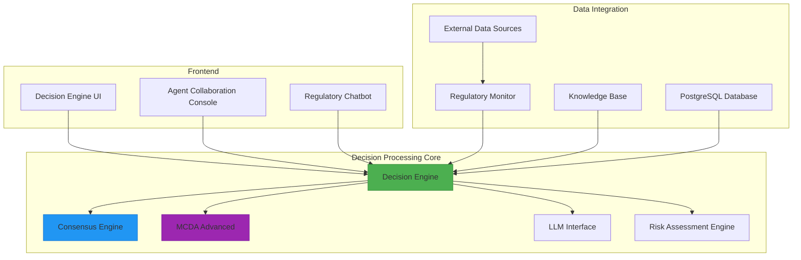
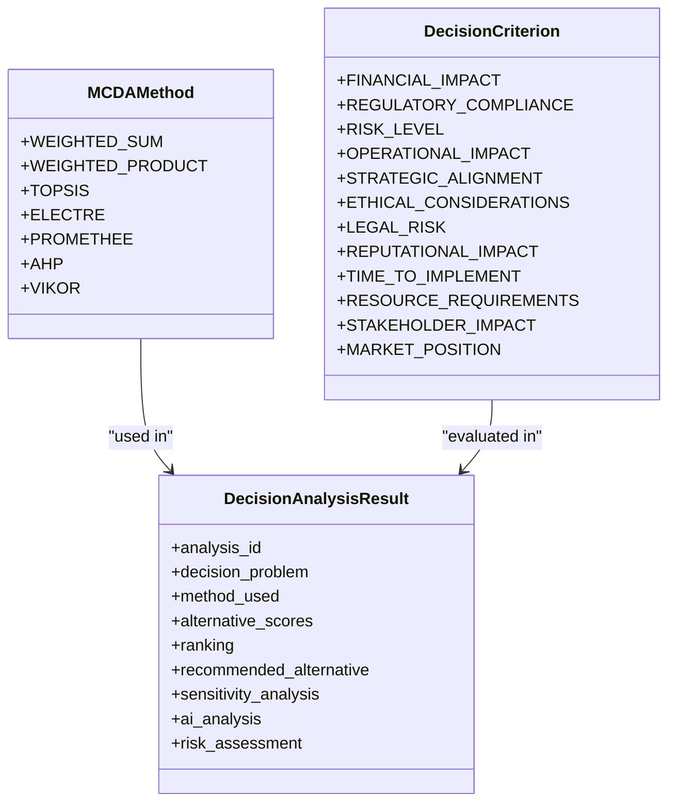
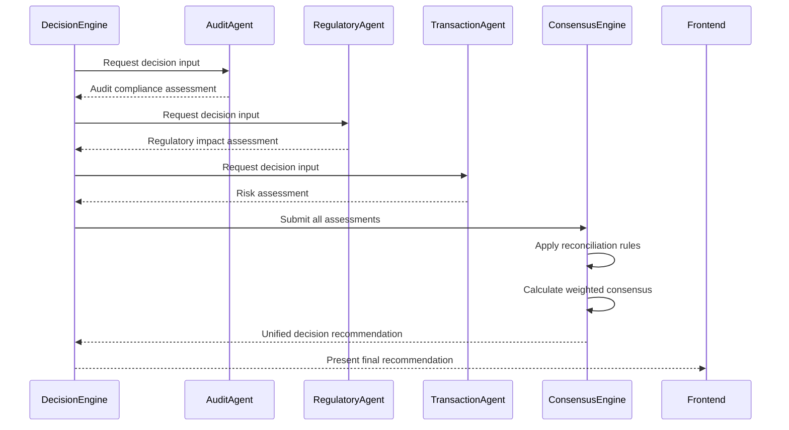
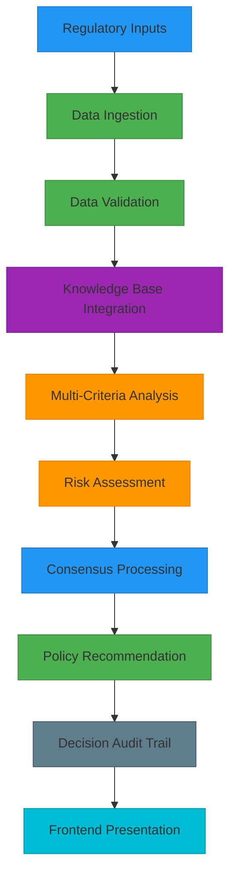
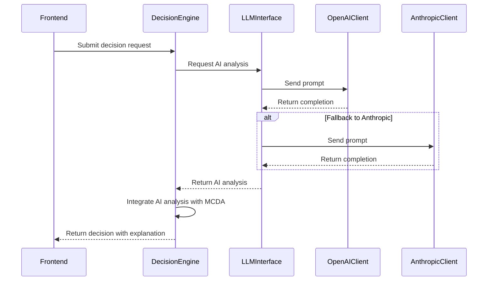
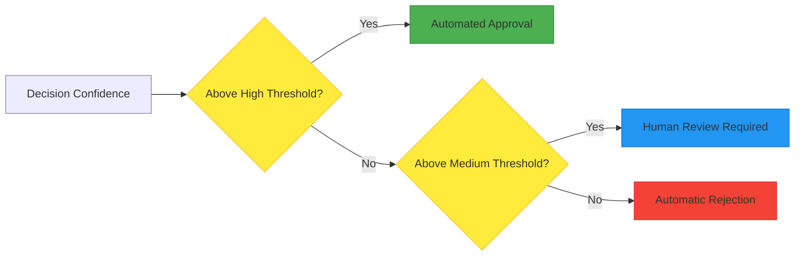
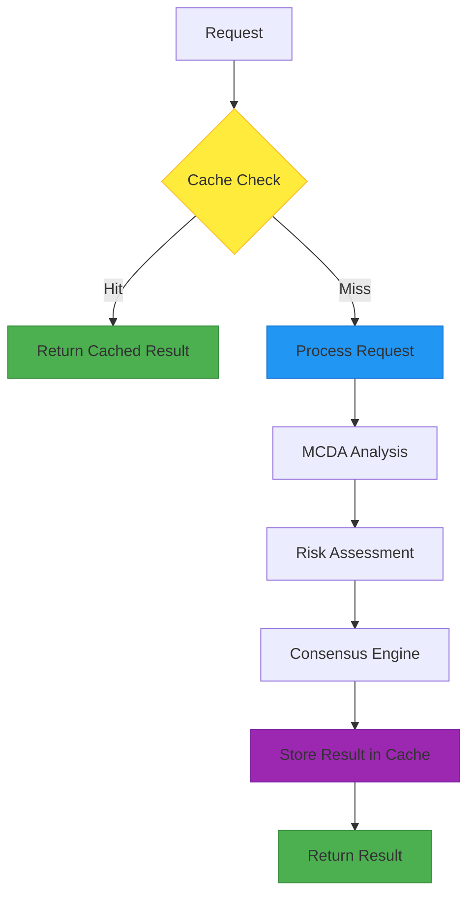

# Decision Engine

<cite>
**Referenced Files in This Document**   
- [decision_engine.cpp](file://shared/agentic_brain/decision_engine.cpp)
- [decision_engine.hpp](file://shared/agentic_brain/decision_engine.hpp)
- [decision_tree_optimizer.cpp](file://shared/decision_tree_optimizer.cpp)
- [decision_tree_optimizer.hpp](file://shared/decision_tree_optimizer.hpp)
- [mcda_advanced.cpp](file://shared/decisions/mcda_advanced.cpp)
- [mcda_advanced.hpp](file://shared/decisions/mcda_advanced.hpp)
- [DecisionEngine.tsx](file://frontend/src/pages/DecisionEngine.tsx)
- [MCDAAdvanced.tsx](file://frontend/src/pages/MCDAAdvanced.tsx)
- [api.ts](file://frontend/src/services/api.ts)
- [api_server.cpp](file://regulatory_monitor/rest_api_server.cpp)
</cite>

## Table of Contents
1. [Introduction](#introduction)
2. [System Architecture](#system-architecture)
3. [Multi-Criteria Decision Analysis (MCDA)](#multi-criteria-decision-analysis-mcda)
4. [Consensus Engine](#consensus-engine)
5. [Data Flow](#data-flow)
6. [LLM Integration](#llm-integration)
7. [Configuration Options](#configuration-options)
8. [Performance Considerations](#performance-considerations)
9. [Conclusion](#conclusion)

## Introduction

The Decision Engine is a sophisticated multi-criteria decision analysis (MCDA) system designed to support regulatory compliance decisions in complex financial environments. This system integrates advanced decision-making algorithms with artificial intelligence to provide comprehensive analysis and recommendations for regulatory compliance scenarios. The engine processes regulatory inputs through multiple analytical frameworks to generate policy recommendations that balance financial impact, regulatory requirements, risk levels, and operational considerations.

The Decision Engine serves as the central intelligence component in the Regulens platform, coordinating between various specialized agents including the Audit Intelligence Agent, Regulatory Assessor Agent, and Transaction Guardian Agent. It provides a unified framework for evaluating complex regulatory scenarios and generating actionable insights that help organizations maintain compliance while optimizing business outcomes.

**Section sources**
- [decision_engine.hpp](file://shared/agentic_brain/decision_engine.hpp#L1-L264)
- [decision_tree_optimizer.hpp](file://shared/decision_tree_optimizer.hpp#L1-L627)

## System Architecture

The Decision Engine architecture consists of multiple interconnected components that work together to process regulatory information and generate compliance recommendations. The system is organized into three main layers: the frontend interface, the decision processing core, and the data integration layer.

**Diagram sources **
- [decision_engine.hpp](file://shared/agentic_brain/decision_engine.hpp#L1-L264)
- [decision_tree_optimizer.hpp](file://shared/decision_tree_optimizer.hpp#L1-L627)
- [mcda_advanced.hpp](file://shared/decisions/mcda_advanced.hpp#L1-L279)

**Section sources**
- [decision_engine.hpp](file://shared/agentic_brain/decision_engine.hpp#L1-L264)
- [decision_tree_optimizer.hpp](file://shared/decision_tree_optimizer.hpp#L1-L627)

## Multi-Criteria Decision Analysis (MCDA)

The Decision Engine implements a comprehensive multi-criteria decision analysis framework that supports multiple algorithmic approaches for evaluating regulatory compliance decisions. The system provides several MCDA methods, each suited to different types of decision problems and organizational requirements.

### Supported MCDA Methods

The Decision Engine supports the following MCDA methods:

**Diagram sources **
- [decision_tree_optimizer.hpp](file://shared/decision_tree_optimizer.hpp#L150-L163)
- [decision_tree_optimizer.hpp](file://shared/decision_tree_optimizer.hpp#L1-L627)

### Scoring Models and Weighting Strategies

The Decision Engine employs sophisticated scoring models that evaluate alternatives across multiple criteria. Each criterion is assigned a weight based on its relative importance to the decision problem. The system supports both manual weight assignment and algorithmic weight determination through methods like Analytic Hierarchy Process (AHP).

Weighting strategies include:
- Equal weighting for criteria of similar importance
- Expert-based weighting using pairwise comparisons
- Data-driven weighting based on historical decision outcomes
- Dynamic weighting that adjusts based on context and risk factors

The engine normalizes criterion scores to ensure comparability across different measurement scales and applies the selected weighting strategy to calculate composite scores for each alternative.

**Section sources**
- [decision_tree_optimizer.cpp](file://shared/decision_tree_optimizer.cpp#L43-L66)
- [decision_tree_optimizer.hpp](file://shared/decision_tree_optimizer.hpp#L204-L244)

## Consensus Engine

The Consensus Engine is responsible for reconciling decisions across multiple specialized agents to ensure coherent and consistent regulatory compliance recommendations. This component addresses potential conflicts between different agents' recommendations and synthesizes a unified decision that incorporates diverse perspectives.

### Agent Collaboration Framework

The consensus process involves the following agents:
- **Audit Intelligence Agent**: Focuses on audit trail completeness and compliance with auditing standards
- **Regulatory Assessor Agent**: Evaluates alignment with current regulatory requirements
- **Transaction Guardian Agent**: Assesses financial risk and transaction integrity

**Diagram sources **
- [decision_engine.hpp](file://shared/agentic_brain/decision_engine.hpp#L1-L264)
- [consensus_engine.hpp](file://shared/agentic_brain/consensus_engine.hpp#L1-L150)

The Consensus Engine uses a weighted voting system where each agent's recommendation is weighted based on its domain expertise and historical accuracy. When conflicts arise, the engine applies predefined reconciliation rules and may escalate to human review for high-impact decisions.

**Section sources**
- [decision_engine.hpp](file://shared/agentic_brain/decision_engine.hpp#L1-L264)
- [consensus_engine.hpp](file://shared/agentic_brain/consensus_engine.hpp#L1-L150)

## Data Flow

The Decision Engine processes information through a well-defined data flow that transforms regulatory inputs into policy recommendations. This flow ensures that all relevant data is properly analyzed and that decisions are based on comprehensive information.

### Data Processing Pipeline

**Diagram sources **
- [regulatory_monitor.cpp](file://regulatory_monitor/regulatory_monitor.cpp#L1-L200)
- [decision_engine.cpp](file://shared/agentic_brain/decision_engine.cpp#L1-L1792)
- [decision_tree_optimizer.cpp](file://shared/decision_tree_optimizer.cpp#L1-L2180)

### Regulatory Input Processing

Regulatory inputs enter the system through multiple channels:
- Official regulatory body publications (RSS feeds, APIs)
- Industry news and analysis
- Internal compliance requirements
- Historical regulatory changes

These inputs are processed by the Regulatory Monitor component, which detects changes and extracts relevant information. The extracted data is then enriched with contextual information from the Knowledge Base before being passed to the Decision Engine for analysis.

**Section sources**
- [regulatory_monitor.cpp](file://regulatory_monitor/regulatory_monitor.cpp#L1-L200)
- [decision_engine.cpp](file://shared/agentic_brain/decision_engine.cpp#L1-L1792)

## LLM Integration

The Decision Engine integrates with Large Language Models (LLMs) to enhance its reasoning capabilities and provide natural language explanations for its decisions. This integration enables the system to process unstructured regulatory text and generate human-readable justifications for its recommendations.

### Natural Language Reasoning

**Diagram sources **
- [llm_interface.hpp](file://shared/agentic_brain/llm_interface.hpp#L1-L150)
- [openai_client.hpp](file://shared/llm/openai_client.hpp#L1-L100)
- [anthropic_client.hpp](file://shared/llm/anthropic_client.hpp#L1-L100)

The LLM integration serves multiple purposes:
- **Decision Explanation**: Generating natural language explanations for complex analytical results
- **Regulatory Text Analysis**: Extracting key requirements from unstructured regulatory documents
- **Scenario Generation**: Proposing alternative solutions to regulatory challenges
- **Risk Assessment**: Identifying potential compliance risks mentioned in regulatory texts

The system supports multiple LLM providers (OpenAI, Anthropic) with automatic fallback between providers to ensure reliability.

**Section sources**
- [llm_interface.hpp](file://shared/agentic_brain/llm_interface.hpp#L1-L150)
- [decision_tree_optimizer.cpp](file://shared/decision_tree_optimizer.cpp#L96-L125)

## Configuration Options

The Decision Engine provides extensive configuration options that allow organizations to tailor the decision-making process to their specific requirements, risk tolerance, and regulatory environment.

### Decision Criteria Configuration

The system allows configuration of decision criteria through both API and UI interfaces. Criteria can be defined with the following attributes:

| Parameter | Description | Default Value |
|---------|-----------|-------------|
| name | Criterion name | N/A |
| weight | Relative importance (0-1) | Calculated |
| type | Benefit (higher is better) or Cost (lower is better) | benefit |
| unit | Measurement unit | None |
| threshold | Decision threshold value | None |

These criteria are used in the MCDA process to evaluate alternatives and generate rankings.

### Thresholds and Human-AI Collaboration

The Decision Engine supports configurable thresholds that determine when human review is required:

**Diagram sources **
- [decision_engine.cpp](file://shared/agentic_brain/decision_engine.cpp#L1-L1792)
- [decision_engine.hpp](file://shared/agentic_brain/decision_engine.hpp#L1-L264)

Human-AI collaboration workflows include:
- **Review Required**: Decisions below confidence thresholds are flagged for human review
- **Override Capability**: Human experts can override AI recommendations with justification
- **Feedback Loop**: Human decisions are used to improve future AI recommendations
- **Escalation Procedures**: Critical decisions automatically escalate to senior compliance officers

**Section sources**
- [decision_engine.cpp](file://shared/agentic_brain/decision_engine.cpp#L1-L1792)
- [decision_engine.hpp](file://shared/agentic_brain/decision_engine.hpp#L1-L264)

## Performance Considerations

The Decision Engine is designed for real-time decision processing in high-volume regulatory environments. The system incorporates several performance optimizations to ensure responsive operation while maintaining analytical rigor.

### Real-Time Processing Architecture

The engine employs a multi-layered approach to performance optimization:

**Diagram sources **
- [decision_engine.cpp](file://shared/agentic_brain/decision_engine.cpp#L1-L1792)
- [decision_tree_optimizer.cpp](file://shared/decision_tree_optimizer.cpp#L1-L2180)

### Performance Optimization Strategies

The system implements the following performance strategies:

1. **Caching**: Results of previous analyses are cached to avoid redundant calculations
2. **Parallel Processing**: Independent analysis components run concurrently
3. **Algorithm Selection**: Simpler algorithms are used when appropriate to reduce processing time
4. **Resource Management**: Processing resources are dynamically allocated based on workload
5. **Asynchronous Operations**: Non-critical operations are processed asynchronously

The engine also includes comprehensive monitoring capabilities that track decision processing times, system resource utilization, and decision accuracy metrics.

**Section sources**
- [decision_engine.cpp](file://shared/agentic_brain/decision_engine.cpp#L1-L1792)
- [decision_tree_optimizer.cpp](file://shared/decision_tree_optimizer.cpp#L1-L2180)

## Conclusion

The Decision Engine represents a sophisticated multi-criteria decision analysis system specifically designed for regulatory compliance in complex financial environments. By integrating advanced MCDA algorithms, consensus mechanisms, and LLM-powered natural language reasoning, the system provides comprehensive support for regulatory decision-making.

Key strengths of the system include its flexible architecture that supports multiple decision-making methodologies, its robust consensus engine that reconciles inputs from specialized agents, and its seamless integration with LLMs for enhanced reasoning and explanation capabilities. The system's configurable thresholds and human-AI collaboration workflows ensure that organizations can tailor the decision process to their specific risk tolerance and compliance requirements.

The Decision Engine's real-time processing capabilities, combined with its comprehensive audit trail and performance monitoring, make it a reliable foundation for regulatory compliance decisions in dynamic environments where both speed and accuracy are critical.