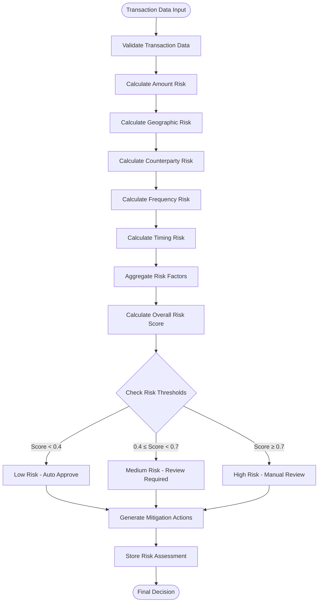

# Decision Process

<cite>
**Referenced Files in This Document**
- [mcda_advanced.cpp](file://shared/decisions/mcda_advanced.cpp)
- [mcda_advanced.hpp](file://shared/decisions/mcda_advanced.hpp)
- [decision_api_handlers.cpp](file://shared/decisions/decision_api_handlers.cpp)
- [decision_api_handlers.hpp](file://shared/decisions/decision_api_handlers.hpp)
- [decision_tree_optimizer.cpp](file://shared/decision_tree_optimizer.cpp)
- [decision_tree_optimizer.hpp](file://shared/decision_tree_optimizer.hpp)
- [decision_engine.cpp](file://shared/agentic_brain/decision_engine.cpp)
- [decision_engine.hpp](file://shared/agentic_brain/decision_engine.hpp)
- [agent_decision.hpp](file://shared/models/agent_decision.hpp)
- [risk_assessment.hpp](file://shared/risk_assessment.hpp)
- [risk_assessment_types.hpp](file://shared/models/risk_assessment_types.hpp)
- [schema.sql](file://schema.sql)
- [decision_tree_types.hpp](file://shared/models/decision_tree_types.hpp)
</cite>

## Table of Contents
1. [Introduction](#introduction)
2. [Architecture Overview](#architecture-overview)
3. [Core Components](#core-components)
4. [Decision Context Model](#decision-context-model)
5. [Risk Assessment Pipelines](#risk-assessment-pipelines)
6. [Decision Validation Process](#decision-validation-process)
7. [Decision Storage Mechanism](#decision-storage-mechanism)
8. [Performance Tracking](#performance-tracking)
9. [Integration Patterns](#integration-patterns)
10. [Troubleshooting Guide](#troubleshooting-guide)
11. [Best Practices](#best-practices)

## Introduction

The Decision Process component is the core intelligence engine of Regulens, providing comprehensive decision-making capabilities for compliance, regulatory, and audit scenarios. This system implements a sophisticated multi-layered approach combining Multi-Criteria Decision Analysis (MCDA), decision trees, risk assessment algorithms, and AI-powered optimization to deliver reliable, explainable, and auditable decisions.

The system supports three primary decision types: Transaction Approval, Regulatory Impact Assessment, and Audit Anomaly Detection. Each decision undergoes rigorous risk assessment, confidence scoring, and validation before reaching a final conclusion. The architecture emphasizes scalability, performance, and regulatory compliance through PostgreSQL-based persistence and comprehensive monitoring.

## Architecture Overview

The Decision Process architecture follows a layered design pattern with clear separation of concerns:


**Diagram sources**
- [decision_engine.cpp](file://shared/agentic_brain/decision_engine.cpp#L1-L100)
- [decision_tree_optimizer.cpp](file://shared/decision_tree_optimizer.cpp#L1-L100)
- [mcda_advanced.cpp](file://shared/decisions/mcda_advanced.cpp#L1-L100)

## Core Components

### Decision Engine

The Decision Engine serves as the central orchestrator for all decision-making processes. It coordinates between multiple specialized engines and ensures consistent decision quality across different domains.


**Diagram sources**
- [decision_engine.cpp](file://shared/agentic_brain/decision_engine.cpp#L25-L100)
- [agent_decision.hpp](file://shared/models/agent_decision.hpp#L150-L250)

### Decision Tree Optimizer

The Decision Tree Optimizer provides sophisticated multi-criteria decision analysis using various MCDA methods including AHP, TOPSIS, ELECTRE, and PROMETHEE.


**Diagram sources**
- [decision_tree_optimizer.cpp](file://shared/decision_tree_optimizer.cpp#L1-L100)
- [decision_tree_optimizer.hpp](file://shared/decision_tree_optimizer.hpp#L50-L200)

### MCDA Advanced Engine

The MCDA Advanced component provides production-grade multi-criteria decision analysis with support for multiple algorithms and sensitivity analysis.


**Diagram sources**
- [mcda_advanced.cpp](file://shared/decisions/mcda_advanced.cpp#L15-L100)
- [mcda_advanced.hpp](file://shared/decisions/mcda_advanced.hpp#L25-L150)

**Section sources**
- [decision_engine.cpp](file://shared/agentic_brain/decision_engine.cpp#L1-L200)
- [decision_tree_optimizer.cpp](file://shared/decision_tree_optimizer.cpp#L1-L200)
- [mcda_advanced.cpp](file://shared/decisions/mcda_advanced.cpp#L1-L200)

## Decision Context Model

The Decision Context model encapsulates all necessary information for making informed decisions across different domains. It provides a standardized interface for decision engines to process diverse input data consistently.

### Decision Context Structure


**Diagram sources**
- [agent_decision.hpp](file://shared/models/agent_decision.hpp#L15-L100)

### Decision Context Processing Workflow

The Decision Context undergoes several stages of processing:

1. **Input Validation**: Ensures all required fields are present and valid
2. **Context Enrichment**: Adds contextual information from external sources
3. **Risk Assessment Integration**: Incorporates risk factors and thresholds
4. **Model Selection**: Chooses appropriate decision algorithms
5. **Result Generation**: Produces final decision with confidence scores

**Section sources**
- [agent_decision.hpp](file://shared/models/agent_decision.hpp#L1-L333)

## Risk Assessment Pipelines

The system implements comprehensive risk assessment pipelines tailored for different decision types. Each pipeline applies domain-specific scoring algorithms and integrates with AI-powered analysis.

### Transaction Risk Assessment Pipeline



**Diagram sources**
- [decision_engine.cpp](file://shared/agentic_brain/decision_engine.cpp#L400-L500)
- [risk_assessment.hpp](file://shared/risk_assessment.hpp#L200-L300)

### Regulatory Impact Assessment Pipeline

The regulatory impact assessment evaluates the potential consequences of regulatory changes on organizational operations:


**Diagram sources**
- [decision_engine.cpp](file://shared/agentic_brain/decision_engine.cpp#L500-L600)
- [risk_assessment.hpp](file://shared/risk_assessment.hpp#L300-L400)

### Audit Anomaly Detection Pipeline

The audit anomaly detection pipeline identifies suspicious patterns and generates appropriate responses:


**Diagram sources**
- [decision_engine.cpp](file://shared/agentic_brain/decision_engine.cpp#L600-L700)

**Section sources**
- [decision_engine.cpp](file://shared/agentic_brain/decision_engine.cpp#L300-L800)
- [risk_assessment.hpp](file://shared/risk_assessment.hpp#L100-L400)

## Decision Validation Process

The decision validation process ensures that all decisions meet quality standards, regulatory requirements, and business policies. This multi-stage validation includes automated checks, human review workflows, and continuous monitoring.

### Decision Validation Stages


### Validation Rules and Constraints

The validation process enforces several critical rules:

1. **Data Integrity**: Ensures all required fields are present and valid
2. **Consistency Checks**: Validates relationships between different data points
3. **Business Rules**: Applies domain-specific constraints and limits
4. **Regulatory Compliance**: Ensures decisions meet legal and regulatory requirements
5. **Risk Limits**: Verifies decisions stay within acceptable risk parameters

**Section sources**
- [decision_engine.cpp](file://shared/agentic_brain/decision_engine.cpp#L200-L400)

## Decision Storage Mechanism

The decision storage mechanism uses PostgreSQL as the primary persistence layer, providing ACID compliance, transaction safety, and comprehensive querying capabilities. The storage architecture supports both structured decision data and unstructured metadata.

### Database Schema Design

```mermaid
erDiagram
DECISION_RESULTS {
varchar decision_id PK
varchar decision_type
text decision_outcome
varchar confidence
text reasoning
jsonb recommended_actions
jsonb decision_metadata
boolean requires_human_review
text human_review_reason
timestampz decision_timestamp
timestampz created_at
}
RISK_ASSESSMENTS {
serial assessment_id PK
varchar decision_id FK
varchar risk_level
double precision risk_score
jsonb risk_factors
jsonb mitigating_factors
jsonb assessment_details
timestampz assessed_at
}
DECISION_MODELS {
varchar model_id PK
varchar model_name
varchar decision_type
jsonb parameters
double precision accuracy_score
integer usage_count
boolean active
timestampz created_at
timestampz last_updated
}
DECISION_TREE_NODES {
varchar node_id PK
varchar decision_id FK
varchar parent_node_id
varchar node_type
text node_label
jsonb node_value
jsonb node_position
integer level
}
DECISION_CRITERIA {
varchar criterion_id PK
varchar decision_id FK
varchar criterion_name
double precision weight
varchar criterion_type
text description
}
DECISION_ALTERNATIVES {
varchar alternative_id PK
varchar decision_id FK
varchar alternative_name
jsonb scores
double precision total_score
integer ranking
boolean selected
}
DECISION_RESULTS ||--o{ RISK_ASSESSMENTS : "has"
DECISION_RESULTS ||--o{ DECISION_TREE_NODES : "contains"
DECISION_RESULTS ||--o{ DECISION_CRITERIA : "evaluated_on"
DECISION_RESULTS ||--o{ DECISION_ALTERNATIVES : "compares"
DECISION_MODELS ||--|| DECISION_RESULTS : "used_in"
```

**Diagram sources**
- [schema.sql](file://schema.sql#L1-L200)

### Storage Optimization Strategies

The storage layer implements several optimization strategies:

1. **Indexing**: Strategic indexing on frequently queried columns
2. **Partitioning**: Horizontal partitioning for large datasets
3. **Compression**: Automatic compression for historical data
4. **Caching**: Redis-based caching for frequently accessed decisions
5. **Archival**: Automated archival of old decisions to reduce storage costs

**Section sources**
- [schema.sql](file://schema.sql#L1-L300)

## Performance Tracking

The system implements comprehensive performance tracking to monitor decision-making effectiveness, identify bottlenecks, and ensure continuous improvement.

### Performance Metrics Collection


### Accuracy Calculation Methods

The system employs multiple methods to calculate decision accuracy:

1. **Historical Comparison**: Compare against known outcomes
2. **Cross-Validation**: Use multiple models and compare results
3. **Human Review**: Validate against human decisions
4. **External Benchmarks**: Compare against industry standards

**Section sources**
- [decision_engine.cpp](file://shared/agentic_brain/decision_engine.cpp#L1000-L1200)

## Integration Patterns

The Decision Process component integrates seamlessly with other Regulens components through well-defined APIs and data exchange protocols.

### API Integration Architecture


**Diagram sources**
- [decision_api_handlers.cpp](file://shared/decisions/decision_api_handlers.cpp#L1-L100)

### Inter-Component Communication

The system uses several communication patterns:

1. **Synchronous API Calls**: Immediate decision processing
2. **Asynchronous Queues**: Background processing for complex decisions
3. **Event Streaming**: Real-time updates for decision changes
4. **Batch Processing**: Periodic analysis and reporting

**Section sources**
- [decision_api_handlers.cpp](file://shared/decisions/decision_api_handlers.cpp#L1-L200)

## Troubleshooting Guide

Common issues and their solutions in the Decision Process component:

### Decision Timeout Issues

**Symptoms**: Decisions taking too long to process
**Causes**: 
- Complex MCDA calculations
- Large decision trees
- Database connectivity issues
- Insufficient system resources

**Solutions**:
1. Implement calculation timeouts
2. Use parallel processing for independent calculations
3. Optimize database queries
4. Scale system resources

### Data Validation Failures

**Symptoms**: Decisions rejected due to invalid data
**Causes**:
- Missing required fields
- Invalid data formats
- Out-of-range values
- Inconsistent data relationships

**Solutions**:
1. Implement comprehensive data validation
2. Provide clear error messages
3. Offer data correction workflows
4. Maintain data quality standards

### Inconsistent Risk Assessments

**Symptoms**: Same inputs producing different risk scores
**Causes**:
- Random number generation variations
- Different algorithm configurations
- Data preprocessing differences
- Model version mismatches

**Solutions**:
1. Implement deterministic algorithms
2. Standardize data preprocessing
3. Version control models
4. Add consistency checks

**Section sources**
- [decision_engine.cpp](file://shared/agentic_brain/decision_engine.cpp#L1500-L1700)

## Best Practices

### Decision Design Principles

1. **Transparency**: All decisions should be explainable and traceable
2. **Consistency**: Similar decisions should produce consistent results
3. **Scalability**: Systems should handle increasing decision loads
4. **Accuracy**: Continuous improvement of decision quality
5. **Compliance**: All decisions must meet regulatory requirements

### Implementation Guidelines

1. **Modular Design**: Separate concerns into distinct components
2. **Error Handling**: Comprehensive error handling and recovery
3. **Monitoring**: Real-time monitoring and alerting
4. **Documentation**: Maintain comprehensive technical documentation
5. **Testing**: Extensive unit and integration testing

### Performance Optimization

1. **Caching**: Implement intelligent caching strategies
2. **Parallel Processing**: Use concurrent processing where appropriate
3. **Database Optimization**: Optimize queries and indexing
4. **Resource Management**: Monitor and manage system resources
5. **Load Balancing**: Distribute workload across multiple instances

The Decision Process component represents a sophisticated, production-ready system designed to handle complex decision-making scenarios with reliability, accuracy, and regulatory compliance. Through its modular architecture, comprehensive risk assessment capabilities, and robust storage mechanisms, it provides organizations with the tools necessary to make informed, consistent, and defensible decisions across all compliance domains.