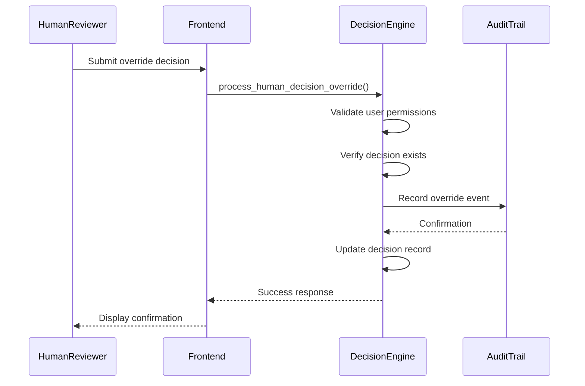
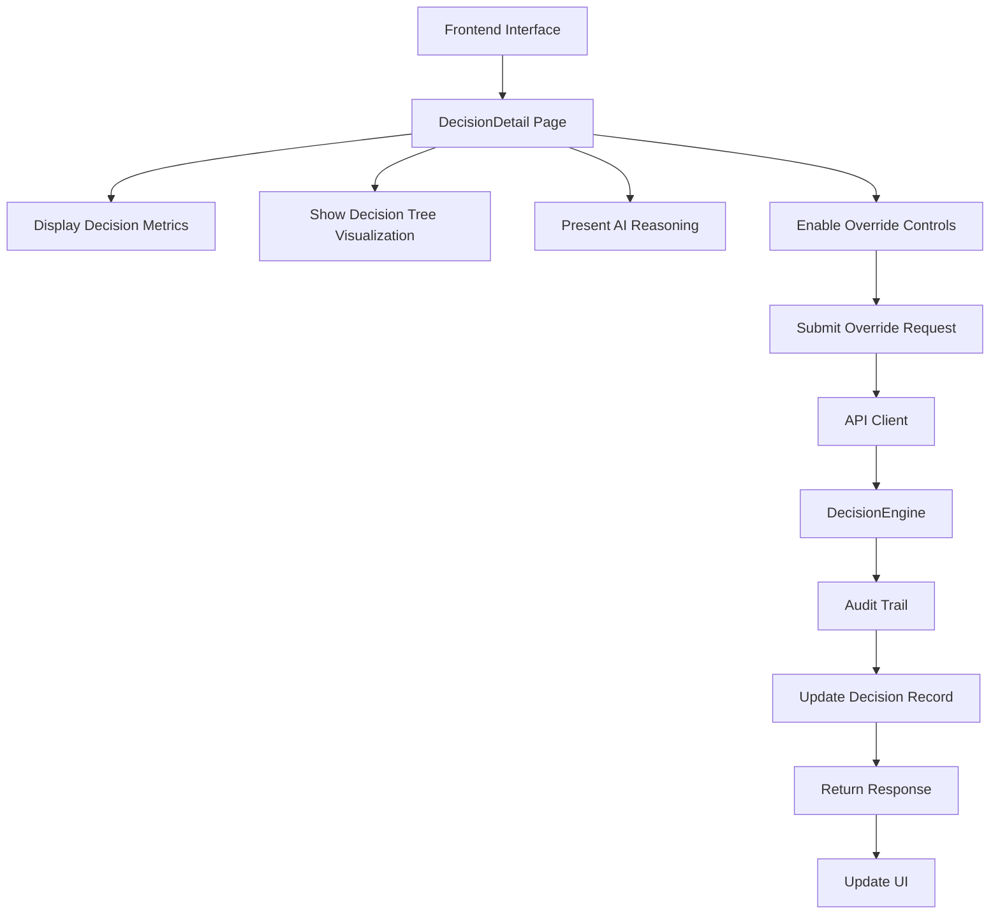
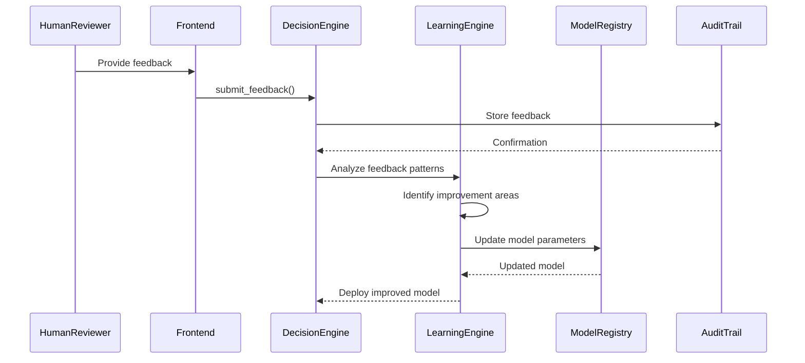
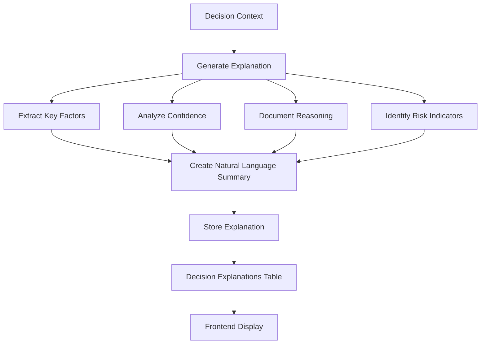
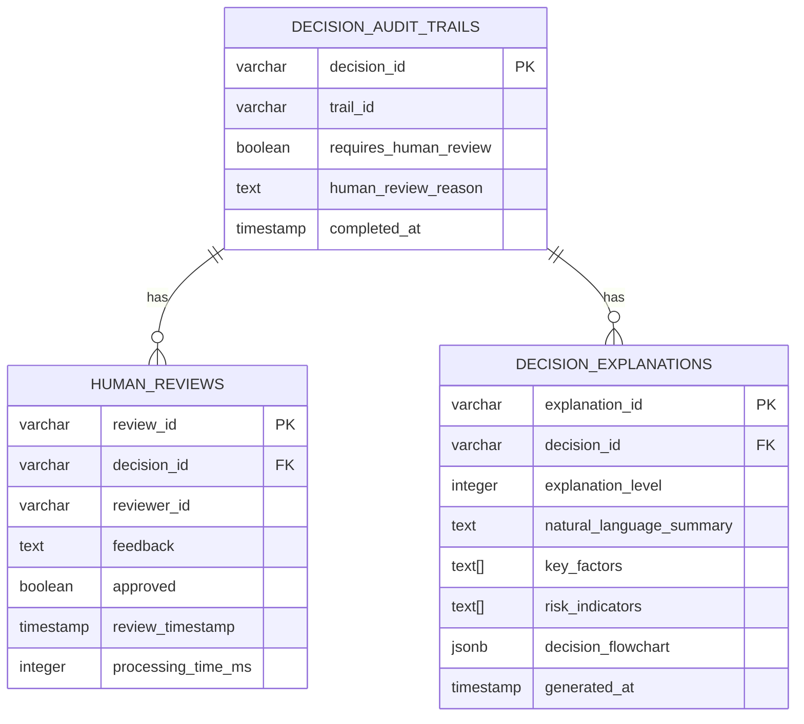

# Human-AI Collaboration

<cite>
**Referenced Files in This Document**   
- [decision_engine.hpp](file://shared/agentic_brain/decision_engine.hpp)
- [decision_engine.cpp](file://shared/agentic_brain/decision_engine.cpp)
- [decision_audit_trail.hpp](file://shared/audit/decision_audit_trail.hpp)
- [decision_audit_trail.cpp](file://shared/audit/decision_audit_trail.cpp)
- [human_ai_collaboration.hpp](file://shared/human_ai_collaboration.hpp)
- [human_ai_collaboration.cpp](file://shared/human_ai_collaboration.cpp)
- [DecisionDetail.tsx](file://frontend/src/pages/DecisionDetail.tsx)
- [useDecisions.ts](file://frontend/src/hooks/useDecisions.ts)
- [api.ts](file://frontend/src/services/api.ts)
- [schema.sql](file://schema.sql)
- [human_ai_interaction.hpp](file://shared/models/human_ai_interaction.hpp)
</cite>

## Table of Contents
1. [Introduction](#introduction)
2. [Human Review Mechanisms](#human-review-mechanisms)
3. [Decision Override Process](#decision-override-process)
4. [Frontend Integration](#frontend-integration)
5. [Feedback Incorporation](#feedback-incorporation)
6. [Decision Explanation Generation](#decision-explanation-generation)
7. [Audit Trail and Security](#audit-trail-and-security)
8. [Review Threshold Configuration](#review-threshold-configuration)
9. [Conclusion](#conclusion)

## Introduction
The Human-AI Collaboration component in the Regulens system provides a comprehensive framework for integrating human oversight with AI-driven decision-making processes. This system enables human reviewers to examine, validate, and override AI-generated decisions through a structured workflow that maintains accountability and transparency. The architecture combines automated decision-making with human judgment, creating a hybrid intelligence model that leverages the strengths of both AI systems and human expertise. This documentation details the mechanisms for human review and override of AI-generated decisions, focusing on the implementation of the `get_pending_human_reviews` and `process_human_decision_override` methods in the DecisionEngine, their integration with the frontend decision detail interface, and the complete workflow for human-AI collaboration.

## Human Review Mechanisms

The Human-AI Collaboration system implements a robust mechanism for human review of AI-generated decisions through the `get_pending_human_reviews` method in the DecisionEngine. This method retrieves all decisions that require human review based on configurable thresholds and risk assessments. The process begins when the AI system identifies decisions that meet predefined criteria for human review, such as low confidence scores, high-risk classifications, or specific decision types that mandate human oversight.

When a decision requires human review, the system sets the `requires_human_review` flag to true and stores the reason in the `human_review_reason` field. The `get_pending_human_reviews` method queries the decision audit trail to retrieve all decisions with this flag set, returning a vector of `DecisionResult` objects that contain comprehensive information about each decision, including the decision outcome, confidence level, reasoning, and metadata. This allows human reviewers to access all relevant context when evaluating AI decisions.

The review process is integrated with the audit trail system, which tracks the complete history of each decision, including the initial AI assessment, any human reviews, and final outcomes. The system also supports configurable review thresholds based on risk levels and decision confidence scores, allowing organizations to tailor the review process to their specific risk tolerance and regulatory requirements.

**Section sources**
- [decision_engine.hpp](file://shared/agentic_brain/decision_engine.hpp#L111-L140)
- [decision_audit_trail.hpp](file://shared/audit/decision_audit_trail.hpp#L133-L172)
- [decision_audit_trail.cpp](file://shared/audit/decision_audit_trail.cpp#L353-L396)

## Decision Override Process

The `process_human_decision_override` method in the DecisionEngine provides a secure mechanism for human reviewers to override AI-generated decisions. This method accepts three parameters: the decision ID, the human decision, and the reasoning for the override. When invoked, the method validates the override request, updates the decision record with the human decision, and records the override in the audit trail.

The override process follows a strict authorization workflow to ensure that only authorized personnel can modify AI decisions. The system checks the user's role and permissions before allowing an override, with different levels of access based on the decision's risk level and impact. For high-risk decisions, additional approval steps may be required, creating a multi-level review process.

Once an override is processed, the system updates the decision status and triggers any necessary downstream actions. The original AI decision, the human override, and the reasoning are all preserved in the audit trail, maintaining a complete record of the decision evolution. This approach ensures accountability while allowing human expertise to correct or refine AI decisions when appropriate.

**Diagram sources **
- [decision_engine.hpp](file://shared/agentic_brain/decision_engine.hpp#L111-L140)
- [decision_audit_trail.hpp](file://shared/audit/decision_audit_trail.hpp#L133-L172)

**Section sources**
- [decision_engine.hpp](file://shared/agentic_brain/decision_engine.hpp#L111-L140)
- [decision_engine.cpp](file://shared/agentic_brain/decision_engine.cpp#L1042-L1074)

## Frontend Integration

The Human-AI Collaboration system integrates seamlessly with the frontend decision detail interface, providing reviewers with comprehensive information to evaluate AI decisions. The DecisionDetail page displays key metrics, decision context, and explanation data, enabling informed review and override decisions. The interface is built using React components and leverages the useDecisions hook to fetch decision data from the backend API.

The frontend implementation includes several key components that support the human review process. The DecisionDetail page shows the decision title, description, confidence score, and status, along with a visualization of the decision tree. Reviewers can examine the criteria used in the decision, the alternatives considered, and the ranking of those alternatives. The interface also displays the AI's reasoning and recommended actions, providing transparency into the decision-making process.

The integration between the frontend and backend is facilitated by the API client, which handles authentication, request routing, and error handling. When a reviewer submits an override decision, the frontend sends the request to the backend, which processes it through the DecisionEngine and updates the audit trail. The system provides real-time feedback to the reviewer, confirming successful overrides and displaying any errors that occur during processing.

**Diagram sources **
- [DecisionDetail.tsx](file://frontend/src/pages/DecisionDetail.tsx#L0-L264)
- [useDecisions.ts](file://frontend/src/hooks/useDecisions.ts#L0-L123)
- [api.ts](file://frontend/src/services/api.ts#L0-L799)

**Section sources**
- [DecisionDetail.tsx](file://frontend/src/pages/DecisionDetail.tsx#L0-L264)
- [useDecisions.ts](file://frontend/src/hooks/useDecisions.ts#L0-L123)
- [api.ts](file://frontend/src/services/api.ts#L0-L799)

## Feedback Incorporation

The Human-AI Collaboration system incorporates human feedback into the learning system to improve future decisions through a structured feedback loop. When human reviewers provide feedback on AI decisions, this information is recorded in the audit trail and used to refine the decision models. The feedback mechanism captures both explicit overrides and qualitative assessments, creating a comprehensive dataset for model improvement.

The system uses the `record_human_feedback` method in the DecisionAuditTrailManager to store feedback, including the decision ID, reviewer ID, feedback text, and whether the decision was approved. This feedback is then processed by the learning engine, which analyzes patterns in human-AI disagreements to identify areas for model improvement. For example, if human reviewers consistently override decisions in a particular category, the system can adjust its decision thresholds or incorporate additional factors into its analysis.

The feedback incorporation process follows a multi-step workflow. First, feedback is validated and stored in the database. Then, the learning engine analyzes the feedback to identify trends and patterns. Based on this analysis, the system may automatically adjust decision parameters, trigger retraining of machine learning models, or generate recommendations for manual model updates. This continuous improvement cycle ensures that the AI system evolves based on human expertise and real-world outcomes.

**Diagram sources **
- [human_ai_collaboration.hpp](file://shared/human_ai_collaboration.hpp#L0-L258)
- [decision_audit_trail.hpp](file://shared/audit/decision_audit_trail.hpp#L133-L172)
- [human_ai_interaction.hpp](file://shared/models/human_ai_interaction.hpp#L0-L458)

**Section sources**
- [human_ai_collaboration.hpp](file://shared/human_ai_collaboration.hpp#L0-L258)
- [human_ai_collaboration.cpp](file://shared/human_ai_collaboration.cpp#L0-L400)
- [decision_audit_trail.cpp](file://shared/audit/decision_audit_trail.cpp#L438-L476)

## Decision Explanation Generation

The Human-AI Collaboration system generates comprehensive explanations for AI decisions to support human reviewers through the `explain_decision` method in the DecisionEngine. This method creates detailed explanations that include the decision outcome, confidence level, reasoning, recommended actions, and metadata. The explanations are designed to be transparent and interpretable, helping human reviewers understand the AI's decision-making process.

The explanation generation process combines multiple sources of information to create a comprehensive view of each decision. It includes the decision's confidence score, the factors considered in the analysis, and the specific reasoning behind the outcome. For complex decisions, the system generates a detailed explanation that breaks down the decision logic into discrete steps, showing how different factors contributed to the final outcome.

The explanations are stored in the decision_explanations database table, which includes fields for natural language summaries, key factors, risk indicators, and technical details. This structured approach allows the system to generate explanations at different levels of detail, from high-level summaries for quick review to comprehensive technical analyses for in-depth evaluation. The explanations are also integrated with the decision tree visualization, providing a graphical representation of the decision process.

**Diagram sources **
- [decision_engine.cpp](file://shared/agentic_brain/decision_engine.cpp#L1042-L1074)
- [schema.sql](file://schema.sql#L843-L869)

**Section sources**
- [decision_engine.hpp](file://shared/agentic_brain/decision_engine.hpp#L111-L140)
- [decision_engine.cpp](file://shared/agentic_brain/decision_engine.cpp#L1042-L1074)
- [schema.sql](file://schema.sql#L843-L869)

## Audit Trail and Security

The Human-AI Collaboration system implements comprehensive audit trail requirements and security considerations to ensure accountability and protect against unauthorized access. The audit trail captures all human-AI interactions, including decision reviews, overrides, and feedback, creating an immutable record of the decision-making process. This audit capability is critical for regulatory compliance, operational transparency, and system improvement.

The security model for override actions follows a role-based access control (RBAC) system, where users are assigned roles with specific permissions. The system defines multiple roles, including VIEWER, ANALYST, OPERATOR, SUPERVISOR, and ADMINISTRATOR, each with different levels of access to decision override functionality. Before processing an override request, the system verifies that the user has the appropriate role and permissions for the specific decision type and risk level.

The audit trail records detailed information about each interaction, including the user ID, timestamp, decision ID, original AI decision, human decision, and reasoning for any changes. This information is stored in the human_reviews database table, which includes foreign key references to the decision_audit_trails table to maintain referential integrity. The system also implements cryptographic hashing of audit records to detect tampering and provides export capabilities for compliance reporting.

**Diagram sources **
- [schema.sql](file://schema.sql#L843-L869)
- [decision_audit_trail.hpp](file://shared/audit/decision_audit_trail.hpp#L133-L172)
- [human_ai_interaction.hpp](file://shared/models/human_ai_interaction.hpp#L0-L458)

**Section sources**
- [decision_audit_trail.hpp](file://shared/audit/decision_audit_trail.hpp#L133-L172)
- [decision_audit_trail.cpp](file://shared/audit/decision_audit_trail.cpp#L438-L476)
- [human_ai_interaction.hpp](file://shared/models/human_ai_interaction.hpp#L0-L458)

## Review Threshold Configuration

The Human-AI Collaboration system provides flexible configuration options for review thresholds based on risk levels and decision confidence scores. These thresholds determine which decisions require human review, allowing organizations to balance automation efficiency with risk management requirements. The system supports both static thresholds defined in configuration files and dynamic thresholds that adapt based on real-time conditions and historical performance.

The threshold configuration is managed through the DecisionEngine's dynamic threshold management system, which allows administrators to set different review requirements for various decision types and risk categories. For high-risk decisions, the system can be configured to require human review for all decisions, regardless of confidence level. For medium-risk decisions, review may be triggered only when confidence scores fall below a specified threshold. Low-risk decisions might bypass human review entirely, enabling fully automated processing.

The system also supports adaptive thresholding, where the review requirements evolve based on feedback and performance metrics. For example, if the system detects a pattern of human overrides in a particular decision category, it can automatically lower the confidence threshold for that category, increasing the rate of human review until the AI performance improves. This adaptive approach ensures that the review process remains effective as the AI system learns and evolves.

**Section sources**
- [decision_engine.hpp](file://shared/agentic_brain/decision_engine.hpp#L111-L140)
- [decision_engine.cpp](file://shared/agentic_brain/decision_engine.cpp#L1042-L1074)
- [human_ai_collaboration.hpp](file://shared/human_ai_collaboration.hpp#L0-L258)

## Conclusion
The Human-AI Collaboration component in the Regulens system provides a comprehensive framework for integrating human oversight with AI-driven decision-making. By implementing robust mechanisms for human review, decision override, and feedback incorporation, the system creates a hybrid intelligence model that leverages the strengths of both AI systems and human expertise. The integration between the DecisionEngine, audit trail, and frontend interface ensures that human reviewers have the information and tools they need to effectively evaluate and guide AI decisions. The system's focus on transparency, accountability, and continuous improvement through human feedback creates a powerful platform for responsible AI deployment in regulated environments.