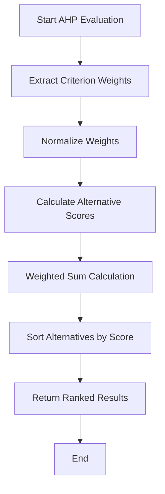
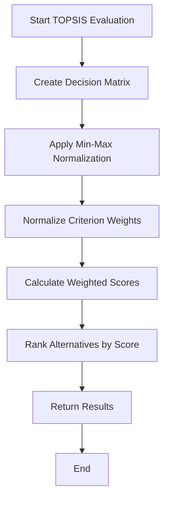
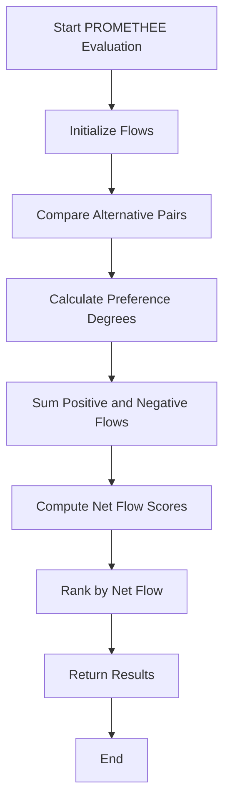
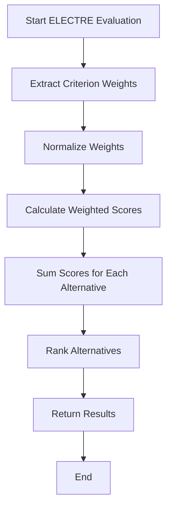
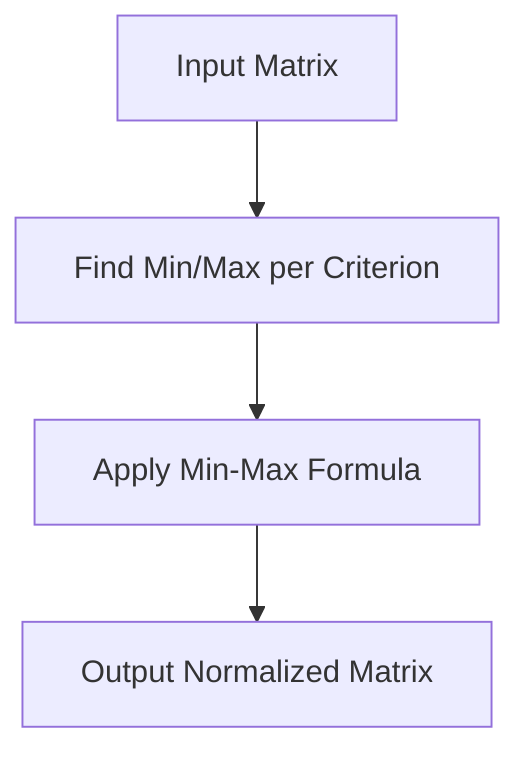
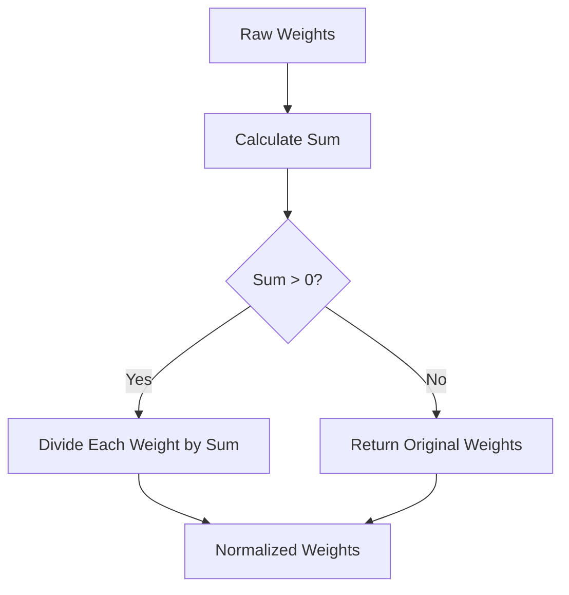
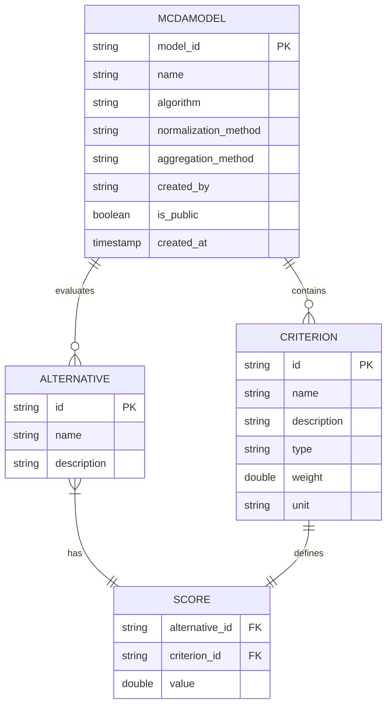
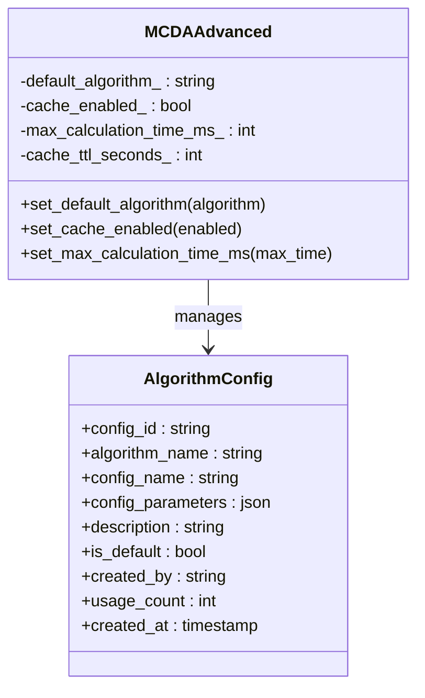
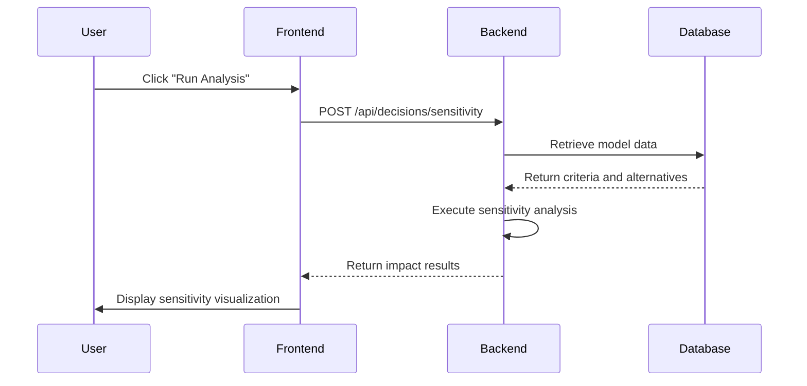
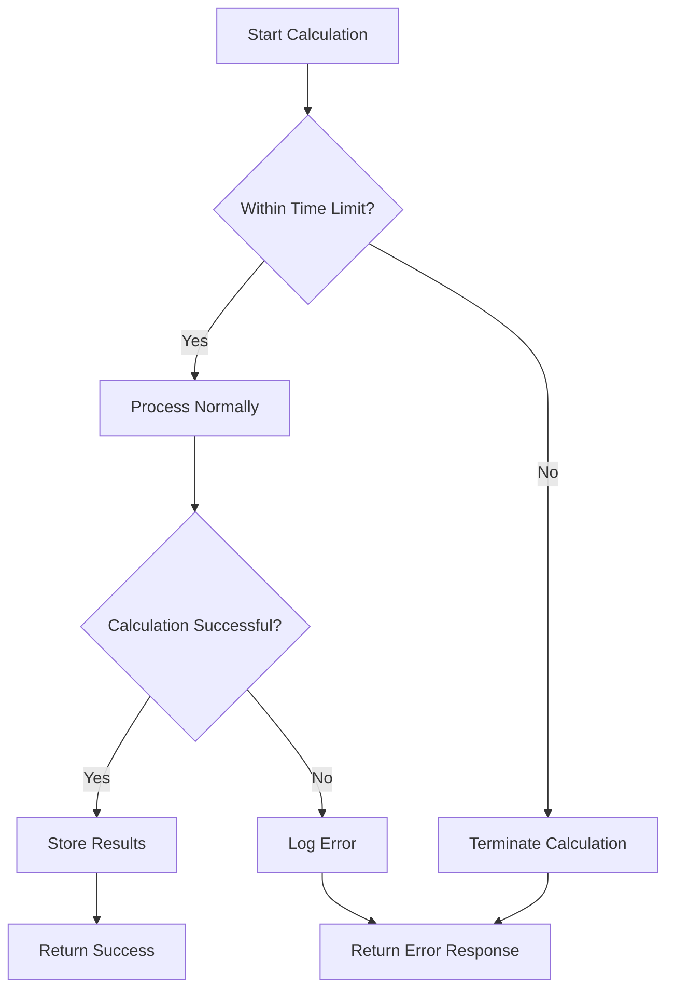

# MCDA Algorithms

<cite>
**Referenced Files in This Document**   
- [mcda_advanced.hpp](file://shared/decisions/mcda_advanced.hpp)
- [mcda_advanced.cpp](file://shared/decisions/mcda_advanced.cpp)
- [MCDAAdvanced.tsx](file://frontend/src/pages/MCDAAdvanced.tsx)
- [decision_api_handlers_complete.cpp](file://shared/decisions/decision_api_handlers_complete.cpp)
- [schema.sql](file://schema.sql)
</cite>

## Table of Contents
1. [Introduction](#introduction)
2. [Core Algorithms Implementation](#core-algorithms-implementation)
3. [Normalization Methods](#normalization-methods)
4. [Weighting Strategies](#weighting-strategies)
5. [Decision Matrix Construction](#decision-matrix-construction)
6. [Configuration and Performance Tuning](#configuration-and-performance-tuning)
7. [Frontend Integration for Sensitivity Analysis](#frontend-integration-for-sensitivity-analysis)
8. [Algorithm Selection Guidance](#algorithm-selection-guidance)
9. [Error Handling and Timeout Management](#error-handling-and-timeout-management)

## Introduction
The MCDA (Multi-Criteria Decision Analysis) component in the Regulens platform provides advanced decision-making capabilities through multiple algorithmic approaches. This system enables users to evaluate complex decision scenarios by considering multiple criteria simultaneously, with support for sensitivity analysis and scenario modeling. The implementation includes four primary algorithms: AHP (Analytic Hierarchy Process), TOPSIS (Technique for Order Preference by Similarity to Ideal Solution), PROMETHEE (Preference Ranking Organization Method for Enrichment Evaluation), and ELECTRE (Elimination and Choice Expressing Reality). These algorithms are integrated with a robust backend system and accessible through a comprehensive frontend interface for regulatory decision-making processes.

**Section sources**
- [mcda_advanced.hpp](file://shared/decisions/mcda_advanced.hpp#L1-L279)
- [mcda_advanced.cpp](file://shared/decisions/mcda_advanced.cpp#L1-L495)

## Core Algorithms Implementation

### AHP (Analytic Hierarchy Process)
The AHP implementation in Regulens follows a structured approach to decision-making by breaking down complex problems into hierarchical levels of criteria and alternatives. The algorithm calculates priorities based on pairwise comparisons and synthesizes these to produce a final ranking. In the Regulens implementation, AHP uses a simplified approach where criterion weights are directly provided rather than derived from pairwise comparison matrices.

**Diagram sources**
- [mcda_advanced.cpp](file://shared/decisions/mcda_advanced.cpp#L350-L380)

### TOPSIS (Technique for Order Preference by Similarity to Ideal Solution)
The TOPSIS implementation follows the classical approach of identifying the ideal and negative-ideal solutions and ranking alternatives based on their relative closeness to these solutions. The Regulens version uses min-max normalization by default and calculates scores through weighted summation of normalized values.

**Diagram sources**
- [mcda_advanced.cpp](file://shared/decisions/mcda_advanced.cpp#L382-L410)

### PROMETHEE (Preference Ranking Organization Method for Enrichment Evaluation)
The PROMETHEE implementation in Regulens calculates preference flows by comparing each alternative against all others across all criteria. The algorithm computes positive and negative flows to determine a net flow score for each alternative, which is then used for ranking.

**Diagram sources**
- [mcda_advanced.cpp](file://shared/decisions/mcda_advanced.cpp#L412-L445)

### ELECTRE (Elimination and Choice Expressing Reality)
The ELECTRE implementation in Regulens uses a simplified approach based on weighted scoring rather than the full concordance and discordance analysis. This streamlined version maintains the core principle of ELECTRE methods by evaluating alternatives through systematic comparison against criteria weights.

**Diagram sources**
- [mcda_advanced.cpp](file://shared/decisions/mcda_advanced.cpp#L447-L475)

## Normalization Methods
The MCDA component supports multiple normalization techniques to ensure comparability across criteria with different units and scales.

### Min-Max Normalization
This method scales values to a range between 0 and 1 using the formula: (x - min) / (max - min). It preserves the original distribution shape while ensuring all criteria are on a comparable scale.

**Diagram sources**
- [mcda_advanced.cpp](file://shared/decisions/mcda_advanced.cpp#L477-L515)

### Z-Score Normalization
This technique transforms values to have zero mean and unit variance, calculated as: (x - mean) / standard deviation. It's particularly useful when criteria follow a normal distribution.

### Vector Normalization
Also known as Euclidean normalization, this method divides each value by the square root of the sum of squares for its criterion, creating unit vectors.

### Sum Normalization
This approach scales values by dividing each by the sum of all values for that criterion, resulting in proportions that sum to 1.

**Section sources**
- [mcda_advanced.hpp](file://shared/decisions/mcda_advanced.hpp#L120-L123)
- [mcda_advanced.cpp](file://shared/decisions/mcda_advanced.cpp#L477-L515)

## Weighting Strategies
The MCDA system implements several strategies for handling criterion weights to ensure valid decision outcomes.

### Weight Normalization
All algorithms use a common weight normalization function that converts raw weights into proportional values summing to 1.0. This ensures mathematical consistency across different algorithms and prevents bias from arbitrary weight scales.

**Diagram sources**
- [mcda_advanced.cpp](file://shared/decisions/mcda_advanced.cpp#L517-L535)

### Weight Validation
The system validates weights to ensure they are positive and meaningful. Invalid weight configurations trigger appropriate error handling to maintain decision integrity.

**Section sources**
- [mcda_advanced.hpp](file://shared/decisions/mcda_advanced.hpp#L250-L252)
- [mcda_advanced.cpp](file://shared/decisions/mcda_advanced.cpp#L517-L535)

## Decision Matrix Construction
The decision matrix is constructed from user-provided criteria and alternative data, forming the foundation for all MCDA calculations.

### Data Structure
The decision matrix is represented as a two-dimensional vector where rows correspond to alternatives and columns to criteria. Each cell contains the performance score of an alternative on a specific criterion.

### Matrix Population
The system extracts scores from the Alternative objects and organizes them into the matrix structure based on criterion order. Missing values are handled by defaulting to zero, with appropriate logging for data quality issues.

**Diagram sources**
- [mcda_advanced.hpp](file://shared/decisions/mcda_advanced.hpp#L20-L50)
- [schema.sql](file://schema.sql#L8115-L8135)

## Configuration and Performance Tuning
The MCDA component provides several configuration options to optimize performance and accuracy.

### Algorithm Configuration
Users can configure algorithm-specific parameters through the AlgorithmConfig structure, which allows storing named configurations with custom parameters for different use cases.

### Performance Parameters
The system includes configurable limits for calculation time and caching behavior:
- Maximum calculation time: 30 seconds by default
- Cache enabled: Enabled by default with 24-hour TTL
- Default algorithm: AHP

**Diagram sources**
- [mcda_advanced.hpp](file://shared/decisions/mcda_advanced.hpp#L140-L160)
- [mcda_advanced.cpp](file://shared/decisions/mcda_advanced.cpp#L600-L615)

## Frontend Integration for Sensitivity Analysis
The MCDAAdvanced frontend component provides a user interface for advanced analysis features, including sensitivity analysis, scenario modeling, and algorithm comparison.

### Sensitivity Analysis Interface
The interface allows users to analyze how changes in criteria weights affect decision outcomes. It displays impact scores and stability indicators for each criterion, helping users identify critical factors in their decisions.

**Diagram sources**
- [MCDAAdvanced.tsx](file://frontend/src/pages/MCDAAdvanced.tsx#L1-L159)
- [decision_api_handlers_complete.cpp](file://shared/decisions/decision_api_handlers_complete.cpp#L1354-L1774)

### API Integration
The frontend communicates with backend MCDA endpoints through a well-defined API:
- POST /api/decisions/mcda: Create new MCDA analysis
- GET /api/decisions/mcda/{id}: Retrieve analysis
- PUT /api/decisions/mcda/{id}/criteria: Update criteria
- POST /api/decisions/mcda/{id}/evaluate: Evaluate alternatives

**Section sources**
- [MCDAAdvanced.tsx](file://frontend/src/pages/MCDAAdvanced.tsx#L1-L159)
- [regulatory_monitor/rest_api_server.cpp](file://regulatory_monitor/rest_api_server.cpp#L1880-L1908)

## Algorithm Selection Guidance
Choosing the appropriate MCDA algorithm depends on the specific requirements of the decision problem.

### AHP (Analytic Hierarchy Process)
Best suited for:
- Hierarchical decision structures
- Situations requiring pairwise comparisons
- When expert judgment needs to be incorporated systematically
- Problems with clear criteria hierarchies

### TOPSIS (Technique for Order Preference by Similarity to Ideal Solution)
Recommended for:
- Problems with well-defined ideal solutions
- When relative closeness to ideal is a meaningful concept
- Situations requiring intuitive distance-based reasoning
- Applications where the concept of "best" and "worst" alternatives is clear

### PROMETHEE (Preference Ranking Organization Method for Enrichment Evaluation)
Ideal for:
- Complex preference structures
- When partial ranking is acceptable
- Problems with non-compensatory criteria
- Situations requiring nuanced preference modeling

### ELECTRE (Elimination and Choice Expressing Reality)
Appropriate for:
- Outranking methods where dominance relationships matter
- Problems with veto conditions
- When elimination of inferior alternatives is important
- Complex decision contexts with multiple thresholds

**Section sources**
- [mcda_advanced.hpp](file://shared/decisions/mcda_advanced.hpp#L55-L60)
- [mcda_advanced.cpp](file://shared/decisions/mcda_advanced.cpp#L350-L475)

## Error Handling and Timeout Management
The MCDA system implements comprehensive error handling to ensure reliability and robustness.

### Error Handling Strategies
The implementation uses try-catch blocks around critical operations and logs errors through the StructuredLogger. Invalid models are rejected during validation, and calculation errors result in quality scores of zero.

### Timeout Management
The system enforces a maximum calculation time of 30 seconds by default. Long-running calculations are terminated to prevent system resource exhaustion, with appropriate error reporting to users.

### Consistency Validation
For AHP, the system includes functionality to calculate consistency ratios, though this is not fully implemented in the current version. This would help detect inconsistent pairwise comparisons in expert judgments.

**Diagram sources**
- [mcda_advanced.cpp](file://shared/decisions/mcda_advanced.cpp#L350-L475)
- [mcda_advanced.hpp](file://shared/decisions/mcda_advanced.hpp#L248-L249)