# Containerization Strategy

<cite>
**Referenced Files in This Document**
- [docker-compose.yml](file://docker-compose.yml)
- [Dockerfile](file://Dockerfile)
- [frontend/Dockerfile](file://frontend/Dockerfile)
- [frontend/nginx.conf](file://frontend/nginx.conf)
- [schema.sql](file://schema.sql)
- [seed_data.sql](file://seed_data.sql)
- [data/postgres/postgresql.conf](file://data/postgres/postgresql.conf)
- [data/postgres/pg_hba.conf](file://data/postgres/pg_hba.conf)
- [data/postgres/pg_ident.conf](file://data/postgres/pg_ident.conf)
- [start.sh](file://start.sh)
- [backend-dev-server.js](file://backend-dev-server.js)
- [package.json](file://package.json)
</cite>

## Table of Contents
1. [Introduction](#introduction)
2. [Multi-Container Architecture Overview](#multi-container-architecture-overview)
3. [Docker Compose Configuration](#docker-compose-configuration)
4. [Database Container Configuration](#database-container-configuration)
5. [Redis Cache Container Configuration](#redis-cache-container-configuration)
6. [API Server Container Configuration](#api-server-container-configuration)
7. [Frontend Container Configuration](#frontend-container-configuration)
8. [Volume Management Strategy](#volume-management-strategy)
9. [Network Configuration](#network-configuration)
10. [Health Check Implementation](#health-check-implementation)
11. [Environment Variable Management](#environment-variable-management)
12. [Security Considerations](#security-considerations)
13. [Production Deployment](#production-deployment)
14. [Development Workflow](#development-workflow)
15. [Monitoring and Observability](#monitoring-and-observability)

## Introduction

The Regulens project implements a sophisticated multi-container architecture designed for regulatory compliance monitoring and AI-powered decision-making. This containerization strategy ensures scalability, security, and maintainability while supporting both development and production environments.

The architecture consists of four primary containers: PostgreSQL for data persistence, Redis for caching and session management, an API server for business logic, and a frontend container serving React applications. Each container is configured with specific security measures, health checks, and resource constraints to ensure reliable operation in production environments.

## Multi-Container Architecture Overview

The Regulens containerization strategy follows a microservices architecture pattern, separating concerns across dedicated containers for different system components. This approach provides several advantages:

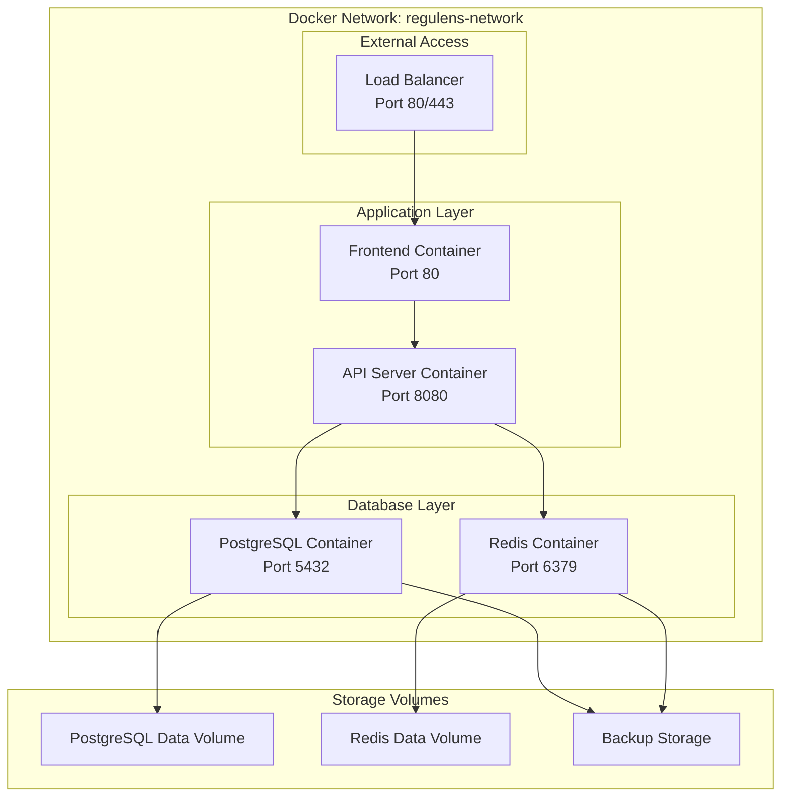

**Diagram sources**
- [docker-compose.yml](file://docker-compose.yml#L1-L141)

The architecture emphasizes:
- **Service Isolation**: Each service runs in its own container with minimal dependencies
- **Resource Efficiency**: Containers share the host OS kernel while maintaining process isolation
- **Scalability**: Individual services can be scaled independently based on demand
- **Maintainability**: Clear separation of concerns simplifies updates and troubleshooting

## Docker Compose Configuration

The `docker-compose.yml` file defines the complete multi-container environment with orchestrated service dependencies and networking:

```yaml
# Multi-container microservices architecture
# - PostgreSQL & Redis databases
# - Regulatory Monitor Service (main.cpp)
# - API Server (server_with_auth.cpp)
# - Frontend (React/Vite)

services:
  # PostgreSQL Database
  postgres:
    image: pgvector/pgvector:pg15
    container_name: regulens-postgres
    environment:
      POSTGRES_DB: ${DB_NAME:?DB_NAME environment variable is required}
      POSTGRES_USER: ${DB_USER:?DB_USER environment variable is required}
      POSTGRES_PASSWORD: ${DB_PASSWORD:?DB_PASSWORD environment variable is required}
    volumes:
      - postgres_data:/var/lib/postgresql/data
      - ./schema.sql:/docker-entrypoint-initdb.d/01-schema.sql
      - ./seed_data.sql:/docker-entrypoint-initdb.d/02-seed.sql
      - ./backups/postgres:/backups
    ports:
      - "5432:5432"
    healthcheck:
      test: ["CMD-SHELL", "pg_isready -U ${DB_USER:-regulens_user} -d ${DB_NAME:-regulens_compliance}"]
      interval: 10s
      timeout: 5s
      retries: 3
      start_period: 10s
    restart: unless-stopped
    networks:
      - regulens-network
```

**Section sources**
- [docker-compose.yml](file://docker-compose.yml#L1-L141)

**Diagram sources**
- [docker-compose.yml](file://docker-compose.yml#L1-L141)

## Database Container Configuration

### PostgreSQL Container Setup

The PostgreSQL container utilizes the pgvector extension for advanced vector operations required by the AI-powered compliance system:

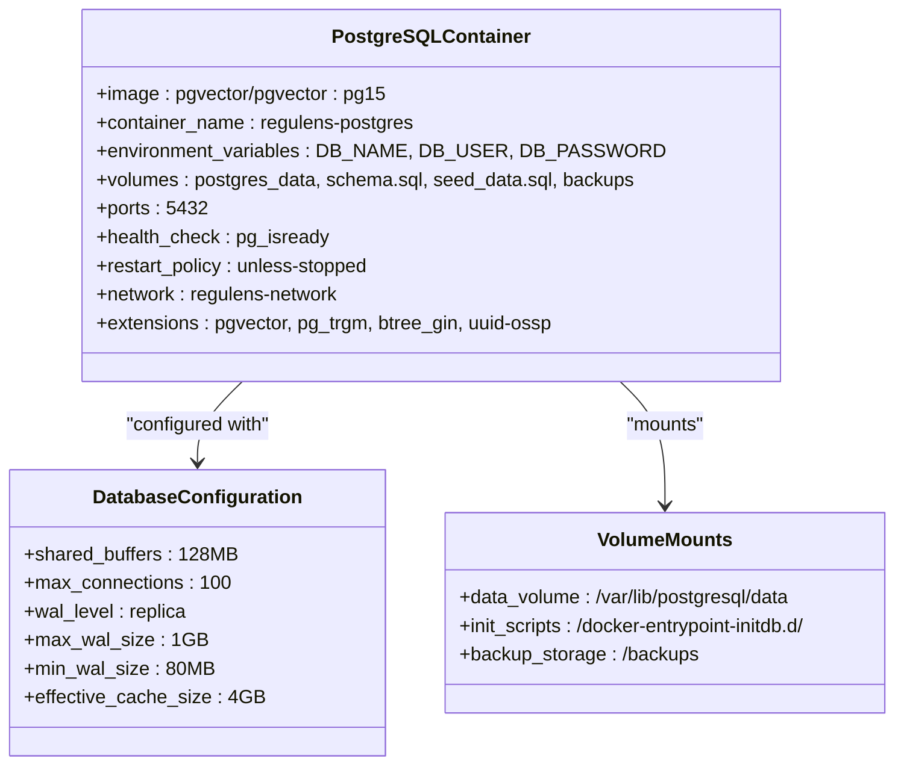

**Diagram sources**
- [docker-compose.yml](file://docker-compose.yml#L8-L35)
- [data/postgres/postgresql.conf](file://data/postgres/postgresql.conf#L1-L799)

### Base Image and Extensions

The PostgreSQL container uses `pgvector/pgvector:pg15` as its base image, which includes:

- **PostgreSQL 15**: Latest stable version with improved performance and features
- **pgvector Extension**: Enables vector similarity search for AI-powered compliance analytics
- **Additional Extensions**: `pg_trgm`, `btree_gin`, `uuid-ossp` for enhanced functionality

### Environment Variables

Critical environment variables are managed through Docker Compose with mandatory validation:

```bash
# SECURITY: No default passwords - must be provided via environment variables
POSTGRES_DB: ${DB_NAME:?DB_NAME environment variable is required}
POSTGRES_USER: ${DB_USER:?DB_USER environment variable is required}
POSTGRES_PASSWORD: ${DB_PASSWORD:?DB_PASSWORD environment variable is required}
```

**Section sources**
- [docker-compose.yml](file://docker-compose.yml#L8-L35)
- [data/postgres/postgresql.conf](file://data/postgres/postgresql.conf#L1-L799)

## Redis Cache Container Configuration

### Redis Container Setup

The Redis container provides high-performance caching and session management:

```mermaid
classDiagram
class RedisContainer {
+image : redis : 7-alpine
+container_name : regulens-redis
+command : redis-server --requirepass
+environment_variables : REDIS_PASSWORD
+volumes : redis_data, backups
+ports : 6379
+health_check : redis-cli ping
+restart_policy : unless-stopped
+network : regulens-network
}
class RedisConfiguration {
+requirepass : ${REDIS_PASSWORD}
+maxmemory : 512MB
+maxmemory-policy : allkeys-lru
+save : 900 1 300 10 60 10000
+appendonly : yes
}
class SecuritySettings {
+password_authentication : enabled
+network_isolation : true
+backup_encryption : true
}
RedisContainer --> RedisConfiguration : "configured with"
RedisContainer --> SecuritySettings : "implements"
```

**Diagram sources**
- [docker-compose.yml](file://docker-compose.yml#L37-L58)

### Alpine Linux Base Image

Redis uses the lightweight Alpine Linux base image (`redis:7-alpine`) for:

- **Reduced Attack Surface**: Minimal footprint reduces potential vulnerabilities
- **Faster Startup**: Smaller image size improves container initialization speed
- **Lower Resource Consumption**: Optimized for production deployments

### Security Configuration

Redis implements robust security measures:

```yaml
command: redis-server --requirepass ${REDIS_PASSWORD:?REDIS_PASSWORD environment variable is required}
healthcheck:
  test: ["CMD", "redis-cli", "--no-auth-warning", "-a", "${REDIS_PASSWORD:?REDIS_PASSWORD environment variable is required}", "ping"]
```

**Section sources**
- [docker-compose.yml](file://docker-compose.yml#L37-L58)

## API Server Container Configuration

### Multi-Stage Docker Build

The API server employs a sophisticated multi-stage Docker build process:

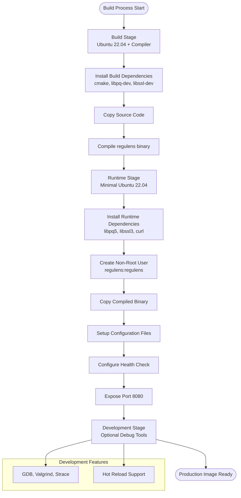

**Diagram sources**
- [Dockerfile](file://Dockerfile#L1-L122)

### Production Image Features

The production Dockerfile implements several security and performance optimizations:

```dockerfile
# Create non-root user for security
RUN groupadd -r regulens && useradd -r -g regulens regulens

# Switch to non-root user
USER regulens

# Health check
HEALTHCHECK --interval=30s --timeout=10s --start-period=60s --retries=3 \
    CMD curl -f http://localhost:8080/health || exit 1
```

### Environment Variables

The API server container manages extensive environment configuration:

```yaml
environment:
  # SECURITY: No default passwords - must be provided via environment variables
  - DB_HOST=postgres
  - DB_PORT=5432
  - DB_NAME=${DB_NAME:?DB_NAME environment variable is required}
  - DB_USER=${DB_USER:?DB_USER environment variable is required}
  - DB_PASSWORD=${DB_PASSWORD:?DB_PASSWORD environment variable is required}
  - REDIS_HOST=redis
  - REDIS_PORT=6379
  - REDIS_PASSWORD=${REDIS_PASSWORD:?REDIS_PASSWORD environment variable is required}
  - REGULATORY_MONITOR_URL=http://regulatory-monitor:8081
  - JWT_SECRET_KEY=${JWT_SECRET_KEY:?JWT_SECRET_KEY environment variable is required}
  - JWT_EXPIRATION_HOURS=${JWT_EXPIRATION_HOURS:-24}
  - SESSION_EXPIRY_HOURS=${SESSION_EXPIRY_HOURS:-24}
  - CORS_ALLOWED_ORIGIN=${CORS_ALLOWED_ORIGIN:-http://localhost:3000}
```

**Section sources**
- [Dockerfile](file://Dockerfile#L1-L122)
- [docker-compose.yml](file://docker-compose.yml#L70-L95)

## Frontend Container Configuration

### Nginx-Based Frontend

The frontend container uses a multi-stage build with Nginx for optimal performance:

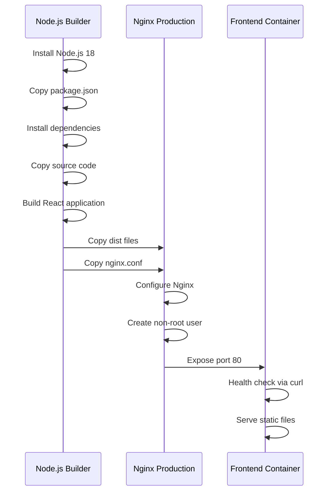

**Diagram sources**
- [frontend/Dockerfile](file://frontend/Dockerfile#L1-L41)
- [frontend/nginx.conf](file://frontend/nginx.conf#L1-L60)

### Nginx Configuration

The Nginx configuration provides comprehensive proxying and security:

```nginx
# API proxy configuration
location /api {
    proxy_pass http://regulens:8080;
    proxy_http_version 1.1;
    proxy_set_header Upgrade $http_upgrade;
    proxy_set_header Connection 'upgrade';
    proxy_set_header Host $host;
    proxy_cache_bypass $http_upgrade;
    proxy_set_header X-Real-IP $remote_addr;
    proxy_set_header X-Forwarded-For $proxy_add_x_forwarded_for;
    proxy_set_header X-Forwarded-Proto $scheme;
    proxy_pass_request_headers on;
}

# SPA routing - serve index.html for all routes
location / {
    try_files $uri $uri/ /index.html;
}

# Security headers
add_header X-Frame-Options "SAMEORIGIN" always;
add_header X-Content-Type-Options "nosniff" always;
add_header X-XSS-Protection "1; mode=block" always;
```

### Static Asset Optimization

The frontend container implements advanced caching strategies:

```nginx
# Cache static assets
location ~* \.(js|css|png|jpg|jpeg|gif|ico|svg|woff|woff2|ttf|eot)$ {
    expires 1y;
    add_header Cache-Control "public, immutable";
}

# Disable caching for index.html
location = /index.html {
    add_header Cache-Control "no-cache, no-store, must-revalidate";
    add_header Pragma "no-cache";
    add_header Expires "0";
}
```

**Section sources**
- [frontend/Dockerfile](file://frontend/Dockerfile#L1-L41)
- [frontend/nginx.conf](file://frontend/nginx.conf#L1-L60)

## Volume Management Strategy

### Persistent Data Storage

The containerization strategy implements a comprehensive volume management system:

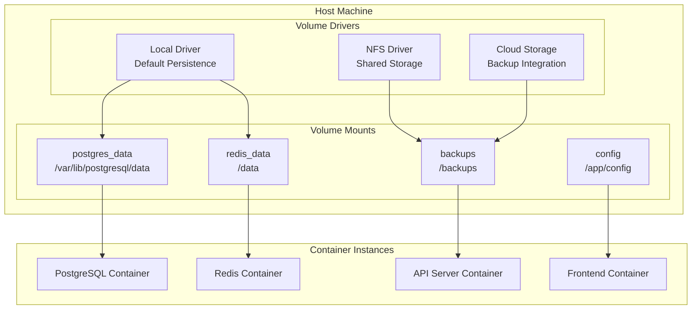

**Diagram sources**
- [docker-compose.yml](file://docker-compose.yml#L100-L105)

### Volume Types and Purposes

Different volume types serve specific purposes:

1. **PostgreSQL Data Volume**: `/var/lib/postgresql/data`
   - Stores database files and indices
   - Maintains data persistence across container restarts
   - Supports backup and restore operations

2. **Redis Data Volume**: `/data`
   - Contains Redis persistence files
   - Enables snapshot and append-only file (AOF) operations
   - Ensures cache persistence for session management

3. **Backup Volume**: `/backups`
   - Centralized backup storage location
   - Supports automated backup scheduling
   - Facilitates disaster recovery procedures

4. **Configuration Volume**: `/app/config`
   - Houses application configuration files
   - Enables dynamic configuration updates
   - Supports environment-specific settings

**Section sources**
- [docker-compose.yml](file://docker-compose.yml#L100-L105)

## Network Configuration

### Custom Bridge Network

The containerization strategy creates a dedicated Docker network for service isolation:

```yaml
networks:
  regulens-network:
    driver: bridge
```

### Service Communication

Containers communicate through internal DNS resolution:

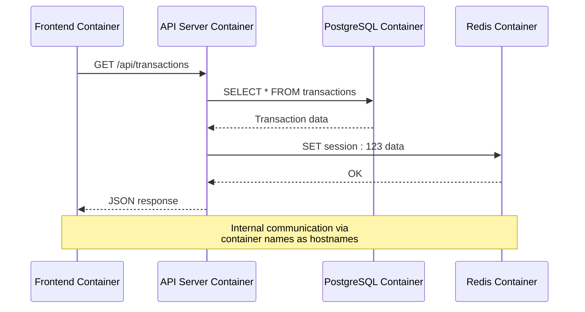

**Diagram sources**
- [docker-compose.yml](file://docker-compose.yml#L107-L110)

### Port Exposure Strategy

Each container exposes only necessary ports:

- **PostgreSQL**: Port 5432 (internal communication)
- **Redis**: Port 6379 (internal communication)
- **API Server**: Port 8080 (internal communication)
- **Frontend**: Port 80 (internal communication)

**Section sources**
- [docker-compose.yml](file://docker-compose.yml#L107-L110)

## Health Check Implementation

### Comprehensive Health Monitoring

Each container implements sophisticated health checks for reliability:

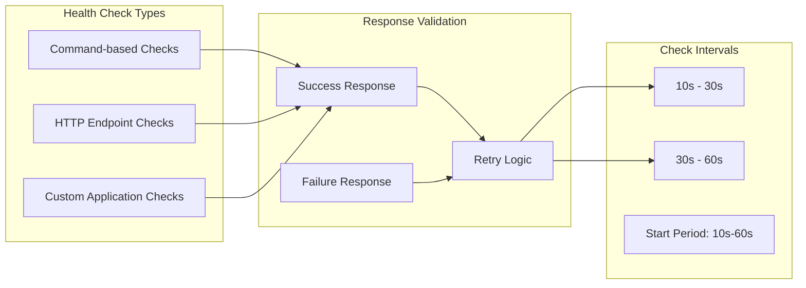

### PostgreSQL Health Check

```yaml
healthcheck:
  test: ["CMD-SHELL", "pg_isready -U ${DB_USER:-regulens_user} -d ${DB_NAME:-regulens_compliance}"]
  interval: 10s
  timeout: 5s
  retries: 3
  start_period: 10s
```

### Redis Health Check

```yaml
healthcheck:
  test: ["CMD", "redis-cli", "--no-auth-warning", "-a", "${REDIS_PASSWORD:?REDIS_PASSWORD environment variable is required}", "ping"]
  interval: 10s
  timeout: 3s
  retries: 3
```

### API Server Health Check

```yaml
healthcheck:
  test: ["CMD", "curl", "-f", "http://localhost:8080/health"]
  interval: 30s
  timeout: 10s
  retries: 3
  start_period: 40s
```

### Frontend Health Check

```yaml
healthcheck:
  test: ["CMD", "curl", "-f", "http://localhost:80"]
  interval: 30s
  timeout: 10s
  retries: 3
  start_period: 30s
```

**Section sources**
- [docker-compose.yml](file://docker-compose.yml#L25-L58)
- [frontend/Dockerfile](file://frontend/Dockerfile#L28-L32)

## Environment Variable Management

### Secure Secret Management

The containerization strategy implements robust environment variable management:

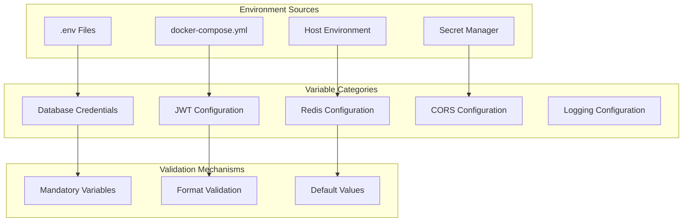

**Diagram sources**
- [docker-compose.yml](file://docker-compose.yml#L8-L95)
- [start.sh](file://start.sh#L20-L60)

### Mandatory Environment Variables

Critical security-sensitive variables require explicit definition:

```bash
# Database configuration
DB_NAME: ${DB_NAME:?DB_NAME environment variable is required}
DB_USER: ${DB_USER:?DB_USER environment variable is required}
DB_PASSWORD: ${DB_PASSWORD:?DB_PASSWORD environment variable is required}

# Redis configuration  
REDIS_PASSWORD: ${REDIS_PASSWORD:?REDIS_PASSWORD environment variable is required}

# JWT configuration
JWT_SECRET_KEY: ${JWT_SECRET_KEY:?JWT_SECRET_KEY environment variable is required}
JWT_EXPIRATION_HOURS: ${JWT_EXPIRATION_HOURS:-24}
SESSION_EXPIRY_HOURS: ${SESSION_EXPIRY_HOURS:-24}

# CORS configuration
CORS_ALLOWED_ORIGIN: ${CORS_ALLOWED_ORIGIN:-http://localhost:3000}
```

### Development vs Production Configuration

The system supports different configuration approaches:

1. **Development Mode**: Uses `.env` files with local defaults
2. **Production Mode**: Relies on environment variables from deployment platform
3. **Hybrid Mode**: Combines both approaches with validation

**Section sources**
- [docker-compose.yml](file://docker-compose.yml#L8-L95)
- [start.sh](file://start.sh#L20-L60)

## Security Considerations

### Container Security Best Practices

The Regulens containerization implements multiple layers of security:

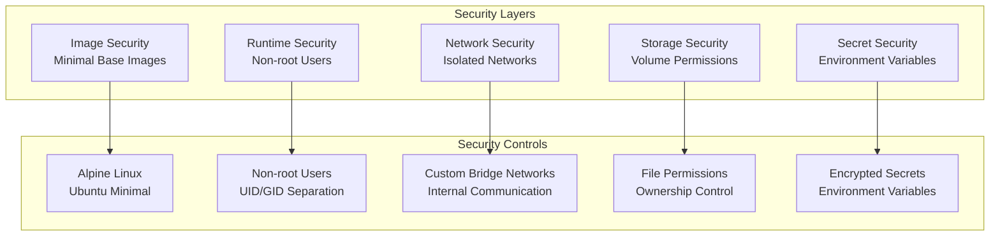

### Image Security

- **Minimal Base Images**: Uses Alpine Linux for Redis and Nginx containers
- **Multi-stage Builds**: Reduces attack surface by eliminating build tools
- **Regular Updates**: Automated vulnerability scanning and patching

### Runtime Security

```dockerfile
# Create non-root user for security
RUN groupadd -r regulens && useradd -r -g regulens regulens

# Switch to non-root user
USER regulens
```

### Network Security

- **Custom Bridge Networks**: Isolates services from external networks
- **Internal Communication**: Services communicate only through designated ports
- **Firewall Rules**: Container-level firewall configuration

### Secret Management

- **Environment Variables**: Secrets passed through environment variables
- **Validation**: Mandatory validation for critical secrets
- **Encryption**: Secrets encrypted in transit and at rest

**Section sources**
- [Dockerfile](file://Dockerfile#L50-L55)
- [docker-compose.yml](file://docker-compose.yml#L8-L95)

## Production Deployment

### Deployment Strategy

The production deployment follows a blue-green deployment pattern:

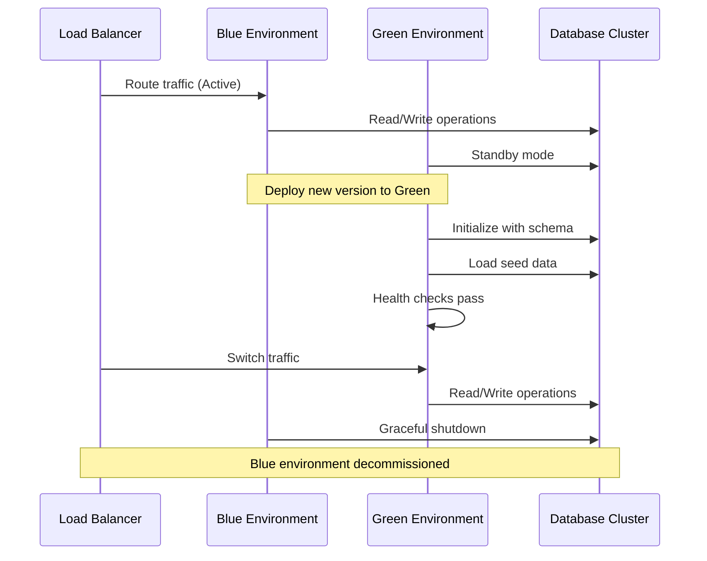

### Resource Allocation

Production containers require careful resource planning:

- **CPU Limits**: Based on workload analysis and peak usage patterns
- **Memory Limits**: Prevents memory exhaustion and OOM kills
- **Disk Space**: Adequate space for logs, backups, and temporary files
- **Network Bandwidth**: Sufficient bandwidth for concurrent connections

### Restart Policies

Each container implements appropriate restart policies:

```yaml
restart: unless-stopped  # Persistent services
restart: on-failure      # Batch jobs and workers
restart: always          # Critical system services
```

**Section sources**
- [docker-compose.yml](file://docker-compose.yml#L25-L58)

## Development Workflow

### Local Development Environment

The development workflow combines Docker containers with native development tools:

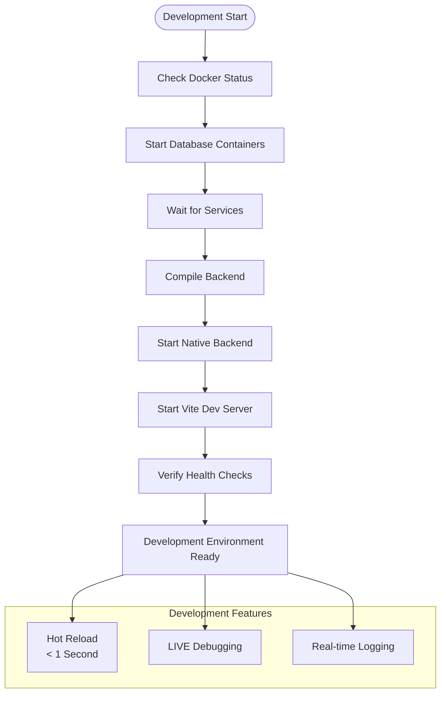

**Diagram sources**
- [start.sh](file://start.sh#L1-L194)

### Development Scripts

The `start.sh` script automates the development environment setup:

```bash
#!/bin/bash
# Regulens Development Startup Script
# Starts databases in Docker, runs backend and frontend natively with hot reload

# Load environment variables (Production-ready - no localhost hardcoding)
export DB_HOST=${DB_HOST:-localhost}
export DB_PORT=${DB_PORT:-5432}
export DB_NAME=${DB_NAME:-regulens_compliance}
export DB_USER=${DB_USER:-regulens_user}

# SECURITY: No default passwords - must be set via environment variables
if [ -z "${DB_PASSWORD}" ]; then
    echo "FATAL ERROR: DB_PASSWORD environment variable is not set"
    echo "Please set DB_PASSWORD before running the application"
    echo "Example: export DB_PASSWORD='$(openssl rand -base64 32)'"
    exit 1
fi
```

### Hot Reload Capabilities

The development environment supports instant hot reloading:

- **Frontend Changes**: Auto-reload in < 1 second
- **Backend Changes**: Recompile with `make && pkill -f regulens && ./build/regulens &`
- **Database Changes**: Persist in Docker volumes
- **Configuration Changes**: Dynamic reload without restart

**Section sources**
- [start.sh](file://start.sh#L1-L194)

## Monitoring and Observability

### Health Monitoring

The containerization strategy implements comprehensive health monitoring:

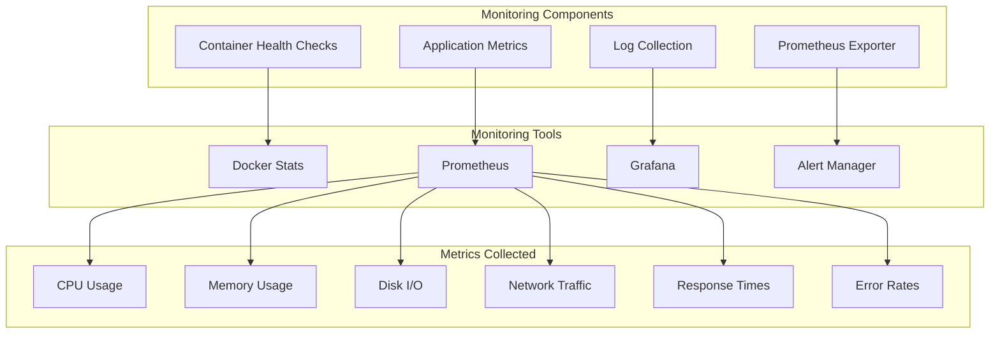

### Log Management

Centralized logging for all containerized services:

- **Structured Logging**: JSON format for easy parsing
- **Log Rotation**: Automatic rotation to prevent disk space issues
- **Centralized Storage**: Logs stored in persistent volumes
- **Real-time Monitoring**: Live log streaming for debugging

### Performance Monitoring

Key performance indicators monitored:

- **Response Latency**: API endpoint response times
- **Throughput**: Requests per second across services
- **Resource Utilization**: CPU, memory, and disk usage
- **Error Rates**: HTTP error codes and application errors
- **Database Performance**: Query execution times and connection pools

### Alerting Configuration

Proactive alerting for critical issues:

- **Service Unavailability**: Container crashes or health check failures
- **Resource Exhaustion**: High CPU, memory, or disk usage
- **Performance Degradation**: Increased response times
- **Security Events**: Unauthorized access attempts
- **Data Integrity**: Database connection failures

**Section sources**
- [docker-compose.yml](file://docker-compose.yml#L25-L58)
- [frontend/nginx.conf](file://frontend/nginx.conf#L1-L60)