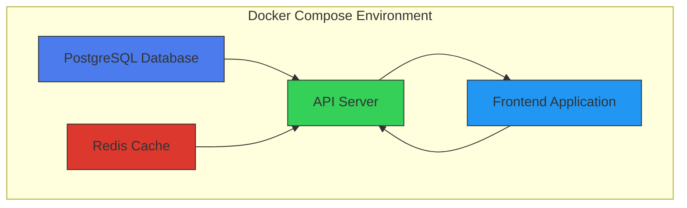
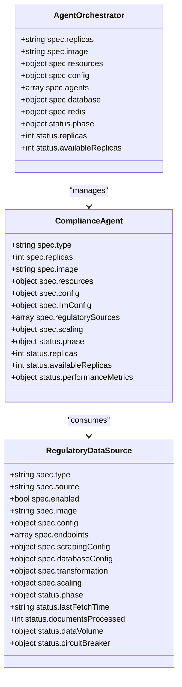
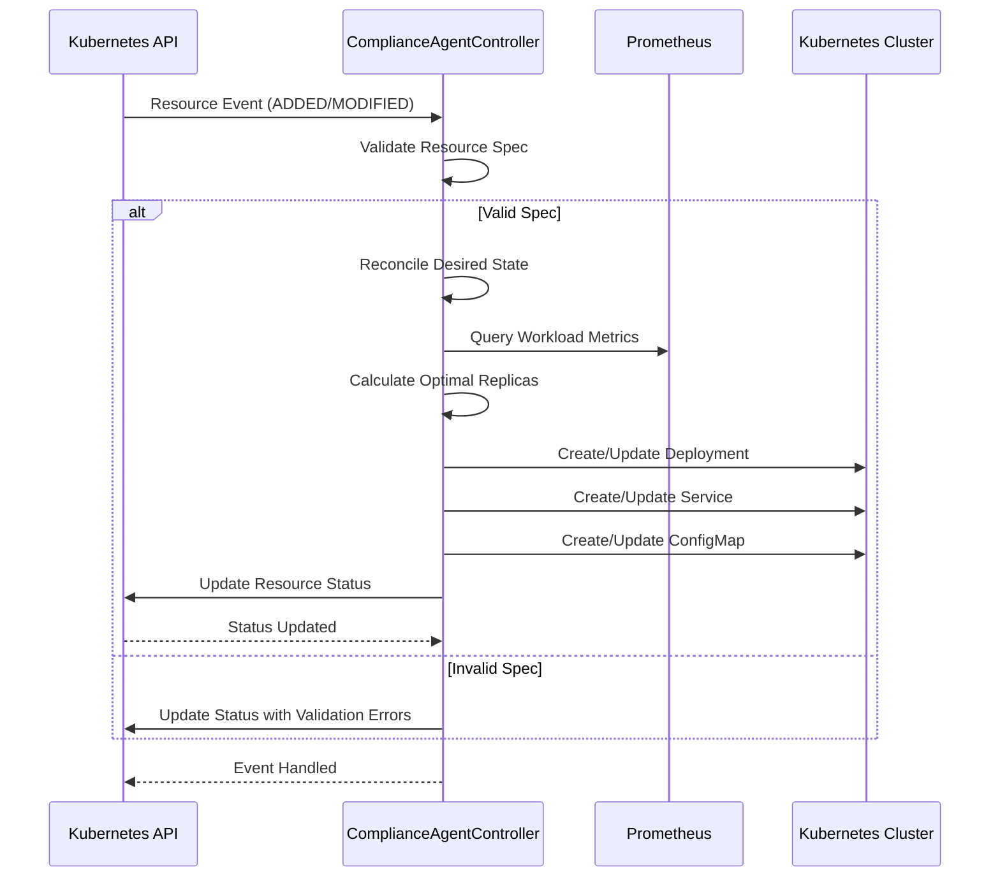
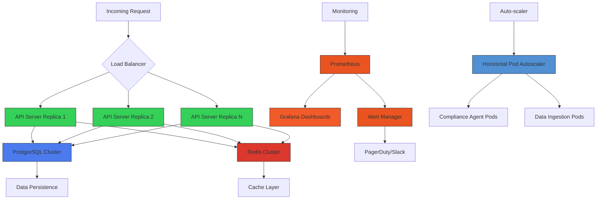
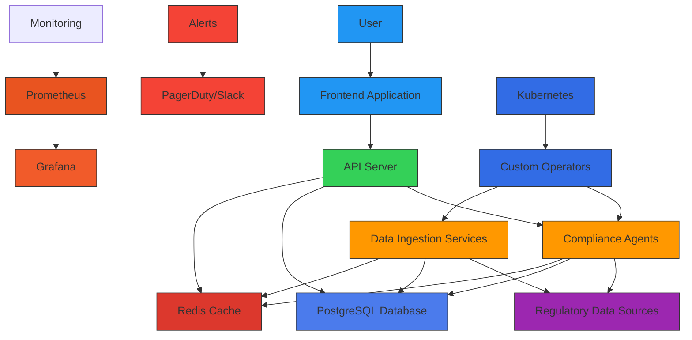
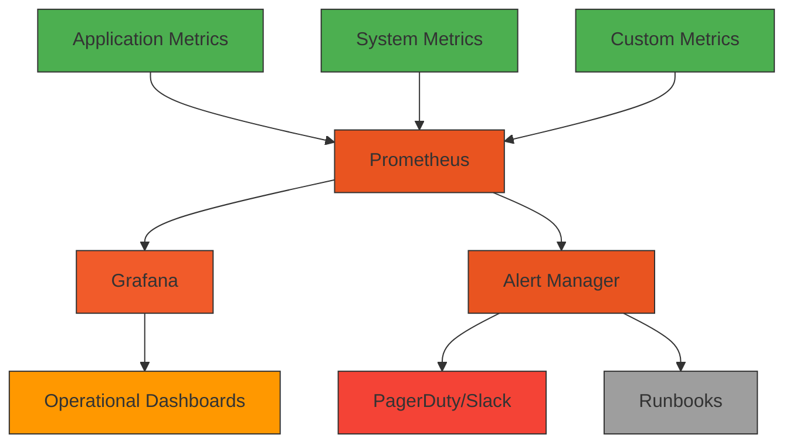

# Deployment Architecture

<cite>
**Referenced Files in This Document**   
- [docker-compose.yml](file://docker-compose.yml)
- [Dockerfile](file://Dockerfile)
- [frontend/Dockerfile](file://frontend/Dockerfile)
- [infrastructure/k8s/crds/agent_orchestrator_crd.yaml](file://infrastructure/k8s/crds/agent_orchestrator_crd.yaml)
- [infrastructure/k8s/crds/compliance_agent_crd.yaml](file://infrastructure/k8s/crds/compliance_agent_crd.yaml)
- [infrastructure/k8s/crds/regulatory_data_source_crd.yaml](file://infrastructure/k8s/crds/regulatory_data_source_crd.yaml)
- [infrastructure/k8s/operator/agent_orchestrator_controller.cpp](file://infrastructure/k8s/operator/agent_orchestrator_controller.cpp)
- [infrastructure/k8s/operator/compliance_agent_controller.cpp](file://infrastructure/k8s/operator/compliance_agent_controller.cpp)
- [infrastructure/k8s/operator/regulatory_data_controller.cpp](file://infrastructure/k8s/operator/regulatory_data_controller.cpp)
- [infrastructure/monitoring/grafana/grafana-dashboards-configmap.yaml](file://infrastructure/monitoring/grafana/grafana-dashboards-configmap.yaml)
- [infrastructure/monitoring/prometheus/prometheus-alerting-configmap.yaml](file://infrastructure/monitoring/prometheus/prometheus-alerting-configmap.yaml)
- [start.sh](file://start.sh)
</cite>

## Table of Contents
1. [Introduction](#introduction)
2. [Containerization Strategy](#containerization-strategy)
3. [Service Orchestration with Docker Compose](#service-orchestration-with-docker-compose)
4. [Kubernetes Custom Resources and CRDs](#kubernetes-custom-resources-and-crds)
5. [Operator Controllers Architecture](#operator-controllers-architecture)
6. [Infrastructure as Code with Kubernetes Manifests](#infrastructure-as-code-with-kubernetes-manifests)
7. [Deployment Topology for Environments](#deployment-topology-for-environments)
8. [Scalability and High Availability](#scalability-and-high-availability)
9. [System Context Diagram](#system-context-diagram)
10. [Configuration Management](#configuration-management)
11. [Monitoring and Alerting](#monitoring-and-alerting)
12. [Conclusion](#conclusion)

## Introduction
The Regulens platform employs a sophisticated deployment architecture designed for regulatory compliance monitoring in financial systems. This architecture combines containerization, Kubernetes orchestration, and custom operators to create a resilient, scalable system capable of handling complex agentic AI workflows. The deployment strategy supports multiple environments from development to production, with comprehensive monitoring and high availability features. The system is built around custom resource definitions (CRDs) that extend Kubernetes functionality to manage specialized compliance agents and data sources, enabling infrastructure as code practices for consistent deployments across environments.

## Containerization Strategy
The Regulens platform implements a multi-stage containerization strategy using Docker to ensure security, efficiency, and consistency across environments. The backend service uses a production-grade Dockerfile with three distinct stages: build, runtime, and development. The build stage compiles the C++ application with all necessary dependencies, while the runtime stage creates a minimal Ubuntu-based image containing only essential runtime libraries and the compiled binary. This approach significantly reduces the attack surface and image size. The development stage extends the runtime image with debugging tools for local development. The frontend follows a similar multi-stage pattern with a builder stage for compiling React assets and a production stage using nginx as a lightweight web server. Both containers implement security best practices including non-root users, health checks, and minimal dependency installation.

**Section sources**
- [Dockerfile](file://Dockerfile#L0-L121)
- [frontend/Dockerfile](file://frontend/Dockerfile#L0-L40)

## Service Orchestration with Docker Compose
The development and testing environments use Docker Compose to orchestrate multiple services including PostgreSQL, Redis, the API server, and the frontend application. The docker-compose.yml file defines a multi-container architecture with explicit dependencies and health checks to ensure proper startup sequencing. The PostgreSQL service uses the pgvector/pgvector:pg15 image with volume mounts for data persistence and schema initialization scripts. Redis is configured with password authentication and persistence. The API server depends on both database services and includes environment variable validation to prevent startup with incomplete configuration. Each service has comprehensive health checks that validate connectivity and readiness before other services can depend on them. The compose file also defines a custom bridge network and named volumes for data persistence across container restarts.

**Diagram sources **
- [docker-compose.yml](file://docker-compose.yml#L0-L140)

**Section sources**
- [docker-compose.yml](file://docker-compose.yml#L0-L140)
- [start.sh](file://start.sh#L0-L193)

## Kubernetes Custom Resources and CRDs
The production deployment leverages Kubernetes Custom Resource Definitions (CRDs) to extend the platform's capabilities for managing compliance-specific workloads. Three primary CRDs are implemented: AgentOrchestrator, ComplianceAgent, and RegulatoryDataSource. The AgentOrchestrator CRD manages groups of compliance agents with configurable replicas, resource limits, and monitoring settings. The ComplianceAgent CRD defines individual compliance agents with types such as transaction_guardian, audit_intelligence, and regulatory_assessor, each with specific configuration options for LLM integration, risk thresholds, and processing timeouts. The RegulatoryDataSource CRD manages data ingestion from various regulatory bodies with configurable polling intervals, transformation rules, and scaling parameters. Each CRD includes comprehensive validation schemas with default values, required fields, and enumerated types to ensure configuration consistency.

**Diagram sources **
- [infrastructure/k8s/crds/agent_orchestrator_crd.yaml](file://infrastructure/k8s/crds/agent_orchestrator_crd.yaml#L0-L204)
- [infrastructure/k8s/crds/compliance_agent_crd.yaml](file://infrastructure/k8s/crds/compliance_agent_crd.yaml#L0-L274)
- [infrastructure/k8s/crds/regulatory_data_source_crd.yaml](file://infrastructure/k8s/crds/regulatory_data_source_crd.yaml#L0-L412)

**Section sources**
- [infrastructure/k8s/crds/agent_orchestrator_crd.yaml](file://infrastructure/k8s/crds/agent_orchestrator_crd.yaml#L0-L204)
- [infrastructure/k8s/crds/compliance_agent_crd.yaml](file://infrastructure/k8s/crds/compliance_agent_crd.yaml#L0-L274)
- [infrastructure/k8s/crds/regulatory_data_source_crd.yaml](file://infrastructure/k8s/crds/regulatory_data_source_crd.yaml#L0-L412)

## Operator Controllers Architecture
The Regulens platform implements custom Kubernetes operators to manage the lifecycle of its CRDs. Three primary controllers are implemented in C++: AgentOrchestratorController, ComplianceAgentController, and RegulatoryDataController. These controllers follow the operator pattern, watching for resource events (creation, modification, deletion) and reconciling the desired state with the actual cluster state. Each controller implements comprehensive error handling, metrics collection, and logging. The controllers interact with the Kubernetes API to create and manage standard resources such as Deployments, Services, ConfigMaps, and Secrets based on the CRD specifications. They also implement intelligent scaling logic that monitors workload metrics and adjusts replica counts accordingly. The controllers include health monitoring that updates the CRD status with detailed information about the resource's operational state, performance metrics, and any conditions that affect its readiness.

**Diagram sources **
- [infrastructure/k8s/operator/agent_orchestrator_controller.cpp](file://infrastructure/k8s/operator/agent_orchestrator_controller.cpp#L0-L799)
- [infrastructure/k8s/operator/compliance_agent_controller.cpp](file://infrastructure/k8s/operator/compliance_agent_controller.cpp#L0-L799)
- [infrastructure/k8s/operator/regulatory_data_controller.cpp](file://infrastructure/k8s/operator/regulatory_data_controller.cpp#L0-L799)

**Section sources**
- [infrastructure/k8s/operator/agent_orchestrator_controller.cpp](file://infrastructure/k8s/operator/agent_orchestrator_controller.cpp#L0-L799)
- [infrastructure/k8s/operator/compliance_agent_controller.cpp](file://infrastructure/k8s/operator/compliance_agent_controller.cpp#L0-L799)
- [infrastructure/k8s/operator/regulatory_data_controller.cpp](file://infrastructure/k8s/operator/regulatory_data_controller.cpp#L0-L799)

## Infrastructure as Code with Kubernetes Manifests
The deployment architecture follows infrastructure as code principles using Kubernetes manifests and Kustomize for environment-specific configuration management. The CRDs are defined as YAML manifests that can be applied to any Kubernetes cluster, ensuring consistent resource definitions across environments. The operator controllers are deployed as Kubernetes Deployments with appropriate resource requests and limits, liveness and readiness probes, and security context configurations. The system uses ConfigMaps to manage dashboard definitions for Grafana and alerting rules for Prometheus, allowing monitoring configuration to be version-controlled alongside application code. Kustomize is used to manage environment-specific variations through overlays, enabling different configurations for development, staging, and production without duplicating manifest files. This approach ensures that infrastructure changes are tracked, reviewed, and deployed through the same CI/CD pipeline as application code.

**Section sources**
- [infrastructure/k8s/crds/agent_orchestrator_crd.yaml](file://infrastructure/k8s/crds/agent_orchestrator_crd.yaml#L0-L204)
- [infrastructure/k8s/operator/agent_orchestrator_controller.cpp](file://infrastructure/k8s/operator/agent_orchestrator_controller.cpp#L0-L799)
- [infrastructure/monitoring/grafana/grafana-dashboards-configmap.yaml](file://infrastructure/monitoring/grafana/grafana-dashboards-configmap.yaml#L0-L307)
- [infrastructure/monitoring/prometheus/prometheus-alerting-configmap.yaml](file://infrastructure/monitoring/prometheus/prometheus-alerting-configmap.yaml#L0-L186)

## Deployment Topology for Environments
The Regulens platform supports distinct deployment topologies for development, staging, and production environments. The development environment uses Docker Compose to run services locally with hot reload capabilities for rapid iteration. The staging environment deploys to a Kubernetes cluster with scaled-down resource allocations and monitoring configured to detect issues before production deployment. The production environment implements a high-availability topology with multiple replicas of critical components, dedicated monitoring and alerting infrastructure, and strict security policies. Each environment uses environment-specific configuration through Kubernetes ConfigMaps and Secrets, with sensitive values managed through external secret management systems. The deployment pipeline ensures that configuration changes are tested in lower environments before promotion to production, with automated validation of CRD specifications and operator functionality.

**Section sources**
- [docker-compose.yml](file://docker-compose.yml#L0-L140)
- [start.sh](file://start.sh#L0-L193)
- [infrastructure/k8s/crds/](file://infrastructure/k8s/crds/)
- [infrastructure/k8s/operator/](file://infrastructure/k8s/operator/)

## Scalability and High Availability
The deployment architecture is designed for scalability and high availability to handle peak loads and ensure continuous operation. The custom operators implement intelligent auto-scaling based on real-time workload metrics, adjusting replica counts for compliance agents and data sources according to processing demand. The system uses circuit breakers to prevent cascading failures during service degradation, with configurable failure thresholds and recovery strategies. Database connections use connection pooling and retry mechanisms to handle transient failures. The frontend and API server are designed to be stateless, allowing horizontal scaling across multiple instances. Health checks are implemented at multiple levels, from container liveness probes to application-level health endpoints, ensuring that unhealthy instances are automatically replaced. The architecture also includes redundancy for critical components, with multiple replicas and distributed data storage to prevent single points of failure.

**Diagram sources **
- [infrastructure/k8s/operator/agent_orchestrator_controller.cpp](file://infrastructure/k8s/operator/agent_orchestrator_controller.cpp#L0-L799)
- [infrastructure/k8s/operator/compliance_agent_controller.cpp](file://infrastructure/k8s/operator/compliance_agent_controller.cpp#L0-L799)
- [infrastructure/k8s/operator/regulatory_data_controller.cpp](file://infrastructure/k8s/operator/regulatory_data_controller.cpp#L0-L799)
- [infrastructure/monitoring/prometheus/prometheus-alerting-configmap.yaml](file://infrastructure/monitoring/prometheus/prometheus-alerting-configmap.yaml#L0-L186)

## System Context Diagram
The Regulens system integrates multiple components and infrastructure services to deliver its compliance monitoring capabilities. The frontend application provides a user interface for monitoring and managing compliance operations, communicating with the backend API server. The API server processes requests and coordinates with various compliance agents that perform specialized tasks such as transaction monitoring, audit intelligence, and regulatory assessment. These agents consume data from regulatory sources through dedicated ingestion pipelines and store processed information in PostgreSQL with vector capabilities for semantic search. Redis provides caching and session management to improve performance. The entire system is monitored by Prometheus and Grafana, with alerts configured for critical conditions. The Kubernetes operators manage the lifecycle of custom resources, ensuring that the desired state is maintained across the cluster.

**Diagram sources **
- [docker-compose.yml](file://docker-compose.yml#L0-L140)
- [infrastructure/k8s/operator/](file://infrastructure/k8s/operator/)
- [infrastructure/monitoring/](file://infrastructure/monitoring/)

## Configuration Management
The deployment architecture implements comprehensive configuration management practices to handle environment-specific settings securely. Configuration values are externalized from the application code and injected through environment variables, Kubernetes ConfigMaps, and Secrets. Sensitive information such as database passwords, JWT secrets, and API keys are stored in Kubernetes Secrets and mounted as environment variables or files in containers. The start.sh script validates critical environment variables at startup, preventing the application from running with incomplete or insecure configuration. Default values are provided for non-sensitive settings in the CRD definitions, while environment-specific overrides are managed through Kustomize overlays. The system also supports dynamic configuration through API endpoints that allow certain settings to be modified at runtime without requiring container restarts. Configuration changes are version-controlled and deployed through automated pipelines to ensure consistency and auditability.

**Section sources**
- [docker-compose.yml](file://docker-compose.yml#L0-L140)
- [start.sh](file://start.sh#L0-L193)
- [infrastructure/k8s/crds/](file://infrastructure/k8s/crds/)

## Monitoring and Alerting
The Regulens platform includes a comprehensive monitoring and alerting system built on Prometheus and Grafana. Multiple dashboards provide visibility into system health, compliance operations, data ingestion performance, LLM usage, and Kubernetes operator status. The grafana-dashboards-configmap.yaml file defines dashboards for system overview, circuit breaker monitoring, LLM performance, Redis cache performance, compliance operations, Kubernetes operators, and regulatory data ingestion. Alerting rules are configured in prometheus-alerting-configmap.yaml to detect critical conditions such as service downtime, high error rates, memory pressure, circuit breaker activation, LLM API failures, Redis cache issues, and compliance decision failures. Alerts are routed to appropriate teams through integration with PagerDuty or Slack, with runbook URLs provided for incident response. The system also implements custom metrics for compliance-specific operations, allowing detailed monitoring of decision accuracy, processing latency, and SLA compliance.

**Diagram sources **
- [infrastructure/monitoring/grafana/grafana-dashboards-configmap.yaml](file://infrastructure/monitoring/grafana/grafana-dashboards-configmap.yaml#L0-L307)
- [infrastructure/monitoring/prometheus/prometheus-alerting-configmap.yaml](file://infrastructure/monitoring/prometheus/prometheus-alerting-configmap.yaml#L0-L186)

**Section sources**
- [infrastructure/monitoring/grafana/grafana-dashboards-configmap.yaml](file://infrastructure/monitoring/grafana/grafana-dashboards-configmap.yaml#L0-L307)
- [infrastructure/monitoring/prometheus/prometheus-alerting-configmap.yaml](file://infrastructure/monitoring/prometheus/prometheus-alerting-configmap.yaml#L0-L186)

## Conclusion
The Regulens deployment architecture represents a sophisticated, production-grade implementation of Kubernetes-based orchestration for a complex agentic AI compliance system. By leveraging custom operators and CRDs, the platform extends Kubernetes to manage domain-specific resources while maintaining the benefits of infrastructure as code. The multi-stage containerization strategy ensures security and efficiency, while the comprehensive monitoring and alerting system provides visibility into both technical and business metrics. The architecture supports scalability and high availability through intelligent auto-scaling and redundancy, with environment-specific configurations managed through consistent patterns. This design enables reliable, auditable deployments across development, staging, and production environments, providing a solid foundation for regulatory compliance operations in financial systems.