# Environment Management

<cite>
**Referenced Files in This Document**
- [environment_manager.hpp](file://shared/config/environment_manager.hpp)
- [configuration_manager.cpp](file://shared/config/configuration_manager.cpp)
- [dynamic_config_manager.cpp](file://shared/config/dynamic_config_manager.cpp)
- [environment_validator.cpp](file://shared/config/environment_validator.cpp)
- [config_types.hpp](file://shared/config/config_types.hpp)
- [docker-compose.yml](file://docker-compose.yml)
- [frontend/Dockerfile](file://frontend/Dockerfile)
- [frontend/package.json](file://frontend/package.json)
- [frontend/src/services/api.ts](file://frontend/src/services/api.ts)
- [infrastructure/k8s/crds/agent_orchestrator_crd.yaml](file://infrastructure/k8s/crds/agent_orchestrator_crd.yaml)
- [infrastructure/k8s/operator/operator_framework.cpp](file://infrastructure/k8s/operator/operator_framework.cpp)
</cite>

## Table of Contents
1. [Introduction](#introduction)
2. [Architecture Overview](#architecture-overview)
3. [Configuration Management System](#configuration-management-system)
4. [Environment Validation](#environment-validation)
5. [Dynamic Configuration](#dynamic-configuration)
6. [Deployment Infrastructure](#deployment-infrastructure)
7. [Service Discovery and Communication](#service-discovery-and-communication)
8. [Security and Secrets Management](#security-and-secrets-management)
9. [Performance Considerations](#performance-considerations)
10. [Troubleshooting Guide](#troubleshooting-guide)
11. [Best Practices](#best-practices)

## Introduction

The Regulens Environment Management system provides a comprehensive solution for managing configuration across multiple environments (development, staging, production) through environment variables, configuration files, and dynamic configuration capabilities. This system supports hierarchical configuration loading, runtime updates without service restarts, and seamless integration with both Docker Compose-based development environments and Kubernetes-based production deployments.

The system is designed to handle the complexities of modern cloud-native applications, providing secure secret management, environment-specific overrides, and robust validation mechanisms to ensure reliable operation across different deployment scenarios.

## Architecture Overview

The Environment Management system follows a layered architecture that separates concerns between configuration loading, validation, and runtime management:

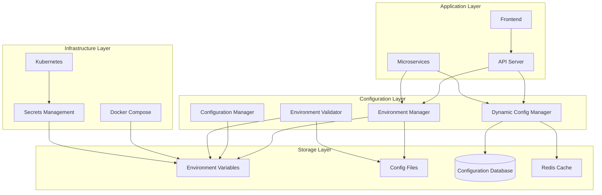

**Diagram sources**
- [environment_manager.hpp](file://shared/config/environment_manager.hpp#L53-L98)
- [configuration_manager.cpp](file://shared/config/configuration_manager.cpp#L1-L50)
- [dynamic_config_manager.cpp](file://shared/config/dynamic_config_manager.cpp#L1-L50)

## Configuration Management System

### Environment Manager

The Environment Manager serves as the central hub for configuration loading and management, implementing a singleton pattern to ensure consistent configuration access across the application:

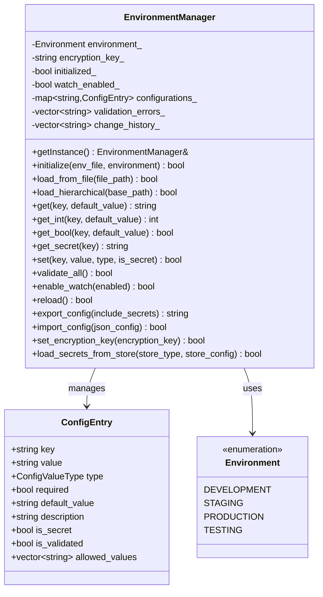

**Diagram sources**
- [environment_manager.hpp](file://shared/config/environment_manager.hpp#L53-L98)
- [environment_manager.hpp](file://shared/config/environment_manager.hpp#L35-L50)

### Hierarchical Configuration Loading

The system implements a sophisticated hierarchical configuration loading mechanism that prioritizes configuration sources in the following order:

1. **Default Values**: Built-in defaults in the codebase
2. **Environment Variables**: Runtime environment variables
3. **Local Configuration Files**: `.env` files in the working directory
4. **Environment-Specific Files**: `.env.development`, `.env.staging`, `.env.production`
5. **Local Overrides**: `.env.local` for development personalization

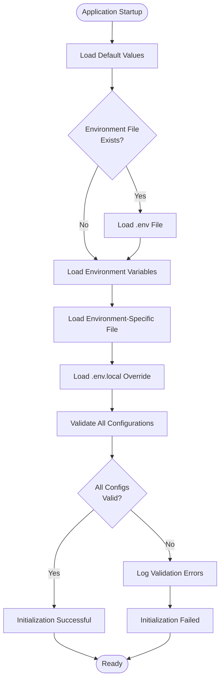

**Diagram sources**
- [environment_manager.hpp](file://shared/config/environment_manager.hpp#L100-L150)
- [configuration_manager.cpp](file://shared/config/configuration_manager.cpp#L20-L50)

**Section sources**
- [environment_manager.hpp](file://shared/config/environment_manager.hpp#L100-L150)
- [configuration_manager.cpp](file://shared/config/configuration_manager.cpp#L20-L50)

### Configuration Types and Validation

The system supports multiple configuration value types with built-in validation:

```cpp
enum class ConfigValueType {
    STRING,
    INTEGER,
    BOOLEAN,
    FLOAT,
    SECRET,        // Encrypted secrets
    URL,
    EMAIL,
    PORT,
    FILE_PATH
};
```

Each configuration entry includes metadata for validation, type safety, and security:

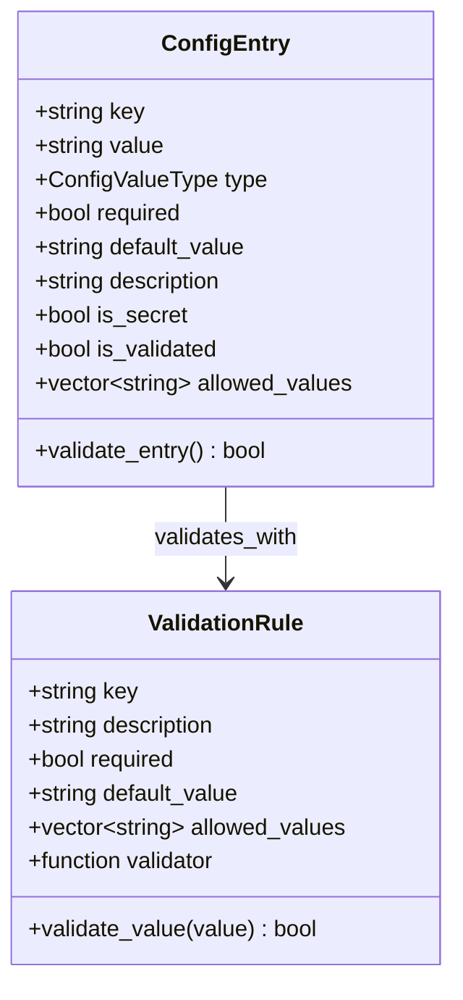

**Diagram sources**
- [environment_manager.hpp](file://shared/config/environment_manager.hpp#L35-L50)
- [environment_validator.cpp](file://shared/config/environment_validator.cpp#L1-L50)

**Section sources**
- [environment_manager.hpp](file://shared/config/environment_manager.hpp#L35-L50)
- [environment_validator.cpp](file://shared/config/environment_validator.cpp#L1-L100)

## Environment Validation

### Validation Rules and Constraints

The Environment Validator implements comprehensive validation rules that vary by environment type and configuration category:

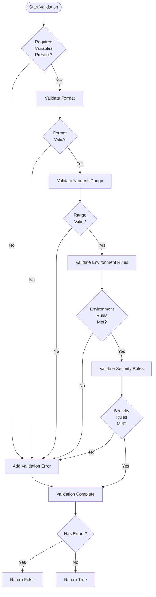

**Diagram sources**
- [environment_validator.cpp](file://shared/config/environment_validator.cpp#L50-L150)

### Environment-Specific Validation Rules

Different environments have different validation requirements:

- **Development**: Allows localhost connections, relaxed security requirements
- **Staging**: Moderate security, allows internal network connections
- **Production**: Strict security, enforces SSL, prohibits localhost connections

**Section sources**
- [environment_validator.cpp](file://shared/config/environment_validator.cpp#L50-L200)

## Dynamic Configuration

### Runtime Configuration Management

The Dynamic Config Manager enables runtime configuration updates without service restarts, storing configurations in a PostgreSQL database with caching for performance:

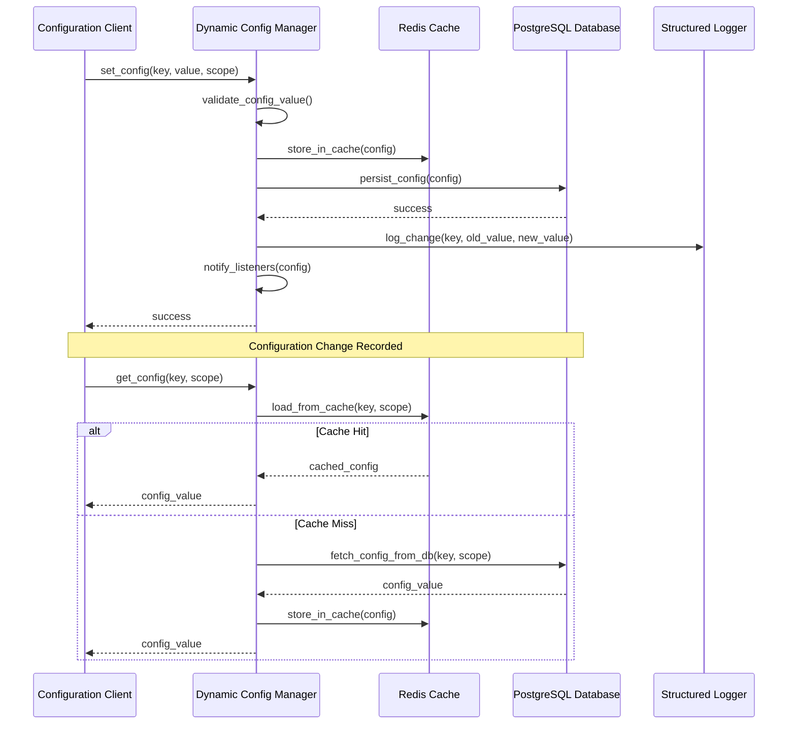

**Diagram sources**
- [dynamic_config_manager.cpp](file://shared/config/dynamic_config_manager.cpp#L336-L369)
- [dynamic_config_manager.cpp](file://shared/config/dynamic_config_manager.cpp#L400-L450)

### Configuration Scopes and Types

The system supports multiple configuration scopes and data types:

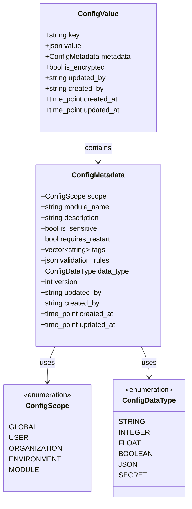

**Diagram sources**
- [dynamic_config_manager.cpp](file://shared/config/dynamic_config_manager.cpp#L141-L174)
- [dynamic_config_manager.cpp](file://shared/config/dynamic_config_manager.cpp#L200-L250)

**Section sources**
- [dynamic_config_manager.cpp](file://shared/config/dynamic_config_manager.cpp#L141-L200)
- [dynamic_config_manager.cpp](file://shared/config/dynamic_config_manager.cpp#L336-L400)

## Deployment Infrastructure

### Docker Compose Environment

The Docker Compose setup provides a development environment with integrated services:

```yaml
services:
  postgres:
    image: pgvector/pgvector:pg15
    environment:
      POSTGRES_DB: ${DB_NAME:?DB_NAME environment variable is required}
      POSTGRES_USER: ${DB_USER:?DB_USER environment variable is required}
      POSTGRES_PASSWORD: ${DB_PASSWORD:?DB_PASSWORD environment variable is required}
    volumes:
      - postgres_data:/var/lib/postgresql/data
      - ./schema.sql:/docker-entrypoint-initdb.d/01-schema.sql
      - ./seed_data.sql:/docker-entrypoint-initdb.d/02-seed.sql
    ports:
      - "5432:5432"
    healthcheck:
      test: ["CMD-SHELL", "pg_isready -U ${DB_USER:-regulens_user} -d ${DB_NAME:-regulens_compliance}"]
      interval: 10s
      timeout: 5s
      retries: 3
      start_period: 10s
```

### Kubernetes Integration

The Kubernetes deployment uses Custom Resource Definitions (CRDs) for managing Regulens-specific resources:

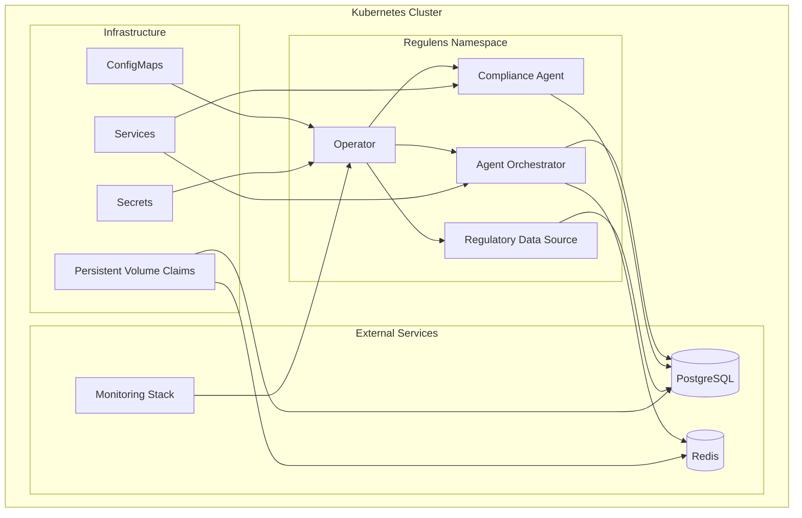

**Diagram sources**
- [infrastructure/k8s/crds/agent_orchestrator_crd.yaml](file://infrastructure/k8s/crds/agent_orchestrator_crd.yaml#L1-L50)
- [infrastructure/k8s/operator/operator_framework.cpp](file://infrastructure/k8s/operator/operator_framework.cpp#L1-L100)

**Section sources**
- [docker-compose.yml](file://docker-compose.yml#L1-L50)
- [infrastructure/k8s/crds/agent_orchestrator_crd.yaml](file://infrastructure/k8s/crds/agent_orchestrator_crd.yaml#L1-L100)

## Service Discovery and Communication

### Inter-Service Communication Patterns

The system implements several communication patterns for service discovery and inter-service communication:

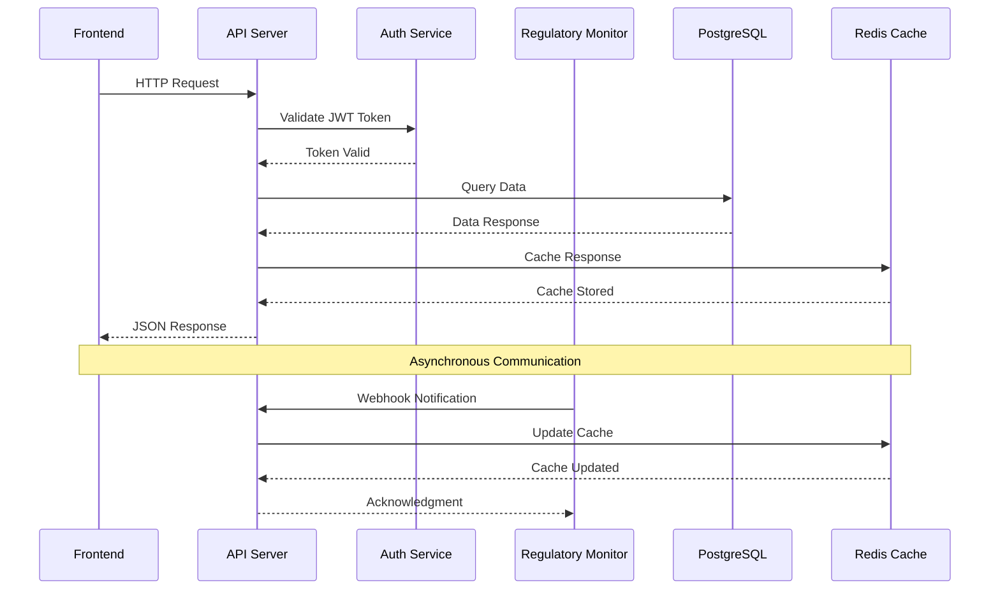

**Diagram sources**
- [frontend/src/services/api.ts](file://frontend/src/services/api.ts#L1-L100)
- [infrastructure/k8s/operator/operator_framework.cpp](file://infrastructure/k8s/operator/operator_framework.cpp#L200-L300)

### Kubernetes Service Discovery

In Kubernetes environments, services are discovered through DNS-based service discovery:

- **Internal Services**: Accessible via service names (e.g., `postgres`, `redis`)
- **External Services**: Configured through environment variables
- **Headless Services**: Used for stateful services requiring direct pod access

**Section sources**
- [frontend/src/services/api.ts](file://frontend/src/services/api.ts#L1-L200)
- [infrastructure/k8s/operator/operator_framework.cpp](file://infrastructure/k8s/operator/operator_framework.cpp#L1-L100)

## Security and Secrets Management

### Secret Storage and Encryption

The system implements multiple secret storage mechanisms with encryption:

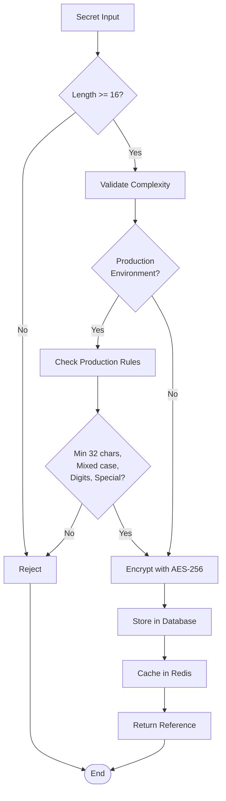

**Diagram sources**
- [environment_manager.hpp](file://shared/config/environment_manager.hpp#L300-L350)
- [environment_validator.cpp](file://shared/config/environment_validator.cpp#L100-L150)

### External Secret Management

The system integrates with external secret management systems:

- **HashiCorp Vault**: Enterprise-grade secret storage
- **AWS Secrets Manager**: Cloud-native AWS integration
- **Azure Key Vault**: Microsoft Azure integration
- **Google Cloud Secret Manager**: Google Cloud Platform integration

**Section sources**
- [environment_manager.hpp](file://shared/config/environment_manager.hpp#L300-L394)
- [environment_validator.cpp](file://shared/config/environment_validator.cpp#L100-L200)

## Performance Considerations

### Caching Strategy

The system implements a multi-layer caching strategy:

1. **Redis Cache**: Fast in-memory caching for frequently accessed configurations
2. **Application Cache**: In-process caching within the Environment Manager
3. **Database Query Cache**: PostgreSQL query result caching

### Configuration Loading Performance

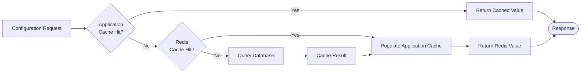

### Monitoring and Metrics

The system provides comprehensive monitoring capabilities:

- **Configuration Changes**: Track all configuration modifications
- **Validation Failures**: Monitor configuration validation errors
- **Cache Hit Rates**: Measure cache effectiveness
- **Database Performance**: Monitor query performance and latency

**Section sources**
- [dynamic_config_manager.cpp](file://shared/config/dynamic_config_manager.cpp#L80-L120)
- [infrastructure/k8s/operator/operator_framework.cpp](file://infrastructure/k8s/operator/operator_framework.cpp#L300-L400)

## Troubleshooting Guide

### Common Configuration Issues

1. **Missing Environment Variables**
   - Symptoms: Application fails to start
   - Solution: Verify environment variables are set in `.env` file or environment
   - Prevention: Use environment validation rules

2. **Invalid Configuration Values**
   - Symptoms: Runtime errors or unexpected behavior
   - Solution: Check configuration validation logs
   - Prevention: Implement strict validation rules

3. **Secret Decryption Failures**
   - Symptoms: Cannot access encrypted configuration values
   - Solution: Verify encryption key is correct and consistent
   - Prevention: Use centralized secret management

### Debugging Configuration Loading

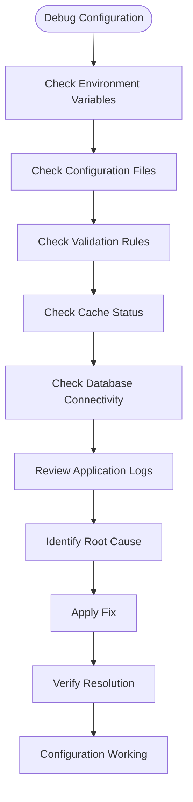

### Health Check Procedures

The system provides comprehensive health checking:

- **Database Connectivity**: Verify PostgreSQL connection
- **Redis Connectivity**: Check Redis cache availability
- **Secret Availability**: Validate secret decryption
- **Configuration Validity**: Ensure all required configurations are present

**Section sources**
- [environment_manager.hpp](file://shared/config/environment_manager.hpp#L200-L250)
- [environment_validator.cpp](file://shared/config/environment_validator.cpp#L200-L300)

## Best Practices

### Configuration Management

1. **Environment Separation**: Use distinct configuration files for each environment
2. **Secret Management**: Never hardcode secrets in configuration files
3. **Validation**: Implement comprehensive validation rules for all configurations
4. **Documentation**: Document all configuration options and their purposes

### Security Guidelines

1. **Encryption**: Always encrypt sensitive configuration values
2. **Access Control**: Limit access to configuration management APIs
3. **Audit Logging**: Log all configuration changes for security auditing
4. **Principle of Least Privilege**: Grant minimal necessary permissions

### Operational Excellence

1. **Monitoring**: Implement comprehensive monitoring and alerting
2. **Backup**: Regular backups of configuration data
3. **Testing**: Thoroughly test configuration changes in staging
4. **Rollback**: Maintain ability to rollback configuration changes quickly

### Development Workflow

1. **Local Development**: Use `.env.local` for personal development overrides
2. **CI/CD Integration**: Automate configuration validation in CI/CD pipelines
3. **Environment Parity**: Maintain consistency between development and production environments
4. **Documentation**: Keep configuration documentation up to date