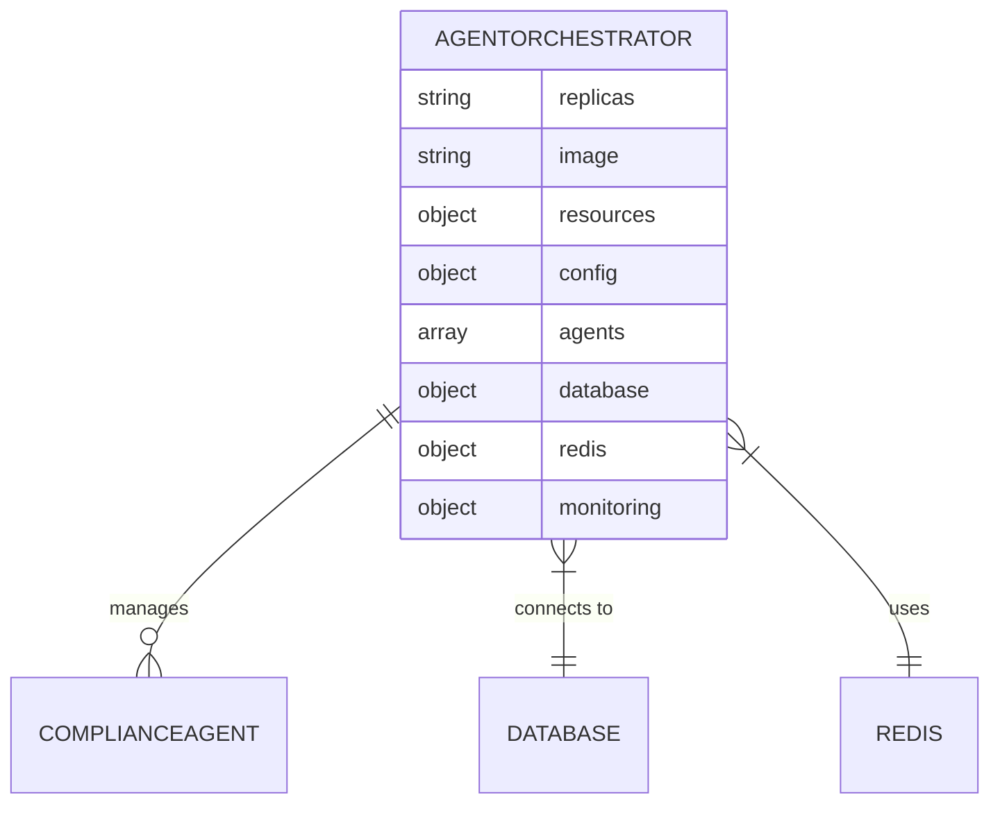
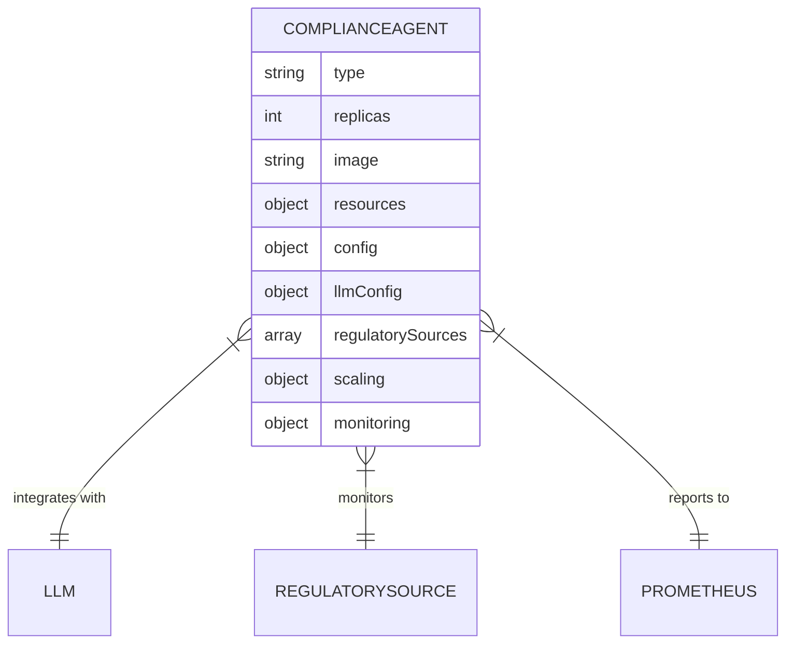
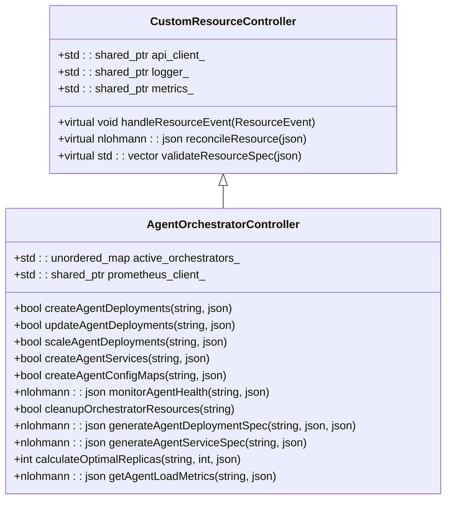
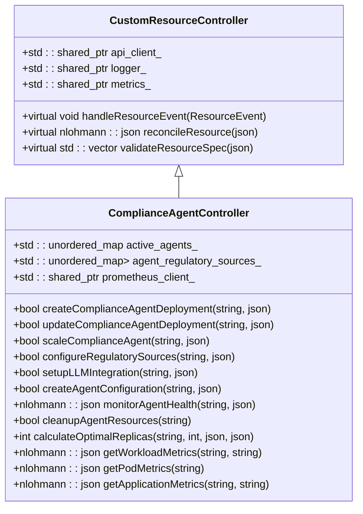
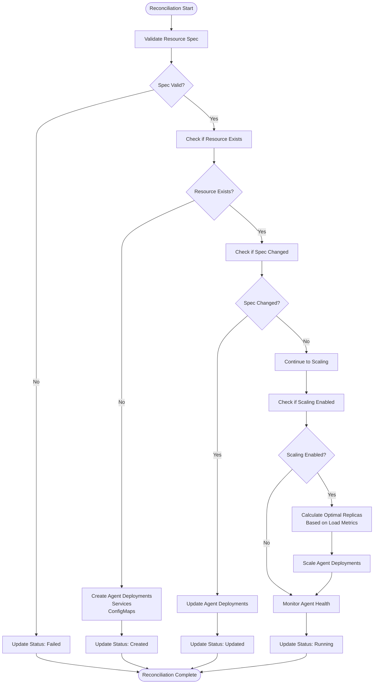
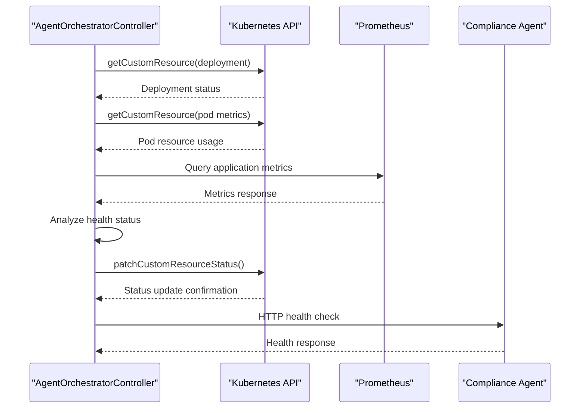
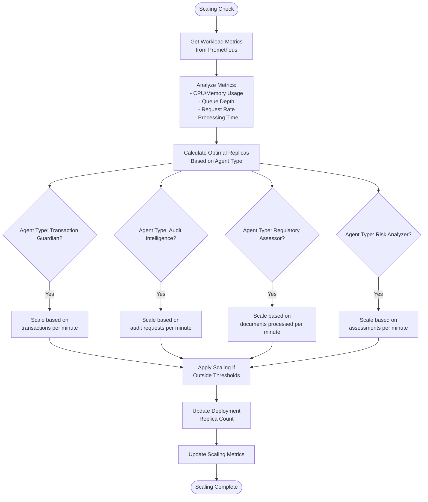
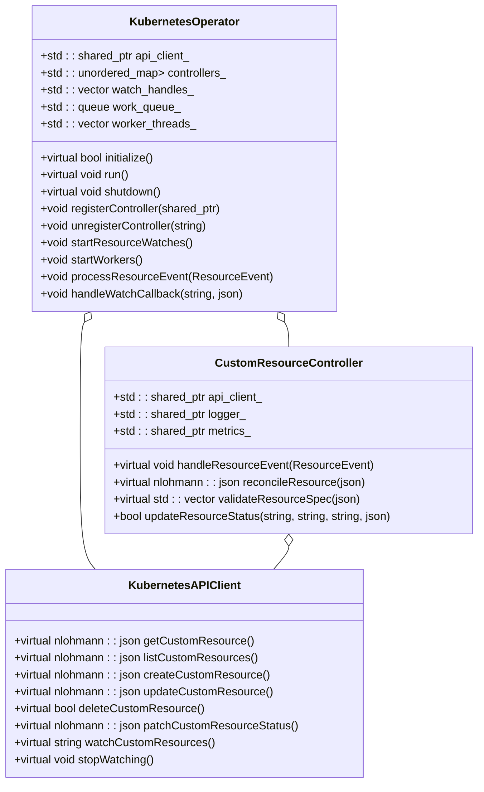
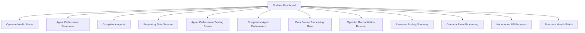
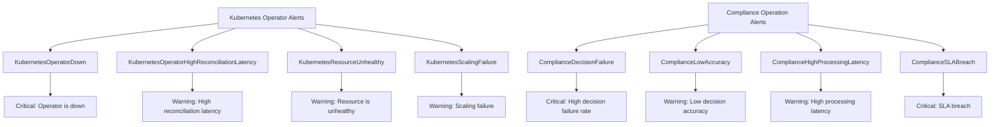

# Kubernetes Deployment

<cite>
**Referenced Files in This Document**   
- [agent_orchestrator_crd.yaml](file://infrastructure/k8s/crds/agent_orchestrator_crd.yaml)
- [compliance_agent_crd.yaml](file://infrastructure/k8s/crds/compliance_agent_crd.yaml)
- [agent_orchestrator_controller.hpp](file://infrastructure/k8s/operator/agent_orchestrator_controller.hpp)
- [agent_orchestrator_controller.cpp](file://infrastructure/k8s/operator/agent_orchestrator_controller.cpp)
- [compliance_agent_controller.hpp](file://infrastructure/k8s/operator/compliance_agent_controller.hpp)
- [compliance_agent_controller.cpp](file://infrastructure/k8s/operator/compliance_agent_controller.cpp)
- [operator_framework.hpp](file://infrastructure/k8s/operator/operator_framework.hpp)
- [operator_framework.cpp](file://infrastructure/k8s/operator/operator_framework.cpp)
- [kubernetes-operators.json](file://infrastructure/monitoring/grafana/dashboards/kubernetes-operators.json)
- [alerting-rules.yml](file://infrastructure/monitoring/prometheus/alerting-rules.yml)
</cite>

## Table of Contents
1. [Introduction](#introduction)
2. [Custom Resource Definitions](#custom-resource-definitions)
3. [Operator Design Pattern](#operator-design-pattern)
4. [Reconciliation Loop Implementation](#reconciliation-loop-implementation)
5. [Agent Health Monitoring and Auto-Scaling](#agent-health-monitoring-and-auto-scaling)
6. [Configuration Management](#configuration-management)
7. [C++ Operator Framework Integration](#c-operator-framework-integration)
8. [Production-Grade Considerations](#production-grade-considerations)
9. [Monitoring and Observability](#monitoring-and-observability)
10. [Conclusion](#conclusion)

## Introduction

The Regulens platform implements a sophisticated Kubernetes operator architecture for managing compliance agents in financial regulatory environments. The system is built around two primary custom controllers: the AgentOrchestratorController and ComplianceAgentController, which manage the lifecycle of agent orchestrators and compliance agents respectively. These controllers implement the Kubernetes operator pattern using a custom C++ framework that provides enterprise-grade reliability, monitoring, and scalability features.

The operators manage custom resources that define complex compliance workloads, including transaction monitoring, audit intelligence, regulatory assessment, and risk analysis. The system integrates with Prometheus for metrics collection, implements comprehensive health checks, and supports auto-scaling based on workload metrics. The architecture is designed for production environments with features like leader election, multi-threaded reconciliation, and detailed error handling.

**Section sources**
- [agent_orchestrator_controller.hpp](file://infrastructure/k8s/operator/agent_orchestrator_controller.hpp#L1-L50)
- [compliance_agent_controller.hpp](file://infrastructure/k8s/operator/compliance_agent_controller.hpp#L1-L50)

## Custom Resource Definitions

### AgentOrchestrator CRD

The AgentOrchestrator custom resource definition (CRD) defines the schema for orchestrating multiple compliance agents. It includes specifications for resource allocation, agent configuration, database connectivity, and monitoring settings.

The CRD defines the following key properties:

- **replicas**: Number of orchestrator replicas (1-100, default 3)
- **image**: Container image for the orchestrator
- **resources**: CPU and memory requests/limits for the orchestrator
- **config**: Configuration parameters including log level, metrics, and circuit breaker settings
- **agents**: Array of agent specifications including name, type, replicas, and priority
- **database**: PostgreSQL database connection configuration
- **redis**: Redis cache configuration
- **monitoring**: Prometheus, Grafana, and AlertManager integration settings

The status subresource tracks the operational state with fields for phase, replicas, conditions, and agent health status.

**Diagram sources**
- [agent_orchestrator_crd.yaml](file://infrastructure/k8s/crds/agent_orchestrator_crd.yaml#L1-L200)

**Section sources**
- [agent_orchestrator_crd.yaml](file://infrastructure/k8s/crds/agent_orchestrator_crd.yaml#L1-L205)

### ComplianceAgent CRD

The ComplianceAgent CRD defines the schema for individual compliance agents that perform specialized regulatory functions. Each agent type has specific configuration requirements for LLM integration, regulatory sources, and scaling behavior.

The CRD includes these key specifications:

- **type**: Agent type (transaction_guardian, audit_intelligence, regulatory_assessor, risk_analyzer)
- **replicas**: Number of agent replicas (1-50, default 2)
- **image**: Container image for the compliance agent
- **resources**: CPU and memory requests/limits for the agent
- **config**: Agent-specific configuration including log level, processing timeout, and risk thresholds
- **llmConfig**: LLM integration settings including API keys, model selection, and generation parameters
- **regulatorySources**: Array of regulatory sources to monitor with polling intervals and priorities
- **scaling**: Auto-scaling configuration with min/max replicas and resource utilization targets
- **monitoring**: Custom metrics configuration for Prometheus integration

The status subresource provides detailed health information including phase, replica counts, performance metrics, and conditions.

**Diagram sources**
- [compliance_agent_crd.yaml](file://infrastructure/k8s/crds/compliance_agent_crd.yaml#L1-L200)

**Section sources**
- [compliance_agent_crd.yaml](file://infrastructure/k8s/crds/compliance_agent_crd.yaml#L1-L275)

## Operator Design Pattern

### AgentOrchestratorController Architecture

The AgentOrchestratorController implements the Kubernetes operator design pattern to manage the lifecycle of AgentOrchestrator custom resources. It extends the CustomResourceController base class and provides specialized handling for orchestrator-specific operations.

The controller manages the complete lifecycle of agent orchestrators, including creation, updates, and deletion. It maintains an in-memory state of active orchestrators and coordinates the deployment of multiple agent types within each orchestrator. The controller handles resource events (ADDED, MODIFIED, DELETED) and delegates to specialized methods for each operation type.

**Diagram sources**
- [agent_orchestrator_controller.hpp](file://infrastructure/k8s/operator/agent_orchestrator_controller.hpp#L1-L100)

**Section sources**
- [agent_orchestrator_controller.hpp](file://infrastructure/k8s/operator/agent_orchestrator_controller.hpp#L1-L198)

### ComplianceAgentController Architecture

The ComplianceAgentController manages the lifecycle of individual compliance agents with specialized handling for agent-specific requirements like LLM integration and regulatory source configuration.

The controller provides agent-type specific logic for different compliance functions. It manages regulatory source configuration, sets up LLM integration with proper secret management, and handles RBAC configuration for secure operation. The controller also implements specialized monitoring that tracks compliance-specific metrics like decisions processed and processing accuracy.

**Diagram sources**
- [compliance_agent_controller.hpp](file://infrastructure/k8s/operator/compliance_agent_controller.hpp#L1-L100)

**Section sources**
- [compliance_agent_controller.hpp](file://infrastructure/k8s/operator/compliance_agent_controller.hpp#L1-L301)

## Reconciliation Loop Implementation

### Reconciliation Process Flow

The reconciliation loop is the core mechanism by which the operators ensure the desired state defined in custom resources matches the actual state in the Kubernetes cluster. The process follows a consistent pattern across both controllers.

The reconciliation process begins with validation of the resource specification. If validation fails, the controller updates the resource status with error details. For valid specifications, the controller checks whether the resource already exists. New resources trigger the creation of deployments, services, and configuration resources. Existing resources are checked for specification changes, which trigger updates to the underlying Kubernetes resources.

**Diagram sources**
- [agent_orchestrator_controller.cpp](file://infrastructure/k8s/operator/agent_orchestrator_controller.cpp#L100-L300)
- [compliance_agent_controller.cpp](file://infrastructure/k8s/operator/compliance_agent_controller.cpp#L100-L300)

**Section sources**
- [agent_orchestrator_controller.cpp](file://infrastructure/k8s/operator/agent_orchestrator_controller.cpp#L1-L910)
- [compliance_agent_controller.cpp](file://infrastructure/k8s/operator/compliance_agent_controller.cpp#L1-L1222)

### Resource Creation and Management

The operators implement comprehensive resource management for all components required by compliance agents. This includes deployments, services, configmaps, secrets, and service accounts.

For agent orchestrators, the `createAgentDeployments` method generates Kubernetes deployment specifications for each agent type specified in the orchestrator configuration. The deployment spec includes proper resource requests and limits, environment variables, readiness and liveness probes, and pod labels for service discovery.

The `createAgentServices` method creates Kubernetes services that expose agent endpoints within the cluster. Each service includes selectors that match the pod labels from the corresponding deployment, ensuring proper routing of traffic.

Configuration management is handled through configmaps and secrets. The `createAgentConfigMaps` method creates configmaps containing agent configuration in YAML format, while sensitive credentials are stored in Kubernetes secrets managed through the `generateAgentSecretSpec` method.

When an orchestrator or agent is deleted, the corresponding cleanup methods ensure all associated resources are properly removed from the cluster, preventing resource leaks.

**Section sources**
- [agent_orchestrator_controller.cpp](file://infrastructure/k8s/operator/agent_orchestrator_controller.cpp#L300-L600)
- [compliance_agent_controller.cpp](file://infrastructure/k8s/operator/compliance_agent_controller.cpp#L300-L600)

## Agent Health Monitoring and Auto-Scaling

### Health Monitoring Implementation

The operators implement comprehensive health monitoring for all managed resources, providing detailed status information through the custom resource status subresource.

The health monitoring process collects information from multiple sources:
1. Kubernetes API for deployment and pod status (available replicas, conditions)
2. Kubernetes Metrics API for CPU and memory usage
3. Prometheus for application-specific metrics (requests, errors, processing times)
4. Direct HTTP health checks to agent endpoints

The `monitorAgentHealth` method in both controllers aggregates this information to determine the overall health status. It checks for sufficient available replicas, analyzes resource utilization, and evaluates application performance metrics. The health status is then updated in the custom resource status, making it available for external monitoring systems.

**Diagram sources**
- [agent_orchestrator_controller.cpp](file://infrastructure/k8s/operator/agent_orchestrator_controller.cpp#L600-L700)
- [compliance_agent_controller.cpp](file://infrastructure/k8s/operator/compliance_agent_controller.cpp#L600-L700)

**Section sources**
- [agent_orchestrator_controller.cpp](file://infrastructure/k8s/operator/agent_orchestrator_controller.cpp#L600-L750)
- [compliance_agent_controller.cpp](file://infrastructure/k8s/operator/compliance_agent_controller.cpp#L600-L750)

### Auto-Scaling Logic

The operators implement intelligent auto-scaling based on real-time workload metrics collected from Prometheus. The scaling logic varies by agent type to accommodate different workload patterns.

The `calculateOptimalReplicas` method implements agent-type specific scaling logic:
- **Transaction Guardian**: Scales based on transaction volume, increasing replicas when transactions per minute exceed thresholds
- **Audit Intelligence**: Scales based on audit request rate, adjusting replicas according to workload intensity
- **Regulatory Assessor**: Scales based on document processing volume, ensuring sufficient capacity for regulatory analysis
- **Risk Analyzer**: Scales based on risk assessment requests, maintaining performance under varying loads

The scaling decisions are based on configurable thresholds in the CRD's scaling section, including target CPU and memory utilization percentages, scale-up and scale-down thresholds, and minimum/maximum replica counts.

**Diagram sources**
- [agent_orchestrator_controller.cpp](file://infrastructure/k8s/operator/agent_orchestrator_controller.cpp#L500-L600)
- [compliance_agent_controller.cpp](file://infrastructure/k8s/operator/compliance_agent_controller.cpp#L800-L900)

**Section sources**
- [agent_orchestrator_controller.cpp](file://infrastructure/k8s/operator/agent_orchestrator_controller.cpp#L500-L600)
- [compliance_agent_controller.cpp](file://infrastructure/k8s/operator/compliance_agent_controller.cpp#L800-L900)

## Configuration Management

### Configuration Structure

The operators implement comprehensive configuration management through the custom resource specifications. The configuration is structured hierarchically, with orchestrator-level settings that apply to all agents and agent-specific overrides.

The configuration schema includes:
- **Resource allocation**: CPU and memory requests/limits for containers
- **Operational parameters**: Log levels, timeouts, and concurrency settings
- **Database connectivity**: PostgreSQL connection details with SSL mode configuration
- **Cache configuration**: Redis host, port, and database selection
- **Monitoring integration**: Prometheus, Grafana, and AlertManager enablement
- **Agent-specific settings**: Risk thresholds, confidence levels, and processing parameters

Configuration values can be overridden at multiple levels, allowing for both global defaults and specific customizations. The operators validate all configuration values against defined constraints (minimum/maximum values, allowed enums) before applying them to ensure system stability.

**Section sources**
- [agent_orchestrator_crd.yaml](file://infrastructure/k8s/crds/agent_orchestrator_crd.yaml#L50-L150)
- [compliance_agent_crd.yaml](file://infrastructure/k8s/crds/compliance_agent_crd.yaml#L50-L150)

### Configuration Propagation

Configuration changes are propagated through the reconciliation loop, ensuring that updated settings are applied to running agents.

When a configuration change is detected, the operator:
1. Validates the new configuration against schema constraints
2. Updates the agent's deployment specification with new environment variables
3. Applies the updated deployment to the Kubernetes cluster
4. Monitors the rolling update to ensure successful deployment
5. Updates the resource status with the new configuration version

Sensitive configuration values (database passwords, API keys) are managed through Kubernetes secrets, which are automatically created and updated by the operator. This ensures that credentials are never exposed in plaintext in configuration files.

The configuration system supports hot reloading for certain parameters, allowing agents to adapt to configuration changes without requiring a full restart, minimizing disruption to compliance operations.

**Section sources**
- [agent_orchestrator_controller.cpp](file://infrastructure/k8s/operator/agent_orchestrator_controller.cpp#L300-L400)
- [compliance_agent_controller.cpp](file://infrastructure/k8s/operator/compliance_agent_controller.cpp#L300-L400)

## C++ Operator Framework Integration

### Framework Architecture

The operators are built on a custom C++ operator framework that provides the foundational capabilities for Kubernetes operator development.

The framework provides:
- **KubernetesAPIClient**: Abstract interface for Kubernetes API operations with a production implementation using HTTP requests
- **CustomResourceController**: Base class for controller implementations with common functionality
- **KubernetesOperator**: Main operator class that manages controllers, watches, and worker threads

The framework handles low-level Kubernetes interactions, event processing, and concurrency management, allowing the specific controllers to focus on business logic.

**Diagram sources**
- [operator_framework.hpp](file://infrastructure/k8s/operator/operator_framework.hpp#L1-L100)

**Section sources**
- [operator_framework.hpp](file://infrastructure/k8s/operator/operator_framework.hpp#L1-L457)
- [operator_framework.cpp](file://infrastructure/k8s/operator/operator_framework.cpp#L1-L953)

### Integration with Kubernetes API

The C++ operator framework integrates with the Kubernetes API server through RESTful HTTP calls, implementing the necessary authentication and authorization mechanisms.

The `KubernetesAPIClientImpl` class handles:
- Service account token authentication using Kubernetes secrets
- Proper API URL construction for different resource types and versions
- Error handling and retry logic for API calls
- Watch functionality using periodic polling with resource version tracking
- JSON serialization/deserialization for API payloads

The framework implements proper error handling for API failures, including network issues, authentication problems, and resource conflicts. It also includes logging of API operations for troubleshooting and audit purposes.

Worker threads process resource events from a queue, allowing for concurrent reconciliation of multiple resources while maintaining thread safety through mutex protection of shared state.

**Section sources**
- [operator_framework.cpp](file://infrastructure/k8s/operator/operator_framework.cpp#L1-L500)

## Production-Grade Considerations

### Error Handling and Resilience

The operators implement comprehensive error handling and resilience features to ensure reliable operation in production environments.

Key error handling mechanisms include:
- **Exception safety**: All controller methods are wrapped in try-catch blocks to prevent crashes
- **Event processing metrics**: Counters track processed and failed events for monitoring
- **Graceful degradation**: When non-critical operations fail (e.g., service creation), the operator continues with core functionality
- **Retry logic**: Transient failures are handled with appropriate backoff strategies
- **Detailed logging**: All errors are logged with context for troubleshooting

The operators also implement circuit breaker patterns for external dependencies, preventing cascading failures when downstream systems are unavailable. Health checks monitor the operator's own health and the health of managed resources, providing early warning of potential issues.

**Section sources**
- [agent_orchestrator_controller.cpp](file://infrastructure/k8s/operator/agent_orchestrator_controller.cpp#L50-L100)
- [compliance_agent_controller.cpp](file://infrastructure/k8s/operator/compliance_agent_controller.cpp#L50-L100)

### Logging and Diagnostics

The operators integrate with the Regulens structured logging system to provide comprehensive diagnostics and audit trails.

Log entries include:
- **Structured fields**: Key-value pairs for important context (controller, method, resource name)
- **Event correlation**: Unique identifiers to trace related operations
- **Performance metrics**: Timing information for critical operations
- **Error context**: Detailed information about failures for troubleshooting

The logging system supports different log levels (DEBUG, INFO, WARN, ERROR) that can be configured per component, allowing for detailed debugging in development and minimal logging in production.

**Section sources**
- [agent_orchestrator_controller.cpp](file://infrastructure/k8s/operator/agent_orchestrator_controller.cpp#L50-L100)
- [compliance_agent_controller.cpp](file://infrastructure/k8s/operator/compliance_agent_controller.cpp#L50-L100)

## Monitoring and Observability

### Metrics Collection

The operators expose comprehensive metrics for monitoring system health and performance. These metrics are collected by the PrometheusMetricsCollector and exposed through a standard metrics endpoint.

Key metrics include:
- **Controller metrics**: Events processed, reconciliation duration, resource counts
- **Scaling metrics**: Scaling operations, replica counts, scaling decisions
- **Health metrics**: Agent availability, resource utilization, error rates
- **API metrics**: Kubernetes API request rates and latencies

The metrics are designed to support alerting rules that detect potential issues before they impact service availability.

**Section sources**
- [agent_orchestrator_controller.cpp](file://infrastructure/k8s/operator/agent_orchestrator_controller.cpp#L80-L100)
- [compliance_agent_controller.cpp](file://infrastructure/k8s/operator/compliance_agent_controller.cpp#L80-L100)

### Grafana Dashboards

The system includes pre-configured Grafana dashboards for visualizing operator and agent metrics.

The dashboard provides real-time visibility into:
- Operator health and availability
- Resource utilization across orchestrators and agents
- Scaling activity and performance metrics
- Reconciliation latency and event processing rates
- Overall system health status

**Diagram sources**
- [kubernetes-operators.json](file://infrastructure/monitoring/grafana/dashboards/kubernetes-operators.json#L1-L185)

**Section sources**
- [kubernetes-operators.json](file://infrastructure/monitoring/grafana/dashboards/kubernetes-operators.json#L1-L185)

### Alerting Rules

The system includes comprehensive Prometheus alerting rules to detect and notify on potential issues.

The alerting rules cover:
- **Operator health**: Operator availability and performance
- **Resource health**: Status of managed custom resources
- **Scaling operations**: Success and performance of scaling activities
- **Compliance operations**: Accuracy and performance of compliance decisions
- **System health**: Resource utilization and error rates

These alerts enable proactive monitoring and rapid response to potential issues in the compliance system.

**Diagram sources**
- [alerting-rules.yml](file://infrastructure/monitoring/prometheus/alerting-rules.yml#L1-L50)

**Section sources**
- [alerting-rules.yml](file://infrastructure/monitoring/prometheus/alerting-rules.yml#L1-L446)

## Conclusion

The Regulens Kubernetes operator architecture provides a robust foundation for managing compliance agents in financial regulatory environments. The system implements the operator pattern using a custom C++ framework that provides enterprise-grade reliability, monitoring, and scalability.

Key architectural strengths include:
- **Modular design**: Clear separation between the generic operator framework and specific controllers
- **Comprehensive lifecycle management**: Full CRUD operations for custom resources with proper cleanup
- **Intelligent scaling**: Workload-based auto-scaling with agent-type specific logic
- **Production readiness**: Comprehensive error handling, logging, and monitoring
- **Extensibility**: Well-defined interfaces that allow for adding new controller types

The integration with Prometheus and Grafana provides excellent observability, while the alerting rules enable proactive monitoring of system health. The operators are designed for high availability with features like leader election and multi-threaded reconciliation.

This architecture effectively addresses the complex requirements of financial compliance systems, providing a scalable, reliable, and observable platform for managing regulatory compliance agents.