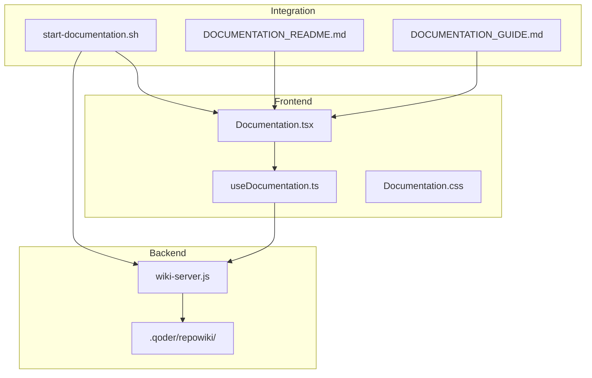
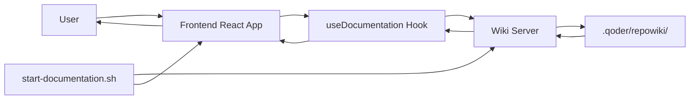
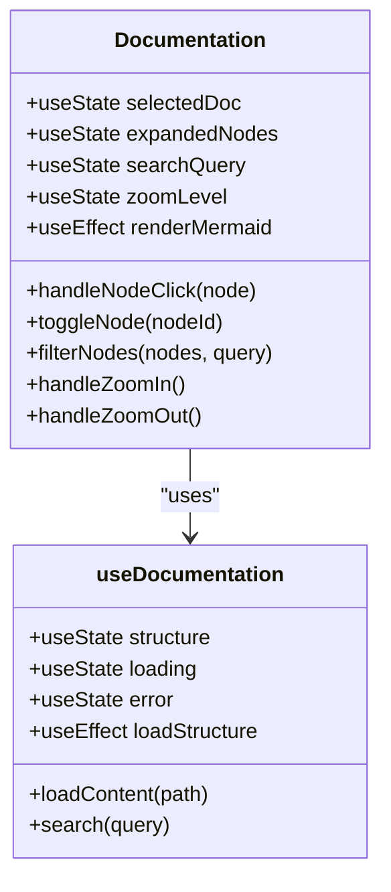
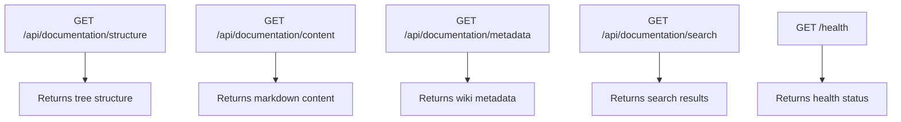
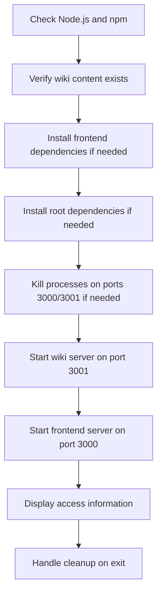
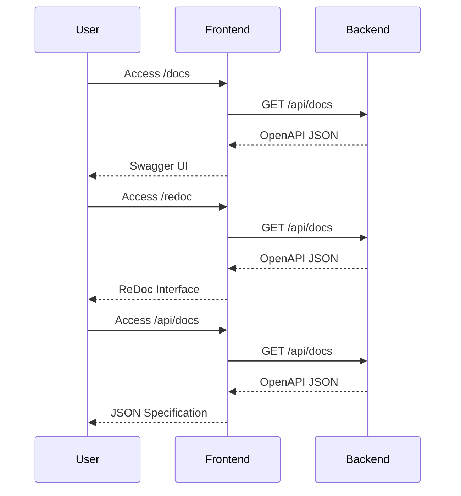
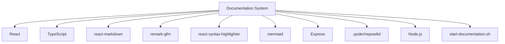

# Documentation System

<cite>
**Referenced Files in This Document**   
- [openapi_generator.cpp](file://shared/api_docs/openapi_generator.cpp)
- [openapi_generator.hpp](file://shared/api_docs/openapi_generator.hpp)
- [web_ui_handlers.hpp](file://shared/web_ui/web_ui_handlers.hpp)
- [web_ui_handlers.cpp](file://shared/web_ui/web_ui_handlers.cpp)
- [wiki-server.js](file://wiki-server.js)
- [Documentation.tsx](file://frontend/src/pages/Documentation.tsx)
- [useDocumentation.ts](file://frontend/src/hooks/useDocumentation.ts)
- [start-documentation.sh](file://start-documentation.sh)
- [DOCUMENTATION_README.md](file://DOCUMENTATION_README.md)
- [DOCUMENTATION_GUIDE.md](file://DOCUMENTATION_GUIDE.md)
- [regulatory_monitor_ui.cpp](file://shared/web_ui/regulatory_monitor_ui.cpp)
- [api_registry.cpp](file://shared/api_registry/api_registry.cpp)
- [api_registry.hpp](file://shared/api_registry/api_registry.hpp)
- [Settings.tsx](file://frontend/src/pages/Settings.tsx)
</cite>

## Update Summary
- Updated documentation to reflect automated startup process
- Added details about integrated frontend and backend server startup
- Enhanced troubleshooting guidance with startup script details
- Updated architecture overview to reflect new integration pattern
- Added new section on startup script functionality

## Table of Contents
1. [Introduction](#introduction)
2. [Project Structure](#project-structure)
3. [Core Components](#core-components)
4. [Architecture Overview](#architecture-overview)
5. [Detailed Component Analysis](#detailed-component-analysis)
6. [Dependency Analysis](#dependency-analysis)
7. [Performance Considerations](#performance-considerations)
8. [Troubleshooting Guide](#troubleshooting-guide)
9. [Conclusion](#conclusion)

## Introduction
The Documentation System for Regulens is a comprehensive web-based solution designed to transform the project's wiki into an interactive, navigable documentation experience. This system provides developers and users with a modern interface for accessing technical documentation, API references, and system architecture details. The implementation combines a React frontend with a Node.js backend to deliver a seamless documentation experience featuring interactive tree navigation, Mermaid diagram rendering, syntax highlighting, and full-text search capabilities. The system supports multiple documentation formats including Swagger UI, ReDoc, and OpenAPI JSON specifications, making it accessible to both technical and non-technical users. Recent updates have automated the wiki server startup process and integrated it with the frontend development server for a streamlined development experience.

**Section sources**
- [start-documentation.sh](file://start-documentation.sh)
- [DOCUMENTATION_README.md](file://DOCUMENTATION_README.md)

## Project Structure
The Documentation System consists of two main components: a frontend React application and a backend Node.js server. The frontend provides the user interface for browsing documentation, while the backend serves the documentation content from the wiki repository. The system is designed to be modular and extensible, allowing for easy integration with the existing Regulens codebase. A new startup script has been implemented to automate the process of starting both the wiki API server and the frontend development server, eliminating manual setup steps.

**Diagram sources**
- [Documentation.tsx](file://frontend/src/pages/Documentation.tsx)
- [useDocumentation.ts](file://frontend/src/hooks/useDocumentation.ts)
- [wiki-server.js](file://wiki-server.js)
- [start-documentation.sh](file://start-documentation.sh)

**Section sources**
- [Documentation.tsx](file://frontend/src/pages/Documentation.tsx)
- [wiki-server.js](file://wiki-server.js)
- [start-documentation.sh](file://start-documentation.sh)

## Core Components
The Documentation System comprises several core components that work together to deliver a comprehensive documentation experience. The system features an interactive tree navigation component that displays the documentation structure in a hierarchical format, allowing users to easily browse through different sections. The content viewer component renders Markdown files with full support for GitHub Flavored Markdown, including code blocks, tables, and embedded diagrams. The search functionality enables full-text search across all documentation files, with results displayed in a user-friendly format. The system also includes zoom controls for adjusting the content size and a responsive design that works well on different screen sizes. The startup process is now automated through a dedicated script that manages both server instances.

**Section sources**
- [Documentation.tsx](file://frontend/src/pages/Documentation.tsx)
- [useDocumentation.ts](file://frontend/src/hooks/useDocumentation.ts)
- [wiki-server.js](file://wiki-server.js)
- [start-documentation.sh](file://start-documentation.sh)

## Architecture Overview
The Documentation System follows a client-server architecture with a clear separation of concerns between the frontend and backend components. The frontend is built using React and TypeScript, providing a responsive user interface for browsing documentation. The backend is implemented as an Express server that serves the documentation content from the wiki repository. The two components communicate through a REST API, with the frontend making HTTP requests to retrieve documentation structure, content, and search results. A new startup script has been added to automate the initialization process, starting both the wiki API server on port 3001 and the frontend development server on port 3000.

**Diagram sources**
- [Documentation.tsx](file://frontend/src/pages/Documentation.tsx)
- [useDocumentation.ts](file://frontend/src/hooks/useDocumentation.ts)
- [wiki-server.js](file://wiki-server.js)
- [start-documentation.sh](file://start-documentation.sh)

## Detailed Component Analysis

### Documentation Viewer Component
The Documentation Viewer component is the main interface for browsing documentation. It provides a split-pane layout with a tree navigation sidebar on the left and a content viewer on the right. The component handles user interactions such as selecting documents, searching, and adjusting zoom levels.

#### Component Implementation

**Diagram sources**
- [Documentation.tsx](file://frontend/src/pages/Documentation.tsx)
- [useDocumentation.ts](file://frontend/src/hooks/useDocumentation.ts)

### Wiki Server Component
The Wiki Server component is responsible for serving documentation content to the frontend. It provides REST endpoints for retrieving documentation structure, content, metadata, and search results. The server reads files from the wiki repository and returns them in JSON format. The server is now automatically started by the startup script on port 3001.

#### API Endpoints

**Diagram sources**
- [wiki-server.js](file://wiki-server.js)

### Startup Script Component
The startup script component automates the process of launching both the wiki API server and the frontend development server. It performs dependency checks, port management, and process monitoring to ensure a smooth startup experience.

#### Script Functionality

**Diagram sources**
- [start-documentation.sh](file://start-documentation.sh)

**Section sources**
- [start-documentation.sh](file://start-documentation.sh)

### API Documentation System
The API Documentation System provides comprehensive documentation for the Regulens API. It includes interactive documentation viewers, OpenAPI specification generation, and multiple documentation formats.

#### API Documentation Endpoints

**Diagram sources**
- [openapi_generator.cpp](file://shared/api_docs/openapi_generator.cpp)
- [regulatory_monitor_ui.cpp](file://shared/web_ui/regulatory_monitor_ui.cpp)
- [Settings.tsx](file://frontend/src/pages/Settings.tsx)

**Section sources**
- [openapi_generator.cpp](file://shared/api_docs/openapi_generator.cpp)
- [regulatory_monitor_ui.cpp](file://shared/web_ui/regulatory_monitor_ui.cpp)
- [Settings.tsx](file://frontend/src/pages/Settings.tsx)

## Dependency Analysis
The Documentation System has dependencies on several external libraries and internal components. The frontend depends on React, TypeScript, and several npm packages for rendering Markdown, syntax highlighting, and diagram visualization. The backend depends on Express for serving HTTP requests and handling file operations. The system also depends on the wiki content stored in the .qoder/repowiki/ directory. The startup script manages dependency installation automatically when missing packages are detected.

**Diagram sources**
- [package.json](file://frontend/package.json)
- [package.json](file://package.json)
- [wiki-server.js](file://wiki-server.js)
- [start-documentation.sh](file://start-documentation.sh)

## Performance Considerations
The Documentation System is designed with performance in mind. The frontend uses lazy loading to minimize initial load time, and the backend implements efficient file reading and caching mechanisms. The system supports code splitting to reduce bundle size, and the documentation content is loaded on demand when users navigate to different sections. The search functionality is optimized to provide quick results, and the Mermaid diagrams are rendered asynchronously to prevent blocking the main thread. The automated startup script reduces initialization time by handling dependency management and process coordination.

## Troubleshooting Guide
Common issues with the Documentation System include problems with Mermaid diagram rendering, code syntax highlighting, and tree navigation. If Mermaid diagrams are not showing, check the browser console for errors and verify that the mermaid library is properly loaded. If code is not highlighted, ensure that the syntax highlighter theme is imported and that the react-syntax-highlighter package is installed. If the tree is not loading, verify that the wiki server is running on port 3001 and that the wiki content exists at .qoder/repowiki/. For search issues, check that the wiki server is running and that the search API endpoint is accessible. If the startup script fails, check that Node.js and npm are installed, and verify that the wiki content directory exists. Review the wiki-server.log file for detailed error information.

**Section sources**
- [DOCUMENTATION_GUIDE.md](file://DOCUMENTATION_GUIDE.md)
- [wiki-server.js](file://wiki-server.js)
- [Documentation.tsx](file://frontend/src/pages/Documentation.tsx)
- [start-documentation.sh](file://start-documentation.sh)

## Conclusion
The Documentation System for Regulens provides a comprehensive solution for accessing and navigating technical documentation. By combining a modern React frontend with a lightweight Node.js backend, the system delivers an interactive and user-friendly documentation experience. The implementation supports multiple documentation formats, including interactive tree navigation, Mermaid diagram rendering, and syntax highlighting, making it suitable for both technical and non-technical users. The system is designed to be extensible and can be easily integrated with the existing Regulens codebase. Recent updates have automated the startup process through a dedicated script that manages both server instances, improving developer experience and reducing setup time. With its comprehensive feature set and robust architecture, the Documentation System enhances developer productivity and improves access to critical project information.