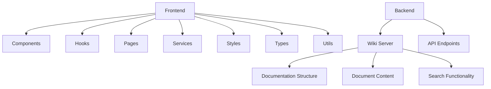
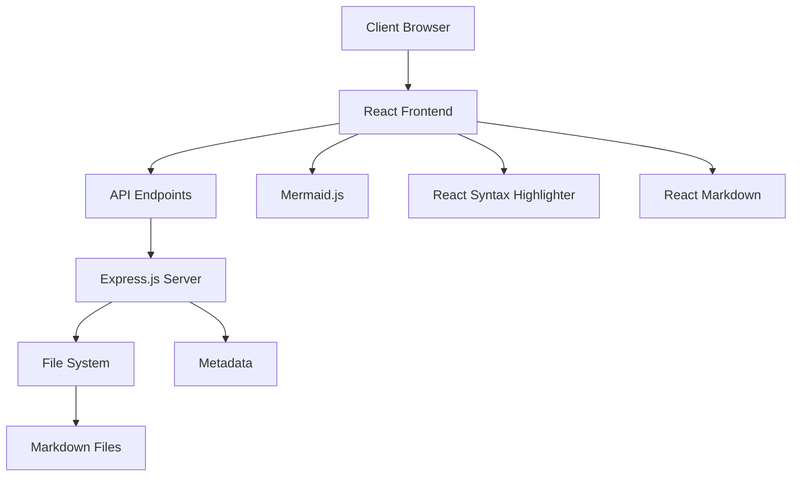
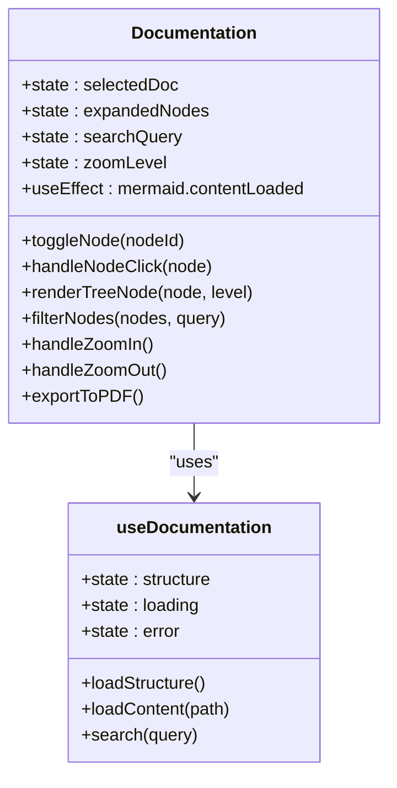
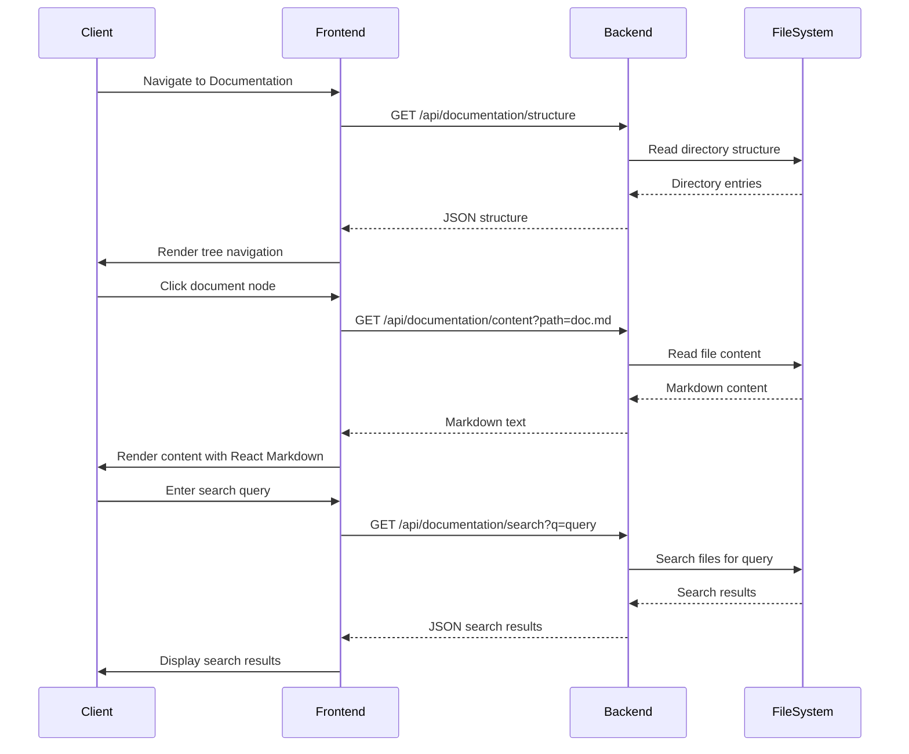
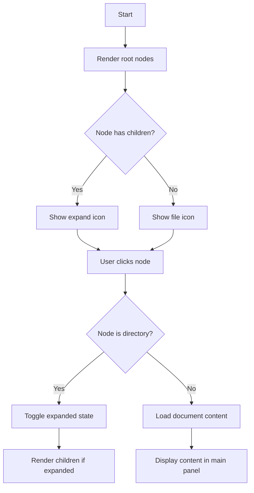
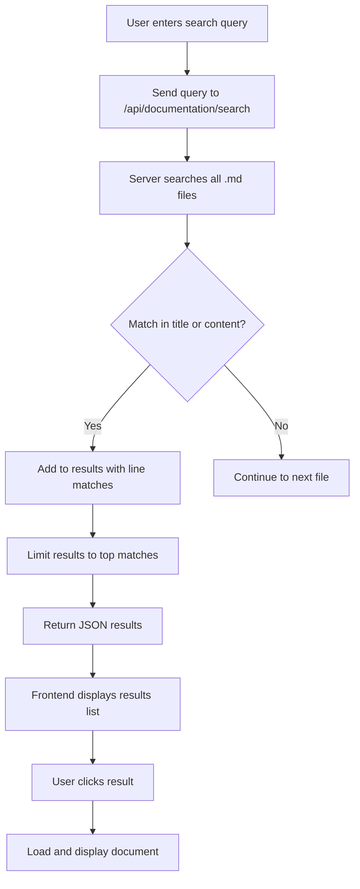
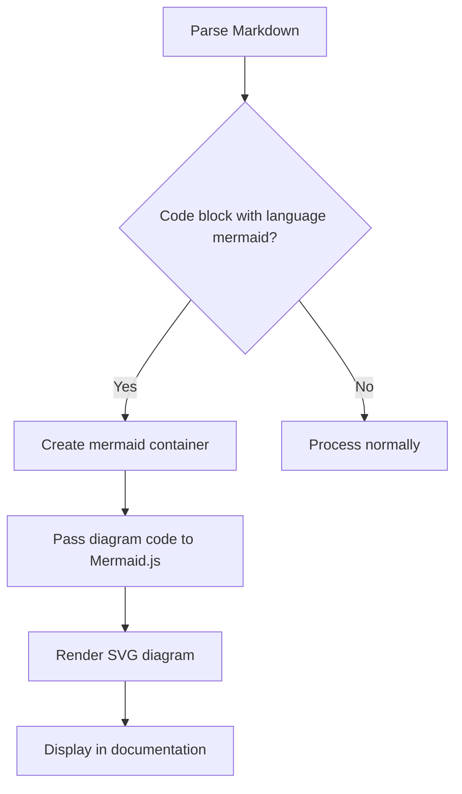
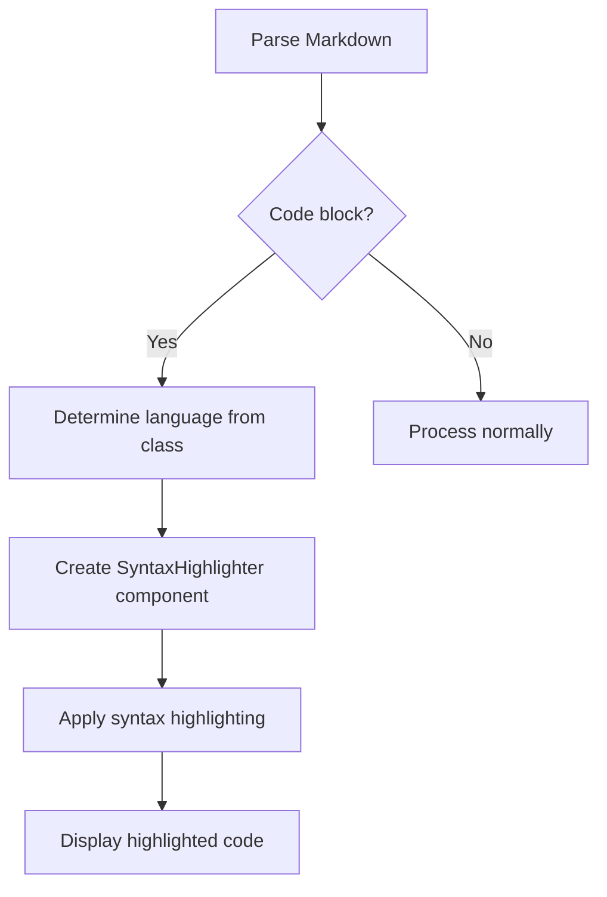
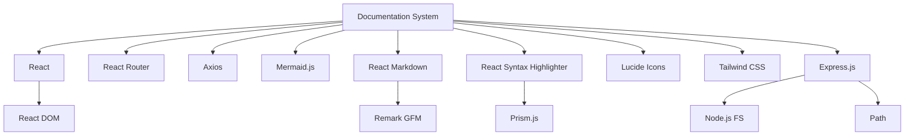

# Documentation System

<cite>
**Referenced Files in This Document**   
- [Documentation.tsx](file://frontend/src/pages/Documentation.tsx)
- [useDocumentation.ts](file://frontend/src/hooks/useDocumentation.ts)
- [wiki-server.js](file://wiki-server.js)
- [api.ts](file://frontend/src/services/api.ts)
- [MainLayout.tsx](file://frontend/src/components/Layout/MainLayout.tsx)
- [Sidebar.tsx](file://frontend/src/components/Layout/Sidebar.tsx)
- [Header.tsx](file://frontend/src/components/Layout/Header.tsx)
- [App.tsx](file://frontend/src/App.tsx)
- [ProtectedRoute.tsx](file://frontend/src/components/ProtectedRoute.tsx)
- [AuthContext.tsx](file://frontend/src/contexts/AuthContext.tsx)
- [package.json](file://frontend/package.json)
</cite>

## Table of Contents
1. [Introduction](#introduction)
2. [Project Structure](#project-structure)
3. [Core Components](#core-components)
4. [Architecture Overview](#architecture-overview)
5. [Detailed Component Analysis](#detailed-component-analysis)
6. [Dependency Analysis](#dependency-analysis)
7. [Performance Considerations](#performance-considerations)
8. [Troubleshooting Guide](#troubleshooting-guide)
9. [Conclusion](#conclusion)

## Introduction
The Documentation System is a comprehensive web-based platform designed to manage and present technical documentation for the Regulens application. It features a wiki server, API endpoints, and a rich frontend interface with interactive capabilities including tree navigation, search functionality, Mermaid diagram rendering, and code syntax highlighting. The system is built with React for the frontend and Express.js for the backend, providing a seamless experience for users to access, search, and navigate through documentation.

## Project Structure
The project structure is organized into several key directories:
- **agents**: Contains C++ agent implementations for audit intelligence, regulatory assessment, and transaction monitoring.
- **data/postgres**: PostgreSQL configuration files.
- **data_ingestion**: Data ingestion components.
- **frontend**: React-based frontend application with components, hooks, pages, and services.
- **infrastructure**: Kubernetes and monitoring configurations.
- **regulatory_monitor**: Regulatory monitoring components.
- **scripts**: Utility scripts.
- **shared**: Shared components and utilities.
- **tests**: Test suites and configurations.

The frontend application is structured with components, hooks, pages, and services, following a modular approach for maintainability and scalability.

**Diagram sources**
- [Documentation.tsx](file://frontend/src/pages/Documentation.tsx)
- [wiki-server.js](file://wiki-server.js)

**Section sources**
- [Documentation.tsx](file://frontend/src/pages/Documentation.tsx)
- [wiki-server.js](file://wiki-server.js)

## Core Components
The core components of the Documentation System include the frontend pages, hooks, and services that enable the interactive features of the documentation. The `Documentation.tsx` component provides the main interface with tree navigation, search, and content display. The `useDocumentation.ts` hook manages the state and API calls for loading documentation structure and content. The `wiki-server.js` file implements the backend API endpoints for serving documentation data.

**Section sources**
- [Documentation.tsx](file://frontend/src/pages/Documentation.tsx)
- [useDocumentation.ts](file://frontend/src/hooks/useDocumentation.ts)
- [wiki-server.js](file://wiki-server.js)

## Architecture Overview
The Documentation System follows a client-server architecture with a React frontend and an Express.js backend. The frontend communicates with the backend through RESTful API endpoints to retrieve documentation structure, content, and search results. The backend serves static Markdown files from a designated directory, building a tree structure for navigation and providing full-text search capabilities.

**Diagram sources**
- [Documentation.tsx](file://frontend/src/pages/Documentation.tsx)
- [wiki-server.js](file://wiki-server.js)
- [api.ts](file://frontend/src/services/api.ts)

## Detailed Component Analysis

### Documentation Page Analysis
The `Documentation.tsx` component implements the main documentation interface with tree navigation, search, zoom controls, and content rendering. It uses React hooks for state management and integrates with the `useDocumentation` hook for data fetching.

**Diagram sources**
- [Documentation.tsx](file://frontend/src/pages/Documentation.tsx)
- [useDocumentation.ts](file://frontend/src/hooks/useDocumentation.ts)

### Wiki Server Analysis
The `wiki-server.js` file implements the backend API endpoints for the documentation system. It provides routes for retrieving documentation structure, content, metadata, and search results. The server reads Markdown files from the file system and serves them through RESTful endpoints.

**Diagram sources**
- [wiki-server.js](file://wiki-server.js)
- [Documentation.tsx](file://frontend/src/pages/Documentation.tsx)

### Interactive Features Analysis
The documentation system includes several interactive features that enhance the user experience:

#### Tree Navigation
The tree navigation component allows users to browse the documentation hierarchy with expandable/collapsible nodes. Each node represents either a directory (folder) or a document (file).

**Diagram sources**
- [Documentation.tsx](file://frontend/src/pages/Documentation.tsx)

#### Search Functionality
The search feature allows users to find documentation by title or content. The backend performs full-text search across all Markdown files and returns matching documents with highlighted snippets.

**Diagram sources**
- [wiki-server.js](file://wiki-server.js)
- [Documentation.tsx](file://frontend/src/pages/Documentation.tsx)

#### Mermaid Diagram Rendering
The system supports Mermaid diagram rendering within Markdown content. When a code block with language "mermaid" is encountered, it is rendered as an interactive diagram.

**Diagram sources**
- [Documentation.tsx](file://frontend/src/pages/Documentation.tsx)

#### Code Syntax Highlighting
Code blocks in documentation are syntax-highlighted using React Syntax Highlighter. The system supports multiple programming languages and provides a consistent visual style.

**Diagram sources**
- [Documentation.tsx](file://frontend/src/pages/Documentation.tsx)

**Section sources**
- [Documentation.tsx](file://frontend/src/pages/Documentation.tsx)
- [wiki-server.js](file://wiki-server.js)

## Dependency Analysis
The Documentation System has several key dependencies that enable its functionality:

**Diagram sources**
- [package.json](file://frontend/package.json)
- [wiki-server.js](file://wiki-server.js)

**Section sources**
- [package.json](file://frontend/package.json)
- [Documentation.tsx](file://frontend/src/pages/Documentation.tsx)
- [wiki-server.js](file://wiki-server.js)

## Performance Considerations
The Documentation System is designed with performance in mind. The frontend uses React's virtual DOM for efficient rendering, and the backend serves static files directly from the file system. The search functionality is optimized to minimize disk I/O by reading files only when necessary. The system also implements client-side caching of documentation structure to reduce server requests.

## Troubleshooting Guide
Common issues and their solutions:

- **Documentation not loading**: Check that the wiki server is running and the `.qoder/repowiki` directory exists with content.
- **Search not working**: Verify that the `repowiki-metadata.json` file is present and valid.
- **Mermaid diagrams not rendering**: Ensure Mermaid.js is properly initialized and the browser supports SVG rendering.
- **Authentication issues**: Check that JWT tokens are being properly stored and sent with requests.

**Section sources**
- [Documentation.tsx](file://frontend/src/pages/Documentation.tsx)
- [wiki-server.js](file://wiki-server.js)
- [AuthContext.tsx](file://frontend/src/contexts/AuthContext.tsx)

## Conclusion
The Documentation System provides a comprehensive solution for managing and presenting technical documentation. With its interactive features, intuitive navigation, and robust architecture, it offers an excellent user experience for accessing and searching documentation. The system is extensible and can be enhanced with additional features such as PDF export, keyboard shortcuts, and collaborative editing.