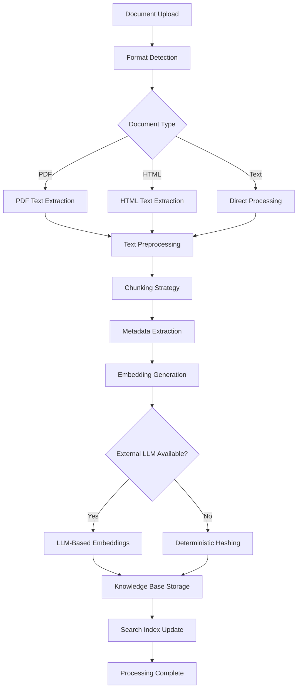
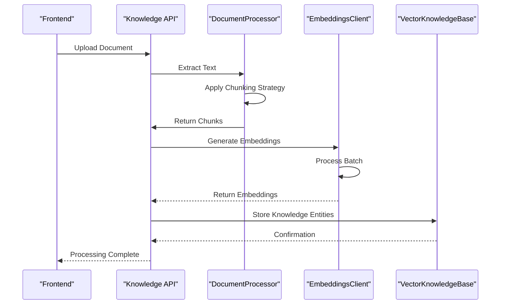
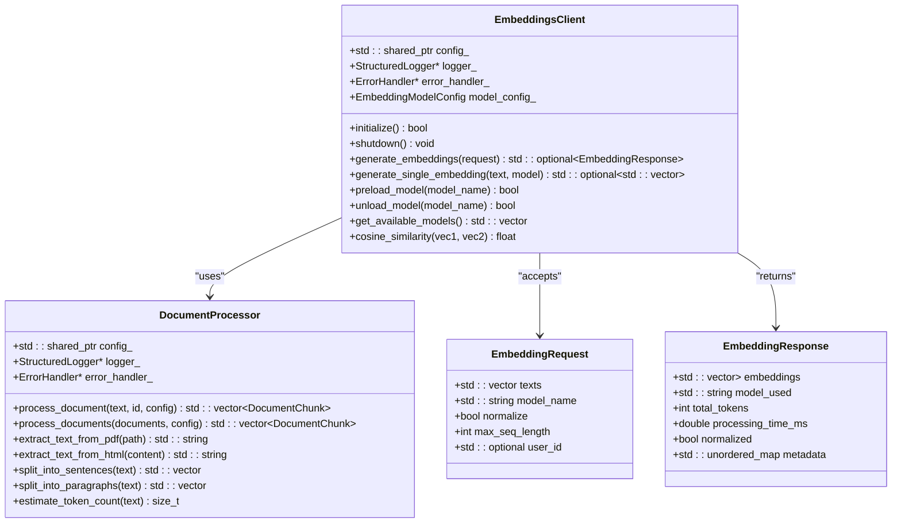
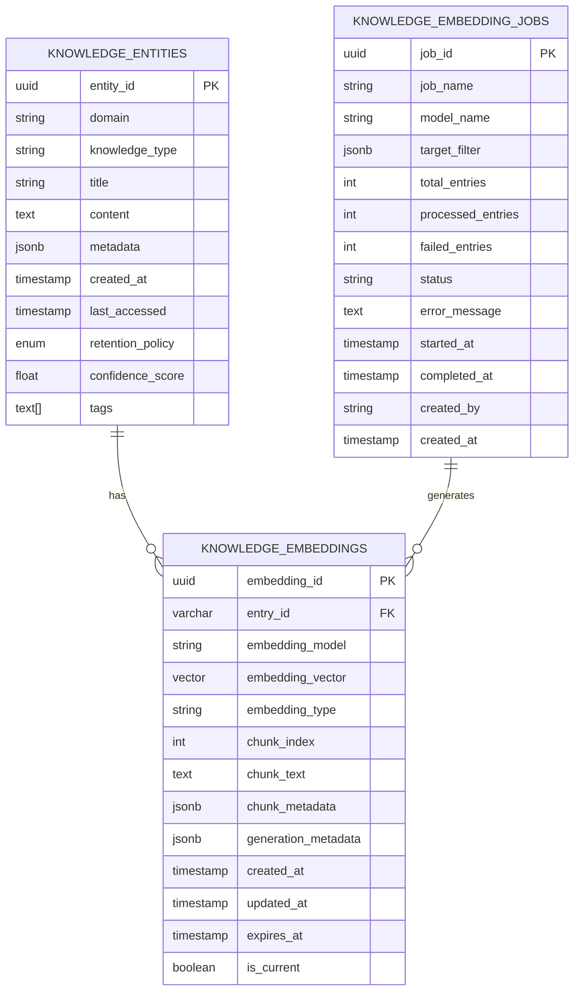

# Document Processing

<cite>
**Referenced Files in This Document**   
- [embeddings_client.cpp](file://shared/llm/embeddings_client.cpp)
- [embeddings_client.hpp](file://shared/llm/embeddings_client.hpp)
- [knowledge_api_handlers.cpp](file://shared/knowledge_base/knowledge_api_handlers.cpp)
- [knowledge_api_handlers_complete.cpp](file://shared/knowledge_base/knowledge_api_handlers_complete.cpp)
- [vector_knowledge_base.cpp](file://shared/knowledge_base/vector_knowledge_base.cpp)
- [data_ingestion_framework.cpp](file://shared/data_ingestion/data_ingestion_framework.cpp)
- [configuration_manager.cpp](file://shared/config/configuration_manager.cpp)
- [schema.sql](file://schema.sql)
- [llm_interface.cpp](file://shared/agentic_brain/llm_interface.cpp)
</cite>

## Table of Contents
1. [Introduction](#introduction)
2. [Document Ingestion Pipeline](#document-ingestion-pipeline)
3. [Text Extraction and Processing](#text-extraction-and-processing)
4. [Embedding Generation](#embedding-generation)
5. [EmbeddingsClient Architecture](#embeddingsclient-architecture)
6. [Configuration and Model Options](#configuration-and-model-options)
7. [Knowledge Base Storage](#knowledge-base-storage)
8. [Error Handling and Fallback Mechanisms](#error-handling-and-fallback-mechanisms)
9. [Performance Optimization](#performance-optimization)
10. [Integration with LLM Systems](#integration-with-llm-systems)

## Introduction
The document processing sub-feature in Regulens provides a comprehensive pipeline for transforming regulatory documents and compliance content into knowledge entities with vector embeddings. This system enables semantic search, pattern recognition, and intelligent decision-making by converting unstructured document content into structured, searchable knowledge. The pipeline handles document upload, text extraction, embedding generation, and storage in the knowledge base, supporting both LLM-based and deterministic semantic hashing approaches. The system is designed for high reliability, with fallback mechanisms when external LLM services are unavailable, and supports various document formats and chunking strategies to optimize processing throughput.

## Document Ingestion Pipeline
The document ingestion pipeline in Regulens follows a systematic process to transform regulatory documents into knowledge entities. The pipeline begins with document upload through the frontend interface, where users can submit various document formats including PDFs, HTML files, and plain text. Once uploaded, the document is processed by the data ingestion framework, which orchestrates the transformation process. The pipeline first extracts text content from the document, preserving structural elements like headings and paragraphs. The extracted text is then chunked according to configurable strategies, with metadata extracted for context preservation. Each chunk is processed to generate vector embeddings, which are stored alongside the original content in the knowledge base. The pipeline supports both synchronous and asynchronous processing, allowing for efficient handling of large documents or batch uploads. The entire process is monitored and logged, with progress tracking and error reporting capabilities.



**Diagram sources**
- [data_ingestion_framework.cpp](file://shared/data_ingestion/data_ingestion_framework.cpp#L100-L800)
- [embeddings_client.cpp](file://shared/llm/embeddings_client.cpp#L50-L1000)
- [vector_knowledge_base.cpp](file://shared/knowledge_base/vector_knowledge_base.cpp#L100-L200)

**Section sources**
- [data_ingestion_framework.cpp](file://shared/data_ingestion/data_ingestion_framework.cpp#L100-L800)
- [knowledge_api_handlers.cpp](file://shared/knowledge_base/knowledge_api_handlers.cpp#L64-L300)

## Text Extraction and Processing
The text extraction and processing component handles various document formats and prepares content for embedding generation. For PDF documents, the system uses Poppler library integration to extract text while preserving document structure and formatting. HTML content is processed by removing markup tags and extracting plain text, with special handling for script and style elements. The document processor implements multiple chunking strategies to optimize content for semantic analysis. The sentence-based strategy splits text at sentence boundaries, preserving contextual integrity. The paragraph-based approach maintains larger semantic units, while the fixed-size strategy ensures consistent chunk dimensions for uniform processing. Metadata extraction captures document properties such as title, author, creation date, and section hierarchy, which are used to enrich the knowledge entities. The processor also handles text normalization, including whitespace cleanup, encoding conversion, and special character handling, ensuring consistent input for the embedding generation stage.

**Section sources**
- [embeddings_client.cpp](file://shared/llm/embeddings_client.cpp#L800-L1200)
- [embeddings_client.hpp](file://shared/llm/embeddings_client.hpp#L200-L400)

## Embedding Generation
The embedding generation process transforms text chunks into high-dimensional vector representations that capture semantic meaning. The system supports both LLM-based embeddings and deterministic semantic hashing approaches, providing flexibility based on availability and performance requirements. When external LLM services are available, the system generates embeddings using state-of-the-art models like sentence-transformers or BGE, which provide high-quality semantic representations. The embedding process considers the full context of each chunk, including surrounding text and metadata, to produce more accurate vector representations. For each document chunk, the system generates embeddings that preserve both local and global semantic relationships. The embedding dimensionality is configurable, with default settings optimized for the specific use case of regulatory compliance. The generated embeddings are normalized to ensure consistent similarity calculations during search operations.



**Diagram sources**
- [knowledge_api_handlers.cpp](file://shared/knowledge_base/knowledge_api_handlers.cpp#L64-L300)
- [embeddings_client.cpp](file://shared/llm/embeddings_client.cpp#L50-L1000)
- [vector_knowledge_base.cpp](file://shared/knowledge_base/vector_knowledge_base.cpp#L100-L200)

**Section sources**
- [knowledge_api_handlers.cpp](file://shared/knowledge_base/knowledge_api_handlers.cpp#L64-L300)
- [embeddings_client.cpp](file://shared/llm/embeddings_client.cpp#L50-L1000)

## EmbeddingsClient Architecture
The EmbeddingsClient is a core component responsible for generating high-quality vector embeddings from text content. Implemented as a production-grade C++ class, it provides a robust interface for embedding generation with comprehensive error handling and performance optimization. The client supports multiple embedding models, including sentence-transformers/all-MiniLM-L6-v2, BAAI/bge-base-en, and intfloat/e5-base-v2, allowing selection based on specific requirements. The architecture includes a model management system that handles model loading, caching, and unloading to optimize memory usage. The client implements batch processing capabilities, allowing multiple text chunks to be processed simultaneously for improved throughput. A fallback mechanism is integrated to handle scenarios where external LLM services are unavailable, switching to deterministic semantic hashing using FastEmbed. The client also includes performance monitoring, tracking processing time, token counts, and resource utilization for optimization purposes.



**Diagram sources**
- [embeddings_client.hpp](file://shared/llm/embeddings_client.hpp#L50-L550)
- [embeddings_client.cpp](file://shared/llm/embeddings_client.cpp#L50-L1000)

**Section sources**
- [embeddings_client.cpp](file://shared/llm/embeddings_client.cpp#L50-L1000)
- [embeddings_client.hpp](file://shared/llm/embeddings_client.hpp#L50-L550)

## Configuration and Model Options
The document processing system offers extensive configuration options for embedding models, chunking strategies, and metadata extraction. Configuration is managed through the ConfigurationManager, which loads settings from environment variables for cloud deployment compatibility. The EMBEDDINGS_MODEL_NAME environment variable specifies the default embedding model, with sentence-transformers/all-MiniLM-L6-v2 as the default. The EMBEDDINGS_MAX_SEQ_LENGTH setting controls the maximum sequence length for embedding models, typically set to 512 tokens. The EMBEDDINGS_BATCH_SIZE parameter determines the number of text chunks processed simultaneously, with a default of 32 for optimal throughput. Chunking strategies can be configured through the DocumentChunkingConfig structure, allowing specification of chunk size, overlap, and strategy type. The system supports sentence, paragraph, and fixed-size chunking strategies, each with configurable parameters for optimal performance. Metadata extraction can be customized to capture specific document properties relevant to regulatory compliance.

**Section sources**
- [configuration_manager.cpp](file://shared/config/configuration_manager.cpp#L300-L500)
- [embeddings_client.hpp](file://shared/llm/embeddings_client.hpp#L100-L200)
- [embeddings_client.cpp](file://shared/llm/embeddings_client.cpp#L1200-L1300)

## Knowledge Base Storage
The knowledge base storage system persists processed documents and their embeddings in a PostgreSQL database with pgvector extension for efficient similarity search. The knowledge_entities table stores the core information, including entity ID, domain, knowledge type, title, content, and metadata. The knowledge_embeddings table maintains the vector representations, with fields for embedding model, vector data, embedding type, and chunk information. Each embedding is associated with its source document through the entry_id foreign key, enabling traceability and provenance tracking. The storage system supports multiple embedding types, including TITLE, CONTENT, FULL, CHUNK, and SUMMARY, allowing different representations for various use cases. The schema includes indexing strategies optimized for vector similarity search, with IVF flat indexes on the embedding vectors for efficient approximate nearest neighbor queries. The system also implements embedding versioning through the is_current flag, allowing for model updates and re-embedding without data loss.



**Diagram sources**
- [schema.sql](file://schema.sql#L727-L770)
- [schema.sql](file://schema.sql#L3660-L3676)
- [schema.sql](file://schema.sql#L3679-L3685)

**Section sources**
- [schema.sql](file://schema.sql#L727-L770)
- [schema.sql](file://schema.sql#L3660-L3685)
- [vector_knowledge_base.cpp](file://shared/knowledge_base/vector_knowledge_base.cpp#L100-L200)

## Error Handling and Fallback Mechanisms
The document processing system implements comprehensive error handling and fallback mechanisms to ensure reliability and availability. When external LLM services are unavailable, the EmbeddingsClient automatically switches to deterministic semantic hashing using FastEmbed, ensuring continuous operation. The system includes circuit breaker patterns to prevent cascading failures when external services experience prolonged outages. Error handling is implemented at multiple levels, with detailed logging and error reporting through the structured logger. The ErrorHandler component captures and categorizes errors, providing context for debugging and monitoring. For document processing failures, the system implements retry mechanisms with exponential backoff, allowing temporary issues to resolve before failing permanently. The knowledge ingestion framework includes health checks and monitoring to detect and respond to processing issues. When embedding generation fails, the system can store the document content without embeddings, allowing for reprocessing when services are restored.

**Section sources**
- [embeddings_client.cpp](file://shared/llm/embeddings_client.cpp#L50-L1000)
- [error_handler.cpp](file://shared/error_handler.cpp#L50-L200)
- [structured_logger.cpp](file://shared/logging/structured_logger.cpp#L100-L300)

## Performance Optimization
The document processing pipeline includes several performance optimization strategies to handle large volumes of regulatory documents efficiently. The system implements batch processing for embedding generation, allowing multiple text chunks to be processed simultaneously, reducing overhead and improving throughput. The EmbeddingsClient uses model preloading and caching to minimize initialization time for frequently used models. The document processor optimizes text extraction by using efficient algorithms for PDF and HTML parsing, with parallel processing capabilities for multi-page documents. The knowledge base storage system uses connection pooling and prepared statements to optimize database operations. The system also implements asynchronous processing for large documents, allowing the frontend to receive immediate confirmation while processing continues in the background. Monitoring and metrics collection enable identification of performance bottlenecks, with configurable logging levels to balance diagnostic information with performance impact.

**Section sources**
- [embeddings_client.cpp](file://shared/llm/embeddings_client.cpp#L50-L1000)
- [data_ingestion_framework.cpp](file://shared/data_ingestion/data_ingestion_framework.cpp#L100-L800)
- [vector_knowledge_base.cpp](file://shared/knowledge_base/vector_knowledge_base.cpp#L100-L200)

## Integration with LLM Systems
The document processing system integrates closely with the broader LLM infrastructure in Regulens, enabling advanced capabilities for regulatory compliance. The LLMInterface component provides a unified API for multiple LLM providers, including OpenAI, Anthropic, and local LLMs, allowing flexible configuration based on cost, performance, and privacy requirements. The system supports function calling capabilities, enabling the LLM to interact with the knowledge base for retrieval-augmented generation. The embeddings generated during document processing are used to enhance LLM responses by providing relevant context from regulatory documents. The integration includes rate limiting and cost tracking to manage API usage and budgeting. The system also supports fine-tuning of LLMs using the processed regulatory content, creating specialized models for specific compliance domains. This integration enables sophisticated applications such as automated policy generation, regulatory change impact analysis, and compliance question answering.

```mermaid
graph TB
subgraph "Document Processing"
A[Document Upload] --> B[Text Extraction]
B --> C[Chunking]
C --> D[Embedding Generation]
D --> E[Knowledge Base]
end
subgraph "LLM Integration"
F[LLM Interface] --> G[OpenAI]
F --> H[Anthropic]
F --> I[Local LLM]
E --> F
F --> J[Function Calling]
J --> K[Regulatory Analysis]
J --> L[Policy Generation]
J --> M[Compliance Q&A]
end
subgraph "Knowledge Base"
E[(Vector Database)]
E --> N[Semantic Search]
E --> O[Pattern Recognition]
E --> P[Decision Support]
end
A --> |Upload| Document Processing
Document Processing --> |Store| Knowledge Base
Knowledge Base --> |Retrieve| LLM Integration
LLM Integration --> |Enhance| Knowledge Base
```

**Diagram sources**
- [llm_interface.cpp](file://shared/agentic_brain/llm_interface.cpp#L50-L600)
- [embeddings_client.cpp](file://shared/llm/embeddings_client.cpp#L50-L1000)
- [vector_knowledge_base.cpp](file://shared/knowledge_base/vector_knowledge_base.cpp#L100-L200)

**Section sources**
- [llm_interface.cpp](file://shared/agentic_brain/llm_interface.cpp#L50-L600)
- [embeddings_client.cpp](file://shared/llm/embeddings_client.cpp#L50-L1000)
- [vector_knowledge_base.cpp](file://shared/knowledge_base/vector_knowledge_base.cpp#L100-L200)