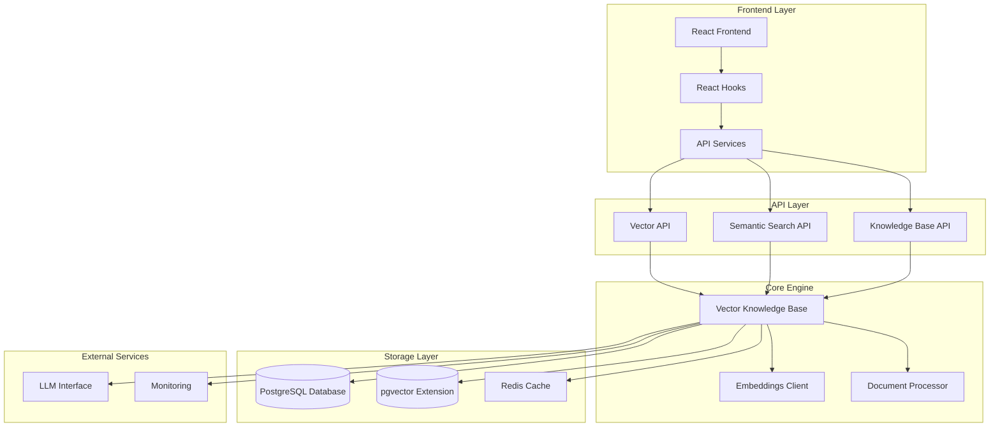
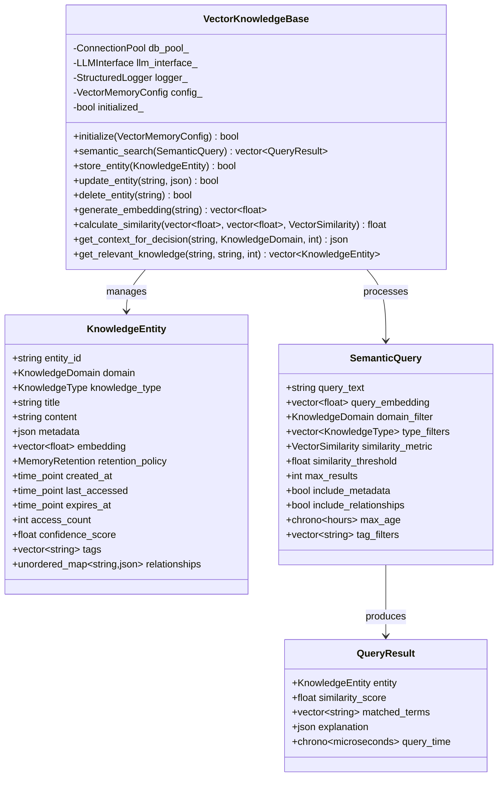
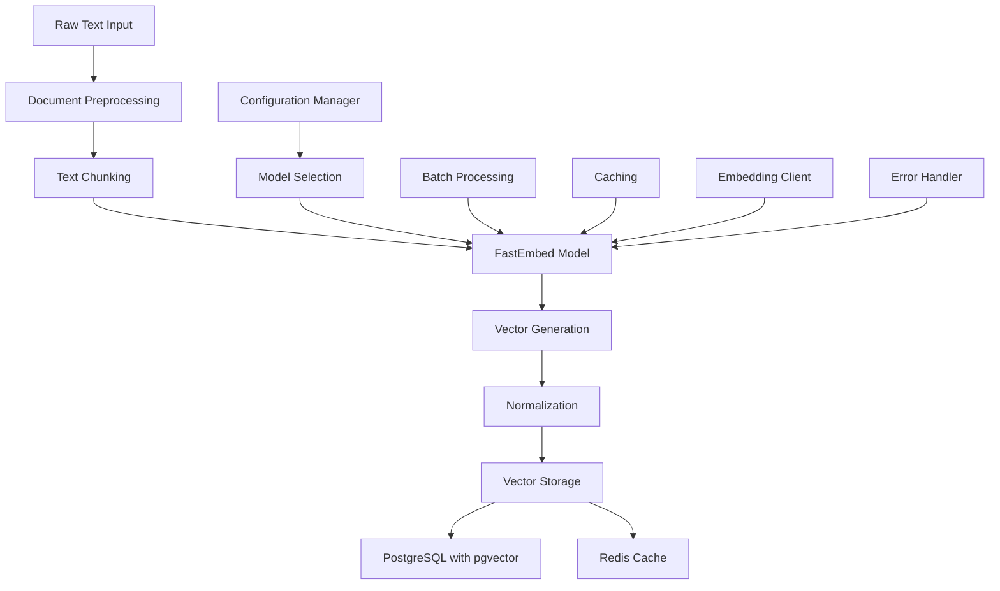
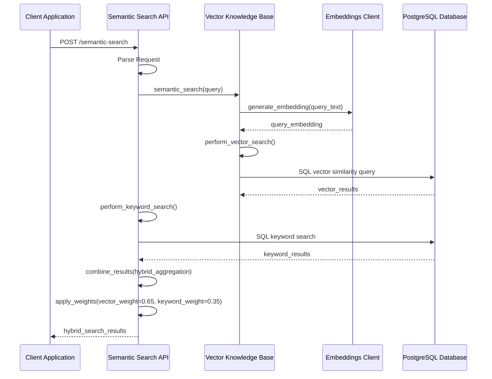
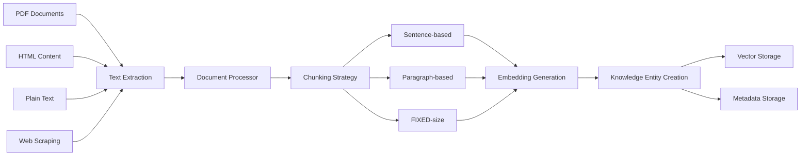
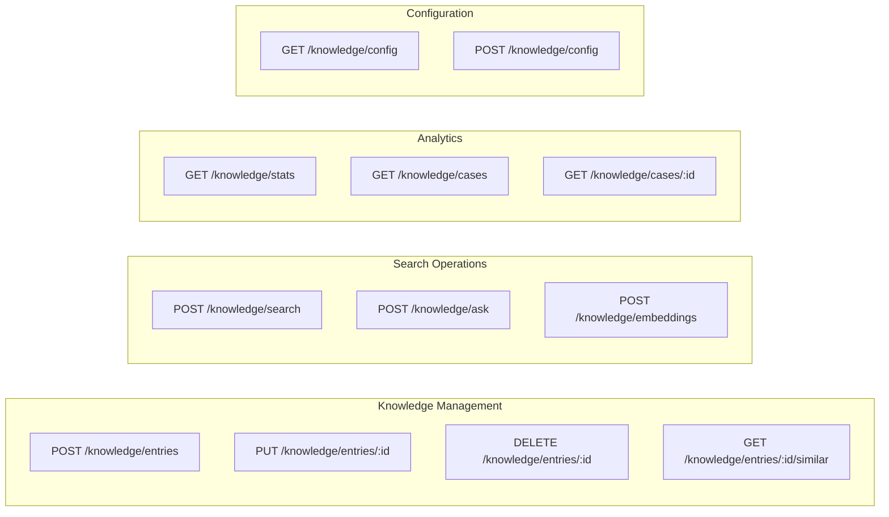
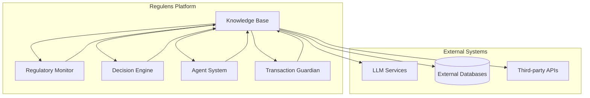

# Knowledge Base

<cite>
**Referenced Files in This Document**
- [vector_knowledge_base.hpp](file://shared/knowledge_base/vector_knowledge_base.hpp)
- [vector_knowledge_base.cpp](file://shared/knowledge_base/vector_knowledge_base.cpp)
- [semantic_search_api_handlers.cpp](file://shared/knowledge_base/semantic_search_api_handlers.cpp)
- [knowledge_api_handlers.cpp](file://shared/knowledge_base/knowledge_api_handlers.cpp)
- [embeddings_client.hpp](file://shared/llm/embeddings_client.hpp)
- [embeddings_client.cpp](file://shared/llm/embeddings_client.cpp)
- [KnowledgeBase.tsx](file://frontend/src/pages/KnowledgeBase.tsx)
- [useKnowledgeBase.ts](file://frontend/src/hooks/useKnowledgeBase.ts)
- [api.ts](file://frontend/src/services/api.ts)
- [api.ts](file://frontend/src/types/api.ts)
</cite>

## Table of Contents
1. [Introduction](#introduction)
2. [System Architecture](#system-architecture)
3. [Core Components](#core-components)
4. [Vector Storage and Embedding System](#vector-storage-and-embedding-system)
5. [Semantic Search Implementation](#semantic-search-implementation)
6. [Knowledge Processing Pipeline](#knowledge-processing-pipeline)
7. [API Layer and Frontend Integration](#api-layer-and-frontend-integration)
8. [Scalability and Performance](#scalability-and-performance)
9. [Configuration and Access Control](#configuration-and-access-control)
10. [Integration with Regulatory Systems](#integration-with-regulatory-systems)
11. [Troubleshooting and Monitoring](#troubleshooting-and-monitoring)
12. [Conclusion](#conclusion)

## Introduction

The Regulens Knowledge Base represents a sophisticated semantic search system designed specifically for regulatory compliance environments. This system combines advanced vector embeddings with natural language processing to provide intelligent knowledge retrieval capabilities for financial institutions and regulatory bodies.

The knowledge base serves as the central intelligence hub for the Regulens platform, enabling semantic search across regulatory documents, compliance policies, transaction patterns, and historical case studies. It integrates seamlessly with LLM-powered agents to deliver context-aware responses and automated decision support.

## System Architecture

The knowledge base follows a layered architecture with clear separation of concerns:



**Diagram sources**
- [vector_knowledge_base.hpp](file://shared/knowledge_base/vector_knowledge_base.hpp#L1-L50)
- [semantic_search_api_handlers.cpp](file://shared/knowledge_base/semantic_search_api_handlers.cpp#L1-L50)
- [embeddings_client.hpp](file://shared/llm/embeddings_client.hpp#L1-L50)

## Core Components

### Vector Knowledge Base Engine

The core of the knowledge base is the `VectorKnowledgeBase` class, which provides comprehensive semantic search capabilities:



**Diagram sources**
- [vector_knowledge_base.hpp](file://shared/knowledge_base/vector_knowledge_base.hpp#L50-L200)

**Section sources**
- [vector_knowledge_base.hpp](file://shared/knowledge_base/vector_knowledge_base.hpp#L1-L308)
- [vector_knowledge_base.cpp](file://shared/knowledge_base/vector_knowledge_base.cpp#L1-L200)

### Knowledge Entity Types and Domains

The system supports multiple knowledge domains and entity types:

- **Domains**: Regulatory Compliance, Transaction Monitoring, Audit Intelligence, Business Processes, Risk Management, Legal Frameworks, Financial Instruments, Market Intelligence
- **Entity Types**: Facts, Rules, Patterns, Relationships, Context, Experience, Decisions, Predictions
- **Retention Policies**: Ephemeral (1 day), Session (30 days), Persistent (1 year), Archival (7 years)

## Vector Storage and Embedding System

### Embedding Generation Pipeline

The embedding system uses FastEmbed for efficient CPU-based vector generation:



**Diagram sources**
- [embeddings_client.hpp](file://shared/llm/embeddings_client.hpp#L1-L100)
- [embeddings_client.cpp](file://shared/llm/embeddings_client.cpp#L1-L100)

### Supported Embedding Models

The system supports various embedding models optimized for regulatory content:

- **Sentence Transformers**: all-MiniLM-L6-v2, all-MiniLM-L12-v2, all-mpnet-base-v2
- **BAAI Models**: bge-base-en, bge-large-en
- **IntFloat Models**: e5-base-v2, e5-large-v2

### Vector Similarity Metrics

Multiple similarity metrics are supported for flexible search:

- **Cosine Similarity**: Default for semantic search
- **Euclidean Distance**: For distance-based ranking
- **Dot Product**: For high-dimensional spaces
- **Manhattan Distance**: For sparse vectors

**Section sources**
- [embeddings_client.hpp](file://shared/llm/embeddings_client.hpp#L1-L577)
- [embeddings_client.cpp](file://shared/llm/embeddings_client.cpp#L1-L800)

## Semantic Search Implementation

### Hybrid Search Strategy

The system implements a sophisticated hybrid search combining vector similarity and keyword matching:



**Diagram sources**
- [semantic_search_api_handlers.cpp](file://shared/knowledge_base/semantic_search_api_handlers.cpp#L100-L200)

### Search Configuration and Optimization

The system provides extensive configuration options:

```cpp
struct VectorMemoryConfig {
    int embedding_dimensions = 384;  // Default for sentence transformers
    VectorSimilarity default_similarity = VectorSimilarity::COSINE;
    int max_results_per_query = 50;
    chrono::hours memory_cleanup_interval = 1h;
    chrono::hours ephemeral_retention = 24h;
    chrono::hours session_retention = 720h;
    chrono::hours archival_retention = 61320h;
    int max_entities_per_domain = 100000;
    bool enable_auto_cleanup = true;
    bool enable_embedding_cache = true;
    chrono::seconds embedding_cache_ttl = 3600s;
    int batch_indexing_size = 100;
    bool enable_incremental_updates = true;
};
```

**Section sources**
- [semantic_search_api_handlers.cpp](file://shared/knowledge_base/semantic_search_api_handlers.cpp#L1-L800)

## Knowledge Processing Pipeline

### Document Ingestion and Processing

The system handles various document formats through a unified processing pipeline:



**Diagram sources**
- [embeddings_client.cpp](file://shared/llm/embeddings_client.cpp#L400-L600)

### Content Processing Features

- **PDF Text Extraction**: Using Poppler or fallback to pdftotext
- **HTML Cleaning**: Removes scripts, styles, and preserves text
- **Multi-strategy Chunking**: Sentence, paragraph, and fixed-size approaches
- **Token Estimation**: Rough estimation for embedding optimization
- **Metadata Preservation**: Maintains document structure and context

**Section sources**
- [embeddings_client.cpp](file://shared/llm/embeddings_client.cpp#L400-L800)

## API Layer and Frontend Integration

### REST API Endpoints

The knowledge base exposes comprehensive REST API endpoints:



**Diagram sources**
- [knowledge_api_handlers.cpp](file://shared/knowledge_base/knowledge_api_handlers.cpp#L1-L100)
- [api.ts](file://frontend/src/services/api.ts#L1200-L1400)

### Frontend React Integration

The frontend uses modern React patterns with TypeScript:

```typescript
// Hook-based API consumption
export function useKnowledgeSearch(query: string, options?: {
  limit?: number;
  threshold?: number;
  category?: string;
}) {
  return useQuery({
    queryKey: ['knowledge-search', query, limit, threshold, category],
    queryFn: async () => {
      if (!query || query.length < 3) return [];
      const data = await apiClient.searchKnowledge(params);
      return data;
    },
    enabled: query.length >= 3,
  });
}
```

**Section sources**
- [useKnowledgeBase.ts](file://frontend/src/hooks/useKnowledgeBase.ts#L1-L267)
- [api.ts](file://frontend/src/services/api.ts#L1200-L1550)

## Scalability and Performance

### Caching Strategies

The system implements multi-level caching for optimal performance:

- **Embedding Cache**: Redis-based cache with TTL management
- **Entity Cache**: In-memory cache for frequently accessed knowledge
- **Query Result Cache**: Temporary storage of search results
- **Model Preloading**: FastEmbed models cached in memory

### Indexing and Optimization

- **Vector Indexing**: PostgreSQL pgvector extension for efficient similarity search
- **Batch Processing**: Configurable batch sizes for embedding generation
- **Incremental Updates**: Efficient updates without full re-indexing
- **Background Cleanup**: Automated memory management and cleanup

### Horizontal Scaling Considerations

- **Connection Pooling**: PostgreSQL connection pooling for concurrent access
- **Load Balancing**: API layer supports horizontal scaling
- **Stateless Design**: Knowledge base operations are stateless
- **Database Sharding**: Potential for sharding based on domains

## Configuration and Access Control

### Dynamic Configuration Management

The system supports runtime configuration changes:

```cpp
// Example configuration update
std::string update_search_config(const std::string& request_body) {
    nlohmann::json request = nlohmann::json::parse(request_body);
    std::string config_key = request["config_key"];
    nlohmann::json config_value = request["value"];
    
    // Store in database for persistence
    std::string store_query = R"(
        INSERT INTO semantic_search_config (config_key, config_value, updated_at)
        VALUES ($1, $2, NOW())
        ON CONFLICT (config_key) DO UPDATE
        SET config_value = $2, updated_at = NOW()
    )";
    
    return create_success_response(response).dump();
}
```

### Access Control Integration

- **JWT Authentication**: Secure API access with token validation
- **Role-based Permissions**: Different access levels for knowledge operations
- **Domain-specific Access**: Filtering by knowledge domains
- **Audit Logging**: Comprehensive audit trail for all operations

**Section sources**
- [semantic_search_api_handlers.cpp](file://shared/knowledge_base/semantic_search_api_handlers.cpp#L400-L600)

## Integration with Regulatory Systems

### Cross-System Communication

The knowledge base integrates with multiple Regulens subsystems:



**Diagram sources**
- [vector_knowledge_base.hpp](file://shared/knowledge_base/vector_knowledge_base.hpp#L250-L308)

### Agent Integration

The knowledge base provides specialized APIs for agent systems:

- **Context Retrieval**: `get_context_for_decision()` for decision-making
- **Knowledge Updates**: `update_knowledge_from_feedback()` for learning
- **Pattern Recognition**: Domain-specific search capabilities
- **Real-time Updates**: Incremental knowledge base modifications

**Section sources**
- [vector_knowledge_base.hpp](file://shared/knowledge_base/vector_knowledge_base.hpp#L250-L308)

## Troubleshooting and Monitoring

### Error Handling and Recovery

The system implements comprehensive error handling:

```cpp
// Example error handling in embedding generation
try {
    auto response = generate_embeddings(request);
    if (!response.has_value()) {
        if (error_handler_) {
            error_handler_->report_error(ErrorInfo{
                ErrorCategory::EXTERNAL_API,
                ErrorSeverity::HIGH,
                "EmbeddingsClient",
                "generate_embeddings",
                "Embedding generation failed",
                "model: " + request.model_name
            });
        }
        return std::nullopt;
    }
} catch (const std::exception& e) {
    if (error_handler_) {
        error_handler_->report_error(ErrorInfo{
            ErrorCategory::PROCESSING,
            ErrorSeverity::HIGH,
            "EmbeddingsClient",
            "generate_embeddings",
            "Embedding generation failed: " + std::string(e.what()),
            "model: " + request.model_name
        });
    }
    return std::nullopt;
}
```

### Monitoring and Metrics

- **Search Performance**: Response time tracking and optimization
- **Embedding Quality**: Confidence score monitoring
- **System Health**: Database connectivity and performance metrics
- **Usage Analytics**: Search patterns and popularity tracking

### Debugging Tools

- **Search Explanation**: Detailed explanations of search results
- **Embedding Inspection**: Vector visualization and analysis
- **Performance Profiling**: Query optimization and bottleneck identification
- **Logging Integration**: Structured logging with correlation IDs

**Section sources**
- [embeddings_client.cpp](file://shared/llm/embeddings_client.cpp#L100-L200)
- [semantic_search_api_handlers.cpp](file://shared/knowledge_base/semantic_search_api_handlers.cpp#L700-L800)

## Conclusion

The Regulens Knowledge Base represents a sophisticated semantic search system designed for regulatory compliance environments. Its architecture emphasizes scalability, performance, and integration capabilities while maintaining strict security and audit requirements.

Key strengths include:

- **Advanced Vector Processing**: Efficient embedding generation and similarity search
- **Flexible Architecture**: Modular design supporting multiple deployment scenarios
- **Comprehensive Integration**: Seamless integration with LLMs and other Regulens components
- **Production-Ready Features**: Robust error handling, caching, and monitoring
- **Scalable Design**: Built-in support for large-scale regulatory document collections

The system successfully addresses the challenges of semantic search in regulated environments, providing intelligent knowledge retrieval capabilities that enhance compliance decision-making and operational efficiency.

Future enhancements could include support for additional embedding models, advanced vector databases, and enhanced machine learning capabilities for predictive analytics and trend detection.