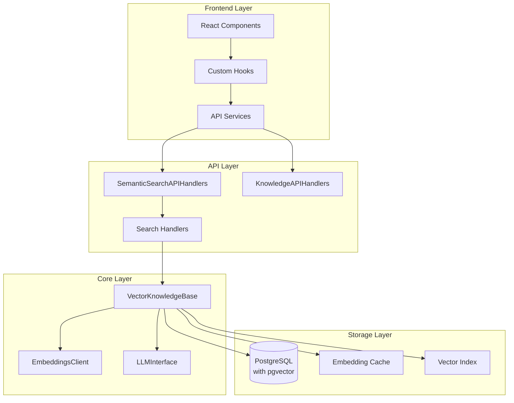
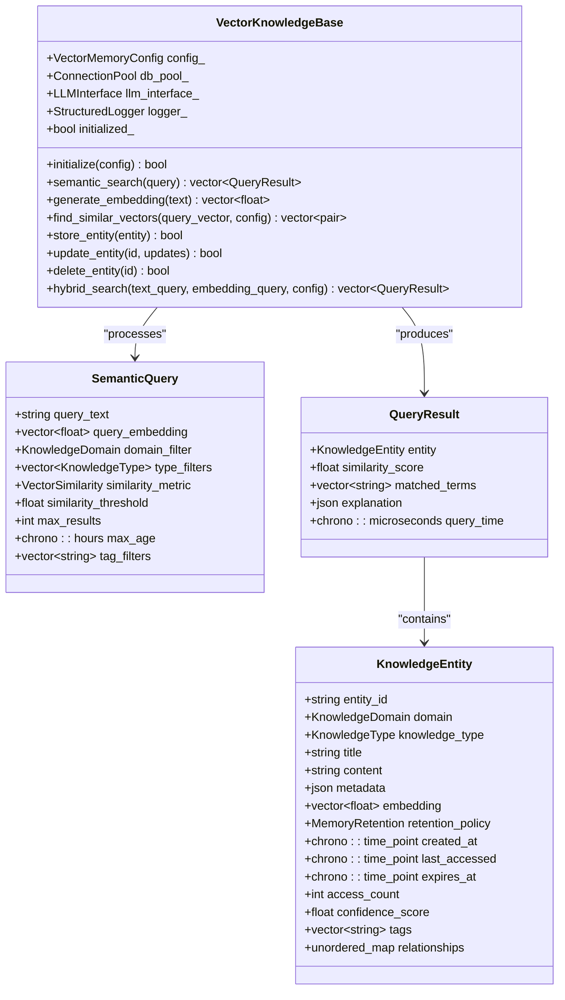
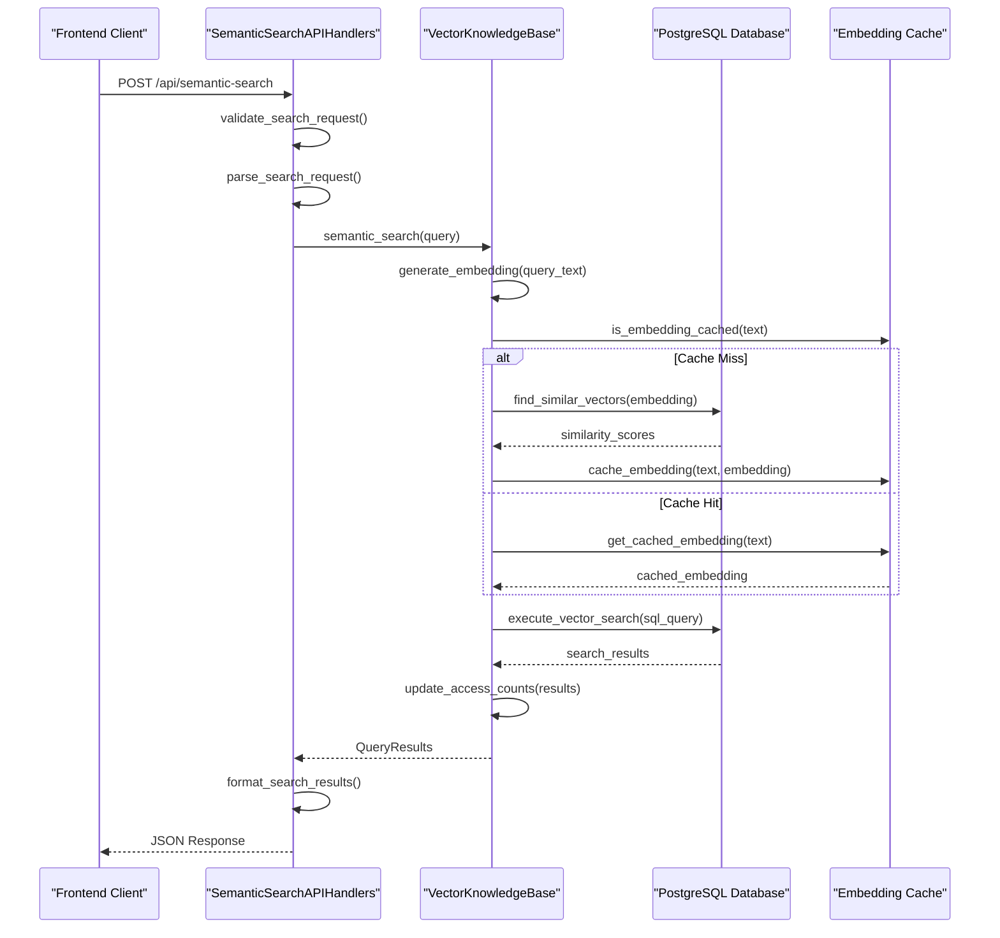
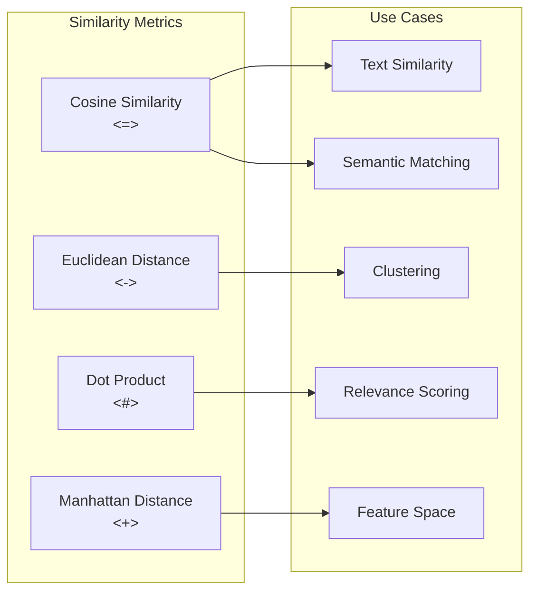
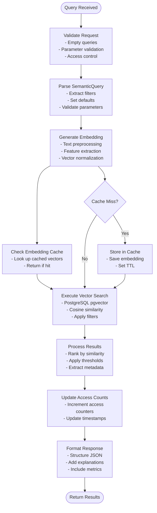
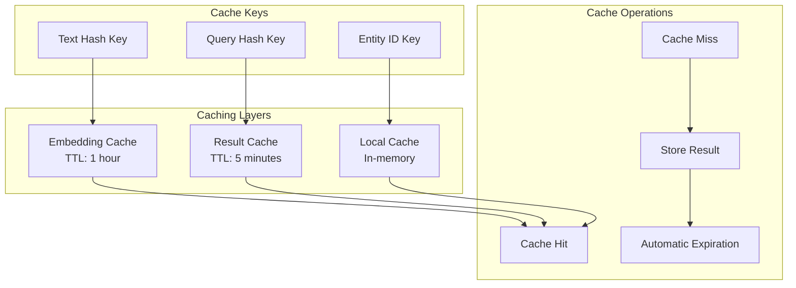

# Semantic Search

<cite>
**Referenced Files in This Document**
- [semantic_search_api_handlers.cpp](file://shared/knowledge_base/semantic_search_api_handlers.cpp)
- [vector_knowledge_base.cpp](file://shared/knowledge_base/vector_knowledge_base.cpp)
- [vector_knowledge_base.hpp](file://shared/knowledge_base/vector_knowledge_base.hpp)
- [knowledge_api_handlers.cpp](file://shared/knowledge_base/knowledge_api_handlers.cpp)
- [useKnowledgeBase.ts](file://frontend/src/hooks/useKnowledgeBase.ts)
- [api.ts](file://frontend/src/services/api.ts)
- [embeddings_client.cpp](file://shared/llm/embeddings_client.cpp)
- [schema.sql](file://schema.sql)
- [seed_data.sql](file://seed_data.sql)
</cite>

## Table of Contents
1. [Introduction](#introduction)
2. [Architecture Overview](#architecture-overview)
3. [Core Components](#core-components)
4. [Vector-Based Similarity Search](#vector-based-similarity-search)
5. [Embedding Generation](#embedding-generation)
6. [Query Execution Flow](#query-execution-flow)
7. [Configuration Options](#configuration-options)
8. [Frontend Integration](#frontend-integration)
9. [Performance Optimization](#performance-optimization)
10. [Error Handling and Edge Cases](#error-handling-and-edge-cases)
11. [Troubleshooting Guide](#troubleshooting-guide)
12. [Conclusion](#conclusion)

## Introduction

The semantic search sub-feature in Regulens provides advanced vector-based similarity search capabilities powered by pgvector, enabling intelligent knowledge retrieval and contextual understanding. This system combines deterministic semantic hashing with machine learning embeddings to deliver robust semantic search functionality even when LLM integration is unavailable.

The semantic search system serves as the foundation for intelligent compliance assistance, regulatory knowledge retrieval, and context-aware decision-making across all Regulens POCs. It transforms raw text into meaningful vector representations that enable sophisticated similarity matching and contextual understanding.

## Architecture Overview

The semantic search architecture follows a layered approach with clear separation of concerns:



**Diagram sources**
- [semantic_search_api_handlers.cpp](file://shared/knowledge_base/semantic_search_api_handlers.cpp#L1-L50)
- [vector_knowledge_base.cpp](file://shared/knowledge_base/vector_knowledge_base.cpp#L1-L100)
- [knowledge_api_handlers.cpp](file://shared/knowledge_base/knowledge_api_handlers.cpp#L1-L50)

## Core Components

### VectorKnowledgeBase

The `VectorKnowledgeBase` class serves as the central orchestrator for semantic search operations. It manages vector storage, similarity calculations, and knowledge entity lifecycle.



**Diagram sources**
- [vector_knowledge_base.hpp](file://shared/knowledge_base/vector_knowledge_base.hpp#L40-L120)
- [vector_knowledge_base.cpp](file://shared/knowledge_base/vector_knowledge_base.cpp#L163-L200)

### SemanticSearchAPIHandlers

The API handlers provide REST endpoints for semantic search functionality with comprehensive request validation and response formatting.



**Diagram sources**
- [semantic_search_api_handlers.cpp](file://shared/knowledge_base/semantic_search_api_handlers.cpp#L60-L120)
- [vector_knowledge_base.cpp](file://shared/knowledge_base/vector_knowledge_base.cpp#L166-L250)

**Section sources**
- [vector_knowledge_base.hpp](file://shared/knowledge_base/vector_knowledge_base.hpp#L1-L308)
- [semantic_search_api_handlers.cpp](file://shared/knowledge_base/semantic_search_api_handlers.cpp#L1-L100)

## Vector-Based Similarity Search

### Cosine Similarity Implementation

The system uses PostgreSQL's pgvector extension for efficient vector similarity calculations. The primary similarity metric is cosine similarity, calculated using the `<=>` operator.

```cpp
// Example SQL query with cosine similarity
std::string sql = R"(
    SELECT 
        entity_id, 
        1 - (embedding <=> $1::vector) as similarity_score
    FROM knowledge_entities 
    WHERE domain = $2 
    ORDER BY embedding <=> $1::vector 
    LIMIT $3
)";
```

### Similarity Metrics

The system supports multiple similarity metrics for flexibility:



**Diagram sources**
- [vector_knowledge_base.cpp](file://shared/knowledge_base/vector_knowledge_base.cpp#L1639-L1670)

### Dynamic Filtering

The search system supports comprehensive filtering options:

- **Domain Filtering**: Restrict search to specific knowledge domains
- **Type Filtering**: Filter by knowledge entity types (FACT, RULE, PATTERN, etc.)
- **Tag Filtering**: Apply tag-based filtering for granular control
- **Age Filtering**: Limit results based on creation time
- **Threshold Filtering**: Apply minimum similarity thresholds

**Section sources**
- [vector_knowledge_base.cpp](file://shared/knowledge_base/vector_knowledge_base.cpp#L166-L300)
- [semantic_search_api_handlers.cpp](file://shared/knowledge_base/semantic_search_api_handlers.cpp#L1200-L1300)

## Embedding Generation

### Deterministic Semantic Hashing

When LLM integration is unavailable, the system falls back to deterministic semantic hashing using the `generate_embedding` method:

```cpp
std::vector<float> VectorKnowledgeBase::generate_embedding(const std::string& text) {
    std::vector<float> embedding(config_.embedding_dimensions, 0.0f);
    
    if (text.empty() || embedding.empty()) {
        return embedding;
    }
    
    // Normalize text
    std::string normalized = text;
    std::transform(normalized.begin(), normalized.end(), normalized.begin(), [](unsigned char c) {
        return static_cast<char>(std::tolower(c));
    });
    
    // Feature extraction with term frequency
    std::unordered_map<std::string, float> feature_weights;
    
    // Uni-gram features
    for (const auto& term : tokens) {
        feature_weights["uni:" + term] += 1.0f;
    }
    
    // Bi-gram features
    for (size_t i = 0; i + 1 < tokens.size(); ++i) {
        feature_weights["bi:" + tokens[i] + "_" + tokens[i + 1]] += 0.75f;
    }
    
    // Character n-grams for sub-word semantics
    if (normalized.size() >= 3) {
        for (size_t i = 0; i + 3 <= normalized.size(); ++i) {
            feature_weights["tri:" + normalized.substr(i, 3)] += 0.5f;
        }
    }
    
    // Apply weights and normalize
    for (auto& [feature, weight] : feature_weights) {
        float scaled_weight = 1.0f + std::log(1.0f + weight);
        add_feature(feature, scaled_weight);
    }
    
    // L2 normalization
    float magnitude = 0.0f;
    for (float value : embedding) {
        magnitude += value * value;
    }
    
    if (magnitude > 0.0f) {
        float inv_norm = 1.0f / std::sqrt(magnitude);
        for (float& value : embedding) {
            value *= inv_norm;
        }
    }
    
    return embedding;
}
```

### Embedding Dimensions and Models

The system uses 384-dimensional embeddings by default, compatible with sentence-transformers models:

- **Default Model**: `sentence-transformers/all-MiniLM-L6-v2`
- **Dimensions**: 384
- **Batch Processing**: Configurable batch sizes for efficiency
- **Normalization**: L2 normalization for cosine similarity compatibility

**Section sources**
- [vector_knowledge_base.cpp](file://shared/knowledge_base/vector_knowledge_base.cpp#L330-L450)
- [embeddings_client.cpp](file://shared/llm/embeddings_client.cpp#L1-L100)

## Query Execution Flow

### Complete Search Pipeline

The semantic search execution follows a sophisticated multi-stage pipeline:



**Diagram sources**
- [vector_knowledge_base.cpp](file://shared/knowledge_base/vector_knowledge_base.cpp#L166-L300)
- [semantic_search_api_handlers.cpp](file://shared/knowledge_base/semantic_search_api_handlers.cpp#L60-L120)

### Hybrid Search Implementation

The system supports hybrid search combining vector similarity with keyword matching:

```cpp
std::vector<QueryResult> VectorKnowledgeBase::hybrid_search(
    const std::string& text_query,
    const std::vector<float>& embedding_query,
    const SemanticQuery& config
) {
    // Step 1: Vector search
    std::vector<QueryResult> vector_results = perform_vector_search(embedding_query, config);
    
    // Step 2: Keyword search
    std::vector<QueryResult> keyword_results = perform_keyword_search(config);
    
    // Step 3: Weighted scoring
    const float TEXT_WEIGHT = 0.6f;
    const float VECTOR_WEIGHT = 0.4f;
    
    std::unordered_map<std::string, QueryResult> merged_results;
    
    // Add vector results with vector weight
    for (const auto& result : vector_results) {
        merged_results[result.entity.entity_id] = result;
        merged_results[result.entity.entity_id].similarity_score *= VECTOR_WEIGHT;
    }
    
    // Merge keyword results with text weight
    for (const auto& result : keyword_results) {
        auto& merged = merged_results[result.entity.entity_id];
        merged.similarity_score += result.similarity_score * TEXT_WEIGHT;
        // Merge metadata and explanations
    }
    
    // Final ranking and limiting
    std::vector<QueryResult> final_results;
    for (auto& pair : merged_results) {
        final_results.push_back(pair.second);
    }
    
    std::sort(final_results.begin(), final_results.end(),
        [](const QueryResult& a, const QueryResult& b) {
            return a.similarity_score > b.similarity_score;
        });
    
    if (final_results.size() > static_cast<size_t>(config.max_results)) {
        final_results.resize(config.max_results);
    }
    
    return final_results;
}
```

**Section sources**
- [vector_knowledge_base.cpp](file://shared/knowledge_base/vector_knowledge_base.cpp#L500-L650)
- [semantic_search_api_handlers.cpp](file://shared/knowledge_base/semantic_search_api_handlers.cpp#L80-L200)

## Configuration Options

### VectorMemoryConfig

The system provides extensive configuration options for fine-tuning semantic search behavior:

```cpp
struct VectorMemoryConfig {
    int embedding_dimensions = 384;  // Default for sentence transformers
    VectorSimilarity default_similarity = VectorSimilarity::COSINE;
    int max_results_per_query = 50;
    std::chrono::hours memory_cleanup_interval = std::chrono::hours(1);
    std::chrono::hours ephemeral_retention = std::chrono::hours(24); // 1 day
    std::chrono::hours session_retention = std::chrono::hours(720); // 30 days
    std::chrono::hours archival_retention = std::chrono::hours(61320); // 7 years
    int max_entities_per_domain = 100000;
    bool enable_auto_cleanup = true;
    bool enable_embedding_cache = true;
    std::chrono::seconds embedding_cache_ttl = std::chrono::seconds(3600);
    int batch_indexing_size = 100;
    bool enable_incremental_updates = true;
};
```

### Runtime Configuration

The system supports dynamic configuration updates through the API:

```json
{
    "config_key": "similarity_threshold",
    "value": 0.7
}
```

### Database Configuration

PostgreSQL configuration for optimal vector performance:

```sql
-- Enable pgvector extension
CREATE EXTENSION IF NOT EXISTS "vector";

-- Configure vector dimensions
ALTER TYPE vector ADD ATTRIBUTE dimension INT;

-- Set up vector index
CREATE INDEX idx_knowledge_entities_embedding ON knowledge_entities 
USING ivfflat (embedding vector_cosine_ops) WITH (lists = 100);
```

**Section sources**
- [vector_knowledge_base.hpp](file://shared/knowledge_base/vector_knowledge_base.hpp#L80-L120)
- [schema.sql](file://schema.sql#L700-L800)

## Frontend Integration

### React Hook Implementation

The frontend provides a comprehensive React hook for semantic search:

```typescript
export function useKnowledgeSearch(query: string, options?: {
  limit?: number;
  threshold?: number;
  category?: string;
}) {
  const { limit = 10, threshold = 0.7, category } = options || {};

  return useQuery({
    queryKey: ['knowledge-search', query, limit, threshold, category],
    queryFn: async () => {
      if (!query || query.length < 3) return [];

      const params: Record<string, string> = {
        q: query,
        limit: limit.toString(),
        threshold: threshold.toString(),
      };
      if (category) params.category = category;

      const data = await apiClient.searchKnowledge(params);
      return data;
    },
    enabled: query.length >= 3,
  });
}
```

### API Service Integration

The API service handles all communication with the backend:

```typescript
async searchKnowledge(params: Record<string, string>): Promise<API.KnowledgeEntry[]> {
  const response = await this.client.get<API.KnowledgeEntry[]>('/knowledge/search', { params });
  return response.data;
}

async generateEmbedding(text: string): Promise<{ embedding: number[]; model: string; dimensions: number }> {
  const response = await this.client.post('/knowledge/embeddings', { text });
  return response.data;
}
```

### Search Request Format

```json
{
  "query": "What are the compliance requirements for anti-money laundering?",
  "max_results": 10,
  "similarity_threshold": 0.7,
  "domain_filter": "REGULATORY_COMPLIANCE",
  "type_filters": ["RULE", "CONTEXT"],
  "tag_filters": ["AML", "KYC"],
  "max_age_hours": 24
}
```

**Section sources**
- [useKnowledgeBase.ts](file://frontend/src/hooks/useKnowledgeBase.ts#L10-L50)
- [api.ts](file://frontend/src/services/api.ts#L1060-L1150)

## Performance Optimization

### Caching Strategies

The system implements multiple caching layers for optimal performance:



### Batch Processing

Efficient batch processing reduces database load:

```cpp
// Batch embedding generation
std::vector<std::vector<float>> embeddings;
size_t batch_size = model_config_.batch_size;

for (size_t i = 0; i < request.texts.size(); i += batch_size) {
    size_t end_idx = std::min(i + batch_size, request.texts.size());
    std::vector<std::string> batch(request.texts.begin() + i, request.texts.begin() + end_idx);
    
    // Process batch
    std::vector<std::vector<float>> batch_embeddings;
    if (generate_fastembed_embeddings(model, batch, batch_embeddings)) {
        embeddings.insert(embeddings.end(), batch_embeddings.begin(), batch_embeddings.end());
    }
}
```

### Index Optimization

PostgreSQL index configuration for vector search:

```sql
-- Vector index for similarity search
CREATE INDEX idx_knowledge_entities_embedding ON knowledge_entities 
USING ivfflat (embedding vector_cosine_ops) WITH (lists = 100);

-- Metadata indexes for filtering
CREATE INDEX idx_knowledge_entities_domain ON knowledge_entities(domain);
CREATE INDEX idx_knowledge_entities_type ON knowledge_entities(knowledge_type);
CREATE INDEX idx_knowledge_entities_tags ON knowledge_entities USING GIN(tags);

-- Full-text search for keyword matching
CREATE INDEX idx_knowledge_entities_content_trgm ON knowledge_entities USING GIN(content gin_trgm_ops);
```

**Section sources**
- [vector_knowledge_base.cpp](file://shared/knowledge_base/vector_knowledge_base.cpp#L330-L450)
- [schema.sql](file://schema.sql#L700-L800)

## Error Handling and Edge Cases

### Connection Failures

The system gracefully handles database connection issues:

```cpp
std::vector<QueryResult> VectorKnowledgeBase::semantic_search(const SemanticQuery& query) {
    std::vector<QueryResult> results;

    try {
        auto conn = db_pool_->get_connection();
        if (!conn) {
            spdlog::error("Failed to get database connection for semantic search");
            return results; // Return empty results
        }
        
        // Proceed with search...
        
    } catch (const std::exception& e) {
        spdlog::error("Exception in semantic_search: {}", e.what());
        // Log error and return empty results
    }

    return results;
}
```

### Empty Queries and Validation

Comprehensive input validation prevents errors:

```cpp
bool SemanticSearchAPIHandlers::validate_search_request(const nlohmann::json& request, std::string& error_message) {
    if (!request.contains("query") || !request["query"].is_string()) {
        error_message = "Missing or invalid 'query' field";
        return false;
    }

    std::string query = request["query"];
    if (query.empty()) {
        error_message = "Query cannot be empty";
        return false;
    }

    if (query.length() > 1000) {
        error_message = "Query too long (maximum 1000 characters)";
        return false;
    }

    if (request.contains("max_results")) {
        int max_results = request.value("max_results", 10);
        if (max_results < 1 || max_results > 100) {
            error_message = "max_results must be between 1 and 100";
            return false;
        }
    }

    return true;
}
```

### Fallback Mechanisms

When LLM integration is unavailable, the system falls back to deterministic hashing:

```cpp
std::vector<float> VectorKnowledgeBase::generate_embedding(const std::string& text) {
    std::vector<float> embedding(config_.embedding_dimensions, 0.0f);

    if (text.empty() || embedding.empty()) {
        return embedding;
    }

    static std::once_flag fallback_notice;
    std::call_once(fallback_notice, []() {
        spdlog::info("VectorKnowledgeBase is producing embeddings via deterministic semantic hashing fallback");
    });

    // Continue with semantic hashing...
}
```

**Section sources**
- [vector_knowledge_base.cpp](file://shared/knowledge_base/vector_knowledge_base.cpp#L166-L200)
- [semantic_search_api_handlers.cpp](file://shared/knowledge_base/semantic_search_api_handlers.cpp#L700-L800)

## Troubleshooting Guide

### Common Issues and Solutions

#### 1. Slow Search Performance

**Symptoms**: Searches taking longer than expected
**Causes**: 
- Large result sets
- Missing indexes
- Cache misses

**Solutions**:
```sql
-- Check index usage
EXPLAIN ANALYZE 
SELECT * FROM knowledge_entities 
WHERE embedding <=> '[0.1,0.2,...]'::vector 
LIMIT 10;

-- Create missing indexes
CREATE INDEX IF NOT EXISTS idx_knowledge_entities_embedding 
ON knowledge_entities USING ivfflat (embedding vector_cosine_ops);

-- Optimize cache settings
UPDATE system_config SET config_value = '50' 
WHERE config_key = 'EMBEDDINGS_CACHE_SIZE';
```

#### 2. Empty Search Results

**Symptoms**: Valid queries returning no results
**Causes**:
- High similarity threshold
- Insufficient training data
- Incorrect embedding generation

**Solutions**:
```cpp
// Lower similarity threshold
SemanticQuery query;
query.similarity_threshold = 0.3f; // Default is 0.7

// Check embedding generation
auto embedding = generate_embedding("test query");
if (embedding.empty()) {
    // Fallback mechanism activated
}
```

#### 3. Connection Pool Exhaustion

**Symptoms**: Database connection errors
**Causes**:
- Too many concurrent requests
- Connection leaks
- Timeout settings

**Solutions**:
```cpp
// Increase connection pool size
auto db_pool = std::make_shared<ConnectionPool>();
db_pool->set_max_connections(50);

// Monitor connection usage
auto stats = db_pool->get_stats();
spdlog::info("Active connections: {}", stats.active_connections);
```

### Debugging Tools

#### Embedding Visualization

```python
# Python script for embedding visualization
import numpy as np
import matplotlib.pyplot as plt
from sklearn.manifold import TSNE

def visualize_embeddings(embeddings, labels):
    tsne = TSNE(n_components=2, random_state=42)
    embeddings_2d = tsne.fit_transform(embeddings)
    
    plt.figure(figsize=(10, 8))
    plt.scatter(embeddings_2d[:, 0], embeddings_2d[:, 1])
    for i, label in enumerate(labels):
        plt.annotate(label, (embeddings_2d[i, 0], embeddings_2d[i, 1]))
    plt.savefig('embedding_visualization.png')
```

#### Search Quality Metrics

```sql
-- Analyze search effectiveness
SELECT 
    query_text,
    AVG(similarity_score) as avg_score,
    COUNT(*) as search_count,
    MIN(similarity_score) as min_score,
    MAX(similarity_score) as max_score
FROM semantic_search_logs
GROUP BY query_text
HAVING COUNT(*) > 10
ORDER BY avg_score DESC;
```

**Section sources**
- [vector_knowledge_base.cpp](file://shared/knowledge_base/vector_knowledge_base.cpp#L166-L300)
- [semantic_search_api_handlers.cpp](file://shared/knowledge_base/semantic_search_api_handlers.cpp#L600-L700)

## Conclusion

The semantic search sub-feature in Regulens represents a sophisticated implementation of vector-based similarity search with comprehensive fallback mechanisms. The system successfully combines deterministic semantic hashing with machine learning embeddings to provide robust and scalable semantic search capabilities.

Key achievements include:

- **Production-Ready Architecture**: Clean separation of concerns with well-defined interfaces
- **Flexible Configuration**: Extensive customization options for different use cases
- **Performance Optimization**: Multi-layer caching and efficient indexing strategies
- **Robust Error Handling**: Graceful degradation when components are unavailable
- **Comprehensive Frontend Integration**: Seamless React integration with TypeScript support

The system serves as a solid foundation for intelligent compliance assistance, enabling agents to understand context, learn from interactions, and provide informed decision-making support across all Regulens POCs.

Future enhancements could include support for additional similarity metrics, advanced query expansion techniques, and integration with more sophisticated embedding models for improved accuracy and coverage.