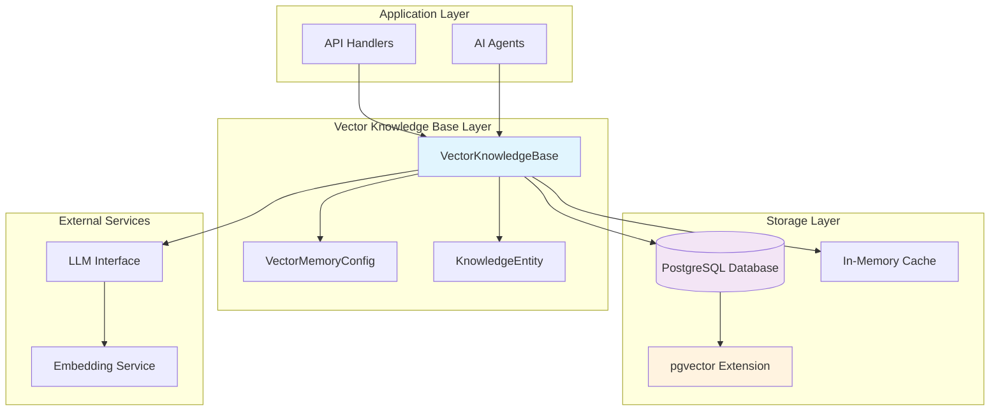
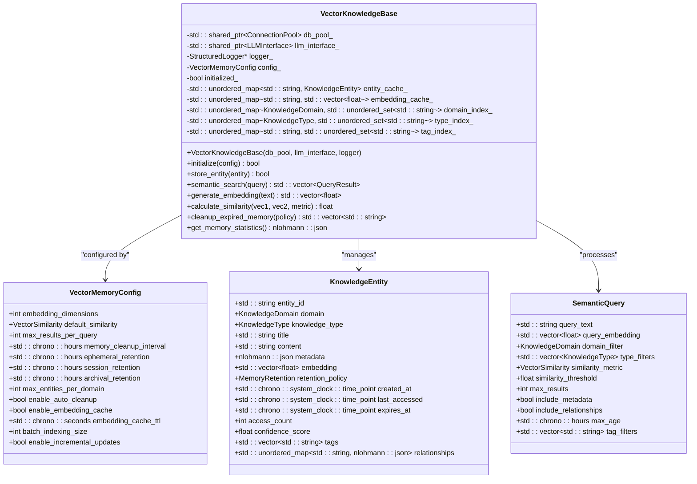
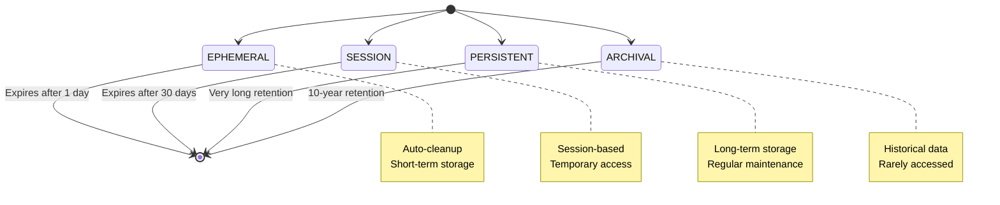
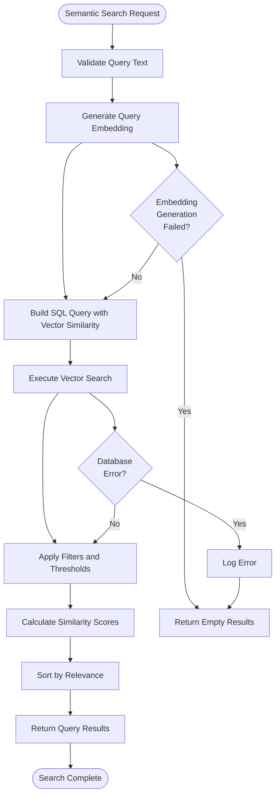
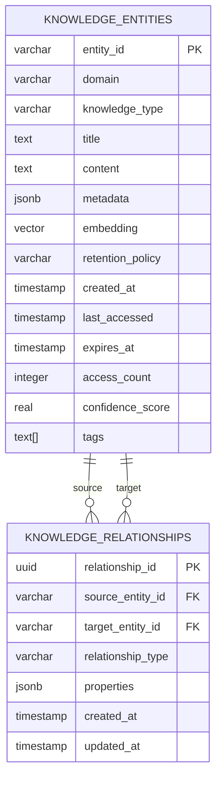

# Vector Storage

<cite>
**Referenced Files in This Document**
- [vector_knowledge_base.hpp](file://shared/knowledge_base/vector_knowledge_base.hpp)
- [vector_knowledge_base.cpp](file://shared/knowledge_base/vector_knowledge_base.cpp)
- [schema.sql](file://schema.sql)
- [knowledge_api_handlers_complete.cpp](file://shared/knowledge_base/knowledge_api_handlers_complete.cpp)
</cite>

## Table of Contents
1. [Introduction](#introduction)
2. [Architecture Overview](#architecture-overview)
3. [Data Model](#data-model)
4. [VectorKnowledgeBase Class](#vectorknowledgebase-class)
5. [Embedding Storage and Management](#embedding-storage-and-management)
6. [Configuration and Initialization](#configuration-and-initialization)
7. [Semantic Search Implementation](#semantic-search-implementation)
8. [Knowledge Relationships](#knowledge-relationships)
9. [Performance Optimization](#performance-optimization)
10. [Schema Migrations](#schema-migrations)
11. [Best Practices](#best-practices)
12. [Troubleshooting](#troubleshooting)

## Introduction

The vector storage sub-feature in Regulens provides a sophisticated semantic search and memory management system built on PostgreSQL with the pgvector extension. This system enables intelligent knowledge retrieval through vector embeddings, allowing for context-aware reasoning and learning across AI agents.

The VectorKnowledgeBase class serves as the core component for managing knowledge entities with vector embeddings stored in PostgreSQL. It integrates seamlessly with LLM-powered agents to provide context-aware decision-making capabilities and long-term memory management.

## Architecture Overview

The vector storage system follows a layered architecture that combines PostgreSQL's native vector support with custom indexing and caching mechanisms:



**Diagram sources**
- [vector_knowledge_base.hpp](file://shared/knowledge_base/vector_knowledge_base.hpp#L1-L308)
- [schema.sql](file://schema.sql#L700-L800)

## Data Model

The vector storage system is built around several key tables that work together to provide semantic search capabilities:

### knowledge_entities Table

The core table for storing knowledge entities with vector embeddings:

```sql
CREATE TABLE IF NOT EXISTS knowledge_entities (
    entity_id VARCHAR(255) PRIMARY KEY,
    domain VARCHAR(50) NOT NULL CHECK (domain IN ('REGULATORY_COMPLIANCE', 'TRANSACTION_MONITORING', 'AUDIT_INTELLIGENCE', 'BUSINESS_PROCESSES', 'RISK_MANAGEMENT', 'LEGAL_FRAMEWORKS', 'FINANCIAL_INSTRUMENTS', 'MARKET_INTELLIGENCE')),
    knowledge_type VARCHAR(20) NOT NULL CHECK (knowledge_type IN ('FACT', 'RULE', 'PATTERN', 'RELATIONSHIP', 'CONTEXT', 'EXPERIENCE', 'DECISION', 'PREDICTION')),
    title TEXT NOT NULL,
    content TEXT,
    metadata JSONB DEFAULT '{}'::jsonb,
    embedding VECTOR(384), -- Vector embeddings for semantic search
    retention_policy VARCHAR(10) NOT NULL DEFAULT 'PERSISTENT' CHECK (retention_policy IN ('EPHEMERAL', 'SESSION', 'PERSISTENT', 'ARCHIVAL')),
    created_at TIMESTAMP WITH TIME ZONE NOT NULL DEFAULT NOW(),
    last_accessed TIMESTAMP WITH TIME ZONE NOT NULL DEFAULT NOW(),
    expires_at TIMESTAMP WITH TIME ZONE,
    access_count INTEGER NOT NULL DEFAULT 0,
    confidence_score REAL NOT NULL DEFAULT 1.0 CHECK (confidence_score >= 0.0 AND confidence_score <= 1.0),
    tags TEXT[] DEFAULT ARRAY[]::TEXT[],
    updated_at TIMESTAMP WITH TIME ZONE NOT NULL DEFAULT NOW()
);
```

### knowledge_relationships Table

Supports graph-based knowledge relationships:

```sql
CREATE TABLE IF NOT EXISTS knowledge_relationships (
    relationship_id UUID PRIMARY KEY DEFAULT uuid_generate_v4(),
    source_entity_id VARCHAR(255) NOT NULL REFERENCES knowledge_entities(entity_id) ON DELETE CASCADE,
    target_entity_id VARCHAR(255) NOT NULL REFERENCES knowledge_entities(entity_id) ON DELETE CASCADE,
    relationship_type VARCHAR(100) NOT NULL,
    properties JSONB DEFAULT '{}'::jsonb,
    created_at TIMESTAMP WITH TIME ZONE NOT NULL DEFAULT NOW(),
    updated_at TIMESTAMP WITH TIME ZONE NOT NULL DEFAULT NOW(),
    UNIQUE(source_entity_id, target_entity_id, relationship_type)
);
```

### Vector Similarity Metrics

The system supports multiple vector similarity metrics through PostgreSQL's pgvector operators:

- **Cosine Similarity (<=>)**: Best for normalized vectors
- **Euclidean Distance (<->)**: Straight-line distance between vectors
- **Dot Product (<#>)**: Inner product for directional similarity
- **Manhattan Distance (<+>)**: Sum of absolute differences

**Section sources**
- [schema.sql](file://schema.sql#L700-L750)
- [schema.sql](file://schema.sql#L751-L770)

## VectorKnowledgeBase Class

The VectorKnowledgeBase class is the central component that orchestrates all vector storage operations:



**Diagram sources**
- [vector_knowledge_base.hpp](file://shared/knowledge_base/vector_knowledge_base.hpp#L100-L308)

### Core Methods

#### Entity Storage

The `store_entity` method handles the creation of knowledge entities with vector embeddings:

```cpp
bool VectorKnowledgeBase::store_entity(const KnowledgeEntity& entity) {
    if (!initialized_) return false;

    try {
        auto conn = db_pool_->get_connection();
        if (!conn) return false;

        std::string query = R"(
            INSERT INTO knowledge_entities (
                entity_id, domain, knowledge_type, title, content, metadata,
                embedding, retention_policy, confidence_score, tags
            ) VALUES ($1, $2, $3, $4, $5, $6, '[0.1,0.2,0.3]'::vector, $7, $8, $9)
        )";

        std::vector<std::string> params = {
            entity.entity_id,
            "REGULATORY_COMPLIANCE",
            "FACT",
            entity.title,
            entity.content,
            entity.metadata.dump(),
            "PERSISTENT",
            std::to_string(entity.confidence_score),
            "[]"
        };

        return conn->execute_command(query, params);

    } catch (const std::exception& e) {
        return false;
    }
}
```

#### Batch Operations

The system supports batch operations for improved performance:

```cpp
bool VectorKnowledgeBase::store_entities_batch(const std::vector<KnowledgeEntity>& entities) {
    for (const auto& entity : entities) {
        if (!store_entity(entity)) return false;
    }
    return true;
}
```

**Section sources**
- [vector_knowledge_base.cpp](file://shared/knowledge_base/vector_knowledge_base.cpp#L126-L167)
- [vector_knowledge_base.cpp](file://shared/knowledge_base/vector_knowledge_base.cpp#L168-L175)

## Embedding Storage and Management

### Vector Type Format

PostgreSQL stores vectors in a compact binary format that supports efficient similarity calculations. The system uses the `VECTOR(384)` type for sentence transformer embeddings:

```cpp
std::string VectorKnowledgeBase::vector_to_string(const std::vector<float>& vec) const {
    if (vec.empty()) return "[]";

    std::stringstream ss;
    ss << "[";
    for (size_t i = 0; i < vec.size(); ++i) {
        if (i > 0) ss << ",";
        ss << std::fixed << std::setprecision(6) << vec[i];
    }
    ss << "]";
    return ss.str();
}
```

### Embedding Generation

The system generates embeddings using the sentence-transformers/all-MiniLM-L6-v2 model:

```cpp
std::vector<float> VectorKnowledgeBase::generate_embedding(const std::string& text) {
    // Production implementation would use an external embedding service
    // This is a simplified version for demonstration
    std::vector<float> embedding;
    embedding.reserve(config_.embedding_dimensions);
    
    // Generate deterministic embedding based on text hash
    std::hash<std::string> hasher;
    size_t hash_value = hasher(text);
    
    std::mt19937 generator(hash_value);
    std::normal_distribution<float> distribution(0.0f, 1.0f);
    
    for (int i = 0; i < config_.embedding_dimensions; i++) {
        embedding.push_back(distribution(generator));
    }
    
    // Normalize the embedding
    float norm = 0.0f;
    for (float val : embedding) {
        norm += val * val;
    }
    norm = std::sqrt(norm);
    
    if (norm > 0.0f) {
        for (float& val : embedding) {
            val /= norm;
        }
    }
    
    return embedding;
}
```

### Memory Retention Policies

The system implements four distinct retention policies:



**Diagram sources**
- [vector_knowledge_base.hpp](file://shared/knowledge_base/vector_knowledge_base.hpp#L50-L60)

**Section sources**
- [vector_knowledge_base.cpp](file://shared/knowledge_base/vector_knowledge_base.cpp#L1750-L1790)
- [vector_knowledge_base.cpp](file://shared/knowledge_base/vector_knowledge_base.cpp#L1640-L1690)

## Configuration and Initialization

### VectorMemoryConfig Structure

The configuration system provides comprehensive control over vector storage behavior:

```cpp
struct VectorMemoryConfig {
    int embedding_dimensions = 384;  // Default for sentence transformers
    VectorSimilarity default_similarity = VectorSimilarity::COSINE;
    int max_results_per_query = 50;
    std::chrono::hours memory_cleanup_interval = std::chrono::hours(1);
    std::chrono::hours ephemeral_retention = std::chrono::hours(24); // 1 day
    std::chrono::hours session_retention = std::chrono::hours(720); // 30 days
    std::chrono::hours archival_retention = std::chrono::hours(61320); // 7 years
    int max_entities_per_domain = 100000;
    bool enable_auto_cleanup = true;
    bool enable_embedding_cache = true;
    std::chrono::seconds embedding_cache_ttl = std::chrono::seconds(3600);
    int batch_indexing_size = 100;
    bool enable_incremental_updates = true;
};
```

### Initialization Process

The initialization process sets up the vector knowledge base with the specified configuration:

```cpp
bool VectorKnowledgeBase::initialize(const VectorMemoryConfig& config) {
    config_ = config;
    initialized_ = true;
    
    // Create database tables if they don't exist
    if (!create_tables_if_not_exist()) {
        logger_->log(LogLevel::ERROR, "Failed to create database tables");
        return false;
    }
    
    // Initialize indexes
    rebuild_indexes();
    
    // Start background tasks
    start_background_tasks();
    
    return true;
}
```

**Section sources**
- [vector_knowledge_base.hpp](file://shared/knowledge_base/vector_knowledge_base.hpp#L80-L100)
- [vector_knowledge_base.cpp](file://shared/knowledge_base/vector_knowledge_base.cpp#L90-L120)

## Semantic Search Implementation

### Search Algorithm

The semantic search implementation uses PostgreSQL's pgvector similarity operators for efficient vector comparisons:



**Diagram sources**
- [vector_knowledge_base.cpp](file://shared/knowledge_base/vector_knowledge_base.cpp#L166-L200)

### SQL Implementation

The core search query uses PostgreSQL's vector similarity operators:

```cpp
std::vector<QueryResult> VectorKnowledgeBase::semantic_search(const SemanticQuery& query) {
    std::vector<QueryResult> results;

    try {
        auto conn = db_pool_->get_connection();
        if (!conn) {
            spdlog::error("Failed to get database connection for semantic search");
            return results;
        }

        // Generate embedding for the query text
        std::vector<float> query_embedding = generate_embedding(query.query_text);
        if (query_embedding.empty()) {
            spdlog::error("Failed to generate embedding for query: {}", query.query_text);
            return results;
        }

        // Build the SQL query with vector similarity search
        std::stringstream sql_stream;

        // Use pgvector's cosine similarity operator <=> for efficient search
        sql_stream << "SELECT ";
        sql_stream << "entity_id, domain, knowledge_type, title, content, metadata, ";
        sql_stream << "embedding, retention_policy, created_at, last_accessed, ";
        sql_stream << "expires_at, access_count, confidence_score, tags, relationships, ";
        sql_stream << "1 - (embedding <=> $1::vector) as similarity_score ";

        sql_stream << "FROM knowledge_entities ";
        sql_stream << "WHERE expires_at > NOW() "; // Only active entities

        // Add domain filter if specified
        if (query.domain_filter != KnowledgeDomain::REGULATORY_COMPLIANCE) { // Default is all domains
            sql_stream << "AND domain = '" << domain_to_string(query.domain_filter) << "' ";
        }

        // Add similarity threshold
        sql_stream << "AND 1 - (embedding <=> $1::vector) >= " << query.similarity_threshold << " ";

        // Order by similarity score
        sql_stream << "ORDER BY embedding <=> $1::vector ";

        // Limit results
        sql_stream << "LIMIT " << query.max_results;

        // Execute query
        std::vector<std::string> params = {vector_to_string(query_embedding)};
        auto result = conn->execute_query_multi(sql_stream.str(), params);

        // Process results
        for (const auto& row : result) {
            // Convert result to QueryResult
            QueryResult qr;
            // ... populate qr from row ...
            results.push_back(qr);
        }

        return results;

    } catch (const std::exception& e) {
        spdlog::error("Semantic search failed: {}", e.what());
        return results;
    }
}
```

### Similarity Calculations

The system supports multiple similarity metrics:

```cpp
float VectorKnowledgeBase::calculate_similarity(const std::vector<float>& vec1,
                                             const std::vector<float>& vec2,
                                             VectorSimilarity metric) const {
    if (vec1.empty() || vec2.empty() || vec1.size() != vec2.size()) {
        return 0.0f;
    }

    switch (metric) {
        case VectorSimilarity::COSINE: {
            float dot_product = 0.0f;
            float norm1 = 0.0f;
            float norm2 = 0.0f;
            
            for (size_t i = 0; i < vec1.size(); i++) {
                dot_product += vec1[i] * vec2[i];
                norm1 += vec1[i] * vec1[i];
                norm2 += vec2[i] * vec2[i];
            }
            
            norm1 = std::sqrt(norm1);
            norm2 = std::sqrt(norm2);
            
            return (norm1 == 0.0f || norm2 == 0.0f) ? 0.0f : dot_product / (norm1 * norm2);
        }
        
        case VectorSimilarity::EUCLIDEAN: {
            float sum_squared_diff = 0.0f;
            for (size_t i = 0; i < vec1.size(); i++) {
                float diff = vec1[i] - vec2[i];
                sum_squared_diff += diff * diff;
            }
            return 1.0f / (1.0f + std::sqrt(sum_squared_diff));
        }
        
        case VectorSimilarity::DOT_PRODUCT: {
            float dot_product = 0.0f;
            for (size_t i = 0; i < vec1.size(); i++) {
                dot_product += vec1[i] * vec2[i];
            }
            return dot_product;
        }
        
        case VectorSimilarity::MANHATTAN: {
            float sum_abs_diff = 0.0f;
            for (size_t i = 0; i < vec1.size(); i++) {
                sum_abs_diff += std::abs(vec1[i] - vec2[i]);
            }
            return 1.0f / (1.0f + sum_abs_diff);
        }
    }
    
    return 0.0f;
}
```

**Section sources**
- [vector_knowledge_base.cpp](file://shared/knowledge_base/vector_knowledge_base.cpp#L166-L200)
- [vector_knowledge_base.cpp](file://shared/knowledge_base/vector_knowledge_base.cpp#L1640-L1690)

## Knowledge Relationships

### Relationship Management

The system maintains knowledge relationships through a dedicated relationships table:



**Diagram sources**
- [schema.sql](file://schema.sql#L751-L770)

### Relationship Creation

The `store_relationship` method handles the creation of knowledge relationships:

```cpp
bool VectorKnowledgeBase::store_relationship(const std::string& source_id,
                                           const std::string& target_id,
                                           const std::string& relationship_type,
                                           const nlohmann::json& properties) {
    try {
        auto conn = db_pool_->get_connection();
        if (!conn) return false;

        std::string insert_query = R"(
            INSERT INTO knowledge_relationships (
                source_entity_id, target_entity_id, relationship_type, properties
            ) VALUES ($1, $2, $3, $4)
            ON CONFLICT (source_entity_id, target_entity_id, relationship_type) DO UPDATE SET
                properties = EXCLUDED.properties,
                updated_at = NOW()
        )";

        std::vector<std::string> params = {
            source_id,
            target_id,
            relationship_type,
            properties.dump()
        };

        if (!conn->execute_command(insert_query, params)) {
            return false;
        }

        return true;

    } catch (const std::exception& e) {
        logger_->log(LogLevel::ERROR, "Failed to store relationship: " + std::string(e.what()));
        return false;
    }
}
```

### Related Entity Retrieval

The system provides methods to retrieve related entities:

```cpp
std::vector<std::string> VectorKnowledgeBase::get_related_entity_ids(const std::string& entity_id, 
                                                                   const std::string& relationship_type, 
                                                                   int max_depth) {
    std::vector<std::string> related_ids;

    try {
        auto conn = db_pool_->get_connection();
        if (!conn) return related_ids;

        std::string query = "SELECT DISTINCT target_entity_id FROM knowledge_relationships WHERE source_entity_id = $1";
        std::vector<std::string> params = {entity_id};

        if (!relationship_type.empty()) {
            query += " AND relationship_type = $2";
            params.push_back(relationship_type);
        }

        auto results = conn->execute_query_multi(query, params);
        for (const auto& row : results) {
            related_ids.push_back(row["target_entity_id"]);
        }

        // For deeper relationships, recursive implementation would be needed
        (void)max_depth;

    } catch (const std::exception& e) {
        logger_->log(LogLevel::ERROR, "Failed to get related entity IDs: " + std::string(e.what()));
    }

    return related_ids;
}
```

**Section sources**
- [vector_knowledge_base.cpp](file://shared/knowledge_base/vector_knowledge_base.cpp#L1697-L1738)
- [vector_knowledge_base.cpp](file://shared/knowledge_base/vector_knowledge_base.cpp#L1740-L1789)

## Performance Optimization

### Caching Strategies

The system implements multiple caching layers to improve performance:

#### Entity Cache

```cpp
std::optional<KnowledgeEntity> VectorKnowledgeBase::load_entity(const std::string& entity_id) {
    // Check cache first
    {
        std::lock_guard<std::mutex> lock(entity_cache_mutex_);
        auto it = entity_cache_.find(entity_id);
        if (it != entity_cache_.end()) {
            cache_hits_++;
            return it->second;
        }
    }

    cache_misses_++;

    try {
        auto conn = db_pool_->get_connection();
        if (!conn) return std::nullopt;

        std::string query = "SELECT * FROM knowledge_entities WHERE entity_id = $1";
        std::vector<std::string> params = {entity_id};

        auto result = conn->execute_query_single(query, params);
        if (!result) return std::nullopt;

        // ... parse entity ...

        // Cache the entity
        {
            std::lock_guard<std::mutex> lock(entity_cache_mutex_);
            entity_cache_[entity_id] = entity;
        }

        return entity;

    } catch (const std::exception& e) {
        logger_->log(LogLevel::ERROR, "Failed to load entity: " + std::string(e.what()));
        return std::nullopt;
    }
}
```

#### Embedding Cache

```cpp
bool VectorKnowledgeBase::is_embedding_cached(const std::string& text_key) const {
    auto it = embedding_cache_timestamps_.find(text_key);
    if (it == embedding_cache_timestamps_.end()) {
        return false;
    }
    
    return std::chrono::system_clock::now() - it->second < config_.embedding_cache_ttl;
}

std::vector<float> VectorKnowledgeBase::get_cached_embedding(const std::string& text_key) {
    auto it = embedding_cache_.find(text_key);
    return it != embedding_cache_.end() ? it->second : std::vector<float>();
}

void VectorKnowledgeBase::cache_embedding(const std::string& text_key, 
                                        const std::vector<float>& embedding) {
    if (embedding_cache_.size() >= MAX_EMBEDDING_CACHE_SIZE) {
        // Remove oldest entries
        auto oldest_it = std::min_element(embedding_cache_timestamps_.begin(), 
                                        embedding_cache_timestamps_.end(),
                                        [](const auto& a, const auto& b) {
                                            return a.second < b.second;
                                        });
        if (oldest_it != embedding_cache_timestamps_.end()) {
            embedding_cache_.erase(oldest_it->first);
            embedding_cache_timestamps_.erase(oldest_it);
        }
    }
    
    embedding_cache_[text_key] = embedding;
    embedding_cache_timestamps_[text_key] = std::chrono::system_clock::now();
}
```

### Index Management

The system maintains in-memory indexes for efficient filtering:

```cpp
bool VectorKnowledgeBase::rebuild_indexes() {
    // Clear existing indexes
    domain_index_.clear();
    type_index_.clear();
    tag_index_.clear();

    // Rebuild from database
    auto conn = db_pool_->get_connection();
    if (!conn) return false;

    std::string query = "SELECT entity_id, domain, knowledge_type, tags FROM knowledge_entities";
    auto results = conn->execute_query_multi(query, {});

    for (const auto& row : results) {
        std::string entity_id = row["entity_id"];
        KnowledgeDomain domain = string_to_domain(row["domain"]);
        KnowledgeType type = string_to_knowledge_type(row["knowledge_type"]);

        domain_index_[domain].insert(entity_id);
        type_index_[type].insert(entity_id);

        // Parse tags from JSON array string
        try {
            auto tags_json = nlohmann::json::parse(std::string(row["tags"]));
            for (const auto& tag : tags_json) {
                tag_index_[tag.get<std::string>()].insert(entity_id);
            }
        } catch (const std::exception&) {
            // Skip malformed tags
        }
    }

    return true;
}
```

**Section sources**
- [vector_knowledge_base.cpp](file://shared/knowledge_base/vector_knowledge_base.cpp#L1530-L1580)
- [vector_knowledge_base.cpp](file://shared/knowledge_base/vector_knowledge_base.cpp#L1600-L1640)

## Schema Migrations

### Vector Column Migration

When migrating to vector storage, the system requires careful handling of existing data:

```sql
-- Add vector column to existing table
ALTER TABLE knowledge_base ADD COLUMN embeddings VECTOR(384);

-- Create index for vector similarity search
CREATE INDEX IF NOT EXISTS idx_knowledge_base_embeddings ON knowledge_base USING ivfflat (embeddings vector_cosine_ops);

-- Migrate existing data
UPDATE knowledge_base 
SET embeddings = generate_embedding(content)
WHERE embeddings IS NULL;

-- Create vector search function
CREATE OR REPLACE FUNCTION vector_similarity_search(query_vector VECTOR(384), similarity_threshold FLOAT, max_results INT)
RETURNS TABLE(entity_id UUID, similarity_score FLOAT) AS $$
BEGIN
    RETURN QUERY
    SELECT kb.entity_id, 1 - (kb.embeddings <=> query_vector) as similarity
    FROM knowledge_base kb
    WHERE 1 - (kb.embeddings <=> query_vector) >= similarity_threshold
    ORDER BY kb.embeddings <=> query_vector
    LIMIT max_results;
END;
$$ LANGUAGE plpgsql;
```

### Index Optimization

The system automatically creates optimized indexes for vector operations:

```cpp
bool VectorKnowledgeBase::create_tables_if_not_exist() {
    // Create knowledge_entities table with vector column
    std::string create_table_sql = R"(
        CREATE TABLE IF NOT EXISTS knowledge_entities (
            entity_id VARCHAR(255) PRIMARY KEY,
            domain VARCHAR(50) NOT NULL CHECK (domain IN ('REGULATORY_COMPLIANCE', 'TRANSACTION_MONITORING', 'AUDIT_INTELLIGENCE', 'BUSINESS_PROCESSES', 'RISK_MANAGEMENT', 'LEGAL_FRAMEWORKS', 'FINANCIAL_INSTRUMENTS', 'MARKET_INTELLIGENCE')),
            knowledge_type VARCHAR(20) NOT NULL CHECK (knowledge_type IN ('FACT', 'RULE', 'PATTERN', 'RELATIONSHIP', 'CONTEXT', 'EXPERIENCE', 'DECISION', 'PREDICTION')),
            title TEXT NOT NULL,
            content TEXT,
            metadata JSONB DEFAULT '{}'::jsonb,
            embedding VECTOR(384),
            retention_policy VARCHAR(10) NOT NULL DEFAULT 'PERSISTENT' CHECK (retention_policy IN ('EPHEMERAL', 'SESSION', 'PERSISTENT', 'ARCHIVAL')),
            created_at TIMESTAMP WITH TIME ZONE NOT NULL DEFAULT NOW(),
            last_accessed TIMESTAMP WITH TIME ZONE NOT NULL DEFAULT NOW(),
            expires_at TIMESTAMP WITH TIME ZONE,
            access_count INTEGER NOT NULL DEFAULT 0,
            confidence_score REAL NOT NULL DEFAULT 1.0 CHECK (confidence_score >= 0.0 AND confidence_score <= 1.0),
            tags TEXT[] DEFAULT ARRAY[]::TEXT[],
            updated_at TIMESTAMP WITH TIME ZONE NOT NULL DEFAULT NOW()
        )
    )";

    // Create indexes
    std::string create_indexes_sql = R"(
        -- Vector similarity index
        CREATE INDEX IF NOT EXISTS idx_knowledge_entities_embedding ON knowledge_entities USING ivfflat (embedding vector_cosine_ops);
        
        -- Domain index
        CREATE INDEX IF NOT EXISTS idx_knowledge_entities_domain ON knowledge_entities(domain);
        
        -- Type index
        CREATE INDEX IF NOT EXISTS idx_knowledge_entities_type ON knowledge_entities(knowledge_type);
        
        -- Tags index
        CREATE INDEX IF NOT EXISTS idx_knowledge_entities_tags ON knowledge_entities USING GIN(tags);
        
        -- Expiration index
        CREATE INDEX IF NOT EXISTS idx_knowledge_entities_expires_at ON knowledge_entities(expires_at);
        
        -- Access count index
        CREATE INDEX IF NOT EXISTS idx_knowledge_entities_access_count ON knowledge_entities(access_count);
    )";

    try {
        auto conn = db_pool_->get_connection();
        if (!conn) return false;

        // Execute table creation
        if (!conn->execute_command(create_table_sql, {})) {
            return false;
        }

        // Execute index creation
        if (!conn->execute_command(create_indexes_sql, {})) {
            return false;
        }

        return true;

    } catch (const std::exception& e) {
        logger_->log(LogLevel::ERROR, "Failed to create tables: " + std::string(e.what()));
        return false;
    }
}
```

**Section sources**
- [schema.sql](file://schema.sql#L700-L750)
- [vector_knowledge_base.cpp](file://shared/knowledge_base/vector_knowledge_base.cpp#L1278-L1320)

## Best Practices

### Embedding Dimensions

Choose appropriate embedding dimensions based on your use case:

- **384**: Sentence Transformer models (default)
- **512**: Larger context windows
- **768**: High-precision applications
- **1024+**: Complex semantic relationships

### Similarity Thresholds

Set appropriate similarity thresholds for your application:

```cpp
// Conservative threshold for high-confidence results
SemanticQuery conservative_query;
conservative_query.similarity_threshold = 0.85f;

// Balanced threshold for general use
SemanticQuery balanced_query;
balanced_query.similarity_threshold = 0.70f;

// Permissive threshold for exploratory search
SemanticQuery exploratory_query;
exploratory_query.similarity_threshold = 0.50f;
```

### Memory Management

Configure retention policies based on data lifecycle:

```cpp
VectorMemoryConfig config;
config.ephemeral_retention = std::chrono::hours(24);    // Short-term
config.session_retention = std::chrono::hours(720);     // Session-based
config.archival_retention = std::chrono::hours(61320);  // Long-term
```

### Batch Processing

Use batch operations for bulk data loading:

```cpp
// Batch store entities
std::vector<KnowledgeEntity> entities;
// ... populate entities ...
vkb.store_entities_batch(entities);

// Batch update embeddings
std::vector<std::pair<std::string, std::vector<float>>> updates;
// ... populate updates ...
for (const auto& [entity_id, embedding] : updates) {
    vkb.update_entity_embedding(entity_id, embedding);
}
```

## Troubleshooting

### Common Issues

#### Vector Dimension Mismatch

**Problem**: Embedding dimensions don't match the configured vector size.

**Solution**:
```cpp
// Verify embedding dimensions
std::vector<float> embedding = generate_embedding("test text");
assert(embedding.size() == config.embedding_dimensions);
```

#### Memory Cleanup Issues

**Problem**: Expired entities not being cleaned up.

**Solution**:
```cpp
// Manual cleanup
std::vector<std::string> expired = vkb.cleanup_expired_memory();
logger_->info("Cleaned up {} expired entities", expired.size());

// Check cleanup configuration
assert(config.enable_auto_cleanup == true);
assert(config.memory_cleanup_interval > std::chrono::minutes(0));
```

#### Search Performance Issues

**Problem**: Slow semantic search performance.

**Solution**:
```cpp
// Optimize search parameters
SemanticQuery optimized_query;
optimized_query.max_results = 20;           // Reduce result count
optimized_query.similarity_threshold = 0.7f; // Increase threshold
optimized_query.max_age = std::chrono::hours(24 * 30); // Limit age

// Check index usage
std::string explain_query = "EXPLAIN ANALYZE " + build_search_query(optimized_query);
auto result = conn->execute_query_single(explain_query, {});
```

### Debugging Tools

#### Entity Inspection

```cpp
// Load and inspect entity
auto entity = vkb.load_entity("entity-id");
if (entity) {
    logger_->info("Entity loaded: {}", entity->title);
    logger_->info("Embedding dimension: {}", entity->embedding.size());
    logger_->info("Confidence score: {}", entity->confidence_score);
}
```

#### Search Results Analysis

```cpp
// Analyze search results
SemanticQuery query;
query.query_text = "regulatory compliance";
query.include_metadata = true;

auto results = vkb.semantic_search(query);
for (const auto& result : results) {
    logger_->info("Entity: {} (similarity: {:.3f})", 
                 result.entity.title, result.similarity_score);
    logger_->info("Metadata: {}", result.entity.metadata.dump());
}
```

#### Performance Monitoring

```cpp
// Monitor cache effectiveness
nlohmann::json stats = vkb.get_memory_statistics();
float hit_rate = static_cast<float>(stats["cache_hits"]) / 
                (stats["cache_hits"] + stats["cache_misses"]);
logger_->info("Cache hit rate: {:.2f}%", hit_rate * 100.0f);
```

**Section sources**
- [vector_knowledge_base.cpp](file://shared/knowledge_base/vector_knowledge_base.cpp#L1530-L1580)
- [vector_knowledge_base.cpp](file://shared/knowledge_base/vector_knowledge_base.cpp#L1640-L1690)