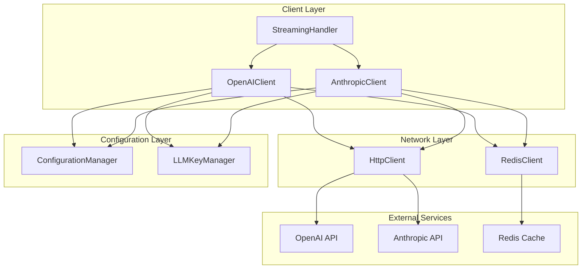
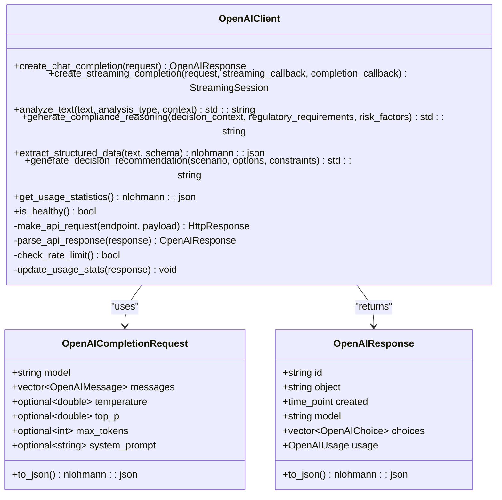
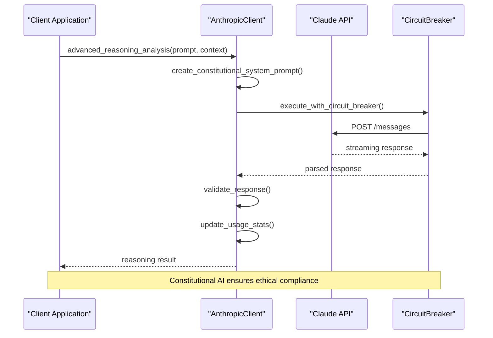
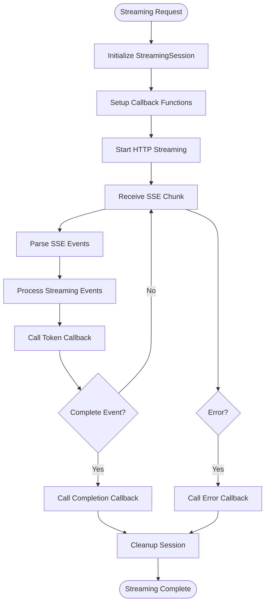
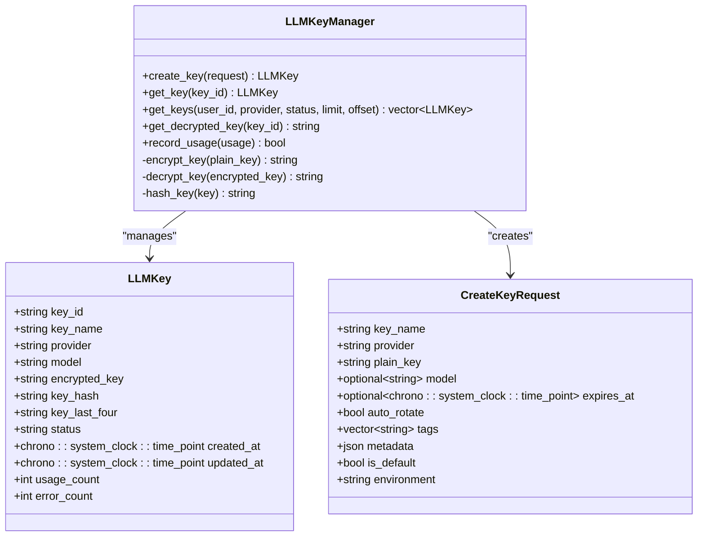

# API Clients

<cite>
**Referenced Files in This Document**
- [openai_client.hpp](file://shared/llm/openai_client.hpp)
- [openai_client.cpp](file://shared/llm/openai_client.cpp)
- [anthropic_client.hpp](file://shared/llm/anthropic_client.hpp)
- [anthropic_client.cpp](file://shared/llm/anthropic_client.cpp)
- [streaming_handler.hpp](file://shared/llm/streaming_handler.hpp)
- [streaming_handler.cpp](file://shared/llm/streaming_handler.cpp)
- [http_client.hpp](file://shared/network/http_client.hpp)
- [llm_api_handlers.cpp](file://shared/llm/llm_api_handlers.cpp)
- [llm_key_manager.cpp](file://shared/llm/llm_key_manager.cpp)
- [configuration_manager.hpp](file://shared/config/configuration_manager.hpp)
</cite>

## Table of Contents
1. [Introduction](#introduction)
2. [Architecture Overview](#architecture-overview)
3. [OpenAI Client Implementation](#openai-client-implementation)
4. [Anthropic Client Implementation](#anthropic-client-implementation)
5. [Streaming Response Handling](#streaming-response-handling)
6. [Authentication and Configuration](#authentication-and-configuration)
7. [Error Handling and Resilience](#error-handling-and-resilience)
8. [Performance Optimization](#performance-optimization)
9. [Common Issues and Troubleshooting](#common-issues-and-troubleshooting)
10. [Best Practices](#best-practices)

## Introduction

The API Clients sub-component of LLM Integration provides production-grade connectivity to major Large Language Model (LLM) providers including OpenAI and Anthropic. This system offers robust, scalable, and resilient communication with external AI services while maintaining comprehensive error handling, rate limiting, and usage tracking capabilities.

The implementation follows enterprise-grade patterns with support for streaming responses, caching, circuit breakers, and advanced retry mechanisms. Both OpenAI and Anthropic clients share common interfaces while providing provider-specific optimizations and features.

## Architecture Overview

The API Clients architecture consists of several interconnected components that work together to provide reliable LLM integration:



**Diagram sources**
- [openai_client.hpp](file://shared/llm/openai_client.hpp#L1-L544)
- [anthropic_client.hpp](file://shared/llm/anthropic_client.hpp#L1-L578)
- [streaming_handler.hpp](file://shared/llm/streaming_handler.hpp#L1-L352)

## OpenAI Client Implementation

The OpenAIClient provides comprehensive integration with OpenAI's API, offering advanced features for chat completions, text analysis, and specialized reasoning tasks.

### Core Structure and Initialization

The OpenAI client is built around several key data structures that define the API contract:

```cpp
struct OpenAIMessage {
    std::string role;    // "system", "user", "assistant", "function", "tool"
    std::string content;
    std::optional<std::string> name;
    std::optional<nlohmann::json> function_call;
    std::optional<nlohmann::json> tool_calls;
    std::optional<std::string> tool_call_id;
};

struct OpenAICompletionRequest {
    std::string model = "gpt-4-turbo-preview";
    std::vector<OpenAIMessage> messages;
    std::optional<double> temperature;
    std::optional<double> top_p;
    std::optional<int> max_tokens;
    // ... additional parameters
};
```

### Key Methods and Capabilities

The OpenAI client provides several specialized methods for different use cases:



**Diagram sources**
- [openai_client.hpp](file://shared/llm/openai_client.hpp#L15-L544)

### System Prompt Strategies

The OpenAI client employs sophisticated system prompt strategies for different analysis types:

```cpp
std::string OpenAIClient::create_system_prompt(const std::string& task_type) {
    if (task_type == "compliance") {
        return R"(
You are an expert compliance officer with deep knowledge of financial regulations, risk management, and corporate governance.
Your task is to provide detailed compliance reasoning for business decisions, considering applicable regulatory requirements, identified risk factors,
potential compliance implications, and recommended risk mitigation strategies.
Provide your analysis in a structured format with clear reasoning and actionable recommendations.)";
    }
    // ... additional prompt strategies
}
```

### Function Calling Support

The OpenAI client supports both legacy function calling and modern tool calling:

```cpp
OpenAICompletionRequest OpenAIClient::create_function_completion_request(
    const std::vector<OpenAIMessage>& messages,
    const nlohmann::json& functions,
    const std::string& model = "gpt-4-turbo-preview") {
    
    return OpenAICompletionRequest{
        .model = model,
        .messages = messages,
        .functions = functions,
        .temperature = 0.7,
        .max_tokens = 1000
    };
}
```

**Section sources**
- [openai_client.hpp](file://shared/llm/openai_client.hpp#L1-L544)
- [openai_client.cpp](file://shared/llm/openai_client.cpp#L1-L543)

## Anthropic Client Implementation

The AnthropicClient provides specialized integration with Anthropic's Claude API, focusing on advanced reasoning capabilities and constitutional AI safety features.

### Core Structure and Configuration

The Anthropic client uses a different message structure optimized for Claude's API:

```cpp
struct ClaudeMessage {
    std::string role;    // "user", "assistant"
    std::string content;
    std::optional<std::vector<std::unordered_map<std::string, std::string>>> content_blocks;
};

struct ClaudeCompletionRequest {
    std::string model = "claude-3-sonnet-20240229";
    int max_tokens = 4096;
    std::vector<ClaudeMessage> messages;
    std::optional<std::string> system;  // System prompt
    std::optional<bool> stream;
    std::optional<double> temperature;
    // ... additional parameters
};
```

### Advanced Reasoning Capabilities

The Anthropic client excels in complex reasoning tasks with constitutional AI safety:



**Diagram sources**
- [anthropic_client.cpp](file://shared/llm/anthropic_client.cpp#L1-L577)

### Constitutional AI Analysis

The Anthropic client implements constitutional AI principles for ethical compliance:

```cpp
std::optional<std::string> AnthropicClient::constitutional_ai_analysis(
    const std::string& content,
    const std::vector<std::string>& compliance_requirements) {
    
    std::string system_prompt = create_constitutional_system_prompt("compliance");
    
    ClaudeCompletionRequest request{
        .model = default_model_,
        .max_tokens = max_tokens_,
        .messages = {ClaudeMessage{"user", user_prompt, std::nullopt}},
        .system = system_prompt,
        .temperature = 0.1  // Very low temperature for ethical consistency
    };
    
    return execute_with_retry(
        [this, &request]() { return create_message(request); },
        "constitutional_ai_analysis"
    );
}
```

### Ethical Decision Analysis

The client provides specialized support for ethical decision-making:

```cpp
std::optional<std::string> AnthropicClient::ethical_decision_analysis(
    const std::string& scenario,
    const std::vector<std::string>& options,
    const std::vector<std::string>& constraints,
    const std::vector<std::string>& ethical_considerations) {
    
    std::string system_prompt = create_constitutional_system_prompt("ethical_decision");
    
    // Build comprehensive analysis request with all considerations
    std::string user_prompt = build_ethical_analysis_prompt(scenario, options, constraints, ethical_considerations);
    
    return create_message(create_claude_analysis_request(system_prompt, user_prompt));
}
```

**Section sources**
- [anthropic_client.hpp](file://shared/llm/anthropic_client.hpp#L1-L578)
- [anthropic_client.cpp](file://shared/llm/anthropic_client.cpp#L1-L577)

## Streaming Response Handling

Both clients support real-time streaming responses through a sophisticated streaming handler system that manages Server-Sent Events (SSE) parsing and callback-based processing.

### Streaming Architecture



**Diagram sources**
- [streaming_handler.cpp](file://shared/llm/streaming_handler.cpp#L1-L351)

### SSE Parsing and Event Processing

The streaming handler implements robust SSE parsing with comprehensive error handling:

```cpp
std::vector<StreamingEvent> SSEParser::parse_chunk(const std::string& data) {
    event_buffer_ += data;
    std::vector<StreamingEvent> events;
    
    auto complete_events = extract_events(event_buffer_);
    for (const auto& event_data : complete_events) {
        try {
            // Parse SSE event with proper field extraction
            std::istringstream iss(event_data);
            std::string line;
            std::string event_type = "message";
            std::string event_data_content;
            std::unordered_map<std::string, std::string> metadata;
            
            while (std::getline(iss, line)) {
                if (!line.empty() && line.back() == '\r') {
                    line.pop_back();  // Remove trailing \r
                }
                if (line.empty()) continue;
                
                auto parsed = parse_sse_line(line);
                // Process parsed fields...
            }
            
            // Create appropriate streaming event based on type
            StreamingEventType streaming_type;
            if (event_type == "completion" || event_type == "done") {
                streaming_type = StreamingEventType::COMPLETION;
            } else if (event_type == "error") {
                streaming_type = StreamingEventType::ERROR;
            } else if (!event_data_content.empty()) {
                streaming_type = StreamingEventType::TOKEN;
            }
            
            events.emplace_back(streaming_type, event_data_content, metadata);
            
        } catch (const std::exception& e) {
            logger_->error("Failed to parse SSE event: " + std::string(e.what()));
        }
    }
    
    return events;
}
```

### Streaming Session Management

Each streaming session maintains state and coordinates between different components:

```cpp
class StreamingSession {
public:
    void start(StreamingCallback streaming_callback,
               CompletionCallback completion_callback,
               ErrorCallback error_callback);
    
    void process_data(const std::string& data);
    void complete(const nlohmann::json& final_response);
    void fail(const std::string& error);
    
    bool is_active() const { return active_.load(); }
    nlohmann::json get_accumulated_response() const;
    
private:
    std::atomic<bool> active_;
    StreamingCallback streaming_callback_;
    CompletionCallback completion_callback_;
    ErrorCallback error_callback_;
    
    SSEParser sse_parser_;
    StreamingAccumulator accumulator_;
    nlohmann::json final_response_;
};
```

**Section sources**
- [streaming_handler.hpp](file://shared/llm/streaming_handler.hpp#L1-L352)
- [streaming_handler.cpp](file://shared/llm/streaming_handler.cpp#L1-L351)

## Authentication and Configuration

The system provides comprehensive authentication and configuration management through multiple layers.

### Configuration Management

The ConfigurationManager centralizes all configuration access with type-safe methods:

```cpp
// LLM-specific configuration access
std::unordered_map<std::string, std::string> get_openai_config() const;
std::unordered_map<std::string, std::string> get_anthropic_config() const;

// Environment-specific configuration
inline constexpr const char* LLM_OPENAI_API_KEY = "LLM_OPENAI_API_KEY";
inline constexpr const char* LLM_ANTHROPIC_API_KEY = "LLM_ANTHROPIC_API_KEY";
inline constexpr const char* LLM_OPENAI_BASE_URL = "LLM_OPENAI_BASE_URL";
inline constexpr const char* LLM_ANTHROPIC_BASE_URL = "LLM_ANTHROPIC_BASE_URL";
```

### LLM Key Management

The LLMKeyManager provides secure API key storage and management:



**Diagram sources**
- [llm_key_manager.cpp](file://shared/llm/llm_key_manager.cpp#L1-L574)

### Authentication Patterns

Both clients support multiple authentication patterns:

```cpp
// OpenAI client authentication
std::unordered_map<std::string, std::string> headers = {
    {"Authorization", "Bearer " + api_key_},
    {"Content-Type", "application/json"}
};

// Anthropic client authentication  
std::unordered_map<std::string, std::string> headers = {
    {"x-api-key", api_key_},
    {"anthropic-version", "2023-06-01"},
    {"Content-Type", "application/json"}
};
```

**Section sources**
- [configuration_manager.hpp](file://shared/config/configuration_manager.hpp#L1-L343)
- [llm_key_manager.cpp](file://shared/llm/llm_key_manager.cpp#L1-L574)

## Error Handling and Resilience

The system implements comprehensive error handling and resilience patterns to ensure reliable operation under various failure conditions.

### Circuit Breaker Integration

Both clients integrate with advanced circuit breaker patterns for fault tolerance:

```cpp
// Advanced circuit breaker usage in OpenAI client
if (use_advanced_circuit_breaker_) {
    auto breaker_result = error_handler_->execute_with_advanced_circuit_breaker(
        [this, &request, &temp_result]() -> regulens::CircuitBreakerResult {
            auto http_response = make_api_request("/chat/completions", request.to_json());
            if (!http_response) {
                return regulens::CircuitBreakerResult(false, std::nullopt,
                    "HTTP request failed", std::chrono::milliseconds(0),
                    regulens::CircuitState::CLOSED);
            }
            // ... additional error handling
        },
        CIRCUIT_BREAKER_SERVICE, "OpenAIClient", "create_chat_completion"
    );
}
```

### Rate Limiting and Backoff

The clients implement sophisticated rate limiting with exponential backoff:

```cpp
bool OpenAIClient::check_rate_limit() {
    std::lock_guard<std::mutex> lock(rate_limit_mutex_);
    
    auto now = std::chrono::system_clock::now();
    auto window_start = now - rate_limit_window_;
    
    // Remove old requests outside the time window
    while (!request_timestamps_.empty() && 
           request_timestamps_.front() < window_start) {
        request_timestamps_.pop_front();
    }
    
    // Check if we've exceeded the rate limit
    if (request_timestamps_.size() >= max_requests_per_minute_) {
        logger_->warn("Rate limit exceeded: " + std::to_string(request_timestamps_.size()) + 
                     " requests in last minute");
        return false;
    }
    
    request_timestamps_.push_back(now);
    return true;
}
```

### Retry Mechanisms

The Anthropic client implements sophisticated retry logic with exponential backoff:

```cpp
std::optional<ClaudeResponse> AnthropicClient::execute_with_retry(
    std::function<std::optional<ClaudeResponse>()> operation,
    const std::string& operation_name) {
    
    int attempts = 0;
    std::chrono::milliseconds delay = base_retry_delay_;
    
    while (attempts < max_retries_) {
        try {
            auto result = operation();
            if (result) {
                return result;
            }
        } catch (const std::exception& e) {
            logger_->warn("Operation " + operation_name + " failed: " + 
                         std::string(e.what()) + ", attempt " + 
                         std::to_string(attempts + 1));
        }
        
        // Exponential backoff with jitter
        std::this_thread::sleep_for(delay + std::chrono::milliseconds(rand() % 1000));
        delay *= 2;
        attempts++;
    }
    
    return std::nullopt;
}
```

**Section sources**
- [openai_client.cpp](file://shared/llm/openai_client.cpp#L1-L543)
- [anthropic_client.cpp](file://shared/llm/anthropic_client.cpp#L1-L577)

## Performance Optimization

The system incorporates multiple performance optimization strategies to maximize throughput and minimize latency.

### Caching Strategy

Both clients implement intelligent caching with Redis for frequently accessed responses:

```cpp
// Cache key generation using SHA-256 hashing
std::string OpenAIClient::generate_prompt_hash(const OpenAICompletionRequest& request) {
    std::string content;
    for (const auto& msg : request.messages) {
        content += msg.role + ":" + msg.content;
    }
    
    unsigned char hash[SHA256_DIGEST_LENGTH];
    SHA256_CTX sha256;
    SHA256_Init(&sha256);
    SHA256_Update(&sha256, content.c_str(), content.size());
    SHA256_Final(hash, &sha256);
    
    std::stringstream ss;
    for (int i = 0; i < SHA256_DIGEST_LENGTH; i++) {
        ss << std::hex << std::setw(2) << std::setfill('0') << (int)hash[i];
    }
    return ss.str();
}

// Intelligent TTL based on prompt complexity
double OpenAIClient::calculate_prompt_complexity(const OpenAICompletionRequest& request) {
    double complexity = 0.0;
    
    for (const auto& msg : request.messages) {
        // Base complexity on message length
        complexity += std::min(1.0, static_cast<double>(msg.content.length()) / 1000.0);
        
        // Additional complexity for function calls
        if (msg.function_call) complexity += 0.2;
        if (msg.tool_calls) complexity += 0.3;
    }
    
    return std::min(1.0, complexity);
}
```

### Connection Pooling and Reuse

The HTTP client implements connection pooling for optimal resource utilization:

```cpp
class HttpClient {
public:
    void set_timeout(long seconds);
    void set_user_agent(const std::string& user_agent);
    void set_ssl_verify(bool verify);
    void set_proxy(const std::string& proxy);
    
    HttpResponse get(const std::string& url,
                    const std::unordered_map<std::string, std::string>& headers = {});
    HttpResponse post(const std::string& url,
                     const std::string& data,
                     const std::unordered_map<std::string, std::string>& headers = {});
};
```

### Usage Tracking and Metrics

Comprehensive usage tracking enables performance monitoring and optimization:

```cpp
nlohmann::json OpenAIClient::get_usage_statistics() {
    return {
        {"total_requests", static_cast<size_t>(total_requests_)},
        {"successful_requests", static_cast<size_t>(successful_requests_)},
        {"failed_requests", static_cast<size_t>(failed_requests_)},
        {"success_rate", total_requests_ > 0 ?
            (static_cast<double>(successful_requests_) / total_requests_) * 100.0 : 0.0},
        {"total_tokens_used", static_cast<size_t>(total_tokens_used_)},
        {"estimated_cost_usd", estimated_cost_usd_.load()},
        {"last_request_time", std::chrono::duration_cast<std::chrono::milliseconds>(
            last_request_time_.time_since_epoch()).count()},
        {"configuration", {
            {"model", default_model_},
            {"max_tokens", max_tokens_},
            {"temperature", temperature_},
            {"max_requests_per_minute", max_requests_per_minute_}
        }}
    };
}
```

**Section sources**
- [openai_client.cpp](file://shared/llm/openai_client.cpp#L1-L543)
- [anthropic_client.cpp](file://shared/llm/anthropic_client.cpp#L1-L577)

## Common Issues and Troubleshooting

### Authentication Failures

**Problem**: API requests fail with authentication errors
**Symptoms**: HTTP 401 Unauthorized responses, "Invalid API key" messages
**Solution**: Verify environment variables and key validity

```bash
# Check OpenAI API key
echo $LLM_OPENAI_API_KEY

# Check Anthropic API key  
echo $LLM_ANTHROPIC_API_KEY

# Verify key format and length
python3 -c "import os; print(len(os.getenv('LLM_OPENAI_API_KEY', '')))"
```

### Rate Limiting Issues

**Problem**: Requests are being rate-limited
**Symptoms**: HTTP 429 Too Many Requests responses, "Rate limit exceeded" messages

**Solution**: Monitor usage statistics and adjust rate limits:

```cpp
// Check current rate limit status
auto stats = openai_client->get_usage_statistics();
std::cout << "Requests: " << stats["total_requests"] 
          << ", Rate: " << stats["success_rate"] << "%" 
          << ", Tokens: " << stats["total_tokens_used"] << std::endl;
```

### Network Connectivity Problems

**Problem**: HTTP requests timeout or fail
**Symptoms**: Connection timeouts, DNS resolution failures

**Solution**: Configure proxy settings and timeout values:

```cpp
// Adjust timeout settings
http_client.set_timeout(60);  // 60 seconds

// Configure proxy if behind firewall
http_client.set_proxy("http://proxy.company.com:8080");
```

### Streaming Response Issues

**Problem**: Streaming responses are incomplete or malformed
**Symptoms**: Missing tokens, corrupted SSE events

**Solution**: Check SSE parsing and buffer management:

```cpp
// Monitor streaming session status
auto session_info = streaming_session->get_accumulated_response();
std::cout << "Session active: " << streaming_session->is_active() 
          << ", Tokens: " << session_info["token_count"] 
          << ", Completed: " << session_info["completed"] << std::endl;
```

### Memory and Resource Issues

**Problem**: High memory usage or resource exhaustion
**Symptoms**: Out of memory errors, slow performance

**Solution**: Monitor resource usage and optimize configurations:

```cpp
// Reduce streaming buffer size
StreamingConfig config;
config.max_buffer_size = 1024 * 1024;  // 1MB instead of default 16MB
streaming_handler.update_config(config);
```

## Best Practices

### Configuration Management

1. **Environment Variables**: Use environment variables for sensitive configuration
2. **Default Values**: Provide sensible defaults for development environments
3. **Validation**: Always validate configuration before use

```cpp
// Example configuration validation
bool validate_provider_config(LLMProvider provider, const nlohmann::json& config) {
    switch (provider) {
        case LLMProvider::OPENAI:
            if (!config.contains("api_key")) return false;
            break;
        case LLMProvider::ANTHROPIC:
            if (!config.contains("api_key")) return false;
            break;
    }
    
    if (config.contains("timeout_seconds") && config["timeout_seconds"] < 1) return false;
    return true;
}
```

### Error Handling

1. **Graceful Degradation**: Implement fallback mechanisms for API failures
2. **Comprehensive Logging**: Log all errors with appropriate context
3. **Retry Logic**: Use exponential backoff for transient failures

### Performance Optimization

1. **Caching**: Implement intelligent caching for repeated requests
2. **Connection Pooling**: Reuse HTTP connections when possible
3. **Async Operations**: Use asynchronous patterns for non-blocking operations

### Security Considerations

1. **Key Management**: Use secure key storage and rotation
2. **Encryption**: Encrypt sensitive data at rest and in transit
3. **Access Control**: Implement proper access controls for API keys

### Monitoring and Observability

1. **Metrics Collection**: Track key performance indicators
2. **Health Checks**: Implement comprehensive health monitoring
3. **Alerting**: Set up alerts for critical failures and performance degradation

The API Clients sub-component provides a robust, scalable foundation for integrating with major LLM providers while maintaining enterprise-grade reliability, security, and performance characteristics. By following these patterns and best practices, developers can build resilient applications that effectively leverage AI capabilities while managing costs and ensuring reliability.