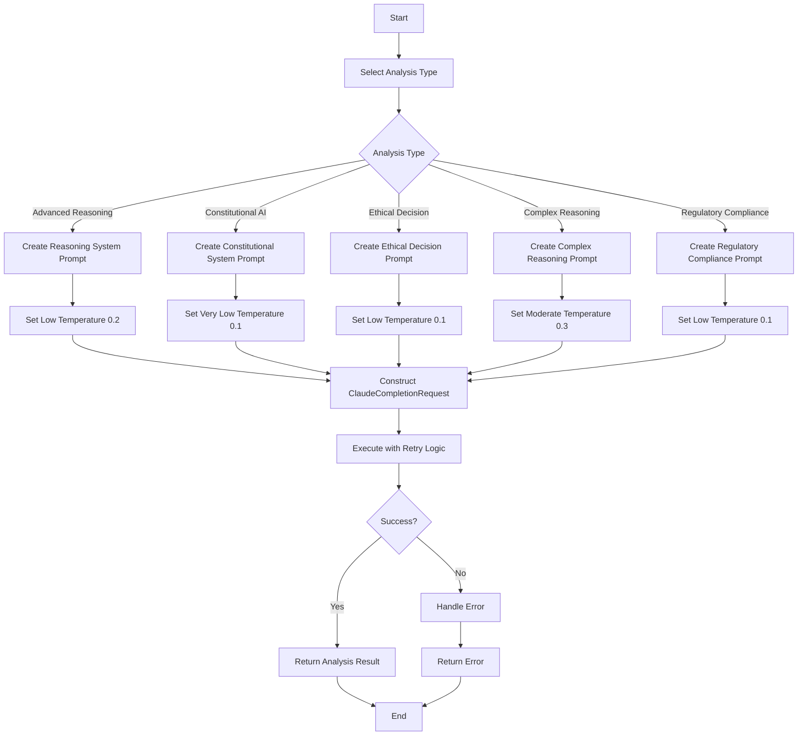
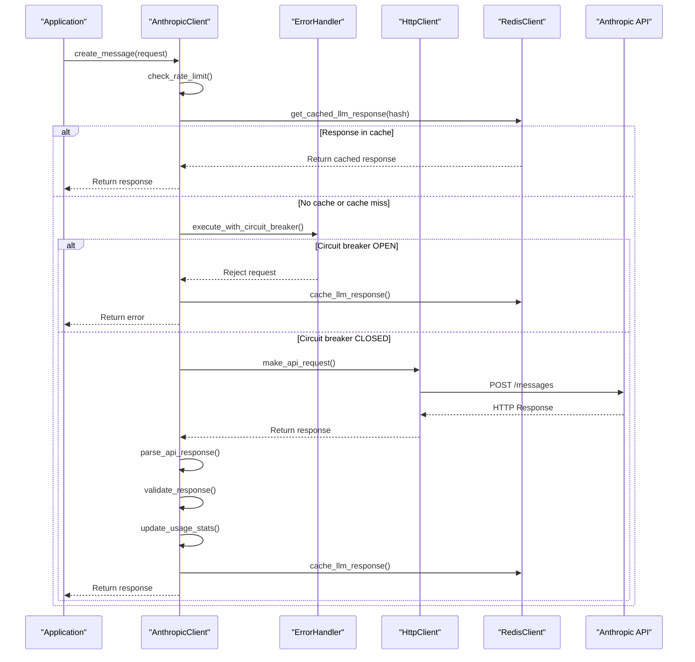
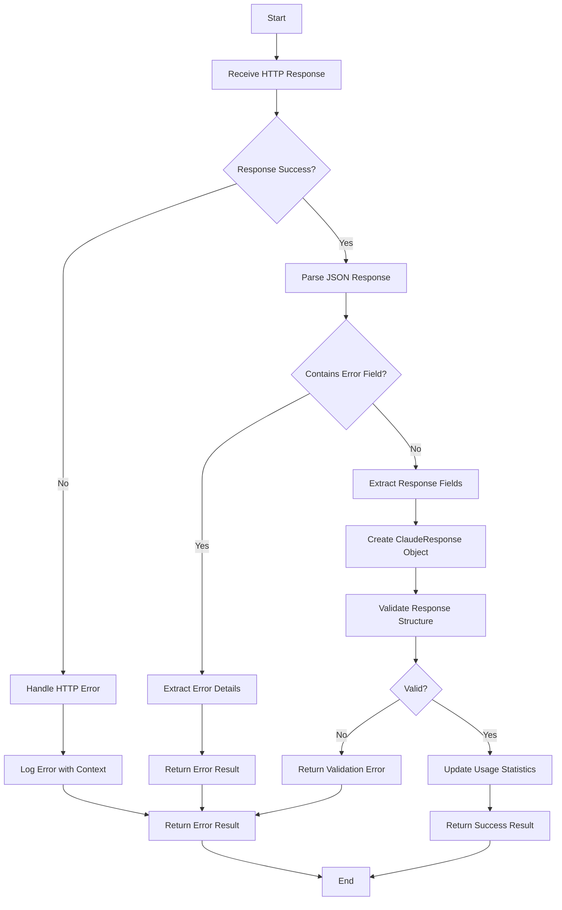
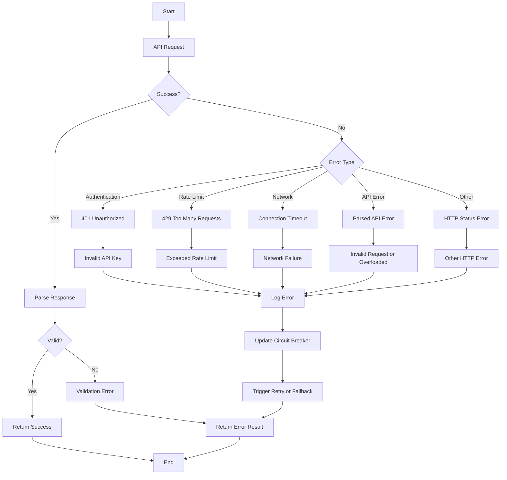
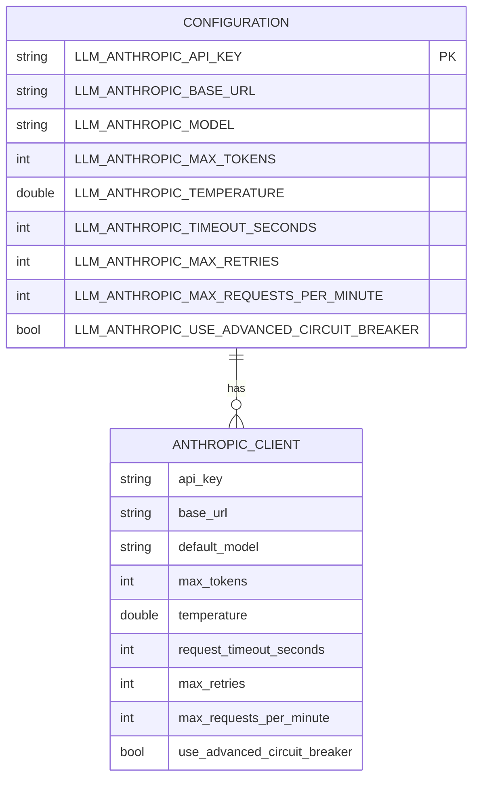

# Anthropic Client

<cite>
**Referenced Files in This Document**   
- [anthropic_client.hpp](file://shared/llm/anthropic_client.hpp)
- [anthropic_client.cpp](file://shared/llm/anthropic_client.cpp)
- [configuration_manager.hpp](file://shared/config/configuration_manager.hpp)
- [structured_logger.hpp](file://shared/logging/structured_logger.hpp)
- [error_handler.hpp](file://shared/error_handler.hpp)
- [http_client.hpp](file://shared/network/http_client.hpp)
- [streaming_handler.hpp](file://shared/llm/streaming_handler.hpp)
- [circuit_breaker.hpp](file://shared/resilience/circuit_breaker.hpp)
</cite>

## Table of Contents
1. [Introduction](#introduction)
2. [Class Structure and Initialization](#class-structure-and-initialization)
3. [Core Functionality](#core-functionality)
4. [HTTP Request Handling and Resilience](#http-request-handling-and-resilience)
5. [System Prompt Strategies](#system-prompt-strategies)
6. [Response Parsing and Validation](#response-parsing-and-validation)
7. [Common Issues and Error Handling](#common-issues-and-error-handling)
8. [Usage Tracking and Cost Estimation](#usage-tracking-and-cost-estimation)
9. [Retry Mechanism](#retry-mechanism)
10. [Configuration Options](#configuration-options)
11. [Conclusion](#conclusion)

## Introduction

The Anthropic Client implementation in the Regulens project provides a production-grade integration with Anthropic's Claude API, designed for advanced reasoning, constitutional AI analysis, and ethical decision-making in regulatory and compliance contexts. This comprehensive client library offers robust features including streaming responses, sophisticated error handling, rate limiting, circuit breaker patterns, and detailed usage tracking.

Built with enterprise-grade reliability in mind, the client follows a modular architecture that leverages dependency injection for key components like configuration management, structured logging, and error handling. The implementation supports multiple analysis modes including constitutional AI compliance, ethical decision analysis, and complex reasoning tasks, making it particularly suited for financial compliance and regulatory applications.

The client's design emphasizes resilience through multiple layers of protection, including exponential backoff retry mechanisms, circuit breakers, and comprehensive error reporting. It also provides detailed cost estimation based on token usage and model selection, enabling organizations to monitor and optimize their LLM usage effectively.

**Section sources**
- [anthropic_client.hpp](file://shared/llm/anthropic_client.hpp#L1-L578)
- [anthropic_client.cpp](file://shared/llm/anthropic_client.cpp#L1-L1143)

## Class Structure and Initialization

The AnthropicClient class follows a dependency injection pattern, accepting key services through its constructor: ConfigurationManager for configuration management, StructuredLogger for logging, and ErrorHandler for error handling and resilience. This design promotes loose coupling and testability, allowing these dependencies to be easily mocked or replaced in different environments.

The initialization process begins by loading configuration from environment variables or defaults, including the API key, base URL, default model, maximum tokens, temperature, request timeout, maximum retries, and rate limiting parameters. The client validates that essential configuration like the API key and base URL are present before proceeding. It also initializes a Redis client for response caching if available, enhancing performance by serving repeated requests from cache.

The constructor establishes dependencies on HttpClient for API communication, StreamingResponseHandler for handling streaming responses, and RedisClient for caching. Atomic counters track usage statistics including total requests, successful and failed requests, input and output tokens, and estimated costs. The initialization process is designed to be idempotent and includes comprehensive error handling to ensure the client can fail gracefully if configuration is incomplete.

```mermaid
classDiagram
class AnthropicClient {
+std : : shared_ptr~ConfigurationManager~ config_manager_
+std : : shared_ptr~StructuredLogger~ logger_
+std : : shared_ptr~ErrorHandler~ error_handler_
+std : : shared_ptr~HttpClient~ http_client_
+std : : shared_ptr~StreamingResponseHandler~ streaming_handler_
+std : : shared_ptr~RedisClient~ redis_client_
+std : : string api_key_
+std : : string base_url_
+std : : string default_model_
+int max_tokens_
+double temperature_
+int request_timeout_seconds_
+int max_retries_
+int max_requests_per_minute_
+std : : atomic~size_t~ total_requests_
+std : : atomic~size_t~ successful_requests_
+std : : atomic~size_t~ failed_requests_
+std : : atomic~size_t~ total_input_tokens_
+std : : atomic~size_t~ total_output_tokens_
+std : : atomic~double~ estimated_cost_usd_
+std : : chrono : : system_clock : : time_point last_request_time_
+std : : mutex rate_limit_mutex_
+std : : deque~std : : chrono : : system_clock : : time_point~ request_timestamps_
+static constexpr const char* CIRCUIT_BREAKER_SERVICE
+AnthropicClient(std : : shared_ptr~ConfigurationManager~, std : : shared_ptr~StructuredLogger~, std : : shared_ptr~ErrorHandler~)
+~AnthropicClient()
+bool initialize()
+void shutdown()
+std : : optional~ClaudeResponse~ create_message(ClaudeCompletionRequest&)
+std : : optional~std : : shared_ptr~StreamingSession~~ create_streaming_message(ClaudeCompletionRequest&, StreamingCallback, CompletionCallback)
+std : : optional~std : : string~ advanced_reasoning_analysis(std : : string&, std : : string&, std : : string&)
+std : : optional~std : : string~ constitutional_ai_analysis(std : : string&, std : : vector~std : : string~&)
+std : : optional~std : : string~ ethical_decision_analysis(std : : string&, std : : vector~std : : string~&, std : : vector~std : : string~&, std : : vector~std : : string~&)
+std : : optional~std : : string~ complex_reasoning_task(std : : string&, nlohmann : : json&, int)
+std : : optional~std : : string~ regulatory_compliance_reasoning(std : : string&, std : : string&, std : : vector~std : : string~&)
+nlohmann : : json get_usage_statistics()
+nlohmann : : json get_health_status()
+bool is_healthy() const
+void reset_usage_counters()
+const std : : string& get_model() const
+int get_max_tokens() const
+double get_temperature() const
+std : : string generate_prompt_hash(const ClaudeCompletionRequest&)
+double calculate_prompt_complexity(const ClaudeCompletionRequest&)
+std : : optional~HttpResponse~ make_api_request(const nlohmann : : json&)
+std : : optional~ClaudeResponse~ parse_api_response(const HttpResponse&)
+void handle_api_error(const std : : string&, const std : : string&, const std : : unordered_map~std : : string, std : : string~&)
+bool check_rate_limit()
+void update_usage_stats(const ClaudeResponse&)
+double calculate_cost(const std : : string&, int, int)
+std : : string create_constitutional_system_prompt(const std : : string&)
+std : : string create_reasoning_system_prompt(const std : : string&)
+bool validate_response(const ClaudeResponse&)
+std : : optional~ClaudeResponse~ execute_with_retry(std : : function~std : : optional~ClaudeResponse~()>, const std : : string&)
+void load_configuration()
+std : : string generate_request_id() const
}
class ConfigurationManager {
+std : : shared_ptr~ConfigurationManager~ config_manager_
+std : : shared_ptr~StructuredLogger~ logger_
+std : : shared_ptr~ErrorHandler~ error_handler_
+std : : shared_ptr~HttpClient~ http_client_
+std : : shared_ptr~StreamingResponseHandler~ streaming_handler_
+std : : shared_ptr~RedisClient~ redis_client_
}
class StructuredLogger {
+std : : shared_ptr~ConfigurationManager~ config_manager_
+std : : shared_ptr~StructuredLogger~ logger_
+std : : shared_ptr~ErrorHandler~ error_handler_
+std : : shared_ptr~HttpClient~ http_client_
+std : : shared_ptr~StreamingResponseHandler~ streaming_handler_
+std : : shared_ptr~RedisClient~ redis_client_
}
class ErrorHandler {
+std : : shared_ptr~ConfigurationManager~ config_manager_
+std : : shared_ptr~StructuredLogger~ logger_
+std : : shared_ptr~ErrorHandler~ error_handler_
+std : : shared_ptr~HttpClient~ http_client_
+std : : shared_ptr~StreamingResponseHandler~ streaming_handler_
+std : : shared_ptr~RedisClient~ redis_client_
}
class HttpClient {
+std : : shared_ptr~ConfigurationManager~ config_manager_
+std : : shared_ptr~StructuredLogger~ logger_
+std : : shared_ptr~ErrorHandler~ error_handler_
+std : : shared_ptr~HttpClient~ http_client_
+std : : shared_ptr~StreamingResponseHandler~ streaming_handler_
+std : : shared_ptr~RedisClient~ redis_client_
}
class StreamingResponseHandler {
+std : : shared_ptr~ConfigurationManager~ config_manager_
+std : : shared_ptr~StructuredLogger~ logger_
+std : : shared_ptr~ErrorHandler~ error_handler_
+std : : shared_ptr~HttpClient~ http_client_
+std : : shared_ptr~StreamingResponseHandler~ streaming_handler_
+std : : shared_ptr~RedisClient~ redis_client_
}
class RedisClient {
+std : : shared_ptr~ConfigurationManager~ config_manager_
+std : : shared_ptr~StructuredLogger~ logger_
+std : : shared_ptr~ErrorHandler~ error_handler_
+std : : shared_ptr~HttpClient~ http_client_
+std : : shared_ptr~StreamingResponseHandler~ streaming_handler_
+std : : shared_ptr~RedisClient~ redis_client_
}
AnthropicClient --> ConfigurationManager : "depends on"
AnthropicClient --> StructuredLogger : "depends on"
AnthropicClient --> ErrorHandler : "depends on"
AnthropicClient --> HttpClient : "uses"
AnthropicClient --> StreamingResponseHandler : "uses"
AnthropicClient --> RedisClient : "uses"
```



**Diagram sources**
- [anthropic_client.hpp](file://shared/llm/anthropic_client.hpp#L1-L578)
- [anthropic_client.cpp](file://shared/llm/anthropic_client.cpp#L1-L1143)

**Section sources**
- [anthropic_client.hpp](file://shared/llm/anthropic_client.hpp#L1-L578)
- [anthropic_client.cpp](file://shared/llm/anthropic_client.cpp#L1-L1143)

## Core Functionality

The Anthropic Client provides several specialized analysis methods that leverage Claude's capabilities for advanced reasoning tasks. The `advanced_reasoning_analysis` method employs a structured system prompt that guides the model to break down complex problems, consider multiple perspectives, apply logical reasoning, acknowledge uncertainties, and provide actionable insights. This method uses a low temperature setting (0.2) to ensure consistent and focused reasoning.

The `constitutional_ai_analysis` method implements constitutional AI principles by enforcing compliance with legal and regulatory requirements, ethical standards, safety and security considerations, transparency, accountability, and fairness. The system prompt explicitly requires the model to consider these principles when analyzing content, making it particularly valuable for compliance and risk assessment scenarios. This method uses an even lower temperature (0.1) to ensure highly consistent and reliable analysis.

The `ethical_decision_analysis` method applies constitutional AI principles to decision-making scenarios, requiring the model to consider autonomy, beneficence, non-maleficence, justice, and transparency. It structures the analysis to identify stakeholders, apply constitutional principles to each option, consider short and long-term consequences, and recommend the most ethically sound course of action. This method is designed for complex ethical dilemmas where multiple options must be evaluated against a framework of ethical principles.

The `complex_reasoning_task` method decomposes problems into fundamental components, establishes clear reasoning steps with logical progression, considers alternative hypotheses, integrates multiple data sources, and provides probabilistic assessments when certainty is limited. It requires the model to present its response with numbered reasoning steps and a final synthesis of findings, ensuring transparency in the reasoning process.

The `regulatory_compliance_reasoning` method focuses on legal accuracy, practical application, risk assessment, documentation requirements, and continuous compliance monitoring. It provides comprehensive regulatory analysis that includes clear interpretation of requirements, practical implementation guidance, risk mitigation recommendations, and suggestions for ongoing compliance monitoring.

All these methods follow a consistent pattern of creating a specialized system prompt, constructing a request with appropriate parameters, and using the client's resilience mechanisms to ensure reliable execution.



**Diagram sources**
- [anthropic_client.cpp](file://shared/llm/anthropic_client.cpp#L243-L582)

**Section sources**
- [anthropic_client.hpp](file://shared/llm/anthropic_client.hpp#L1-L578)
- [anthropic_client.cpp](file://shared/llm/anthropic_client.cpp#L1-L1143)

## HTTP Request Handling and Resilience

The Anthropic Client implements a comprehensive resilience strategy for handling HTTP requests to the Anthropic API. At the foundation is the HttpClient class, which provides production-grade HTTP capabilities including HTTPS support, custom headers, timeouts, and proper error handling. The client uses this to make POST requests to the Anthropic API endpoint with appropriate headers including the API key, Anthropic version, and content type.

Rate limiting is implemented through a sliding window algorithm that tracks request timestamps in a deque. The client checks if the number of requests within the current minute exceeds the configured maximum (default 50) before making a new request. This prevents the client from overwhelming the API and receiving rate limit errors.

The circuit breaker pattern is implemented through integration with the ErrorHandler component, which can use either a basic or advanced circuit breaker based on configuration. When the circuit breaker is open, requests are rejected immediately without contacting the API, preventing cascading failures. The client can be configured to use the advanced circuit breaker for more sophisticated failure detection and recovery.

The retry mechanism with exponential backoff is implemented in the `execute_with_retry` method, which attempts the operation up to a configurable number of times (default 3) with increasing delays between attempts. The delay starts at 1 second and doubles with each attempt (2, 4, 8 seconds), providing time for transient issues to resolve while avoiding overwhelming the API with rapid retries.

Caching is implemented using Redis to store responses for identical requests, improving performance and reducing API costs. The client generates a SHA-256 hash of the request content to use as a cache key, and stores the response along with usage statistics. Cache entries are assigned a TTL based on prompt complexity, with more complex prompts receiving longer cache durations.



**Diagram sources**
- [anthropic_client.cpp](file://shared/llm/anthropic_client.cpp#L497-L700)
- [http_client.hpp](file://shared/network/http_client.hpp#L1-L227)

**Section sources**
- [anthropic_client.hpp](file://shared/llm/anthropic_client.hpp#L1-L578)
- [anthropic_client.cpp](file://shared/llm/anthropic_client.cpp#L1-L1143)

## System Prompt Strategies

The Anthropic Client employs specialized system prompt strategies for different types of analysis tasks, particularly for constitutional AI and advanced reasoning. These system prompts are designed to guide the model's behavior and ensure consistent, reliable outputs that align with organizational requirements.

For constitutional AI analysis, the client uses three distinct system prompts based on the task type: compliance, ethical decision-making, and regulatory compliance. The compliance prompt requires the model to ensure all analysis adheres to legal and regulatory requirements, ethical standards, safety and security considerations, accountability, and beneficence. It structures the analysis to include identification of relevant principles, assessment of compliance, recommendations for improvement, and clear reasoning.

The ethical decision-making prompt applies constitutional principles including autonomy, beneficence, non-maleficence, justice, and transparency. It requires the model to identify stakeholders, apply principles to each option, consider consequences, and recommend the most ethically sound course of action. This prompt is particularly valuable for complex ethical dilemmas in regulatory and financial contexts.

For advanced reasoning tasks, the client uses system prompts that guide the model to break down complex problems, consider multiple perspectives, apply logical reasoning, acknowledge uncertainties, and provide actionable insights. The complex reasoning prompt specifically requires the model to decompose problems, establish clear reasoning steps, consider alternative hypotheses, integrate multiple data sources, and provide probabilistic assessments when appropriate.

These system prompts are implemented as static const maps within the client, allowing for easy extension and modification. They use raw string literals (R"(...)") to preserve formatting and include detailed instructions that shape the model's behavior. The prompts are selected based on the analysis type parameter and can be extended to support additional specialized analysis modes as needed.

```mermaid
classDiagram
class AnthropicClient {
+std : : string create_constitutional_system_prompt(const std : : string&)
+std : : string create_reasoning_system_prompt(const std : : string&)
}
class ConstitutionalSystemPrompts {
+compliance : "You are Claude... For compliance analysis, you must ensure all interpretations and recommendations align with : 1. Legal Accuracy 2. Practical Application 3. Risk Assessment 4. Documentation 5. Continuous Compliance"
+ethical_decision : "You are Claude... For ethical decision analysis, you must apply constitutional AI principles : 1. Autonomy 2. Beneficence 3. Non-maleficence 4. Justice 5. Transparency"
+regulatory_compliance : "You are Claude... For regulatory compliance analysis, you must ensure all interpretations and recommendations align with : 1. Legal Accuracy 2. Practical Application 3. Risk Assessment 4. Documentation 5. Continuous Compliance"
}
class ReasoningSystemPrompts {
+general : "You are Claude... For reasoning tasks, you should : 1. Break down complex problems 2. Consider multiple perspectives 3. Apply logical reasoning 4. Acknowledge uncertainties 5. Provide actionable insights"
+complex_reasoning : "You are Claude... For complex reasoning tasks, you must : 1. Decompose the problem 2. Establish clear reasoning steps 3. Consider alternative hypotheses 4. Integrate multiple data sources 5. Provide probabilistic assessments 6. Draw well-supported conclusions"
+analysis : "You are Claude... For analytical reasoning, you should : 1. Systematically examine data 2. Identify patterns 3. Apply analytical frameworks 4. Consider contextual factors 5. Provide evidence-based conclusions"
}
AnthropicClient --> ConstitutionalSystemPrompts : "contains"
AnthropicClient --> ReasoningSystemPrompts : "contains"
```



**Diagram sources**
- [anthropic_client.cpp](file://shared/llm/anthropic_client.cpp#L676-L868)

**Section sources**
- [anthropic_client.hpp](file://shared/llm/anthropic_client.hpp#L1-L578)
- [anthropic_client.cpp](file://shared/llm/anthropic_client.cpp#L1-L1143)

## Response Parsing and Validation

The Anthropic Client implements a robust response parsing and validation mechanism to ensure the integrity and reliability of API responses. The `parse_api_response` method handles the deserialization of JSON responses from the Anthropic API, extracting key fields such as the response ID, type, role, model, content, stop reason, and usage statistics.

The parsing process begins by checking for empty response bodies and attempting to parse the JSON content. If the response contains an error field, the method extracts the error type and message and returns an appropriate error result. For successful responses, it constructs a ClaudeResponse object by populating its fields from the JSON data.

The `validate_response` method performs structural validation to ensure the response contains essential elements like a non-empty ID and at least one content item with text. This validation prevents the propagation of malformed or incomplete responses to the application layer.

The client also handles streaming responses through the StreamingResponseHandler, which parses Server-Sent Events (SSE) format data and processes individual events as they arrive. The SSEParser class extracts complete events from data chunks, handling the event, data, and retry fields according to the SSE specification.

The StreamingAccumulator class collects streaming events and builds up the complete response incrementally, allowing applications to process partial results in real-time while ensuring the final response is properly formatted and validated. This enables real-time interaction with the model while maintaining data integrity.

Error handling is integrated throughout the parsing process, with detailed context captured for each error, including the response body (truncated to 200 characters for security), status code, and other relevant information. This comprehensive error reporting enables effective troubleshooting and monitoring.



**Diagram sources**
- [anthropic_client.cpp](file://shared/llm/anthropic_client.cpp#L701-L798)
- [streaming_handler.hpp](file://shared/llm/streaming_handler.hpp#L1-L352)

**Section sources**
- [anthropic_client.hpp](file://shared/llm/anthropic_client.hpp#L1-L578)
- [anthropic_client.cpp](file://shared/llm/anthropic_client.cpp#L1-L1143)

## Common Issues and Error Handling

The Anthropic Client implements comprehensive error handling to address common issues that may arise during API interactions. Authentication failures are detected when the API returns a 401 Unauthorized status code, typically indicating an invalid or missing API key. The client logs detailed error information and reports the error through the ErrorHandler component for monitoring and alerting.

Rate limiting issues are handled through both proactive and reactive mechanisms. Proactively, the client implements client-side rate limiting using a sliding window algorithm that tracks request timestamps and prevents excessive requests. Reactively, when the API returns a 429 Too Many Requests status code, the client logs the error, updates the circuit breaker state, and may trigger fallback mechanisms.

Response validation issues are addressed through the `validate_response` method, which checks for essential response elements like a non-empty ID and content. If validation fails, the client logs a detailed error with context and returns an appropriate error result. This prevents malformed responses from propagating to the application layer.

Network errors, including connection timeouts and DNS resolution failures, are caught and handled by the HttpClient component. These errors are reported to the ErrorHandler, which may trigger circuit breaker state changes to prevent cascading failures. The retry mechanism with exponential backoff helps recover from transient network issues.

The client also handles API-specific errors by parsing the error field in API responses and extracting the error type and message. Common error types include "invalid_request_error" for malformed requests and "overloaded_error" when the API is temporarily unavailable. These errors are logged with full context and may trigger appropriate recovery actions.

The ErrorHandler component provides a unified interface for error reporting, with methods to create specialized error types for database, network, API, and timeout scenarios. It maintains error history, performs pattern analysis, and can trigger alerts based on error severity and frequency.



**Diagram sources**
- [anthropic_client.cpp](file://shared/llm/anthropic_client.cpp#L799-L950)
- [error_handler.hpp](file://shared/error_handler.hpp#L1-L569)

**Section sources**
- [anthropic_client.hpp](file://shared/llm/anthropic_client.hpp#L1-L578)
- [anthropic_client.cpp](file://shared/llm/anthropic_client.cpp#L1-L1143)

## Usage Tracking and Cost Estimation

The Anthropic Client provides comprehensive usage tracking and cost estimation features to help organizations monitor and optimize their LLM usage. The client maintains atomic counters for various metrics including total requests, successful and failed requests, input tokens, output tokens, and estimated costs in USD.

The `get_usage_statistics` method returns a JSON object containing these metrics along with derived values such as success rate and total tokens. This information is valuable for monitoring system health, identifying performance issues, and understanding usage patterns over time.

Cost estimation is implemented in the `calculate_cost` method, which uses a static map of pricing information for different Anthropic models. The pricing data includes input and output costs per 1,000 tokens for models like claude-3-opus, claude-3-sonnet, claude-3-haiku, and older models. The method calculates the cost by multiplying the number of tokens by the appropriate price per 1,000 tokens and summing the input and output costs.

The client updates usage statistics in the `update_usage_stats` method, which is called after each successful API response. It increments the input and output token counters and adds the calculated cost to the running total. This ensures that cost estimates are accurate and up-to-date.

The client tracks input and output tokens separately, recognizing that they have different costs in the Anthropic pricing model. This granular tracking allows for more accurate cost estimation and better understanding of usage patterns. For example, applications that generate long responses will have higher output token counts, while those that process large amounts of input will have higher input token counts.

Usage counters can be reset using the `reset_usage_counters` method, which is useful for testing or when starting a new billing period. The client logs when counters are reset for audit purposes.

```mermaid
classDiagram
class AnthropicClient {
+std : : atomic~size_t~ total_requests_
+std : : atomic~size_t~ successful_requests_
+std : : atomic~size_t~ failed_requests_
+std : : atomic~size_t~ total_input_tokens_
+std : : atomic~size_t~ total_output_tokens_
+std : : atomic~double~ estimated_cost_usd_
+nlohmann : : json get_usage_statistics()
+void reset_usage_counters()
+double calculate_cost(const std : : string&, int, int)
+void update_usage_stats(const ClaudeResponse&)
}
class PricingModel {
+claude-3-opus-20240229 : {15.0, 75.0}
+claude-3-sonnet-20240229 : {3.0, 15.0}
+claude-3-haiku-20240307 : {0.25, 1.25}
+claude-3-5-sonnet-20240620 : {3.0, 15.0}
+claude-2.1 : {8.0, 24.0}
+claude-2 : {8.0, 24.0}
+claude-instant-1.2 : {0.8, 2.4}
}
class UsageTracking {
+Total Requests
+Successful Requests
+Failed Requests
+Input Tokens
+Output Tokens
+Estimated Cost
+Success Rate
}
AnthropicClient --> PricingModel : "uses for cost calculation"
AnthropicClient --> UsageTracking : "tracks"
```

**Diagram sources**
- [anthropic_client.cpp](file://shared/llm/anthropic_client.cpp#L497-L700)

**Section sources**
- [anthropic_client.hpp](file://shared/llm/anthropic_client.hpp#L1-L578)
- [anthropic_client.cpp](file://shared/llm/anthropic_client.cpp#L1-L1143)

## Retry Mechanism

The Anthropic Client implements a robust retry mechanism with exponential backoff to enhance reliability and recover from transient failures. The `execute_with_retry` method serves as the core of this mechanism, wrapping API operations in a retry loop that attempts the operation multiple times before giving up.

The retry process begins by attempting the operation and checking if it was successful. If the operation fails, the client waits for a delay period before retrying. The delay starts at a base value (1 second) and doubles with each subsequent attempt, following an exponential backoff pattern (1s, 2s, 4s, etc.). This approach allows time for transient issues to resolve while avoiding overwhelming the API with rapid retries.

The maximum number of retry attempts is configurable through the `LLM_ANTHROPIC_MAX_RETRIES` environment variable, with a default of 3 attempts. This means the client will make up to 4 total attempts (the initial attempt plus 3 retries) before failing permanently.

The retry mechanism is integrated with the circuit breaker pattern, so if the circuit breaker is open, retries are not attempted as the service is considered unavailable. This prevents wasted attempts when the underlying issue is not transient.

The client logs retry attempts at the warning level, providing visibility into retry activity without cluttering the logs with excessive information. The log messages include the operation name, attempt number, and total number of attempts, making it easy to track retry patterns.

For streaming requests, the retry mechanism is not applied in the same way, as streaming connections are stateful and cannot be easily retried. Instead, the client relies on the circuit breaker and error handling mechanisms to manage streaming failures.

The retry mechanism is used internally by specialized analysis methods like `advanced_reasoning_analysis`, ensuring that even complex operations benefit from enhanced reliability.

```mermaid
sequenceDiagram
participant Client as "Application"
participant AnthropicClient as "AnthropicClient"
participant Operation as "API Operation"
Client->>AnthropicClient : execute_with_retry(operation)
AnthropoidClient->>AnthropoidClient : Initialize attempt = 0
loop For each attempt
AnthropoidClient->>Operation : Execute operation
alt Success
Operation-->>AnthropoidClient : Return result
AnthropoidClient-->>Client : Return result
break End
else Failure
AnthropoidClient->>AnthropoidClient : Increment attempt
alt attempt < max_retries
AnthropoidClient->>AnthropoidClient : Calculate delay = base_delay * 2^attempt
AnthropoidClient->>AnthropoidClient : Wait for delay period
else
AnthropoidClient->>AnthropoidClient : Log final failure
AnthropoidClient-->>Client : Return error
break End
end
end
end
```

**Diagram sources**
- [anthropic_client.cpp](file://shared/llm/anthropic_client.cpp#L951-L1050)

**Section sources**
- [anthropic_client.hpp](file://shared/llm/anthropic_client.hpp#L1-L578)
- [anthropic_client.cpp](file://shared/llm/anthropic_client.cpp#L1-L1143)

## Configuration Options

The Anthropic Client supports a comprehensive set of configuration options that can be set through environment variables or programmatically. These options allow fine-tuning of the client's behavior to meet specific requirements and optimize performance.

Model selection is controlled by the `LLM_ANTHROPIC_MODEL` environment variable, with a default of "claude-3-sonnet-20240229". Other available models include "claude-3-opus-20240229" for maximum capability, "claude-3-haiku-20240307" for cost efficiency, and "claude-3-5-sonnet-20240620" for the latest sonnet model. The model selection directly impacts both performance and cost, with opus being the most expensive and capable, while haiku is the most cost-effective.

Temperature is configured through `LLM_ANTHROPIC_TEMPERATURE` with a default of 0.7. This parameter controls the randomness of the model's output, with lower values (0.1-0.3) producing more deterministic and focused responses, while higher values (0.7-1.0) produce more creative and varied responses. The client automatically adjusts temperature based on the analysis type, using lower temperatures for analytical tasks and higher temperatures for creative tasks.

Timeout settings are controlled by `LLM_ANTHROPIC_TIMEOUT_SECONDS` with a default of 30 seconds. This setting determines how long the client will wait for a response from the API before timing out. For complex tasks that may take longer to process, this value can be increased to prevent premature timeouts.

Rate limiting is configured through `LLM_ANTHROPIC_MAX_REQUESTS_PER_MINUTE` with a default of 50 requests per minute. This client-side rate limiting helps prevent the client from exceeding API rate limits and receiving 429 errors.

The client also supports advanced configuration options like `LLM_ANTHROPIC_USE_ADVANCED_CIRCUIT_BREAKER` to enable enhanced circuit breaker functionality, and various Redis configuration options for response caching. Maximum tokens is set by `LLM_ANTHROPIC_MAX_TOKENS` with a default of 4096, controlling the maximum length of the model's response.



**Diagram sources**
- [anthropic_client.cpp](file://shared/llm/anthropic_client.cpp#L33-L57)
- [configuration_manager.hpp](file://shared/config/configuration_manager.hpp#L326-L328)

**Section sources**
- [anthropic_client.hpp](file://shared/llm/anthropic_client.hpp#L1-L578)
- [anthropic_client.cpp](file://shared/llm/anthropic_client.cpp#L1-L1143)

## Conclusion

The Anthropic Client implementation in the Regulens project represents a comprehensive, production-grade integration with Anthropic's Claude API. Its architecture emphasizes reliability, resilience, and ease of use, making it well-suited for demanding regulatory and compliance applications.

Key strengths of the implementation include its modular design with dependency injection, comprehensive error handling with circuit breakers and retry mechanisms, and detailed usage tracking with cost estimation. The client's support for specialized analysis modes like constitutional AI and ethical decision-making makes it particularly valuable for applications requiring high levels of reliability and ethical consistency.

The integration of Redis caching improves performance and reduces API costs by serving repeated requests from cache. The streaming response support enables real-time interaction with the model, while the structured system prompts ensure consistent and reliable outputs for different types of analysis tasks.

Configuration is flexible and can be managed through environment variables, allowing for easy deployment across different environments. The client's comprehensive logging and monitoring capabilities provide visibility into its operation, facilitating troubleshooting and performance optimization.

Overall, the Anthropic Client provides a robust foundation for building applications that leverage large language models for complex reasoning, compliance analysis, and decision support in regulated industries.

**Section sources**
- [anthropic_client.hpp](file://shared/llm/anthropic_client.hpp#L1-L578)
- [anthropic_client.cpp](file://shared/llm/anthropic_client.cpp#L1-L1143)