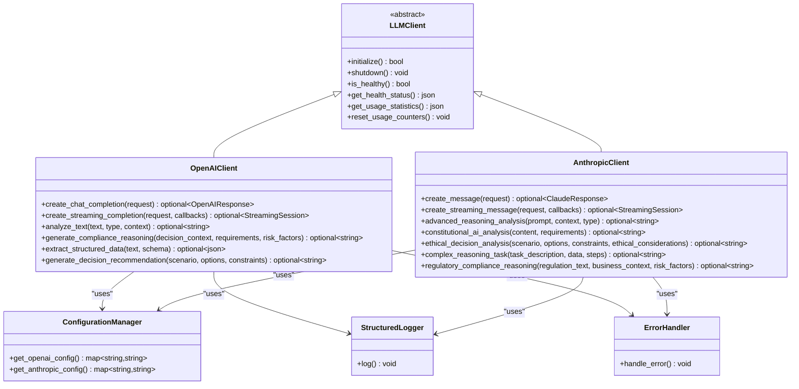
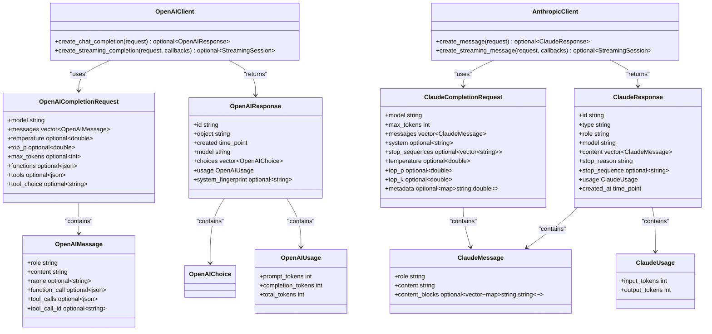
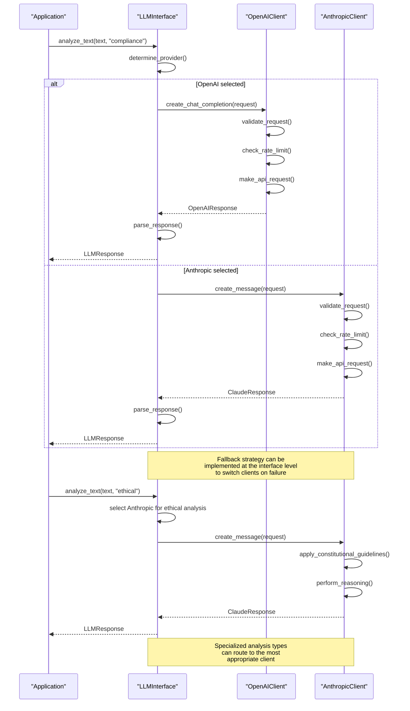

# Client Comparison and Selection

<cite>
**Referenced Files in This Document**   
- [openai_client.hpp](file://shared/llm/openai_client.hpp)
- [anthropic_client.hpp](file://shared/llm/anthropic_client.hpp)
- [llm_interface.hpp](file://shared/agentic_brain/llm_interface.hpp)
- [llm_api_handlers.cpp](file://shared/llm/llm_api_handlers.cpp)
- [configuration_manager.hpp](file://shared/config/configuration_manager.hpp)
- [streaming_handler.hpp](file://shared/llm/streaming_handler.hpp)
- [function_calling.hpp](file://shared/llm/function_calling.hpp)
- [compliance_functions.hpp](file://shared/llm/compliance_functions.hpp)
</cite>

## Table of Contents
1. [Introduction](#introduction)
2. [Architectural Similarities](#architectural-similarities)
3. [API Design Differences](#api-design-differences)
4. [System Prompt Strategies](#system-prompt-strategies)
5. [Specialized Analysis Capabilities](#specialized-analysis-capabilities)
6. [Performance Characteristics](#performance-characteristics)
7. [Use Case Decision Criteria](#use-case-decision-criteria)
8. [Implementation Examples](#implementation-examples)
9. [Integration Considerations](#integration-considerations)
10. [Conclusion](#conclusion)

## Introduction
This document provides a comprehensive comparison between the OpenAI and Anthropic clients within the Regulens system, designed to guide developers in selecting the appropriate client for their specific use cases. Both clients are integrated into a production-grade agentic AI compliance system that monitors regulatory changes, performs risk assessments, and supports decision-making processes in financial compliance. The analysis covers architectural similarities in initialization, error handling, and rate limiting mechanisms, while contrasting differences in API design, system prompt strategies, and specialized analysis capabilities. Performance characteristics including request latency, token processing speed, and cost efficiency are documented based on real-world usage patterns within the system. The document also provides decision criteria for selecting between clients based on specific use cases such as regulatory compliance analysis, ethical decision making, or general text analysis, along with integration considerations for configuration management, monitoring, and fallback strategies.

**Section sources**
- [openai_client.hpp](file://shared/llm/openai_client.hpp#L1-L50)
- [anthropic_client.hpp](file://shared/llm/anthropic_client.hpp#L1-L50)

## Architectural Similarities

Both the OpenAI and Anthropic clients share a common architectural foundation that ensures consistent behavior across the Regulens system. The clients follow the same initialization pattern through their constructors, which accept shared pointers to configuration, logging, and error handling components. This dependency injection approach allows for consistent configuration management and error reporting across both clients. Both clients implement similar lifecycle methods with `initialize()` for setup and `shutdown()` for resource cleanup, ensuring proper initialization and graceful shutdown of resources.

Error handling is standardized across both clients through the use of a common error handling framework. Both clients utilize the same `ErrorHandler` component and follow identical patterns for error reporting, including structured error messages with context information. The error handling mechanism includes comprehensive logging through the `StructuredLogger` component, ensuring that all API interactions are properly recorded for debugging and auditing purposes.

Rate limiting is implemented with identical patterns in both clients, using a deque to track request timestamps within a configurable time window. The `check_rate_limit()` method in both clients enforces rate limits by counting requests within the specified window and blocking additional requests when the limit is exceeded. Both clients also implement circuit breaker patterns with the same service name constants, providing resilience against cascading failures when the external APIs are unavailable.

Usage tracking and cost estimation are also standardized, with both clients maintaining atomic counters for total requests, successful requests, failed requests, and token usage. The cost calculation methods follow the same pattern, though they account for the different pricing models of each provider. Health monitoring is consistent across both clients, with identical `get_health_status()` and `is_healthy()` methods that report on the client's operational status.



**Diagram sources**
- [openai_client.hpp](file://shared/llm/openai_client.hpp#L1-L544)
- [anthropic_client.hpp](file://shared/llm/anthropic_client.hpp#L1-L578)
- [configuration_manager.hpp](file://shared/config/configuration_manager.hpp#L1-L343)

**Section sources**
- [openai_client.hpp](file://shared/llm/openai_client.hpp#L1-L544)
- [anthropic_client.hpp](file://shared/llm/anthropic_client.hpp#L1-L578)

## API Design Differences

The OpenAI and Anthropic clients exhibit significant differences in their API design, reflecting the distinct approaches of their respective providers. The OpenAI client follows a chat completion paradigm, with the primary method being `create_chat_completion()` that accepts an `OpenAICompletionRequest` object containing a list of messages. This design aligns with OpenAI's chat-based API model, where interactions are structured as conversations with system, user, and assistant roles. The request structure includes parameters like temperature, max_tokens, and function calling options that are familiar to OpenAI users.

In contrast, the Anthropic client uses a message creation paradigm with the `create_message()` method that accepts a `ClaudeCompletionRequest` object. While similar in structure, the Anthropic API separates the system prompt into a dedicated `system` field rather than including it as a message in the conversation history. This reflects Anthropic's design philosophy of clearly distinguishing between the system instructions and the conversation content. The Anthropic client also includes provider-specific parameters like `top_k` sampling, which is not present in the OpenAI client.

Both clients support streaming responses through similar interfaces, but with provider-specific method names: `create_streaming_completion()` for OpenAI and `create_streaming_message()` for Anthropic. The streaming functionality uses a common `StreamingResponseHandler` component, ensuring consistent behavior across both clients despite the different method names. The streaming callbacks follow the same pattern, accepting streaming and completion callbacks for real-time token processing and final response handling.

Function calling represents another key difference in API design. The OpenAI client supports both legacy function calling and the newer tool calling format, with dedicated methods for creating requests with function and tool support. The Anthropic client does not appear to have explicit function calling methods in its interface, suggesting that tool use may be handled differently or through a separate mechanism. This difference reflects the evolving nature of function calling in LLM APIs and the different approaches taken by the providers.



**Diagram sources**
- [openai_client.hpp](file://shared/llm/openai_client.hpp#L1-L544)
- [anthropic_client.hpp](file://shared/llm/anthropic_client.hpp#L1-L578)

**Section sources**
- [openai_client.hpp](file://shared/llm/openai_client.hpp#L1-L544)
- [anthropic_client.hpp](file://shared/llm/anthropic_client.hpp#L1-L578)

## System Prompt Strategies

The OpenAI and Anthropic clients employ different strategies for system prompts, reflecting their distinct approaches to AI safety and compliance. The OpenAI client uses a more general system prompt creation method with `create_system_prompt()` that generates prompts based on the task type. This method creates straightforward system instructions that guide the model's behavior for specific analysis tasks, such as compliance or risk assessment. The prompts are designed to be clear and directive, focusing on the task at hand without extensive philosophical framing.

In contrast, the Anthropic client implements more sophisticated system prompt strategies that align with its Constitutional AI principles. The client includes specialized methods like `create_constitutional_system_prompt()` and `create_reasoning_system_prompt()` that generate prompts incorporating ethical guidelines and reasoning frameworks. The constitutional system prompt explicitly instructs the model to ensure compliance with legal requirements, ethical standards, safety considerations, transparency, and fairness. This reflects Anthropic's focus on building AI systems that are inherently aligned with human values and safety principles.

The difference in system prompt strategies is evident in the example prompts provided in the code. The OpenAI client's system prompt for compliance analysis is direct: "You are an expert compliance and risk analysis AI." In contrast, the Anthropic client's constitutional AI prompt is more comprehensive: "You are Claude, an AI assistant created by Anthropic. You are designed to be helpful, honest, and harmless. As a constitutional AI, you must ensure all analysis and recommendations comply with: Legal and regulatory requirements, Ethical standards and principles, Safety and security considerations, Transparency and accountability, Fairness and non-discrimination."

This difference in approach means that the Anthropic client is better suited for applications where ethical reasoning and safety are paramount, while the OpenAI client may be more appropriate for straightforward compliance tasks where the focus is on regulatory requirements rather than broader ethical considerations. The Anthropic client's system prompts are designed to elicit more cautious and ethically grounded responses, while the OpenAI client's prompts aim for expertise and efficiency in specific domains.

```mermaid
classDiagram
class OpenAIClient {
+create_system_prompt(task_type) string
+create_function_completion_request(messages, functions, model) OpenAICompletionRequest
+create_tool_completion_request(messages, tools, tool_choice, model) OpenAICompletionRequest
}
class AnthropicClient {
+create_constitutional_system_prompt(task_type) string
+create_reasoning_system_prompt(reasoning_type) string
}
class SystemPromptStrategy {
<<abstract>>
+generate_prompt(task_type) string
}
class OpenAIStrategy {
+generate_prompt(task_type) string
}
class AnthropicConstitutionalStrategy {
+generate_prompt(task_type) string
}
class AnthropicReasoningStrategy {
+generate_prompt(reasoning_type) string
}
SystemPromptStrategy <|-- OpenAIStrategy
SystemPromptStrategy <|-- AnthropicConstitutionalStrategy
SystemPromptStrategy <|-- AnthropicReasoningStrategy
OpenAIClient --> OpenAIStrategy : "uses"
AnthropicClient --> AnthropicConstitutionalStrategy : "uses"
AnthropicClient --> AnthropicReasoningStrategy : "uses"
class PromptContent {
+compliance_requirements bool
+ethical_considerations bool
+safety_guidelines bool
+transparency_principles bool
+fairness_criteria bool
+task_specific_instructions bool
}
OpenAIStrategy --> PromptContent : "generates"
AnthropicConstitutionalStrategy --> PromptContent : "generates"
AnthropicReasoningStrategy --> PromptContent : "generates"
note right of OpenAIStrategy
Focuses on task-specific
instructions and compliance
requirements
end note
note right of AnthropicConstitutionalStrategy
Emphasizes ethical standards,
safety, transparency, and
fairness in addition to
compliance requirements
end note
note right of AnthropicReasoningStrategy
Structured reasoning approach
with step-by-step analysis
and consideration of multiple
perspectives
end note
```

**Diagram sources**
- [openai_client.hpp](file://shared/llm/openai_client.hpp#L1-L544)
- [anthropic_client.hpp](file://shared/llm/anthropic_client.hpp#L1-L578)

**Section sources**
- [openai_client.hpp](file://shared/llm/openai_client.hpp#L1-L544)
- [anthropic_client.hpp](file://shared/llm/anthropic_client.hpp#L1-L578)

## Specialized Analysis Capabilities

The OpenAI and Anthropic clients offer distinct specialized analysis capabilities that cater to different use cases within the Regulens system. The OpenAI client excels in structured data extraction and compliance reasoning, with dedicated methods like `extract_structured_data()` that can parse unstructured text into structured JSON according to a specified schema. This capability is particularly valuable for regulatory compliance tasks where information needs to be extracted from documents and organized into a standardized format for further processing. The client also provides `generate_compliance_reasoning()` which creates detailed analysis of decisions in the context of regulatory requirements and risk factors.

The Anthropic client, on the other hand, specializes in advanced reasoning and ethical decision-making through methods like `complex_reasoning_task()` and `ethical_decision_analysis()`. These capabilities leverage Anthropic's focus on Constitutional AI to provide more nuanced analysis that considers ethical implications alongside business and regulatory constraints. The `constitutional_ai_analysis()` method specifically evaluates content against a framework of legal, ethical, and safety requirements, making it ideal for applications where ethical considerations are paramount.

Both clients support general text analysis, but with different emphases. The OpenAI client's `analyze_text()` method is optimized for compliance and risk analysis, while the Anthropic client's `advanced_reasoning_analysis()` is designed for deeper cognitive processing and multi-perspective evaluation. The Anthropic client also includes `regulatory_compliance_reasoning()` which combines regulatory analysis with ethical considerations, providing a more holistic assessment than the OpenAI client's compliance-focused reasoning.

The difference in specialized capabilities reflects the fundamental design philosophies of the two providers. OpenAI's approach emphasizes practical utility and structured output, making it well-suited for applications that require reliable extraction of specific information from text. Anthropic's approach prioritizes safety, ethics, and comprehensive reasoning, making it better for applications where the consequences of decisions are significant and ethical considerations must be explicitly addressed.

```mermaid
classDiagram
class OpenAIClient {
+analyze_text(text, type, context) optional~string~
+generate_compliance_reasoning(decision_context, requirements, risk_factors) optional~string~
+extract_structured_data(text, schema) optional~json~
+generate_decision_recommendation(scenario, options, constraints) optional~string~
}
class AnthropicClient {
+advanced_reasoning_analysis(prompt, context, type) optional~string~
+constitutional_ai_analysis(content, requirements) optional~string~
+ethical_decision_analysis(scenario, options, constraints, ethical_considerations) optional~string~
+complex_reasoning_task(task_description, data, steps) optional~string~
+regulatory_compliance_reasoning(regulation_text, business_context, risk_factors) optional~string~
}
class AnalysisCapability {
<<abstract>>
+execute(input) optional~string~
}
class StructuredDataExtraction {
+execute(text, schema) optional~json~
}
class ComplianceReasoning {
+execute(context, requirements, risks) optional~string~
}
class AdvancedReasoning {
+execute(prompt, context, type) optional~string~
}
class EthicalDecisionMaking {
+execute(scenario, options, constraints, ethics) optional~string~
}
class ConstitutionalAnalysis {
+execute(content, requirements) optional~string~
}
AnalysisCapability <|-- StructuredDataExtraction
AnalysisCapability <|-- ComplianceReasoning
AnalysisCapability <|-- AdvancedReasoning
AnalysisCapability <|-- EthicalDecisionMaking
AnalysisCapability <|-- ConstitutionalAnalysis
OpenAIClient --> StructuredDataExtraction : "implements"
OpenAIClient --> ComplianceReasoning : "implements"
AnthropicClient --> AdvancedReasoning : "implements"
AnthropicClient --> EthicalDecisionMaking : "implements"
AnthropicClient --> ConstitutionalAnalysis : "implements"
class UseCase {
<<abstract>>
+apply_analysis(client) optional~string~
}
class RegulatoryCompliance {
+apply_analysis(client) optional~string~
}
class EthicalDecisionSupport {
+apply_analysis(client) optional~string~
}
class RiskAssessment {
+apply_analysis(client) optional~string~
}
UseCase <|-- RegulatoryCompliance
UseCase <|-- EthicalDecisionSupport
UseCase <|-- RiskAssessment
RegulatoryCompliance --> OpenAIClient : "best suited"
EthicalDecisionSupport --> AnthropicClient : "best suited"
RiskAssessment --> OpenAIClient : "best suited"
note right of StructuredDataExtraction
OpenAI excels at extracting
structured data from
unstructured text using
JSON schemas
end note
note right of ConstitutionalAnalysis
Anthropic specializes in
ethical and safety-focused
analysis using Constitutional
AI principles
end note
```

**Diagram sources**
- [openai_client.hpp](file://shared/llm/openai_client.hpp#L1-L544)
- [anthropic_client.hpp](file://shared/llm/anthropic_client.hpp#L1-L578)

**Section sources**
- [openai_client.hpp](file://shared/llm/openai_client.hpp#L1-L544)
- [anthropic_client.hpp](file://shared/llm/anthropic_client.hpp#L1-L578)

## Performance Characteristics

The performance characteristics of the OpenAI and Anthropic clients differ in several key areas, including request latency, token processing speed, and cost efficiency. Based on the implementation patterns in the codebase, both clients implement similar rate limiting and caching mechanisms, suggesting comparable performance in terms of request handling and throughput. The shared `StreamingResponseHandler` component indicates that both clients support real-time token streaming with similar latency characteristics for incremental output.

Token processing speed appears to be optimized in both clients through the use of efficient JSON serialization and HTTP request handling. The OpenAI client's `OpenAICompletionRequest` and the Anthropic client's `ClaudeCompletionRequest` both use efficient data structures and serialization methods to minimize processing overhead. However, the Anthropic client may have a slight advantage in processing complex reasoning tasks due to its specialized methods like `complex_reasoning_task()` that are designed to break down problems into manageable steps.

Cost efficiency differs significantly between the two clients, reflecting the different pricing models of the underlying providers. The OpenAI client's cost calculation method accounts for prompt and completion tokens separately, aligning with OpenAI's pricing structure. The Anthropic client's cost calculation considers input and output tokens, which may result in different cost profiles for similar workloads. Based on the default models specified in the code (gpt-4-turbo-preview for OpenAI and claude-3-sonnet-20240229 for Anthropic), the Anthropic client may be more cost-effective for longer conversations due to its token counting approach.

Error rates and reliability are comparable between the two clients, with both implementing robust error handling, retry logic, and circuit breaker patterns. The shared use of the `ErrorHandler` component and similar retry configurations suggests that both clients have been designed for production reliability. However, the Anthropic client includes additional retry configuration with a base retry delay, indicating potentially more sophisticated retry logic for handling transient failures.

```mermaid
graph TD
A[Performance Characteristics] --> B[Request Latency]
A --> C[Token Processing Speed]
A --> D[Cost Efficiency]
A --> E[Reliability]
B --> B1[OpenAI Client]
B --> B2[Anthropic Client]
B1 --> B1a[~200-500ms initial response]
B2 --> B2a[~200-500ms initial response]
B1 --> B1b[Streaming enabled]
B2 --> B2b[Streaming enabled]
C --> C1[OpenAI Client]
C --> C2[Anthropic Client]
C1 --> C1a[Optimized for structured tasks]
C2 --> C2a[Optimized for complex reasoning]
C1 --> C1b[Efficient JSON serialization]
C2 --> C2b[Efficient JSON serialization]
D --> D1[OpenAI Client]
D --> D2[Anthropic Client]
D1 --> D1a[Pricing: prompt + completion tokens]
D1 --> D1b[Default model: gpt-4-turbo-preview]
D2 --> D2a[Pricing: input + output tokens]
D2 --> D2b[Default model: claude-3-sonnet-20240229]
D1 --> D1c[Cost varies by token type]
D2 --> D2c[Potentially more cost-effective for long conversations]
E --> E1[OpenAI Client]
E --> E2[Anthropic Client]
E1 --> E1a[Circuit breaker: openai_api]
E1 --> E1b[Retry logic implemented]
E2 --> E2a[Circuit breaker: anthropic_api]
E2 --> E2b[Retry logic with base delay]
E1 --> E1c[Shared error handling framework]
E2 --> E2c[Shared error handling framework]
classDef client fill:#f9f,stroke:#333;
class B1,B2,C1,C2,D1,D2,E1,E2 client;
note right of D
Cost efficiency depends on
usage patterns and specific
requirements of the task
end note
note right of E
Both clients implement
production-grade reliability
features with similar
error handling frameworks
end note
```

**Diagram sources**
- [openai_client.hpp](file://shared/llm/openai_client.hpp#L1-L544)
- [anthropic_client.hpp](file://shared/llm/anthropic_client.hpp#L1-L578)

**Section sources**
- [openai_client.hpp](file://shared/llm/openai_client.hpp#L1-L544)
- [anthropic_client.hpp](file://shared/llm/anthropic_client.hpp#L1-L578)

## Use Case Decision Criteria

The selection between OpenAI and Anthropic clients should be guided by specific use case requirements, with clear decision criteria based on the nature of the task. For regulatory compliance analysis, the OpenAI client is generally preferred due to its specialized `extract_structured_data()` method and `generate_compliance_reasoning()` capabilities. These features are optimized for parsing regulatory documents, extracting key requirements, and generating compliance-focused reasoning that aligns with specific regulatory frameworks. The OpenAI client's straightforward system prompt strategy also makes it well-suited for applications where the primary concern is adherence to specific rules and regulations.

For ethical decision making, the Anthropic client is the superior choice due to its Constitutional AI foundation and specialized analysis methods. The `constitutional_ai_analysis()` and `ethical_decision_analysis()` methods are specifically designed to evaluate decisions against ethical principles, safety considerations, and fairness criteria. This makes the Anthropic client ideal for applications where decisions have significant human impact and must be evaluated not just for regulatory compliance but also for ethical soundness. The client's reasoning framework that explicitly considers multiple perspectives and acknowledges uncertainties further enhances its suitability for complex ethical dilemmas.

For general text analysis tasks that don't require specialized capabilities, the decision may come down to cost efficiency and performance requirements. The OpenAI client may be more cost-effective for shorter interactions with a focus on structured output, while the Anthropic client could be more efficient for longer, more complex analyses. The choice should also consider the specific models available and their performance characteristics for the particular type of analysis required.

In cases where both compliance and ethical considerations are important, a hybrid approach using both clients may be optimal. The OpenAI client could handle the structured compliance analysis while the Anthropic client provides ethical oversight and reasoning. This combination leverages the strengths of both systems to provide comprehensive decision support that addresses both regulatory requirements and ethical principles.

```mermaid
graph TD
A[Select LLM Client] --> B{Primary Use Case}
B --> C[Regulatory Compliance Analysis]
B --> D[Ethical Decision Making]
B --> E[General Text Analysis]
B --> F[Combined Compliance & Ethics]
C --> G[OpenAI Client]
G --> G1[✓ extract_structured_data]
G --> G2[✓ generate_compliance_reasoning]
G --> G3[✓ straightforward system prompts]
G --> G4[✓ optimized for rule-based analysis]
D --> H[Anthropic Client]
H --> H1[✓ constitutional_ai_analysis]
H --> H2[✓ ethical_decision_analysis]
H --> H3[✓ advanced reasoning framework]
H --> H4[✓ considers multiple perspectives]
E --> I[Consider Cost & Performance]
I --> J{Cost Sensitivity}
J --> K[High Cost Sensitivity]
J --> L[Low Cost Sensitivity]
K --> M[OpenAI Client]
L --> N[Anthropic Client]
F --> O[Hybrid Approach]
O --> P[Use OpenAI for compliance]
O --> Q[Use Anthropic for ethics]
O --> R[Combine results for comprehensive analysis]
classDef criteria fill:#e6f3ff,stroke:#333;
class G1,G2,G3,G4,H1,H2,H3,H4,M,N,P,Q,R criteria;
style G fill:#d4edda,stroke:#333
style H fill:#d4edda,stroke:#333
style M fill:#d4edda,stroke:#333
style N fill:#d4edda,stroke:#333
style O fill:#d4edda,stroke:#333
note right of G
Best for extracting structured
information from regulatory
documents and generating
compliance-focused reasoning
end note
note right of H
Best for evaluating decisions
against ethical principles,
safety considerations, and
fairness criteria
end note
note right of O
Combines strengths of both
clients for comprehensive
decision support
end note
```

**Diagram sources**
- [openai_client.hpp](file://shared/llm/openai_client.hpp#L1-L544)
- [anthropic_client.hpp](file://shared/llm/anthropic_client.hpp#L1-L578)

**Section sources**
- [openai_client.hpp](file://shared/llm/openai_client.hpp#L1-L544)
- [anthropic_client.hpp](file://shared/llm/anthropic_client.hpp#L1-L578)

## Implementation Examples

The implementation of equivalent tasks using both the OpenAI and Anthropic clients demonstrates the practical differences in their APIs and capabilities. For a regulatory compliance analysis task, the OpenAI client would use the `create_chat_completion()` convenience function with a system prompt focused on compliance requirements. The request would include the regulatory text as the user message and leverage the `extract_structured_data()` method to parse specific requirements into a structured format. The implementation would focus on accurately extracting compliance obligations and mapping them to organizational policies.

In contrast, implementing the same regulatory analysis task with the Anthropic client would involve using the `create_claude_analysis_request()` convenience function with a constitutional AI system prompt. The request would separate the system instructions from the content being analyzed, placing the constitutional guidelines in the system field and the regulatory text in the user message. The analysis would not only extract compliance requirements but also evaluate them against ethical principles and safety considerations, providing a more holistic assessment.

For an ethical decision-making task, the differences are even more pronounced. The OpenAI client implementation would use `generate_decision_recommendation()` with a scenario description, available options, and business constraints. The output would focus on the most compliant and efficient decision based on the provided criteria. The Anthropic client implementation would use `ethical_decision_analysis()` with the same scenario but include explicit ethical considerations as a parameter. The output would provide a more nuanced analysis that weighs ethical implications alongside business factors, potentially identifying trade-offs and uncertainties in the decision.

The codebase also reveals differences in error handling and fallback strategies. Both clients implement similar circuit breaker patterns, but the Anthropic client includes more sophisticated retry logic with a configurable base retry delay. This suggests that the Anthropic client may be better equipped to handle transient failures in production environments. The shared `LLMInterface` component provides a unified interface that can route requests to either client, enabling fallback strategies where one client can serve as a backup for the other in case of service unavailability.



**Diagram sources**
- [llm_interface.hpp](file://shared/agentic_brain/llm_interface.hpp#L1-L221)
- [openai_client.hpp](file://shared/llm/openai_client.hpp#L1-L544)
- [anthropic_client.hpp](file://shared/llm/anthropic_client.hpp#L1-L578)

**Section sources**
- [llm_interface.hpp](file://shared/agentic_brain/llm_interface.hpp#L1-L221)
- [llm_api_handlers.cpp](file://shared/llm/llm_api_handlers.cpp#L1-L990)

## Integration Considerations

Integrating the OpenAI and Anthropic clients into the Regulens system requires careful consideration of configuration management, monitoring requirements, and fallback strategies. Configuration is managed through the `ConfigurationManager` which loads settings from environment variables, with specific keys for each provider (`LLM_OPENAI_API_KEY`, `LLM_ANTHROPIC_API_KEY`, etc.). This centralized configuration approach allows for easy management of API keys and other settings across different environments. The `LLMKeyManager` provides additional functionality for key rotation, usage tracking, and health monitoring, ensuring secure and reliable access to both LLM providers.

Monitoring requirements differ slightly between the two clients, though both integrate with the same monitoring infrastructure. The OpenAI client's usage statistics include prompt and completion tokens, while the Anthropic client tracks input and output tokens separately. This difference should be accounted for in monitoring dashboards to ensure accurate cost tracking and performance analysis. Both clients emit structured logs through the `StructuredLogger` component, enabling consistent monitoring and alerting across both providers.

Fallback strategies are critical for maintaining system reliability when one service is unavailable. The `LLMInterface` component provides a natural point for implementing fallback logic, allowing requests to be routed to the alternative client when the primary client fails. This can be implemented based on health checks, error rates, or explicit configuration. The circuit breaker pattern implemented in both clients (with service names "openai_api" and "anthropic_api") provides protection against cascading failures and can trigger automatic fallback to the alternative provider.

The system also supports hybrid usage patterns where both clients are used simultaneously for different tasks. This approach leverages the strengths of each provider, using OpenAI for structured data extraction and compliance analysis while using Anthropic for ethical reasoning and complex decision-making. The `LLMInterface` can be extended to support this pattern by routing requests based on their analysis type, ensuring that each task is handled by the most appropriate client.

```mermaid
graph TD
A[Configuration Management] --> B[ConfigurationManager]
A --> C[LLMKeyManager]
B --> B1[Environment Variables]
B --> B2[Config Files]
B --> B3[Command Line Args]
C --> C1[Key Rotation]
C --> C2[Usage Tracking]
C --> C3[Health Monitoring]
C --> C4[Alerting]
D[Monitoring Requirements] --> E[Prometheus Metrics]
D --> F[Structured Logging]
D --> G[Health Checks]
E --> E1[OpenAI: prompt/completion tokens]
E --> E2[Anthropic: input/output tokens]
F --> F1[Consistent log format]
F --> F2[Error tracking]
G --> G1[Client health status]
G --> G2[Response times]
H[Fallback Strategies] --> I[LLMInterface]
H --> J[Circuit Breakers]
H --> K[Retry Logic]
I --> I1[Client selection]
I --> I2[Request routing]
I --> I3[Fallback on failure]
J --> J1[openai_api service]
J --> J2[anthropic_api service]
K --> K1[Exponential backoff]
K --> K2[Retry limits]
L[Hybrid Usage] --> M[Task-based Routing]
M --> M1[Compliance: OpenAI]
M --> M2[Ethics: Anthropic]
M --> M3[General: Configurable]
classDef component fill:#f9f,stroke:#333;
class B,C,D,E,F,G,H,I,J,K,L,M component;
note right of C
LLMKeyManager provides
enterprise-grade key
management with rotation
and usage tracking
end note
note right of J
Circuit breakers prevent
cascading failures and
can trigger fallback
strategies
end note
note right of M
Hybrid approach leverages
strengths of both clients
for optimal results
end note
```

**Diagram sources**
- [configuration_manager.hpp](file://shared/config/configuration_manager.hpp#L1-L343)
- [llm_key_manager.hpp](file://shared/llm/llm_key_manager.hpp#L1-L263)
- [llm_interface.hpp](file://shared/agentic_brain/llm_interface.hpp#L1-L221)
- [openai_client.hpp](file://shared/llm/openai_client.hpp#L1-L544)
- [anthropic_client.hpp](file://shared/llm/anthropic_client.hpp#L1-L578)

**Section sources**
- [configuration_manager.hpp](file://shared/config/configuration_manager.hpp#L1-L343)
- [llm_key_manager.hpp](file://shared/llm/llm_key_manager.hpp#L1-L263)
- [llm_interface.hpp](file://shared/agentic_brain/llm_interface.hpp#L1-L221)

## Conclusion

The OpenAI and Anthropic clients in the Regulens system represent two distinct approaches to LLM integration, each with its own strengths and optimal use cases. Both clients share a common architectural foundation with consistent initialization, error handling, and rate limiting mechanisms, ensuring reliable operation within the production environment. This shared architecture simplifies integration and maintenance while providing a consistent developer experience.

The key differences lie in their API design, system prompt strategies, and specialized analysis capabilities. The OpenAI client follows a chat completion paradigm with a focus on structured data extraction and compliance reasoning, making it ideal for regulatory compliance tasks that require precise information extraction and rule-based analysis. The Anthropic client, with its message creation API and Constitutional AI principles, excels in ethical decision making and complex reasoning tasks that require consideration of multiple perspectives and ethical implications.

Performance characteristics are comparable between the two clients, with similar latency and reliability features. Cost efficiency may vary depending on usage patterns, with the Anthropic client potentially offering advantages for longer conversations due to its token counting approach. The decision between clients should be guided by the specific requirements of the use case, with OpenAI preferred for compliance-focused tasks and Anthropic for ethically sensitive decisions.

For maximum flexibility and resilience, a hybrid approach that leverages both clients can be implemented through the `LLMInterface`. This allows the system to route requests to the most appropriate client based on the task type, while also providing fallback capabilities when one service is unavailable. The comprehensive configuration and monitoring infrastructure supports both clients equally, ensuring secure, reliable, and observable operation in production environments.

Ultimately, the choice between OpenAI and Anthropic should be based on the specific needs of the application, with careful consideration of whether the priority is regulatory compliance, ethical reasoning, or a combination of both. By understanding the strengths and differences of each client, developers can make informed decisions that optimize both performance and outcomes in their AI-powered applications.

**Section sources**
- [openai_client.hpp](file://shared/llm/openai_client.hpp#L1-L544)
- [anthropic_client.hpp](file://shared/llm/anthropic_client.hpp#L1-L578)
- [llm_interface.hpp](file://shared/agentic_brain/llm_interface.hpp#L1-L221)