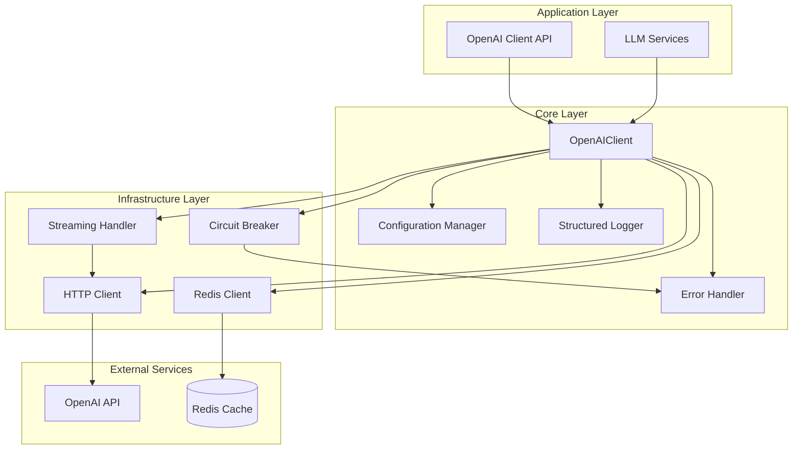
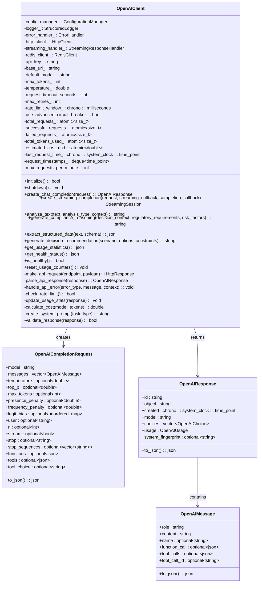
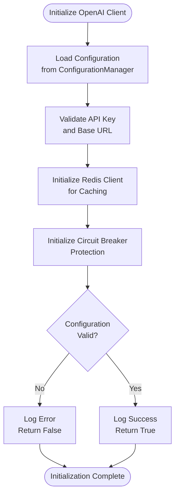
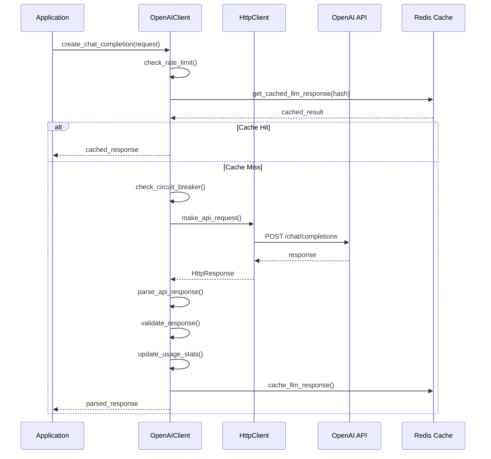
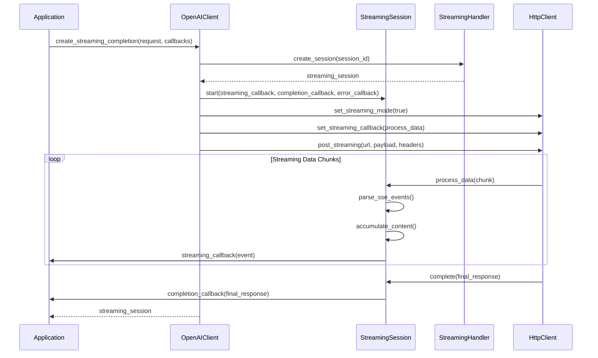
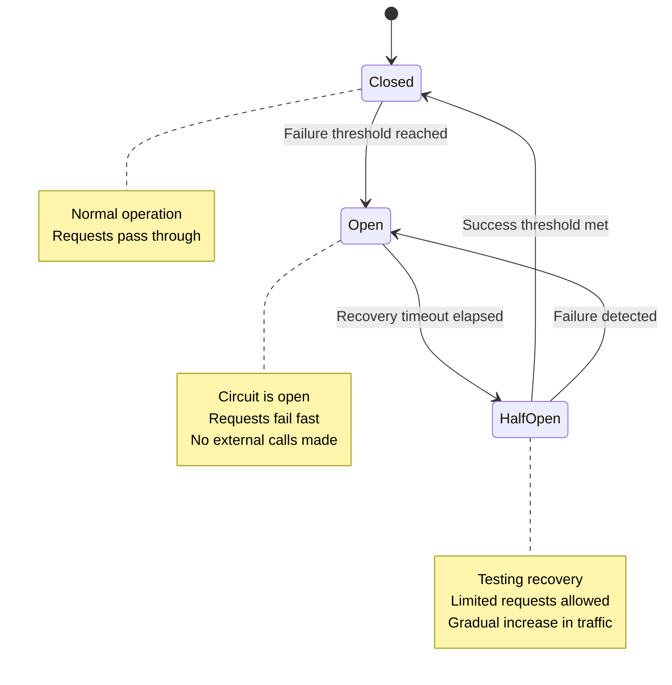
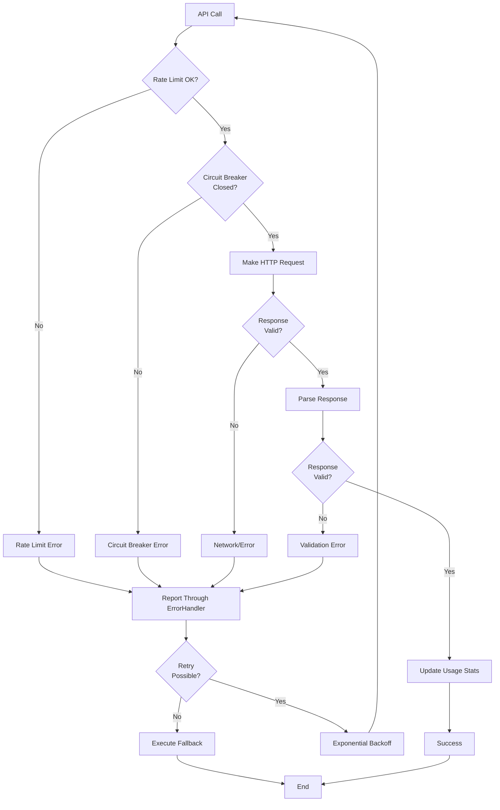
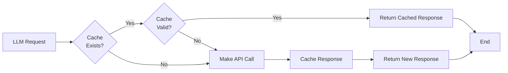

# OpenAI Client

<cite>
**Referenced Files in This Document**
- [openai_client.hpp](file://shared/llm/openai_client.hpp)
- [openai_client.cpp](file://shared/llm/openai_client.cpp)
- [http_client.hpp](file://shared/network/http_client.hpp)
- [structured_logger.hpp](file://shared/logging/structured_logger.hpp)
- [error_handler.hpp](file://shared/error_handler.hpp)
- [circuit_breaker.hpp](file://shared/resilience/circuit_breaker.hpp)
- [redis_client.hpp](file://shared/cache/redis_client.hpp)
- [streaming_handler.hpp](file://shared/llm/streaming_handler.hpp)
- [function_calling.hpp](file://shared/llm/function_calling.hpp)
</cite>

## Table of Contents
1. [Introduction](#introduction)
2. [Architecture Overview](#architecture-overview)
3. [Core Components](#core-components)
4. [Initialization and Dependency Injection](#initialization-and-dependency-injection)
5. [Core Functionality](#core-functionality)
6. [Streaming Implementation](#streaming-implementation)
7. [Specialized Analysis Methods](#specialized-analysis-methods)
8. [Resilience and Error Handling](#resilience-and-error-handling)
9. [Caching and Performance](#caching-and-performance)
10. [Configuration Management](#configuration-management)
11. [Usage Tracking and Cost Estimation](#usage-tracking-and-cost-estimation)
12. [Troubleshooting Guide](#troubleshooting-guide)
13. [Best Practices](#best-practices)
14. [Conclusion](#conclusion)

## Introduction

The OpenAI Client is a production-grade LLM integration component designed for enterprise compliance and regulatory applications. It provides comprehensive integration with OpenAI's API, featuring advanced error handling, rate limiting, caching, streaming capabilities, and specialized compliance analysis functions.

This client serves as the primary interface for all LLM interactions within the Regulens system, offering robust reliability, performance monitoring, and extensive customization options for regulatory compliance scenarios.

## Architecture Overview

The OpenAI Client follows a layered architecture pattern with clear separation of concerns:



**Diagram sources**
- [openai_client.hpp](file://shared/llm/openai_client.hpp#L194-L232)
- [http_client.hpp](file://shared/network/http_client.hpp#L1-L50)
- [redis_client.hpp](file://shared/cache/redis_client.hpp#L1-L50)

## Core Components

### OpenAIClient Class Structure

The OpenAIClient class serves as the central orchestrator for all LLM interactions:



**Diagram sources**
- [openai_client.hpp](file://shared/llm/openai_client.hpp#L194-L544)

**Section sources**
- [openai_client.hpp](file://shared/llm/openai_client.hpp#L194-L544)

## Initialization and Dependency Injection

The OpenAI Client uses a sophisticated dependency injection pattern with four core components:

### Constructor and Dependencies

```cpp
OpenAIClient::OpenAIClient(std::shared_ptr<ConfigurationManager> config,
                         std::shared_ptr<StructuredLogger> logger,
                         std::shared_ptr<ErrorHandler> error_handler)
    : config_manager_(config),
      logger_(logger),
      error_handler_(error_handler),
      http_client_(std::make_shared<HttpClient>()),
      streaming_handler_(std::make_shared<StreamingResponseHandler>(config, logger.get(), error_handler.get())),
      redis_client_(create_redis_client(config, logger, error_handler)),
      max_tokens_(4096),
      temperature_(0.7),
      request_timeout_seconds_(30),
      max_retries_(3),
      rate_limit_window_(std::chrono::milliseconds(60000)),
      total_requests_(0),
      successful_requests_(0),
      failed_requests_(0),
      total_tokens_used_(0),
      estimated_cost_usd_(0.0),
      last_request_time_(std::chrono::system_clock::now()),
      max_requests_per_minute_(50)
```

### Initialization Process

The initialization process follows a structured sequence:



**Diagram sources**
- [openai_client.cpp](file://shared/llm/openai_client.cpp#L35-L91)

**Section sources**
- [openai_client.cpp](file://shared/llm/openai_client.cpp#L35-L91)

## Core Functionality

### Chat Completion Implementation

The core chat completion functionality handles both synchronous and streaming requests:



**Diagram sources**
- [openai_client.cpp](file://shared/llm/openai_client.cpp#L93-L268)

### HTTP Request Handling

The client uses the HttpClient component for all API communications:

```cpp
std::optional<HttpResponse> OpenAIClient::make_api_request(const std::string& endpoint,
                                                        const nlohmann::json& payload) {
    try {
        std::string url = base_url_ + endpoint;
        std::unordered_map<std::string, std::string> headers = {
            {"Authorization", "Bearer " + api_key_},
            {"Content-Type", "application/json"}
        };
        
        std::string payload_str = payload.dump();
        
        http_client_->set_timeout(request_timeout_seconds_);
        auto response = http_client_->post(url, payload_str, headers);
        
        last_request_time_ = std::chrono::system_clock::now();
        
        if (!response.success) {
            handle_api_error("network", "Request failed: " + response.error_message);
            return std::nullopt;
        }
        
        if (response.status_code < 200 || response.status_code >= 300) {
            handle_api_error("http_error", "HTTP " + std::to_string(response.status_code),
                           {{"status_code", std::to_string(response.status_code)},
                            {"response_body", response.body.empty() ? "empty" : response.body.substr(0, 500)}});
            return std::nullopt;
        }
        
        return response;
    } catch (const std::exception& e) {
        handle_api_error("exception", std::string("API request exception: ") + e.what());
        return std::nullopt;
    }
}
```

**Section sources**
- [openai_client.cpp](file://shared/llm/openai_client.cpp#L511-L582)

## Streaming Implementation

### Real-Time Token Processing

The streaming implementation provides real-time token processing with comprehensive error handling:



**Diagram sources**
- [openai_client.cpp](file://shared/llm/openai_client.cpp#L788-L916)
- [streaming_handler.hpp](file://shared/llm/streaming_handler.hpp#L150-L200)

### Streaming Configuration

The streaming system supports comprehensive configuration:

```cpp
struct StreamingConfig {
    bool enable_streaming = true;
    size_t max_buffer_size = 1024 * 1024;  // 1MB max buffer
    std::chrono::milliseconds connection_timeout = std::chrono::seconds(30);
    std::chrono::milliseconds read_timeout = std::chrono::seconds(60);
    size_t max_retries = 3;
    std::chrono::milliseconds retry_delay = std::chrono::milliseconds(1000);
    bool validate_partial_responses = true;
};
```

**Section sources**
- [openai_client.cpp](file://shared/llm/openai_client.cpp#L788-L916)
- [streaming_handler.hpp](file://shared/llm/streaming_handler.hpp#L60-L80)

## Specialized Analysis Methods

### Compliance Reasoning

The compliance reasoning method generates detailed regulatory analysis:

```cpp
std::optional<std::string> OpenAIClient::generate_compliance_reasoning(
    const std::string& decision_context,
    const std::vector<std::string>& regulatory_requirements,
    const std::vector<std::string>& risk_factors) {

    std::string system_prompt = R"(
You are an expert compliance officer with deep knowledge of financial regulations, risk management, and corporate governance.

Your task is to provide detailed compliance reasoning for business decisions, considering:
1. Applicable regulatory requirements
2. Identified risk factors
3. Potential compliance implications
4. Recommended risk mitigation strategies
5. Documentation and reporting requirements

Provide your analysis in a structured format with clear reasoning and actionable recommendations.)";

    // Build user prompt with context
    std::string user_prompt = "Decision Context:\n" + decision_context + "\n\n";
    
    // Add regulatory requirements
    if (!regulatory_requirements.empty()) {
        user_prompt += "Regulatory Requirements:\n";
        for (size_t i = 0; i < regulatory_requirements.size(); ++i) {
            user_prompt += std::to_string(i + 1) + ". " + regulatory_requirements[i] + "\n";
        }
        user_prompt += "\n";
    }
    
    // Add risk factors
    if (!risk_factors.empty()) {
        user_prompt += "Risk Factors:\n";
        for (size_t i = 0; i < risk_factors.size(); ++i) {
            user_prompt += std::to_string(i + 1) + ". " + risk_factors[i] + "\n";
        }
        user_prompt += "\n";
    }
    
    user_prompt += "Please provide comprehensive compliance reasoning and recommendations.";

    // Create completion request
    OpenAICompletionRequest request{
        .model = default_model_,
        .messages = {
            OpenAIMessage{"system", system_prompt},
            OpenAIMessage{"user", user_prompt}
        },
        .temperature = 0.1,  // Low temperature for consistent compliance analysis
        .max_tokens = 3000
    };

    try {
        auto response = create_chat_completion(request);
        if (!response || response->choices.empty()) {
            throw std::runtime_error("Compliance reasoning failed: Empty response from API");
        }
        return response->choices[0].message.content;
    } catch (const std::exception& e) {
        throw std::runtime_error("Compliance reasoning failed: " + std::string(e.what()));
    }
}
```

### Structured Data Extraction

The structured data extraction method converts unstructured text into validated JSON:

```cpp
std::optional<nlohmann::json> OpenAIClient::extract_structured_data(
    const std::string& text, const nlohmann::json& schema) {

    std::string system_prompt = R"(
You are an expert data extraction AI. Your task is to extract structured information from unstructured text according to the provided schema.

Return ONLY valid JSON that matches the schema structure. Do not include any explanatory text or markdown formatting.)";

    std::string schema_str = schema.dump(2);
    std::string user_prompt = "Extract the following information from the text according to this JSON schema:\n\n";
    user_prompt += "Schema:\n" + schema_str + "\n\n";
    user_prompt += "Text to analyze:\n" + text + "\n\n";
    user_prompt += "Return only the JSON object:";

    OpenAICompletionRequest request{
        .model = default_model_,
        .messages = {
            OpenAIMessage{"system", system_prompt},
            OpenAIMessage{"user", user_prompt}
        },
        .temperature = 0.0,  // Zero temperature for deterministic extraction
        .max_tokens = 2000
    };

    auto response = create_chat_completion(request);
    if (!response || response->choices.empty()) {
        return std::nullopt;
    }

    try {
        // Extract JSON from response
        std::string content = response->choices[0].message.content;

        // Remove any markdown formatting if present
        std::regex json_regex("```json\\s*([\\s\\S]*?)\\s*```");
        std::smatch match;
        if (std::regex_search(content, match, json_regex)) {
            content = match[1].str();
        }

        // Parse the JSON
        return nlohmann::json::parse(content);
    } catch (const std::exception& e) {
        handle_api_error("json_parsing", std::string("Failed to parse extracted JSON: ") + e.what(),
                        {{"response_content", response->choices[0].message.content.substr(0, 100)}});
        return std::nullopt;
    }
}
```

**Section sources**
- [openai_client.cpp](file://shared/llm/openai_client.cpp#L318-L369)
- [openai_client.cpp](file://shared/llm/openai_client.cpp#L371-L420)

## Resilience and Error Handling

### Circuit Breaker Integration

The client integrates with the advanced circuit breaker system for enhanced resilience:



**Diagram sources**
- [circuit_breaker.hpp](file://shared/resilience/circuit_breaker.hpp#L30-L50)

### Rate Limiting Implementation

The client implements sophisticated rate limiting using sliding window technique:

```cpp
bool OpenAIClient::check_rate_limit() {
    std::lock_guard<std::mutex> lock(rate_limit_mutex_);

    auto now = std::chrono::system_clock::now();
    auto window_start = now - rate_limit_window_;

    // Remove old timestamps outside the window
    while (!request_timestamps_.empty() && request_timestamps_.front() < window_start) {
        request_timestamps_.pop_front();
    }

    // Check if we're within limits
    if (static_cast<int>(request_timestamps_.size()) >= max_requests_per_minute_) {
        logger_->warn("OpenAI API rate limit exceeded: " + std::to_string(request_timestamps_.size()) +
                     " requests in last minute");
        return false;
    }

    // Add current request timestamp
    request_timestamps_.push_back(now);
    return true;
}
```

### Error Handling Strategy

The error handling system provides comprehensive error reporting and recovery:



**Diagram sources**
- [openai_client.cpp](file://shared/llm/openai_client.cpp#L641-L674)

**Section sources**
- [openai_client.cpp](file://shared/llm/openai_client.cpp#L641-L674)
- [circuit_breaker.hpp](file://shared/resilience/circuit_breaker.hpp#L150-L200)

## Caching and Performance

### Redis Integration

The client integrates with Redis for intelligent caching of LLM responses:



**Diagram sources**
- [openai_client.cpp](file://shared/llm/openai_client.cpp#L93-L140)

### Intelligent TTL Calculation

The caching system uses intelligent TTL calculation based on content complexity:

```cpp
std::chrono::seconds calculate_intelligent_ttl(const std::string& content_type,
                                              double complexity_or_importance,
                                              std::chrono::seconds base_ttl_seconds = std::chrono::seconds(3600)) {
    // Higher complexity/content importance gets longer TTL
    double multiplier = 1.0 + (complexity_or_importance * 2.0); // 1.0 to 3.0 multiplier
    auto calculated_ttl = base_ttl_seconds * multiplier;
    
    // Cap at reasonable limits
    if (calculated_ttl > std::chrono::hours(24)) {
        calculated_ttl = std::chrono::hours(24);
    }
    
    return calculated_ttl;
}
```

**Section sources**
- [openai_client.cpp](file://shared/llm/openai_client.cpp#L93-L140)

## Configuration Management

### Environment Variables

The client supports comprehensive configuration through environment variables:

| Configuration Key | Description | Default Value |
|-------------------|-------------|---------------|
| `LLM_OPENAI_API_KEY` | OpenAI API key | Required |
| `LLM_OPENAI_BASE_URL` | OpenAI API base URL | `https://api.openai.com/v1` |
| `LLM_OPENAI_MODEL` | Default model | `gpt-4-turbo-preview` |
| `LLM_OPENAI_MAX_TOKENS` | Maximum tokens per request | `4000` |
| `LLM_OPENAI_TEMPERATURE` | Model temperature | `0.7` |
| `LLM_OPENAI_TIMEOUT_SECONDS` | Request timeout | `30` |
| `LLM_OPENAI_MAX_RETRIES` | Maximum retries | `3` |
| `LLM_OPENAI_MAX_REQUESTS_PER_MINUTE` | Rate limit | `50` |
| `LLM_OPENAI_USE_ADVANCED_CIRCUIT_BREAKER` | Enable advanced circuit breaker | `false` |

### Configuration Loading

```cpp
bool OpenAIClient::initialize() {
    try {
        // Load configuration from environment
        api_key_ = config_manager_->get_string("LLM_OPENAI_API_KEY").value_or("");
        if (api_key_.empty()) {
            logger_->error("OpenAI API key not configured");
            return false;
        }

        base_url_ = config_manager_->get_string("LLM_OPENAI_BASE_URL")
                   .value_or("https://api.openai.com/v1");
        default_model_ = config_manager_->get_string("LLM_OPENAI_MODEL")
                        .value_or("gpt-4-turbo-preview");
        max_tokens_ = static_cast<int>(config_manager_->get_int("LLM_OPENAI_MAX_TOKENS")
                                      .value_or(4000));
        temperature_ = config_manager_->get_double("LLM_OPENAI_TEMPERATURE")
                      .value_or(0.7);
        request_timeout_seconds_ = static_cast<int>(config_manager_->get_int("LLM_OPENAI_TIMEOUT_SECONDS")
                                                   .value_or(30));
        max_retries_ = static_cast<int>(config_manager_->get_int("LLM_OPENAI_MAX_RETRIES")
                                       .value_or(3));
        max_requests_per_minute_ = static_cast<int>(config_manager_->get_int("LLM_OPENAI_MAX_REQUESTS_PER_MINUTE")
                                                   .value_or(50));

        // Advanced circuit breaker configuration
        use_advanced_circuit_breaker_ = config_manager_->get_bool("LLM_OPENAI_USE_ADVANCED_CIRCUIT_BREAKER")
                                       .value_or(false);

        // Initialize Redis client for caching
        if (redis_client_) {
            if (!redis_client_->initialize()) {
                logger_->warn("Redis client initialization failed - LLM caching will be disabled");
                redis_client_.reset();
            } else {
                logger_->info("Redis client initialized for LLM response caching");
            }
        }

        // Validate configuration
        if (api_key_.empty() || base_url_.empty()) {
            logger_->error("OpenAI client configuration incomplete - missing API key or base URL");
            return false;
        }

        logger_->info("OpenAI client initialized with model: " + default_model_ + ", timeout: " +
                     std::to_string(request_timeout_seconds_) + "s, max_tokens: " + std::to_string(max_tokens_));
        return true;

    } catch (const std::exception& e) {
        logger_->error("Failed to initialize OpenAI client: " + std::string(e.what()));
        return false;
    }
}
```

**Section sources**
- [openai_client.cpp](file://shared/llm/openai_client.cpp#L35-L91)

## Usage Tracking and Cost Estimation

### Usage Statistics

The client maintains comprehensive usage statistics:

```cpp
nlohmann::json OpenAIClient::get_usage_statistics() {
    return {
        {"total_requests", static_cast<size_t>(total_requests_)},
        {"successful_requests", static_cast<size_t>(successful_requests_)},
        {"failed_requests", static_cast<size_t>(failed_requests_)},
        {"success_rate", total_requests_ > 0 ?
            (static_cast<double>(successful_requests_) / total_requests_) * 100.0 : 0.0},
        {"total_tokens_used", static_cast<size_t>(total_tokens_used_)},
        {"estimated_cost_usd", estimated_cost_usd_.load()},
        {"last_request_time", std::chrono::duration_cast<std::chrono::milliseconds>(
            last_request_time_.time_since_epoch()).count()},
        {"configuration", {
            {"model", default_model_},
            {"max_tokens", max_tokens_},
            {"temperature", temperature_},
            {"max_requests_per_minute", max_requests_per_minute_}
        }}
    };
}
```

### Cost Calculation

The client calculates estimated costs based on OpenAI's pricing model:

```cpp
double OpenAIClient::calculate_cost(const std::string& model, int tokens) {
    // Pricing tiers based on model
    double price_per_token = 0.0;
    
    if (model.find("gpt-4") != std::string::npos) {
        if (model.find("turbo") != std::string::npos) {
            price_per_token = 0.00001; // $0.01 per 1K tokens
        } else {
            price_per_token = 0.00003; // $0.03 per 1K tokens
        }
    } else if (model.find("gpt-3.5") != std::string::npos) {
        price_per_token = 0.000001; // $0.001 per 1K tokens
    }
    
    return (tokens * price_per_token);
}
```

**Section sources**
- [openai_client.cpp](file://shared/llm/openai_client.cpp#L478-L509)

## Troubleshooting Guide

### Common Issues and Solutions

#### Authentication Failures

**Symptoms**: API key not configured or invalid
**Solution**: 
1. Verify `LLM_OPENAI_API_KEY` environment variable
2. Check API key validity through OpenAI dashboard
3. Ensure proper permissions are granted

#### Rate Limiting

**Symptoms**: Rate limit exceeded errors
**Solution**:
1. Monitor rate limit configuration: `LLM_OPENAI_MAX_REQUESTS_PER_MINUTE`
2. Implement exponential backoff in application logic
3. Consider upgrading OpenAI API tier

#### Network Connectivity

**Symptoms**: Network timeout or connection errors
**Solution**:
1. Verify `LLM_OPENAI_TIMEOUT_SECONDS` setting
2. Check firewall and proxy configurations
3. Ensure OpenAI API endpoints are accessible

#### Response Validation Failures

**Symptoms**: Invalid API response structure
**Solution**:
1. Check API response format against OpenAI documentation
2. Verify JSON parsing logic
3. Review error handling in `parse_api_response()`

### Debugging Tools

#### Health Status Monitoring

```cpp
nlohmann::json OpenAIClient::get_health_status() {
    auto circuit_breaker = error_handler_->get_circuit_breaker(CIRCUIT_BREAKER_SERVICE);

    return {
        {"service", "openai_api"},
        {"status", "operational"},
        {"last_request", std::chrono::duration_cast<std::chrono::milliseconds>(
            last_request_time_.time_since_epoch()).count()},
        {"circuit_breaker", circuit_breaker ? circuit_breaker->to_json() : nullptr},
        {"usage_stats", get_usage_statistics()}
    };
}
```

#### Usage Counter Reset

```cpp
void OpenAIClient::reset_usage_counters() {
    total_requests_ = 0;
    successful_requests_ = 0;
    failed_requests_ = 0;
    total_tokens_used_ = 0;
    estimated_cost_usd_ = 0.0;

    logger_->info("OpenAI client usage counters reset");
}
```

**Section sources**
- [openai_client.cpp](file://shared/llm/openai_client.cpp#L478-L510)

## Best Practices

### Model Selection Guidelines

Choose appropriate models based on use case requirements:

- **GPT-4 Turbo Preview**: Best for complex reasoning and compliance analysis
- **GPT-4**: Balanced performance for general use cases
- **GPT-3.5 Turbo**: Cost-effective for simple tasks and prototyping

### Temperature Settings

- **0.0-0.3**: Deterministic responses for structured data extraction
- **0.4-0.7**: Balanced creativity for analysis and reasoning
- **0.8-1.0**: Creative responses for brainstorming and exploration

### Token Management

- Monitor token usage through `get_usage_statistics()`
- Implement token budgeting for production deployments
- Use streaming for long responses to improve user experience

### Error Handling

- Always check return values from API calls
- Implement proper exception handling
- Use circuit breaker protection for production systems

### Performance Optimization

- Enable Redis caching for frequently repeated requests
- Use streaming for real-time user interfaces
- Implement request batching for multiple operations
- Monitor and adjust rate limiting based on API quotas

## Conclusion

The OpenAI Client provides a comprehensive, production-ready solution for integrating OpenAI's API into enterprise compliance and regulatory applications. Its robust architecture, featuring advanced error handling, rate limiting, caching, and streaming capabilities, ensures reliable operation in demanding environments.

Key strengths include:

- **Production-Ready Design**: Built with enterprise-grade reliability and resilience
- **Comprehensive Monitoring**: Extensive usage tracking and health monitoring
- **Flexible Configuration**: Environment-based configuration with sensible defaults
- **Advanced Caching**: Intelligent Redis integration with TTL optimization
- **Real-Time Streaming**: Support for live token processing and user interfaces
- **Specialized Analysis**: Built-in compliance reasoning and structured data extraction
- **Resilience Patterns**: Circuit breaker integration and comprehensive error handling

The client serves as a foundation for building sophisticated AI-powered compliance solutions while maintaining operational excellence and cost efficiency.