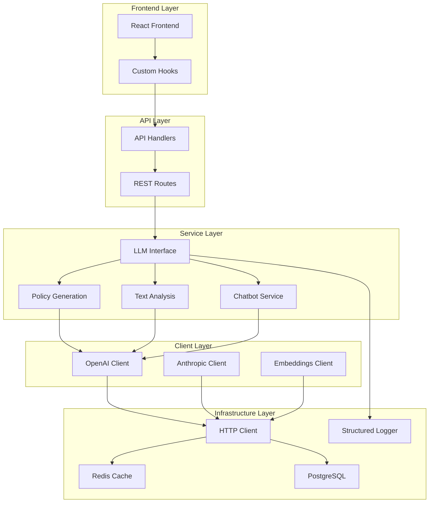
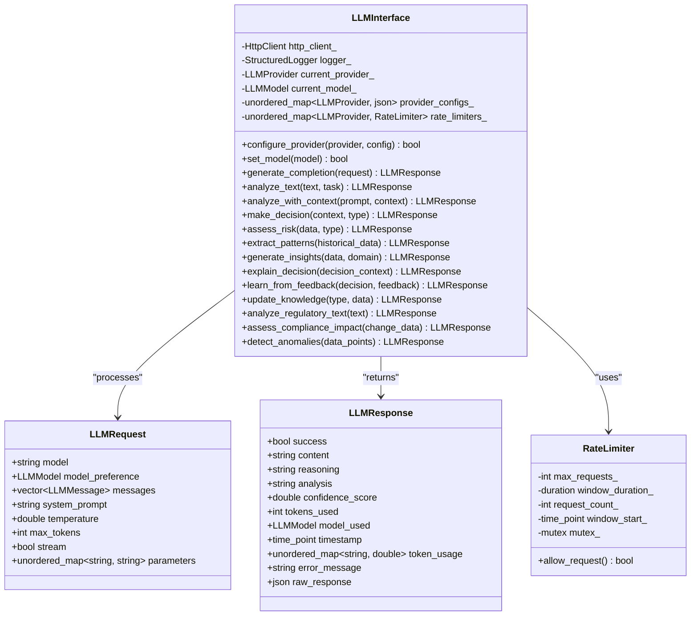
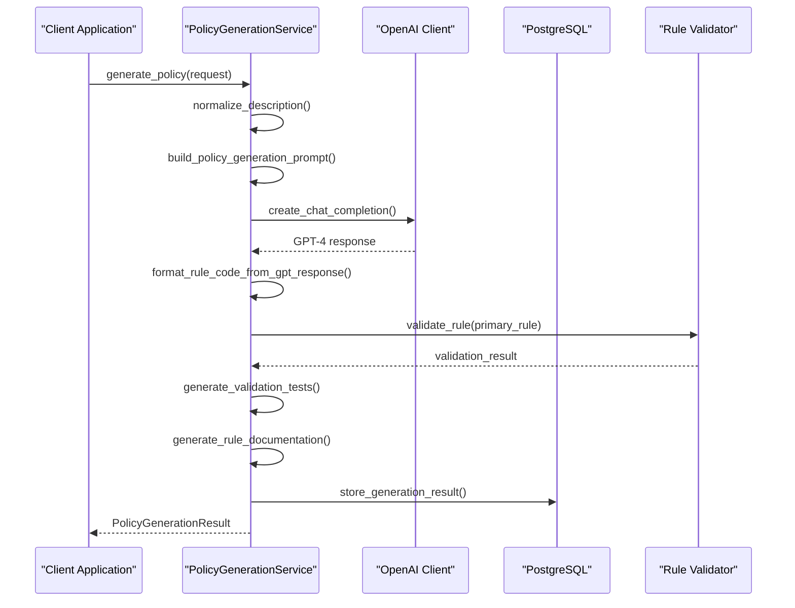
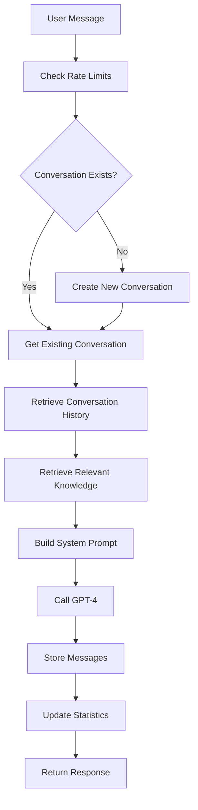
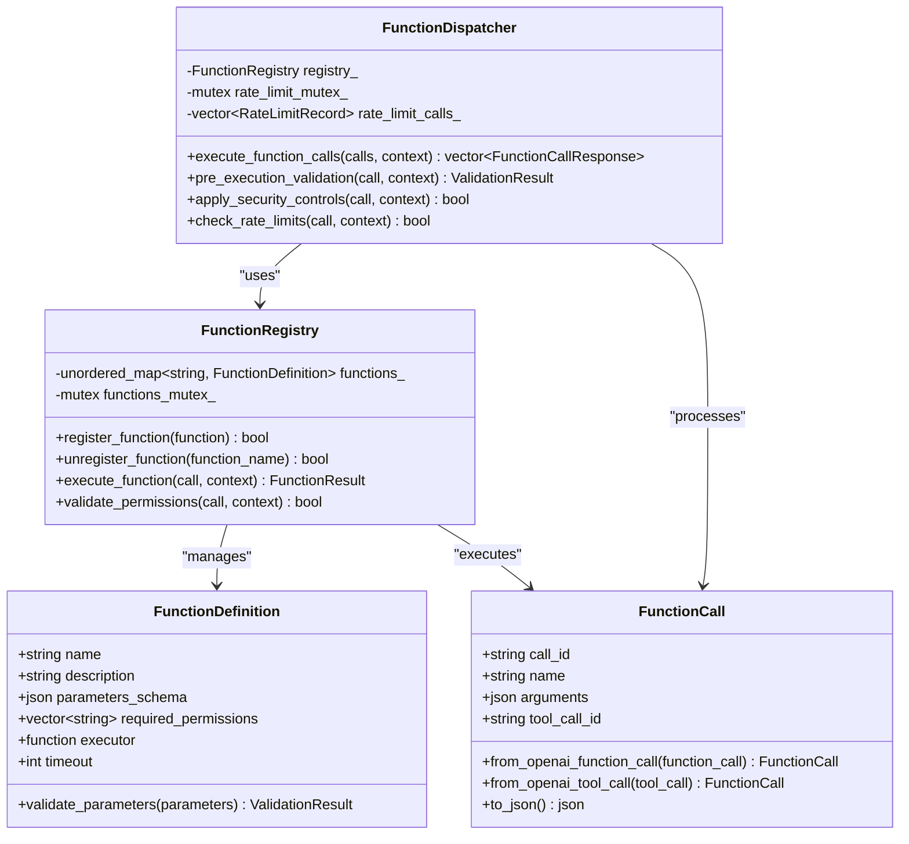

# Integration Patterns

<cite>
**Referenced Files in This Document**
- [llm_interface.cpp](file://shared/agentic_brain/llm_interface.cpp)
- [llm_interface.hpp](file://shared/agentic_brain/llm_interface.hpp)
- [policy_generation_service.cpp](file://shared/llm/policy_generation_service.cpp)
- [text_analysis_service.cpp](file://shared/llm/text_analysis_service.cpp)
- [openai_client.cpp](file://shared/llm/openai_client.cpp)
- [function_calling.cpp](file://shared/llm/function_calling.cpp)
- [chatbot_service.cpp](file://shared/llm/chatbot_service.cpp)
- [llm_api_handlers.cpp](file://shared/llm/llm_api_handlers.cpp)
- [LLMIntegration.tsx](file://frontend/src/pages/LLMIntegration.tsx)
- [useLLM.ts](file://frontend/src/hooks/useLLM.ts)
</cite>

## Table of Contents
1. [Introduction](#introduction)
2. [Core LLM Integration Architecture](#core-llm-integration-architecture)
3. [LLM Interface Layer](#llm-interface-layer)
4. [Specialized Services](#specialized-services)
5. [Function Calling Framework](#function-calling-framework)
6. [Integration Patterns](#integration-patterns)
7. [Error Handling and Resilience](#error-handling-and-resilience)
8. [Performance Optimization](#performance-optimization)
9. [Common Issues and Solutions](#common-issues-and-solutions)
10. [Best Practices](#best-practices)
11. [Conclusion](#conclusion)

## Introduction

The Regulens system implements sophisticated integration patterns for Large Language Model (LLM) capabilities, enabling seamless interaction between natural language queries and complex regulatory compliance workflows. This documentation explores the comprehensive integration architecture that bridges LLM services with core system components like policy generation, text analysis, and decision-making processes.

The integration patterns demonstrate production-grade solutions for handling multiple LLM providers (OpenAI, Anthropic), managing context windows, optimizing response latency, and ensuring system reliability through robust error handling and circuit breaker mechanisms.

## Core LLM Integration Architecture

The LLM integration architecture follows a layered approach with clear separation of concerns:



**Diagram sources**
- [llm_interface.cpp](file://shared/agentic_brain/llm_interface.cpp#L1-L50)
- [llm_api_handlers.cpp](file://shared/llm/llm_api_handlers.cpp#L1-L50)

## LLM Interface Layer

The LLM Interface serves as the central orchestrator for all LLM interactions, providing a unified abstraction over multiple providers and specialized services.

### Core Interface Design



**Diagram sources**
- [llm_interface.hpp](file://shared/agentic_brain/llm_interface.hpp#L113-L200)
- [llm_interface.cpp](file://shared/agentic_brain/llm_interface.cpp#L1-L100)

### Provider Configuration Management

The LLM Interface implements sophisticated provider configuration management with automatic validation and rate limiting:

```cpp
// Example configuration for OpenAI provider
nlohmann::json openai_config = {
    {"base_url", "https://api.openai.com/v1"},
    {"api_key", "sk-..."},
    {"timeout_seconds", 30},
    {"max_retries", 3},
    {"rate_limit_requests", 100},
    {"rate_limit_window_seconds", 60}
};

llm_interface.configure_provider(LLMProvider::OPENAI, openai_config);
```

**Section sources**
- [llm_interface.cpp](file://shared/agentic_brain/llm_interface.cpp#L35-L85)

### Context-Aware Text Analysis

The system implements intelligent context management for handling long conversations and complex regulatory documents:

```cpp
LLMResponse LLMInterface::analyze_with_context(const std::string& prompt, const nlohmann::json& context) {
    LLMRequest request;
    request.model = model_to_string(current_model_);
    request.model_preference = current_model_;
    request.messages = {{{"role", "user"}, {"content", prompt + "\n\nContext: " + context.dump(2)}}};
    request.temperature = 0.7;
    
    return generate_completion(request);
}
```

**Section sources**
- [llm_interface.cpp](file://shared/agentic_brain/llm_interface.cpp#L180-L195)

## Specialized Services

### Policy Generation Service

The Policy Generation Service transforms natural language descriptions into structured compliance rules using GPT-4:



**Diagram sources**
- [policy_generation_service.cpp](file://shared/llm/policy_generation_service.cpp#L50-L150)

### Text Analysis Service

The Text Analysis Service provides comprehensive NLP capabilities with caching and batch processing:

```cpp
TextAnalysisResult TextAnalysisService::analyze_text(const TextAnalysisRequest& request) {
    TextAnalysisResult result;
    result.request_id = generate_uuid();
    result.text_hash = generate_text_hash(request.text);
    result.analyzed_at = std::chrono::system_clock::now();
    
    // Check cache first
    if (cache_enabled_ && request.enable_caching) {
        auto cached_result = get_cached_result(result.text_hash, tasks_hash);
        if (cached_result) {
            return *cached_result;
        }
    }
    
    // Perform requested analysis tasks
    for (AnalysisTask task : request.tasks) {
        switch (task) {
            case AnalysisTask::SENTIMENT_ANALYSIS:
                result.sentiment = analyze_sentiment(normalized_text);
                break;
            case AnalysisTask::ENTITY_EXTRACTION:
                result.entities = extract_entities(normalized_text);
                break;
            case AnalysisTask::TEXT_SUMMARIZATION:
                result.summary = summarize_text(normalized_text);
                break;
            // ... other tasks
        }
    }
    
    // Cache the result
    if (cache_enabled_) {
        cache_result(result.text_hash, tasks_hash, result);
    }
    
    return result;
}
```

**Section sources**
- [text_analysis_service.cpp](file://shared/llm/text_analysis_service.cpp#L50-L150)

### Chatbot Service with RAG Integration

The Chatbot Service implements Retrieval-Augmented Generation (RAG) for enhanced regulatory compliance assistance:



**Diagram sources**
- [chatbot_service.cpp](file://shared/llm/chatbot_service.cpp#L50-L150)

**Section sources**
- [chatbot_service.cpp](file://shared/llm/chatbot_service.cpp#L50-L100)

## Function Calling Framework

The Function Calling Framework enables secure execution of external functions through LLM-generated function calls:



**Diagram sources**
- [function_calling.cpp](file://shared/llm/function_calling.cpp#L1-L100)

**Section sources**
- [function_calling.cpp](file://shared/llm/function_calling.cpp#L1-L200)

## Integration Patterns

### Provider Abstraction Pattern

The system implements a provider abstraction pattern that allows seamless switching between different LLM providers:

```cpp
LLMResponse LLMInterface::generate_completion(const LLMRequest& request) {
    LLMResponse response;
    
    // Check rate limits
    if (!check_rate_limit(current_provider_)) {
        response.success = false;
        response.error_message = "Rate limit exceeded";
        return response;
    }
    
    // Route to appropriate provider
    switch (current_provider_) {
        case LLMProvider::OPENAI:
            response = generate_openai_completion(request);
            break;
        case LLMProvider::ANTHROPIC:
            response = generate_anthropic_completion(request);
            break;
        case LLMProvider::LOCAL_LLM:
            response = generate_local_completion(request);
            break;
        default:
            response.success = false;
            response.error_message = "No provider configured";
            break;
    }
    
    return response;
}
```

**Section sources**
- [llm_interface.cpp](file://shared/agentic_brain/llm_interface.cpp#L150-L200)

### Circuit Breaker Pattern

The system implements advanced circuit breaker protection for LLM API calls:

```cpp
std::optional<OpenAIResponse> OpenAIClient::create_chat_completion(const OpenAICompletionRequest& request) {
    // Use circuit breaker protection
    std::optional<OpenAIResponse> result;
    
    auto breaker_result = error_handler_->execute_with_advanced_circuit_breaker(
        [this, &request, &temp_result]() -> regulens::CircuitBreakerResult {
            // Make the API request
            auto http_response = make_api_request("/chat/completions", request.to_json());
            if (!http_response) {
                return regulens::CircuitBreakerResult(false, std::nullopt,
                    "HTTP request failed", std::chrono::milliseconds(0),
                    regulens::CircuitState::CLOSED);
            }
            
            // Parse and validate response
            auto parsed_response = parse_api_response(*http_response);
            if (!parsed_response || !validate_response(*parsed_response)) {
                return regulens::CircuitBreakerResult(false, std::nullopt,
                    "API response validation failed", std::chrono::milliseconds(0),
                    regulens::CircuitState::CLOSED);
            }
            
            return regulens::CircuitBreakerResult(true, nlohmann::json::object(),
                "Success", std::chrono::milliseconds(0),
                regulens::CircuitState::CLOSED);
        },
        CIRCUIT_BREAKER_SERVICE, "OpenAIClient", "create_chat_completion"
    );
    
    return result;
}
```

**Section sources**
- [openai_client.cpp](file://shared/llm/openai_client.cpp#L100-L200)

### Streaming Pattern

The system supports real-time streaming of LLM responses:

```typescript
// Frontend streaming implementation
const startStream = useCallback(async (params: {
  modelId: string;
  prompt: string;
  systemPrompt?: string;
  temperature?: number;
  maxTokens?: number;
}) => {
  const response = await fetch(`${apiClient.baseURL}/llm/stream`, {
    method: 'POST',
    headers: {
      'Content-Type': 'application/json',
      'Authorization': `Bearer ${apiClient.getToken()}`,
    },
    body: JSON.stringify({
      model_id: params.modelId,
      prompt: params.prompt,
      system_prompt: params.systemPrompt,
      temperature: params.temperature,
      max_tokens: params.maxTokens,
    }),
  });

  const reader = response.body?.getReader();
  const decoder = new TextDecoder();
  
  while (true) {
    const { done, value } = await reader.read();
    if (done) break;
    
    const chunk = decoder.decode(value, { stream: true });
    const lines = chunk.split('\n');
    
    for (const line of lines) {
      if (line.startsWith('data: ')) {
        const data = line.slice(6);
        if (data === '[DONE]') continue;
        
        try {
          const parsed = JSON.parse(data);
          if (parsed.token) {
            fullContent += parsed.token;
            setStreamedContent(fullContent);
            params.onToken?.(parsed.token);
          }
        } catch (parseError) {
          // Handle incomplete chunks
        }
      }
    }
  }
}, []);
```

**Section sources**
- [useLLM.ts](file://frontend/src/hooks/useLLM.ts#L50-L150)

## Error Handling and Resilience

### Comprehensive Error Management

The system implements multi-layered error handling with fallback mechanisms:

```cpp
LLMResponse LLMInterface::generate_completion(const LLMRequest& request) {
    LLMResponse response;
    response.model_used = current_model_;
    response.timestamp = std::chrono::system_clock::now();
    
    try {
        // Check if provider is configured
        if (current_provider_ == LLMProvider::NONE || 
            providers_.find(current_provider_) == providers_.end()) {
            response.success = false;
            response.error_message = "LLM provider not configured";
            response.content = "LLM interface not configured - cannot generate completion";
            return response;
        }
        
        // Check rate limits
        if (!check_rate_limit(current_provider_)) {
            response.success = false;
            response.error_message = "Rate limit exceeded";
            logger_->log(LogLevel::WARN, "Rate limit exceeded for provider: " +
                        std::to_string(static_cast<int>(current_provider_)));
            return response;
        }
        
        // Route to appropriate provider
        switch (current_provider_) {
            case LLMProvider::OPENAI:
                response = generate_openai_completion(request);
                break;
            case LLMProvider::ANTHROPIC:
                response = generate_anthropic_completion(request);
                break;
            case LLMProvider::LOCAL_LLM:
                response = generate_local_completion(request);
                break;
            default:
                response.success = false;
                response.error_message = "No provider configured";
                break;
        }
        
        // Update usage statistics
        if (response.success) {
            update_usage_stats(response);
        }
        
    } catch (const std::exception& e) {
        response.success = false;
        response.error_message = "LLM completion failed: " + std::string(e.what());
        logger_->log(LogLevel::ERROR, "LLM completion error: " + std::string(e.what()));
    }
    
    return response;
}
```

**Section sources**
- [llm_interface.cpp](file://shared/agentic_brain/llm_interface.cpp#L150-L220)

### Fallback Strategies

The system implements intelligent fallback strategies for different failure modes:

```cpp
GeneratedRule PolicyGenerationService::generate_primary_rule(
    const PolicyGenerationRequest& request,
    const std::string& normalized_description
) {
    GeneratedRule rule;
    // ... initialization code ...
    
    try {
        // Build GPT-4 prompt
        std::string prompt = build_policy_generation_prompt(request);
        
        // Call GPT-4
        OpenAICompletionRequest gpt_request;
        gpt_request.model = default_model_;
        gpt_request.messages = {
            {"system", "You are an expert compliance policy developer..."},
            {"user", prompt}
        };
        gpt_request.temperature = 0.1;
        gpt_request.max_tokens = 2000;
        
        auto response = openai_client_->create_chat_completion(gpt_request);
        if (!response || response->choices.empty()) {
            throw std::runtime_error("Failed to get policy generation response from OpenAI");
        }
        
        std::string gpt_response = response->choices[0].message.content;
        rule.generated_code = format_rule_code_from_gpt_response(gpt_response, request.output_format);
        rule.confidence_score = 0.9;
        
    } catch (const std::exception& e) {
        // Fallback to simpler rule generation
        spdlog::error("Primary rule generation failed: {}", e.what());
        rule.generated_code = generate_fallback_rule(request);
        rule.confidence_score = 0.3;
    }
    
    return rule;
}
```

**Section sources**
- [policy_generation_service.cpp](file://shared/llm/policy_generation_service.cpp#L100-L150)

## Performance Optimization

### Caching Strategy

The system implements multi-level caching for improved performance:

```cpp
std::optional<TextAnalysisResult> TextAnalysisService::get_cached_result(
    const std::string& text_hash,
    const std::string& tasks_hash
) {
    if (!redis_client_ || !cache_enabled_) {
        return std::nullopt;
    }
    
    try {
        std::string cache_key = "text_analysis:" + text_hash + ":" + tasks_hash;
        
        RedisResult cache_result = redis_client_->get(cache_key);
        if (!cache_result.success || !cache_result.value) {
            return std::nullopt;
        }
        
        // Parse cached JSON data
        nlohmann::json cached_json = nlohmann::json::parse(*cache_result.value);
        
        // Convert to TextAnalysisResult
        TextAnalysisResult result;
        // ... populate result from cached data ...
        
        return result;
        
    } catch (const std::exception& e) {
        logger_->warn("Failed to parse cached LLM response, proceeding with API call");
        return std::nullopt;
    }
}
```

**Section sources**
- [text_analysis_service.cpp](file://shared/llm/text_analysis_service.cpp#L700-L750)

### Batch Processing

The system supports efficient batch processing for multiple requests:

```cpp
std::vector<TextAnalysisResult> TextAnalysisService::analyze_batch(
    const std::vector<TextAnalysisRequest>& requests,
    int max_concurrent
) {
    std::vector<TextAnalysisResult> results;
    results.reserve(requests.size());
    
    if (requests.empty()) {
        return results;
    }
    
    // Create batches for parallel processing
    auto batches = create_batches(requests, batch_size_);
    
    std::vector<std::future<std::vector<TextAnalysisResult>>> futures;
    
    // Process batches concurrently
    for (const auto& batch : batches) {
        futures.push_back(std::async(std::launch::async, [this, batch]() {
            std::vector<TextAnalysisResult> batch_results;
            for (const auto& request : batch) {
                batch_results.push_back(analyze_text(request));
            }
            return batch_results;
        }));
    }
    
    // Collect results
    for (auto& future : futures) {
        auto batch_results = future.get();
        results.insert(results.end(), batch_results.begin(), batch_results.end());
    }
    
    return results;
}
```

**Section sources**
- [text_analysis_service.cpp](file://shared/llm/text_analysis_service.cpp#L250-L300)

## Common Issues and Solutions

### Context Window Limitations

**Problem**: LLM context windows limit the amount of text that can be processed in a single request.

**Solution**: Implement intelligent context truncation and summarization:

```cpp
LLMResponse LLMInterface::generate_local_completion(const LLMRequest& request) {
    // Build complete prompt from all messages with role awareness
    std::string complete_prompt;
    size_t estimated_tokens = 0;
    const size_t max_context_tokens = request.max_tokens > 0 ? 
        (8192 - request.max_tokens) : 6000; // Reserve space for completion
    
    // Build prompt from message history (newest first for truncation if needed)
    std::vector<LLMMessage> messages_to_include;
    for (auto it = request.messages.rbegin(); it != request.messages.rend(); ++it) {
        // Estimate tokens (rough: 1 token ≈ 4 chars)
        size_t message_tokens = it->content.length() / 4;
        
        if (estimated_tokens + message_tokens > max_context_tokens) {
            // Context window limit reached
            break;
        }
        
        messages_to_include.insert(messages_to_include.begin(), *it);
        estimated_tokens += message_tokens;
    }
    
    // Format messages with role prefixes for context
    for (const auto& msg : messages_to_include) {
        std::string role_prefix;
        if (msg.role == "system") {
            role_prefix = "System: ";
        } else if (msg.role == "user") {
            role_prefix = "User: ";
        } else if (msg.role == "assistant") {
            role_prefix = "Assistant: ";
        }
        
        complete_prompt += role_prefix + msg.content + "\n\n";
    }
    
    // Add final prompt for assistant response
    complete_prompt += "Assistant: ";
    
    return complete_prompt;
}
```

**Section sources**
- [llm_interface.cpp](file://shared/agentic_brain/llm_interface.cpp#L350-L450)

### Response Latency Optimization

**Problem**: High latency in LLM API calls affects user experience.

**Solution**: Implement connection pooling, request batching, and intelligent retry mechanisms:

```cpp
bool OpenAIClient::check_rate_limit() {
    std::lock_guard<std::mutex> lock(rate_limit_mutex_);
    
    auto now = std::chrono::system_clock::now();
    auto window_start = now - rate_limit_window_;
    
    // Remove old timestamps outside the window
    while (!request_timestamps_.empty() && request_timestamps_.front() < window_start) {
        request_timestamps_.pop_front();
    }
    
    // Check if we're within limits
    if (static_cast<int>(request_timestamps_.size()) >= max_requests_per_minute_) {
        logger_->warn("OpenAI API rate limit exceeded: " + std::to_string(request_timestamps_.size()) +
                     " requests in last minute");
        return false;
    }
    
    // Add current request timestamp
    request_timestamps_.push_back(now);
    return true;
}
```

**Section sources**
- [openai_client.cpp](file://shared/llm/openai_client.cpp#L800-L850)

### Integration Point Failures

**Problem**: Single points of failure in LLM integrations.

**Solution**: Implement comprehensive circuit breaker patterns and health monitoring:

```cpp
nlohmann::json OpenAIClient::get_health_status() {
    auto circuit_breaker = error_handler_->get_circuit_breaker(CIRCUIT_BREAKER_SERVICE);
    
    return {
        {"service", "openai_api"},
        {"status", "operational"},
        {"last_request", std::chrono::duration_cast<std::chrono::milliseconds>(
            last_request_time_.time_since_epoch()).count()},
        {"circuit_breaker", circuit_breaker ? circuit_breaker->to_json() : nullptr},
        {"usage_stats", get_usage_statistics()}
    };
}
```

**Section sources**
- [openai_client.cpp](file://shared/llm/openai_client.cpp#L900-L950)

## Best Practices

### Designing Effective Integration Patterns

1. **Provider Abstraction**: Always use a unified interface for LLM interactions
2. **Error Resilience**: Implement comprehensive error handling with fallback strategies
3. **Performance Optimization**: Use caching, batching, and streaming where appropriate
4. **Security**: Implement proper authentication, rate limiting, and input validation
5. **Monitoring**: Track usage metrics, costs, and performance indicators

### Maintaining System Reliability

1. **Circuit Breakers**: Protect against cascading failures
2. **Health Checks**: Monitor LLM provider availability
3. **Graceful Degradation**: Provide meaningful fallback responses
4. **Logging**: Implement structured logging for debugging and monitoring
5. **Configuration Management**: Use environment variables and configuration files

### New Use Case Integration Guidelines

When integrating new LLM-based features:

1. **Define Clear Contracts**: Establish input/output specifications
2. **Implement Rate Limiting**: Prevent abuse and manage costs
3. **Add Caching**: Improve performance for repeated requests
4. **Include Monitoring**: Track usage and performance metrics
5. **Provide Documentation**: Enable easy maintenance and updates

## Conclusion

The Regulens LLM Integration Patterns demonstrate a production-ready approach to combining artificial intelligence capabilities with complex regulatory compliance systems. The architecture successfully addresses key challenges including provider abstraction, error resilience, performance optimization, and security considerations.

The multi-layered design with specialized services for policy generation, text analysis, and chatbot functionality provides a scalable foundation for future enhancements. The implementation of circuit breakers, caching strategies, and comprehensive error handling ensures system reliability even under adverse conditions.

Key strengths of the integration patterns include:

- **Flexibility**: Support for multiple LLM providers with seamless switching
- **Reliability**: Robust error handling and fallback mechanisms
- **Performance**: Intelligent caching and batch processing capabilities
- **Security**: Comprehensive validation and rate limiting
- **Observability**: Detailed logging and monitoring capabilities

These patterns serve as a solid foundation for building AI-powered compliance systems that can scale to meet enterprise requirements while maintaining high availability and performance standards.