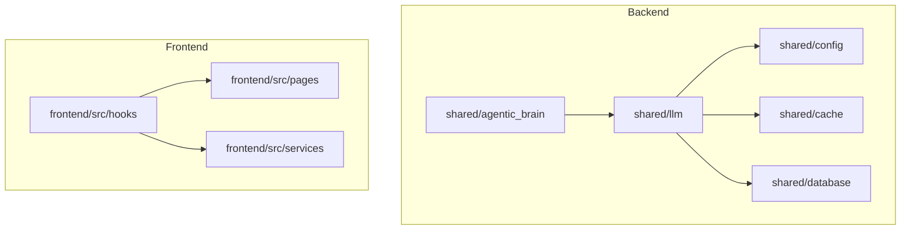
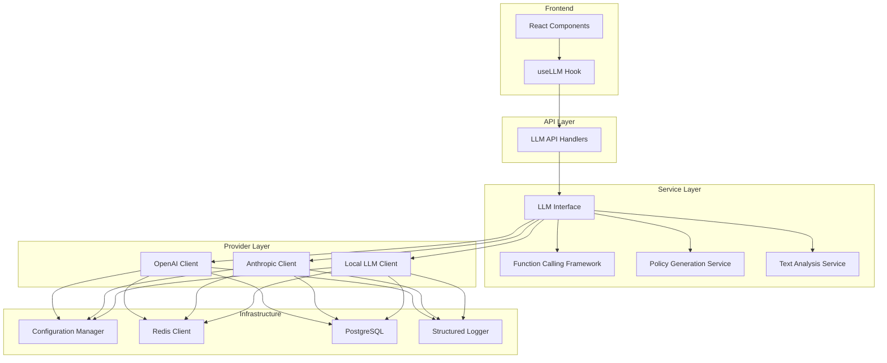
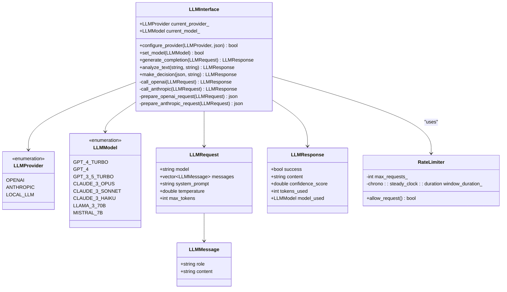
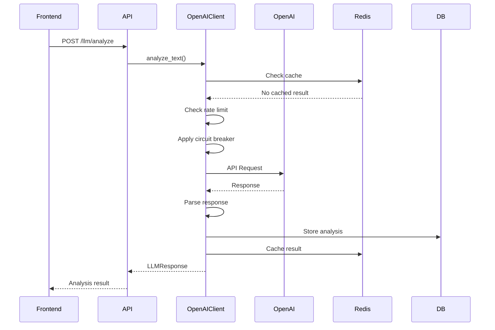
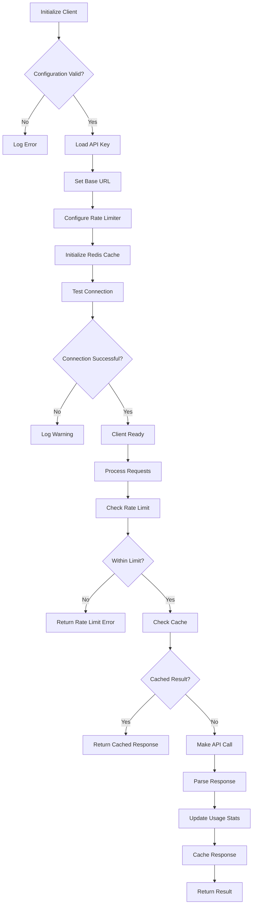
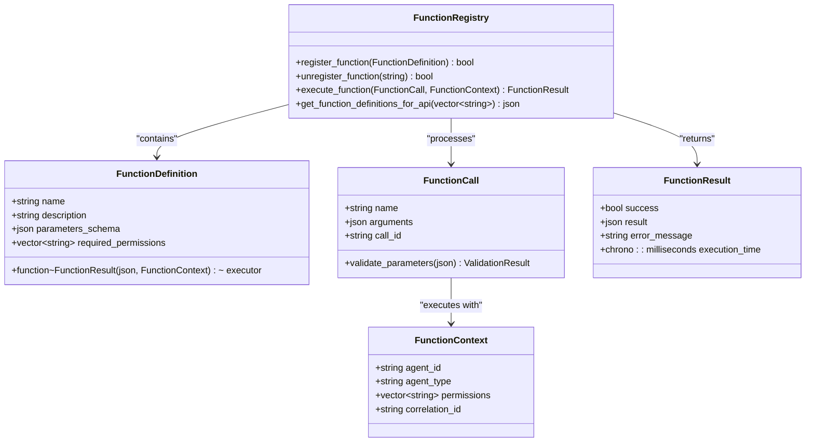
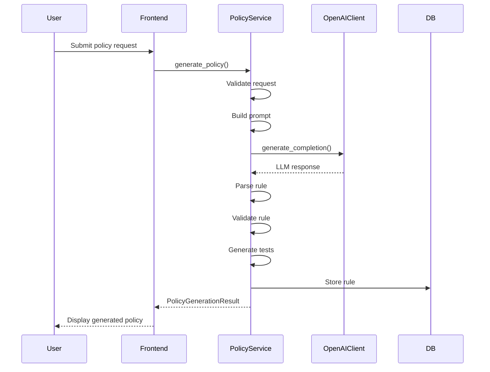
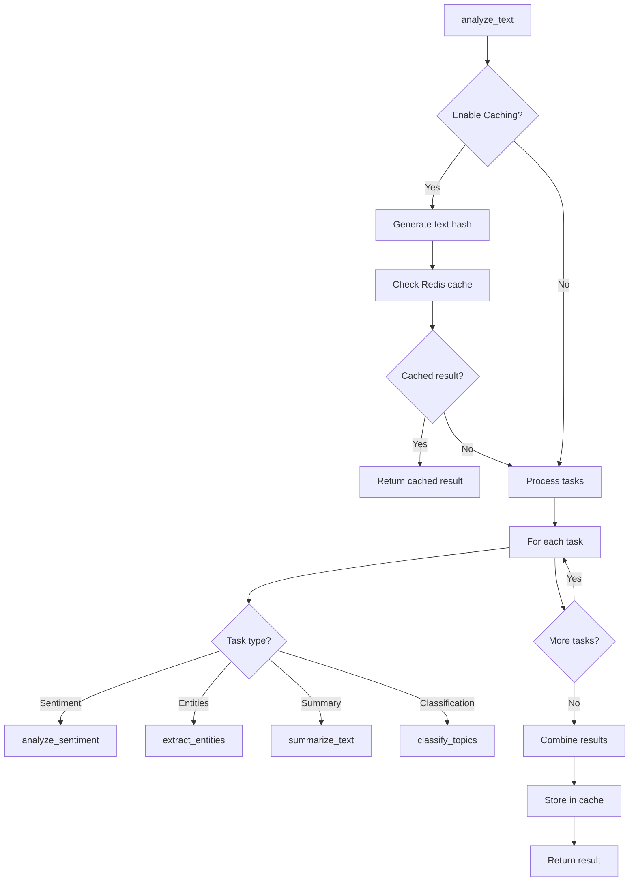
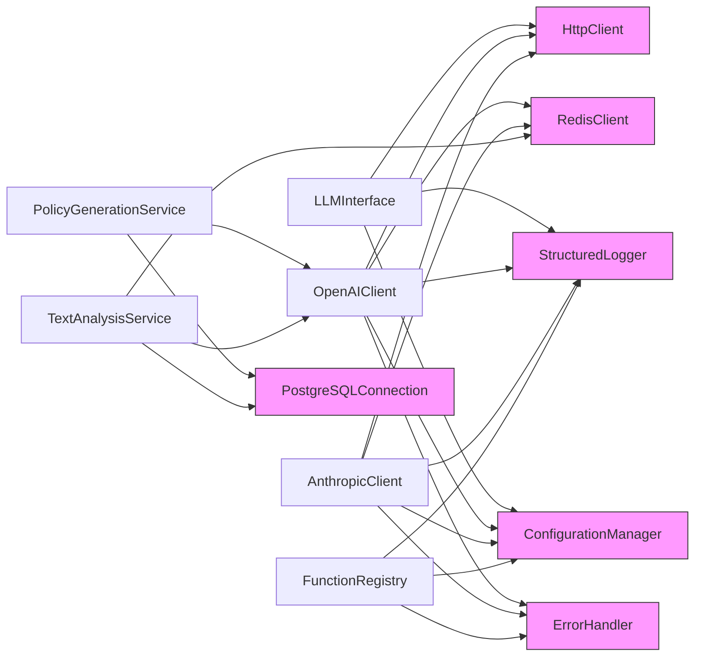

# LLM Integration

<cite>
**Referenced Files in This Document**   
- [llm_interface.hpp](file://shared/agentic_brain/llm_interface.hpp)
- [llm_interface.cpp](file://shared/agentic_brain/llm_interface.cpp)
- [openai_client.hpp](file://shared/llm/openai_client.hpp)
- [openai_client.cpp](file://shared/llm/openai_client.cpp)
- [anthropic_client.hpp](file://shared/llm/anthropic_client.hpp)
- [anthropic_client.cpp](file://shared/llm/anthropic_client.cpp)
- [function_calling.hpp](file://shared/llm/function_calling.hpp)
- [policy_generation_service.hpp](file://shared/llm/policy_generation_service.hpp)
- [text_analysis_service.hpp](file://shared/llm/text_analysis_service.hpp)
- [llm_api_handlers.cpp](file://shared/llm/llm_api_handlers.cpp)
- [useLLM.ts](file://frontend/src/hooks/useLLM.ts)
- [LLMIntegration.tsx](file://frontend/src/pages/LLMIntegration.tsx)
</cite>

## Table of Contents
1. [Introduction](#introduction)
2. [Project Structure](#project-structure)
3. [Core Components](#core-components)
4. [Architecture Overview](#architecture-overview)
5. [Detailed Component Analysis](#detailed-component-analysis)
6. [Dependency Analysis](#dependency-analysis)
7. [Performance Considerations](#performance-considerations)
8. [Troubleshooting Guide](#troubleshooting-guide)
9. [Conclusion](#conclusion)

## Introduction
The LLM Integration system provides a comprehensive multi-provider interface for Large Language Model interactions within the Regulens platform. This architecture enables seamless integration with OpenAI and Anthropic services while supporting local LLM deployments. The system is designed for enterprise-grade compliance applications, featuring robust security, rate limiting, caching, and failover capabilities. It serves as the foundation for policy generation, text analysis, function calling, and regulatory intelligence across the platform.

## Project Structure
The LLM integration components are organized across multiple directories with clear separation of concerns. The core LLM interface resides in the shared/agentic_brain directory, while provider-specific implementations are located in shared/llm. Frontend integration is handled through React hooks and components in the frontend/src directory.

**Diagram sources**
- [llm_interface.hpp](file://shared/agentic_brain/llm_interface.hpp)
- [openai_client.hpp](file://shared/llm/openai_client.hpp)
- [anthropic_client.hpp](file://shared/llm/anthropic_client.hpp)
- [useLLM.ts](file://frontend/src/hooks/useLLM.ts)

**Section sources**
- [llm_interface.hpp](file://shared/agentic_brain/llm_interface.hpp)
- [openai_client.hpp](file://shared/llm/openai_client.hpp)
- [anthropic_client.hpp](file://shared/llm/anthropic_client.hpp)

## Core Components
The LLM integration system consists of several core components that work together to provide a robust multi-provider interface. The LLMInterface serves as the primary abstraction layer, while OpenAIClient and AnthropicClient handle provider-specific implementations. Supporting components include function calling frameworks, policy generation services, and text analysis utilities.

**Section sources**
- [llm_interface.hpp](file://shared/agentic_brain/llm_interface.hpp)
- [openai_client.hpp](file://shared/llm/openai_client.hpp)
- [anthropic_client.hpp](file://shared/llm/anthropic_client.hpp)

## Architecture Overview
The LLM integration architecture follows a layered design pattern with clear separation between the interface layer, provider implementations, and application services. The system supports multiple LLM providers through a unified interface while maintaining provider-specific optimizations.

**Diagram sources**
- [llm_interface.hpp](file://shared/agentic_brain/llm_interface.hpp)
- [openai_client.hpp](file://shared/llm/openai_client.hpp)
- [anthropic_client.hpp](file://shared/llm/anthropic_client.hpp)
- [function_calling.hpp](file://shared/llm/function_calling.hpp)
- [policy_generation_service.hpp](file://shared/llm/policy_generation_service.hpp)
- [text_analysis_service.hpp](file://shared/llm/text_analysis_service.hpp)

## Detailed Component Analysis

### LLM Interface Analysis
The LLMInterface provides a unified abstraction over multiple LLM providers, enabling seamless switching between OpenAI, Anthropic, and local LLMs. It handles configuration, rate limiting, and provider selection while exposing a consistent API for downstream services.

**Diagram sources**
- [llm_interface.hpp](file://shared/agentic_brain/llm_interface.hpp#L20-L200)

**Section sources**
- [llm_interface.hpp](file://shared/agentic_brain/llm_interface.hpp#L20-L200)
- [llm_interface.cpp](file://shared/agentic_brain/llm_interface.cpp#L20-L200)

### OpenAI Client Analysis
The OpenAIClient implements provider-specific functionality for OpenAI's API, including advanced features like function calling, streaming responses, and response caching. It handles authentication, rate limiting, and error recovery with enterprise-grade reliability.

**Diagram sources**
- [openai_client.hpp](file://shared/llm/openai_client.hpp#L20-L200)
- [openai_client.cpp](file://shared/llm/openai_client.cpp#L20-L200)

**Section sources**
- [openai_client.hpp](file://shared/llm/openai_client.hpp#L20-L200)
- [openai_client.cpp](file://shared/llm/openai_client.cpp#L20-L200)

### Anthropic Client Analysis
The AnthropicClient provides specialized integration with Anthropic's Claude models, supporting advanced reasoning capabilities and long context windows. It implements similar reliability features as the OpenAI client while adapting to Anthropic's API specifications.

**Diagram sources**
- [anthropic_client.hpp](file://shared/llm/anthropic_client.hpp#L20-L200)
- [anthropic_client.cpp](file://shared/llm/anthropic_client.cpp#L20-L200)

**Section sources**
- [anthropic_client.hpp](file://shared/llm/anthropic_client.hpp#L20-L200)
- [anthropic_client.cpp](file://shared/llm/anthropic_client.cpp#L20-L200)

### Function Calling Framework
The function calling framework enables secure execution of external functions through LLM-generated calls, with comprehensive validation and auditing. This allows the LLM to interact with external systems while maintaining security and compliance.

**Diagram sources**
- [function_calling.hpp](file://shared/llm/function_calling.hpp#L20-L200)

**Section sources**
- [function_calling.hpp](file://shared/llm/function_calling.hpp#L20-L200)

### Policy Generation Service
The policy generation service leverages LLM capabilities to convert natural language descriptions into structured compliance rules. It supports multiple output formats and includes validation and testing capabilities.

**Diagram sources**
- [policy_generation_service.hpp](file://shared/llm/policy_generation_service.hpp#L20-L200)

**Section sources**
- [policy_generation_service.hpp](file://shared/llm/policy_generation_service.hpp#L20-L200)

### Text Analysis Service
The text analysis service provides multi-task NLP capabilities including sentiment analysis, entity extraction, summarization, and classification. It supports caching and batch processing for improved performance.

**Diagram sources**
- [text_analysis_service.hpp](file://shared/llm/text_analysis_service.hpp#L20-L200)

**Section sources**
- [text_analysis_service.hpp](file://shared/llm/text_analysis_service.hpp#L20-L200)

## Dependency Analysis
The LLM integration system has well-defined dependencies on configuration management, caching, database, and logging components. These dependencies enable the system to maintain state, improve performance, and ensure reliability.

**Diagram sources**
- [llm_interface.hpp](file://shared/agentic_brain/llm_interface.hpp)
- [openai_client.hpp](file://shared/llm/openai_client.hpp)
- [anthropic_client.hpp](file://shared/llm/anthropic_client.hpp)
- [policy_generation_service.hpp](file://shared/llm/policy_generation_service.hpp)
- [text_analysis_service.hpp](file://shared/llm/text_analysis_service.hpp)
- [function_calling.hpp](file://shared/llm/function_calling.hpp)

**Section sources**
- [llm_interface.hpp](file://shared/agentic_brain/llm_interface.hpp)
- [openai_client.hpp](file://shared/llm/openai_client.hpp)
- [anthropic_client.hpp](file://shared/llm/anthropic_client.hpp)

## Performance Considerations
The LLM integration system incorporates several performance optimization strategies including Redis-based response caching, rate limiting, connection pooling, and efficient memory management. The system is designed to handle high volumes of requests while maintaining low latency through asynchronous processing and streaming responses.

**Section sources**
- [openai_client.cpp](file://shared/llm/openai_client.cpp#L100-L200)
- [anthropic_client.cpp](file://shared/llm/anthropic_client.cpp#L100-L200)

## Troubleshooting Guide
Common issues with the LLM integration system typically relate to configuration, authentication, or network connectivity. The system provides comprehensive logging through the StructuredLogger component, with detailed error messages and correlation IDs for tracing requests across components.

**Section sources**
- [llm_interface.cpp](file://shared/agentic_brain/llm_interface.cpp#L500-L600)
- [openai_client.cpp](file://shared/llm/openai_client.cpp#L800-L900)
- [anthropic_client.cpp](file://shared/llm/anthropic_client.cpp#L800-L900)

## Conclusion
The LLM integration architecture provides a robust, enterprise-grade interface for multiple LLM providers with comprehensive support for policy generation, text analysis, and function calling. The system's modular design enables easy extension to additional providers while maintaining high reliability through rate limiting, caching, and circuit breaker patterns. Security is prioritized through proper API key management and permission-based function execution, making it suitable for regulated financial compliance applications.