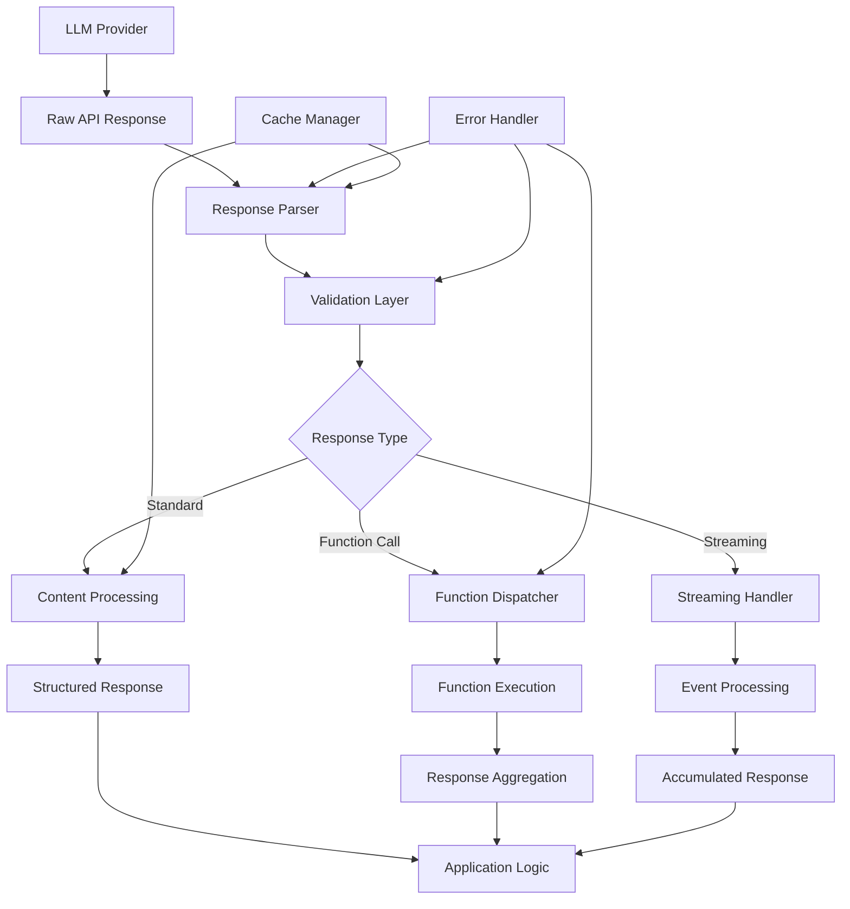
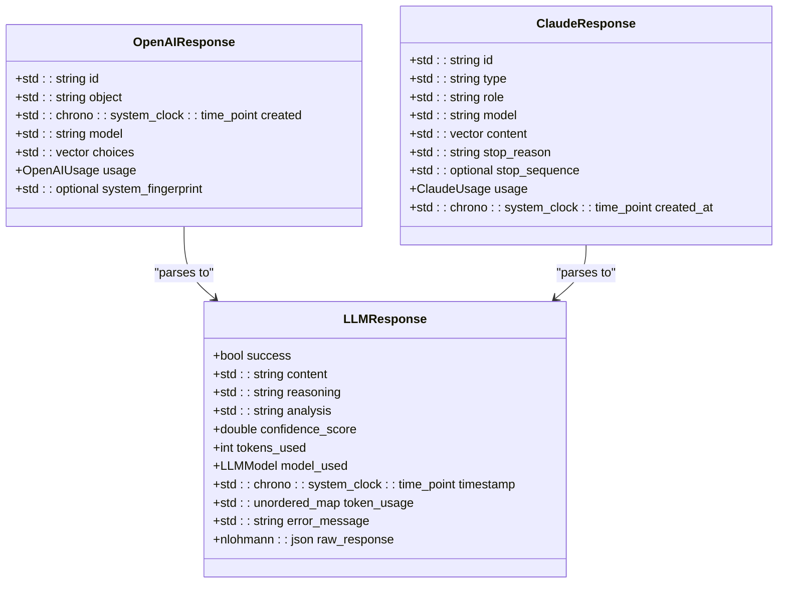
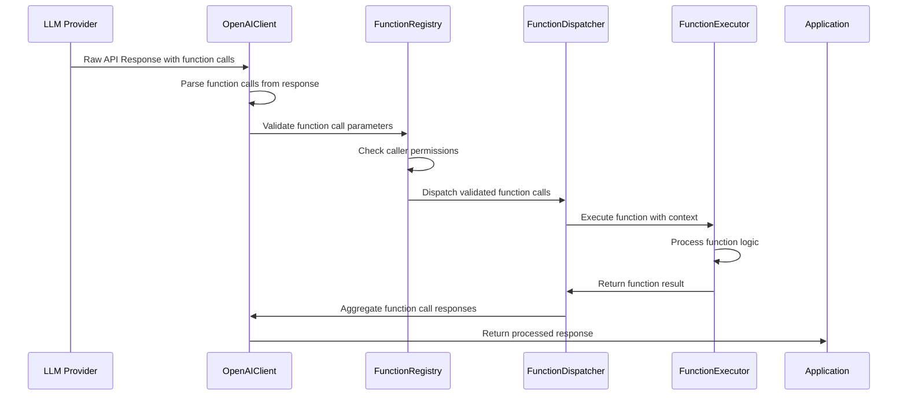
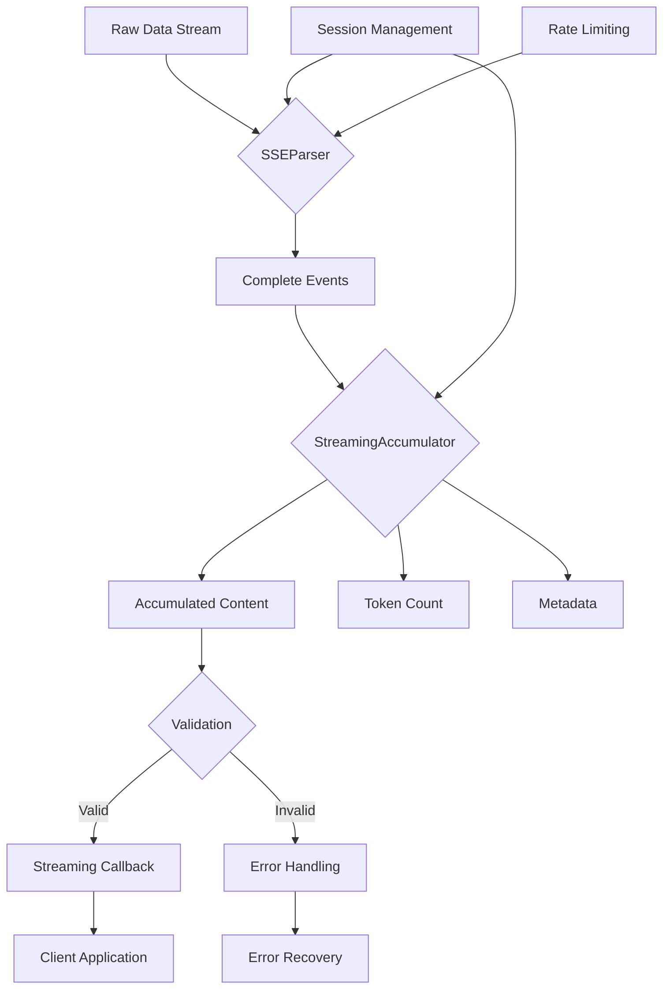
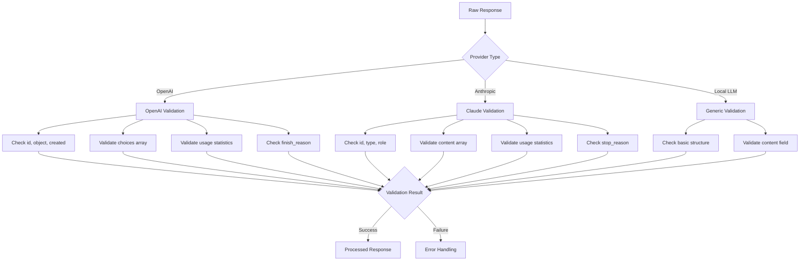
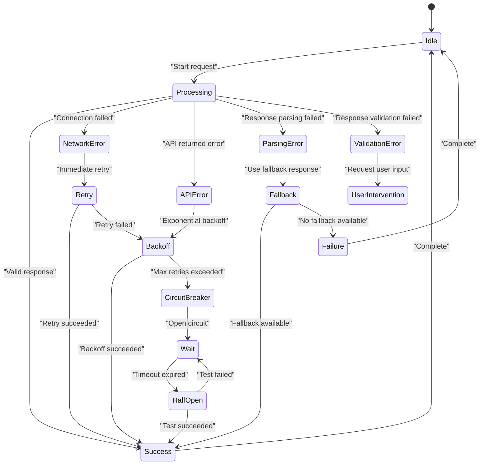
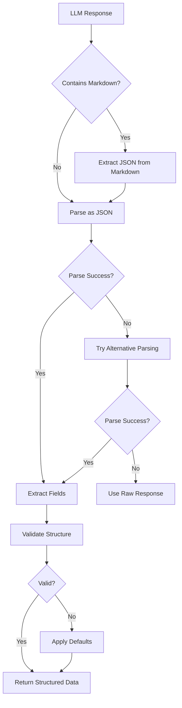
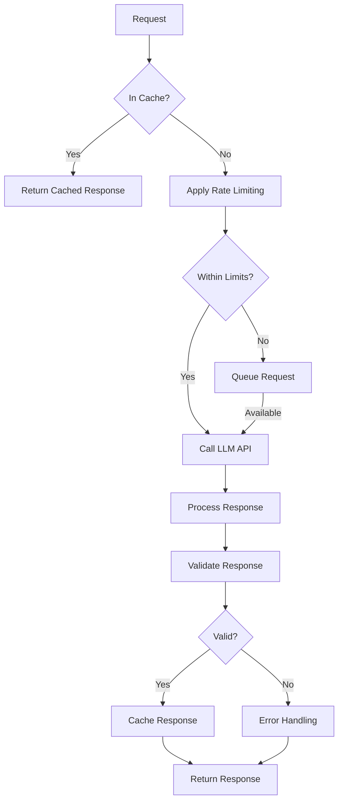

# Response Processing

<cite>
**Referenced Files in This Document**   
- [llm_interface.hpp](file://shared/agentic_brain/llm_interface.hpp)
- [function_calling.hpp](file://shared/llm/function_calling.hpp)
- [function_calling.cpp](file://shared/llm/function_calling.cpp)
- [streaming_handler.hpp](file://shared/llm/streaming_handler.hpp)
- [streaming_handler.cpp](file://shared/llm/streaming_handler.cpp)
- [openai_client.hpp](file://shared/llm/openai_client.hpp)
- [openai_client.cpp](file://shared/llm/openai_client.cpp)
- [anthropic_client.hpp](file://shared/llm/anthropic_client.hpp)
- [text_analysis_service.hpp](file://shared/llm/text_analysis_service.hpp)
- [nl_policy_converter.cpp](file://shared/policy/nl_policy_converter.cpp)
- [llm_analysis_tool.hpp](file://shared/tools/llm_analysis_tool.hpp)
- [errorHandling.ts](file://frontend/src/utils/errorHandling.ts)
- [errorRecovery.ts](file://frontend/src/utils/errorRecovery.ts)
</cite>

## Table of Contents
1. [Introduction](#introduction)
2. [Response Processing Architecture](#response-processing-architecture)
3. [Standard Response Parsing](#standard-response-parsing)
4. [Function and Tool Calling Response Processing](#function-and-tool-calling-response-processing)
5. [Streaming Response Handling](#streaming-response-handling)
6. [Multi-Provider Response Validation](#multi-provider-response-validation)
7. [Error Handling and Recovery](#error-handling-and-recovery)
8. [Structured Data Extraction](#structured-data-extraction)
9. [Performance and Reliability Considerations](#performance-and-reliability-considerations)
10. [Best Practices](#best-practices)

## Introduction

The Response Processing sub-component of LLM Integration in the Regulens system is responsible for handling, parsing, validating, and processing responses from various LLM providers. This comprehensive system ensures reliable and robust interaction with LLMs, supporting both standard completions and advanced function/tool calling capabilities. The architecture is designed to handle responses from multiple providers (OpenAI, Anthropic, and local LLMs) with consistent validation, error handling, and recovery mechanisms.

The system processes responses through a multi-layered approach that includes parsing raw API responses, validating content structure, extracting function calls, handling streaming data, and implementing sophisticated error recovery strategies. This documentation provides a detailed analysis of the implementation, covering the key components and their interactions.

**Section sources**
- [llm_interface.hpp](file://shared/agentic_brain/llm_interface.hpp#L65-L111)

## Response Processing Architecture

The response processing architecture in Regulens is built around a modular design that separates concerns between response reception, parsing, validation, and error handling. The core components work together to ensure reliable processing of LLM responses across different providers and use cases.



**Diagram sources**
- [llm_interface.hpp](file://shared/agentic_brain/llm_interface.hpp#L65-L111)
- [function_calling.hpp](file://shared/llm/function_calling.hpp#L100-L150)
- [streaming_handler.hpp](file://shared/llm/streaming_handler.hpp#L100-L150)

**Section sources**
- [llm_interface.hpp](file://shared/agentic_brain/llm_interface.hpp#L1-L200)

## Standard Response Parsing

The standard response parsing mechanism in Regulens converts raw LLM API responses into a consistent internal format that can be used across the system. The `LLMResponse` structure serves as the canonical representation of all LLM responses, regardless of the provider.

The parsing process begins with the provider-specific response structures (`OpenAIResponse`, `ClaudeResponse`) which are then transformed into the unified `LLMResponse` format. This transformation includes extracting the content, reasoning, analysis, confidence score, token usage, and other metadata. The raw response is preserved in the `raw_response` field for debugging and auditing purposes.

For OpenAI responses, the parsing logic extracts information from the choices array, including the message content, finish reason, and usage statistics. The system also handles the conversion of timestamps from Unix epoch format to C++ chrono time points for consistent time handling.



**Diagram sources**
- [llm_interface.hpp](file://shared/agentic_brain/llm_interface.hpp#L65-L111)
- [openai_client.hpp](file://shared/llm/openai_client.hpp#L100-L150)
- [anthropic_client.hpp](file://shared/llm/anthropic_client.hpp#L100-L150)

**Section sources**
- [llm_interface.hpp](file://shared/agentic_brain/llm_interface.hpp#L65-L111)
- [openai_client.cpp](file://shared/llm/openai_client.cpp#L800-L900)

## Function and Tool Calling Response Processing

The function and tool calling response processing system in Regulens enables dynamic interaction with external tools and services through LLM-generated function calls. This sophisticated mechanism supports both the legacy OpenAI function calling format and the newer tool calling format, providing flexibility for different use cases and provider capabilities.

The `FunctionCall` structure represents a function call request extracted from an LLM response, containing the function name, arguments, and call identifiers. The system parses these calls from the LLM response and validates them against registered function definitions before execution. The validation process includes checking parameter schemas, required permissions, and execution context.

The `FunctionRegistry` manages all available functions, maintaining their definitions, execution logic, and security constraints. When a function call is received, the registry validates the call against the function's schema and the caller's permissions before dispatching it to the appropriate executor. The `FunctionDispatcher` coordinates the execution of multiple function calls, managing the execution context and collecting results.



**Diagram sources**
- [function_calling.hpp](file://shared/llm/function_calling.hpp#L100-L150)
- [function_calling.cpp](file://shared/llm/function_calling.cpp#L200-L300)

**Section sources**
- [function_calling.hpp](file://shared/llm/function_calling.hpp#L50-L200)
- [function_calling.cpp](file://shared/llm/function_calling.cpp#L200-L400)

## Streaming Response Handling

The streaming response handling system in Regulens provides real-time processing of LLM responses through Server-Sent Events (SSE). This enables applications to display partial results as they become available, improving user experience and enabling real-time interaction with LLMs.

The `StreamingHandler` manages the lifecycle of streaming sessions, from creation to completion. Each session maintains its own state, including accumulated content, metadata, and event callbacks. The `SSEParser` component processes incoming data chunks, extracting complete SSE events and converting them into structured `StreamingEvent` objects.

The `StreamingAccumulator` collects and validates partial responses, ensuring that the accumulated content remains coherent and valid throughout the streaming process. It tracks token count, validates response structure, and handles edge cases such as incomplete or malformed events.



**Diagram sources**
- [streaming_handler.hpp](file://shared/llm/streaming_handler.hpp#L100-L150)
- [streaming_handler.cpp](file://shared/llm/streaming_handler.cpp#L200-L300)

**Section sources**
- [streaming_handler.hpp](file://shared/llm/streaming_handler.hpp#L50-L200)
- [streaming_handler.cpp](file://shared/llm/streaming_handler.cpp#L200-L400)

## Multi-Provider Response Validation

The multi-provider response validation system in Regulens ensures consistent handling of responses from different LLM providers while accounting for their unique characteristics and requirements. The validation process occurs at multiple levels, from basic structure validation to semantic content validation.

For OpenAI responses, the system validates the response structure according to the OpenAI API specification, checking for required fields such as id, object, created timestamp, model, choices, and usage statistics. The choices array is validated to ensure it contains at least one choice with a valid message structure.

For Anthropic responses, the validation process checks for the required fields including id, type, role, model, content, stop_reason, and usage statistics. The content array is validated to ensure each message has a valid role and content.

The system also implements semantic validation for specific response types, such as function calls and structured data extraction. For function calls, the arguments are validated against the function's JSON schema to ensure they meet the required format and constraints.



**Diagram sources**
- [openai_client.cpp](file://shared/llm/openai_client.cpp#L900-L950)
- [anthropic_client.hpp](file://shared/llm/anthropic_client.hpp#L100-L150)

**Section sources**
- [openai_client.cpp](file://shared/llm/openai_client.cpp#L900-L950)
- [anthropic_client.hpp](file://shared/llm/anthropic_client.hpp#L100-L150)

## Error Handling and Recovery

The error handling and recovery system in Regulens provides comprehensive protection against various failure modes in LLM response processing. The system implements a multi-layered approach to error detection, reporting, and recovery, ensuring robust operation even in the face of network issues, API failures, or malformed responses.

The error handling process begins with low-level exception handling in the HTTP client and JSON parsing layers. These exceptions are caught and converted into structured error objects that include error codes, messages, and contextual information. The system distinguishes between different error categories such as network errors, API errors, parsing errors, and validation errors.

For recovery, the system implements multiple strategies including immediate retry, exponential backoff, circuit breaker patterns, and fallback responses. The `ErrorRecoveryManager` coordinates these strategies, selecting the appropriate approach based on the error type and context.



**Diagram sources**
- [errorHandling.ts](file://frontend/src/utils/errorHandling.ts#L50-L100)
- [errorRecovery.ts](file://frontend/src/utils/errorRecovery.ts#L50-L100)

**Section sources**
- [errorHandling.ts](file://frontend/src/utils/errorHandling.ts#L1-L200)
- [errorRecovery.ts](file://frontend/src/utils/errorRecovery.ts#L1-L200)

## Structured Data Extraction

The structured data extraction system in Regulens enables reliable extraction of structured information from unstructured LLM responses. This is particularly important for applications that require specific data formats or need to integrate LLM outputs with structured systems.

The extraction process begins with the LLM generating a response in a predefined JSON format, often with a schema provided in the prompt. The system then parses the response and validates it against the expected schema. For cases where the LLM response includes markdown formatting (such as ```json blocks), the system extracts the JSON content and removes the formatting.

The `parse_llm_response` function in the `NLPolicyConverter` demonstrates a robust approach to handling variations in LLM output. It attempts to parse the response as JSON and extracts specific fields such as policy, confidence_score, and metadata. The function includes fallback mechanisms for cases where expected fields are missing, setting default values or extracting data from alternative field names.



**Diagram sources**
- [nl_policy_converter.cpp](file://shared/policy/nl_policy_converter.cpp#L231-L268)

**Section sources**
- [nl_policy_converter.cpp](file://shared/policy/nl_policy_converter.cpp#L195-L268)

## Performance and Reliability Considerations

The response processing system in Regulens incorporates several performance and reliability features to ensure efficient and dependable operation. These include caching mechanisms, rate limiting, connection pooling, and comprehensive monitoring.

The caching system stores successful LLM responses based on a hash of the input prompt and model, allowing identical requests to be served from cache without calling the LLM API. This significantly reduces latency and cost for repeated queries. The cache TTL is calculated based on prompt complexity, ensuring that more complex or context-sensitive responses have shorter cache durations.

Rate limiting is implemented at multiple levels to prevent overwhelming LLM providers and to manage API costs. The system tracks usage statistics and can dynamically adjust request rates based on current load and provider limits.



**Diagram sources**
- [openai_client.cpp](file://shared/llm/openai_client.cpp#L700-L750)

**Section sources**
- [openai_client.cpp](file://shared/llm/openai_client.cpp#L700-L800)

## Best Practices

Based on the implementation in Regulens, several best practices emerge for robust response processing in LLM integration:

1. **Always validate response structure**: Never assume the LLM response will have the expected structure. Implement comprehensive validation at multiple levels.

2. **Handle partial and streaming responses**: Design systems to handle incomplete responses gracefully, especially for streaming use cases.

3. **Implement multiple error recovery strategies**: Use a combination of retry mechanisms, circuit breakers, and fallback responses to handle different failure modes.

4. **Preserve raw responses for debugging**: Store the original raw response from the LLM provider for auditing and debugging purposes.

5. **Use consistent response formats**: Convert responses from different providers into a unified internal format to simplify application logic.

6. **Implement comprehensive logging**: Log key events in the response processing pipeline for monitoring and troubleshooting.

7. **Validate function call parameters**: Always validate function call arguments against the expected schema before execution.

8. **Handle edge cases in JSON parsing**: Account for variations in LLM output, such as markdown formatting around JSON content.

9. **Monitor performance metrics**: Track response times, error rates, and token usage to identify performance issues.

10. **Implement proper caching**: Cache responses when appropriate to reduce latency and costs, but consider cache invalidation strategies for dynamic content.

These practices ensure reliable and efficient processing of LLM responses, enabling robust integration of LLM capabilities into enterprise applications.

**Section sources**
- [llm_interface.hpp](file://shared/agentic_brain/llm_interface.hpp#L1-L200)
- [function_calling.hpp](file://shared/llm/function_calling.hpp#L1-L200)
- [streaming_handler.hpp](file://shared/llm/streaming_handler.hpp#L1-L200)