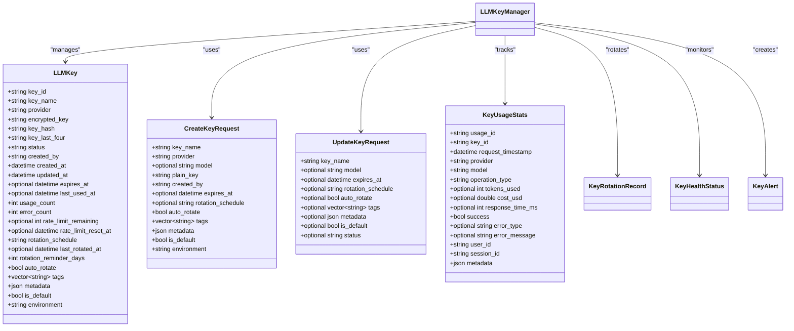
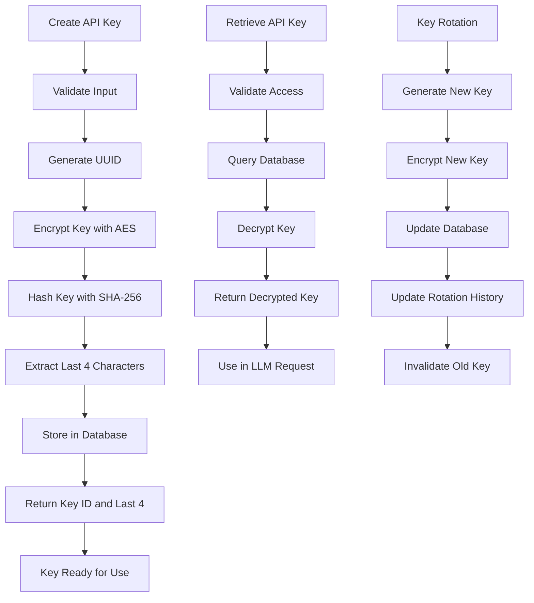
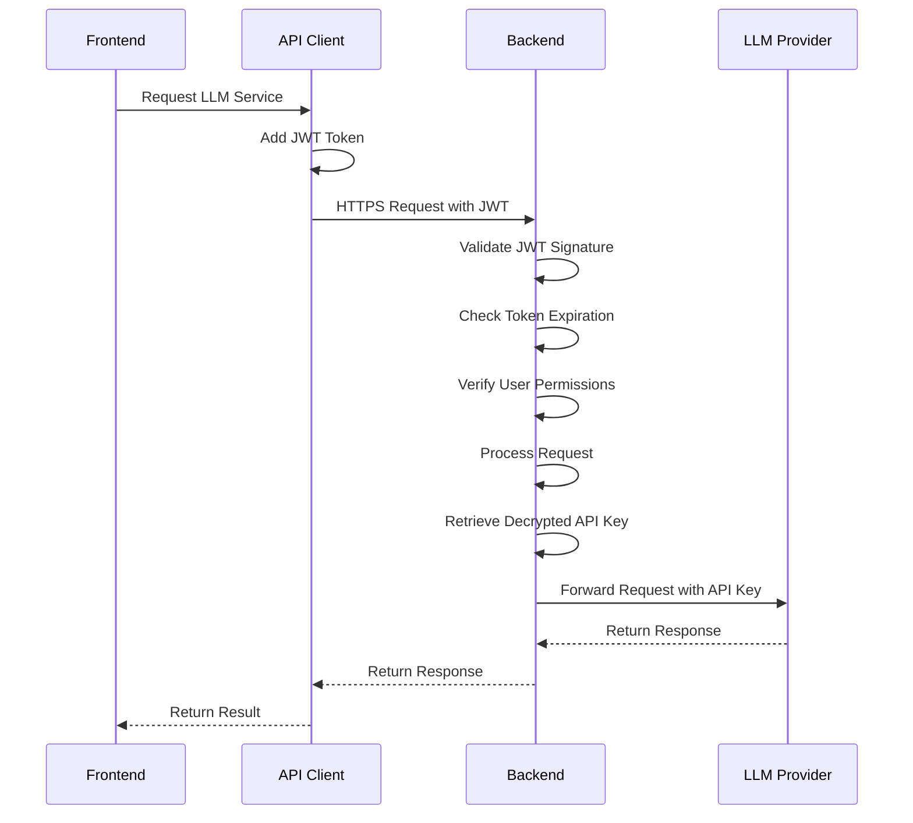
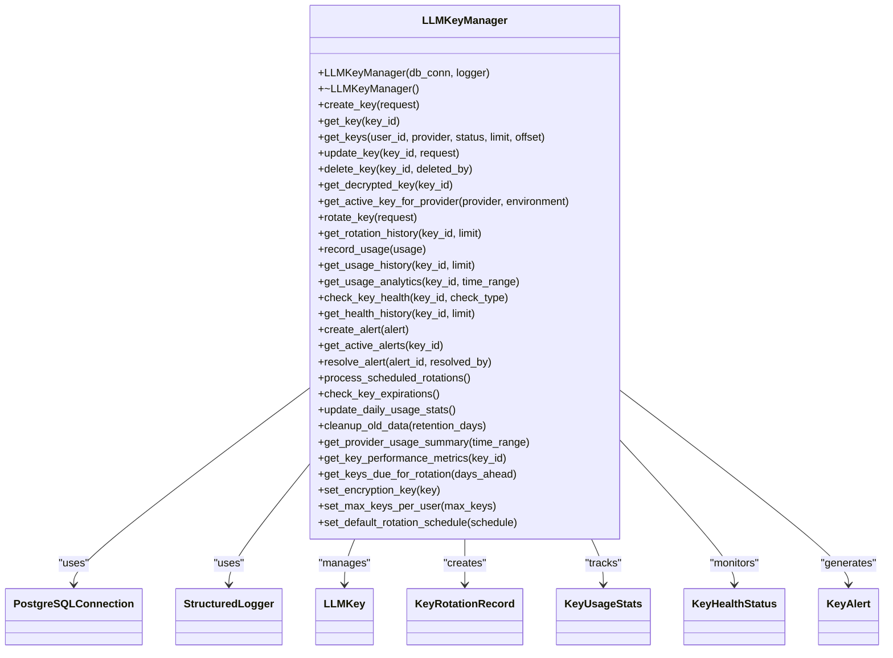
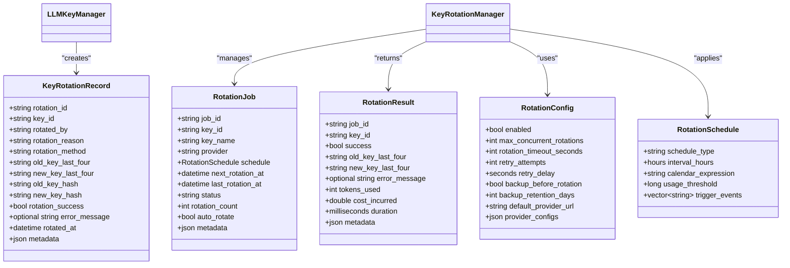
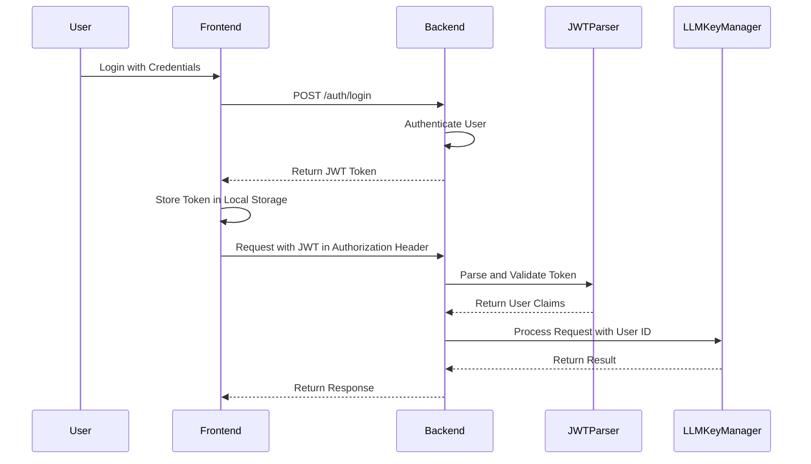
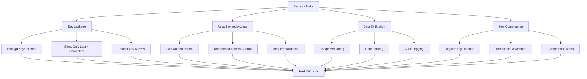
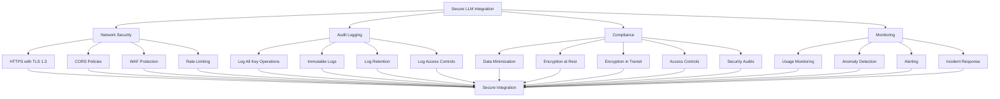

# Security Considerations

<cite>
**Referenced Files in This Document**   
- [llm_key_manager.hpp](file://shared/llm/llm_key_manager.hpp)
- [llm_key_manager.cpp](file://shared/llm/llm_key_manager.cpp)
- [llm_key_api_handlers.hpp](file://shared/llm/llm_key_api_handlers.hpp)
- [jwt_parser.hpp](file://shared/auth/jwt_parser.hpp)
- [auth_helpers.hpp](file://shared/auth/auth_helpers.hpp)
- [useLLMKeys.ts](file://frontend/src/hooks/useLLMKeys.ts)
- [api.ts](file://frontend/src/services/api.ts)
- [schema.sql](file://schema.sql)
- [key_rotation_manager.hpp](file://shared/llm/key_rotation_manager.hpp)
- [LLMKeyManagement.tsx](file://frontend/src/pages/LLMKeyManagement.tsx)
</cite>

## Table of Contents
1. [Introduction](#introduction)
2. [API Key Management Implementation](#api-key-management-implementation)
3. [Data Privacy and Encryption](#data-privacy-and-encryption)
4. [Secure Communication Patterns](#secure-communication-patterns)
5. [LLMKeyManager Class Analysis](#llmkeymanager-class-analysis)
6. [Key Rotation and Lifecycle Management](#key-rotation-and-lifecycle-management)
7. [Authentication System Integration](#authentication-system-integration)
8. [Common Security Risks and Mitigations](#common-security-risks-and-mitigations)
9. [Secure LLM Integration Best Practices](#secure-llm-integration-best-practices)
10. [Conclusion](#conclusion)

## Introduction
The Regulens platform implements a comprehensive security framework for LLM integration, focusing on API key management, data privacy, and secure communication patterns. This document details the implementation of the LLMKeyManager class and its role in securely storing and rotating API credentials, as well as the integration with the authentication system for secure API access. The security architecture addresses key risks such as key leakage, unauthorized access, and data exfiltration through a multi-layered approach combining encryption, access controls, and monitoring.

**Section sources**
- [llm_key_manager.hpp](file://shared/llm/llm_key_manager.hpp#L1-L262)
- [llm_key_api_handlers.hpp](file://shared/llm/llm_key_api_handlers.hpp#L1-L129)

## API Key Management Implementation
The API key management system in Regulens provides a robust framework for creating, retrieving, updating, and deleting LLM API keys with comprehensive access controls. The system supports multiple LLM providers including OpenAI, Anthropic, Google, Azure, and custom providers, with provider-specific validation and integration.

The LLMKeyManager class implements a complete API key lifecycle management system with support for key creation, retrieval, updates, and deletion. Each API key is associated with metadata including provider, environment (development, staging, production), rotation schedule, and usage tracking. The system enforces access controls through the validate_key_access method, ensuring that users can only access keys they have permission to view or modify.

**Diagram sources**
- [llm_key_manager.hpp](file://shared/llm/llm_key_manager.hpp#L1-L262)

**Section sources**
- [llm_key_manager.hpp](file://shared/llm/llm_key_manager.hpp#L1-L262)
- [llm_key_api_handlers.hpp](file://shared/llm/llm_key_api_handlers.hpp#L1-L129)

## Data Privacy and Encryption
Regulens implements a comprehensive data privacy framework for LLM API keys, with all sensitive data encrypted at rest using AES encryption. The system uses a dedicated encryption key to protect API keys stored in the database, ensuring that even with direct database access, the actual API key values cannot be retrieved without the encryption key.

The LLMKeyManager class handles encryption and decryption through dedicated methods that use OpenSSL's AES implementation. When a new API key is created, it is immediately encrypted before being stored in the database. The encrypted_key field in the llm_api_keys table contains the base64-encoded encrypted key, while the key_hash field stores a SHA-256 hash for verification purposes. The system also stores the last four characters of the key (key_last_four) to allow users to identify keys without exposing the full value.

**Diagram sources**
- [llm_key_manager.cpp](file://shared/llm/llm_key_manager.cpp#L0-L45)
- [llm_key_manager.hpp](file://shared/llm/llm_key_manager.hpp#L1-L262)

**Section sources**
- [llm_key_manager.cpp](file://shared/llm/llm_key_manager.cpp#L0-L45)
- [llm_key_manager.hpp](file://shared/llm/llm_key_manager.hpp#L1-L262)
- [schema.sql](file://schema.sql#L3057-L3256)

## Secure Communication Patterns
The Regulens platform implements secure communication patterns for LLM integration through a combination of HTTPS, JWT-based authentication, and request validation. All API endpoints are protected with JWT tokens that are validated on each request, ensuring that only authenticated users can access LLM functionality.

The API client in the frontend implements automatic token refresh and request interception to ensure secure communication with the backend. When making requests to LLM-related endpoints, the client automatically includes the JWT token in the Authorization header. The system also implements rate limiting and request validation to prevent abuse and ensure system stability.

**Diagram sources**
- [api.ts](file://frontend/src/services/api.ts#L0-L799)
- [jwt_parser.hpp](file://shared/auth/jwt_parser.hpp#L0-L46)

**Section sources**
- [api.ts](file://frontend/src/services/api.ts#L0-L799)
- [jwt_parser.hpp](file://shared/auth/jwt_parser.hpp#L0-L46)
- [auth_helpers.hpp](file://shared/auth/auth_helpers.hpp#L0-L18)

## LLMKeyManager Class Analysis
The LLMKeyManager class is the core component of the API key management system, providing a comprehensive interface for managing LLM credentials securely. The class is designed with security as a primary concern, implementing encryption, access controls, and comprehensive logging.

The class constructor requires both a database connection and a structured logger, ensuring that all operations are properly logged and can be audited. The manager implements a wide range of functionality including key creation, retrieval, updates, deletion, rotation, usage tracking, health monitoring, and alerting. Each operation includes appropriate validation and error handling to prevent security vulnerabilities.

**Diagram sources**
- [llm_key_manager.hpp](file://shared/llm/llm_key_manager.hpp#L1-L262)

**Section sources**
- [llm_key_manager.hpp](file://shared/llm/llm_key_manager.hpp#L1-L262)
- [llm_key_manager.cpp](file://shared/llm/llm_key_manager.cpp#L0-L45)

## Key Rotation and Lifecycle Management
The key rotation system in Regulens provides automated and manual rotation capabilities to ensure API keys are regularly refreshed, reducing the risk of long-term exposure. The system supports multiple rotation schedules including daily, weekly, monthly, quarterly, and manual rotation, with configurable rotation reminders.

The KeyRotationManager class works in conjunction with the LLMKeyManager to handle rotation jobs, scheduling, and execution. Rotation records are stored in the key_rotation_history table, which maintains a complete audit trail of all rotation activities including the old and new key hashes, rotation reason, and success status. This provides a comprehensive history for security audits and incident response.

**Diagram sources**
- [key_rotation_manager.hpp](file://shared/llm/key_rotation_manager.hpp#L1-L182)
- [llm_key_manager.hpp](file://shared/llm/llm_key_manager.hpp#L1-L262)

**Section sources**
- [key_rotation_manager.hpp](file://shared/llm/key_rotation_manager.hpp#L1-L182)
- [llm_key_manager.hpp](file://shared/llm/llm_key_manager.hpp#L1-L262)
- [schema.sql](file://schema.sql#L7465-L7490)

## Authentication System Integration
The authentication system in Regulens integrates with the LLM key management through JWT parsing and user access validation. The JWTParser class handles token validation, signature verification, and expiration checking, ensuring that only valid tokens can be used to access LLM functionality.

The auth_helpers module provides utility functions for extracting user information from requests, which is used to enforce access controls on API key operations. When a user attempts to access or modify an API key, the system validates that the user has the necessary permissions through the validate_key_access method in the LLMKeyAPIHandlers class.

**Diagram sources**
- [jwt_parser.hpp](file://shared/auth/jwt_parser.hpp#L0-L46)
- [auth_helpers.hpp](file://shared/auth/auth_helpers.hpp#L0-L18)
- [llm_key_api_handlers.hpp](file://shared/llm/llm_key_api_handlers.hpp#L1-L129)

**Section sources**
- [jwt_parser.hpp](file://shared/auth/jwt_parser.hpp#L0-L46)
- [auth_helpers.hpp](file://shared/auth/auth_helpers.hpp#L0-L18)
- [llm_key_api_handlers.hpp](file://shared/llm/llm_key_api_handlers.hpp#L1-L129)

## Common Security Risks and Mitigations
The Regulens platform addresses several common security risks associated with LLM integration through a comprehensive set of mitigations. Key leakage is prevented through encryption at rest, limited exposure of key information (only showing last four characters), and strict access controls. Unauthorized access is mitigated through JWT-based authentication, role-based access control, and request validation.

Data exfiltration risks are addressed through monitoring and alerting on unusual usage patterns, rate limiting to prevent abuse, and comprehensive audit logging. The system also implements key rotation to limit the window of exposure if a key is compromised, and provides mechanisms for immediate key revocation in case of suspected compromise.

**Diagram sources**
- [llm_key_manager.hpp](file://shared/llm/llm_key_manager.hpp#L1-L262)
- [llm_key_api_handlers.hpp](file://shared/llm/llm_key_api_handlers.hpp#L1-L129)
- [jwt_parser.hpp](file://shared/auth/jwt_parser.hpp#L0-L46)

**Section sources**
- [llm_key_manager.hpp](file://shared/llm/llm_key_manager.hpp#L1-L262)
- [llm_key_api_handlers.hpp](file://shared/llm/llm_key_api_handlers.hpp#L1-L129)
- [jwt_parser.hpp](file://shared/auth/jwt_parser.hpp#L0-L46)

## Secure LLM Integration Best Practices
Based on the implementation in Regulens, several best practices emerge for secure LLM integration. Network security should be implemented through HTTPS with TLS 1.3, strict CORS policies, and WAF protection. Audit logging should capture all key operations including creation, access, rotation, and deletion, with logs stored securely and protected from tampering.

Compliance with data protection regulations is achieved through data minimization (only storing necessary key information), encryption at rest and in transit, access controls, and regular security audits. The system should also implement monitoring and alerting for suspicious activities such as unusual usage patterns, failed access attempts, and potential data exfiltration.

**Diagram sources**
- [llm_key_manager.hpp](file://shared/llm/llm_key_manager.hpp#L1-L262)
- [llm_key_api_handlers.hpp](file://shared/llm/llm_key_api_handlers.hpp#L1-L129)
- [structured_logger.hpp](file://shared/logging/structured_logger.hpp#L1-L279)

**Section sources**
- [llm_key_manager.hpp](file://shared/llm/llm_key_manager.hpp#L1-L262)
- [llm_key_api_handlers.hpp](file://shared/llm/llm_key_api_handlers.hpp#L1-L129)
- [structured_logger.hpp](file://shared/logging/structured_logger.hpp#L1-L279)

## Conclusion
The security framework for LLM integration in Regulens provides a comprehensive approach to managing API keys, protecting data privacy, and ensuring secure communication. The LLMKeyManager class serves as the central component for API key management, implementing encryption, access controls, and comprehensive logging. The integration with the JWT-based authentication system ensures that only authorized users can access LLM functionality, while the key rotation system reduces the risk of long-term key exposure.

By following the best practices demonstrated in this implementation, organizations can securely integrate LLMs into their applications while mitigating common security risks. The combination of encryption, access controls, monitoring, and regular key rotation creates a robust security posture that protects sensitive API credentials and ensures compliance with data protection regulations.