# Metrics Collection

<cite>
**Referenced Files in This Document**   
- [metrics_collector.hpp](file://shared/metrics/metrics_collector.hpp)
- [metrics_collector.cpp](file://shared/metrics/metrics_collector.cpp)
- [prometheus_metrics.hpp](file://shared/metrics/prometheus_metrics.hpp)
- [prometheus_metrics.cpp](file://shared/metrics/prometheus_metrics.cpp)
- [prometheus_client.hpp](file://shared/metrics/prometheus_client.hpp)
- [prometheus_client.cpp](file://shared/metrics/prometheus_client.cpp)
- [agent_orchestrator.cpp](file://core/agent/agent_orchestrator.cpp)
- [redis_client.cpp](file://shared/cache/redis_client.cpp)
- [main.cpp](file://main.cpp)
</cite>

## Table of Contents
1. [Introduction](#introduction)
2. [Metrics Collector Implementation](#metrics-collector-implementation)
3. [Prometheus Integration](#prometheus-integration)
4. [Core Component Metrics](#core-component-metrics)
5. [Data Types and Use Cases](#data-types-and-use-cases)
6. [Performance Considerations](#performance-considerations)
7. [Adding New Metrics](#adding-new-metrics)
8. [Configuration Options](#configuration-options)
9. [Conclusion](#conclusion)

## Introduction
The Metrics Collection subsystem in Regulens provides comprehensive monitoring capabilities for system performance, business KPIs, and operational health across all components. The system is built around a thread-safe MetricsCollector class that collects and exposes metrics in both JSON and Prometheus formats. The implementation supports various metric types including counters, gauges, histograms, and summaries, with integration to Prometheus for monitoring and alerting. Core components such as agents, decision engine, rule engine, and LLM interface expose custom metrics that provide insights into their operation and performance.

**Section sources**
- [metrics_collector.hpp](file://shared/metrics/metrics_collector.hpp#L1-L290)
- [prometheus_metrics.hpp](file://shared/metrics/prometheus_metrics.hpp#L1-L587)

## Metrics Collector Implementation

The MetricsCollector class serves as the foundation for the metrics collection system. It provides thread-safe operations for registering and updating metrics, with support for three primary metric types: GAUGE, COUNTER, and HISTOGRAM. The collector maintains separate storage for each metric type using atomic variables to ensure thread safety without requiring locks for every operation.

The implementation includes a background collection thread that periodically updates gauge metrics by invoking registered getter functions. This allows for dynamic metrics that reflect current system state without requiring explicit updates. The collector also provides methods for incrementing counters and observing histogram values, which are essential for tracking events and measuring distributions of values like response times.

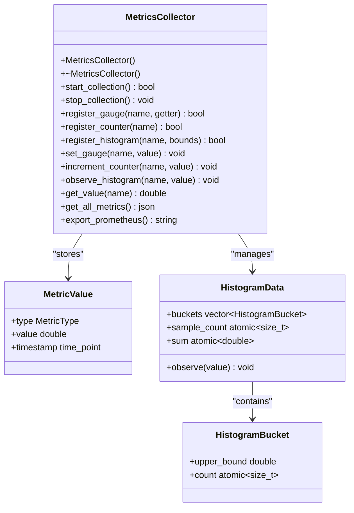

**Diagram sources**
- [metrics_collector.hpp](file://shared/metrics/metrics_collector.hpp#L1-L290)
- [metrics_collector.cpp](file://shared/metrics/metrics_collector.cpp#L1-L677)

**Section sources**
- [metrics_collector.hpp](file://shared/metrics/metrics_collector.hpp#L1-L290)
- [metrics_collector.cpp](file://shared/metrics/metrics_collector.cpp#L1-L677)

## Prometheus Integration

The integration with Prometheus is facilitated through the PrometheusMetricsCollector class, which serves as a facade for various specialized metrics collectors. This class coordinates the collection of metrics from different subsystems and formats them according to the Prometheus exposition format. The implementation includes specialized collectors for circuit breakers, LLM performance, compliance metrics, Redis cache, and system performance.

The PrometheusMetricsCollector exposes metrics through an HTTP endpoint that returns the complete set of metrics in the Prometheus text format. This allows Prometheus servers to scrape metrics at regular intervals. The implementation also includes a PrometheusClient class that enables querying metrics from a Prometheus server, supporting both instant queries and range queries through the Prometheus HTTP API.

```mermaid
classDiagram
class PrometheusMetricsCollector {
+initialize() bool
+shutdown() void
+get_circuit_breaker_collector() CircuitBreakerMetricsCollector&
+get_llm_collector() LLMMetricsCollector&
+get_compliance_collector() ComplianceMetricsCollector&
+get_redis_collector() RedisMetricsCollector&
+get_system_collector() SystemMetricsCollector&
+collect_all_metrics() string
+get_metrics_endpoint_response() string
}
class CircuitBreakerMetricsCollector {
+collect_metrics() vector~MetricDefinition~
+register_circuit_breaker(breaker) void
+unregister_circuit_breaker(name) void
}
class LLMMetricsCollector {
+record_api_call(provider, model, success, time, tokens, cost) void
+record_rate_limit_hit(provider) void
+record_circuit_breaker_event(provider, event_type) void
+collect_metrics() vector~MetricDefinition~
}
class ComplianceMetricsCollector {
+record_decision(agent_type, decision_type, processing_time, confidence, correct) void
+record_regulatory_ingestion(source, processed, found, time) void
+record_risk_assessment(entity_type, score, level, time) void
+collect_metrics() vector~MetricDefinition~
}
class RedisMetricsCollector {
+record_redis_operation(operation, cache_type, success, time, hit) void
+record_connection_pool_metrics(total, active, available) void
+record_cache_eviction(cache_type, count) void
+record_cache_size(cache_type, entries, memory) void
+collect_metrics() vector~MetricDefinition~
}
class SystemMetricsCollector {
+record_database_operation(operation, table, success, time, rows) void
+record_cache_operation(cache_type, operation, hit, time) void
+record_http_call(endpoint, method, status, time) void
+update_system_resources(cpu, memory, connections) void
+collect_metrics() vector~MetricDefinition~
}
PrometheusMetricsCollector --> CircuitBreakerMetricsCollector : "owns"
PrometheusMetricsCollector --> LLMMetricsCollector : "owns"
PrometheusMetricsCollector --> ComplianceMetricsCollector : "owns"
PrometheusMetricsCollector --> RedisMetricsCollector : "owns"
PrometheusMetricsCollector --> SystemMetricsCollector : "owns"
```

**Diagram sources**
- [prometheus_metrics.hpp](file://shared/metrics/prometheus_metrics.hpp#L1-L587)
- [prometheus_metrics.cpp](file://shared/metrics/prometheus_metrics.cpp#L1-L1115)

**Section sources**
- [prometheus_metrics.hpp](file://shared/metrics/prometheus_metrics.hpp#L1-L587)
- [prometheus_metrics.cpp](file://shared/metrics/prometheus_metrics.cpp#L1-L1115)

## Core Component Metrics

### Agent Metrics
The agent system exposes several metrics through the MetricsCollector, particularly in the AgentOrchestrator class. These include counters for tasks submitted, completed, and failed, as well as gauges for active agents and queue size. The implementation registers these metrics during initialization and updates them as tasks are processed.

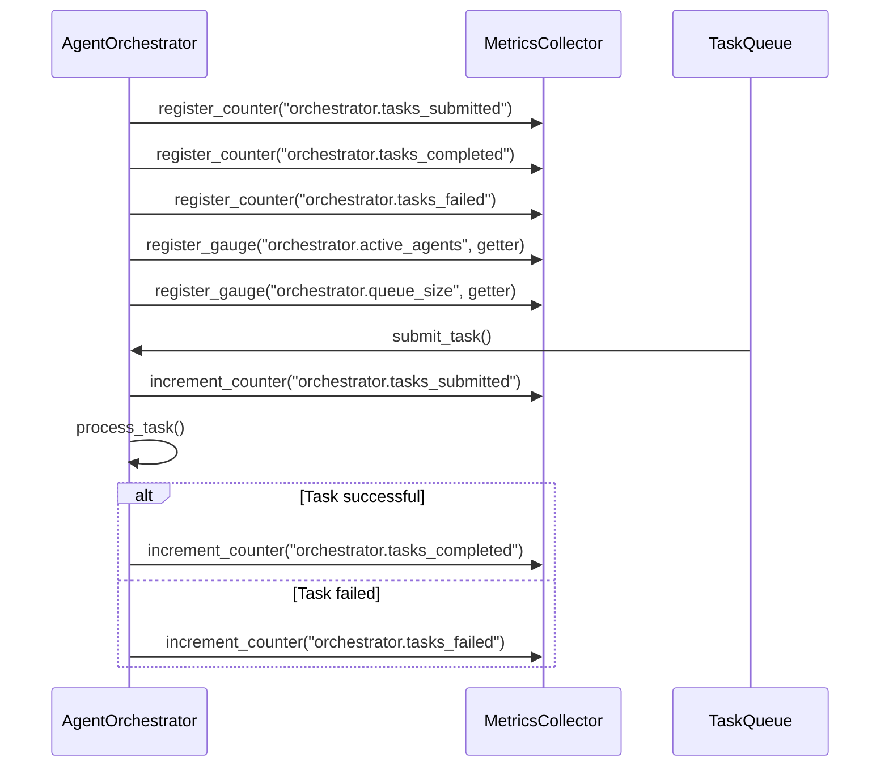

**Diagram sources**
- [agent_orchestrator.cpp](file://core/agent/agent_orchestrator.cpp#L706-L712)
- [agent_orchestrator.cpp](file://core/agent/agent_orchestrator.cpp#L837-L1080)

**Section sources**
- [agent_orchestrator.cpp](file://core/agent/agent_orchestrator.cpp#L706-L712)
- [agent_orchestrator.cpp](file://core/agent/agent_orchestrator.cpp#L837-L1080)

### Redis Cache Metrics
The Redis client implementation integrates with the Prometheus metrics system to track cache performance. The RedisClient class records metrics for each Redis operation, including operation type, cache type, success status, response time, and whether the operation was a cache hit. These metrics are collected by the RedisMetricsCollector and exposed through the Prometheus endpoint.

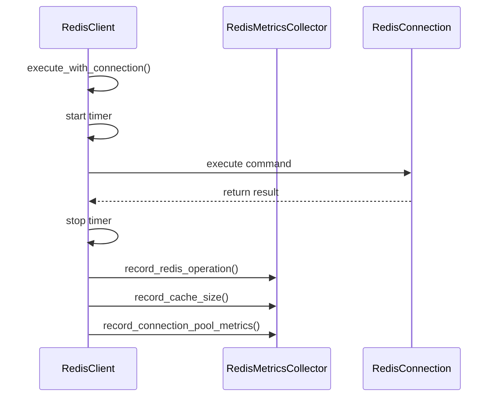

**Diagram sources**
- [redis_client.cpp](file://shared/cache/redis_client.cpp#L426-L436)
- [redis_client.cpp](file://shared/cache/redis_client.cpp#L1150-L1216)

**Section sources**
- [redis_client.cpp](file://shared/cache/redis_client.cpp#L426-L436)
- [redis_client.cpp](file://shared/cache/redis_client.cpp#L1150-L1216)

### LLM Interface Metrics
The LLM interface exposes detailed metrics about API usage, performance, and errors. The LLMMetricsCollector tracks the number of API calls to different providers (OpenAI, Anthropic), success rates, rate limit hits, and circuit breaker events. It also collects response time histograms and token usage statistics, providing comprehensive insights into LLM performance.

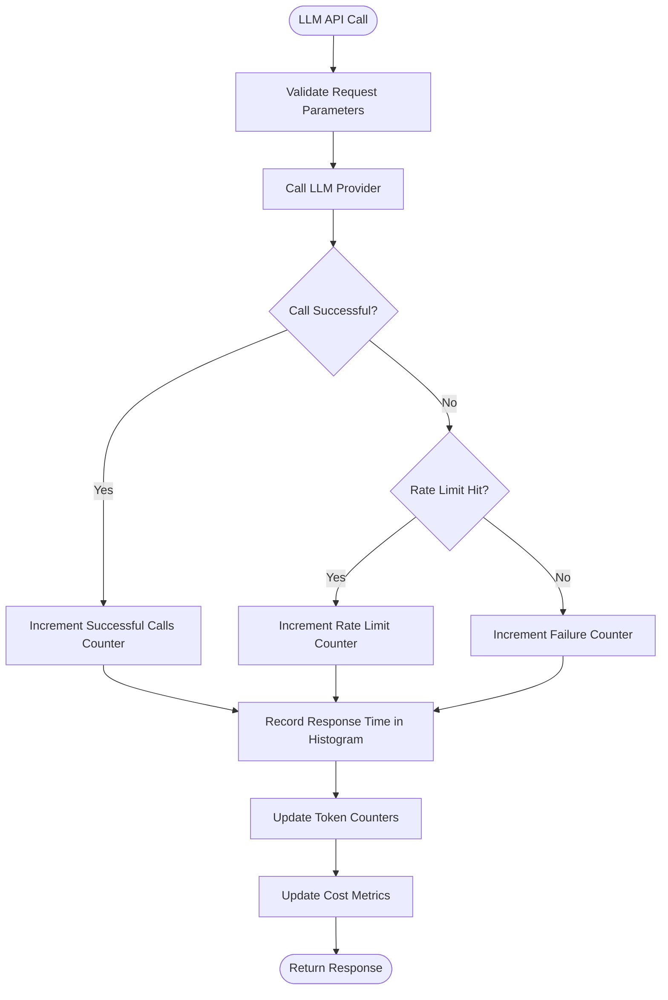

**Diagram sources**
- [prometheus_metrics.hpp](file://shared/metrics/prometheus_metrics.hpp#L136-L179)
- [prometheus_metrics.cpp](file://shared/metrics/prometheus_metrics.cpp#L197-L264)

**Section sources**
- [prometheus_metrics.hpp](file://shared/metrics/prometheus_metrics.hpp#L136-L179)
- [prometheus_metrics.cpp](file://shared/metrics/prometheus_metrics.cpp#L197-L264)

## Data Types and Use Cases

### Counter Metrics
Counters are monotonically increasing values that are ideal for tracking the total number of events. In the Regulens system, counters are used to track the number of tasks processed by agents, API calls to LLM providers, database operations, and HTTP requests. The implementation ensures thread-safe increments using atomic operations.

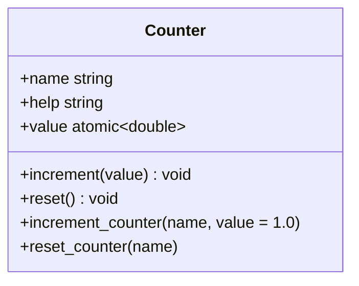

**Diagram sources**
- [metrics_collector.hpp](file://shared/metrics/metrics_collector.hpp#L146-L167)
- [metrics_collector.cpp](file://shared/metrics/metrics_collector.cpp#L188-L208)

**Section sources**
- [metrics_collector.hpp](file://shared/metrics/metrics_collector.hpp#L146-L167)
- [metrics_collector.cpp](file://shared/metrics/metrics_collector.cpp#L188-L208)

### Gauge Metrics
Gauges represent single values that can go up or down, making them suitable for tracking current system state such as the number of active connections, memory usage, or queue size. The implementation supports both direct value setting and dynamic gauges that use getter functions to provide current values.

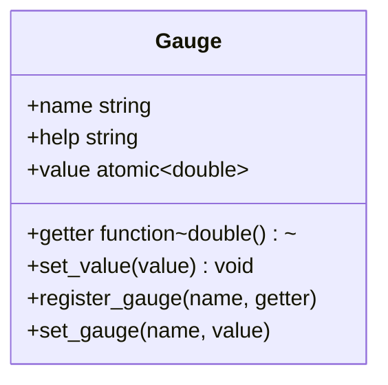

**Diagram sources**
- [metrics_collector.hpp](file://shared/metrics/metrics_collector.hpp#L146-L167)
- [metrics_collector.cpp](file://shared/metrics/metrics_collector.cpp#L155-L187)

**Section sources**
- [metrics_collector.hpp](file://shared/metrics/metrics_collector.hpp#L146-L167)
- [metrics_collector.cpp](file://shared/metrics/metrics_collector.cpp#L155-L187)

### Histogram Metrics
Histograms are used to measure the distribution of values, such as response times or processing durations. The implementation uses predefined buckets to categorize values and track the frequency of values within each bucket range. This allows for detailed analysis of performance characteristics and identification of outliers.

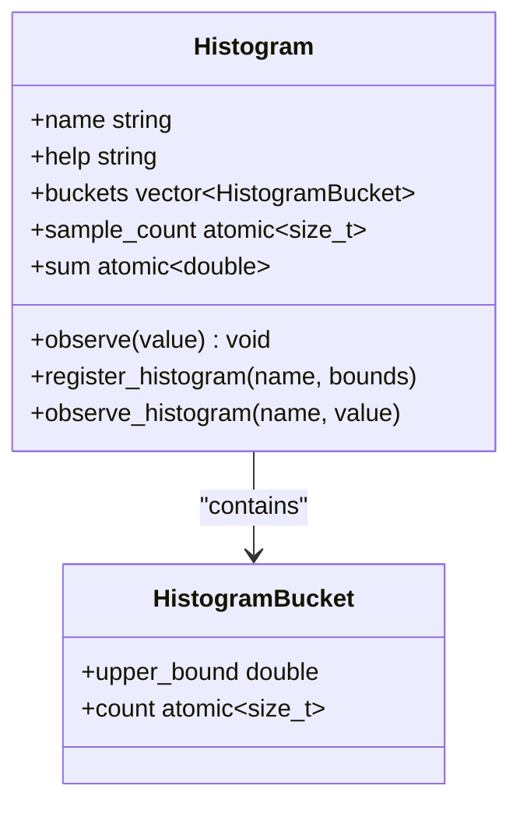

**Diagram sources**
- [metrics_collector.hpp](file://shared/metrics/metrics_collector.hpp#L146-L167)
- [metrics_collector.cpp](file://shared/metrics/metrics_collector.cpp#L208-L246)

**Section sources**
- [metrics_collector.hpp](file://shared/metrics/metrics_collector.hpp#L146-L167)
- [metrics_collector.cpp](file://shared/metrics/metrics_collector.cpp#L208-L246)

## Performance Considerations

### High-Frequency Metric Collection
The metrics collection system is designed to handle high-frequency metric updates with minimal performance impact. The implementation uses atomic operations for counter increments and histogram observations, avoiding the overhead of mutex locks for these common operations. For gauge metrics that require more complex calculations, the system uses a background thread to update values at regular intervals, reducing the impact on the main application flow.

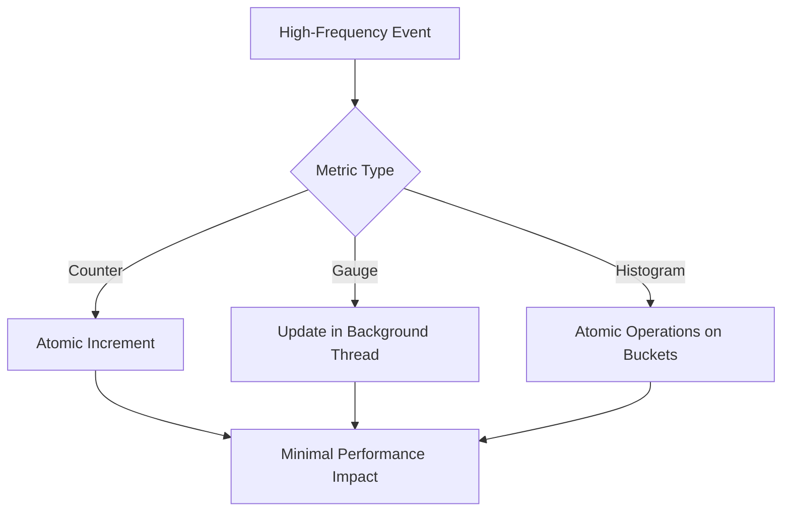

**Diagram sources**
- [metrics_collector.cpp](file://shared/metrics/metrics_collector.cpp#L599-L643)
- [metrics_collector.cpp](file://shared/metrics/metrics_collector.cpp#L306-L347)

**Section sources**
- [metrics_collector.cpp](file://shared/metrics/metrics_collector.cpp#L599-L643)
- [metrics_collector.cpp](file://shared/metrics/metrics_collector.cpp#L306-L347)

### Thread-Safe Access Patterns
The MetricsCollector class employs several thread-safe access patterns to ensure data integrity in concurrent environments. Atomic variables are used for simple operations like counter increments, while mutex locks protect more complex operations that involve multiple data structures. The implementation also uses copy-and-swap patterns for operations that require iterating over collections, minimizing the time spent holding locks.

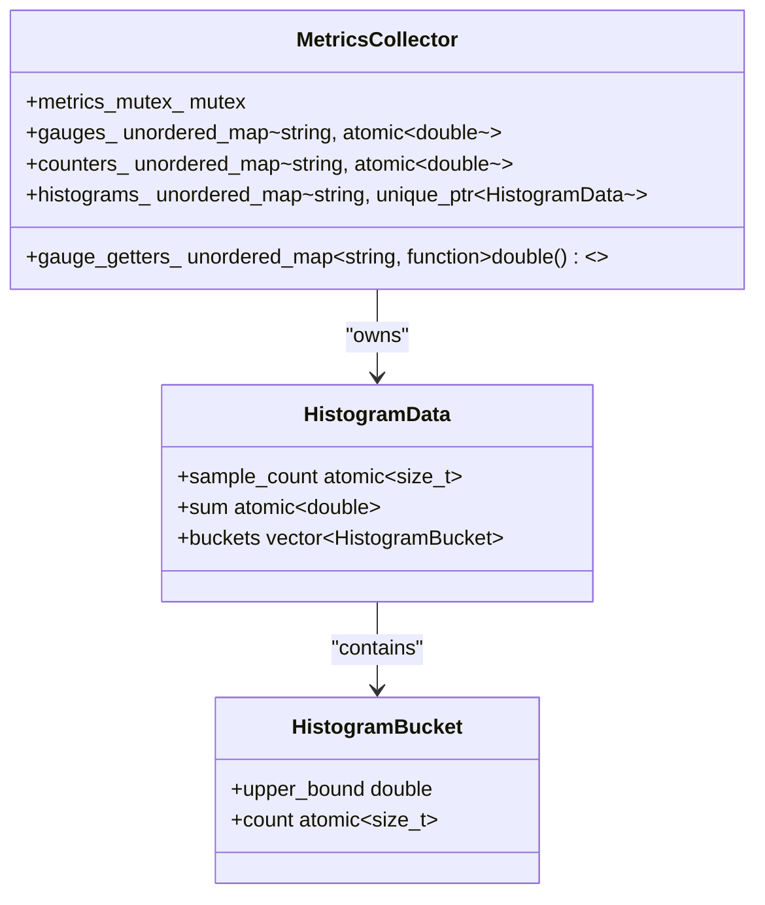

**Diagram sources**
- [metrics_collector.hpp](file://shared/metrics/metrics_collector.hpp#L1-L290)
- [metrics_collector.cpp](file://shared/metrics/metrics_collector.cpp#L1-L677)

**Section sources**
- [metrics_collector.hpp](file://shared/metrics/metrics_collector.hpp#L1-L290)
- [metrics_collector.cpp](file://shared/metrics/metrics_collector.cpp#L1-L677)

## Adding New Metrics

### Naming Conventions
The system follows consistent naming conventions for metrics to ensure clarity and consistency. Metric names use lowercase with underscores to separate words, and include the component name as a prefix. For example, "orchestrator.tasks_submitted" clearly indicates that this metric belongs to the orchestrator component and tracks submitted tasks. The naming convention helps with organization and makes it easier to query metrics in Prometheus.

### Label Strategies
Labels are used to add dimensions to metrics, allowing for more detailed analysis. The system uses labels to differentiate between different types of operations, components, or statuses. For example, the LLM metrics include labels for the provider (OpenAI, Anthropic) and model type, enabling detailed analysis of performance across different providers and models.

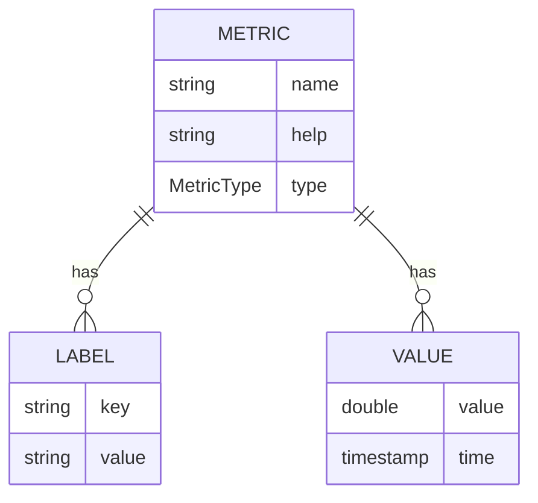

**Diagram sources**
- [prometheus_metrics.hpp](file://shared/metrics/prometheus_metrics.hpp#L50-L587)
- [prometheus_metrics.cpp](file://shared/metrics/prometheus_metrics.cpp#L1-L1115)

**Section sources**
- [prometheus_metrics.hpp](file://shared/metrics/prometheus_metrics.hpp#L50-L587)
- [prometheus_metrics.cpp](file://shared/metrics/prometheus_metrics.cpp#L1-L1115)

## Configuration Options

### Metric Collection Intervals
The system allows configuration of the metric collection interval through the collection_interval_ member variable. By default, the interval is set to 1000 milliseconds, but this can be adjusted based on performance requirements and monitoring needs. Shorter intervals provide more granular data but increase system overhead, while longer intervals reduce overhead but may miss short-lived spikes in activity.

### Sampling Rates
For high-frequency metrics, the system supports sampling to reduce the volume of data collected. This is particularly useful for histogram metrics that track response times or other performance characteristics. The implementation allows configuration of sampling rates through the bucket_bounds parameter when registering histogram metrics, enabling fine-tuning of the resolution and range of collected data.

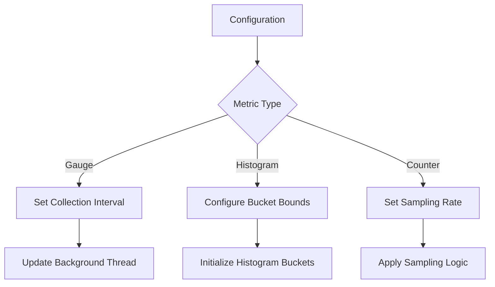

**Diagram sources**
- [metrics_collector.hpp](file://shared/metrics/metrics_collector.hpp#L1-L290)
- [metrics_collector.cpp](file://shared/metrics/metrics_collector.cpp#L1-L677)

**Section sources**
- [metrics_collector.hpp](file://shared/metrics/metrics_collector.hpp#L1-L290)
- [metrics_collector.cpp](file://shared/metrics/metrics_collector.cpp#L1-L677)

## Conclusion
The Metrics Collection subsystem in Regulens provides a comprehensive and extensible framework for monitoring system performance and operational health. The implementation combines a thread-safe MetricsCollector with specialized collectors for different subsystems, enabling detailed monitoring of agents, LLM interfaces, Redis cache, and other core components. The integration with Prometheus allows for centralized monitoring and alerting, while the flexible design supports adding new metrics and adapting to changing monitoring requirements. The system balances performance and functionality, using atomic operations and background threads to minimize impact on the main application flow while providing detailed insights into system behavior.