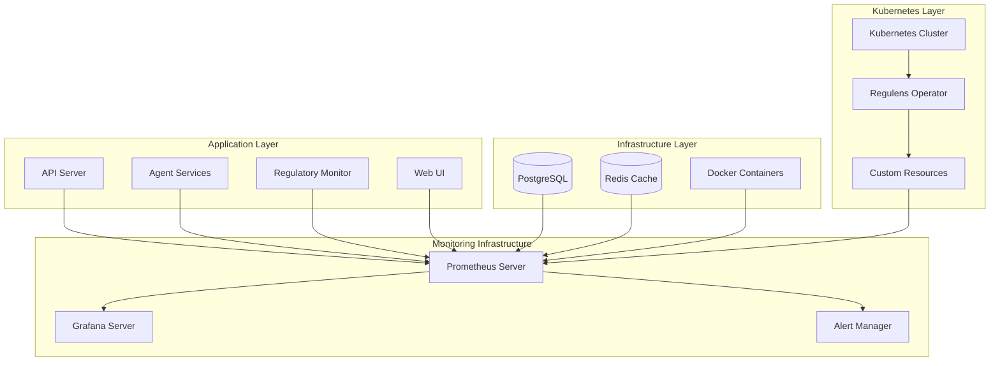
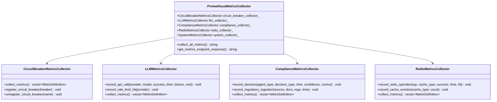
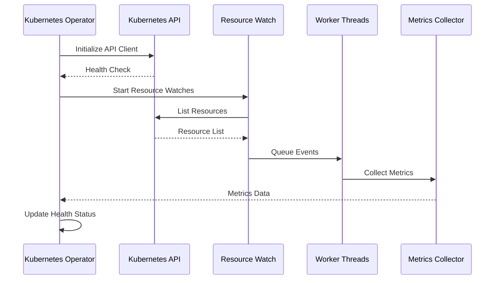
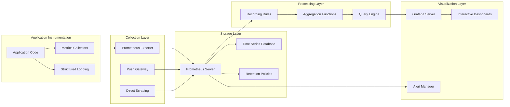
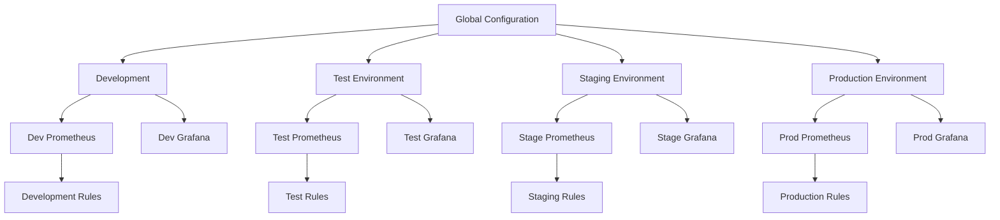

# Monitoring and Observability

<cite>
**Referenced Files in This Document**
- [infrastructure/monitoring/prometheus/alerting-rules.yml](file://infrastructure/monitoring/prometheus/alerting-rules.yml)
- [infrastructure/monitoring/grafana/dashboards/system-overview.json](file://infrastructure/monitoring/grafana/dashboards/system-overview.json)
- [shared/metrics/prometheus_metrics.cpp](file://shared/metrics/prometheus_metrics.cpp)
- [shared/metrics/prometheus_metrics.hpp](file://shared/metrics/prometheus_metrics.hpp)
- [shared/resilience/circuit_breaker.hpp](file://shared/resilience/circuit_breaker.hpp)
- [frontend/src/pages/SystemMetrics.tsx](file://frontend/src/pages/SystemMetrics.tsx)
- [frontend/src/types/api.ts](file://frontend/src/types/api.ts)
- [frontend/src/services/api.ts](file://frontend/src/services/api.ts)
- [docker-compose.yml](file://docker-compose.yml)
- [infrastructure/k8s/crds/agent_orchestrator_crd.yaml](file://infrastructure/k8s/crds/agent_orchestrator_crd.yaml)
- [infrastructure/k8s/operator/operator_framework.cpp](file://infrastructure/k8s/operator/operator_framework.cpp)
</cite>

## Table of Contents
1. [Introduction](#introduction)
2. [Architecture Overview](#architecture-overview)
3. [Observability Stack Components](#observability-stack-components)
4. [Metrics Collection System](#metrics-collection-system)
5. [Alerting and Notification System](#alerting-and-notification-system)
6. [Grafana Dashboards](#grafana-dashboards)
7. [Kubernetes Operator Monitoring](#kubernetes-operator-monitoring)
8. [Data Flow Architecture](#data-flow-architecture)
9. [Configuration Management](#configuration-management)
10. [Scalability Considerations](#scalability-considerations)
11. [Troubleshooting Guide](#troubleshooting-guide)
12. [Best Practices](#best-practices)

## Introduction

The Regulens platform implements a comprehensive monitoring and observability stack designed to provide real-time visibility into system health, performance metrics, and business-critical operations. The observability infrastructure consists of Prometheus for metrics collection, Grafana for visualization, and custom monitoring components integrated throughout the application architecture.

This system monitors all major components including agents, decision engines, LLM integrations, compliance operations, and infrastructure resources. It provides automated alerting, historical trend analysis, and comprehensive dashboards for operational excellence and regulatory compliance monitoring.

## Architecture Overview

The monitoring architecture follows a multi-layered approach with dedicated monitoring infrastructure deployed alongside the main application services.



**Diagram sources**
- [docker-compose.yml](file://docker-compose.yml#L1-L141)
- [infrastructure/k8s/crds/agent_orchestrator_crd.yaml](file://infrastructure/k8s/crds/agent_orchestrator_crd.yaml#L1-L205)

## Observability Stack Components

### Prometheus Metrics Server

Prometheus serves as the central metrics collection and storage system, configured with custom alerting rules and extensive metric exposure from all Regulens components.

**Key Features:**
- Multi-dimensional metrics with labels for granular filtering
- Automatic service discovery for containerized environments
- Persistent storage with configurable retention policies
- High availability configuration for production deployments

### Grafana Visualization Platform

Grafana provides interactive dashboards and visualization capabilities for all collected metrics, with pre-built templates for different operational domains.

**Dashboard Categories:**
- System Overview: Infrastructure health and resource utilization
- Compliance Operations: Regulatory monitoring and decision metrics
- LLM Performance: AI model performance and cost tracking
- Circuit Breaker Monitoring: Resilience system health
- Data Ingestion: Content processing and quality metrics

### Alert Manager

The Alert Manager handles notification routing, aggregation, and delivery for all configured alerting rules, supporting multiple notification channels.

**Notification Channels:**
- Email notifications for critical incidents
- Slack integration for team collaboration
- PagerDuty escalation for production issues
- Webhook integrations for custom systems

**Section sources**
- [infrastructure/monitoring/prometheus/alerting-rules.yml](file://infrastructure/monitoring/prometheus/alerting-rules.yml#L1-L446)
- [infrastructure/monitoring/grafana/dashboards/system-overview.json](file://infrastructure/monitoring/grafana/dashboards/system-overview.json#L1-L122)

## Metrics Collection System

The metrics collection system is built around a centralized Prometheus architecture with custom collectors integrated throughout the Regulens application.

### Core Metrics Collectors



**Diagram sources**
- [shared/metrics/prometheus_metrics.hpp](file://shared/metrics/prometheus_metrics.hpp#L1-L588)
- [shared/metrics/prometheus_metrics.cpp](file://shared/metrics/prometheus_metrics.cpp#L1-L1135)

### Key Metric Categories

#### System Health Metrics
- CPU and memory utilization across all containers
- Disk space and network I/O statistics
- Active connections and request rates
- Error rates and response times

#### Circuit Breaker Metrics
- State transitions (Closed, Open, Half-Open)
- Failure and success rates
- Recovery attempts and success rates
- Request rejection counts during circuit open state

#### LLM Performance Metrics
- API call success/failure rates by provider
- Response time percentiles (P50, P95, P99)
- Token usage and estimated costs
- Rate limit hits and circuit breaker events

#### Compliance Operation Metrics
- Decision accuracy and processing times
- Regulatory document ingestion rates
- Risk assessment distribution by severity
- Agent performance and task completion rates

#### Data Ingestion Metrics
- Document processing throughput
- Quality check pass/fail rates
- Source synchronization status
- Staleness detection for regulatory data

**Section sources**
- [shared/metrics/prometheus_metrics.cpp](file://shared/metrics/prometheus_metrics.cpp#L1-L1135)
- [shared/metrics/prometheus_metrics.hpp](file://shared/metrics/prometheus_metrics.hpp#L1-L588)

## Alerting and Notification System

The alerting system is configured with comprehensive rules covering all critical system components and business operations.

### Alert Categories and Thresholds

```mermaid
flowchart TD
AlertRules[Alert Rules Engine] --> SystemHealth[System Health Alerts]
AlertRules --> CircuitBreaker[Circuit Breaker Alerts]
AlertRules --> LLMPerformance[LLM Performance Alerts]
AlertRules --> ComplianceOps[Compliance Operation Alerts]
AlertRules --> DataIngestion[Data Ingestion Alerts]
AlertRules --> Security[Security Alerts]
SystemHealth --> ServiceDown[Service Down - 5m]
SystemHealth --> HighErrorRate[High Error Rate - 10%]
SystemHealth --> HighMemory[High Memory Usage - 85%]
SystemHealth --> HighCPU[High CPU Usage - 80%]
CircuitBreaker --> CBOpen[Circuit Breaker Open - 1m]
CircuitBreaker --> CBHighFailure[High Failure Rate - 20%]
CircuitBreaker --> CBHighLatency[High Latency - 10s]
LLMPerformance --> LLMUnavailable[LLM API Unavailable]
LLMPerformance --> LLMHighError[High LLM Error Rate - 15%]
LLMPerformance --> LLMHighLatency[High LLM Latency - 30s]
LLMPerformance --> LLMHighCost[High LLM Costs - $100/min]
ComplianceOps --> ComplDecisionFail[High Decision Failure - 10%]
ComplianceOps --> ComplLowAccuracy[Low Accuracy - 95%]
ComplianceOps --> ComplHighLatency[High Processing Latency - 60s]
DataIngestion --> DataFail[High Ingestion Failure - 15%]
DataIngestion --> DataHighLatency[High Latency - 300s]
DataIngestion --> DataStale[Stale Data - 24h]
```



**Diagram sources**
- [infrastructure/monitoring/prometheus/alerting-rules.yml](file://infrastructure/monitoring/prometheus/alerting-rules.yml#L1-L446)

### Alert Severity Levels

- **Critical**: Immediate action required (service down, high error rates)
- **Warning**: Proactive monitoring needed (approaching thresholds)
- **Info**: Operational information (low cache hit rates, low activity)

### Notification Delivery

The system supports multiple notification channels with intelligent routing:

- **Email**: Detailed incident reports for critical issues
- **Slack**: Real-time alerts for team collaboration
- **PagerDuty**: Escalation procedures for production incidents
- **Webhooks**: Integration with custom monitoring systems

**Section sources**
- [infrastructure/monitoring/prometheus/alerting-rules.yml](file://infrastructure/monitoring/prometheus/alerting-rules.yml#L1-L446)

## Grafana Dashboards

The Grafana deployment includes specialized dashboards for different operational domains, providing real-time insights and historical trend analysis.

### System Overview Dashboard

The primary dashboard provides consolidated views of system health across all monitored components.

**Key Panels:**
- **System Health Status**: Overall service availability
- **Resource Utilization**: CPU, memory, and disk usage
- **Request Metrics**: Throughput and error rates
- **Health Check Status**: Component-specific health indicators

### Specialized Dashboards

#### Circuit Breaker Monitoring
- Real-time circuit breaker states
- Failure rate trends
- Recovery success rates
- Performance impact analysis

#### Compliance Operations
- Decision processing metrics
- Regulatory change detection
- Risk assessment accuracy
- Agent performance tracking

#### LLM Performance
- Provider-specific metrics
- Cost tracking and optimization
- Response time analysis
- Token usage patterns

#### Kubernetes Operators
- Resource health status
- Reconciliation performance
- Scaling events
- Custom resource lifecycle

**Section sources**
- [infrastructure/monitoring/grafana/dashboards/system-overview.json](file://infrastructure/monitoring/grafana/dashboards/system-overview.json#L1-L122)
- [frontend/src/pages/SystemMetrics.tsx](file://frontend/src/pages/SystemMetrics.tsx#L1-L375)

## Kubernetes Operator Monitoring

The Kubernetes operator implements comprehensive monitoring capabilities for managing custom resources and maintaining system health.

### Operator Health Metrics



**Diagram sources**
- [infrastructure/k8s/operator/operator_framework.cpp](file://infrastructure/k8s/operator/operator_framework.cpp#L1-L953)

### Custom Resource Monitoring

The operator monitors custom resources with detailed metrics and health checks:

- **Resource Lifecycle**: Creation, modification, deletion events
- **Reconciliation Performance**: Processing time and success rates
- **Scaling Events**: Horizontal and vertical scaling metrics
- **Error Rates**: Failed operations and retry attempts

### CRD Configuration Monitoring

Custom Resource Definitions include comprehensive monitoring configurations:

- **Prometheus Integration**: Automatic metric exposure
- **Grafana Dashboards**: Pre-built visualization templates
- **Alerting Rules**: Domain-specific alerting criteria
- **Resource Limits**: Performance and capacity monitoring

**Section sources**
- [infrastructure/k8s/crds/agent_orchestrator_crd.yaml](file://infrastructure/k8s/crds/agent_orchestrator_crd.yaml#L1-L205)
- [infrastructure/k8s/operator/operator_framework.cpp](file://infrastructure/k8s/operator/operator_framework.cpp#L1-L953)

## Data Flow Architecture

The monitoring data flows through a well-defined pipeline from application instrumentation to visualization and alerting.



### Data Collection Strategies

#### Pull-Based Collection
- Prometheus scrapes metrics endpoints at regular intervals
- Automatic service discovery for containerized environments
- Configurable scrape intervals and timeouts
- Health checks and retry mechanisms

#### Push-Based Collection
- Applications push metrics to Prometheus Push Gateway
- Useful for batch processing and ephemeral jobs
- Temporary storage with TTL policies
- Integration with long-running processes

#### Direct Integration
- Embedded metrics collectors in application code
- Low-latency metric exposure
- Custom metric types and aggregations
- Real-time processing capabilities

## Configuration Management

The monitoring system uses a hierarchical configuration approach supporting multiple environments and deployment scenarios.

### Environment-Specific Configuration



### Configuration Categories

#### Prometheus Configuration
- Scrape intervals and timeouts
- Storage retention policies
- Remote write/read configurations
- Alerting route configurations

#### Grafana Configuration
- Dashboard provisioning
- Data source configurations
- Notification channel setups
- User permission management

#### Alert Manager Configuration
- Route hierarchies
- Receiver configurations
- Grouping and inhibition rules
- Template customization

### Dynamic Configuration Updates

The system supports hot-reloading of configurations without service interruption:

- **Configuration Validation**: Pre-flight validation before updates
- **Rollback Mechanisms**: Automatic rollback on configuration errors
- **Gradual Rollouts**: Staged configuration updates
- **Monitoring**: Real-time validation of configuration changes

## Scalability Considerations

The monitoring infrastructure is designed to scale horizontally and handle large-scale deployments efficiently.

### Horizontal Scaling Strategies

#### Prometheus Federation
- Hierarchical federation for multi-cluster deployments
- Selective metric aggregation and downsampling
- Regional Prometheus servers with global aggregation
- Cross-cluster metric queries and alerting

#### Grafana Scaling
- Multi-instance Grafana deployments
- Load balancing with sticky sessions
- Database sharding for large datasets
- CDN integration for static assets

#### Alert Manager Clustering
- High availability alert manager clusters
- Consistent hashing for alert routing
- Distributed deduplication and grouping
- Failover mechanisms for cluster nodes

### Performance Optimization

#### Metric Cardinality Management
- Label explosion prevention
- High-cardinality metric filtering
- Bucket-based downsampling strategies
- Metric lifecycle management

#### Storage Optimization
- Compression and retention policies
- Tiered storage configurations
- Query optimization and caching
- Index performance tuning

#### Network Optimization
- Efficient scraping protocols
- Compression for metric transfers
- Batch processing for high-frequency metrics
- Geographic distribution for global deployments

### Resource Planning Guidelines

#### Memory Requirements
- **Prometheus**: 1GB per million samples stored
- **Grafana**: 1GB base + 10MB per dashboard
- **Alert Manager**: 100MB base + 1MB per receiver

#### CPU Requirements
- **Prometheus**: 1 CPU core per 100K samples/second
- **Grafana**: 1 CPU core per 100 concurrent users
- **Alert Manager**: 1 CPU core per 10K alerts/minute

#### Storage Requirements
- **Prometheus**: 1GB per million samples
- **Retention**: 2-4 weeks for production, 1-2 months for development
- **Backup**: Daily snapshots with weekly full backups

## Troubleshooting Guide

### Common Issues and Solutions

#### Metrics Not Appearing in Grafana

**Symptoms:**
- Missing dashboards or panels
- Empty graphs or charts
- "No data" messages

**Diagnosis Steps:**
1. Verify Prometheus scraping configuration
2. Check metric endpoint accessibility
3. Review Prometheus logs for scrape errors
4. Validate metric format and labels

**Resolution:**
```bash
# Check scraping targets
curl http://prometheus:9090/api/v1/targets

# Validate metric format
curl http://app:8080/metrics | head -20

# Check Prometheus logs
docker logs prometheus
```

#### High Memory Usage in Prometheus

**Symptoms:**
- Out of memory errors
- Slow query performance
- High GC pressure

**Diagnosis Steps:**
1. Analyze metric cardinality
2. Review retention policies
3. Check for label explosion
4. Monitor query patterns

**Resolution:**
```yaml
# Reduce retention period
global:
  retention_time: 15d

# Configure recording rules
rule_files:
  - "recording_rules.yml"

# Enable remote write
remote_write:
  - url: "http://remote-prometheus/write"
```

#### Alert Notifications Not Delivering

**Symptoms:**
- Alerts firing but no notifications
- Delayed or missing notifications
- Notification delivery failures

**Diagnosis Steps:**
1. Check Alert Manager configuration
2. Verify receiver endpoints
3. Review notification templates
4. Monitor webhook responses

**Resolution:**
```yaml
# Alert Manager receivers
receivers:
- name: 'email-notifications'
  email_configs:
  - to: 'alerts@company.com'
    smtp_server: 'smtp.company.com'
    smtp_port: 587
```

### Diagnostic Tools and Commands

#### Prometheus Debugging
```bash
# Check Prometheus health
curl http://prometheus:9090/-/healthy

# Query metric cardinality
curl 'http://prometheus:9090/api/v1/status/tsdb'

# Validate alerting rules
curl -X POST http://prometheus:9090/api/v1/rules \
  -d '{"rule_group": "test_group", "rules": [{"alert": "Test", "expr": "up == 0"}]}'
```

#### Grafana Troubleshooting
```bash
# Check Grafana connectivity
curl http://grafana:3000/api/health

# List dashboards
curl http://grafana:3000/api/search

# Validate datasource
curl -X POST http://grafana:3000/api/datasources/validate \
  -H "Content-Type: application/json" \
  -d '{"type": "prometheus", "url": "http://prometheus:9090"}'
```

#### Kubernetes Monitoring
```bash
# Check operator health
kubectl get pods -n regulens-system

# View operator logs
kubectl logs -n regulens-system -l app=regulens-operator

# Check custom resource status
kubectl describe agentorchestrators -n regulens-system
```

## Best Practices

### Metric Design Principles

#### Naming Conventions
- Use lowercase with underscores: `regulens_component_metric_name`
- Include component and subsystem: `regulens_llm_openai_requests_total`
- Use consistent units: `seconds`, `bytes`, `percent`
- Avoid abbreviations: `response_time_ms` vs `rt_ms`

#### Label Usage Guidelines
- Limit label cardinality: 10-20 labels per metric
- Use meaningful label names: `provider`, `status`, `severity`
- Avoid high-cardinality labels: timestamps, user IDs
- Apply label filters early in queries

#### Metric Types Selection
- **Counters**: Cumulative values (requests, errors)
- **Gauges**: Instantaneous values (memory usage, queue length)
- **Histograms**: Distribution of values (response times)
- **Summaries**: Quantile calculations (latency percentiles)

### Alerting Best Practices

#### Alert Rule Design
- **Meaningful thresholds**: Based on business impact, not arbitrary values
- **Appropriate time windows**: Consider natural patterns and seasonality
- **Clear alert messages**: Include actionable information and context
- **Escalation procedures**: Define clear next steps for each severity level

#### Notification Management
- **Reduce noise**: Use grouping and inhibition rules effectively
- **Channel selection**: Match notification type to issue severity
- **Template consistency**: Standardize alert message formats
- **Review frequency**: Regular evaluation of alert effectiveness

### Operational Excellence

#### Monitoring Coverage
- **Infrastructure**: Host-level metrics and system health
- **Application**: Business logic and performance metrics
- **Business**: KPIs and user experience indicators
- **Security**: Access patterns and anomaly detection

#### Maintenance Procedures
- **Regular reviews**: Quarterly evaluation of metrics and alerts
- **Capacity planning**: Proactive resource allocation
- **Documentation**: Maintain operational runbooks and procedures
- **Training**: Regular team education on monitoring tools

### Security Considerations

#### Access Control
- **Principle of least privilege**: Minimal permissions for monitoring access
- **Role-based access**: Separate permissions for operators and analysts
- **Audit trails**: Comprehensive logging of monitoring system access
- **Encryption**: Secure transmission of sensitive metrics data

#### Data Protection
- **Sensitive data filtering**: Remove PII from metrics and logs
- **Retention policies**: Compliance with data protection regulations
- **Secure storage**: Encrypted metric storage and backup procedures
- **Access logging**: Track all metric data access and modifications