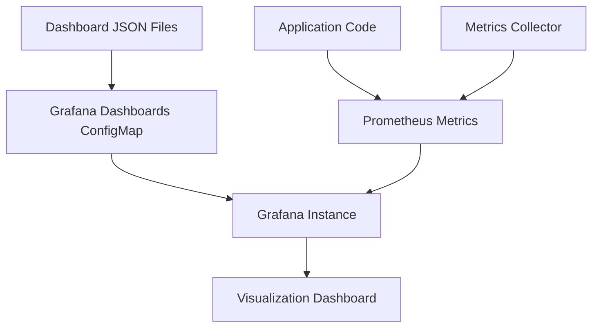
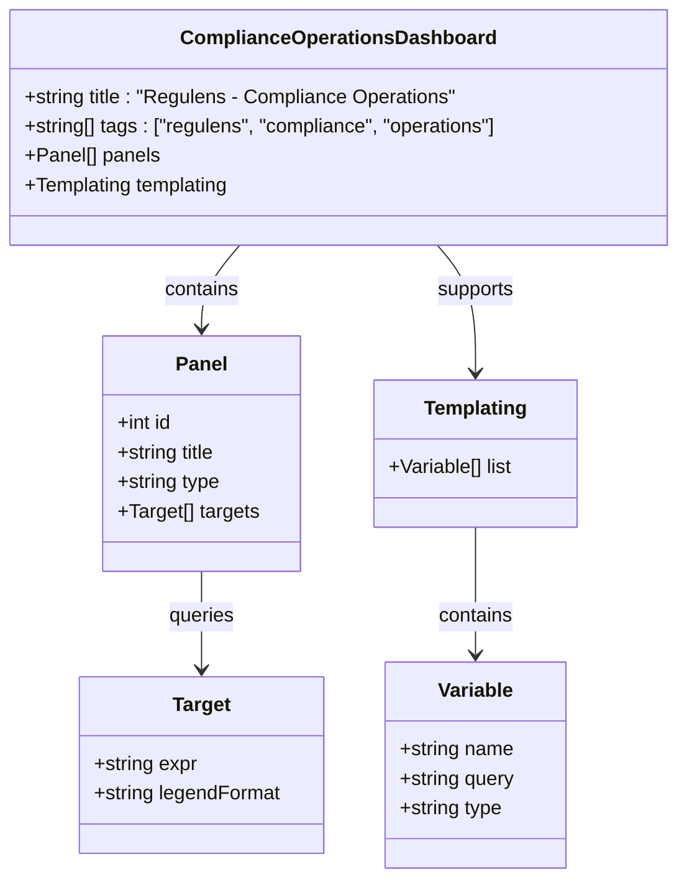
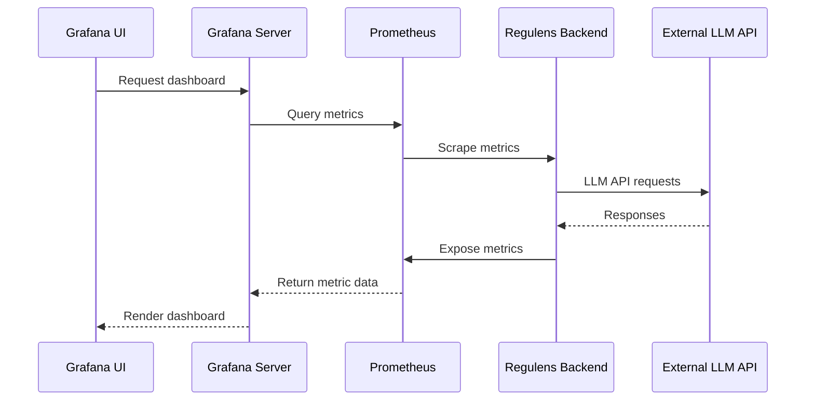

# Visualization Dashboards

<cite>
**Referenced Files in This Document**   
- [compliance-operations.json](file://infrastructure/monitoring/grafana/dashboards/compliance-operations.json)
- [llm-performance.json](file://infrastructure/monitoring/grafana/dashboards/llm-performance.json)
- [system-overview.json](file://infrastructure/monitoring/grafana/dashboards/system-overview.json)
- [grafana-dashboards-configmap.yaml](file://infrastructure/monitoring/grafana/grafana-dashboards-configmap.yaml)
- [alerting-rules.yml](file://infrastructure/monitoring/prometheus/alerting-rules.yml)
- [SystemHealth.tsx](file://frontend/src/pages/SystemHealth.tsx)
- [Dashboard.tsx](file://frontend/src/pages/Dashboard.tsx)
- [useDashboardData.ts](file://frontend/src/hooks/useDashboardData.ts)
- [api.ts](file://frontend/src/types/api.ts)
- [metrics_collector.cpp](file://shared/metrics/metrics_collector.cpp)
- [metrics_collector.hpp](file://shared/metrics/metrics_collector.hpp)
- [prometheus_client.cpp](file://shared/metrics/prometheus_client.cpp)
- [prometheus_metrics.cpp](file://shared/metrics/prometheus_metrics.cpp)
</cite>

## Table of Contents
1. [Introduction](#introduction)
2. [Dashboard Management via ConfigMaps](#dashboard-management-via-configmaps)
3. [Compliance Operations Dashboard](#compliance-operations-dashboard)
4. [LLM Performance Dashboard](#llm-performance-dashboard)
5. [System Overview Dashboard](#system-overview-dashboard)
6. [Interpreting Dashboard Data](#interpreting-dashboard-data)
7. [Customizing and Extending Dashboards](#customizing-and-extending-dashboards)
8. [Conclusion](#conclusion)

## Introduction
The Regulens platform provides comprehensive visualization dashboards through Grafana for monitoring system health, compliance operations, and LLM performance. These dashboards are integral to the platform's observability, enabling stakeholders to track regulatory change processing, policy generation metrics, infrastructure health, and AI model performance. The dashboards are configured through Kubernetes ConfigMaps and integrated with Prometheus for metrics collection, providing real-time insights into the system's operational status and performance characteristics.

## Dashboard Management via ConfigMaps
The Grafana dashboards are managed through Kubernetes ConfigMaps, enabling version-controlled, declarative configuration of visualization components. This approach ensures consistency across environments and facilitates automated deployment workflows.



**Diagram sources**
- [grafana-dashboards-configmap.yaml](file://infrastructure/monitoring/grafana/grafana-dashboards-configmap.yaml)
- [compliance-operations.json](file://infrastructure/monitoring/grafana/dashboards/compliance-operations.json)
- [llm-performance.json](file://infrastructure/monitoring/grafana/dashboards/llm-performance.json)

The `grafana-dashboards-configmap.yaml` file defines a ConfigMap that contains all dashboard configurations as JSON data entries. Each dashboard is stored as a separate key-value pair within the ConfigMap, allowing for individual updates without affecting other dashboards. This configuration is deployed to the Kubernetes cluster where Grafana mounts it as a volume, automatically detecting and loading the dashboards.

**Section sources**
- [grafana-dashboards-configmap.yaml](file://infrastructure/monitoring/grafana/grafana-dashboards-configmap.yaml)

## Compliance Operations Dashboard
The Compliance Operations dashboard provides comprehensive monitoring of regulatory change processing and policy generation activities. It tracks key metrics related to compliance decision-making, risk assessment, and regulatory update processing.



**Diagram sources**
- [compliance-operations.json](file://infrastructure/monitoring/grafana/dashboards/compliance-operations.json)

The dashboard includes several key visualization panels:
- **Compliance Decision Rate**: Tracks the rate of compliance decisions by type using the `rate(regulens_compliance_decisions_total[5m])` metric
- **Compliance Decision Accuracy**: Monitors accuracy percentages for different decision types
- **Compliance Processing Time**: Displays P95 and P50 processing times for compliance operations
- **Regulatory Updates Processed**: Shows the rate of regulatory updates processed from various sources
- **Compliance Agent Performance**: Provides a table view of individual agent performance metrics
- **Compliance Coverage by Jurisdiction**: Visualizes compliance coverage across different regulatory jurisdictions using a pie chart

The dashboard features templating with a `decision_type` variable that allows users to filter metrics by specific decision types, enhancing the flexibility of data analysis. This enables stakeholders to focus on particular aspects of compliance operations relevant to their responsibilities.

**Section sources**
- [compliance-operations.json](file://infrastructure/monitoring/grafana/dashboards/compliance-operations.json)
- [metrics_collector.cpp](file://shared/metrics/metrics_collector.cpp)
- [prometheus_metrics.cpp](file://shared/metrics/prometheus_metrics.cpp)

## LLM Performance Dashboard
The LLM Performance dashboard tracks critical metrics related to large language model operations, including token usage, response latency, and error rates. This dashboard is essential for monitoring AI model performance and cost efficiency.



**Diagram sources**
- [llm-performance.json](file://infrastructure/monitoring/grafana/dashboards/llm-performance.json)
- [prometheus_client.cpp](file://shared/metrics/prometheus_client.cpp)

Key panels in the LLM Performance dashboard include:
- **LLM API Request Rate**: Monitors the rate of requests to LLM providers using `rate(regulens_llm_requests_total[5m])`
- **LLM API Success Rate**: Tracks the percentage of successful LLM requests
- **LLM API Response Time**: Displays P95 and P50 response times for LLM requests
- **LLM Token Usage**: Shows the rate of token consumption by provider and type (input/output)
- **LLM Cost per Minute**: Estimates the cost of LLM operations in USD per minute
- **LLM Cache Hit Rate**: Monitors the effectiveness of the LLM response caching system
- **LLM Error Rate by Type**: Breaks down errors by provider and error type

The dashboard includes provider-specific templating through the `provider` variable, allowing users to filter metrics by specific LLM providers such as OpenAI or Anthropic. This enables detailed analysis of individual provider performance and cost characteristics.

**Section sources**
- [llm-performance.json](file://infrastructure/monitoring/grafana/dashboards/llm-performance.json)
- [metrics_collector.cpp](file://shared/metrics/metrics_collector.cpp)
- [prometheus_metrics.cpp](file://shared/metrics/prometheus_metrics.cpp)

## System Overview Dashboard
The System Overview dashboard provides a comprehensive view of the platform's infrastructure health and performance metrics. It serves as the primary monitoring interface for system administrators and operations teams.

```mermaid
flowchart TD
A[System Overview Dashboard] --> B[System Health Status]
A --> C[Active Connections]
A --> D[CPU Usage]
A --> E[Memory Usage]
A --> F[Request Rate]
A --> G[Error Rate]
A --> H[Health Check Status]
B --> I[Instance Status: UP/DOWN]
D --> J[CPU Usage %]
E --> K[Memory Usage (MB)]
F --> L[Requests/sec]
G --> M[Error Rate %]
H --> N[Health Check Details]
style A fill:#f9f,stroke:#333
style B fill:#bbf,stroke:#333
style C fill:#bbf,stroke:#333
style D fill:#bbf,stroke:#333
style E fill:#bbf,stroke:#333
style F fill:#bbf,stroke:#333
style G fill:#bbf,stroke:#333
style H fill:#bbf,stroke:#333
```

**Diagram sources**
- [system-overview.json](file://infrastructure/monitoring/grafana/dashboards/system-overview.json)

The dashboard features the following key components:
- **System Health Status**: A stat panel showing the UP/DOWN status of system instances with color-coded indicators
- **Active Connections**: Tracks the number of active connections to the system
- **CPU Usage**: Monitors CPU utilization as a percentage
- **Memory Usage**: Displays memory consumption in megabytes
- **Request Rate**: Shows the rate of HTTP requests processed by the system
- **Error Rate**: Tracks the percentage of HTTP requests resulting in 5xx errors
- **Health Check Status**: Provides a detailed table view of various health check results

The System Overview dashboard serves as the first point of contact for identifying system-wide issues and monitoring overall platform stability. It integrates with Prometheus alerting rules to provide early warnings of potential problems.

**Section sources**
- [system-overview.json](file://infrastructure/monitoring/grafana/dashboards/system-overview.json)
- [SystemHealth.tsx](file://frontend/src/pages/SystemHealth.tsx)
- [useDashboardData.ts](file://frontend/src/hooks/useDashboardData.ts)

## Interpreting Dashboard Data
Effective interpretation of dashboard data requires understanding the metrics, their relationships, and appropriate response strategies for identified issues.

### Data Refresh and Time Ranges
All dashboards are configured with a 30-second refresh interval, ensuring near real-time visibility into system operations. The default time range is set to "last 1 hour," but users can adjust this to analyze trends over longer periods such as 6 hours, 24 hours, or custom ranges. The time picker allows for precise analysis of specific time windows, which is particularly useful for investigating incidents or analyzing performance during peak usage periods.

### Identifying Trends
To identify meaningful trends, users should:
- Look for sustained patterns rather than transient spikes
- Compare current metrics against historical baselines
- Correlate related metrics across different dashboards
- Use the dashboard's annotation features to mark significant events

For example, a sustained increase in LLM response latency coupled with rising error rates may indicate provider-side issues or rate limiting, while gradual increases in memory usage could suggest a memory leak that requires investigation.

### Diagnosing Issues
When diagnosing issues, follow a systematic approach:
1. Start with the System Overview dashboard to assess overall health
2. Drill down into specific component dashboards based on symptoms
3. Correlate metrics across related dashboards
4. Check for active alerts in the Prometheus alerting system

The platform's alerting rules (defined in `alerting-rules.yml`) provide automated detection of common issues such as service downtime, high error rates, resource exhaustion, and performance degradation. These alerts are integrated with the dashboards, allowing users to quickly identify and respond to critical issues.

**Section sources**
- [alerting-rules.yml](file://infrastructure/monitoring/prometheus/alerting-rules.yml)
- [system-overview.json](file://infrastructure/monitoring/grafana/dashboards/system-overview.json)
- [llm-performance.json](file://infrastructure/monitoring/grafana/dashboards/llm-performance.json)

## Customizing and Extending Dashboards
The Grafana dashboards can be customized and extended to meet specific monitoring requirements.

### Creating New Panels
To create new panels:
1. Navigate to the desired dashboard in Grafana
2. Click the "Add Panel" button
3. Configure the visualization type and data source
4. Write PromQL queries to retrieve the desired metrics
5. Customize the visualization options and save

When creating new panels, reference existing metrics in the codebase such as those registered in the `MetricsCollector` class. Common metric patterns include:
- Counters: `*_total` (monotonically increasing)
- Gauges: `*_current`, `*_count` (single values)
- Histograms: `*_duration_seconds_bucket` (distributions)

### Sharing Views
Dashboard views can be shared through:
- Direct URL sharing with specific time ranges and variable values
- Exporting dashboard snapshots
- Setting up scheduled report generation
- Creating dashboard links with embedded parameters

### Dashboard Templating
The dashboards support templating variables that enable dynamic filtering. To add new template variables:
1. Edit the dashboard settings
2. Navigate to the "Variables" section
3. Add a new variable with a query that retrieves possible values from Prometheus
4. Apply the variable to relevant panel queries using `{{variable_name}}` syntax

This templating system allows for flexible, user-driven data exploration without requiring manual query modification.

**Section sources**
- [grafana-dashboards-configmap.yaml](file://infrastructure/monitoring/grafana/grafana-dashboards-configmap.yaml)
- [metrics_collector.hpp](file://shared/metrics/metrics_collector.hpp)
- [prometheus_client.cpp](file://shared/metrics/prometheus_client.cpp)

## Conclusion
The Visualization Dashboards in the Regulens platform provide comprehensive monitoring capabilities for compliance operations, LLM performance, and system health. Managed through Kubernetes ConfigMaps, these dashboards offer a flexible, version-controlled approach to visualization configuration. By leveraging Prometheus metrics collected from the application codebase, the dashboards deliver real-time insights that enable proactive issue detection and performance optimization. Users can interpret trends, diagnose issues, and customize dashboards to meet evolving monitoring requirements, ensuring the platform maintains high reliability and compliance standards.