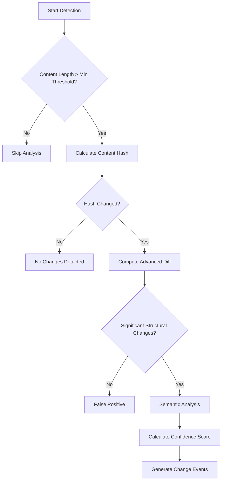
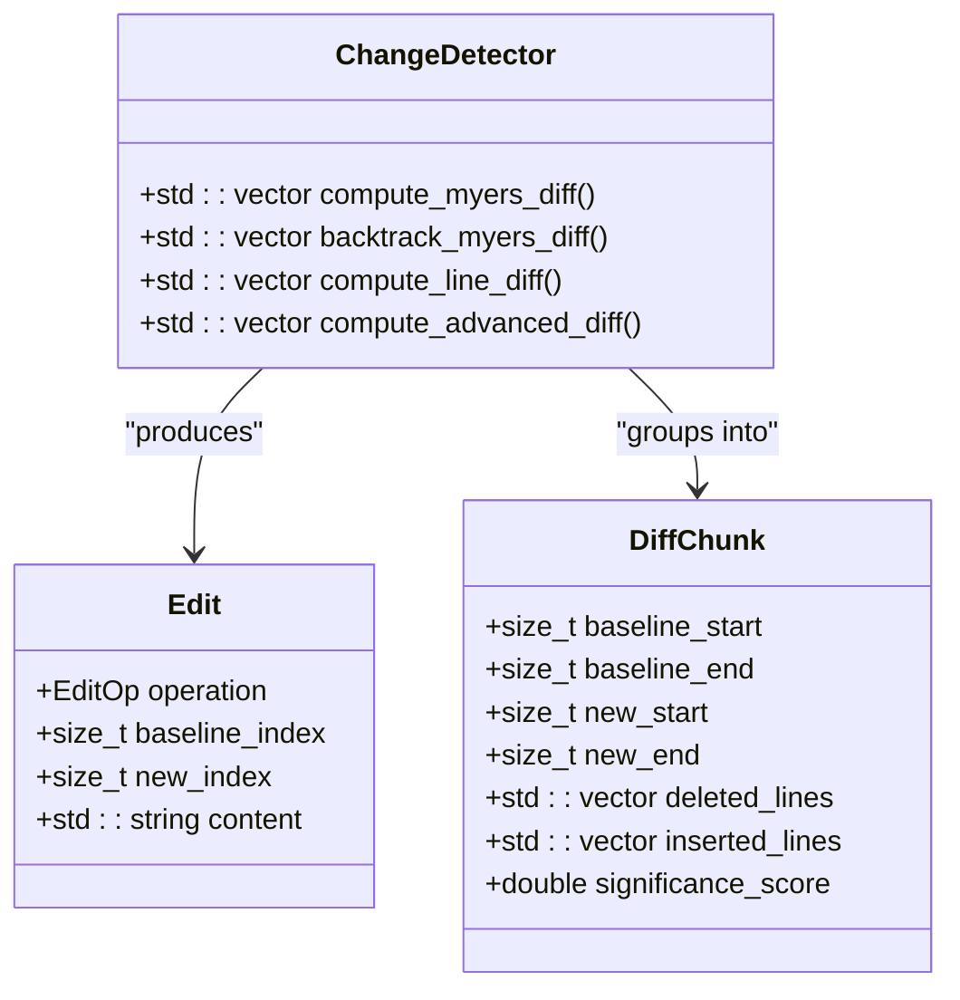
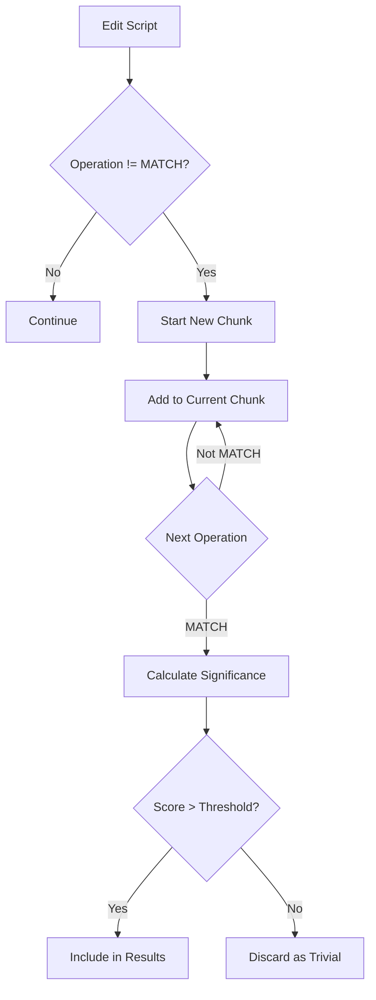
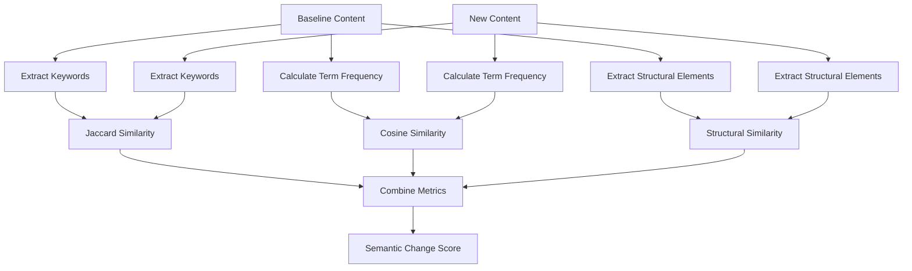
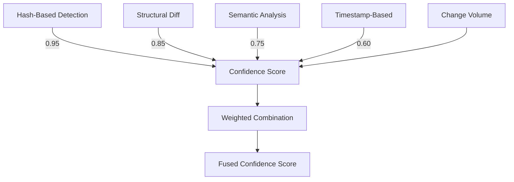

# Change Detection

<cite>
**Referenced Files in This Document**   
- [change_detector.hpp](file://regulatory_monitor/change_detector.hpp)
- [change_detector.cpp](file://regulatory_monitor/change_detector.cpp)
- [regulatory_monitor.hpp](file://regulatory_monitor/regulatory_monitor.hpp)
- [regulatory_monitor.cpp](file://regulatory_monitor/regulatory_monitor.cpp)
- [regulatory_source.hpp](file://regulatory_monitor/regulatory_source.hpp)
- [regulatory_source.cpp](file://regulatory_monitor/regulatory_source.cpp)
- [regulatory_knowledge_base.hpp](file://shared/regulatory_knowledge_base.hpp)
- [regulatory_knowledge_base.cpp](file://shared/regulatory_knowledge_base.cpp)
- [regulatory_change.hpp](file://shared/models/regulatory_change.hpp)
- [configuration_manager.hpp](file://shared/config/configuration_manager.hpp)
</cite>

## Table of Contents
1. [Introduction](#introduction)
2. [Multi-Layered Detection Algorithms](#multi-layered-detection-algorithms)
3. [Myers Diff Algorithm Implementation](#myers-diff-algorithm-implementation)
4. [Advanced Diff Chunk Analysis](#advanced-diff-chunk-analysis)
5. [Semantic Change Detection](#semantic-change-detection)
6. [Confidence Scoring System](#confidence-scoring-system)
7. [Significance Threshold Configuration](#significance-threshold-configuration)
8. [False Positive Mitigation](#false-positive-mitigation)
9. [Performance Optimization](#performance-optimization)
10. [Memory Management](#memory-management)

## Introduction

The Change Detection subsystem in Regulens is a sophisticated multi-layered system designed to identify and analyze regulatory document changes with high accuracy. The system employs a combination of hash-based, structural, and semantic detection methods to ensure comprehensive change detection while minimizing false positives. This documentation provides a detailed analysis of the implementation, focusing on the core algorithms, confidence scoring, and optimization strategies that enable reliable monitoring of regulatory updates.

**Section sources**
- [change_detector.hpp](file://regulatory_monitor/change_detector.hpp#L1-L395)
- [change_detector.cpp](file://regulatory_monitor/change_detector.cpp#L1-L1746)

## Multi-Layered Detection Algorithms

The Change Detection subsystem implements a multi-phase approach to identify regulatory document changes, combining three distinct detection methods:

1. **Hash-based detection**: Uses SHA-256 hashing to quickly identify content changes
2. **Structural diff analysis**: Employs the Myers diff algorithm for line-level comparison
3. **Semantic analysis**: Applies AI-powered techniques to assess the significance of changes

The detection process follows a cascading approach, starting with the fastest method and progressing to more sophisticated analysis only when necessary. This optimization ensures efficient processing while maintaining high detection accuracy.

**Diagram sources**
- [change_detector.cpp](file://regulatory_monitor/change_detector.cpp#L150-L250)
- [change_detector.hpp](file://regulatory_monitor/change_detector.hpp#L1-L395)

**Section sources**
- [change_detector.hpp](file://regulatory_monitor/change_detector.hpp#L1-L395)
- [change_detector.cpp](file://regulatory_monitor/change_detector.cpp#L1-L300)

## Myers Diff Algorithm Implementation

The Change Detection subsystem implements the Myers diff algorithm for optimal line-level comparison between document versions. This algorithm efficiently computes the shortest edit script required to transform the baseline document into the new version, identifying insertions, deletions, and replacements.

The implementation follows the O(ND) algorithm described by Eugene W. Myers, using a dynamic programming approach to find the longest common subsequence (LCS) between the two document versions. The algorithm operates in phases:

1. **Forward pass**: Computes the furthest reaching D-paths in the edit graph
2. **Backtracking**: Reconstructs the edit script from the computed paths
3. **Optimization**: Handles edge cases and provides fallback to line-by-line diff when necessary

The implementation includes several optimizations for regulatory document processing, such as handling large documents efficiently and providing detailed edit operations for analysis.

**Diagram sources**
- [change_detector.cpp](file://regulatory_monitor/change_detector.cpp#L600-L900)
- [change_detector.hpp](file://regulatory_monitor/change_detector.hpp#L1-L395)

**Section sources**
- [change_detector.cpp](file://regulatory_monitor/change_detector.cpp#L600-L900)
- [change_detector.hpp](file://regulatory_monitor/change_detector.hpp#L1-L395)

## Advanced Diff Chunk Analysis

After computing the edit script using the Myers algorithm, the system groups individual edits into meaningful chunks for significance scoring. This chunking process identifies related changes that appear together in the document, allowing for more accurate assessment of change impact.

Each diff chunk is analyzed for significance based on multiple factors:
- **Volume of change**: Number of lines modified
- **Content importance**: Presence of regulatory keywords
- **Change type**: Replacement vs. pure addition/deletion
- **Context**: Position within the document structure

The significance scoring algorithm combines these factors into a weighted score that determines whether a change is substantial enough to report. This approach helps filter out trivial changes like timestamp updates while highlighting meaningful regulatory modifications.

**Diagram sources**
- [change_detector.cpp](file://regulatory_monitor/change_detector.cpp#L900-L1200)
- [change_detector.hpp](file://regulatory_monitor/change_detector.hpp#L1-L395)

**Section sources**
- [change_detector.cpp](file://regulatory_monitor/change_detector.cpp#L900-L1200)
- [change_detector.hpp](file://regulatory_monitor/change_detector.hpp#L1-L395)

## Semantic Change Detection

The semantic change detection component analyzes the meaning and impact of document changes beyond simple text comparison. It employs multiple techniques to assess the significance of modifications:

1. **Keyword extraction**: Identifies regulatory terms and capitalized phrases that indicate important content
2. **Term frequency analysis**: Calculates TF-IDF style metrics to identify changes in important terminology
3. **Structural similarity**: Compares document organization and section headings
4. **Cosine similarity**: Measures semantic similarity between term frequency vectors

The system maintains a comprehensive list of regulatory keywords across various domains, including compliance, risk management, capital requirements, and enforcement. When changes affect these key terms, they receive higher significance scores. The semantic analysis also considers document structure, recognizing that changes to section headings or major organizational elements are more significant than modifications to body text.

**Diagram sources**
- [change_detector.cpp](file://regulatory_monitor/change_detector.cpp#L300-L600)
- [change_detector.hpp](file://regulatory_monitor/change_detector.hpp#L1-L395)

**Section sources**
- [change_detector.cpp](file://regulatory_monitor/change_detector.cpp#L300-L600)
- [change_detector.hpp](file://regulatory_monitor/change_detector.hpp#L1-L395)

## Confidence Scoring System

The Change Detection subsystem employs a sophisticated confidence scoring system that combines results from multiple detection methods. The overall confidence score ranges from 0.0 to 1.0 and is calculated using a weighted combination of structural and semantic analysis results.

The confidence calculation considers several factors:
- **Base confidence by method**: Hash-based detection has the highest base confidence (0.95), followed by structural diff (0.85), semantic analysis (0.75), and timestamp-based detection (0.60)
- **Change volume adjustment**: Larger changes receive slightly higher confidence adjustments
- **Consistency across methods**: When multiple methods agree on a change, confidence increases

The system also tracks detection statistics, including false positive rates and accuracy metrics, which can be used to fine-tune the confidence thresholds over time. This adaptive approach ensures the system maintains high accuracy as regulatory document patterns evolve.

**Diagram sources**
- [change_detector.cpp](file://regulatory_monitor/change_detector.cpp#L150-L250)
- [change_detector.hpp](file://regulatory_monitor/change_detector.hpp#L1-L395)

**Section sources**
- [change_detector.cpp](file://regulatory_monitor/change_detector.cpp#L150-L250)
- [change_detector.hpp](file://regulatory_monitor/change_detector.hpp#L1-L395)

## Significance Threshold Configuration

The Change Detection subsystem allows for configurable significance thresholds through the ConfigurationManager. These thresholds can be adjusted based on the regulatory domain, document type, or organizational requirements.

Key configurable parameters include:
- **Semantic threshold**: Minimum semantic change score (default: 0.3)
- **Minimum content length**: Documents shorter than this length are skipped (default: 50 characters)
- **Ignored patterns**: Regular expressions for content that should be ignored in diffs (timestamps, page numbers, etc.)

The system provides default ignored patterns for common regulatory document artifacts, including:
- Timestamps and dates
- Page metadata (page numbers, headers)
- Copyright and legal boilerplate
- HTML/Web artifacts (scripts, styles)
- Document IDs that change per version

These configuration options allow organizations to tune the sensitivity of change detection to their specific needs, reducing false positives while ensuring critical changes are not missed.

**Section sources**
- [change_detector.cpp](file://regulatory_monitor/change_detector.cpp#L150-L250)
- [configuration_manager.hpp](file://shared/config/configuration_manager.hpp#L1-L342)

## False Positive Mitigation

The Change Detection subsystem implements several strategies to minimize false positives in regulatory document updates:

1. **Content normalization**: Removes noise and insignificant changes before comparison
2. **Pattern-based filtering**: Uses configurable regular expressions to ignore common changing elements
3. **Multi-phase validation**: Requires both hash change and structural significance
4. **Semantic consistency checking**: Ensures changes are meaningful beyond text differences

The system specifically addresses common false positive scenarios in regulatory documents:
- **Timestamp updates**: Automatically ignored through pattern matching
- **Version number changes**: Filtered out as insignificant
- **Formatting changes**: Normalized during preprocessing
- **Boilerplate updates**: Excluded from significance calculation

When a hash change is detected but no significant structural changes are found, the system logs this as a potential false positive and does not generate change events. This conservative approach ensures that only meaningful regulatory changes trigger alerts and notifications.

**Section sources**
- [change_detector.cpp](file://regulatory_monitor/change_detector.cpp#L150-L250)
- [change_detector.hpp](file://regulatory_monitor/change_detector.hpp#L1-L395)

## Performance Optimization

The Change Detection subsystem includes several performance optimizations for handling large regulatory documents:

1. **Early termination**: Skips analysis for documents below minimum length
2. **Hash-first approach**: Uses fast hashing to quickly eliminate unchanged documents
3. **Incremental processing**: Processes documents in chunks when possible
4. **Efficient data structures**: Uses optimized containers for edit scripts and diff chunks

For large documents, the system prioritizes memory efficiency by:
- Processing lines incrementally rather than loading entire documents into memory
- Using move semantics to avoid unnecessary copying
- Implementing thread-safe operations with minimal locking

The implementation also includes comprehensive logging and monitoring to identify performance bottlenecks and optimize processing times for different document types and sizes.

**Section sources**
- [change_detector.cpp](file://regulatory_monitor/change_detector.cpp#L150-L250)
- [change_detector.hpp](file://regulatory_monitor/change_detector.hpp#L1-L395)

## Memory Management

The Change Detection subsystem employs careful memory management strategies for baseline storage and processing:

1. **Baseline storage**: Maintains baseline content and hashes in memory with thread-safe access
2. **Object pooling**: Reuses containers and data structures when possible
3. **RAII principles**: Ensures proper resource cleanup through destructors
4. **Atomic operations**: Uses atomic types for statistics counters

The system stores baseline content in hash maps with mutex protection, allowing concurrent access from multiple threads. Baseline storage includes:
- Content hashes for quick comparison
- Original content for detailed diff analysis
- Metadata for context and categorization

Memory usage is monitored through detection statistics, and the system provides a clear_baselines() method for testing and reset operations. This approach balances the need for quick access to baseline data with efficient memory utilization.

**Section sources**
- [change_detector.cpp](file://regulatory_monitor/change_detector.cpp#L150-L250)
- [change_detector.hpp](file://regulatory_monitor/change_detector.hpp#L1-L395)